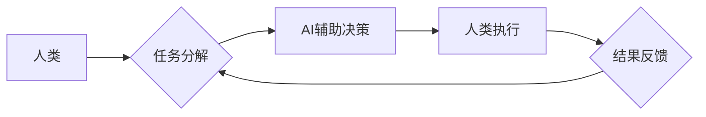

                 

## 人类-AI协作：增强人类智慧与AI能力的融合发展趋势预测分析机遇趋势分析

> 关键词：人工智能、人类-AI协作、智慧增强、AI能力、融合发展、趋势预测、机遇分析

## 1. 背景介绍

人工智能（AI）技术近年来发展迅速，已渗透到各行各业，深刻地改变着人类的生活方式和工作模式。从自动驾驶汽车到智能语音助手，从医疗诊断到金融风险评估，AI技术的应用场景日益广泛。然而，AI技术也面临着一些挑战，例如数据获取和处理、算法解释性和可信度、伦理道德等问题。

人类-AI协作作为一种新的工作模式，正逐渐成为解决这些挑战和推动AI技术更有效率、更安全、更可持续发展的关键。人类-AI协作是指人类和人工智能系统共同完成任务，充分发挥各自的优势，实现互补和协同。

## 2. 核心概念与联系

**2.1 核心概念**

* **人工智能 (AI):**  指机器能够模拟人类智能行为的能力，例如学习、推理、决策、感知和语言理解等。
* **人类智慧 (Human Intelligence):** 指人类独特的认知能力，包括创造力、批判性思维、情感智能和社会认知等。
* **协作 (Collaboration):** 指多个个体或系统共同努力，共享信息和资源，以实现共同目标。

**2.2 联系**

人类-AI协作的核心在于将人类的智慧和AI的智能能力相结合，形成一个更加强大的协同系统。

* **人类提供:** 
    * 创造力和想象力
    * 复杂问题解决能力
    * 伦理判断和道德指导
    * 情感理解和社交技能
* **AI提供:**
    * 海量数据处理和分析能力
    * 快速准确的计算和推理能力
    * 持续学习和自我改进能力
    * 自动化重复性任务的能力

**2.3 架构图**



## 3. 核心算法原理 & 具体操作步骤

**3.1 算法原理概述**

人类-AI协作的核心算法原理包括：

* **强化学习 (Reinforcement Learning):** AI系统通过与环境交互，学习最佳行为策略，以获得最大奖励。
* **迁移学习 (Transfer Learning):** AI系统将已学习到的知识和技能迁移到新的任务或领域，提高学习效率。
* **知识图谱 (Knowledge Graph):**  构建人类知识的结构化表示，帮助AI系统理解和推理复杂关系。

**3.2 算法步骤详解**

1. **任务分解:** 将复杂任务分解成多个子任务，并确定每个子任务的责任主体（人类或AI）。
2. **数据收集和预处理:** 收集相关数据，并进行清洗、转换和特征提取，为AI系统提供训练数据。
3. **模型训练:** 使用强化学习、迁移学习等算法，训练AI模型，使其能够完成指定子任务。
4. **AI辅助决策:** AI系统根据收集到的数据和模型预测，为人类提供决策建议。
5. **人类执行:** 人类根据AI建议和自身判断，执行任务。
6. **结果反馈:** 任务执行结果反馈给AI系统，用于模型评估和改进。

**3.3 算法优缺点**

* **优点:**
    * 提高效率和准确性
    * 增强人类决策能力
    * 拓展人类认知边界
* **缺点:**
    * 需要大量数据和计算资源
    * 算法解释性和可信度问题
    * 伦理道德和社会影响问题

**3.4 算法应用领域**

* **医疗保健:** AI辅助诊断、个性化治疗方案
* **金融服务:** 风险评估、欺诈检测、投资决策
* **教育:** 个性化学习、智能辅导
* **制造业:** 自动化生产、质量控制
* **交通运输:** 自动驾驶、交通流量优化

## 4. 数学模型和公式 & 详细讲解 & 举例说明

**4.1 数学模型构建**

人类-AI协作可以建模为一个多智能体系统，其中每个智能体（人类或AI）都有自己的目标和行为策略。

* **人类智能体:**  可以用一个决策函数来表示，该函数根据人类的知识、经验和情感，对环境做出决策。
* **AI智能体:** 可以用一个强化学习模型来表示，该模型通过与环境交互，学习最佳行为策略。

**4.2 公式推导过程**

假设人类智能体和AI智能体共同完成一个任务，目标是最大化任务完成的概率。

* **人类决策函数:**  $d_h(s) = f_h(s, k_h)$，其中 $d_h$ 是人类的决策， $s$ 是环境状态， $k_h$ 是人类的知识和经验。
* **AI行为策略:** $\pi(s) = argmax_a R(s, a)$，其中 $\pi$ 是AI的行为策略， $R$ 是奖励函数， $a$ 是AI的动作。

**4.3 案例分析与讲解**

例如，在自动驾驶汽车中，人类驾驶员和AI系统共同完成驾驶任务。

* **人类智能体:**  负责制定高层决策，例如目的地选择和路线规划。
* **AI智能体:**  负责控制车辆的低层动作，例如加速、减速和转向。

AI系统通过强化学习算法，学习驾驶环境的规则和最佳驾驶策略，并根据环境状态和人类驾驶员的指令，做出相应的控制动作。

## 5. 项目实践：代码实例和详细解释说明

**5.1 开发环境搭建**

* 操作系统: Ubuntu 20.04
* Python 版本: 3.8
* 必要的库: TensorFlow, PyTorch, NumPy, Pandas

**5.2 源代码详细实现**

```python
# 人类-AI协作示例代码

import numpy as np

# 模拟人类决策函数
def human_decision(state):
    # 根据人类的知识和经验，做出决策
    # ...

# 模拟AI行为策略
def ai_action(state):
    # 使用强化学习算法，学习最佳行为策略
    # ...

# 任务执行循环
while True:
    # 获取环境状态
    state = get_environment_state()

    # 人类决策
    human_action = human_decision(state)

    # AI辅助决策
    ai_action = ai_action(state)

    # 合并人类和AI决策
    combined_action = human_action + ai_action

    # 执行任务
    execute_task(combined_action)

    # 获取任务结果
    result = get_task_result()

    # 反馈结果给AI系统
    feedback_ai(result)
```

**5.3 代码解读与分析**

* 代码示例展示了人类-AI协作的基本流程，包括环境状态获取、人类决策、AI辅助决策、任务执行和结果反馈。
* 人类决策函数和AI行为策略可以根据具体任务和应用场景进行定制。
* 代码中使用了强化学习算法来训练AI系统，使其能够学习最佳行为策略。

**5.4 运行结果展示**

运行结果将取决于具体的任务和环境，例如自动驾驶汽车的运行结果将包括车辆的轨迹、速度和安全性能等指标。

## 6. 实际应用场景

**6.1 医疗保健**

* **AI辅助诊断:** AI系统可以分析患者的医疗影像数据，辅助医生进行疾病诊断。
* **个性化治疗方案:** AI系统可以根据患者的基因信息、生活方式和病史，制定个性化的治疗方案。

**6.2 金融服务**

* **风险评估:** AI系统可以分析客户的财务数据，评估其贷款风险。
* **欺诈检测:** AI系统可以识别异常交易行为，防止金融欺诈。

**6.3 教育**

* **个性化学习:** AI系统可以根据学生的学习进度和能力，提供个性化的学习内容和辅导。
* **智能辅导:** AI系统可以解答学生的疑问，提供学习建议。

**6.4 未来应用展望**

* **更智能的协作机器人:**  能够更好地理解人类指令，并协同人类完成复杂任务。
* **个性化医疗:** AI系统将能够提供更加精准的诊断和治疗方案。
* **智能城市:** AI系统将能够优化城市交通、能源管理和公共安全等方面。

## 7. 工具和资源推荐

**7.1 学习资源推荐**

* **书籍:**
    * 《深度学习》
    * 《人工智能：一种现代方法》
    * 《机器学习》
* **在线课程:**
    * Coursera: 人工智能课程
    * edX: 深度学习课程
    * Udacity: 机器学习工程师课程

**7.2 开发工具推荐**

* **TensorFlow:** 开源深度学习框架
* **PyTorch:** 开源深度学习框架
* **Scikit-learn:** 机器学习库

**7.3 相关论文推荐**

* **《Attention Is All You Need》**
* **《BERT: Pre-training of Deep Bidirectional Transformers for Language Understanding》**
* **《Generative Adversarial Networks》**

## 8. 总结：未来发展趋势与挑战

**8.1 研究成果总结**

人类-AI协作领域取得了显著进展，例如强化学习、迁移学习和知识图谱等算法取得了突破性进展，为人类-AI协作提供了强大的技术支撑。

**8.2 未来发展趋势**

* **更智能的AI系统:** AI系统将更加智能，能够更好地理解人类需求和意图。
* **更广泛的应用场景:** 人类-AI协作将应用于更多领域，例如医疗保健、教育、金融服务等。
* **更安全的协作环境:** 人类-AI协作将更加安全可靠，能够有效解决伦理道德和社会影响问题。

**8.3 面临的挑战**

* **算法解释性和可信度:**  提高AI算法的解释性和可信度，使其能够更好地被人类理解和信任。
* **数据隐私和安全:**  保障人类数据隐私和安全，防止数据滥用和泄露。
* **伦理道德和社会影响:**  研究和解决人类-AI协作带来的伦理道德和社会影响问题。

**8.4 研究展望**

未来，人类-AI协作将继续朝着更加智能、安全、可持续的方向发展。需要加强基础理论研究，开发更先进的算法和技术，并积极探索人类-AI协作的伦理道德和社会影响问题，为人类社会创造更加美好的未来。


## 9. 附录：常见问题与解答

**9.1 如何选择合适的AI协作工具？**

选择合适的AI协作工具需要根据具体的应用场景和需求进行评估。例如，对于需要处理大量图像数据的应用场景，可以选择基于深度学习的图像识别工具；对于需要进行自然语言处理的应用场景，可以选择基于自然语言处理技术的聊天机器人工具。

**9.2 如何保障人类数据隐私和安全？**

在人类-AI协作中，需要采取措施保障人类数据的隐私和安全，例如：

* 使用加密技术保护数据传输和存储。
* 采用匿名化技术处理敏感数据。
* 制定严格的数据使用和共享政策。

**9.3 如何解决AI算法的解释性和可信度问题？**

提高AI算法的解释性和可信度是一个重要的研究方向。一些可能的解决方案包括：

* 开发可解释的机器学习算法。
* 使用可视化技术解释AI模型的决策过程。
* 建立AI算法的信任机制。


作者：禅与计算机程序设计艺术 / Zen and the Art of Computer Programming 
<end_of_turn>

