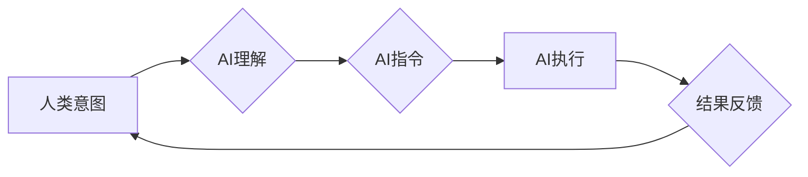

                 

## 人类意图对齐：AI 领域的挑战

> 关键词：人工智能、意图对齐、伦理、安全、可解释性、泛化能力、价值观

### 1. 背景介绍

人工智能（AI）技术近年来取得了飞速发展，从语音识别、图像处理到自然语言理解，AI已经渗透到我们生活的方方面面。然而，随着AI能力的增强，一个至关重要的问题逐渐浮出水面：如何确保AI的行为与人类的意图相一致？

人类意图对齐是指使人工智能系统能够理解和执行人类的意图，并确保其行为符合人类的价值观和道德规范。这是一个复杂而具有挑战性的问题，因为它涉及到认知科学、哲学、伦理学和计算机科学等多个领域。

### 2. 核心概念与联系

**2.1  人类意图**

人类意图是人类行为背后的动机和目标。它是一个复杂的、多层次的概念，包含着情感、信念、价值观和经验等多种因素。

**2.2  人工智能意图**

人工智能系统通常通过算法和数据来学习和执行任务。然而，与人类不同，AI系统没有明确的意识或情感，其“意图”更多地是基于其训练数据和算法的输出。

**2.3  意图对齐问题**

意图对齐问题在于如何使AI系统的“意图”与人类的意图相一致。这需要解决以下几个关键问题：

* 如何准确地理解人类的意图？
* 如何将人类的意图转化为AI系统可以理解的指令？
* 如何确保AI系统在执行任务时不会产生与人类意图不一致的行为？

**2.4  意图对齐的挑战**

* **复杂性:** 人类意图本身就非常复杂，难以被完全捕捉和理解。
* **主观性:** 人类意图往往具有主观性，不同的人对同一件事的理解可能会有所不同。
* **动态性:** 人类意图是动态变化的，随着环境和情境的改变，人类的意图也会发生变化。
* **安全风险:** 如果AI系统无法准确理解人类意图，可能会导致意图偏差，从而产生不可预知的风险。

**2.5  Mermaid 流程图**



### 3. 核心算法原理 & 具体操作步骤

**3.1  算法原理概述**

目前，针对人类意图对齐问题，研究者们提出了多种算法和方法，其中一些比较重要的算法包括：

* **强化学习 (Reinforcement Learning):** 通过奖励机制来训练AI系统，使其学习符合人类意图的行为。
* **逆向强化学习 (Inverse Reinforcement Learning):** 从人类的行为数据中学习人类的意图模型，并将其应用于AI系统的训练。
* **价值学习 (Value Learning):** 学习人类对不同行为的价值评估，并将其作为AI系统决策的参考。
* **符号人工智能 (Symbolic AI):** 使用符号和规则来表示人类的知识和意图，并将其应用于AI系统的推理和决策。

**3.2  算法步骤详解**

以强化学习为例，其核心步骤如下：

1. **环境建模:** 建立一个模拟人类意图的虚拟环境。
2. **奖励设计:** 设计一个奖励函数，将符合人类意图的行为奖励，而违背人类意图的行为惩罚。
3. **代理训练:** 使用强化学习算法训练AI代理，使其在虚拟环境中学习并执行符合人类意图的行为。
4. **评估和改进:** 对AI代理的行为进行评估，并根据评估结果调整奖励函数和训练参数，不断改进AI代理的性能。

**3.3  算法优缺点**

* **优点:** 能够学习复杂的人类意图，并生成符合人类意图的行为。
* **缺点:** 需要大量的训练数据和计算资源，并且难以保证AI代理在所有情况下都能准确理解和执行人类意图。

**3.4  算法应用领域**

* **机器人控制:** 使机器人能够更好地理解和响应人类的指令。
* **自然语言处理:** 使聊天机器人能够更自然地与人类进行对话。
* **自动驾驶:** 使自动驾驶汽车能够更好地理解道路环境和人类驾驶员的意图。

### 4. 数学模型和公式 & 详细讲解 & 举例说明

**4.1  数学模型构建**

人类意图可以抽象为一个状态空间，其中每个状态代表一个可能的意图。AI系统需要学习一个映射函数，将输入的感知信息映射到对应的意图状态。

**4.2  公式推导过程**

假设AI系统接收到的感知信息为 $x$，对应的意图状态为 $y$，则映射函数可以表示为：

$$y = f(x)$$

其中，$f$ 是一个复杂的函数，需要通过训练学习。

**4.3  案例分析与讲解**

例如，在自动驾驶场景中，AI系统接收到的感知信息包括道路状况、车辆位置、行人信息等。通过训练，AI系统可以学习一个映射函数，将这些感知信息映射到对应的驾驶意图，例如加速、减速、转向等。

### 5. 项目实践：代码实例和详细解释说明

**5.1  开发环境搭建**

* Python 3.x
* TensorFlow 或 PyTorch 等深度学习框架
* Jupyter Notebook 或 VS Code 等代码编辑器

**5.2  源代码详细实现**

```python
import tensorflow as tf

# 定义模型结构
model = tf.keras.Sequential([
    tf.keras.layers.Dense(128, activation='relu', input_shape=(input_dim,)),
    tf.keras.layers.Dense(64, activation='relu'),
    tf.keras.layers.Dense(output_dim, activation='softmax')
])

# 编译模型
model.compile(optimizer='adam',
              loss='categorical_crossentropy',
              metrics=['accuracy'])

# 训练模型
model.fit(x_train, y_train, epochs=10)

# 评估模型
loss, accuracy = model.evaluate(x_test, y_test)
print('Loss:', loss)
print('Accuracy:', accuracy)
```

**5.3  代码解读与分析**

* 该代码示例使用 TensorFlow 框架构建了一个简单的深度学习模型。
* 模型输入为感知信息 $x$，输出为意图状态 $y$。
* 模型使用两层全连接神经网络，并使用 softmax 函数进行输出层激活，将意图状态映射到概率分布。
* 模型使用 Adam 优化器进行训练，并使用交叉熵损失函数和准确率作为评估指标。

**5.4  运行结果展示**

训练完成后，可以将模型应用于新的感知信息，预测对应的意图状态。

### 6. 实际应用场景

**6.1  医疗保健**

* 辅助医生诊断疾病，预测患者的病情发展。
* 个性化治疗方案，根据患者的基因信息和生活习惯制定最佳治疗方案。

**6.2  教育**

* 个性化学习，根据学生的学习进度和能力提供个性化的学习内容和辅导。
* 自动批改作业，解放教师的时间，提高教学效率。

**6.3  金融**

* 风险评估，识别潜在的金融风险，降低投资损失。
* 欺诈检测，识别金融交易中的欺诈行为，保护用户资产安全。

**6.4  未来应用展望**

随着AI技术的不断发展，人类意图对齐将成为AI应用的基石，推动AI技术在更多领域得到应用，并为人类社会带来更多福祉。

### 7. 工具和资源推荐

**7.1  学习资源推荐**

* **书籍:**
    * 《人工智能：一种现代方法》 (Artificial Intelligence: A Modern Approach)
    * 《深度学习》 (Deep Learning)
* **在线课程:**
    * Coursera: 人工智能
    * edX: 深度学习
* **研究机构:**
    * OpenAI
    * DeepMind
    * Google AI

**7.2  开发工具推荐**

* **TensorFlow:** 开源深度学习框架
* **PyTorch:** 开源深度学习框架
* **Jupyter Notebook:** 代码编辑器和交互式笔记本

**7.3  相关论文推荐**

* **《强化学习: 人工智能的未来》 (Reinforcement Learning: An Introduction)**
* **《逆向强化学习: 从行为数据中学习人类意图》 (Inverse Reinforcement Learning: Learning Human Preferences from Behavior)**
* **《价值学习: 从人类行为中学习价值函数》 (Value Learning: Learning Value Functions from Human Behavior)**

### 8. 总结：未来发展趋势与挑战

**8.1  研究成果总结**

近年来，在人类意图对齐领域取得了显著进展，例如强化学习、逆向强化学习和价值学习等算法取得了令人瞩目的成果。

**8.2  未来发展趋势**

* **更强大的模型:** 研究更强大的AI模型，能够更好地理解和模拟人类的复杂意图。
* **更有效的训练方法:** 开发更有效的训练方法，降低训练成本，提高训练效率。
* **更可解释的模型:** 研究更可解释的AI模型，使人类能够更好地理解AI系统的决策过程。

**8.3  面临的挑战**

* **数据稀缺:** 人类意图数据往往稀缺，难以收集和标注。
* **伦理问题:** 人类意图对齐涉及到伦理问题，例如AI系统是否应该拥有自己的意图，AI系统如何处理与人类意图冲突的情况。
* **安全风险:** 如果AI系统无法准确理解人类意图，可能会导致意图偏差，从而产生不可预知的风险。

**8.4  研究展望**

人类意图对齐是一个长期而复杂的挑战，需要多学科的合作和努力。未来，我们将继续探索新的算法和方法，以实现更安全、更可靠、更可解释的人工智能。

### 9. 附录：常见问题与解答

**9.1  Q: 如何确保AI系统不会产生与人类意图不一致的行为？**

**A:** 这是一个非常重要的问题。目前，没有一个完美的解决方案，但我们可以通过以下方法来降低风险：

* **设计安全的奖励函数:** 奖励函数是强化学习算法的核心，需要精心设计，确保AI系统不会被误导，产生与人类意图不一致的行为。
* **使用监督学习:** 在训练AI系统时，可以使用监督学习方法，将人类标注的意图数据作为训练样本，引导AI系统学习符合人类意图的行为。
* **进行严格的测试和评估:** 在部署AI系统之前，需要进行严格的测试和评估，确保其能够在各种情况下准确理解和执行人类意图。

**9.2  Q: 人类意图对齐与伦理问题有什么关系？**

**A:** 人类意图对齐与伦理问题密切相关。例如，如果AI系统被设计成具有“自我保护”的意图，它可能会在执行任务时优先考虑自身的利益，而忽略人类的利益。因此，在设计和训练AI系统时，需要考虑伦理问题，确保AI系统能够符合人类的价值观和道德规范。


作者：禅与计算机程序设计艺术 / Zen and the Art of Computer Programming 
<end_of_turn>

