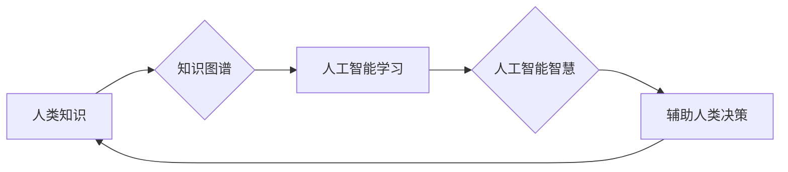

                 

## 人类的知识与智慧：相互促进的伙伴

> 关键词：人工智能、知识图谱、机器学习、深度学习、自然语言处理、人类智慧、知识共享、协同进化

## 1. 背景介绍

人类文明的进步离不开知识的积累和智慧的传承。从古至今，人类不断探索世界，积累经验，形成各种知识体系，并通过智慧的应用，创造出文明的奇迹。而随着科技的飞速发展，特别是人工智能技术的蓬勃兴起，人类与知识、智慧的互动关系迎来了新的变革。

人工智能作为模拟人类智能的计算机系统，正在以惊人的速度发展，其核心是通过算法和数据来学习和解决问题。然而，人工智能的进步离不开人类知识的输入和引导。人类的知识经验、认知模式、创造力等都是人工智能学习和进化的重要源泉。

另一方面，人工智能技术也为人类知识的获取、组织和应用提供了新的工具和手段。例如，知识图谱技术可以帮助人类构建和管理庞大的知识体系，自然语言处理技术可以帮助人类更便捷地获取和理解信息，深度学习技术可以帮助人类发现隐藏在海量数据中的知识和规律。

因此，人类知识与人工智能智慧的相互促进，将共同推动人类文明的进步。

## 2. 核心概念与联系

### 2.1 人类知识

人类知识是指人类通过感知、思考、学习和经验积累而获得的关于世界、自身和社会的一切信息和理解。它包含了各种形式，例如：

* **事实知识:** 关于客观事物的描述和定义，例如“地球绕太阳公转”。
* **概念知识:** 对事物本质特征的抽象概括，例如“动物”的概念。
* **规则知识:** 描述事物之间关系的规律，例如“水沸腾的温度是100摄氏度”。
* **技能知识:** 如何完成特定任务的步骤和方法，例如“骑自行车”的技能。

### 2.2 人工智能智慧

人工智能智慧是指人工智能系统通过学习和推理而获得的能力，例如：

* **学习能力:** 从数据中学习知识和规律，例如机器学习算法。
* **推理能力:** 根据已知知识推断未知信息，例如逻辑推理算法。
* **决策能力:** 在给定条件下做出最佳选择，例如强化学习算法。
* **创造能力:** 生成新的知识、想法和作品，例如生成式对抗网络。

### 2.3 知识图谱

知识图谱是一种数据结构，用于表示和组织知识。它以实体和关系为基本单元，将知识表示为网络结构，可以有效地存储、检索和推理知识。

### 2.4 核心概念联系

人工智能系统可以通过学习知识图谱中的知识，获得人类知识的结构化表示和推理能力。而人类可以通过利用人工智能系统对知识进行分析和挖掘，获得更深入的理解和新的发现。

**Mermaid 流程图**



## 3. 核心算法原理 & 具体操作步骤

### 3.1 算法原理概述

知识图谱构建和推理的核心算法主要包括：

* **知识抽取:** 从文本数据中提取实体和关系，构建知识图谱的基本单元。
* **关系推理:** 基于已有的知识关系，推断出新的知识关系。
* **知识表示:** 将知识以结构化的形式表示，例如RDF、OWL等。

### 3.2 算法步骤详解

**知识抽取算法步骤:**

1. **文本预处理:** 对文本进行清洗、分词、词性标注等处理，提取语义信息。
2. **实体识别:** 利用自然语言处理技术识别文本中的实体，例如人名、地名、机构名等。
3. **关系识别:** 分析文本中的句子结构和语义关系，识别实体之间的关系，例如“张三工作于百度”。
4. **知识表示:** 将提取的实体和关系以结构化的形式表示，例如知识图谱中的节点和边。

**关系推理算法步骤:**

1. **知识表示转换:** 将知识图谱中的知识表示转换为适合推理的格式，例如逻辑形式。
2. **推理规则定义:** 定义一系列推理规则，用于推断新的知识关系。
3. **推理执行:** 利用推理规则对知识图谱进行推理，推断出新的知识关系。

### 3.3 算法优缺点

**优点:**

* 可以有效地组织和管理知识。
* 可以支持知识的推理和发现。
* 可以促进知识的共享和传播。

**缺点:**

* 知识抽取和关系推理的准确性仍然存在挑战。
* 知识图谱的规模和复杂性不断增加，维护和更新难度较大。

### 3.4 算法应用领域

* **搜索引擎:** 构建知识图谱可以帮助搜索引擎理解用户查询的意图，提供更精准的搜索结果。
* **问答系统:** 知识图谱可以为问答系统提供知识背景，提高问答的准确性和自然度。
* **推荐系统:** 知识图谱可以帮助推荐系统理解用户的兴趣和偏好，提供更个性化的推荐。
* **医疗诊断:** 知识图谱可以帮助医生诊断疾病，提供更精准的治疗方案。

## 4. 数学模型和公式 & 详细讲解 & 举例说明

### 4.1 数学模型构建

知识图谱可以表示为一个三元组的集合：

$$
\mathcal{K} = \{ (h, r, t) | h, t \in \mathcal{E}, r \in \mathcal{R} \}
$$

其中：

* $\mathcal{K}$ 表示知识图谱。
* $\mathcal{E}$ 表示实体集合。
* $\mathcal{R}$ 表示关系集合。
* $(h, r, t)$ 表示一个三元组，其中 $h$ 是主语实体，$r$ 是关系，$t$ 是宾语实体。

### 4.2 公式推导过程

关系推理可以使用逻辑规则进行推导。例如，如果知识图谱中包含以下三元组：

* $(张三, 工作于, 百度)$
* $(百度, 公司类型, 科技公司)$

我们可以推断出以下新的三元组：

* $(张三, 工作于, 科技公司)$

### 4.3 案例分析与讲解

**案例:**

假设我们有一个知识图谱，包含以下三元组：

* $(猫, 是, 动物)$
* $(狗, 是, 动物)$
* $(动物, 具有, 毛发)$

我们可以使用关系推理推断出以下新的三元组：

* $(猫, 具有, 毛发)$
* $(狗, 具有, 毛发)$

**解释:**

因为“猫”和“狗”都是“动物”，而“动物”具有“毛发”，所以我们可以推断出“猫”和“狗”也具有“毛发”。

## 5. 项目实践：代码实例和详细解释说明

### 5.1 开发环境搭建

* Python 3.x
* spaCy 自然语言处理库
* NetworkX 图论库
* RDFlib RDF 数据处理库

### 5.2 源代码详细实现

```python
import spacy
import networkx as nx
from rdflib import Graph, Literal, URIRef

# 加载 spaCy 模型
nlp = spacy.load("en_core_web_sm")

# 定义实体和关系
entities = {"人": [], "地点": [], "机构": []}
relations = {"工作于": [], "居住于": []}

# 知识抽取
def extract_knowledge(text):
    doc = nlp(text)
    for ent in doc.ents:
        if ent.label_ in entities:
            entities[ent.label_].append(ent.text)
    for token in doc:
        if token.dep_ in relations:
            relations[token.dep_].append((token.head.text, token.text))

# 构建知识图谱
def build_knowledge_graph(entities, relations):
    g = nx.DiGraph()
    for entity_type, entities_list in entities.items():
        for entity in entities_list:
            g.add_node(entity, type=entity_type)
    for relation, pairs in relations.items():
        for subject, object in pairs:
            g.add_edge(subject, object, relation=relation)
    return g

# 知识推理
def infer_knowledge(g):
    # TODO: 实现关系推理算法
    pass

# 保存知识图谱
def save_knowledge_graph(g, filename):
    g.to_dot(filename)

# 示例代码
text = "张三工作于百度，居住于北京。"
extract_knowledge(text)
g = build_knowledge_graph(entities, relations)
infer_knowledge(g)
save_knowledge_graph(g, "knowledge_graph.dot")
```

### 5.3 代码解读与分析

* 代码首先加载 spaCy 模型，并定义实体和关系的字典。
* 然后，`extract_knowledge()` 函数对文本进行知识抽取，提取实体和关系。
* `build_knowledge_graph()` 函数将提取的知识构建成知识图谱。
* `infer_knowledge()` 函数实现关系推理算法，推断新的知识关系。
* 最后，`save_knowledge_graph()` 函数将知识图谱保存为 DOT 格式文件。

### 5.4 运行结果展示

运行代码后，将生成一个名为 `knowledge_graph.dot` 的 DOT 格式文件，可以使用 Graphviz 工具将其可视化。

## 6. 实际应用场景

### 6.1 搜索引擎

知识图谱可以帮助搜索引擎理解用户查询的意图，提供更精准的搜索结果。例如，如果用户查询“苹果公司”，搜索引擎可以利用知识图谱中的信息，返回苹果公司的相关信息，例如公司简介、产品列表、创始人等。

### 6.2 问答系统

知识图谱可以为问答系统提供知识背景，提高问答的准确性和自然度。例如，如果用户问“地球的直径是多少？”，问答系统可以利用知识图谱中的信息，返回地球的直径为12742公里。

### 6.3 推荐系统

知识图谱可以帮助推荐系统理解用户的兴趣和偏好，提供更个性化的推荐。例如，如果用户喜欢看科幻电影，推荐系统可以利用知识图谱中的信息，推荐其他科幻电影、科幻书籍、科幻游戏等。

### 6.4 未来应用展望

随着人工智能技术的不断发展，知识图谱将在更多领域得到应用，例如：

* **医疗诊断:** 知识图谱可以帮助医生诊断疾病，提供更精准的治疗方案。
* **教育教学:** 知识图谱可以帮助学生学习知识，提高学习效率。
* **法律法规:** 知识图谱可以帮助律师解读法律法规，提供更专业的法律服务。

## 7. 工具和资源推荐

### 7.1 学习资源推荐

* **Stanford Encyclopedia of Philosophy:** https://plato.stanford.edu/
* **MIT OpenCourseWare:** https://ocw.mit.edu/
* **Coursera:** https://www.coursera.org/

### 7.2 开发工具推荐

* **spaCy:** https://spacy.io/
* **NetworkX:** https://networkx.org/
* **RDFlib:** https://rdflib.readthedocs.io/en/stable/

### 7.3 相关论文推荐

* **Knowledge Graphs:** https://arxiv.org/abs/1901.03478
* **Deep Learning for Knowledge Graph Completion:** https://arxiv.org/abs/1706.06102

## 8. 总结：未来发展趋势与挑战

### 8.1 研究成果总结

近年来，人工智能和知识图谱领域取得了显著进展，为人类知识的获取、组织和应用提供了新的工具和手段。

### 8.2 未来发展趋势

* **知识图谱规模和复杂性将不断增加:** 未来，知识图谱将包含更丰富、更复杂的知识，需要开发更强大的算法和技术来处理。
* **知识图谱的跨领域融合将更加深入:** 未来，不同领域的知识图谱将更加融合，形成更加完整的知识体系。
* **知识图谱的应用场景将更加广泛:** 未来，知识图谱将应用于更多领域，例如医疗、教育、法律等。

### 8.3 面临的挑战

* **知识抽取和关系推理的准确性仍然存在挑战:** 需要开发更先进的算法和技术来提高知识抽取和关系推理的准确性。
* **知识图谱的维护和更新难度较大:** 需要开发更有效的知识图谱维护和更新机制。
* **知识图谱的安全性与隐私保护:** 需要开发更有效的知识图谱安全性与隐私保护机制。

### 8.4 研究展望

未来，人工智能和知识图谱领域将继续发展，为人类社会带来更多福祉。我们需要继续加强研究，克服挑战，推动人工智能和知识图谱技术的进步。

## 9. 附录：常见问题与解答

**Q1: 知识图谱和数据库有什么区别？**

**A1:** 知识图谱和数据库都是用于存储和管理数据的结构化方式，但它们在数据表示和应用场景上有所不同。数据库通常用于存储结构化数据，例如表格数据，而知识图谱则用于存储知识，以实体和关系的形式表示。

**Q2: 如何构建知识图谱？**

**A2:** 构建知识图谱需要进行知识抽取、关系推理和知识表示等步骤。可以使用自然语言处理技术进行知识抽取，使用逻辑规则进行关系推理，使用 RDF 等格式进行知识表示。

**Q3: 知识图谱有哪些应用场景？**

**A3:** 知识图谱的应用场景非常广泛，例如搜索引擎、问答系统、推荐系统、医疗诊断、教育教学等。


作者：禅与计算机程序设计艺术 / Zen and the Art of Computer Programming 
<end_of_turn>

