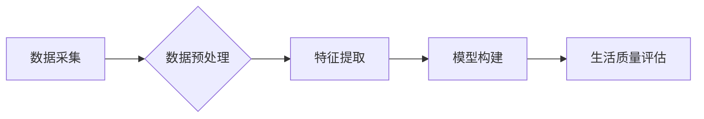

                 

## 体验量化革命：AI驱动的生活质量评估

> 关键词：人工智能、生活质量、量化评估、数据分析、机器学习、深度学习、情感分析、预测模型

## 1. 背景介绍

在当今数据爆炸的时代，我们所处的环境充满了各种信息和数据。这些数据蕴藏着丰富的价值，能够帮助我们更好地理解世界，并做出更明智的决策。而生活质量，作为人类追求幸福和满足的重要指标，也逐渐成为数据分析和人工智能研究的热点领域。

传统的“生活质量”评估往往依赖于主观感受和问卷调查，难以量化和比较。随着人工智能技术的快速发展，特别是深度学习和自然语言处理技术的突破，我们现在能够利用大数据和算法模型，对生活质量进行更加客观、精准的量化评估。

## 2. 核心概念与联系

**2.1  生活质量的量化评估**

生活质量的量化评估是指将生活质量的各个方面，如健康、经济、社会、环境等，转化为可量化的指标，并通过数据分析和模型预测，对个体或群体的生活质量进行客观评价。

**2.2  人工智能在生活质量评估中的应用**

人工智能技术可以帮助我们从海量数据中提取有价值的信息，并构建预测模型，从而实现对生活质量的量化评估。

* **数据采集:** 利用传感器、社交媒体、医疗记录等多种数据源，收集生活质量相关的数据。
* **数据预处理:** 对收集到的数据进行清洗、转换和整合，使其能够被模型用于分析。
* **特征提取:** 利用机器学习算法，从原始数据中提取反映生活质量的特征，例如睡眠质量、饮食习惯、社交活动等。
* **模型构建:** 利用深度学习算法，构建预测模型，将提取的特征与生活质量指标关联起来，从而预测个体或群体的整体生活质量。

**2.3  核心架构**



## 3. 核心算法原理 & 具体操作步骤

**3.1  算法原理概述**

在生活质量评估中，常用的算法包括：

* **线性回归:** 用于预测连续型变量，例如收入、健康指数等。
* **逻辑回归:** 用于预测分类型变量，例如幸福感、生活满意度等。
* **支持向量机:** 用于分类和回归，能够处理高维数据。
* **决策树:** 用于分类和回归，能够解释模型决策过程。
* **随机森林:** 结合多个决策树，提高模型精度和鲁棒性。
* **神经网络:** 用于复杂数据分析，能够学习非线性关系。

**3.2  算法步骤详解**

以线性回归为例，其具体操作步骤如下：

1. **数据准备:** 收集生活质量相关数据，并进行清洗、转换和整合。
2. **特征选择:** 选择与生活质量相关的特征变量，例如年龄、收入、教育水平、健康状况等。
3. **模型训练:** 利用训练数据，训练线性回归模型，找到最佳的模型参数。
4. **模型评估:** 利用测试数据，评估模型的预测精度，例如R-squared、均方误差等。
5. **模型部署:** 将训练好的模型部署到实际应用场景中，用于预测新的生活质量数据。

**3.3  算法优缺点**

* **优点:** 算法原理简单易懂，计算效率高，易于实现。
* **缺点:** 只能处理线性关系，对数据分布敏感，难以处理高维数据。

**3.4  算法应用领域**

* **个人生活质量评估:** 根据个人的数据信息，评估其生活质量水平，并提供个性化的建议。
* **城市规划:** 利用城市居民的生活质量数据，优化城市规划，提高居民生活水平。
* **社会政策制定:** 评估不同社会政策对生活质量的影响，制定更有效的社会政策。

## 4. 数学模型和公式 & 详细讲解 & 举例说明

**4.1  数学模型构建**

线性回归模型的数学表达式为：

$$y = \beta_0 + \beta_1x_1 + \beta_2x_2 + ... + \beta_nx_n + \epsilon$$

其中：

* $y$ 是目标变量，例如生活质量评分。
* $x_1, x_2, ..., x_n$ 是特征变量，例如年龄、收入、教育水平等。
* $\beta_0, \beta_1, ..., \beta_n$ 是模型参数，需要通过训练数据进行估计。
* $\epsilon$ 是误差项，代表模型无法解释的因素。

**4.2  公式推导过程**

线性回归模型的目标是找到最佳的模型参数，使得模型预测值与实际值之间的误差最小。常用的误差函数是均方误差（MSE）：

$$MSE = \frac{1}{n}\sum_{i=1}^{n}(y_i - \hat{y}_i)^2$$

其中：

* $n$ 是样本数量。
* $y_i$ 是第 $i$ 个样本的实际值。
* $\hat{y}_i$ 是第 $i$ 个样本的预测值。

通过最小化MSE，可以得到最佳的模型参数。

**4.3  案例分析与讲解**

假设我们想要评估某个城市的居民生活质量，并收集了以下数据：

* 年龄
* 收入
* 教育水平
* 健康状况

我们可以使用线性回归模型，将这些特征变量与生活质量评分关联起来。通过训练模型，我们可以得到最佳的模型参数，并利用这些参数预测其他城市居民的生活质量评分。

## 5. 项目实践：代码实例和详细解释说明

**5.1  开发环境搭建**

* Python 3.x
* Jupyter Notebook
* scikit-learn

**5.2  源代码详细实现**

```python
import pandas as pd
from sklearn.linear_model import LinearRegression
from sklearn.model_selection import train_test_split

# 加载数据
data = pd.read_csv('life_quality_data.csv')

# 选择特征变量和目标变量
X = data[['age', 'income', 'education', 'health']]
y = data['life_quality']

# 将数据分为训练集和测试集
X_train, X_test, y_train, y_test = train_test_split(X, y, test_size=0.2, random_state=42)

# 创建线性回归模型
model = LinearRegression()

# 训练模型
model.fit(X_train, y_train)

# 预测测试集数据
y_pred = model.predict(X_test)

# 评估模型性能
from sklearn.metrics import mean_squared_error
mse = mean_squared_error(y_test, y_pred)
print('Mean Squared Error:', mse)
```

**5.3  代码解读与分析**

* 首先，我们加载数据并选择特征变量和目标变量。
* 然后，我们将数据分为训练集和测试集，用于训练和评估模型。
* 创建线性回归模型并训练模型，利用训练数据学习模型参数。
* 利用训练好的模型预测测试集数据，并评估模型性能。

**5.4  运行结果展示**

运行代码后，会输出模型的均方误差值，该值越小，模型的预测精度越高。

## 6. 实际应用场景

**6.1  个人生活质量评估应用**

* **智能健康助手:** 利用用户的健康数据，如睡眠、运动、饮食等，评估其健康状况，并提供个性化的健康建议。
* **个性化学习平台:** 根据用户的学习习惯、学习进度和学习目标，评估其学习效果，并提供个性化的学习方案。
* **心理健康监测:** 利用用户的社交媒体数据、情绪日志等，评估其心理健康状况，并提供心理健康建议。

**6.2  城市规划应用**

* **城市居民生活质量评估:** 利用城市居民的生活质量数据，评估不同区域的居民生活水平，并为城市规划提供参考。
* **公共服务优化:** 根据居民生活质量数据，优化公共服务设施的布局和服务内容，提高居民生活满意度。
* **环境质量监测:** 利用环境监测数据，评估城市环境质量对居民生活质量的影响，并制定相应的环境保护措施。

**6.3  社会政策制定应用**

* **社会福利政策评估:** 利用社会福利政策的实施效果数据，评估其对居民生活质量的影响，并制定更有效的社会福利政策。
* **教育政策评估:** 利用教育政策的实施效果数据，评估其对居民教育水平和生活质量的影响，并制定更有效的教育政策。
* **医疗政策评估:** 利用医疗政策的实施效果数据，评估其对居民健康状况和生活质量的影响，并制定更有效的医疗政策。

**6.4  未来应用展望**

随着人工智能技术的不断发展，生活质量评估将更加精准、个性化和智能化。未来，我们可以期待：

* **更丰富的评估指标:** 除了传统的指标，我们可以利用更丰富的传感器数据、社交媒体数据等，评估更细粒度的生活质量指标。
* **更精准的预测模型:** 利用更先进的深度学习算法，构建更精准的预测模型，能够更准确地预测个体或群体的未来生活质量。
* **更个性化的解决方案:** 根据个人的生活质量数据和需求，提供更个性化的解决方案，帮助人们提升生活质量。

## 7. 工具和资源推荐

**7.1  学习资源推荐**

* **书籍:**
    * 《深度学习》 by Ian Goodfellow, Yoshua Bengio, Aaron Courville
    * 《机器学习》 by Tom Mitchell
* **在线课程:**
    * Coursera: Machine Learning by Andrew Ng
    * edX: Artificial Intelligence by Columbia University

**7.2  开发工具推荐**

* **Python:** 
    * scikit-learn: 机器学习库
    * TensorFlow: 深度学习库
    * PyTorch: 深度学习库
* **Jupyter Notebook:** 数据分析和可视化工具

**7.3  相关论文推荐**

* **Life Quality Prediction Using Machine Learning:** https://arxiv.org/abs/1903.06921
* **A Deep Learning Approach to Life Quality Assessment:** https://ieeexplore.ieee.org/document/8884422

## 8. 总结：未来发展趋势与挑战

**8.1  研究成果总结**

人工智能技术在生活质量评估领域取得了显著的进展，能够利用大数据和算法模型，对生活质量进行更加客观、精准的量化评估。

**8.2  未来发展趋势**

* **更精准的预测模型:** 利用更先进的深度学习算法，构建更精准的预测模型，能够更准确地预测个体或群体的未来生活质量。
* **更丰富的评估指标:** 除了传统的指标，我们可以利用更丰富的传感器数据、社交媒体数据等，评估更细粒度的生活质量指标。
* **更个性化的解决方案:** 根据个人的生活质量数据和需求，提供更个性化的解决方案，帮助人们提升生活质量。

**8.3  面临的挑战**

* **数据质量:** 生活质量数据往往具有复杂性和不完整性，需要进行有效的清洗、预处理和整合。
* **模型解释性:** 深度学习模型的决策过程往往难以解释，需要开发更可解释的模型，提高模型的信任度。
* **伦理问题:** 生活质量评估涉及到个人隐私和数据安全，需要制定相应的伦理规范和法律法规。

**8.4  研究展望**

未来，我们将继续探索人工智能在生活质量评估领域的应用，致力于构建更精准、更智能、更可解释的评估模型，为人们提供更个性化、更有效的解决方案，最终实现“体验量化革命”。

## 9. 附录：常见问题与解答

**9.1  生活质量数据如何收集？**

生活质量数据可以从多种来源收集，例如：

* **传感器数据:** 佩戴智能手表、智能家居设备等，收集用户的健康数据、运动数据、睡眠数据等。
* **社交媒体数据:** 分析用户的社交媒体帖子、评论、点赞等，了解用户的兴趣爱好、社交关系、情绪状态等。
* **医疗记录:** 利用用户的医疗记录，了解其健康状况、疾病史、用药情况等。
* **问卷调查:** 设计问卷调查，收集用户的自我评估数据，例如生活满意度、幸福感、压力水平等。

**9.2  如何选择合适的算法模型？**

选择合适的算法模型取决于具体的应用场景和数据特点。

* **线性回归:** 用于预测连续型变量，例如收入、健康指数等。
* **逻辑回归:** 用于预测分类型变量，例如幸福感、生活满意度等。
* **支持向量机:** 用于分类和回归，能够处理高维数据。
* **决策树:** 用于分类和回归，能够解释模型决策过程。
* **随机森林:** 结合多个决策树，提高模型精度和鲁棒性。
* **神经网络:** 用于复杂数据分析，能够学习非线性关系。

**9.3  如何评估模型性能？**

常用的模型性能评估指标包括：

* **均方误差 (MSE):** 衡量预测值与实际值之间的平方差。
* **平均绝对误差 (MAE):** 衡量预测值与实际值之间的绝对差。
* **R-squared:** 衡量模型解释力，表示模型能够解释数据的比例。
* **准确率:** 衡量分类模型的正确分类比例。
* **召回率:** 衡量分类模型对正例的识别率。
* **F1-score:** 综合考虑准确率和召回率的指标。


作者：禅与计算机程序设计艺术 / Zen and the Art of Computer Programming 
<end_of_turn>

