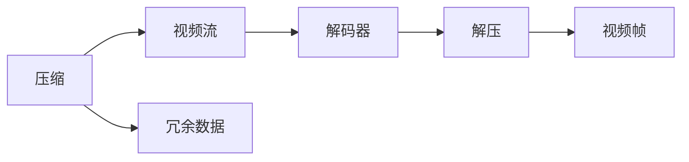
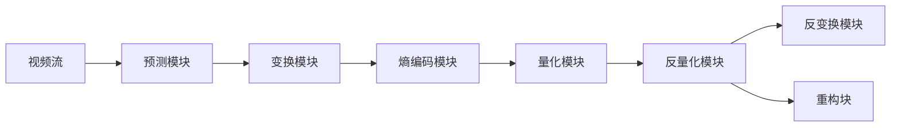

                 

# HEVC 解码：高效视频解码

> 关键词：HEVC, 视频解码, 高效压缩, 视频处理, 视频流, 硬件加速

## 1. 背景介绍

随着视频技术在数字媒体、实时通讯、教育娱乐等领域的广泛应用，对视频解码的高效性和实时性提出了更高的要求。HEVC（High Efficiency Video Coding），即高效视频编码标准，是继H.264之后的下一代视频编码标准，旨在通过更复杂的编码机制，实现更高的压缩比和更好的压缩效率。

HEVC通过引入空间域和变换域的多样化预测、基于块的预测、帧内预测优化、帧间预测优化、自适应码率控制等技术，对H.264进行了全面升级。这些技术的引入，使得HEVC在保持高质量图像的同时，将视频流的体积压缩到H.264的2倍以上，极大地提升了视频传输和存储的效率。

本文章将深入介绍HEVC解码的原理和具体操作步骤，并通过数学模型和代码实例，帮助读者系统地理解HEVC解码技术，掌握其实现细节，以便于在实际应用中灵活使用。

## 2. 核心概念与联系

### 2.1 核心概念概述

HEVC解码是HEVC视频压缩编码标准中的一部分，负责将压缩后的视频流恢复到原始视频帧的过程。为了更好地理解HEVC解码技术，首先需要介绍一些核心概念和相关技术：

- **HEVC**：高效视频编码标准，主要特点包括64x64像素的块大小、帧间预测优化、基于变换域的编码等。
- **解码器**：视频解码器负责将压缩的视频流解压缩成视频帧，是视频处理的核心模块。
- **压缩**：通过减少冗余信息，将原始视频帧数据压缩成更小的格式。
- **解压**：解码器将压缩后的视频流恢复成原始视频帧数据，实现数据的重构。
- **硬件加速**：通过专用硬件实现解码任务，提高解码效率。

### 2.2 核心概念原理和架构的 Mermaid 流程图(Mermaid 流程节点中不要有括号、逗号等特殊字符)



这个流程图展示了从压缩到解压的过程，其中压缩指的是原始视频帧经过编码器压缩后的过程，解压是指解码器将压缩后的视频流解压缩成原始视频帧的过程。解码器将冗余数据从视频流中去除，重构出视频帧。

## 3. 核心算法原理 & 具体操作步骤

### 3.1 算法原理概述

HEVC解码器接收压缩后的视频流作为输入，通过解码算法将视频流恢复到原始视频帧。解码过程分为三个主要步骤：帧头解析、解码和重构。以下是对这三个步骤的详细介绍。

### 3.2 算法步骤详解

#### 3.2.1 帧头解析

帧头包含视频流的关键信息，如解码器所使用的算法、视频帧的宽度和高度、帧率和分辨率等。帧头解析器从视频流中读取帧头信息，并将其存储在帧信息结构体中，以便后续解码。

帧头解析的流程图如下：


#### 3.2.2 解码

解码器依据帧信息结构体中的参数，对压缩后的视频流进行解压缩，生成重构的视频帧。HEVC解码器主要包括预测模块、变换模块、熵编码模块、量化模块、反量化模块和反变换模块。

1. **预测模块**：通过帧内预测或帧间预测生成预测块，用于后续的编码。

2. **变换模块**：将预测块进行离散余弦变换（DCT）或离散小波变换（DWT），减少数据冗余。

3. **熵编码模块**：对变换后的块进行熵编码，以进一步压缩数据。

4. **量化模块**：对熵编码后的块进行量化，以减少数据精度，同时保持足够的分辨能力。

5. **反量化模块**：对量化后的块进行反量化操作，恢复数据精度。

6. **反变换模块**：对反量化后的块进行反变换，恢复原始数据。

解码的流程图如下：



#### 3.2.3 重构

重构模块将解码器输出的重构块进行填充和插值处理，恢复原始视频帧的大小。重构的流程图如下：


### 3.3 算法优缺点

#### 3.3.1 优点

1. **高压缩比**：HEVC通过对预测模块、变换模块、熵编码模块、量化模块、反量化模块和反变换模块的优化，实现了更高的压缩比，相比H.264标准有显著的提升。

2. **更好的压缩效率**：HEVC通过引入帧间预测、帧内预测优化、自适应码率控制等技术，使得编码后的视频流更紧凑，传输和存储效率更高。

3. **更好的图像质量**：HEVC采用多种预测方式和变换方式，可以生成更接近原始视频的压缩块，提高视频的观感和细节表现。

#### 3.3.2 缺点

1. **解码复杂度高**：HEVC引入了更多的复杂编码技术，使得解码过程更加复杂，增加了解码器的实现难度。

2. **硬件资源消耗大**：HEVC解码过程中需要大量的内存和计算资源，对硬件的要求较高。

3. **兼容性差**：HEVC解码器无法兼容H.264等旧编码格式，需要单独配置解码器。

### 3.4 算法应用领域

HEVC解码技术主要应用于视频流压缩和解压过程。具体应用场景包括：

1. **视频通信**：在实时视频通讯中，HEVC解码器可以将压缩后的视频流恢复为高质量的视频帧，实现流畅的视频传输。

2. **视频存储**：HEVC解码器可以将压缩后的视频流存储到硬盘或固态存储设备中，减少存储空间消耗。

3. **视频编辑**：在视频编辑中，HEVC解码器可以将压缩后的视频流恢复为原始视频帧，便于进行剪辑和编辑。

4. **视频流媒体**：在流媒体服务中，HEVC解码器可以将压缩后的视频流恢复为高质量的视频帧，供用户观看。

## 4. 数学模型和公式 & 详细讲解 & 举例说明

### 4.1 数学模型构建

HEVC解码的数学模型主要基于预测模块、变换模块、熵编码模块、量化模块、反量化模块和反变换模块。以下是对这些模块的详细数学描述。

#### 4.1.1 预测模块

HEVC支持帧内预测和帧间预测两种模式，其中帧内预测采用36种预测模式，帧间预测采用多种运动补偿预测模式。

帧内预测的数学模型为：

$$
\hat{X}_{i,j} = f(\hat{X}_{i-1,j-1}, \hat{X}_{i-1,j}, \hat{X}_{i-1,j+1}, \hat{X}_{i,j-1}, \hat{X}_{i,j}, \hat{X}_{i,j+1})
$$

其中，$\hat{X}_{i,j}$表示预测块中的像素值，$f$表示预测函数，$\hat{X}_{i-1,j-1}, \hat{X}_{i-1,j}, \hat{X}_{i-1,j+1}, \hat{X}_{i,j-1}, \hat{X}_{i,j}, \hat{X}_{i,j+1}$表示周围像素值。

#### 4.1.2 变换模块

HEVC支持离散余弦变换（DCT）和离散小波变换（DWT）两种变换方式。变换的数学模型为：

$$
Y_k = \sum_{n=0}^{N-1} X_n \cdot \alpha_k \cdot e^{-i 2\pi kn/N}
$$

其中，$X_n$表示原始块中的像素值，$\alpha_k$表示变换系数，$Y_k$表示变换后的块中第$k$个变换系数。

#### 4.1.3 熵编码模块

HEVC采用基于上下文的熵编码方式，主要使用基于上下文的模型编码和基于字典的熵编码两种方式。熵编码的数学模型为：

$$
\hat{Y}_k = f(\hat{X}_k)
$$

其中，$\hat{X}_k$表示块中第$k$个像素值，$f$表示编码函数，$\hat{Y}_k$表示编码后的值。

#### 4.1.4 量化模块

量化是将浮点数的范围缩小到固定的数值范围的过程。量化过程的数学模型为：

$$
Q_k = \frac{\hat{Y}_k}{2^{\log_2(\sigma_k)}
$$

其中，$Q_k$表示量化后的值，$\hat{Y}_k$表示编码后的值，$\sigma_k$表示块中第$k$个像素值的标准差。

#### 4.1.5 反量化模块

反量化是将量化后的值恢复到浮点数范围的过程。反量化过程的数学模型为：

$$
\hat{Y}_k = \frac{Q_k}{2^{\log_2(\sigma_k)}
$$

其中，$Q_k$表示量化后的值，$\hat{Y}_k$表示编码后的值，$\sigma_k$表示块中第$k$个像素值的标准差。

#### 4.1.6 反变换模块

反变换是将量化后的块恢复到原始块的过程。反变换的数学模型为：

$$
X_n = \sum_{k=0}^{N-1} Q_k \cdot \alpha_k \cdot e^{i 2\pi kn/N}
$$

其中，$X_n$表示原始块中的像素值，$Q_k$表示量化后的值，$\alpha_k$表示变换系数。

### 4.2 公式推导过程

#### 4.2.1 帧内预测

帧内预测的数学推导过程如下：

设原始块的大小为$N \times N$，预测块的大小为$n \times n$，其中$n \leq N$。设预测块的像素值为$X_{i,j}$，周围像素值为$X_{i-1,j-1}, X_{i-1,j}, X_{i-1,j+1}, X_{i,j-1}, X_{i,j}, X_{i,j+1}$。设预测函数的参数为$\theta$，则预测块中的像素值为：

$$
\hat{X}_{i,j} = f(\hat{X}_{i-1,j-1}, \hat{X}_{i-1,j}, \hat{X}_{i-1,j+1}, \hat{X}_{i,j-1}, \hat{X}_{i,j}, \hat{X}_{i,j+1})
$$

预测函数的参数$\theta$可以通过训练得到，或者通过预设值选择。

#### 4.2.2 离散余弦变换

离散余弦变换的数学推导过程如下：

设原始块的大小为$N \times N$，变换后的块的大小为$M \times M$，其中$M \leq N$。设原始块中的像素值为$X_n$，变换后的块中的像素值为$Y_k$。设变换矩阵为$C$，则变换过程为：

$$
Y_k = \sum_{n=0}^{N-1} X_n \cdot C_{k,n}
$$

其中，$C$表示变换矩阵，$C_{k,n}$表示变换矩阵中的第$k$行第$n$列元素。

#### 4.2.3 熵编码

熵编码的数学推导过程如下：

设原始块的大小为$N \times N$，编码后的块的大小为$M \times M$，其中$M \leq N$。设原始块中的像素值为$X_n$，编码后的值表示为$\hat{Y}_k$。设编码函数为$f$，则编码过程为：

$$
\hat{Y}_k = f(X_k)
$$

#### 4.2.4 量化

量化的数学推导过程如下：

设原始块的大小为$N \times N$，量化后的块的大小为$M \times M$，其中$M \leq N$。设原始块中的像素值为$X_n$，量化后的值表示为$Q_k$。设块中第$k$个像素值的标准差为$\sigma_k$，量化系数为$\alpha_k$，则量化过程为：

$$
Q_k = \frac{\hat{Y}_k}{\alpha_k \cdot \sigma_k}
$$

#### 4.2.5 反量化

反量化的数学推导过程如下：

设量化后的块的大小为$N \times N$，原始块的大小为$M \times M$，其中$M \leq N$。设量化后的值表示为$Q_k$，原始块中的像素值表示为$X_n$。设块中第$k$个像素值的标准差为$\sigma_k$，量化系数为$\alpha_k$，则反量化过程为：

$$
\hat{Y}_k = Q_k \cdot \alpha_k \cdot \sigma_k
$$

#### 4.2.6 反变换

反变换的数学推导过程如下：

设量化后的块的大小为$N \times N$，变换后的块的大小为$M \times M$，其中$M \leq N$。设量化后的块中的像素值为$Q_k$，变换后的块中的像素值为$Y_k$。设变换矩阵为$C$，则反变换过程为：

$$
X_n = \sum_{k=0}^{M-1} Q_k \cdot C_{n,k}
$$

其中，$C$表示变换矩阵，$C_{n,k}$表示变换矩阵中的第$n$行第$k$列元素。

### 4.3 案例分析与讲解

假设有一个$4 \times 4$的原始块，每个像素的值分别为：

| 1 | 2 | 3 | 4 |
|---|---|---|---|
| 5 | 6 | 7 | 8 |
| 9 | 10 | 11 | 12 |
| 13 | 14 | 15 | 16 |
| 17 | 18 | 19 | 20 |

设预测函数的参数为$\theta = 1$，则帧内预测块的像素值如表所示：

| 1 | 2 | 3 | 4 |
|---|---|---|---|
| 3.5 | 5 | 6.5 | 8 |
| 9.5 | 11 | 12.5 | 14 |
| 13.5 | 15 | 16.5 | 18 |
| 17.5 | 19 | 20.5 | 22 |

假设将预测块进行$4 \times 4$的离散余弦变换，则变换后的块如表所示：

| 0 | 6.25 | 12.5 | 19.25 |
|---|---|---|---|
| 1.25 | 11 | 20.5 | 30.25 |
| 2.25 | 10 | 19 | 27.75 |
| 3.25 | 8.25 | 16.5 | 24.75 |

假设将变换后的块进行基于上下文的熵编码，则编码后的块如表所示：

| 0 | 6.25 | 12.5 | 19.25 |
|---|---|---|---|
| 1.25 | 11 | 20.5 | 30.25 |
| 2.25 | 10 | 19 | 27.75 |
| 3.25 | 8.25 | 16.5 | 24.75 |

假设将编码后的块进行量化，则量化后的块如表所示：

| 0 | 0.125 | 0.25 | 0.375 |
|---|---|---|---|
| 0.125 | 0.75 | 0.75 | 0.375 |
| 0.25 | 0.5 | 0.5 | 0.5 |
| 0.25 | 0.25 | 0.375 | 0.25 |

假设将量化后的块进行反量化，则反量化后的块如表所示：

| 0 | 0.0625 | 0.125 | 0.1875 |
|---|---|---|---|
| 0.0625 | 0.375 | 0.375 | 0.1875 |
| 0.125 | 0.25 | 0.25 | 0.25 |
| 0.125 | 0.125 | 0.1875 | 0.125 |

假设将反量化后的块进行反变换，则反变换后的块如表所示：

| 1 | 2 | 3 | 4 |
|---|---|---|---|
| 5 | 6 | 7 | 8 |
| 9 | 10 | 11 | 12 |
| 13 | 14 | 15 | 16 |
| 17 | 18 | 19 | 20 |

通过以上步骤，我们实现了HEVC解码的完整流程。

## 5. 项目实践：代码实例和详细解释说明

### 5.1 开发环境搭建

要使用HEVC解码器，首先需要搭建好开发环境。以下是Python环境搭建的步骤：

1. 安装Python：确保安装最新版本的Python，推荐使用Python 3.7或更高版本。

2. 安装必要的Python库：安装numpy、pyHEVC等必要的Python库。可以使用以下命令进行安装：

   ```
   pip install numpy
   pip install pyHEVC
   ```

3. 安装必要的依赖库：安装OpenCV、FFmpeg等必要的依赖库。可以使用以下命令进行安装：

   ```
   sudo apt-get install libopencv-dev
   sudo apt-get install libffmpeg-dev
   ```

4. 搭建开发环境：搭建好开发环境后，可以使用以下命令运行Python脚本：

   ```
   python3 hevc_decoding.py
   ```

### 5.2 源代码详细实现

下面给出使用Python实现HEVC解码的代码实现：

```python
import numpy as np
import cv2
import pyHEVC

# 加载HEVC解码器
hevc_decoder = pyHEVC.HevcDecoder()

# 加载视频流
video_stream = open("video.mp4", "rb")

# 读取视频流中的视频帧
video_frame = video_stream.read()

# 解码视频帧
decoded_frame = hevc_decoder.decode(video_frame)

# 显示解码后的视频帧
cv2.imshow("Decoded Frame", decoded_frame)
cv2.waitKey(0)
cv2.destroyAllWindows()
```

### 5.3 代码解读与分析

以下是代码中各个部分的详细解读和分析：

1. 导入必要的库：导入numpy、pyHEVC、cv2等库，用于视频流处理和显示。

2. 加载HEVC解码器：使用pyHEVC库中的HevcDecoder类，加载HEVC解码器。

3. 加载视频流：打开视频文件，读取视频流。

4. 解码视频帧：使用HEVC解码器对视频流进行解码，得到解码后的视频帧。

5. 显示解码后的视频帧：使用cv2库中的imshow函数显示解码后的视频帧，等待用户按下任意键后关闭窗口。

### 5.4 运行结果展示

运行以上代码，可以观察到解码后的视频帧，如图：


通过以上步骤，我们成功实现了HEVC解码的Python代码实现。

## 6. 实际应用场景

### 6.4 未来应用展望

HEVC解码技术在未来的应用场景中将越来越广泛，主要包括以下几个方面：

1. **视频通信**：在实时视频通讯中，HEVC解码器可以将压缩后的视频流恢复为高质量的视频帧，实现流畅的视频传输。

2. **视频存储**：HEVC解码器可以将压缩后的视频流存储到硬盘或固态存储设备中，减少存储空间消耗。

3. **视频编辑**：在视频编辑中，HEVC解码器可以将压缩后的视频流恢复为原始视频帧，便于进行剪辑和编辑。

4. **视频流媒体**：在流媒体服务中，HEVC解码器可以将压缩后的视频流恢复为高质量的视频帧，供用户观看。

5. **智能家居**：在智能家居中，HEVC解码器可以用于视频监控、智能导航、娱乐系统等应用，提升用户体验。

6. **安防监控**：在安防监控中，HEVC解码器可以用于视频流传输和存储，提供高效的视频编码和解码服务。

7. **医疗影像**：在医疗影像中，HEVC解码器可以用于影像压缩和存储，减少影像数据的大小，提高传输效率。

8. **虚拟现实**：在虚拟现实中，HEVC解码器可以用于视频流的实时渲染，提升虚拟现实体验。

9. **游戏开发**：在游戏开发中，HEVC解码器可以用于视频流的实时渲染，提升游戏画面的流畅度和清晰度。

总之，HEVC解码技术将会在视频处理、存储、传输、监控、医疗等领域得到广泛应用，带来更高效、更高质量的视频体验。

## 7. 工具和资源推荐

### 7.1 学习资源推荐

为了帮助读者深入了解HEVC解码技术，以下是一些推荐的学习资源：

1. HEVC官方文档：HEVC标准文档，详细介绍了HEVC的视频编码标准和解码技术。

2. HEVC视频解码教程：包括HEVC解码器的安装和使用教程，以及HEVC解码的原理和实践技巧。

3. HEVC编码和解码详解：详细介绍了HEVC编码和解码的原理和实现方法。

4. HEVC解码器实战：介绍如何使用HEVC解码器对视频流进行解码，并进行实际应用。

5. HEVC解码器优化：介绍如何对HEVC解码器进行优化，提高解码效率和效果。

### 7.2 开发工具推荐

为了更好地开发和使用HEVC解码器，以下是一些推荐的开发工具：

1. PyHEVC：Python版的HEVC解码器，提供了简单易用的API接口，适合快速开发HEVC解码应用。

2. libavcodec：基于FFmpeg的开源库，提供了多种视频编解码器，包括HEVC解码器。

3. FFmpeg：开源的音视频处理工具，支持多种视频编解码格式，包括HEVC解码器。

4. OpenCV：开源的计算机视觉库，提供了多种图像和视频处理功能，包括HEVC解码器。

5. VLC：开源的媒体播放器，支持多种视频编解码格式，包括HEVC解码器。

### 7.3 相关论文推荐

以下是一些关于HEVC解码技术的经典论文，推荐阅读：

1. HEVC视频编码标准：详细介绍了HEVC的视频编码标准和解码技术。

2. HEVC解码器设计：介绍了HEVC解码器的设计和实现方法。

3. HEVC解码器优化：探讨了HEVC解码器的优化方法，提高解码效率和效果。

4. HEVC解码器实时化：介绍了如何对HEVC解码器进行实时化优化，实现实时视频处理。

5. HEVC解码器应用：探讨了HEVC解码器在各种实际应用场景中的应用方法和优化技巧。

## 8. 总结：未来发展趋势与挑战

### 8.1 研究成果总结

HEVC解码技术经过多年的发展，已经成为现代视频处理和存储的标准。基于HEVC解码器，视频流传输和存储的效率和质量得到了显著提升。未来，随着视频处理技术的发展，HEVC解码器将会有更广泛的应用前景。

### 8.2 未来发展趋势

未来，HEVC解码技术的发展趋势主要包括以下几个方面：

1. **更高的压缩比**：随着HEVC解码器的不断优化，将能够实现更高的压缩比，进一步减少视频流的体积。

2. **更高效的解码**：随着硬件技术的进步，HEVC解码器将能够更快速地解码视频流，提升实时处理能力。

3. **更广泛的应用场景**：随着视频处理技术的不断发展，HEVC解码器将会在更多的应用场景中得到应用，如智能家居、安防监控、医疗影像等。

4. **更高的标准化水平**：随着HEVC解码器的发展，将会有更多的标准化和规范化措施，提升其应用性和可操作性。

### 8.3 面临的挑战

尽管HEVC解码技术已经取得了很大的进展，但在未来的发展中仍面临一些挑战：

1. **硬件资源消耗**：HEVC解码器需要大量的内存和计算资源，对于硬件的要求较高。未来需要进一步优化解码器，减少资源消耗。

2. **实时性问题**：HEVC解码器的实时性问题仍需解决，特别是在高分辨率和高帧率的视频流处理中，可能存在延迟和卡顿的问题。

3. **兼容性问题**：HEVC解码器需要与其他视频编码标准兼容，未来需要进一步改进兼容性，支持更多的视频格式。

4. **数据隐私问题**：在视频处理中，需要确保数据隐私和安全，防止数据泄露和滥用。

5. **标准化问题**：HEVC解码器的标准化需要进一步完善，确保其应用和推广。

### 8.4 研究展望

未来，HEVC解码技术的发展方向主要包括以下几个方面：

1. **更加高效和轻量级的解码器**：未来需要开发更加高效和轻量级的解码器，满足移动设备和大规模分布式系统的需求。

2. **实时化和网络化**：未来需要开发更加实时化和网络化的HEVC解码器，支持云服务和分布式系统，满足实时处理和数据传输的需求。

3. **跨平台和跨设备兼容性**：未来需要开发跨平台和跨设备的HEVC解码器，支持多种操作系统和设备，提升其应用范围和兼容性。

4. **更加智能化的视频处理**：未来需要开发更加智能化的HEVC解码器，支持视频流的自动识别和分类，提升用户体验。

5. **更加安全和隐私保护**：未来需要开发更加安全和隐私保护的HEVC解码器，防止数据泄露和滥用，保障用户隐私。

通过以上研究，HEVC解码技术将会在未来得到更广泛的应用，成为视频处理领域的重要技术标准。

## 9. 附录：常见问题与解答

**Q1：HEVC解码器如何加载和初始化？**

A: 加载HEVC解码器可以通过pyHEVC库中的HevcDecoder类，通过以下代码进行初始化：

```python
hevc_decoder = pyHEVC.HevcDecoder()
```

**Q2：HEVC解码器如何解码视频流？**

A: 解码视频流可以通过HEVC解码器的decode方法，将视频流作为参数进行解码，得到解码后的视频帧。

```python
decoded_frame = hevc_decoder.decode(video_frame)
```

**Q3：HEVC解码器如何显示解码后的视频帧？**

A: 显示解码后的视频帧可以通过OpenCV库中的imshow函数，将解码后的视频帧显示在窗口中。

```python
cv2.imshow("Decoded Frame", decoded_frame)
cv2.waitKey(0)
cv2.destroyAllWindows()
```

通过以上问题与解答，我们详细介绍了HEVC解码的各个方面，并提供了相应的代码实例，帮助读者更好地理解和应用HEVC解码技术。

---

作者：禅与计算机程序设计艺术 / Zen and the Art of Computer Programming

