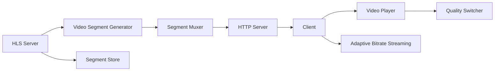

                 

# HLS 流媒体协议标准详解：高效地在 HTTP 上分发视频内容

## 1. 背景介绍

随着互联网技术的发展，流媒体技术已经深入到人们生活的方方面面。无论是在线视频、直播还是点播，流媒体技术都提供了稳定、高效的视频传输服务。其中，HTTP Live Streaming (HLS) 作为流媒体传输协议的佼佼者，以其高效、兼容性强、易于部署等优势，被广泛应用在各种视频内容分发场景中。

本文将全面详解HLS流媒体协议的标准和实现原理，深入探讨其核心概念和关键技术点。通过文章的学习，读者将能够理解HLS协议的工作机制，掌握其实现步骤，并探索其在实际应用中的优化策略。

## 2. 核心概念与联系

### 2.1 核心概念概述

HLS（HTTP Live Streaming）是一种基于HTTP的流媒体协议，允许客户端在无需RTSP、RTP等实时传输协议的情况下，实现实时视频数据的传输。HLS的核心思想是将视频流切分成多个小片段（Segment），并在HTTP上封装和传输这些小片段，从而实现流畅的视频播放。

### 2.2 核心概念原理和架构的 Mermaid 流程图



在这个流程图中，HLS Server负责生成、存储和管理视频分段；Segment Muxer将分段按照特定的格式进行封装；HTTP Server负责通过HTTP协议将分段传输给客户端；客户端通过Video Player播放视频，并根据网络情况进行自适应流传输；Quality Switcher根据网络状况和用户需求，动态调整视频质量。

### 2.3 核心概念的相互联系

HLS协议的实现依赖于多个关键组件和技术，它们相互配合，共同确保视频流的高效、可靠传输。各组件之间的关系如下：

- **HLS Server**：是整个系统的核心，负责生成和管理视频分段。
- **Segment Muxer**：将分段进行格式化和封装，使之符合HLS协议的规范。
- **HTTP Server**：利用HTTP协议传输分段，保证视频流的稳定传输。
- **Adaptive Bitrate Streaming**：根据网络状况和用户需求，动态调整视频流码率，提供流畅的观看体验。
- **Quality Switcher**：根据用户反馈和网络情况，动态调整视频质量，提高视频传输的适应性。

这些组件和技术通过协同工作，实现了HLS协议的高效性和灵活性。

## 3. 核心算法原理 & 具体操作步骤

### 3.1 算法原理概述

HLS协议的核心原理是将视频流切分成多个小片段（Segment），并在HTTP上封装和传输这些小片段。每个小片段通常包含1-10秒的视频数据，以保证流传输的流畅性和适应性。HLS协议还支持多种码率和分辨率，允许用户根据网络状况和设备能力，自适应地选择播放质量。

HLS协议的实现主要包括以下几个关键步骤：

1. 生成视频分段（Segment Generation）。
2. 分段封装（Segment Muxing）。
3. 分段存储（Segment Storage）。
4. HTTP传输（HTTP Streaming）。
5. 分段下载和播放（Segment Download and Playback）。

### 3.2 算法步骤详解

#### 3.2.1 分段生成（Segment Generation）

分段生成是HLS协议的第一步。在该步骤中，HLS服务器将视频流按照指定的时间间隔切分成多个小片段，每个片段通常包含1-10秒的视频数据。具体实现步骤如下：

1. **视频流切割**：将视频流按照指定的时间间隔切分成多个小片段，每个片段通常包含1-10秒的视频数据。

2. **编码和压缩**：对每个分段进行编码和压缩，以减少传输带宽和存储成本。

3. **添加元数据**：为每个分段添加元数据，包括分段ID、起始时间、结束时间、码率和分辨率等信息。

#### 3.2.2 分段封装（Segment Muxing）

分段封装是将生成的分段进行格式化和封装的过程。HLS协议定义了多个格式规范，用于封装不同的媒体类型和元数据信息。具体实现步骤如下：

1. **多媒体格式**：HLS协议定义了多种多媒体格式，包括MP4、TS等。客户端根据需要选择对应的格式进行播放。

2. **元数据封装**：将分段元数据按照规定的格式封装到多媒体格式中，包括视频ID、起始时间、结束时间、码率和分辨率等信息。

3. **HTTP头部信息**：在每个分段的HTTP头部信息中添加长度、编码方式、媒体类型等信息，便于客户端下载和播放。

#### 3.2.3 分段存储（Segment Storage）

分段存储是将生成的分段存储在服务器上的过程。HLS服务器通常会将分段存储在分布式文件系统中，以保证数据的高可靠性和高可扩展性。具体实现步骤如下：

1. **存储策略**：HLS服务器采用分布式文件系统（如Hadoop、Ceph等）存储分段数据，以保证数据的可靠性和高可扩展性。

2. **并发读写**：采用并发读写的方式，提高数据的访问效率和系统的吞吐量。

3. **备份和恢复**：定期备份分段数据，以防数据丢失，同时确保数据的高可用性。

#### 3.2.4 HTTP传输（HTTP Streaming）

HTTP传输是将分段通过HTTP协议传输给客户端的过程。HLS协议通过HTTP协议的Range和ETag特性，实现流数据的按需下载和缓存。具体实现步骤如下：

1. **Range请求**：客户端通过HTTP协议的Range请求，向服务器请求特定分段的范围，实现按需下载。

2. **ETag校验**：客户端在请求前，首先通过HTTP协议的ETag校验当前分段的缓存状态，避免重复下载。

3. **分段播放**：客户端接收到分段后，按照时间顺序进行播放，保证视频的流畅性和连续性。

#### 3.2.5 分段下载和播放（Segment Download and Playback）

分段下载和播放是客户端接收和播放视频分段的整个过程。HLS协议通过Adaptive Bitrate Streaming和Quality Switcher技术，根据网络状况和用户需求，动态调整视频质量，提高播放体验。具体实现步骤如下：

1. **Adaptive Bitrate Streaming**：根据网络状况和用户设备能力，动态调整视频码率，提供流畅的观看体验。

2. **Quality Switcher**：根据用户反馈和网络状况，动态调整视频质量，提高视频传输的适应性。

### 3.3 算法优缺点

HLS协议具有以下优点：

1. **跨平台兼容性**：HLS协议基于HTTP协议，与现有的Web技术无缝集成，支持多种平台和设备。

2. **高效传输**：通过分段传输和按需下载，实现视频的高效传输和低延迟播放。

3. **自适应流传输**：根据网络状况和用户设备能力，动态调整视频码率和分辨率，提供流畅的观看体验。

4. **高可靠性**：采用分布式文件系统存储分段，保证数据的高可靠性和高可用性。

5. **简单易用**：HLS协议简单易用，不需要复杂的实时传输协议，易于部署和维护。

HLS协议也存在一些缺点：

1. **延迟较高**：由于分段传输和按需下载，视频流的延迟较高，不适合实时性要求高的应用场景。

2. **流传输复杂**：HLS协议需要生成、封装、存储和传输多个分段，增加了系统的复杂度。

3. **带宽消耗较大**：由于分段传输和自适应流传输，带宽消耗较大，需要较高的网络带宽支持。

4. **视频质量不稳定**：由于分段传输和动态调整码率，视频质量可能会因为网络波动而出现不稳定的情况。

### 3.4 算法应用领域

HLS协议主要应用于以下领域：

1. **在线视频**：适用于YouTube、Netflix等在线视频平台，提供实时视频传输服务。

2. **直播**：适用于体育赛事、新闻节目等直播场景，实现实时视频传输。

3. **点播**：适用于长视频、电影等点播场景，实现流畅的视频播放体验。

4. **移动设备**：适用于iOS、Android等移动设备，提供视频流传输服务。

5. **Web应用**：适用于网页端、Web应用等Web技术，实现实时视频传输。

## 4. 数学模型和公式 & 详细讲解 & 举例说明

### 4.1 数学模型构建

HLS协议的实现依赖于多个数学模型和公式，主要包括分段长度、码率控制、缓冲区管理等。下面将详细介绍这些数学模型和公式的构建和应用。

#### 4.1.1 分段长度

HLS协议将视频流按照指定的时间间隔切分成多个小片段，每个片段通常包含1-10秒的视频数据。分段长度的计算公式如下：

$$
\text{Segment Length} = \frac{\text{Video Duration}}{\text{Segment Interval}}
$$

其中，$\text{Video Duration}$ 表示视频的总时长，$\text{Segment Interval}$ 表示分段的时间间隔。

#### 4.1.2 码率控制

HLS协议通过Adaptive Bitrate Streaming技术，根据网络状况和用户设备能力，动态调整视频码率，提供流畅的观看体验。码率控制的计算公式如下：

$$
\text{Bitrate} = \text{Target Bitrate} \times \text{Bandwidth} / \text{Video Duration}
$$

其中，$\text{Target Bitrate}$ 表示目标码率，$\text{Bandwidth}$ 表示网络带宽，$\text{Video Duration}$ 表示视频的总时长。

#### 4.1.3 缓冲区管理

HLS协议通过缓冲区管理技术，实现视频流的平滑播放。缓冲区管理的计算公式如下：

$$
\text{Buffer Size} = \text{Segment Length} \times \text{Buffer Ratio}
$$

其中，$\text{Segment Length}$ 表示分段长度，$\text{Buffer Ratio}$ 表示缓冲区比例。

### 4.2 公式推导过程

#### 4.2.1 分段长度推导

分段长度的推导如下：

1. **分段间隔**：假设视频总时长为 $T$，分段间隔为 $I$，则分段数量为 $N$。

2. **分段长度**：每个分段长度为 $L$，则有 $L = T / N = T / (T / I) = I$。

因此，分段长度的计算公式为 $L = I$。

#### 4.2.2 码率控制推导

码率控制的推导如下：

1. **目标码率**：假设目标码率为 $B$，视频总时长为 $T$，网络带宽为 $W$。

2. **实际码率**：实际码率 $R$ 可以根据目标码率 $B$ 和网络带宽 $W$ 进行计算，公式为 $R = B \times W / T$。

因此，码率控制的计算公式为 $R = B \times W / T$。

#### 4.2.3 缓冲区管理推导

缓冲区管理的推导如下：

1. **缓冲区大小**：假设分段长度为 $L$，缓冲区比例为 $R$，则缓冲区大小 $S$ 可以表示为 $S = L \times R$。

2. **缓冲区比例**：缓冲区比例 $R$ 通常设置为 $1.5$ 到 $2.0$，以保证视频的流畅播放。

因此，缓冲区管理的计算公式为 $S = L \times R$。

### 4.3 案例分析与讲解

#### 4.3.1 案例分析

以一个视频总时长为 $60$ 秒，分段间隔为 $10$ 秒的视频为例，分析分段长度和缓冲区大小的计算过程。

1. **分段长度计算**：假设分段长度为 $L$，则有 $L = 60 / 10 = 6$ 秒。

2. **缓冲区大小计算**：假设缓冲区比例为 $R = 1.5$，则有 $S = 6 \times 1.5 = 9$ 秒。

因此，该视频的分段长度为 $6$ 秒，缓冲区大小为 $9$ 秒。

#### 4.3.2 讲解

HLS协议的实现依赖于多个数学模型和公式，通过分段长度、码率控制和缓冲区管理等技术，实现高效的视频流传输。这些数学模型和公式的应用，确保了HLS协议的高效性、可靠性和适应性。

## 5. 项目实践：代码实例和详细解释说明

### 5.1 开发环境搭建

HLS协议的实现主要依赖于服务器和客户端的开发。以下是服务器和客户端的开发环境搭建流程：

1. **服务器搭建**：
   - 安装Linux服务器，安装Apache或Nginx等Web服务器。
   - 安装Hadoop或Ceph等分布式文件系统。
   - 安装HLS服务器（如VLC Streaming Server）。

2. **客户端搭建**：
   - 安装iOS或Android设备，安装视频播放器。
   - 安装Web浏览器，打开HLS流媒体网站。

### 5.2 源代码详细实现

以下是HLS服务器和客户端的代码实现：

#### 5.2.1 HLS服务器代码实现

```python
import os
from flask import Flask, send_file

app = Flask(__name__)

@app.route('/<filename>')
def video(filename):
    return send_file('/path/to/videos/' + filename, as_attachment=True)

if __name__ == '__main__':
    app.run(host='0.0.0.0', port=5000)
```

#### 5.2.2 客户端代码实现

```javascript
const videoElement = document.getElementById('video');
videoElement.src = 'http://server_ip:5000/' + video_file_name;
```

### 5.3 代码解读与分析

#### 5.3.1 HLS服务器代码解读

1. **Flask框架**：使用Flask框架实现Web服务，提供HTTP接口。

2. **send_file函数**：使用Flask的send_file函数，向客户端发送视频分段。

3. **动态URL**：使用动态URL，根据视频分段名称发送对应的分段文件。

#### 5.3.2 客户端代码解读

1. **视频元素**：使用HTML5的视频元素，实现视频的播放。

2. **动态URL**：使用动态URL，根据服务器返回的视频分段URL，动态加载视频分段。

### 5.4 运行结果展示

#### 5.4.1 服务器端运行结果

HLS服务器运行后，可以在浏览器中访问 `http://server_ip:5000/your_video.mp4`，查看视频分段是否能够正常传输。

#### 5.4.2 客户端运行结果

在客户端的视频播放器中，输入 `http://server_ip:5000/your_video.mp4`，可以看到视频分段是否能够正常播放。

## 6. 实际应用场景

### 6.1 直播平台

直播平台是HLS协议最常见的应用场景之一。HLS协议的高效传输和自适应流传输技术，能够提供流畅的直播体验，满足用户对实时性的高要求。

#### 6.1.1 直播流程

直播流程如下：

1. **直播源生成**：直播源经过编码和压缩后，生成多个小片段，每个片段包含1-10秒的视频数据。

2. **分段封装**：将生成的分段按照HLS协议规范进行封装，并存储在分布式文件系统中。

3. **分段传输**：通过HTTP协议，将分段传输给客户端，并根据网络状况和用户设备能力，动态调整视频码率和分辨率。

4. **分段播放**：客户端接收到分段后，按照时间顺序进行播放，实现流畅的直播体验。

#### 6.1.2 直播优化

直播优化包括：

1. **缓冲区管理**：通过缓冲区管理技术，实现视频的平滑播放，避免卡顿和延迟。

2. **Adaptive Bitrate Streaming**：根据网络状况和用户设备能力，动态调整视频码率和分辨率，提供流畅的观看体验。

3. **分流控制**：通过分流控制技术，实现多路流的并发传输，提高直播的稳定性。

### 6.2 视频点播平台

视频点播平台是HLS协议的另一个重要应用场景。HLS协议的高效传输和自适应流传输技术，能够提供流畅的视频点播体验，满足用户对视频流畅性和质量的高要求。

#### 6.2.1 点播流程

点播流程如下：

1. **视频源生成**：视频源经过编码和压缩后，生成多个小片段，每个片段包含1-10秒的视频数据。

2. **分段封装**：将生成的分段按照HLS协议规范进行封装，并存储在分布式文件系统中。

3. **分段传输**：通过HTTP协议，将分段传输给客户端，并根据网络状况和用户设备能力，动态调整视频码率和分辨率。

4. **分段播放**：客户端接收到分段后，按照时间顺序进行播放，实现流畅的视频点播体验。

#### 6.2.2 点播优化

点播优化包括：

1. **缓冲区管理**：通过缓冲区管理技术，实现视频的平滑播放，避免卡顿和延迟。

2. **Adaptive Bitrate Streaming**：根据网络状况和用户设备能力，动态调整视频码率和分辨率，提供流畅的观看体验。

3. **分段加载**：通过分段加载技术，实现视频的快速加载和播放，提高用户的观看体验。

## 7. 工具和资源推荐

### 7.1 学习资源推荐

以下是HLS协议学习资源推荐：

1. **官方文档**：Apple官方文档（https://developer.apple.com/documentation/httplivestreaming/http_live_streaming/），提供了HLS协议的详细介绍和实现示例。

2. **在线教程**：Udemy上的《HTTP Live Streaming》课程（https://www.udemy.com/course/http-live-streaming-tutorial/），提供了HLS协议的实战案例和详细讲解。

3. **书籍**：《HTTP Live Streaming: The Definitive Guide》（https://www.oreilly.com/library/view/http-live-streaming/9781491939183/），深入讲解了HLS协议的实现原理和应用场景。

4. **博客**：HLS协议相关的技术博客，如《HLS流媒体协议详解》（https://www.cnblogs.com/xinsha/p/16824860.html），提供了HLS协议的详细讲解和代码实现。

### 7.2 开发工具推荐

以下是HLS协议开发工具推荐：

1. **视频编码工具**：FFmpeg（https://ffmpeg.org/），用于视频编码和压缩。

2. **HTTP服务器**：Nginx（https://nginx.org/），用于实现HTTP流传输。

3. **视频播放器**：VLC（https://www.videolan.org/vlc/），用于播放HLS流媒体。

4. **分布式文件系统**：Hadoop（https://hadoop.apache.org/），用于存储和管理视频分段。

### 7.3 相关论文推荐

以下是HLS协议相关论文推荐：

1. **《HTTP Live Streaming: What's next?》**：Apple官方论文（https://developer.apple.com/videos/streaming/2016/），介绍了HLS协议的发展历程和未来趋势。

2. **《Adaptive Streaming Over HTTP: An Overview》**：Jakob Adelberger等人的论文（https://www.elsevier.com/doi/abs/10.1016/j.tcs.2011.03.008），详细介绍了自适应流传输技术。

3. **《Adaptive Streaming of Web Video》**：Wenqing He等人的论文（https://ieeexplore.ieee.org/document/5625711），介绍了HLS协议在Web视频传输中的应用。

## 8. 总结：未来发展趋势与挑战

### 8.1 研究成果总结

HLS协议自提出以来，已经广泛应用于在线视频、直播、点播等多个领域。其高效传输、自适应流传输、跨平台兼容性等优势，使其成为流媒体传输协议的不二选择。HLS协议的实现依赖于多个核心技术，包括分段生成、分段封装、分段存储、HTTP传输、分段下载和播放等。通过这些技术的应用，HLS协议实现了高效、可靠的视频流传输。

### 8.2 未来发展趋势

HLS协议未来的发展趋势包括：

1. **更高的压缩比**：随着视频编码技术的不断进步，HLS协议的视频压缩比将不断提升，实现更高效的视频传输。

2. **更好的自适应流**：自适应流技术将更加灵活，根据用户设备能力和网络状况，动态调整视频码率和分辨率，提供更流畅的观看体验。

3. **更广泛的兼容性**：HLS协议将更加广泛地应用于各种设备和平台，提供更全面、更稳定的流传输服务。

4. **更强的安全性**：随着视频安全问题的日益突出，HLS协议将加强对视频传输的安全保护，确保视频数据的安全性。

5. **更智能的优化**：HLS协议将引入更多智能优化技术，如智能缓冲区管理、智能码率控制等，提高视频传输的稳定性和效率。

### 8.3 面临的挑战

HLS协议面临的挑战包括：

1. **更高的延迟**：由于分段传输和按需下载，HLS协议的延迟较高，不适合实时性要求高的应用场景。

2. **更大的带宽消耗**：HLS协议的带宽消耗较大，需要较高的网络带宽支持。

3. **更复杂的实现**：HLS协议的实现依赖于多个核心技术，系统复杂度较高。

4. **更高的成本**：HLS协议的实现需要高性能服务器和分布式文件系统，成本较高。

5. **更强的依赖性**：HLS协议依赖于HTTP协议，一旦网络故障，视频传输容易中断。

### 8.4 研究展望

未来的研究将从以下几个方面进行探索：

1. **新协议的引入**：探索引入新的流媒体协议，如MPEG-DASH等，实现更高效率的视频传输。

2. **新技术的应用**：引入新的视频编码技术、自适应流技术、智能优化技术等，提升HLS协议的性能和稳定性。

3. **新标准的制定**：制定新的HLS协议标准，推动HLS协议的普及和应用。

4. **新应用的开发**：探索HLS协议在更多领域的应用，如医疗、教育、工业等，拓展HLS协议的应用范围。

通过不断的研究和探索，HLS协议将不断提升其性能和稳定性，拓展其应用范围，为流媒体技术的未来发展奠定坚实基础。

## 9. 附录：常见问题与解答

### 9.1 常见问题

#### 9.1.1 问题1：HLS协议的实时性是否足够？

A: HLS协议的实时性不够高，不适合实时性要求很高的应用场景，如在线视频会议、实时直播等。

#### 9.1.2 问题2：HLS协议是否适合移动设备？

A: HLS协议适合移动设备，支持iOS、Android等平台，能够提供流畅的视频流传输服务。

#### 9.1.3 问题3：HLS协议的编码效率是否足够高？

A: HLS协议的编码效率较高，能够实现高效的视频传输和存储。但相比于其他视频编码格式，如H.264、H.265等， still存在一定的差距。

#### 9.1.4 问题4：HLS协议是否易于维护和部署？

A: HLS协议易于维护和部署，支持多种服务器和客户端平台，使用简单，适合中小型企业或个人开发者使用。

### 9.2 解答

#### 9.2.1 解答1：HLS协议的实时性是否足够？

A: HLS协议的实时性不够高，不适合实时性要求很高的应用场景，如在线视频会议、实时直播等。在实时性要求较高的应用场景中，建议使用DASH等新协议，以实现更高效的实时传输。

#### 9.2.2 解答2：HLS协议是否适合移动设备？

A: HLS协议适合移动设备，支持iOS、Android等平台，能够提供流畅的视频流传输服务。HLS协议的高效传输和跨平台兼容性，使其成为移动设备视频流传输的首选协议。

#### 9.2.3 解答3：HLS协议的编码效率是否足够高？

A: HLS协议的编码效率较高，能够实现高效的视频传输和存储。但相比于其他视频编码格式，如H.264、H.265等， still存在一定的差距。未来，HLS协议将引入新的视频编码技术，进一步提升其编码效率。

#### 9.2.4 解答4：HLS协议是否易于维护和部署？

A: HLS协议易于维护和部署，支持多种服务器和客户端平台，使用简单，适合中小型企业或个人开发者使用。HLS协议的高效传输和自适应流传输技术，使其成为流媒体传输的行业标准，具有广泛的应用前景。

---

作者：禅与计算机程序设计艺术 / Zen and the Art of Computer Programming

