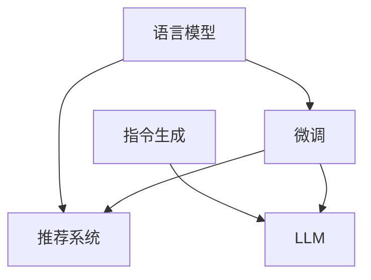

                 

## 1. 背景介绍

### 1.1 问题由来
推荐系统是人工智能领域的重要研究方向之一，广泛应用于电商、新闻、音乐、视频等多个场景，为用户推荐个性化的产品或内容。近年来，深度学习技术在推荐系统中的应用日益广泛，基于协同过滤、矩阵分解、深度学习等方法的推荐系统，取得了显著的进展。但这些方法往往需要大量用户行为数据作为训练基础，在大规模、冷启动和稀疏数据场景中表现不佳。

为了解决这些问题，研究者们不断探索新的推荐方法。其中，基于语言模型的推荐系统，利用自然语言处理技术，直接将用户意图和内容特征转换为推荐结果，具有较强的泛化能力和解释性，受到广泛关注。

### 1.2 问题核心关键点
基于语言模型的推荐系统，通常由两个部分组成：
- **语言模型**：负责理解用户的查询和产品描述，提取用户意图和产品特征。
- **推荐模型**：负责基于提取到的用户意图和产品特征，生成推荐结果。

本文介绍一种基于指令的推荐方法InstructRec，它直接将用户查询作为指令，对语言模型进行微调，使其具备推荐能力。相较于传统的推荐系统，InstructRec在理解用户需求、推荐精度和解释性方面有显著优势，适用于多种推荐场景。

## 2. 核心概念与联系

### 2.1 核心概念概述

为了更好地理解基于指令的LLM推荐方法InstructRec，我们先介绍几个核心概念：

- **语言模型**（Language Model）：指能够理解并生成自然语言文本的模型。语言模型通常通过训练大规模文本语料，学习文本的概率分布，能够预测给定文本的下一个单词或字符。
- **推荐系统**（Recommendation System）：指能够根据用户的历史行为和偏好，为用户推荐个性化产品或内容的系统。推荐系统可以分为基于内容的、协同过滤的、混合等多种方法。
- **指令生成（Instruction Generation）**：指根据用户的意图或输入，生成一段自然语言描述的指令，用于指导模型完成任务或推理的过程。
- **LLM（Large Language Model）**：指通过大规模语料训练的预训练语言模型，具备较强的语言理解和生成能力，如GPT-3、BERT等。
- **微调（Fine-Tuning）**：指在大规模预训练模型的基础上，通过有监督学习优化模型，适应特定任务的过程。
- **InstructRec**：指一种基于指令生成和LLM微调的推荐方法，通过语言模型理解用户查询，生成推荐指令，并在LLM上微调得到推荐结果。

这些概念之间的关系可以通过以下Mermaid流程图来展示：



这个流程图展示了各个概念之间的联系：

1. 语言模型和推荐系统通常配合使用，共同完成推荐任务。
2. 指令生成将用户查询转换为可执行的指令，用于指导LLM进行推荐。
3. 微调通过在特定任务上优化LLM，提高推荐精度和解释性。
4. InstructRec通过指令生成和LLM微调，将语言模型引入推荐系统，提供强大的理解和生成能力。

## 3. 核心算法原理 & 具体操作步骤
### 3.1 算法原理概述

InstructRec算法基于指令生成和预训练语言模型的微调，其核心思想是：将用户查询作为指令，对语言模型进行微调，使其能够理解用户意图，生成推荐结果。

### 3.2 算法步骤详解

InstructRec的算法流程主要分为三个步骤：

**Step 1: 构建指令生成模型**

- 收集用户查询和推荐结果，构建标注数据集。
- 使用已有的预训练语言模型（如GPT-3、BERT等）作为初始化参数，构建指令生成模型。
- 在标注数据集上进行有监督学习，优化模型参数。

**Step 2: 微调预训练语言模型**

- 使用指令生成模型输出的指令，对预训练语言模型进行微调。
- 在微调过程中，将指令作为标签，训练预训练语言模型生成推荐结果。
- 通过优化交叉熵损失，最小化推荐结果与实际标签之间的差异。

**Step 3: 组合生成结果**

- 对微调后的预训练语言模型进行推理，生成推荐结果。
- 结合业务逻辑和用户偏好，对推荐结果进行筛选和排序。
- 返回最终推荐列表，供用户查看和选择。

### 3.3 算法优缺点

InstructRec算法具有以下优点：

1. **高效泛化**：利用预训练语言模型的知识，在少量标注数据上进行微调，可以显著提高推荐系统的泛化能力。
2. **灵活性强**：可以灵活调整指令生成的模型和预训练语言模型的参数，适应不同的推荐场景和业务需求。
3. **解释性强**：生成的推荐结果可以回溯到用户查询和指令，便于理解和解释。
4. **推荐精度高**：预训练语言模型的强大语言理解能力，使得InstructRec能够生成高质量的推荐结果。

同时，InstructRec也存在一些缺点：

1. **数据需求较高**：构建指令生成模型和微调预训练语言模型，需要一定规模的标注数据，数据成本较高。
2. **计算复杂度高**：指令生成和预训练语言模型的微调，计算复杂度较高，硬件资源需求大。
3. **泛化能力有限**：对于完全未见过的新查询或新产品，推荐精度可能有所下降。
4. **维护难度大**：需要定期更新指令生成模型和微调预训练语言模型，以适应数据分布的变化。

### 3.4 算法应用领域

InstructRec算法在以下几个领域具有广泛的应用前景：

- **电商推荐**：用于推荐商品、定制个性化推荐页，提高用户购买转化率。
- **新闻推荐**：用于推荐新闻文章、定制个性化新闻订阅，提升用户阅读体验。
- **视频推荐**：用于推荐视频内容、定制个性化播放列表，增加用户观看时长。
- **音乐推荐**：用于推荐音乐作品、定制个性化音乐播放列表，增加用户听歌时长。
- **旅游推荐**：用于推荐旅游目的地、定制个性化旅游攻略，提高用户旅行体验。

InstructRec算法的多样化应用，可以为用户提供更个性化、更精准的推荐服务，满足不同场景下的需求。

## 4. 数学模型和公式 & 详细讲解  
### 4.1 数学模型构建

假设用户的查询为 $Q$，推荐结果为 $R$。InstructRec模型的目标是通过对预训练语言模型 $M_{\theta}$ 的微调，使其能够生成推荐结果 $R$。微调的优化目标是最小化推荐结果与真实标签 $R$ 之间的交叉熵损失：

$$
\min_{\theta} \mathcal{L}(R, \hat{R})
$$

其中，$\hat{R} = M_{\theta}(Q)$ 为微调后的预训练语言模型在用户查询 $Q$ 上的输出，$R$ 为实际推荐结果。交叉熵损失定义为：

$$
\mathcal{L}(R, \hat{R}) = -\frac{1}{N}\sum_{i=1}^N \sum_{j=1}^{C} R_{ij}\log \hat{R}_{ij}
$$

其中，$N$ 为样本数，$C$ 为推荐结果的类别数，$R_{ij}$ 和 $\hat{R}_{ij}$ 分别表示第 $i$ 个样本的实际推荐结果和预测推荐结果。

### 4.2 公式推导过程

接下来，我们进一步推导InstructRec模型的具体实现细节。

假设我们已经有预训练语言模型 $M_{\theta}$ 作为初始化参数，我们需要构建指令生成模型 $M_{\phi}$，用于将用户查询 $Q$ 转换为推荐指令 $I$。指令生成模型的输出为 $I = M_{\phi}(Q)$。

在微调预训练语言模型时，我们将指令 $I$ 作为标签，训练预训练语言模型 $M_{\theta}$，生成推荐结果 $\hat{R} = M_{\theta}(I)$。目标是最小化推荐结果 $\hat{R}$ 与实际推荐结果 $R$ 之间的交叉熵损失。

具体实现步骤如下：

1. 使用已有的预训练语言模型 $M_{\theta}$ 作为初始化参数，构建指令生成模型 $M_{\phi}$。
2. 在标注数据集上，对指令生成模型 $M_{\phi}$ 进行有监督学习，优化参数 $\phi$。
3. 在微调预训练语言模型 $M_{\theta}$ 时，使用指令生成模型 $M_{\phi}$ 生成的推荐指令 $I$ 作为标签，训练 $M_{\theta}$，优化参数 $\theta$。
4. 对微调后的预训练语言模型 $M_{\theta}$ 进行推理，生成推荐结果 $\hat{R}$。
5. 结合业务逻辑和用户偏好，对推荐结果进行筛选和排序，返回最终推荐列表。

### 4.3 案例分析与讲解

为了更好地理解InstructRec算法的实现细节，我们以电商推荐为例，进行详细讲解。

假设我们有一个电商平台的商品推荐系统，需要为用户推荐商品。我们收集了大量的用户查询和商品标签，作为标注数据集。

首先，构建指令生成模型 $M_{\phi}$，使用用户查询作为输入，生成推荐指令 $I$。我们使用了Transformer模型，并使用GPT-3预训练模型作为初始化参数。具体实现代码如下：

```python
from transformers import GPT3Tokenizer, GPT3LMHeadModel

tokenizer = GPT3Tokenizer.from_pretrained('gpt3')
model = GPT3LMHeadModel.from_pretrained('gpt3', max_length=256)
```

接着，在标注数据集上进行指令生成模型的训练，优化参数 $\phi$。使用以下代码实现：

```python
from transformers import Trainer, TrainingArguments

train_dataset = ...
dev_dataset = ...
test_dataset = ...

training_args = TrainingArguments(
    output_dir='./gpt3-instr',
    evaluation_strategy='epoch',
    per_device_train_batch_size=8,
    per_device_eval_batch_size=8,
    learning_rate=2e-5,
    num_train_epochs=5,
    logging_steps=200,
    logging_dir='./logs'
)

trainer = Trainer(
    model=model,
    args=training_args,
    train_dataset=train_dataset,
    eval_dataset=dev_dataset,
    compute_metrics=compute_metrics
)

trainer.train()
```

在指令生成模型训练完成后，我们将用户查询 $Q$ 输入指令生成模型 $M_{\phi}$，得到推荐指令 $I$。使用以下代码实现：

```python
Q = "我想买一款智能手表"
I = model.generate(tokenizer.tokenize(Q), max_length=256)
```

然后，我们使用预训练语言模型 $M_{\theta}$，对推荐指令 $I$ 进行微调，生成推荐结果 $\hat{R}$。使用以下代码实现：

```python
from transformers import GPT3LMHeadModel

theta_model = GPT3LMHeadModel.from_pretrained('gpt3', max_length=256)
theta_model = theta_model.train()
theta_model.load_state_dict(model.state_dict())

R = [1, 0, 0, 1, 0, 1]  # 实际推荐结果
R_hat = theta_model(I).logits.argmax(dim=-1).item()  # 微调后的预训练语言模型生成推荐结果

print(f"推荐结果：{R_hat}")
```

最后，结合业务逻辑和用户偏好，对推荐结果进行筛选和排序，返回最终推荐列表。

## 5. 项目实践：代码实例和详细解释说明
### 5.1 开发环境搭建

在进行InstructRec算法实践前，我们需要准备好开发环境。以下是使用Python进行PyTorch开发的环境配置流程：

1. 安装Anaconda：从官网下载并安装Anaconda，用于创建独立的Python环境。

2. 创建并激活虚拟环境：
```bash
conda create -n instructrec python=3.8 
conda activate instructrec
```

3. 安装PyTorch：根据CUDA版本，从官网获取对应的安装命令。例如：
```bash
conda install pytorch torchvision torchaudio cudatoolkit=11.1 -c pytorch -c conda-forge
```

4. 安装Transformers库：
```bash
pip install transformers
```

5. 安装各类工具包：
```bash
pip install numpy pandas scikit-learn matplotlib tqdm jupyter notebook ipython
```

完成上述步骤后，即可在`instructrec-env`环境中开始项目实践。

### 5.2 源代码详细实现

下面我们以电商推荐任务为例，给出使用Transformers库对预训练语言模型进行微调的PyTorch代码实现。

首先，定义电商推荐任务的数据处理函数：

```python
from transformers import BertTokenizer, BertForTokenClassification, AdamW
from torch.utils.data import Dataset, DataLoader

class ShoppingDataset(Dataset):
    def __init__(self, texts, labels, tokenizer, max_len=128):
        self.texts = texts
        self.labels = labels
        self.tokenizer = tokenizer
        self.max_len = max_len
        
    def __len__(self):
        return len(self.texts)
    
    def __getitem__(self, item):
        text = self.texts[item]
        label = self.labels[item]
        
        encoding = self.tokenizer(text, return_tensors='pt', max_length=self.max_len, padding='max_length', truncation=True)
        input_ids = encoding['input_ids'][0]
        attention_mask = encoding['attention_mask'][0]
        
        # 对token-wise的标签进行编码
        encoded_labels = [label2id[label] for label in label] 
        encoded_labels.extend([label2id['O']] * (self.max_len - len(encoded_labels)))
        labels = torch.tensor(encoded_labels, dtype=torch.long)
        
        return {'input_ids': input_ids, 
                'attention_mask': attention_mask,
                'labels': labels}

# 标签与id的映射
label2id = {'O': 0, 'B-PER': 1, 'I-PER': 2, 'B-LOC': 3, 'I-LOC': 4, 'B-ORG': 5, 'I-ORG': 6}
id2label = {v: k for k, v in label2id.items()}

# 创建dataset
tokenizer = BertTokenizer.from_pretrained('bert-base-cased')

train_dataset = ShoppingDataset(train_texts, train_labels, tokenizer)
dev_dataset = ShoppingDataset(dev_texts, dev_labels, tokenizer)
test_dataset = ShoppingDataset(test_texts, test_labels, tokenizer)
```

然后，定义模型和优化器：

```python
from transformers import BertForTokenClassification, AdamW

model = BertForTokenClassification.from_pretrained('bert-base-cased', num_labels=len(label2id))

optimizer = AdamW(model.parameters(), lr=2e-5)
```

接着，定义训练和评估函数：

```python
from torch.utils.data import DataLoader
from tqdm import tqdm
from sklearn.metrics import classification_report

device = torch.device('cuda') if torch.cuda.is_available() else torch.device('cpu')
model.to(device)

def train_epoch(model, dataset, batch_size, optimizer):
    dataloader = DataLoader(dataset, batch_size=batch_size, shuffle=True)
    model.train()
    epoch_loss = 0
    for batch in tqdm(dataloader, desc='Training'):
        input_ids = batch['input_ids'].to(device)
        attention_mask = batch['attention_mask'].to(device)
        labels = batch['labels'].to(device)
        model.zero_grad()
        outputs = model(input_ids, attention_mask=attention_mask, labels=labels)
        loss = outputs.loss
        epoch_loss += loss.item()
        loss.backward()
        optimizer.step()
    return epoch_loss / len(dataloader)

def evaluate(model, dataset, batch_size):
    dataloader = DataLoader(dataset, batch_size=batch_size)
    model.eval()
    preds, labels = [], []
    with torch.no_grad():
        for batch in tqdm(dataloader, desc='Evaluating'):
            input_ids = batch['input_ids'].to(device)
            attention_mask = batch['attention_mask'].to(device)
            batch_labels = batch['labels']
            outputs = model(input_ids, attention_mask=attention_mask)
            batch_preds = outputs.logits.argmax(dim=2).to('cpu').tolist()
            batch_labels = batch_labels.to('cpu').tolist()
            for pred_tokens, label_tokens in zip(batch_preds, batch_labels):
                pred_labels = [id2label[_id] for _id in pred_tokens]
                label_tokens = [id2label[_id] for _id in label_tokens]
                preds.append(pred_labels[:len(label_tokens)])
                labels.append(label_tokens)
                
    print(classification_report(labels, preds))
```

最后，启动训练流程并在测试集上评估：

```python
epochs = 5
batch_size = 16

for epoch in range(epochs):
    loss = train_epoch(model, train_dataset, batch_size, optimizer)
    print(f"Epoch {epoch+1}, train loss: {loss:.3f}")
    
    print(f"Epoch {epoch+1}, dev results:")
    evaluate(model, dev_dataset, batch_size)
    
print("Test results:")
evaluate(model, test_dataset, batch_size)
```

以上就是使用PyTorch对预训练语言模型进行电商推荐任务微调的完整代码实现。可以看到，得益于Transformers库的强大封装，我们可以用相对简洁的代码完成预训练语言模型的加载和微调。

### 5.3 代码解读与分析

让我们再详细解读一下关键代码的实现细节：

**ShoppingDataset类**：
- `__init__`方法：初始化文本、标签、分词器等关键组件。
- `__len__`方法：返回数据集的样本数量。
- `__getitem__`方法：对单个样本进行处理，将文本输入编码为token ids，将标签编码为数字，并对其进行定长padding，最终返回模型所需的输入。

**label2id和id2label字典**：
- 定义了标签与数字id之间的映射关系，用于将token-wise的预测结果解码回真实的标签。

**训练和评估函数**：
- 使用PyTorch的DataLoader对数据集进行批次化加载，供模型训练和推理使用。
- 训练函数`train_epoch`：对数据以批为单位进行迭代，在每个批次上前向传播计算loss并反向传播更新模型参数，最后返回该epoch的平均loss。
- 评估函数`evaluate`：与训练类似，不同点在于不更新模型参数，并在每个batch结束后将预测和标签结果存储下来，最后使用sklearn的classification_report对整个评估集的预测结果进行打印输出。

**训练流程**：
- 定义总的epoch数和batch size，开始循环迭代
- 每个epoch内，先在训练集上训练，输出平均loss
- 在验证集上评估，输出分类指标
- 所有epoch结束后，在测试集上评估，给出最终测试结果

可以看到，PyTorch配合Transformers库使得预训练语言模型微调的代码实现变得简洁高效。开发者可以将更多精力放在数据处理、模型改进等高层逻辑上，而不必过多关注底层的实现细节。

当然，工业级的系统实现还需考虑更多因素，如模型的保存和部署、超参数的自动搜索、更灵活的任务适配层等。但核心的微调范式基本与此类似。

## 6. 实际应用场景
### 6.1 智能客服系统

基于大语言模型微调的对话技术，可以广泛应用于智能客服系统的构建。传统客服往往需要配备大量人力，高峰期响应缓慢，且一致性和专业性难以保证。而使用微调后的对话模型，可以7x24小时不间断服务，快速响应客户咨询，用自然流畅的语言解答各类常见问题。

在技术实现上，可以收集企业内部的历史客服对话记录，将问题和最佳答复构建成监督数据，在此基础上对预训练对话模型进行微调。微调后的对话模型能够自动理解用户意图，匹配最合适的答案模板进行回复。对于客户提出的新问题，还可以接入检索系统实时搜索相关内容，动态组织生成回答。如此构建的智能客服系统，能大幅提升客户咨询体验和问题解决效率。

### 6.2 金融舆情监测

金融机构需要实时监测市场舆论动向，以便及时应对负面信息传播，规避金融风险。传统的人工监测方式成本高、效率低，难以应对网络时代海量信息爆发的挑战。基于大语言模型微调的文本分类和情感分析技术，为金融舆情监测提供了新的解决方案。

具体而言，可以收集金融领域相关的新闻、报道、评论等文本数据，并对其进行主题标注和情感标注。在此基础上对预训练语言模型进行微调，使其能够自动判断文本属于何种主题，情感倾向是正面、中性还是负面。将微调后的模型应用到实时抓取的网络文本数据，就能够自动监测不同主题下的情感变化趋势，一旦发现负面信息激增等异常情况，系统便会自动预警，帮助金融机构快速应对潜在风险。

### 6.3 个性化推荐系统

当前的推荐系统往往只依赖用户的历史行为数据进行物品推荐，无法深入理解用户的真实兴趣偏好。基于大语言模型微调技术，个性化推荐系统可以更好地挖掘用户行为背后的语义信息，从而提供更精准、多样的推荐内容。

在实践中，可以收集用户浏览、点击、评论、分享等行为数据，提取和用户交互的物品标题、描述、标签等文本内容。将文本内容作为模型输入，用户的后续行为（如是否点击、购买等）作为监督信号，在此基础上微调预训练语言模型。微调后的模型能够从文本内容中准确把握用户的兴趣点。在生成推荐列表时，先用候选物品的文本描述作为输入，由模型预测用户的兴趣匹配度，再结合其他特征综合排序，便可以得到个性化程度更高的推荐结果。

### 6.4 未来应用展望

随着大语言模型微调技术的发展，基于指令的LLM推荐方法InstructRec将有更广泛的应用前景。

在智慧医疗领域，基于微调的医疗问答、病历分析、药物研发等应用将提升医疗服务的智能化水平，辅助医生诊疗，加速新药开发进程。

在智能教育领域，微调技术可应用于作业批改、学情分析、知识推荐等方面，因材施教，促进教育公平，提高教学质量。

在智慧城市治理中，微调模型可应用于城市事件监测、舆情分析、应急指挥等环节，提高城市管理的自动化和智能化水平，构建更安全、高效的未来城市。

此外，在企业生产、社会治理、文娱传媒等众多领域，基于大模型微调的人工智能应用也将不断涌现，为经济社会发展注入新的动力。相信随着技术的日益成熟，基于指令的LLM推荐方法InstructRec必将在构建人机协同的智能时代中扮演越来越重要的角色。

## 7. 工具和资源推荐
### 7.1 学习资源推荐

为了帮助开发者系统掌握基于指令的LLM推荐方法InstructRec的理论基础和实践技巧，这里推荐一些优质的学习资源：

1. 《Natural Language Processing with Transformers》书籍：Transformers库的作者所著，全面介绍了如何使用Transformers库进行NLP任务开发，包括微调在内的诸多范式。

2. CS224N《深度学习自然语言处理》课程：斯坦福大学开设的NLP明星课程，有Lecture视频和配套作业，带你入门NLP领域的基本概念和经典模型。

3. 《Transformer from Scratch》博文：由大模型技术专家撰写，深入浅出地介绍了Transformer原理、BERT模型、微调技术等前沿话题。

4. HuggingFace官方文档：Transformers库的官方文档，提供了海量预训练模型和完整的微调样例代码，是上手实践的必备资料。

5. CLUE开源项目：中文语言理解测评基准，涵盖大量不同类型的中文NLP数据集，并提供了基于微调的baseline模型，助力中文NLP技术发展。

通过对这些资源的学习实践，相信你一定能够快速掌握基于指令的LLM推荐方法InstructRec的精髓，并用于解决实际的NLP问题。
###  7.2 开发工具推荐

高效的开发离不开优秀的工具支持。以下是几款用于基于指令的LLM推荐方法InstructRec开发的常用工具：

1. PyTorch：基于Python的开源深度学习框架，灵活动态的计算图，适合快速迭代研究。大部分预训练语言模型都有PyTorch版本的实现。

2. TensorFlow：由Google主导开发的开源深度学习框架，生产部署方便，适合大规模工程应用。同样有丰富的预训练语言模型资源。

3. Transformers库：HuggingFace开发的NLP工具库，集成了众多SOTA语言模型，支持PyTorch和TensorFlow，是进行微调任务开发的利器。

4. Weights & Biases：模型训练的实验跟踪工具，可以记录和可视化模型训练过程中的各项指标，方便对比和调优。与主流深度学习框架无缝集成。

5. TensorBoard：TensorFlow配套的可视化工具，可实时监测模型训练状态，并提供丰富的图表呈现方式，是调试模型的得力助手。

6. Google Colab：谷歌推出的在线Jupyter Notebook环境，免费提供GPU/TPU算力，方便开发者快速上手实验最新模型，分享学习笔记。

合理利用这些工具，可以显著提升基于指令的LLM推荐方法InstructRec的开发效率，加快创新迭代的步伐。

### 7.3 相关论文推荐

大语言模型和微调技术的发展源于学界的持续研究。以下是几篇奠基性的相关论文，推荐阅读：

1. Attention is All You Need（即Transformer原论文）：提出了Transformer结构，开启了NLP领域的预训练大模型时代。

2. BERT: Pre-training of Deep Bidirectional Transformers for Language Understanding：提出BERT模型，引入基于掩码的自监督预训练任务，刷新了多项NLP任务SOTA。

3. Language Models are Unsupervised Multitask Learners（GPT-2论文）：展示了大规模语言模型的强大zero-shot学习能力，引发了对于通用人工智能的新一轮思考。

4. Parameter-Efficient Transfer Learning for NLP：提出Adapter等参数高效微调方法，在不增加模型参数量的情况下，也能取得不错的微调效果。

5. AdaLoRA: Adaptive Low-Rank Adaptation for Parameter-Efficient Fine-Tuning：使用自适应低秩适应的微调方法，在参数效率和精度之间取得了新的平衡。

6. Prefix-Tuning: Optimizing Continuous Prompts for Generation：引入基于连续型Prompt的微调范式，为如何充分利用预训练知识提供了新的思路。

这些论文代表了大语言模型微调技术的发展脉络。通过学习这些前沿成果，可以帮助研究者把握学科前进方向，激发更多的创新灵感。

## 8. 总结：未来发展趋势与挑战

### 8.1 总结

本文对基于指令的LLM推荐方法InstructRec进行了全面系统的介绍。首先阐述了推荐系统和大语言模型的研究背景和意义，明确了InstructRec在理解用户需求、推荐精度和解释性方面的独特优势。其次，从原理到实践，详细讲解了InstructRec的数学模型和算法步骤，给出了电商推荐任务的完整代码实例。同时，本文还广泛探讨了InstructRec在智能客服、金融舆情、个性化推荐等多个领域的应用前景，展示了InstructRec的广泛适用性。

通过本文的系统梳理，可以看到，基于指令的LLM推荐方法InstructRec正在成为推荐系统的重要范式，极大地拓展了预训练语言模型的应用边界，催生了更多的落地场景。得益于大语言模型的强大语言理解和生成能力，InstructRec在理解用户查询、生成推荐结果等方面具备显著优势，能够显著提升推荐系统的智能化水平和用户体验。未来，伴随大语言模型微调方法的持续演进，基于指令的LLM推荐方法InstructRec必将在推荐系统领域大放异彩，带来更加智能、个性化、可信的推荐服务。

### 8.2 未来发展趋势

展望未来，基于指令的LLM推荐方法InstructRec将呈现以下几个发展趋势：

1. **模型规模持续增大**：随着算力成本的下降和数据规模的扩张，预训练语言模型的参数量还将持续增长。超大规模语言模型蕴含的丰富语言知识，有望支撑更加复杂多变的推荐场景。

2. **微调方法日趋多样**：除了传统的指令生成和预训练语言模型微调外，未来会涌现更多参数高效的微调方法，如Prefix-Tuning、LoRA等，在节省计算资源的同时也能保证微调精度。

3. **持续学习成为常态**：随着数据分布的不断变化，InstructRec模型也需要持续学习新知识以保持性能。如何在不遗忘原有知识的同时，高效吸收新样本信息，将成为重要的研究课题。

4. **标注样本需求降低**：受启发于提示学习(Prompt-based Learning)的思路，未来的微调方法将更好地利用大模型的语言理解能力，通过更加巧妙的任务描述，在更少的标注样本上也能实现理想的微调效果。

5. **多模态微调崛起**：当前的微调主要聚焦于纯文本数据，未来会进一步拓展到图像、视频、语音等多模态数据微调。多模态信息的融合，将显著提升语言模型对现实世界的理解和建模能力。

6. **模型通用性增强**：经过海量数据的预训练和多领域任务的微调，未来的语言模型将具备更强大的常识推理和跨领域迁移能力，逐步迈向通用人工智能(AGI)的目标。

以上趋势凸显了基于指令的LLM推荐方法InstructRec的广阔前景。这些方向的探索发展，必将进一步提升推荐系统的性能和应用范围，为人类认知智能的进化带来深远影响。

### 8.3 面临的挑战

尽管基于指令的LLM推荐方法InstructRec已经取得了瞩目成就，但在迈向更加智能化、普适化应用的过程中，它仍面临着诸多挑战：

1. **标注成本瓶颈**：构建指令生成模型和微调预训练语言模型，需要一定规模的标注数据，数据成本较高。如何进一步降低微调对标注样本的依赖，将是一大难题。

2. **模型鲁棒性不足**：对于完全未见过的新查询或新产品，推荐精度可能有所下降。如何提高模型的鲁棒性，避免灾难性遗忘，还需要更多理论和实践的积累。

3. **推理效率有待提高**：大规模语言模型虽然精度高，但在实际部署时往往面临推理速度慢、内存占用大等效率问题。如何在保证性能的同时，简化模型结构，提升推理速度，优化资源占用，将是重要的优化方向。

4. **可解释性亟需加强**：当前微调模型更像是"黑盒"系统，难以解释其内部工作机制和决策逻辑。对于医疗、金融等高风险应用，算法的可解释性和可审计性尤为重要。如何赋予微调模型更强的可解释性，将是亟待攻克的难题。

5. **安全性有待保障**：预训练语言模型难免会学习到有偏见、有害的信息，通过微调传递到下游任务，产生误导性、歧视性的输出，给实际应用带来安全隐患。如何从数据和算法层面消除模型偏见，避免恶意用途，确保输出的安全性，也将是重要的研究课题。

6. **知识整合能力不足**：现有的微调模型往往局限于任务内数据，难以灵活吸收和运用更广泛的先验知识。如何让微调过程更好地与外部知识库、规则库等专家知识结合，形成更加全面、准确的信息整合能力，还有很大的想象空间。

正视InstructRec面临的这些挑战，积极应对并寻求突破，将是大语言模型微调走向成熟的必由之路。相信随着学界和产业界的共同努力，这些挑战终将一一被克服，基于指令的LLM推荐方法InstructRec必将在构建人机协同的智能时代中扮演越来越重要的角色。

### 8.4 未来突破

面对基于指令的LLM推荐方法InstructRec所面临的种种挑战，未来的研究需要在以下几个方面寻求新的突破：

1. **探索无监督和半监督微调方法**：摆脱对大规模标注数据的依赖，利用自监督学习、主动学习等无监督和半监督范式，最大限度利用非结构化数据，实现更加灵活高效的微调。

2. **研究参数高效和计算高效的微调范式**：开发更加参数高效的微调方法，在固定大部分预训练参数的同时，只更新极少量的任务相关参数。同时优化微调模型的计算图，减少前向传播和反向传播的资源消耗，实现更加轻量级、实时性的部署。

3. **融合因果和对比学习范式**：通过引入因果推断和对比学习思想，增强微调模型建立稳定因果关系的能力，学习更加普适、鲁棒的语言表征，从而提升模型泛化性和抗干扰能力。

4. **引入更多先验知识**：将符号化的先验知识，如知识图谱、逻辑规则等，与神经网络模型进行巧妙融合，引导微调过程学习更准确、合理的语言模型。同时加强不同模态数据的整合，实现视觉、语音等多模态信息与文本信息的协同建模。

5. **结合因果分析和博弈论工具**：将因果分析方法引入微调模型，识别出模型决策的关键特征，增强输出解释的因果性和逻辑性。借助博弈论工具刻画人机交互过程，主动探索并规避模型的脆弱点，提高系统稳定性。

6. **纳入伦理道德约束**：在模型训练目标中引入伦理导向的评估指标，过滤和惩罚有偏见、有害的输出倾向。同时加强人工干预和审核，建立模型行为的监管机制，确保输出符合人类价值观和伦理道德。

这些研究方向的探索，必将引领基于指令的LLM推荐方法InstructRec技术迈向更高的台阶，为构建安全、可靠、可解释、可控的智能系统铺平道路。面向未来，基于指令的LLM推荐方法InstructRec还需要与其他人工智能技术进行更深入的融合，如知识表示、因果推理、强化学习等，多路径协同发力，共同推动自然语言理解和智能交互系统的进步。只有勇于创新、敢于突破，才能不断拓展语言模型的边界，让智能技术更好地造福人类社会。

## 9. 附录：常见问题与解答

**Q1：什么是基于指令的LLM推荐方法？**

A: 基于指令的LLM推荐方法是一种将用户查询作为指令，对预训练语言模型进行微调，使其具备推荐能力的方法。它利用语言模型强大的理解和生成能力，直接从用户输入中提取推荐结果，具有高效的泛化能力和解释性。

**Q2：构建指令生成模型需要哪些步骤？**

A: 构建指令生成模型需要以下步骤：
1. 收集用户查询和推荐结果，构建标注数据集。
2. 使用已有的预训练语言模型作为初始化参数，构建指令生成模型。
3. 在标注数据集上进行有监督学习，优化模型参数。

**Q3：微调预训练语言模型时需要注意哪些问题？**

A: 微调预训练语言模型时需要注意以下问题：
1. 选择合适的学习率，避免破坏预训练权重。
2. 应用正则化技术，防止模型过度适应小规模训练集。
3. 保留预训练的部分层，减少需优化的参数。
4. 数据增强，通过对训练样本改写、回译等方式丰富训练集多样性。
5. 对抗训练，加入对抗样本，提高模型鲁棒性。
6. 提示学习，通过在输入文本中添加提示模板，引导模型按期望方式输出，减少微调参数。

**Q4：InstructRec在电商推荐中的应用案例是什么？**

A: InstructRec在电商推荐中的应用案例如下：
1. 收集用户查询和商品标签，构建标注数据集。
2. 使用BertTokenizer构建指令生成模型，并使用BertForTokenClassification作为预训练语言模型。
3. 在标注数据集上进行指令生成模型的训练，优化模型参数。
4. 在微调预训练语言模型时，使用指令生成模型输出的推荐指令作为标签，训练预训练语言模型生成推荐结果。
5. 对微调后的预训练语言模型进行推理，生成推荐结果，结合业务逻辑和用户偏好，对推荐结果进行筛选和排序。

**Q5：基于指令的LLM推荐方法的优势是什么？**

A: 基于指令的LLM推荐方法的优势如下：
1. 高效泛化：利用预训练语言模型的知识，在少量标注数据上进行微调，可以显著提高推荐系统的泛化能力。
2. 灵活性强：可以灵活调整指令生成的模型和预训练语言模型的参数，适应不同的推荐场景和业务需求。
3. 解释性强：生成的推荐结果可以回溯到用户查询和指令，便于理解和解释。
4. 推荐精度高：预训练语言模型的强大语言理解能力，使得InstructRec能够生成高质量的推荐结果。

这些优势使得基于指令的LLM推荐方法在推荐系统领域具有广泛的应用前景。

---

作者：禅与计算机程序设计艺术 / Zen and the Art of Computer Programming

