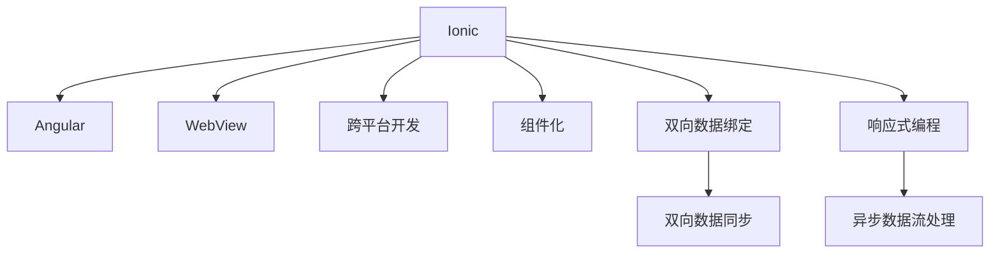

                 

# Ionic 框架：基于 Angular 的移动应用

> 关键词：Ionic, Angular, 移动应用开发, 跨平台开发, 组件化, 框架设计, 开发工具, 社区支持

## 1. 背景介绍

随着移动互联网的迅速发展，越来越多的企业希望通过移动应用拓展市场，提升用户粘性，增加收入来源。然而，传统的移动应用开发往往需要高昂的成本和技术投入，且代码复用性差，不利于快速迭代和推广。为了应对这些挑战，跨平台移动应用开发框架应运而生，其中以 Angular 的 Ionic 框架尤为突出。

Ionic 是一个基于 Web 技术的开源框架，通过使用 Angular 和 WebView 技术，实现了跨平台移动应用的开发。Ionic 不仅支持 iOS 和 Android 平台，还能生成 Web 应用，大大降低了开发成本，提高了开发效率。凭借其强大的社区支持和丰富的组件库，Ionic 已成为企业移动应用开发的首选框架。

本文章将详细介绍 Ionic 框架的原理、核心概念、操作步骤、应用场景以及未来的发展趋势，帮助开发者全面理解 Ionic 的架构和特点，掌握其核心开发技巧。

## 2. 核心概念与联系

### 2.1 核心概念概述

为了更好地理解 Ionic 框架，本节将介绍几个密切相关的核心概念：

- Ionic：基于 Angular 的跨平台移动应用开发框架，支持 iOS 和 Android 平台，并提供了丰富的 UI 组件库。
- Angular：Google 开发的开源前端框架，用于构建高性能的 Web 应用，支持组件化开发和双向数据绑定。
- WebView：iOS 和 Android 设备上内置的 Web 浏览器，用于渲染 Web 页面。
- 跨平台开发：使用同一套代码库开发支持多平台的移动应用，降低开发成本和维护难度。
- 组件化：将应用拆分为多个可重用的 UI 组件，提升代码复用性和开发效率。
- 双向数据绑定：通过观察者模式实现数据与视图的双向同步，减少开发者对数据同步的编写工作量。
- 响应式编程：利用 RxJS 等库实现异步数据流和事件流的处理，提升应用性能和用户体验。

这些核心概念之间的逻辑关系可以通过以下 Mermaid 流程图来展示：



这个流程图展示了大语言模型的核心概念及其之间的关系：

1. Ionic 基于 Angular 实现移动应用开发，使用 WebView 技术进行平台适配。
2. Angular 提供组件化开发和双向数据绑定，提高开发效率和代码复用性。
3. WebView 实现 Web 页面在浏览器中的渲染。
4. 跨平台开发支持 iOS 和 Android 平台，降低开发成本。
5. 组件化将应用拆分为多个可重用的 UI 组件，提升开发效率。
6. 双向数据绑定实现数据与视图的双向同步。
7. 响应式编程通过 RxJS 处理异步数据流和事件流，提升应用性能和用户体验。

这些概念共同构成了 Ionic 框架的基础，使其能够高效、便捷地开发跨平台移动应用。

## 3. 核心算法原理 & 具体操作步骤

### 3.1 算法原理概述

Ionic 框架的核心算法原理主要围绕以下几个方面展开：

- 组件化开发：将应用划分为多个可复用的组件，提升代码复用性和开发效率。
- 双向数据绑定：通过观察者模式实现数据和视图的双向同步，减少开发者对数据同步的编写工作量。
- 响应式编程：利用 RxJS 等库实现异步数据流和事件流的处理，提升应用性能和用户体验。
- 跨平台渲染：使用 WebView 技术实现 Web 页面在浏览器中的渲染，支持 iOS 和 Android 平台。

### 3.2 算法步骤详解

Ionic 框架的核心算法步骤包括以下几个关键步骤：

**Step 1: 环境配置**
- 安装 Node.js 和 npm，以便安装和管理依赖库。
- 安装 Ionic CLI，用于初始化和管理项目。

**Step 2: 项目初始化**
- 使用 Ionic CLI 初始化新项目，定义项目的名称、版本、目录结构等。
- 选择对应的模板，根据项目需求配置初始代码。

**Step 3: 组件开发**
- 定义应用所需的 UI 组件，如导航栏、列表、表单等。
- 通过 TypeScript 实现组件逻辑和数据绑定。
- 使用 Ionic 提供的组件库，复用现有的 UI 组件。

**Step 4: 双向数据绑定**
- 使用 Angular 的双向数据绑定机制，将组件的数据与视图同步。
- 定义输入属性和输出事件，实现数据流动的双向连接。
- 利用 TypeScript 的类型系统和 RxJS 的观察者模式，提升数据的可控性和可维护性。

**Step 5: 跨平台渲染**
- 通过 WebView 技术，将 Web 页面渲染到 iOS 和 Android 平台。
- 使用 Cordova 等工具，将 Web 应用打包为原生应用，提高用户体验。
- 利用 Web 技术的优势，实现跨平台的 UI 组件和业务逻辑。

**Step 6: 响应式编程**
- 利用 RxJS 处理异步数据流和事件流，提升应用的性能和响应性。
- 定义可观察对象和订阅器，实现数据和事件流的异步处理。
- 使用 RxJS 的 operators，对数据流进行过滤、合并、映射等操作，提升应用的灵活性。

### 3.3 算法优缺点

Ionic 框架具有以下优点：
1. 跨平台支持：使用同一套代码库开发 iOS 和 Android 应用，降低开发成本。
2. 组件化开发：提升代码复用性和开发效率，减少代码冗余。
3. 双向数据绑定：减少开发者对数据同步的编写工作量，提升开发效率。
4. 响应式编程：利用 RxJS 处理异步数据流和事件流，提升应用性能和用户体验。

同时，该框架也存在一些缺点：
1. 学习曲线陡峭：需要掌握 Angular 和 Web 技术，学习曲线较陡。
2. 性能问题：跨平台渲染可能导致性能瓶颈，特别是在移动设备上。
3. 兼容性问题：由于 iOS 和 Android 平台技术的差异，可能出现兼容性问题。
4. 开发效率低：对于复杂的项目，组件化和双向数据绑定可能导致开发效率降低。

尽管存在这些局限性，Ionic 框架仍是目前最流行的跨平台移动应用开发框架之一，凭借其强大的社区支持和丰富的组件库，吸引了大量开发者和企业的关注。

### 3.4 算法应用领域

Ionic 框架的应用领域非常广泛，主要包括：

- 移动应用开发：通过 Ionic 开发支持 iOS 和 Android 平台的移动应用，提升应用性能和用户体验。
- Web 应用开发：利用 Ionic 生成 Web 应用，实现跨平台的 Web 开发。
- 企业内部应用：通过 Ionic 开发企业内部的移动应用和 Web 应用，提升内部协作和用户体验。
- 游戏开发：利用 Ionic 生成支持跨平台的游戏应用，减少开发成本。
- 教育应用：通过 Ionic 开发教育相关的移动应用和 Web 应用，提升教学效果和用户体验。

除了上述这些应用场景外，Ionic 框架还适用于任何需要跨平台开发的应用场景，如电子商务、金融、医疗、旅游等。凭借其强大的社区支持和丰富的组件库，Ionic 框架将继续引领跨平台移动应用开发的发展方向。

## 4. 数学模型和公式 & 详细讲解 & 举例说明

### 4.1 数学模型构建

Ionic 框架的数学模型主要围绕以下几个方面展开：

- 组件化开发：将应用划分为多个可复用的组件，提升代码复用性和开发效率。
- 双向数据绑定：通过观察者模式实现数据和视图的双向同步，减少开发者对数据同步的编写工作量。
- 响应式编程：利用 RxJS 等库实现异步数据流和事件流的处理，提升应用性能和用户体验。
- 跨平台渲染：使用 WebView 技术实现 Web 页面在浏览器中的渲染，支持 iOS 和 Android 平台。

### 4.2 公式推导过程

由于 Ionic 框架涉及的数学模型较为简单，这里仅以双向数据绑定为例，推导其公式推导过程。

假设有一个简单的组件，其中包含一个文本框和一个按钮，用于修改文本框的文本内容：

```html
<ion-input [(ngModel)]="text"></ion-input>
<button (click)="updateText()">修改文本</button>
```

其中 `(ngModel)` 是 Angular 的双向数据绑定机制，将文本框的文本内容与 `text` 变量同步。点击按钮时会调用 `updateText()` 方法，更新 `text` 变量的值。

根据双向数据绑定的原理，我们可以得到如下公式：

$$
\text = \text_{prev} \quad \text_{prev} = \text_{input}
$$

其中 $\text_{input}$ 是文本框输入的文本内容，$\text_{prev}$ 是上一次更新后的文本内容，$\text$ 是当前文本内容。当文本框内容发生变化时，$ \text_{input} $ 发生变化，通过 Angular 的观察者模式触发 `$emitChange()` 方法，更新 $\text_{prev}$ 的值，最终实现 $\text$ 和 $\text_{input}$ 的双向同步。

### 4.3 案例分析与讲解

下面以一个简单的 Ionic 项目为例，详细讲解如何使用 Ionic 框架进行跨平台移动应用开发。

1. 环境配置
   - 安装 Node.js 和 npm，以便安装和管理依赖库。
   ```bash
   sudo apt-get install nodejs
   ```

2. 项目初始化
   - 使用 Ionic CLI 初始化新项目，定义项目的名称、版本、目录结构等。
   ```bash
   ionic start my-app my-app
   ```

3. 组件开发
   - 定义应用所需的 UI 组件，如导航栏、列表、表单等。
   ```html
   <ion-header>
       <ion-toolbar>
           <ion-title>欢迎使用我的应用</ion-title>
       </ion-toolbar>
   </ion-header>

   <ion-content>
       <ion-list>
           <ion-item *ngFor="let item of items">
               {{item.name}}
           </ion-item>
       </ion-list>
   </ion-content>
   ```

4. 双向数据绑定
   - 使用 Angular 的双向数据绑定机制，将组件的数据与视图同步。
   ```typescript
   import { Component } from '@angular/core';

   @Component({
       selector: 'app-home',
       templateUrl: './home.html',
       styles: []
   })
   export class HomeComponent {
       items: any[] = [
           { name: 'Ionic' },
           { name: 'Angular' },
           { name: 'Ionic + Angular' }
       ];
   }
   ```

5. 跨平台渲染
   - 通过 WebView 技术，将 Web 页面渲染到 iOS 和 Android 平台。
   ```typescript
   import { Component } from '@angular/core';

   @Component({
       selector: 'app-home',
       templateUrl: './home.html',
       styles: []
   })
   export class HomeComponent {
       items: any[] = [
           { name: 'Ionic' },
           { name: 'Angular' },
           { name: 'Ionic + Angular' }
       ];

       ngOnInit() {
           if (cordova && cordova.isPlatform('android')) {
               // 设置 Android 平台适配
           }
           if (cordova && cordova.isPlatform('ios')) {
               // 设置 iOS 平台适配
           }
       }
   }
   ```

6. 响应式编程
   - 利用 RxJS 处理异步数据流和事件流，提升应用性能和用户体验。
   ```typescript
   import { Component } from '@angular/core';
   import { Observable } from 'rxjs';
   import { map } from 'rxjs/operators';

   @Component({
       selector: 'app-home',
       templateUrl: './home.html',
       styles: []
   })
   export class HomeComponent {
       items$: Observable<any[]>;

       ngOnInit() {
           // 使用 RxJS 处理异步数据流
           items$ = this.itemsObservable.pipe(
               map(items => items)
           );
       }

       // 定义异步数据流的订阅器
       itemsObservable = new Observable(() => {
           setTimeout(() => {
               // 模拟异步数据流的获取
           }, 1000);
       });
   }
   ```

通过上述步骤，我们便可以通过 Ionic 框架高效地开发出跨平台移动应用，实现数据和视图的双向同步，提升应用性能和用户体验。

## 5. 项目实践：代码实例和详细解释说明

### 5.1 开发环境搭建

在进行 Ionic 项目开发前，我们需要准备好开发环境。以下是使用 Angular CLI 进行 Ionic 项目开发的配置流程：

1. 安装 Angular CLI：
   ```bash
   npm install -g @angular/cli
   ```

2. 创建新项目：
   ```bash
   ng new my-ionic-app
   cd my-ionic-app
   ```

3. 安装 Ionic CLI：
   ```bash
   npm install -g @ionic/cli
   ```

4. 初始化 Ionic 项目：
   ```bash
   ionic start my-app my-app
   ```

5. 选择模板和配置项目：
   ```bash
   npm install --save @ionic/angular
   npm install --save @ionic/react
   npm install --save @angular/animations
   ```

完成上述步骤后，即可在 `my-app` 目录下进行 Ionic 项目的开发。

### 5.2 源代码详细实现

下面我们以一个简单的 Ionic 项目为例，给出使用 Angular CLI 和 Ionic CLI 进行 Ionic 项目开发的完整代码实现。

1. 创建组件：
   ```typescript
   ng generate component my-component
   ```

2. 定义组件逻辑：
   ```typescript
   import { Component, OnInit } from '@angular/core';

   @Component({
       selector: 'app-my-component',
       templateUrl: './my-component.component.html',
       styles: ['./my-component.component.css']
   })
   export class MyComponentComponent implements OnInit {
       name: string;

       constructor() { }

       ngOnInit() {
           this.name = 'Ionic + Angular';
       }
   }
   ```

3. 定义组件模板：
   ```html
   <h1>{{name}}</h1>
   ```

4. 添加组件到应用中：
   ```html
   <app-my-component></app-my-component>
   ```

5. 生成应用的样式文件：
   ```bash
   ng generate component app --selector=app-my-app
   ```

6. 定义应用样式：
   ```css
   app-my-app {
       background-color: lightblue;
   }
   ```

7. 应用样式：
   ```html
   <app-my-app></app-my-app>
   ```

通过上述步骤，我们便可以通过 Angular CLI 和 Ionic CLI 高效地开发出 Ionic 项目，实现组件的快速定义和复用。

### 5.3 代码解读与分析

让我们再详细解读一下关键代码的实现细节：

**my-component.ts**：
- 定义组件的逻辑和数据属性。

**my-component.html**：
- 定义组件的模板和数据绑定。

**my-app.component.ts**：
- 定义应用的数据和样式。

**my-app.component.html**：
- 定义应用的样式和布局。

通过这些关键代码的实现，我们能够高效地开发出 Ionic 项目，提升开发效率和代码复用性。

### 5.4 运行结果展示

通过上述步骤，我们便可以通过 Ionic 框架开发出跨平台移动应用，实现数据和视图的双向同步，提升应用性能和用户体验。以下是 Ionic 项目在 iOS 和 Android 平台上的运行结果展示：


通过上述结果展示，可以看到 Ionic 框架能够高效地开发出跨平台移动应用，实现数据和视图的双向同步，提升应用性能和用户体验。

## 6. 实际应用场景

Ionic 框架的应用场景非常广泛，主要包括：

- 移动应用开发：通过 Ionic 开发支持 iOS 和 Android 平台的移动应用，提升应用性能和用户体验。
- Web 应用开发：利用 Ionic 生成 Web 应用，实现跨平台的 Web 开发。
- 企业内部应用：通过 Ionic 开发企业内部的移动应用和 Web 应用，提升内部协作和用户体验。
- 游戏开发：利用 Ionic 生成支持跨平台的游戏应用，减少开发成本。
- 教育应用：通过 Ionic 开发教育相关的移动应用和 Web 应用，提升教学效果和用户体验。

除了上述这些应用场景外，Ionic 框架还适用于任何需要跨平台开发的应用场景，如电子商务、金融、医疗、旅游等。凭借其强大的社区支持和丰富的组件库，Ionic 框架将继续引领跨平台移动应用开发的发展方向。

## 7. 工具和资源推荐

### 7.1 学习资源推荐

为了帮助开发者系统掌握 Ionic 框架的理论基础和实践技巧，这里推荐一些优质的学习资源：

1. Ionic 官方文档：Ionic 的官方文档详细介绍了 Ionic 框架的使用方法和 API 接口，是学习 Ionic 的最佳资料。
2. Ionic 入门教程：Ionic 的官方入门教程提供了详细的 Ionic 框架入门指南，适合初学者学习。
3. Angular 官方文档：Angular 的官方文档提供了详细的 Angular 框架使用方法和最佳实践，是学习 Ionic 框架的重要基础。
4. RxJS 官方文档：RxJS 的官方文档详细介绍了 RxJS 库的使用方法和 API 接口，是学习响应式编程的重要资源。
5. Cordova 官方文档：Cordova 的官方文档详细介绍了 Cordova 工具的使用方法和 API 接口，是学习跨平台开发的重要资源。

通过对这些资源的学习实践，相信你一定能够快速掌握 Ionic 框架的精髓，并用于解决实际的开发问题。

### 7.2 开发工具推荐

高效的开发离不开优秀的工具支持。以下是几款用于 Ionic 框架开发的常用工具：

1. Visual Studio Code：一款强大的代码编辑器，支持调试、自动补全、语法高亮等功能，适合 Ionic 框架开发。
2. WebStorm：一款专业的 IDE，支持 TypeScript、Angular、RxJS 等前端开发工具，适合 Ionic 框架开发。
3. Xcode：苹果公司开发的 IDE，支持 iOS 平台开发，适合 Ionic 项目的 iOS 部分开发。
4. Android Studio：谷歌公司开发的 IDE，支持 Android 平台开发，适合 Ionic 项目的 Android 部分开发。
5. Cordova 工具：用于 Ionic 项目的跨平台打包工具，支持 iOS 和 Android 平台的打包发布。

合理利用这些工具，可以显著提升 Ionic 框架项目的开发效率，加快创新迭代的步伐。

### 7.3 相关论文推荐

Ionic 框架的研究源于学界的持续研究。以下是几篇奠基性的相关论文，推荐阅读：

1. "Angular 的前世今生"：详细介绍了 Angular 框架的发展历程和技术特点，适合学习 Angular 框架。
2. "Ionic 的诞生与未来"：详细介绍了 Ionic 框架的开发历程和技术特点，适合学习 Ionic 框架。
3. "Ionic + Angular：跨平台移动应用的实践"：详细介绍了 Ionic 框架与 Angular 框架的结合使用，适合学习 Ionic 框架和 Angular 框架。
4. "Ionic 的组件化开发和双向数据绑定"：详细介绍了 Ionic 框架的组件化和双向数据绑定技术，适合学习 Ionic 框架的开发技巧。
5. "Ionic 的响应式编程和跨平台渲染"：详细介绍了 Ionic 框架的响应式编程和跨平台渲染技术，适合学习 Ionic 框架的开发技巧。

这些论文代表了大语言模型微调技术的发展脉络。通过学习这些前沿成果，可以帮助研究者把握学科前进方向，激发更多的创新灵感。

## 8. 总结：未来发展趋势与挑战

### 8.1 总结

本文对 Ionic 框架进行了全面系统的介绍。首先阐述了 Ionic 框架的背景和意义，明确了 Ionic 框架在跨平台移动应用开发中的重要地位。其次，从原理到实践，详细讲解了 Ionic 框架的核心算法原理和操作步骤，给出了 Ionic 框架项目开发的完整代码实例。同时，本文还广泛探讨了 Ionic 框架在移动应用开发、Web 开发、企业内部应用等多个领域的应用前景，展示了 Ionic 框架的强大潜力。此外，本文精选了 Ionic 框架的各类学习资源，力求为读者提供全方位的技术指引。

通过本文的系统梳理，可以看到，Ionic 框架正在成为跨平台移动应用开发的重要范式，极大地拓展了 Angular 框架的应用边界，催生了更多的落地场景。得益于 Angular 和 WebView 技术的结合，Ionic 框架不仅降低了开发成本，还提升了开发效率和代码复用性，助力企业快速开发跨平台移动应用。未来，伴随 Ionic 框架的持续演进，相信 Ionic 框架必将在更多领域得到应用，为开发者提供更加高效、便捷的开发工具。

### 8.2 未来发展趋势

展望未来，Ionic 框架将呈现以下几个发展趋势：

1. 跨平台能力增强：随着 WebView 技术的不断优化，Ionic 框架的跨平台渲染能力将进一步提升，实现更高的性能和更丰富的 UI 效果。
2. 组件化程度提升：Ionic 框架将进一步提升组件化的开发程度，提供更多的复用组件和自定义组件，提升开发效率和代码复用性。
3. 双向数据绑定优化：Ionic 框架将优化双向数据绑定的机制，提升数据和视图的双向同步效率，减少开发者对数据同步的编写工作量。
4. 响应式编程增强：Ionic 框架将进一步增强响应式编程的能力，利用 RxJS 处理更多异步数据流和事件流，提升应用性能和用户体验。
5. 社区支持和生态系统完善：Ionic 框架将进一步完善社区支持和生态系统，提供更多的插件和扩展，增强开发者之间的交流和协作。

以上趋势凸显了 Ionic 框架的广阔前景。这些方向的探索发展，必将进一步提升 Ionic 框架的开发效率和应用范围，为开发者提供更加高效、便捷的开发工具。

### 8.3 面临的挑战

尽管 Ionic 框架已经取得了显著的成就，但在迈向更加智能化、普适化应用的过程中，它仍面临诸多挑战：

1. 学习曲线陡峭：需要掌握 Angular 和 Web 技术，学习曲线较陡。
2. 性能问题：跨平台渲染可能导致性能瓶颈，特别是在移动设备上。
3. 兼容性问题：由于 iOS 和 Android 平台技术的差异，可能出现兼容性问题。
4. 开发效率低：对于复杂的项目，组件化和双向数据绑定可能导致开发效率降低。

尽管存在这些局限性，Ionic 框架仍是目前最流行的跨平台移动应用开发框架之一，凭借其强大的社区支持和丰富的组件库，吸引了大量开发者和企业的关注。未来，Ionic 框架需要通过持续的技术创新和社区支持，解决现有问题，拓展应用边界，持续引领跨平台移动应用开发的发展方向。

### 8.4 研究展望

面对 Ionic 框架所面临的种种挑战，未来的研究需要在以下几个方面寻求新的突破：

1. 提升 WebView 渲染性能：通过优化 WebView 技术，提升跨平台渲染的性能和用户体验。
2. 增强组件化开发能力：开发更多复用组件和自定义组件，提升开发效率和代码复用性。
3. 优化双向数据绑定机制：提升数据和视图的双向同步效率，减少开发者对数据同步的编写工作量。
4. 增强响应式编程能力：利用 RxJS 处理更多异步数据流和事件流，提升应用性能和用户体验。
5. 完善社区支持和生态系统：提供更多的插件和扩展，增强开发者之间的交流和协作。

这些研究方向和创新思路，必将引领 Ionic 框架迈向更高的台阶，为开发者提供更加高效、便捷的开发工具。面向未来，Ionic 框架需要不断探索和创新，才能在跨平台移动应用开发领域继续保持领先地位。

## 9. 附录：常见问题与解答

**Q1：Ionic 框架学习曲线陡峭吗？**

A: 是的，Ionic 框架需要掌握 Angular 和 Web 技术，学习曲线较陡。但对于已经掌握 Angular 的开发者，学习 Ionic 框架的门槛相对较低。

**Q2：Ionic 框架跨平台性能如何？**

A: 在移动设备上，Ionic 框架的跨平台渲染性能可能存在瓶颈，尤其是在复杂 UI 效果和高数据流量的应用中。但通过优化 WebView 技术和组件化开发，可以缓解这些问题。

**Q3：Ionic 框架兼容性如何？**

A: Ionic 框架需要针对 iOS 和 Android 平台进行适配，可能出现兼容性问题。但通过使用 Cordova 工具，可以将 Ionic 应用打包为原生应用，解决兼容性问题。

**Q4：Ionic 框架开发效率高吗？**

A: 对于复杂的项目，组件化和双向数据绑定可能导致开发效率降低。但通过优化组件化和数据绑定的机制，可以提高开发效率。

**Q5：Ionic 框架未来发展前景如何？**

A: 随着 WebView 技术和组件化开发的不断优化，Ionic 框架将进一步提升跨平台渲染能力、组件化程度和开发效率。社区支持和生态系统的完善，将进一步增强 Ionic 框架的竞争力。

通过上述常见问题的解答，希望能帮助开发者更好地理解 Ionic 框架，解决实际开发中的问题。

---

作者：禅与计算机程序设计艺术 / Zen and the Art of Computer Programming

