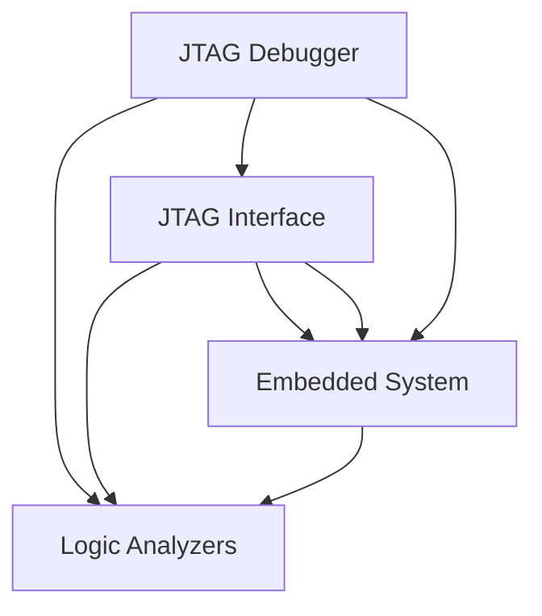

                 

# JTAG 调试技术：在嵌入式系统上的应用

> 关键词：JTAG, 嵌入式系统, 调试, 硬件接口, 串行通信

## 1. 背景介绍

### 1.1 问题由来

在现代电子设计中，嵌入式系统已广泛应用于各种设备，如工业自动化、消费电子产品、医疗设备等。嵌入式系统中的硬件设计常常需要微调或更新，这要求开发人员具备高度可靠和高效的调试手段。嵌入式系统的复杂性和多样性使得调试工作变得更为繁琐和困难。此时，一种名为 JTAG (Joint Test Action Group) 的调试技术应运而生，它为嵌入式系统的调试提供了强有力的支持。

### 1.2 问题核心关键点

JTAG 调试技术是一个标准的硬件接口规范，用于访问和测试内部硬件模块。它的核心在于其能够实现对嵌入式系统芯片的完全访问，从而支持软硬件故障排除和实时调试。JTAG 技术的独特优势在于其高调试效率和低成本。通过 JTAG 调试，开发者可以实时地修改代码、监控变量，以及诊断硬件问题，极大提高了嵌入式系统的开发效率。

## 2. 核心概念与联系

### 2.1 核心概念概述

在深入了解 JTAG 调试技术之前，让我们首先了解几个关键概念：

- **JTAG (Joint Test Action Group)**: 一个国际联盟，制定了用于调试嵌入式设备的测试协议。
- **JTAG 协议**: 一个用于调试和测试嵌入式设备的串行通信协议。
- **边界扫描技术**: 一种利用寄存器存储芯片引脚状态，并通过 JTAG 协议进行访问的技术。
- **逻辑分析仪**: 一种用于捕获和分析数字信号的工具，常用于 JTAG 调试。

这些概念构成了 JTAG 调试技术的基础。JTAG 协议通过串行通信实现了对嵌入式系统芯片的访问，边界扫描技术使得芯片内部状态可以被外部调试器访问。

### 2.2 核心概念原理和架构的 Mermaid 流程图



这个图展示了 JTAG 调试技术的基本架构。调试器通过 JTAG 接口与嵌入式系统进行通信，边界扫描技术使得芯片内部状态可以被调试器访问。逻辑分析仪用于捕获和分析信号，以辅助调试。

## 3. 核心算法原理 & 具体操作步骤

### 3.1 算法原理概述

JTAG 调试的核心原理是通过 JTAG 协议实现对芯片的串行访问。调试器与嵌入式系统通过 JTAG 接口交换数据，实现对芯片内部寄存器和信号的读取和写入。

### 3.2 算法步骤详解

JTAG 调试的步骤包括：

1. **连接 JTAG 接口**: 使用 JTAG 电缆连接调试器和嵌入式系统。
2. **初始化 JTAG 协议**: 调试器向嵌入式系统发送 JTAG 协议指令，初始化通信。
3. **访问芯片内部寄存器**: 调试器通过 JTAG 协议访问芯片内部寄存器，获取和设置芯片状态。
4. **调试应用程序**: 调试器可以在程序运行时实时修改代码、设置断点、观察变量等。
5. **收集调试数据**: 使用逻辑分析仪捕获和分析调试数据，进行问题诊断。

### 3.3 算法优缺点

**优点**：

- 支持全芯片访问，对复杂的嵌入式系统调试高效。
- 支持实时调试，便于迅速发现和解决问题。
- 标准化的接口，易于与多种开发环境集成。

**缺点**：

- 调试接口可能会影响芯片的性能和功耗。
- 需要专门的工具和硬件支持，成本较高。
- 调试复杂系统时，可能需要较长的学习曲线。

### 3.4 算法应用领域

JTAG 调试技术广泛应用于各种嵌入式系统调试中，包括：

- **嵌入式微控制器**: 如 ARM Cortex-M、TI MSP430 等。
- **FPGA 和 ASIC 芯片**: 用于验证和测试设计。
- **数字信号处理器 (DSP)**: 如 TMS320、Xilinx FPGA 等。
- **汽车电子**: 如 ADAS (高级驾驶辅助系统)、仪表盘控制等。

## 4. 数学模型和公式 & 详细讲解 & 举例说明

### 4.1 数学模型构建

JTAG 协议是一种串行通信协议，其基本通信单元为 JTAG 指令，包括四种基本指令：

- **Test Data Transfer (TDT)**: 用于读取和写入数据。
- **Test Data Output (TDO)**: 用于输出读取的数据。
- **Test Data Input (TDI)**: 用于输入写入的数据。
- **Shift Register Access (SRA)**: 用于访问边界扫描寄存器。

### 4.2 公式推导过程

以 TDT 指令为例，其基本结构为：

$$
\text{TDT: ID[7:0], ADDR[7:0], DATA[7:0]
$$

其中 ID 和 ADDR 用于指定寄存器和数据地址，DATA 为要写入的数据。调试器通过 JTAG 接口发送 TDT 指令，即可完成对芯片的写入操作。

### 4.3 案例分析与讲解

考虑一个简单的嵌入式系统调试过程。假设有一个嵌入式系统需要调试，其内部寄存器如下图所示：

```
+--------+ +--------+ +--------+
| A[31:0] | | B[31:0] | | C[31:0] |
+--------+ +--------+ +--------+
```

调试器通过 TDI 和 TDO 线，向芯片发送 TDT 指令，以读取寄存器 B 的值。指令格式为：

$$
\text{TDT: ID[7:0]=0x00, ADDR[7:0]=0x00, DATA[7:0]=\text{空}
$$

调试器发送该指令后，芯片会将寄存器 B 的值通过 TDO 线返回给调试器。

## 5. 项目实践：代码实例和详细解释说明

### 5.1 开发环境搭建

进行 JTAG 调试之前，需要搭建一个合适的开发环境。典型的开发环境包括：

- **JTAG 调试器**: 如 ST-LINK V2，用于连接调试器与嵌入式系统。
- **开发平台**: 如 Keil µVision、IAR Embedded Workbench 等，用于编程和调试。
- **逻辑分析仪**: 如 Yazaki XY-4211，用于捕获和分析调试数据。

### 5.2 源代码详细实现

以下是使用 ST-LINK V2 调试器进行调试的 Python 代码示例：

```python
from stlink.v2abc import STLink

stlink = STLink()
stlink.init()

# 访问芯片寄存器
data = stlink.write_and_read_memory(0x40013C10, 0x4)
print(f"寄存器 A 的值为: {data}")

# 写入芯片寄存器
stlink.write_memory(0x40013C10, [0x12345678])

# 使用逻辑分析仪捕获调试数据
# 具体实现可参考相应工具的 API 文档
```

### 5.3 代码解读与分析

代码中主要涉及以下几个关键步骤：

1. **连接调试器**: 使用 STLink 模块初始化调试器，建立调试连接。
2. **读取芯片寄存器**: 通过 write_and_read_memory 函数，读取芯片寄存器的值。
3. **写入芯片寄存器**: 通过 write_memory 函数，向芯片寄存器写入数据。
4. **捕获调试数据**: 使用逻辑分析仪 API 捕获调试数据，并进行分析。

这些步骤展示了 JTAG 调试的基本操作流程。

### 5.4 运行结果展示

运行以上代码，将得到芯片内部寄存器的读/写结果。通过 JTAG 调试器，可以实时地观察和修改芯片状态，极大提高了嵌入式系统的开发效率。

## 6. 实际应用场景

### 6.1 嵌入式系统测试

JTAG 调试技术在嵌入式系统测试中发挥了重要作用。通过 JTAG 调试器，可以在不拆解设备的情况下，实时监测和修改内部状态，快速定位和解决硬件问题。在嵌入式系统设计中，JTAG 调试器是不可或缺的工具。

### 6.2 实时应用程序调试

嵌入式系统常常需要运行实时应用程序，JTAG 调试技术能够实时地获取和分析应用程序的状态，帮助开发者迅速定位代码问题。在软件调试中，JTAG 调试器提供了高效、可靠的手段。

### 6.3 硬件故障排除

JTAG 调试技术能够访问芯片内部状态，对于硬件故障的定位和排除提供了极大的帮助。在硬件设计和测试中，JTAG 调试器是不可或缺的工具。

## 7. 工具和资源推荐

### 7.1 学习资源推荐

为了深入了解 JTAG 调试技术，以下是一些优质的学习资源：

1. **JTAG 调试技术手册**: 详细介绍了 JTAG 协议和调试工具的使用。
2. **嵌入式系统调试指南**: 提供了 JTAG 调试和嵌入式系统开发的实战经验。
3. **ST-LINK V2 用户手册**: 具体介绍了 ST-LINK V2 调试器的操作和配置。
4. **Keil µVision 教程**: 提供了使用 Keil µVision 进行 JTAG 调试的教程。

这些资源可以帮助开发者全面掌握 JTAG 调试技术。

### 7.2 开发工具推荐

JTAG 调试技术常用的工具包括：

- **ST-LINK V2**: 业界领先的 JTAG 调试器，支持多种嵌入式系统。
- **X-Tracer**: 一款功能强大的逻辑分析仪，用于捕获和分析调试数据。
- **IAR Embedded Workbench**: 一款流行的嵌入式系统开发平台，支持 JTAG 调试。

### 7.3 相关论文推荐

以下是一些关于 JTAG 调试技术的经典论文，供进一步学习：

1. **JTAG: A Debugging and Test Tool for Embedded Systems**: 详细介绍了 JTAG 协议的基本原理和使用方法。
2. **Hardware Debugging with JTAG**: 介绍了 JTAG 调试器的硬件实现和调试流程。
3. **Real-Time Application Debugging with JTAG**: 探讨了 JTAG 调试技术在实时应用程序中的使用。

## 8. 总结：未来发展趋势与挑战

### 8.1 研究成果总结

JTAG 调试技术在嵌入式系统领域已得到了广泛的应用，其高效、可靠的特点使其成为不可或缺的调试手段。通过 JTAG 调试，开发者可以迅速定位和解决问题，极大提高了嵌入式系统的开发效率。

### 8.2 未来发展趋势

未来的 JTAG 调试技术将呈现以下几个发展趋势：

1. **自动化调试**: 通过机器学习等技术，实现自动化问题定位和修复。
2. **无线调试**: 通过蓝牙、Wi-Fi 等无线通信协议，实现无线调试功能。
3. **云调试**: 利用云计算平台，实现远程调试和问题共享。
4. **多芯片调试**: 支持同时调试多个芯片，提高调试效率。

### 8.3 面临的挑战

尽管 JTAG 调试技术已经取得了显著的进展，但仍面临一些挑战：

1. **调试接口标准化**: 需要进一步推动 JTAG 接口的规范化，支持更多嵌入式系统。
2. **调试数据安全**: 需要加强调试数据的安全性，防止敏感信息泄漏。
3. **调试效率提升**: 需要进一步提升调试效率，减少调试时间。
4. **工具集成**: 需要更好地集成调试工具与开发环境，提供更友好的使用体验。

### 8.4 研究展望

未来的研究重点在于：

1. **自动化和智能化**: 引入自动化和智能化技术，提高调试效率和质量。
2. **安全性和可靠性**: 增强 JTAG 调试的安全性和可靠性，确保调试过程的安全性。
3. **跨平台支持**: 支持更多平台和协议，实现跨平台调试。

总之，JTAG 调试技术在嵌入式系统调试中发挥了重要作用，其未来的发展将更加注重自动化、智能化和安全性的提升。

## 9. 附录：常见问题与解答

**Q1: JTAG 调试器有哪些常见的连接方式？**

A: JTAG 调试器的连接方式包括：

1. **直接连接**: 使用 JTAG 电缆直接连接调试器和芯片。
2. **中间桥接器**: 通过中间桥接器进行连接，如 JTAG-TTL 转换器。
3. **远程调试**: 通过网络协议进行远程调试，如 JTAG-over-USB。

**Q2: 如何配置调试器的访问权限？**

A: 配置调试器的访问权限需要确保安全，防止未授权访问。可以通过以下方式实现：

1. **设置密码**: 使用调试器的密码保护功能，确保只有授权人员可以进行调试。
2. **访问控制**: 通过 IP 地址过滤等手段，限制调试器的访问来源。
3. **权限管理**: 通过调试器管理软件，对调试器的访问权限进行严格控制。

**Q3: 在使用 JTAG 调试时，如何处理调试数据的存储和分析？**

A: 处理 JTAG 调试数据需要建立相应的存储和分析机制：

1. **数据存储**: 使用数据库或文件系统，存储调试数据，便于后续分析。
2. **数据分析**: 利用数据分析工具，如 MATLAB、Python 等，对调试数据进行深入分析。
3. **数据可视化**: 使用图形界面工具，如 MATLAB、Tableau 等，将分析结果可视化，便于快速识别问题。

---

作者：禅与计算机程序设计艺术 / Zen and the Art of Computer Programming

