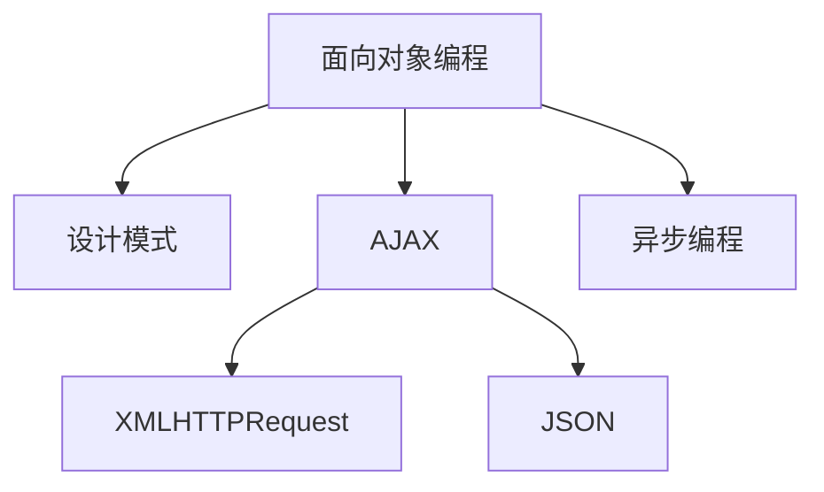

                 

# JavaScript 高级主题：面向对象编程和 AJAX

> 关键词：JavaScript, 面向对象编程, 设计模式, 事件驱动, AJAX, XMLHTTPRequest, JSON, 异步编程, 前端框架

## 1. 背景介绍

### 1.1 问题由来

在Web开发领域，JavaScript是实现动态交互体验的核心语言。但传统的JavaScript编程模式往往较为松散、难以维护，导致前端开发者在项目中面临诸多挑战。为了提升JavaScript代码的模块化、可复用性和可维护性，面向对象编程(OOP)和AJAX技术应运而生。

面向对象编程是一种基于对象的编程范式，通过封装数据和方法，使得代码结构更加清晰、易于扩展。而AJAX（Asynchronous JavaScript and XML）技术则通过异步请求和响应，使得Web页面无需刷新即可更新数据，提升了用户体验。

本文将深入探讨JavaScript的面向对象编程和AJAX技术，帮助读者掌握如何高效、优雅地使用这些先进技术，构建高性能、高可靠性的Web应用。

### 1.2 问题核心关键点

- 面向对象编程的原理和设计模式
- AJAX的异步请求和响应机制
- 如何使用OOP和AJAX实现模块化、可复用、可维护的Web应用
- OOP和AJAX在实际项目中的具体应用

## 2. 核心概念与联系

### 2.1 核心概念概述

为了更好地理解面向对象编程和AJAX技术，本节将介绍几个密切相关的核心概念：

- 面向对象编程（OOP）：基于对象的编程范式，通过封装、继承和多态等特性，提升代码的可维护性和可复用性。
- 设计模式：常用的设计思想和解决方案，用于解决特定场景下的常见问题。
- AJAX：基于异步请求和响应的Web技术，通过JavaScript实现无需页面刷新的数据更新。
- XMLHTTPRequest：XMLHTTPRequest对象，用于实现AJAX请求和响应。
- JSON：一种轻量级的数据交换格式，常用于AJAX的数据传输。
- 异步编程：通过回调函数、Promise、async/await等方式，实现非阻塞的异步执行。

这些核心概念之间的逻辑关系可以通过以下Mermaid流程图来展示：



这个流程图展示了几大核心概念之间的联系：

1. 面向对象编程是OOP的基础，通过封装和继承提升代码复用性。
2. 设计模式是OOP的高级应用，解决特定问题的常用解决方案。
3. AJAX是Web应用的核心技术，通过异步请求和响应实现数据更新。
4. XMLHTTPRequest是AJAX的核心工具，实现异步HTTP请求。
5. JSON是数据交换的标准格式，在AJAX数据传输中广泛应用。
6. 异步编程是AJAX的基础，提升Web应用的响应速度。

这些核心概念共同构成了JavaScript高级技术的核心框架，使得前端开发变得更加高效和灵活。

## 3. 核心算法原理 & 具体操作步骤
### 3.1 算法原理概述

面向对象编程和AJAX技术在原理上有着密切的联系。以下是两者核心原理的详细介绍：

#### 面向对象编程（OOP）的原理

OOP的核心思想是通过对象来组织代码，每个对象封装了数据和方法，具备封装性、继承性和多态性等特性。封装性使得对象内部的数据和方法对外不可见，提高了代码的安全性和可维护性；继承性使得子类可以继承父类的属性和方法，提升代码的复用性；多态性使得同一方法可以在不同对象上表现出不同的行为，增强了代码的灵活性。

#### AJAX的原理

AJAX技术基于异步请求和响应的设计思想。传统的Web交互方式通过重载页面实现数据更新，会导致页面刷新，用户体验较差。而AJAX技术通过异步请求服务器数据，将响应数据动态添加到页面中，实现了无需页面刷新的数据更新。这种设计方式不仅提升了用户体验，还提升了Web应用的响应速度。

### 3.2 算法步骤详解

#### 面向对象编程（OOP）的步骤

1. 定义类：定义一个类，封装数据和方法。
2. 创建对象：通过new关键字创建类的实例。
3. 调用方法：通过对象调用类中定义的方法。
4. 继承和多态：通过继承父类的方法和属性，实现多态性。

#### AJAX的步骤

1. 创建XMLHTTPRequest对象：使用XMLHTTPRequest对象发送异步请求。
2. 发送请求：设置请求参数和URL，发送异步请求。
3. 接收响应：通过回调函数或Promise对象接收服务器响应。
4. 更新页面：将响应数据动态添加到页面中，实现数据更新。

### 3.3 算法优缺点

#### 面向对象编程（OOP）的优缺点

- 优点：
  - 封装性：提高了代码的安全性和可维护性。
  - 继承性：提升了代码的复用性。
  - 多态性：增强了代码的灵活性。

- 缺点：
  - 学习成本高：需要理解OOP的基本概念和设计模式。
  - 性能开销大：封装和继承会导致一定的性能开销。

#### AJAX的优缺点

- 优点：
  - 提升用户体验：无需页面刷新的数据更新。
  - 提升Web应用响应速度：异步请求提升了Web应用的响应速度。

- 缺点：
  - 学习成本高：需要理解异步请求和响应的原理。
  - 性能开销大：异步请求和响应需要一定的性能开销。

### 3.4 算法应用领域

面向对象编程和AJAX技术在Web开发中有着广泛的应用：

- 面向对象编程：用于实现模块化、可复用、可维护的代码结构。
- AJAX：用于实现无需页面刷新的数据更新，提升Web应用的响应速度。

在实际项目中，面向对象编程和AJAX技术往往结合使用，通过封装数据和方法，实现模块化的代码结构，并通过异步请求和响应，提升Web应用的响应速度和用户体验。

## 4. 数学模型和公式 & 详细讲解  
### 4.1 数学模型构建

在面向对象编程和AJAX技术的理论基础中，数学模型和公式主要用于描述算法的基本原理和步骤。

#### 面向对象编程的数学模型

在面向对象编程中，通常使用类和对象的概念来组织代码。设类A包含属性和方法，对象a是类A的实例。类A和对象a的数学模型可以表示为：

- 类A的数学模型：
  $$
  A = (P_A, M_A)
  $$
  其中 $P_A$ 表示类的属性集合，$M_A$ 表示类的方法集合。

- 对象a的数学模型：
  $$
  a = (P_a, M_a)
  $$
  其中 $P_a$ 表示对象a的属性集合，$M_a$ 表示对象a的方法集合。

#### AJAX的数学模型

在AJAX技术中，通常使用XMLHTTPRequest对象和回调函数来实现异步请求和响应。设XMLHTTPRequest对象为 $r$，服务器响应为 $d$，数学模型可以表示为：

- XMLHTTPRequest对象 $r$ 的数学模型：
  $$
  r = (P_r, M_r)
  $$
  其中 $P_r$ 表示XMLHTTPRequest对象的属性集合，$M_r$ 表示XMLHTTPRequest对象的方法集合。

- 服务器响应 $d$ 的数学模型：
  $$
  d = (P_d, M_d)
  $$
  其中 $P_d$ 表示服务器响应的属性集合，$M_d$ 表示服务器响应的方法集合。

### 4.2 公式推导过程

#### 面向对象编程的公式推导

在面向对象编程中，常用的公式推导包括：

- 封装性：通过访问控制符（如public、private）限制对象的访问权限，保证数据的安全性。
- 继承性：通过继承关系，将父类的属性和方法传递给子类。
- 多态性：通过多态性，实现同一方法在不同对象上表现出不同的行为。

#### AJAX的公式推导

在AJAX技术中，常用的公式推导包括：

- 异步请求：通过XMLHTTPRequest对象的open()和send()方法，实现异步请求。
- 异步响应：通过XMLHTTPRequest对象的onreadystatechange事件，实现异步响应。
- 数据传输：通过JSON格式的数据交换，实现数据传输。

### 4.3 案例分析与讲解

#### 面向对象编程的案例

假设有一个学生类，包含学生的姓名、年龄和成绩属性，以及获取成绩的方法。可以使用以下代码实现：

```javascript
class Student {
  constructor(name, age, score) {
    this.name = name;
    this.age = age;
    this.score = score;
  }
  
  getScore() {
    return this.score;
  }
}

const stu = new Student('张三', 18, 90);
console.log(stu.getName()); // 输出：张三
console.log(stu.getScore()); // 输出：90
```

#### AJAX的案例

假设有一个动态加载用户信息的AJAX应用，可以使用以下代码实现：

```javascript
const xhr = new XMLHttpRequest();
xhr.open('GET', '/user');
xhr.onreadystatechange = function() {
  if (xhr.readyState === 4 && xhr.status === 200) {
    const data = JSON.parse(xhr.responseText);
    // 动态更新页面
    const name = document.getElementById('name');
    const age = document.getElementById('age');
    name.innerHTML = data.name;
    age.innerHTML = data.age;
  }
};
xhr.send();
```

## 5. 项目实践：代码实例和详细解释说明
### 5.1 开发环境搭建

在进行面向对象编程和AJAX项目实践前，我们需要准备好开发环境。以下是使用Node.js进行JavaScript开发的开发环境配置流程：

1. 安装Node.js：从官网下载并安装Node.js，用于运行JavaScript代码。

2. 创建项目目录：创建一个新的项目目录，用于存放代码和配置文件。

3. 初始化npm包：在项目目录中，使用以下命令初始化npm包：

```bash
npm init
```

4. 安装开发工具：使用以下命令安装常用的JavaScript开发工具：

```bash
npm install -g npm@latest
npm install -g yarn
npm install -g nodemon
npm install -g eslint
```

完成上述步骤后，即可在项目目录中开始面向对象编程和AJAX项目实践。

### 5.2 源代码详细实现

#### 面向对象编程的代码实现

以下是一个简单的学生管理系统，使用面向对象编程实现：

```javascript
class Student {
  constructor(name, age, score) {
    this.name = name;
    this.age = age;
    this.score = score;
  }
  
  getScore() {
    return this.score;
  }
  
  getAge() {
    return this.age;
  }
}

class Teacher {
  constructor(name, subject) {
    this.name = name;
    this.subject = subject;
  }
  
  teach() {
    console.log(`老师${this.name}教授${this.subject}`);
  }
}

const stu = new Student('张三', 18, 90);
console.log(stu.getName()); // 输出：张三
console.log(stu.getScore()); // 输出：90

const teacher = new Teacher('李四', '数学');
teacher.teach(); // 输出：老师李四教授数学
```

#### AJAX的代码实现

以下是一个简单的动态加载数据的应用，使用AJAX技术实现：

```javascript
const xhr = new XMLHttpRequest();
xhr.open('GET', '/user');
xhr.onreadystatechange = function() {
  if (xhr.readyState === 4 && xhr.status === 200) {
    const data = JSON.parse(xhr.responseText);
    // 动态更新页面
    const name = document.getElementById('name');
    const age = document.getElementById('age');
    name.innerHTML = data.name;
    age.innerHTML = data.age;
  }
};
xhr.send();
```

### 5.3 代码解读与分析

#### 面向对象编程的代码解读

- `class Student` 定义了一个学生类，包含学生姓名、年龄和成绩属性，以及获取成绩和年龄的方法。
- `new Student('张三', 18, 90)` 创建了一个学生对象 `stu`，包含学生的具体信息。
- `stu.getName()` 和 `stu.getScore()` 分别调用了学生对象 `stu` 的 `getName()` 和 `getScore()` 方法，获取学生的姓名和成绩。
- `class Teacher` 定义了一个教师类，包含教师姓名和教授的科目，以及教授方法。
- `new Teacher('李四', '数学')` 创建了一个教师对象 `teacher`，包含教师的具体信息。
- `teacher.teach()` 调用了教师对象 `teacher` 的 `teach()` 方法，输出教师教授的科目。

#### AJAX的代码解读

- `XMLHttpRequest` 对象 `xhr` 用于发送异步请求。
- `xhr.open('GET', '/user')` 设置了异步请求的URL和请求方式。
- `xhr.onreadystatechange` 事件处理函数，用于在异步请求过程中接收响应。
- `xhr.send()` 发送异步请求。
- `xhr.responseText` 获取服务器响应的数据，解析为JSON格式，存储在 `data` 变量中。
- 根据服务器响应数据，动态更新页面元素 `name` 和 `age` 的文本内容。

## 6. 实际应用场景
### 6.1 面向对象编程的应用场景

面向对象编程在Web开发中有着广泛的应用：

- 模块化开发：通过封装数据和方法，实现模块化的代码结构，提升代码的可维护性和复用性。
- 插件化开发：通过继承和扩展现有类，实现插件化的开发方式，提升代码的灵活性和可扩展性。
- 组件化开发：通过封装组件的接口和行为，实现组件化的开发方式，提升代码的可维护性和可复用性。

### 6.2 AJAX的应用场景

AJAX技术在Web开发中也得到了广泛的应用：

- 动态数据加载：通过异步请求和响应，实现无需页面刷新的数据更新，提升用户体验。
- 异步请求处理：通过XMLHTTPRequest对象，实现异步请求和响应的处理，提升Web应用的响应速度。
- 数据交换格式：通过JSON格式的数据交换，实现数据的传输和存储，提升数据处理的效率。

### 6.3 未来应用展望

随着Web技术的不断发展，面向对象编程和AJAX技术在实际项目中的应用前景将更加广阔：

- 模块化开发：通过封装和继承，实现更加模块化和可复用的代码结构，提升开发效率和代码质量。
- 插件化开发：通过扩展和定制现有类，实现更加灵活和可扩展的开发方式，提升开发灵活性和可扩展性。
- 组件化开发：通过封装组件的接口和行为，实现更加组件化和可维护的开发方式，提升开发效率和代码质量。
- 动态数据加载：通过异步请求和响应，实现更加动态和响应速度快的Web应用，提升用户体验。
- 异步请求处理：通过XMLHTTPRequest对象，实现更加高效和可靠的异步请求和响应处理，提升Web应用的响应速度。
- 数据交换格式：通过JSON格式的数据交换，实现更加灵活和高效的数据传输和存储，提升数据处理的效率。

## 7. 工具和资源推荐
### 7.1 学习资源推荐

为了帮助开发者掌握面向对象编程和AJAX技术，这里推荐一些优质的学习资源：

1. 《JavaScript高级程序设计》（第三版）：由Nicholas C. Zakas所著，全面介绍了JavaScript的面向对象编程和AJAX技术。

2. 《Design Patterns》（第2版）：由Erich Gamma等所著，介绍了常用的设计模式，帮助开发者解决特定场景下的常见问题。

3. 《JavaScript框架揭秘》：由Elisabeth Robson所著，介绍了主流JavaScript框架（如React、Vue等）的原理和应用。

4. 《深入理解Node.js》：由Erik Meyer所著，介绍了Node.js的异步编程和AJAX技术，帮助开发者提升JavaScript开发能力。

5. 《JavaScript深度学习》：由Maximilian Neumann所著，介绍了JavaScript在深度学习中的使用，帮助开发者了解JavaScript的高级应用。

通过对这些资源的学习实践，相信你一定能够掌握面向对象编程和AJAX技术的精髓，并用于解决实际的Web开发问题。

### 7.2 开发工具推荐

高效的开发离不开优秀的工具支持。以下是几款用于JavaScript开发的常用工具：

1. Visual Studio Code：轻量级的代码编辑器，支持JavaScript和TypeScript，提供了丰富的插件和扩展。

2. WebStorm：强大的JavaScript IDE，提供了丰富的功能和插件，支持JavaScript、React、Vue等技术。

3. Node.js：开源的JavaScript运行时环境，支持JavaScript的后端开发和Node.js应用。

4. React、Vue等框架：提供丰富的组件和库，帮助开发者构建高性能的Web应用。

5. npm、yarn等包管理工具：提供了丰富的Node.js包和工具，帮助开发者快速构建和发布JavaScript应用。

合理利用这些工具，可以显著提升JavaScript开发的效率和质量，加速项目的迭代和交付。

### 7.3 相关论文推荐

JavaScript和Web技术的研究源于学界的持续探索。以下是几篇奠基性的相关论文，推荐阅读：

1. JavaScript：The Language of Hypertext Applications（Chad A. Herb�）：介绍了JavaScript的起源和应用，奠定了JavaScript在Web开发中的地位。

2. AJAX: Responsive Web Applications with JavaScript（Joel Spolsky）：介绍了AJAX技术的原理和应用，帮助开发者了解AJAX的核心思想。

3. JavaScript Object-Oriented Programming with DPs（Jacob）：介绍了JavaScript的面向对象编程和设计模式，帮助开发者掌握OOP的基本概念和应用。

4. JavaScript Patterns（ Addy Osmani）：介绍了常用的JavaScript设计模式，帮助开发者解决特定场景下的常见问题。

5. WebAssembly and JavaScript in the Browser（Ezra Levin）：介绍了WebAssembly和JavaScript在浏览器中的应用，帮助开发者了解JavaScript的高级应用。

这些论文代表了JavaScript和Web技术的不断发展，通过学习这些前沿成果，可以帮助研究者把握学科前进方向，激发更多的创新灵感。

## 8. 总结：未来发展趋势与挑战

### 8.1 总结

本文对JavaScript的面向对象编程和AJAX技术进行了全面系统的介绍。首先阐述了OOP和AJAX的基本概念和原理，明确了它们在Web开发中的重要地位。其次，从原理到实践，详细讲解了OOP和AJAX技术的实现方法和步骤，给出了具体的代码实例。同时，本文还广泛探讨了OOP和AJAX技术在实际项目中的应用前景，展示了它们巨大的潜力。

通过本文的系统梳理，可以看到，面向对象编程和AJAX技术在Web开发中具有广泛的应用，为前端开发者提供了强大的技术支持。未来，伴随技术的不断演进，OOP和AJAX技术必将不断拓展其应用边界，为Web应用的开发和优化带来更多可能性。

### 8.2 未来发展趋势

展望未来，JavaScript的面向对象编程和AJAX技术将呈现以下几个发展趋势：

1. 模块化开发：通过封装和继承，实现更加模块化和可复用的代码结构，提升开发效率和代码质量。
2. 插件化开发：通过扩展和定制现有类，实现更加灵活和可扩展的开发方式，提升开发灵活性和可扩展性。
3. 组件化开发：通过封装组件的接口和行为，实现更加组件化和可维护的开发方式，提升开发效率和代码质量。
4. 动态数据加载：通过异步请求和响应，实现更加动态和响应速度快的Web应用，提升用户体验。
5. 异步请求处理：通过XMLHTTPRequest对象，实现更加高效和可靠的异步请求和响应处理，提升Web应用的响应速度。
6. 数据交换格式：通过JSON格式的数据交换，实现更加灵活和高效的数据传输和存储，提升数据处理的效率。

### 8.3 面临的挑战

尽管JavaScript的面向对象编程和AJAX技术已经取得了显著的成就，但在迈向更加智能化、普适化应用的过程中，它们仍面临诸多挑战：

1. 学习成本高：JavaScript的面向对象编程和AJAX技术需要理解OOP和异步编程的基本概念和实现方式。
2. 性能开销大：封装和继承会导致一定的性能开销，异步请求和响应需要一定的计算资源。
3. 代码复杂度高：复杂的代码结构和继承关系，容易导致代码难以理解和维护。
4. 数据安全问题：通过AJAX技术，Web应用面临更高的数据安全风险，需要加强安全防护措施。
5. 兼容性问题：JavaScript的异步请求和响应需要考虑不同浏览器的兼容性问题，需要额外的兼容性处理。

### 8.4 研究展望

为了应对这些挑战，未来的研究需要在以下几个方面寻求新的突破：

1. 提升学习效率：通过更加简洁和易懂的教学方式，帮助开发者快速掌握JavaScript的面向对象编程和AJAX技术。
2. 优化性能：通过代码优化和异步编程技术，提升JavaScript应用的性能和响应速度。
3. 提升代码可维护性：通过模块化、组件化等设计思想，提升JavaScript代码的可维护性和可扩展性。
4. 加强安全防护：通过数据加密、访问控制等技术，加强JavaScript应用的数据安全防护。
5. 解决兼容性问题：通过统一的API规范和兼容性处理方式，解决JavaScript应用在不同浏览器上的兼容性问题。

这些研究方向将有助于JavaScript的面向对象编程和AJAX技术在实际项目中的广泛应用，提升Web应用的开发效率和用户体验。

## 9. 附录：常见问题与解答

**Q1：JavaScript的面向对象编程和AJAX技术是否适用于所有Web开发场景？**

A: JavaScript的面向对象编程和AJAX技术适用于大多数Web开发场景，特别是对于需要实现动态数据加载和异步请求的场景。但对于一些需要特定功能的Web应用，可能需要使用其他技术实现，如使用WebAssembly实现高性能计算。

**Q2：JavaScript的面向对象编程和AJAX技术在实际项目中应该如何选择？**

A: 在实际项目中，应该根据具体需求选择合适的技术和设计模式。例如，如果需要实现复杂的数据处理和业务逻辑，可以使用JavaScript的面向对象编程；如果需要实现无需页面刷新的数据更新，可以使用AJAX技术。同时，在实际项目中，应该尽量使用已有的框架和库，避免重复造轮子。

**Q3：JavaScript的面向对象编程和AJAX技术如何提高开发效率？**

A: 提高开发效率的关键在于掌握技术的基本原理和实现方式，并合理使用现有的工具和框架。例如，使用JavaScript的面向对象编程和AJAX技术，可以提升代码的模块化和可复用性，提升开发效率。同时，使用现成的框架和库，如React、Vue等，可以提升开发效率，减少开发时间。

**Q4：JavaScript的面向对象编程和AJAX技术如何提高代码可维护性？**

A: 提高代码可维护性的关键在于良好的代码结构设计和文档编写。例如，使用JavaScript的面向对象编程和AJAX技术，可以提升代码的模块化和可复用性，降低代码的耦合度，提高代码的可维护性。同时，编写清晰、详细的代码注释和文档，可以帮助其他开发者理解和维护代码。

**Q5：JavaScript的面向对象编程和AJAX技术在实际项目中应该注意哪些问题？**

A: 在实际项目中，JavaScript的面向对象编程和AJAX技术需要注意以下几个问题：

1. 代码复杂度：JavaScript的面向对象编程和AJAX技术可能导致代码复杂度较高，需要合理设计代码结构和继承关系。
2. 数据安全：JavaScript的AJAX技术需要加强数据安全防护，避免数据泄露和攻击。
3. 兼容性：JavaScript的异步请求和响应需要考虑不同浏览器的兼容性问题，需要额外的兼容性处理。
4. 性能优化：JavaScript的面向对象编程和AJAX技术需要优化性能，避免因封装和异步请求导致性能瓶颈。
5. 学习成本：JavaScript的面向对象编程和AJAX技术需要掌握OOP和异步编程的基本概念和实现方式，需要一定的学习成本。

综上所述，JavaScript的面向对象编程和AJAX技术是Web开发中不可或缺的核心技术，掌握这些技术将为前端开发者提供强大的技术支持，提升开发效率和代码质量。但在使用这些技术时，需要注意技术的基本原理和实现方式，合理设计代码结构和继承关系，加强数据安全防护，优化性能，并注意兼容性问题和学习成本。

