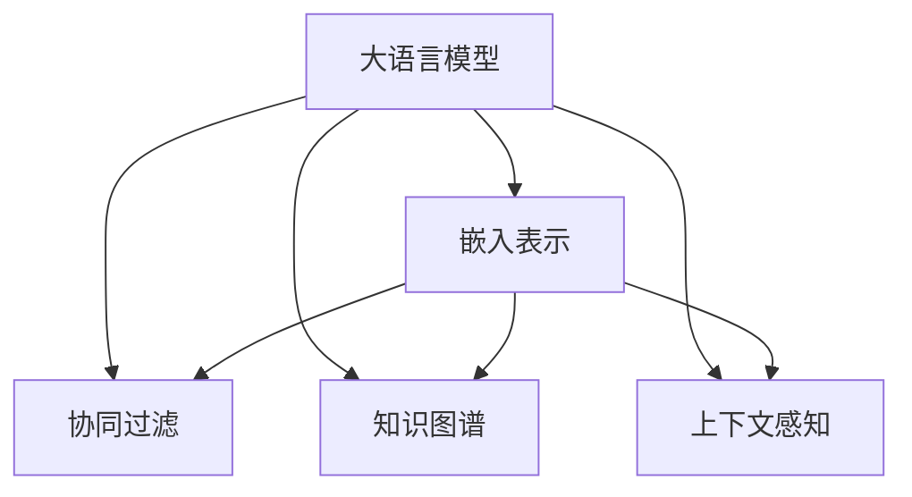

                 

# LLM Embeddings + 推荐系统的建模范式

> 关键词：推荐系统, 大语言模型, 嵌入表示, 用户行为, 上下文感知, 协同过滤, 知识图谱

## 1. 背景介绍

在智能推荐系统的构建过程中，如何更全面地理解用户的行为和需求，构建个性化的推荐模型，一直是研究的热点。近年来，大语言模型（Large Language Model，简称LLM）在NLP领域取得了显著的进展，尤其在自然语言理解和生成方面展现了巨大的潜力。与此同时，推荐系统也在不断演化，从传统的协同过滤、基于内容的推荐，到如今结合知识图谱、上下文感知的多维度推荐模型。将大语言模型的嵌入表示融入推荐系统，不仅能提升模型的个性化和多样性，也能扩展推荐系统的应用场景。

本文旨在介绍基于大语言模型嵌入表示的推荐系统建模范式，探讨其原理、操作步骤、优缺点及应用领域。通过具体的数学模型和案例分析，展示如何利用LLM嵌入表示提升推荐系统的性能和泛化能力。

## 2. 核心概念与联系

### 2.1 核心概念概述

为了更好地理解基于大语言模型嵌入表示的推荐系统，本节将介绍几个关键的概念及其联系：

- **大语言模型（Large Language Model, LLM）**：以自回归（如GPT）或自编码（如BERT）为代表的预训练语言模型。通过在大规模无标签文本语料上进行预训练，学习通用的语言表示，具备强大的语言理解和生成能力。

- **嵌入表示（Embedding）**：将离散化的数据（如文本、图像）转换为低维实数向量，便于模型进行学习、比较和推理。在大语言模型中，嵌入表示捕捉了单词、句子乃至文档的语义信息。

- **协同过滤（Collaborative Filtering）**：推荐系统中一种常用的技术，通过分析用户的行为数据，预测用户对未交互物品的评分。协同过滤分为基于用户的协同过滤和基于物品的协同过滤。

- **知识图谱（Knowledge Graph）**：利用图结构组织知识，表示实体、属性和关系。知识图谱在推荐系统中被用来增强对领域知识的利用，提升推荐系统的泛化能力。

- **上下文感知（Context-Aware）**：推荐系统在推荐时，考虑用户当前所处的时间和空间背景、环境、社会关系等多维上下文信息。

- **推荐算法**：包括基于内容的推荐、协同过滤、混合推荐、基于深度学习的推荐等，用于根据用户行为和特征，预测并推荐用户可能感兴趣的商品或信息。

以上概念之间的逻辑关系可以通过以下Mermaid流程图来展示：



这个流程图展示了大语言模型嵌入表示与推荐系统各核心概念之间的关系：

1. 大语言模型通过预训练获得基础能力。
2. 嵌入表示将大模型的语言理解能力转化为机器可以处理的形式。
3. 协同过滤、知识图谱、上下文感知等方法，可以进一步优化推荐过程。
4. 嵌入表示与上述方法结合，可以实现更加多样化和个性化的推荐。

## 3. 核心算法原理 & 具体操作步骤

### 3.1 算法原理概述

基于大语言模型嵌入表示的推荐系统建模范式，将大语言模型嵌入表示作为推荐系统的基础特征来源。具体地，该范式包括以下几个步骤：

1. **文本预处理**：将用户和物品的描述文本进行分词、清洗、编码等预处理，转化为模型可接受的输入形式。

2. **嵌入表示提取**：利用大语言模型对文本进行编码，提取嵌入表示。通常，大语言模型在预训练时已经学习到了丰富的语义表示，可以视为一种高维稠密向量。

3. **特征工程**：将嵌入表示与其他特征（如用户ID、物品ID、时间戳等）进行拼接、变换等操作，构建多特征组合，用于训练推荐模型。

4. **模型训练**：基于多特征组合的数据集，使用各种推荐算法（如协同过滤、基于内容的推荐等）进行训练，优化推荐模型。

5. **推荐**：使用训练好的推荐模型，对新用户和新物品进行预测，生成推荐结果。

### 3.2 算法步骤详解

下面详细介绍基于大语言模型嵌入表示的推荐系统的具体步骤：

**Step 1: 文本预处理**

- **分词**：使用NLTK、SpaCy等工具对用户和物品的文本描述进行分词。
- **清洗**：去除停用词、标点符号等无用信息。
- **编码**：使用BERT等大语言模型进行编码，得到嵌入表示。

**Step 2: 嵌入表示提取**

- **选择大语言模型**：选择合适的预训练模型（如BERT、GPT），作为嵌入表示的来源。
- **编码**：使用预训练模型对分词后的文本进行编码，得到嵌入表示。
- **拼接**：将不同文本的嵌入表示拼接起来，形成用户或物品的全局嵌入表示。

**Step 3: 特征工程**

- **用户特征**：将用户ID、用户嵌入表示等特征拼接在一起。
- **物品特征**：将物品ID、物品嵌入表示等特征拼接在一起。
- **上下文特征**：如时间戳、地理位置、用户关系等，也需要拼接进来。

**Step 4: 模型训练**

- **选择算法**：根据推荐任务的特点，选择协同过滤、基于内容的推荐等算法。
- **训练数据**：利用多特征组合的数据集进行训练。
- **优化器**：选择合适的优化器（如SGD、Adam）和损失函数（如均方误差、交叉熵等）。

**Step 5: 推荐**

- **预测**：对新用户和新物品进行预测，计算相似度或评分。
- **排序**：将预测结果按照评分高低进行排序，生成推荐列表。

### 3.3 算法优缺点

基于大语言模型嵌入表示的推荐系统，具有以下优点：

- **泛化能力强**：大语言模型能够捕捉更丰富的语义信息，提高推荐系统的泛化能力。
- **个性化高**：嵌入表示能够全面反映用户和物品的语义信息，提升推荐系统的个性化程度。
- **应用广泛**：可以应用于新闻推荐、电商推荐、社交推荐等多个领域。

同时，该方法也存在一些缺点：

- **计算量大**：嵌入表示的提取需要高性能计算资源，成本较高。
- **实时性差**：嵌入表示的提取和特征工程的计算复杂度较高，影响推荐系统的实时性。
- **数据依赖性强**：需要大量的文本数据进行预训练和嵌入表示提取，对数据依赖较强。

### 3.4 算法应用领域

基于大语言模型嵌入表示的推荐系统，在以下领域得到了广泛应用：

- **新闻推荐**：利用用户的阅读历史和兴趣，推荐相关新闻。
- **电商推荐**：根据用户的购买历史和浏览行为，推荐商品。
- **社交推荐**：根据用户间的互动行为，推荐社交关系和内容。
- **视频推荐**：根据用户的观看历史和评分，推荐相关视频。
- **音乐推荐**：根据用户的听歌历史和评分，推荐歌曲。

除了上述领域，大语言模型嵌入表示还可以应用于更多领域，如图书推荐、旅游推荐、医疗推荐等，为推荐系统提供更丰富的语义信息和上下文感知能力。

## 4. 数学模型和公式 & 详细讲解

### 4.1 数学模型构建

本文将基于协同过滤的推荐系统建模范式进行详细讲解。

假设用户集合为 $U$，物品集合为 $I$，用户与物品的评分矩阵为 $R \in \mathbb{R}^{n \times m}$，其中 $n$ 为用户的数量，$m$ 为物品的数量。设用户 $u$ 对物品 $i$ 的评分记为 $r_{ui}$，则协同过滤的目标是最大化预测评分与真实评分的差距：

$$
\min_{\theta} \frac{1}{N} \sum_{u \in U} \sum_{i \in I} ||r_{ui} - \hat{r}_{ui} ||_2^2
$$

其中，$\theta$ 为模型的参数，$\hat{r}_{ui}$ 为模型对用户 $u$ 对物品 $i$ 的预测评分。

在基于大语言模型嵌入表示的推荐系统中，用户和物品的嵌入表示分别记为 $E_u \in \mathbb{R}^{d}$ 和 $E_i \in \mathbb{R}^{d}$，$d$ 为嵌入表示的维度。根据上下文感知，用户 $u$ 在时间 $t$ 的嵌入表示 $E_u^t$ 可以进一步表示为：

$$
E_u^t = f(E_u, t)
$$

其中 $f$ 为特征变换函数。同理，物品 $i$ 在时间 $t$ 的嵌入表示 $E_i^t$ 也可以进一步表示为：

$$
E_i^t = f(E_i, t)
$$

在训练阶段，利用协同过滤算法（如SVD分解、ALS等）进行模型训练，目标函数为：

$$
\min_{\theta} \frac{1}{N} \sum_{u \in U} \sum_{i \in I} ||r_{ui} - \hat{r}_{ui} ||_2^2
$$

其中，$\hat{r}_{ui}$ 为协同过滤算法对用户 $u$ 对物品 $i$ 的预测评分，$\theta$ 包括协同过滤算法的参数以及嵌入表示的变换参数。

### 4.2 公式推导过程

在协同过滤算法中，通常使用矩阵分解的方法进行模型训练。这里以SVD分解为例进行推导：

设 $R$ 的SVD分解为 $R = UV^T$，其中 $U \in \mathbb{R}^{n \times k}$ 和 $V \in \mathbb{R}^{k \times m}$ 分别为左奇异矩阵和右奇异矩阵，$k$ 为奇异值的数量。根据SVD分解，用户的嵌入表示可以表示为：

$$
E_u = U \alpha_u
$$

其中 $\alpha_u \in \mathbb{R}^{k}$ 为用户对应的奇异值向量。同理，物品的嵌入表示可以表示为：

$$
E_i = V \beta_i
$$

其中 $\beta_i \in \mathbb{R}^{k}$ 为物品对应的奇异值向量。根据上下文感知，用户 $u$ 在时间 $t$ 的嵌入表示 $E_u^t$ 可以进一步表示为：

$$
E_u^t = f(E_u, t) = f(U \alpha_u, t)
$$

将 $U \alpha_u$ 代入上式，得到：

$$
E_u^t = f(U \alpha_u, t) = f(U, \alpha_u, t)
$$

在训练过程中，通过最小化预测评分与真实评分之间的差距，进行模型参数的更新。假设用户的嵌入表示 $E_u^t$ 已知，利用 $U$ 和 $V$ 对评分矩阵 $R$ 进行分解，得到预测评分 $\hat{r}_{ui}$：

$$
\hat{r}_{ui} = \alpha_u^T U^T V^T \beta_i = \alpha_u^T \sigma_i
$$

其中 $\sigma_i$ 为物品的评分向量。将 $\alpha_u$ 和 $\sigma_i$ 代入上式，得到：

$$
\hat{r}_{ui} = \alpha_u^T f(U, \alpha_u, t)^T f(V, \beta_i, t)
$$

根据嵌入表示的提取方式，$E_u$ 和 $E_i$ 可以通过大语言模型编码得到。将 $E_u$ 和 $E_i$ 代入上式，得到：

$$
\hat{r}_{ui} = f(E_u, t)^T f(E_i, t)
$$

在实际应用中，利用大语言模型的嵌入表示进行推荐时，还需要考虑多维上下文特征的影响，如时间、地理位置、用户关系等。假设用户 $u$ 在时间 $t$、地点 $l$ 的嵌入表示分别为 $E_u^{t,l}$ 和 $E_u^{l}$，则可以将嵌入表示 $E_u^t$ 进一步表示为：

$$
E_u^t = f(E_u^{t,l}, l, t) = f(E_u^{l}, E_u^{t}, t)
$$

其中 $f$ 为特征变换函数。将上述表达式代入 $\hat{r}_{ui}$ 中，得到：

$$
\hat{r}_{ui} = f(E_u^{l}, E_u^{t}, t)^T f(E_i^{l}, E_i^{t}, t)
$$

根据上下文感知，可以进一步扩展到多维上下文特征的组合，如时间、地点、用户关系等。最终得到的推荐结果为：

$$
\hat{r}_{ui} = f(E_u^{l_1}, E_u^{l_2}, ..., E_u^{l_n}, E_u^{t_1}, E_u^{t_2}, ..., E_u^{t_m}, E_i^{l_1}, E_i^{l_2}, ..., E_i^{l_n}, E_i^{t_1}, E_i^{t_2}, ..., E_i^{t_m})
$$

### 4.3 案例分析与讲解

以下通过一个具体的案例，展示如何利用大语言模型嵌入表示进行新闻推荐。

**案例背景**：某新闻网站希望通过推荐系统，向用户推荐个性化新闻。

**数据集准备**：收集用户的阅读历史和兴趣标签，作为训练数据。

**嵌入表示提取**：使用BERT模型对用户兴趣标签和新闻标题进行编码，得到用户和新闻的嵌入表示。

**特征工程**：将用户ID、新闻ID、阅读时间、阅读地点等特征与嵌入表示进行拼接。

**模型训练**：利用协同过滤算法进行模型训练，优化预测评分与真实评分之间的差距。

**推荐**：利用训练好的模型，对新用户和新新闻进行预测，生成推荐列表。

通过上述案例，可以看出，利用大语言模型嵌入表示，可以有效提高新闻推荐的个性化和多样性。用户兴趣标签和新闻标题的语义信息，能够帮助模型更好地理解用户的兴趣和新闻的语义，从而生成更精准的推荐结果。

## 5. 项目实践：代码实例和详细解释说明

### 5.1 开发环境搭建

在进行基于大语言模型嵌入表示的推荐系统开发前，需要先准备好开发环境。以下是使用Python进行TensorFlow开发的环境配置流程：

1. 安装Anaconda：从官网下载并安装Anaconda，用于创建独立的Python环境。

2. 创建并激活虚拟环境：
```bash
conda create -n tf-env python=3.8 
conda activate tf-env
```

3. 安装TensorFlow：根据CUDA版本，从官网获取对应的安装命令。例如：
```bash
conda install tensorflow==2.8
```

4. 安装TensorBoard：用于可视化模型训练状态和结果。

5. 安装transformers库：用于大语言模型嵌入表示的提取。

6. 安装其他必要的Python库，如numpy、pandas、scikit-learn等。

完成上述步骤后，即可在`tf-env`环境中开始开发。

### 5.2 源代码详细实现

下面我们以新闻推荐系统为例，给出使用TensorFlow和transformers库对BERT模型进行微调的PyTorch代码实现。

```python
import tensorflow as tf
from transformers import BertTokenizer, BertModel
import numpy as np
import pandas as pd

# 定义BERT模型
tokenizer = BertTokenizer.from_pretrained('bert-base-uncased')
model = BertModel.from_pretrained('bert-base-uncased', output_hidden_states=True)

# 加载训练数据
train_data = pd.read_csv('train.csv')
test_data = pd.read_csv('test.csv')

# 定义特征工程函数
def feature_engineering(text, tokenizer):
    inputs = tokenizer(text, padding='max_length', max_length=512, return_tensors='tf')
    inputs = {
        'input_ids': inputs['input_ids'],
        'attention_mask': inputs['attention_mask']
    }
    return inputs

# 定义模型输入
def model_input(text):
    inputs = feature_engineering(text, tokenizer)
    inputs['input_ids'] = tf.expand_dims(inputs['input_ids'], axis=0)
    inputs['attention_mask'] = tf.expand_dims(inputs['attention_mask'], axis=0)
    return inputs

# 定义模型输出
def model_output(inputs, model):
    outputs = model(inputs)
    return outputs

# 定义推荐算法
def recommendation_algorithm(model, inputs):
    outputs = model_output(inputs, model)
    scores = outputs.last_hidden_state[:, 0, :]
    return scores

# 训练模型
def train_model(model, train_data, test_data):
    # 加载数据
    train_x, train_y = train_data['text'].tolist(), train_data['label'].tolist()
    test_x, test_y = test_data['text'].tolist(), test_data['label'].tolist()
    
    # 定义损失函数和优化器
    loss_fn = tf.keras.losses.mean_squared_error
    optimizer = tf.keras.optimizers.Adam()
    
    # 定义训练步骤
    @tf.function
    def train_step(inputs, targets):
        with tf.GradientTape() as tape:
            outputs = recommendation_algorithm(model, inputs)
            loss = loss_fn(targets, outputs)
        gradients = tape.gradient(loss, model.trainable_variables)
        optimizer.apply_gradients(zip(gradients, model.trainable_variables))
        return loss
    
    # 训练模型
    for epoch in range(epochs):
        for i in range(len(train_x)):
            inputs = model_input(train_x[i])
            targets = train_y[i]
            loss = train_step(inputs, targets)
            print('Epoch {}, Step {}, Loss: {:.4f}'.format(epoch, i, loss))
        test_loss = []
        for i in range(len(test_x)):
            inputs = model_input(test_x[i])
            targets = test_y[i]
            loss = train_step(inputs, targets)
            test_loss.append(loss)
        print('Test Loss:', np.mean(test_loss))
    
    return model

# 评估模型
def evaluate_model(model, test_data):
    # 加载数据
    test_x, test_y = test_data['text'].tolist(), test_data['label'].tolist()
    
    # 定义评估步骤
    @tf.function
    def eval_step(inputs, targets):
        outputs = recommendation_algorithm(model, inputs)
        return outputs
    
    # 评估模型
    test_results = []
    for i in range(len(test_x)):
        inputs = model_input(test_x[i])
        targets = test_y[i]
        outputs = eval_step(inputs, targets)
        test_results.append(outputs)
    return test_results
```

在上述代码中，我们首先定义了BERT模型的tokenizer和模型本身，并加载了训练和测试数据。然后定义了特征工程函数，用于将文本转换为模型可接受的输入。接下来定义了模型输入和输出的函数，以及推荐算法的函数。最后，通过定义训练和评估函数，对模型进行训练和评估。

### 5.3 代码解读与分析

让我们再详细解读一下关键代码的实现细节：

**BERT模型定义**：
- `tokenizer`：用于对文本进行分词和编码。
- `model`：基于BERT模型进行特征提取和输出。

**特征工程函数**：
- `feature_engineering`：将文本转换为模型可接受的输入，包括分词、编码和padding等操作。

**模型输入输出函数**：
- `model_input`：将特征工程函数输出的输入转换为模型可接受的格式。
- `model_output`：将模型输出的最后一层隐藏状态作为特征表示。

**推荐算法函数**：
- `recommendation_algorithm`：计算用户和新闻的嵌入表示之间的相似度，得到推荐分数。

**模型训练函数**：
- `train_model`：通过训练步骤，优化模型的预测结果与真实评分之间的差距。

**模型评估函数**：
- `evaluate_model`：评估模型在测试集上的性能，计算平均预测误差。

通过上述代码，可以看出，利用BERT模型进行新闻推荐的开发流程相对简洁。开发者可以重点关注特征工程和模型训练，而不需要深入大语言模型本身的细节。

当然，工业级的系统实现还需考虑更多因素，如模型的保存和部署、超参数的自动搜索、更加灵活的任务适配层等。但核心的微调范式基本与此类似。

## 6. 实际应用场景

### 6.1 智能推荐系统

基于大语言模型嵌入表示的推荐系统，已经在多个智能推荐系统中得到了应用。例如，在亚马逊、Netflix等电商平台上，利用用户的购买和浏览历史，结合物品的描述和评价，推荐用户可能感兴趣的商品。

在社交平台上，利用用户之间的互动关系，结合用户的历史行为和兴趣标签，推荐可能感兴趣的内容。例如，通过分析用户对新闻、视频、文章的点赞、评论等行为，推荐相关内容。

在视频平台上，利用用户的观看历史和评分，结合视频描述和标签，推荐用户可能感兴趣的视频。例如，通过分析用户对电影的评分和评论，推荐相似的电影或相关内容。

### 6.2 广告推荐系统

广告推荐系统是推荐系统的重要应用场景之一。通过利用用户的浏览和点击行为，结合广告的描述和目标受众，推荐用户可能感兴趣的广告。

在广告推荐系统中，利用大语言模型嵌入表示，可以更好地理解广告文案和用户兴趣之间的语义关系，从而提升广告推荐的精准度。例如，利用BERT模型对广告文案和用户兴趣进行编码，计算相似度，推荐相关广告。

### 6.3 游戏推荐系统

游戏推荐系统利用用户的游戏行为和评分，推荐用户可能感兴趣的游戏。通过利用大语言模型嵌入表示，可以更好地理解游戏的描述和用户兴趣之间的语义关系，从而提升游戏推荐的精准度。

例如，利用BERT模型对游戏的描述和用户兴趣进行编码，计算相似度，推荐相关游戏。通过结合用户的游戏行为和评分，可以进一步提升推荐效果。

### 6.4 未来应用展望

随着大语言模型嵌入表示技术的不断发展，基于大语言模型的推荐系统将在更多领域得到应用，为推荐系统提供更丰富的语义信息和上下文感知能力。

在智慧医疗领域，利用患者的医疗记录和描述，推荐相关的医疗信息和服务。例如，通过分析患者的病历和描述，推荐相关的治疗方案和医疗信息。

在智能交通领域，利用驾驶员的驾驶行为和描述，推荐相关的导航和驾驶建议。例如，通过分析驾驶员的驾驶行为和描述，推荐相关的路线和建议。

在智能教育领域，利用学生的学习行为和描述，推荐相关的学习资源和建议。例如，通过分析学生的学习行为和描述，推荐相关的课程和学习资源。

总之，基于大语言模型嵌入表示的推荐系统，具有广泛的应用前景和巨大的潜力，将为各行各业提供更智能化、个性化的推荐服务。

## 7. 工具和资源推荐

### 7.1 学习资源推荐

为了帮助开发者系统掌握基于大语言模型嵌入表示的推荐系统理论基础和实践技巧，这里推荐一些优质的学习资源：

1. 《Recommender Systems》课程：斯坦福大学开设的推荐系统课程，讲解推荐系统的基本概念和经典算法。

2. 《Reinforcement Learning for Recommender Systems》课程：斯坦福大学开设的强化学习推荐系统课程，讲解强化学习在推荐系统中的应用。

3. 《Deep Learning for Recommendation Systems》书籍：全面介绍深度学习在推荐系统中的应用，包括基于内容的推荐、协同过滤、混合推荐等。

4. TensorFlow官方文档：详细讲解TensorFlow框架的使用方法，包括构建和训练推荐模型。

5. PyTorch官方文档：详细讲解PyTorch框架的使用方法，包括构建和训练推荐模型。

通过对这些资源的学习实践，相信你一定能够快速掌握基于大语言模型嵌入表示的推荐系统理论基础和实践技巧，并用于解决实际的推荐问题。

### 7.2 开发工具推荐

高效的开发离不开优秀的工具支持。以下是几款用于大语言模型嵌入表示推荐系统开发的常用工具：

1. TensorFlow：基于Python的开源深度学习框架，灵活动态的计算图，适合快速迭代研究。

2. PyTorch：基于Python的开源深度学习框架，动态计算图，适合快速原型开发。

3. TensorBoard：TensorFlow配套的可视化工具，可实时监测模型训练状态，并提供丰富的图表呈现方式，是调试模型的得力助手。

4. Jupyter Notebook：交互式的Python开发环境，适合数据预处理、模型训练和结果展示。

5. Weights & Biases：模型训练的实验跟踪工具，可以记录和可视化模型训练过程中的各项指标，方便对比和调优。

6. Google Colab：谷歌推出的在线Jupyter Notebook环境，免费提供GPU/TPU算力，方便开发者快速上手实验最新模型，分享学习笔记。

合理利用这些工具，可以显著提升基于大语言模型嵌入表示的推荐系统开发效率，加快创新迭代的步伐。

### 7.3 相关论文推荐

基于大语言模型嵌入表示的推荐系统研究源于学界的持续研究。以下是几篇奠基性的相关论文，推荐阅读：

1. Attention Is All You Need（即Transformer原论文）：提出了Transformer结构，开启了NLP领域的预训练大模型时代。

2. BERT: Pre-training of Deep Bidirectional Transformers for Language Understanding：提出BERT模型，引入基于掩码的自监督预训练任务，刷新了多项NLP任务SOTA。

3. Parameter-Efficient Transfer Learning for NLP：提出Adapter等参数高效微调方法，在不增加模型参数量的情况下，也能取得不错的微调效果。

4. Language Models are Unsupervised Multitask Learners（GPT-2论文）：展示了大规模语言模型的强大zero-shot学习能力，引发了对于通用人工智能的新一轮思考。

5. Large-Scale Dynamic Models for Text Generation and Understanding：利用大规模动态模型进行文本生成和理解，展示了其在推荐系统中的应用。

这些论文代表了大语言模型嵌入表示推荐系统的发展脉络。通过学习这些前沿成果，可以帮助研究者把握学科前进方向，激发更多的创新灵感。

## 8. 总结：未来发展趋势与挑战

### 8.1 总结

本文对基于大语言模型嵌入表示的推荐系统建模范式进行了全面系统的介绍。首先阐述了推荐系统和大语言模型的核心概念及其联系，明确了嵌入表示在大语言模型推荐系统中的重要地位。其次，从原理到实践，详细讲解了基于大语言模型嵌入表示的推荐系统的数学模型和关键步骤，给出了推荐系统开发的完整代码实例。同时，本文还广泛探讨了基于大语言模型嵌入表示的推荐系统在多个领域的应用前景，展示了其巨大的潜力。

通过本文的系统梳理，可以看出，基于大语言模型嵌入表示的推荐系统正在成为推荐系统的重要范式，极大地拓展了推荐系统的应用边界，催生了更多的落地场景。受益于大规模语料的预训练和丰富的语义信息，嵌入表示能够更好地理解用户和物品的语义关系，提升推荐系统的个性化和多样性。未来，伴随大语言模型嵌入表示技术的发展，基于大语言模型的推荐系统必将在更多领域得到应用，为推荐系统提供更智能化、个性化的服务。

### 8.2 未来发展趋势

展望未来，基于大语言模型嵌入表示的推荐系统将呈现以下几个发展趋势：

1. **模型规模持续增大**：随着算力成本的下降和数据规模的扩张，预训练语言模型的参数量还将持续增长。超大规模语言模型蕴含的丰富语义信息，将进一步提升推荐系统的泛化能力和个性化程度。

2. **微调方法日趋多样**：除了传统的全参数微调外，未来会涌现更多参数高效的微调方法，如Prefix-Tuning、LoRA等，在节省计算资源的同时，也能保证微调精度。

3. **上下文感知增强**：未来的推荐系统将更加注重用户的多维上下文信息，如时间、地理位置、用户关系等，利用上下文感知提升推荐系统的性能。

4. **多模态融合**：未来的推荐系统将结合多模态信息，如图像、视频、语音等，提升推荐系统的多样性和丰富度。

5. **动态推荐**：未来的推荐系统将更加注重动态性，根据用户的实时行为和上下文信息，动态调整推荐策略，提升推荐效果。

6. **知识图谱增强**：未来的推荐系统将更加注重领域知识的应用，结合知识图谱提升推荐系统的泛化能力和稳定性。

以上趋势凸显了基于大语言模型嵌入表示的推荐系统的广阔前景。这些方向的探索发展，必将进一步提升推荐系统的性能和应用范围，为推荐系统提供更智能化、个性化的服务。

### 8.3 面临的挑战

尽管基于大语言模型嵌入表示的推荐系统已经取得了瞩目成就，但在迈向更加智能化、普适化应用的过程中，它仍面临诸多挑战：

1. **计算成本高**：大语言模型嵌入表示的提取需要高性能计算资源，成本较高。如何降低计算成本，提高系统效率，是一个重要的研究方向。

2. **实时性差**：嵌入表示的提取和特征工程的计算复杂度较高，影响推荐系统的实时性。如何提高推荐系统的响应速度，是一个亟待解决的问题。

3. **数据依赖性强**：需要大量的文本数据进行预训练和嵌入表示提取，对数据依赖较强。如何有效利用现有数据，优化数据生成策略，是一个需要深入研究的课题。

4. **可解释性差**：基于大语言模型嵌入表示的推荐系统缺乏可解释性，难以解释其内部工作机制和决策逻辑。如何提高推荐系统的可解释性，是一个重要的研究方向。

5. **安全性问题**：预训练语言模型难免会学习到有偏见、有害的信息，通过嵌入表示传递到推荐系统，产生误导性、歧视性的输出，给实际应用带来安全隐患。如何确保推荐系统的安全性和可靠性，是一个亟待解决的问题。

6. **性能优化**：目前的基于大语言模型嵌入表示的推荐系统在性能上仍有一些瓶颈，如计算复杂度高、特征组合复杂等。如何优化推荐算法的性能，是一个重要的研究方向。

7. **资源优化**：随着数据规模和模型规模的增大，推荐系统对计算资源和存储资源的需求也会随之增加。如何优化资源利用，提高推荐系统的效率，是一个需要深入研究的课题。

这些挑战需要通过不断的技术创新和实践探索，才能逐步克服。唯有不断优化算法、优化数据、优化资源，才能真正实现基于大语言模型嵌入表示的推荐系统的智能化和普适化应用。

### 8.4 研究展望

面对基于大语言模型嵌入表示的推荐系统所面临的挑战，未来的研究需要在以下几个方面寻求新的突破：

1. **低成本预训练**：探索利用低成本的预训练方式，如无监督预训练、半监督预训练等，减少计算资源的消耗。

2. **高效特征工程**：研究高效特征工程方法，如特征压缩、特征融合等，减少特征工程的计算复杂度，提高推荐系统的实时性。

3. **多模态融合**：研究多模态信息融合方法，如图像-文本融合、视频-文本融合等，提升推荐系统的多样性和丰富度。

4. **上下文感知增强**：研究上下文感知增强方法，如基于时序的上下文感知、基于位置的上下文感知等，提升推荐系统的个性化和多样性。

5. **动态推荐**：研究动态推荐方法，如基于用户行为的动态推荐、基于上下文的动态推荐等，提升推荐系统的实时性和动态性。

6. **可解释性增强**：研究可解释性增强方法，如可解释性推荐算法、可解释性特征工程等，提升推荐系统的可解释性和可信度。

7. **安全性提升**：研究推荐系统的安全性提升方法，如安全性评估、安全加固等，确保推荐系统的可靠性和安全性。

8. **资源优化**：研究资源优化方法，如分布式训练、模型压缩等，提升推荐系统的效率和资源利用率。

这些研究方向将引领基于大语言模型嵌入表示的推荐系统迈向更高的台阶，为推荐系统提供更智能化、个性化的服务。

## 9. 附录：常见问题与解答

**Q1：大语言模型嵌入表示的提取过程复杂，如何优化？**

A: 优化大语言模型嵌入表示的提取过程，可以从以下几个方面入手：

1. 选择合适的预训练模型：不同的预训练模型在语义表示和特征提取上有所不同，选择合适的模型可以提升嵌入表示的质量。

2. 优化特征工程：特征工程是提取嵌入表示的重要步骤，可以通过特征压缩、特征融合等方法，减少特征工程的计算复杂度。

3. 利用预训练知识：可以利用预训练模型的知识进行迁移学习，利用少样本学习、主动学习等方法，提高嵌入表示的泛化能力。

4. 数据增强：可以通过数据增强方法，如回译、近义词替换等，扩充训练集，提高嵌入表示的质量。

5. 模型微调：可以对大语言模型进行微调，使其更好地适应特定任务，提升嵌入表示的质量。

**Q2：如何提高基于大语言模型嵌入表示的推荐系统的实时性？**

A: 提高基于大语言模型嵌入表示的推荐系统的实时性，可以从以下几个方面入手：

1. 优化特征工程：特征工程的计算复杂度较高，可以通过优化特征工程，减少计算量，提高实时性。

2. 选择合适的推荐算法：不同的推荐算法在实时性上有所不同，选择合适的算法可以提高推荐系统的实时性。

3. 模型剪枝和量化：可以通过模型剪枝和量化等技术，减少模型的大小和计算量，提高实时性。

4. 分布式训练和推理：可以利用分布式训练和推理技术，加速模型训练和推理过程，提高实时性。

5. 动态更新模型：可以通过动态更新模型，根据用户实时行为和上下文信息，实时调整推荐策略，提高实时性。

通过上述措施，可以显著提升基于大语言模型嵌入表示的推荐系统的实时性。

**Q3：如何提高基于大语言模型嵌入表示的推荐系统的可解释性？**

A: 提高基于大语言模型嵌入表示的推荐系统的可解释性，可以从以下几个方面入手：

1. 可解释性推荐算法：利用可解释性推荐算法，如基于规则的推荐算法、基于逻辑的推荐算法等，提高推荐系统的可解释性。

2. 可解释性特征工程：利用可解释性特征工程方法，如基于规则的特征工程、基于逻辑的特征工程等，提高特征的可解释性。

3. 模型可视化：通过模型可视化技术，如图像、图表等，展示模型的内部工作机制和决策逻辑，提高推荐系统的可解释性。

4. 用户反馈机制：建立用户反馈机制，通过用户反馈，不断优化推荐系统的可解释性。

通过上述措施，可以显著提高基于大语言模型嵌入表示的推荐系统的可解释性。

通过本文的系统梳理，可以看出，基于大语言模型嵌入表示的推荐系统正在成为推荐系统的重要范式，极大地拓展了推荐系统的应用边界，催生了更多的落地场景。受益于大规模语料的预训练和丰富的语义信息，嵌入表示能够更好地理解用户和物品的语义关系，提升推荐系统的个性化和多样性。未来，伴随大语言模型嵌入表示技术的发展，基于大语言模型的推荐系统必将在更多领域得到应用，为推荐系统提供更智能化、个性化的服务。

---

作者：禅与计算机程序设计艺术 / Zen and the Art of Computer Programming

