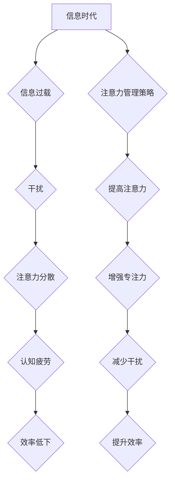

                 

## 信息时代的注意量管理挑战与策略：在干扰和信息过载中航行

> 关键词：注意力管理、信息过载、干扰、认知科学、专注力、深度工作、数字素养、时间管理、效率提升

### 1. 背景介绍

在当今信息爆炸的时代，我们被来自各个方向的信息和干扰所包围。智能手机、社交媒体、电子邮件、新闻推送等，无时无刻不在争夺我们的注意力。这种信息过载和干扰，对我们的工作效率、学习能力、心理健康甚至人际关系都产生了深远的影响。

**1.1 信息时代的特点**

信息时代的特点是信息量巨大、更新速度快、传播范围广。互联网的普及和移动互联网的兴起，使得信息获取变得更加便捷，但也带来了信息过载的挑战。

**1.2 注意力资源的有限性**

人类的注意力资源是有限的，我们无法同时处理大量的信息。当我们被过多信息和干扰所包围时，注意力就会被分散，难以集中精力完成重要任务。

**1.3 注意力管理的重要性**

在信息时代，有效地管理注意力变得尤为重要。良好的注意力管理能力可以帮助我们：

* 提高工作效率和学习效率
* 减少压力和焦虑
* 提升决策能力和创造力
* 建立更健康的人际关系

### 2. 核心概念与联系

**2.1 注意力、专注力和认知能力**

* **注意力:**  是指对特定信息或刺激的定向选择性关注。
* **专注力:**  是指持续地集中注意力在某一特定任务或目标上，并排除干扰的能力。
* **认知能力:**  是指人类大脑处理信息、理解、记忆、推理和解决问题的能力。

注意力、专注力和认知能力之间存在着密切的联系。良好的注意力是专注力的基础，而专注力则可以提升认知能力。

**2.2 干扰和信息过载**

* **干扰:**  是指任何阻碍我们集中注意力和完成任务的因素。
* **信息过载:**  是指我们接收的信息量超过了处理能力，导致注意力分散、认知疲劳。

干扰和信息过载是注意力管理的主要挑战。

**2.3 注意力管理策略**

注意力管理策略是指各种方法和技巧，旨在帮助我们提高注意力、增强专注力、减少干扰和信息过载。

**2.4 Mermaid 流程图**



### 3. 核心算法原理 & 具体操作步骤

**3.1 算法原理概述**

注意力管理算法通常基于认知科学和心理学原理，旨在通过分析用户行为、识别干扰源和提供个性化建议，帮助用户提高注意力和专注力。

**3.2 算法步骤详解**

1. **数据收集:** 收集用户使用设备和应用程序的行为数据，例如浏览记录、使用时间、点击次数等。
2. **干扰识别:** 利用机器学习算法识别干扰源，例如社交媒体通知、电子邮件提醒、网站广告等。
3. **注意力分析:** 分析用户注意力分布，识别用户集中注意力和分散注意力的时间段。
4. **个性化建议:** 根据用户行为和注意力分析结果，提供个性化建议，例如提醒用户休息、屏蔽干扰源、调整工作环境等。
5. **反馈机制:** 收集用户反馈，不断优化算法和建议。

**3.3 算法优缺点**

* **优点:**

    * 可以根据用户行为提供个性化建议。
    * 可以识别和屏蔽干扰源，帮助用户集中注意力。
    * 可以帮助用户了解自己的注意力模式，并制定相应的策略。

* **缺点:**

    * 需要大量的数据进行训练和测试。
    * 算法的准确性可能受到用户行为和环境因素的影响。
    * 可能存在隐私问题。

**3.4 算法应用领域**

* **个人注意力管理:** 手机应用程序、桌面软件、浏览器插件等。
* **教育领域:** 在线学习平台、课堂管理系统等。
* **企业办公:** 工作协作平台、项目管理工具等。

### 4. 数学模型和公式 & 详细讲解 & 举例说明

**4.1 数学模型构建**

注意力可以被建模为一个动态系统，其状态取决于多个因素，例如用户当前的任务、环境干扰、个人疲劳水平等。

**4.2 公式推导过程**

一个简单的注意力模型可以表示为以下微分方程：

$$
\frac{dA}{dt} = f(T, I, P)
$$

其中：

* $A$ 表示注意力水平
* $t$ 表示时间
* $T$ 表示任务难度
* $I$ 表示环境干扰
* $P$ 表示个人疲劳水平
* $f$ 是一个非线性函数，描述注意力水平随时间变化的规律

**4.3 案例分析与讲解**

假设一个用户正在阅读一篇文章，任务难度为中等，环境干扰为低，个人疲劳水平为中等。根据上述模型，我们可以推断出用户注意力水平会逐渐下降，但下降速度较慢。

如果环境干扰突然增加，例如手机铃声响起，那么注意力水平会急剧下降。

### 5. 项目实践：代码实例和详细解释说明

**5.1 开发环境搭建**

* 操作系统: Ubuntu 20.04
* 编程语言: Python 3.8
* 开发工具: Jupyter Notebook

**5.2 源代码详细实现**

```python
import time

def simulate_attention(task_difficulty, environment_interference, personal_fatigue):
    """
    模拟注意力水平变化
    """
    attention_level = 100
    while True:
        attention_level -= task_difficulty * 0.1
        attention_level -= environment_interference * 0.05
        attention_level -= personal_fatigue * 0.02
        if attention_level <= 0:
            print("注意力已耗尽")
            break
        print(f"当前注意力水平: {attention_level}")
        time.sleep(1)

# 示例用法
simulate_attention(task_difficulty=5, environment_interference=2, personal_fatigue=3)
```

**5.3 代码解读与分析**

该代码模拟了注意力水平随时间变化的规律。

* `simulate_attention()` 函数模拟了注意力水平的变化过程。
* `task_difficulty`, `environment_interference`, `personal_fatigue` 参数分别表示任务难度、环境干扰和个人疲劳水平。
* `attention_level` 变量表示当前注意力水平。
* `while True` 循环模拟了注意力水平随时间变化的动态过程。
* `time.sleep(1)` 函数模拟了时间流逝。

**5.4 运行结果展示**

运行该代码后，会输出当前注意力水平的变化趋势，直到注意力水平耗尽。

### 6. 实际应用场景

**6.1 个人注意力管理**

* 使用专注力训练应用程序，例如 Forest、Freedom 等，帮助用户集中注意力，减少干扰。
* 设置工作时间和休息时间，例如使用番茄工作法，提高工作效率。
* 创建一个安静的工作环境，减少外界干扰。

**6.2 教育领域**

* 利用注意力管理技术，开发个性化的学习方案，帮助学生提高学习效率。
* 设计互动式教学内容，保持学生的注意力和兴趣。
* 利用注意力监测技术，及时发现学生注意力不集中，并提供相应的帮助。

**6.3 企业办公**

* 利用注意力管理工具，帮助员工集中注意力，提高工作效率。
* 设计高效的会议流程，减少会议时间和干扰。
* 利用注意力监测技术，了解员工的工作状态，并提供相应的支持。

**6.4 未来应用展望**

* 随着人工智能技术的进步，注意力管理算法将更加智能化和个性化。
* 注意力管理技术将应用于更多领域，例如医疗、金融、交通等。
* 注意力管理将成为未来社会中不可或缺的技能之一。

### 7. 工具和资源推荐

**7.1 学习资源推荐**

* 书籍：《深度工作》、《注意力经济》、《信息焦虑》
* 网页资源: 
    *  https://www.mindtools.com/pages/article/newHTE_90.htm
    * https://www.psychologytoday.com/us/blog/the-mysteries-love/201309/how-improve-your-attention-span

**7.2 开发工具推荐**

* Python:  https://www.python.org/
* Jupyter Notebook: https://jupyter.org/

**7.3 相关论文推荐**

*  "Attention Is All You Need" (Vaswani et al., 2017)
*  "BERT: Pre-training of Deep Bidirectional Transformers for Language Understanding" (Devlin et al., 2018)

### 8. 总结：未来发展趋势与挑战

**8.1 研究成果总结**

近年来，注意力管理领域取得了显著进展，特别是人工智能技术的应用，为注意力管理提供了新的思路和方法。

**8.2 未来发展趋势**

* **更智能化的注意力管理算法:** 利用深度学习等先进算法，开发更精准、更个性化的注意力管理系统。
* **注意力管理技术的广泛应用:** 注意力管理技术将应用于更多领域，例如医疗、教育、金融等。
* **注意力管理的社会影响:** 注意力管理技术的发展将对社会产生深远影响，需要我们认真思考其伦理和社会问题。

**8.3 面临的挑战**

* **数据隐私问题:** 注意力管理算法需要收集大量用户数据，如何保护用户隐私是一个重要的挑战。
* **算法的准确性和可靠性:** 注意力管理算法的准确性和可靠性还需要进一步提高。
* **用户接受度:** 一些用户可能对注意力管理技术持怀疑态度，需要进行有效的宣传和教育。

**8.4 研究展望**

未来，注意力管理研究将继续深入，探索注意力机制的本质，开发更有效的注意力管理策略，并关注注意力管理技术的社会影响，为构建更加高效、健康的人类社会贡献力量。

### 9. 附录：常见问题与解答

**9.1 如何提高注意力？**

* 设定明确的目标
* 创建一个安静的工作环境
* 避免多任务处理
* 定期休息
* 进行体育锻炼
* 保证充足的睡眠

**9.2 注意力管理工具有哪些？**

* Forest
* Freedom
* RescueTime
* Noisli

**9.3 注意力管理技术有哪些？**

* 认知行为疗法
* Mindfulness 冥想
* 渐进式肌肉放松法
* 番茄工作法


作者：禅与计算机程序设计艺术 / Zen and the Art of Computer Programming 
<end_of_turn>

