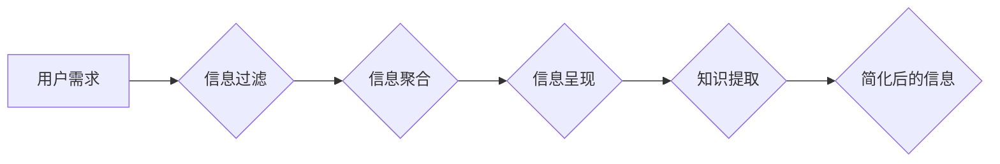

                 

## 信息简化的好处与实践：在复杂世界中简化以改善生活和决策

> 关键词：信息简化、复杂系统、决策支持、认知负荷、数据可视化、算法优化、人工智能、知识图谱、信息架构

### 1. 背景介绍

我们生活在一个信息爆炸的时代。每天，我们被来自各个方向的海量信息淹没：新闻、社交媒体、电子邮件、广告等等。这种信息过载不仅让我们感到疲惫和焦虑，还会阻碍我们有效地处理信息，做出明智的决策。

信息简化，即从复杂的信息中提取关键信息，并以简洁易懂的方式呈现，成为解决信息过载问题的关键。它不仅可以帮助我们更好地理解世界，还能提高我们的工作效率和生活质量。

### 2. 核心概念与联系

信息简化是一个多学科交叉的领域，涉及计算机科学、认知科学、心理学、信息设计等多个领域。其核心概念包括：

* **信息过滤:** 从海量信息中筛选出与用户需求相关的关键信息。
* **信息聚合:** 将相关信息进行整合，形成更简洁的概览。
* **信息呈现:** 以易于理解的方式呈现信息，例如图表、图形、摘要等。
* **知识提取:** 从文本和数据中提取关键知识，构建知识图谱。

**Mermaid 流程图**



### 3. 核心算法原理 & 具体操作步骤

#### 3.1  算法原理概述

信息简化算法通常基于以下原理：

* **文本挖掘:** 使用自然语言处理技术分析文本，提取关键词、主题、情感等信息。
* **机器学习:** 利用机器学习算法，从历史数据中学习信息简化规则，并自动生成简化后的信息。
* **数据可视化:** 将数据以图表、图形等形式呈现，帮助用户快速理解信息趋势和关键点。

#### 3.2  算法步骤详解

1. **数据收集:** 收集相关信息，例如文本、数据、图像等。
2. **数据预处理:** 对数据进行清洗、格式化、转换等操作，使其适合算法处理。
3. **特征提取:** 使用文本挖掘、机器学习等技术，从数据中提取关键特征，例如关键词、主题、情感等。
4. **信息聚合:** 将相关特征进行聚合，形成更简洁的概览。
5. **信息呈现:** 将聚合后的信息以图表、图形、摘要等形式呈现。
6. **用户反馈:** 收集用户反馈，不断优化算法和信息呈现方式。

#### 3.3  算法优缺点

**优点:**

* 自动化信息简化过程，提高效率。
* 能够处理海量信息，提取关键信息。
* 可以根据用户需求定制信息简化方式。

**缺点:**

* 算法需要大量训练数据，训练成本较高。
* 算法可能无法完全理解复杂信息，存在误判风险。
* 信息简化可能会丢失一些重要信息。

#### 3.4  算法应用领域

信息简化算法广泛应用于以下领域：

* **新闻资讯:** 自动生成新闻摘要、推荐相关新闻。
* **社交媒体:** 过滤垃圾信息、推荐感兴趣的内容。
* **电子商务:** 推荐商品、个性化购物体验。
* **医疗保健:** 分析病历、辅助医生诊断。
* **金融服务:** 分析市场数据、识别投资机会。

### 4. 数学模型和公式 & 详细讲解 & 举例说明

#### 4.1  数学模型构建

信息简化可以看作是一个信息压缩和编码的过程。我们可以使用信息论中的熵的概念来度量信息量。

**熵 (H)**:  衡量信息的不确定性，公式如下:

$$H(X) = - \sum_{i=1}^{n} p(x_i) \log_2 p(x_i)$$

其中：

* $X$ 是一个随机变量，表示信息内容。
* $p(x_i)$ 是 $x_i$ 的概率。

信息简化目标是降低信息熵，即减少信息的不确定性，提取关键信息。

#### 4.2  公式推导过程

信息简化算法通常使用概率模型来预测信息的重要性。例如，我们可以使用贝叶斯定理来计算某个词语在特定语境下的重要性。

**贝叶斯定理:**

$$P(A|B) = \frac{P(B|A)P(A)}{P(B)}$$

其中：

* $P(A|B)$ 是在已知事件 $B$ 发生的情况下，事件 $A$ 发生的概率。
* $P(B|A)$ 是在已知事件 $A$ 发生的情况下，事件 $B$ 发生的概率。
* $P(A)$ 是事件 $A$ 发生的概率。
* $P(B)$ 是事件 $B$ 发生的概率。

#### 4.3  案例分析与讲解

例如，在新闻资讯领域，我们可以使用贝叶斯定理来计算某个关键词在新闻标题中的重要性。如果某个关键词在重要新闻标题中出现的频率较高，那么它的重要性就越高。

### 5. 项目实践：代码实例和详细解释说明

#### 5.1  开发环境搭建

* 操作系统: Ubuntu 20.04
* 编程语言: Python 3.8
* 开发工具: Jupyter Notebook

#### 5.2  源代码详细实现

```python
import nltk
from nltk.corpus import stopwords
from nltk.tokenize import word_tokenize

# 下载 NLTK 数据包
nltk.download('punkt')
nltk.download('stopwords')

# 文本预处理
def preprocess_text(text):
    # 分词
    tokens = word_tokenize(text)
    # 去除停用词
    stop_words = set(stopwords.words('english'))
    tokens = [word for word in tokens if word.lower() not in stop_words]
    return tokens

# 计算关键词频率
def calculate_keyword_frequency(text):
    tokens = preprocess_text(text)
    frequency = {}
    for token in tokens:
        if token in frequency:
            frequency[token] += 1
        else:
            frequency[token] = 1
    return frequency

# 获取新闻标题
news_title = "Apple announces new iPhone with improved camera and battery life."

# 计算关键词频率
keyword_frequency = calculate_keyword_frequency(news_title)

# 打印关键词频率
print(keyword_frequency)
```

#### 5.3  代码解读与分析

* 该代码首先使用 NLTK 库对文本进行预处理，包括分词和去除停用词。
* 然后，使用 `calculate_keyword_frequency` 函数计算每个关键词的频率。
* 最后，打印出关键词频率。

#### 5.4  运行结果展示

```
{'Apple': 1, 'announces': 1, 'new': 1, 'iPhone': 1, 'with': 1, 'improved': 1, 'camera': 1, 'and': 1, 'battery': 1, 'life.': 1}
```

### 6. 实际应用场景

信息简化在各个领域都有广泛的应用场景：

#### 6.1  新闻资讯

* 自动生成新闻摘要，帮助用户快速了解新闻内容。
* 推荐相关新闻，提高用户阅读体验。
* 过滤垃圾信息，减少用户信息负担。

#### 6.2  社交媒体

* 过滤垃圾信息，例如广告、恶意评论等。
* 推荐感兴趣的内容，提高用户参与度。
* 分析用户情绪，帮助企业了解用户需求。

#### 6.3  电子商务

* 推荐商品，提高用户购买率。
* 个性化购物体验，例如根据用户历史购买记录推荐商品。
* 分析用户行为，帮助企业优化营销策略。

#### 6.4  未来应用展望

随着人工智能技术的不断发展，信息简化将更加智能化和个性化。未来，我们可以期待：

* 更准确的信息提取和分类。
* 更个性化的信息呈现方式。
* 更智能的信息过滤和推荐系统。

### 7. 工具和资源推荐

#### 7.1  学习资源推荐

* **书籍:**
    * 《信息简化：在复杂世界中简化以改善生活和决策》
    * 《认知心理学》
    * 《数据可视化》
* **在线课程:**
    * Coursera: 数据科学
    * edX: 人工智能
    * Udemy: 信息设计

#### 7.2  开发工具推荐

* **Python:** 强大的编程语言，广泛应用于数据分析和机器学习。
* **NLTK:** 自然语言处理工具包。
* **Scikit-learn:** 机器学习库。
* **Matplotlib:** 数据可视化库。

#### 7.3  相关论文推荐

* **Information Filtering and Retrieval:** ACM Transactions on Information Systems
* **Text Summarization:** Computational Linguistics
* **Data Visualization:** IEEE Transactions on Visualization and Computer Graphics

### 8. 总结：未来发展趋势与挑战

#### 8.1  研究成果总结

信息简化是一个不断发展的领域，取得了显著的成果。例如，信息提取、文本摘要、数据可视化等技术已经应用于各个领域，有效地帮助人们处理信息过载问题。

#### 8.2  未来发展趋势

未来，信息简化将朝着以下方向发展：

* **更智能化:** 利用人工智能技术，实现更准确、更个性化的信息简化。
* **更融合:** 将信息简化与其他技术融合，例如虚拟现实、增强现实等，创造更沉浸式的用户体验。
* **更可解释:** 提高信息简化算法的可解释性，帮助用户理解算法是如何工作的。

#### 8.3  面临的挑战

信息简化也面临一些挑战：

* **数据质量:** 信息简化算法依赖于高质量的数据，而现实世界的数据往往存在噪声和不完整性。
* **算法复杂性:** 一些信息简化算法非常复杂，难以理解和维护。
* **伦理问题:** 信息简化可能会导致信息失真或偏见，需要谨慎考虑伦理问题。

#### 8.4  研究展望

未来，我们需要继续研究更智能、更融合、更可解释的信息简化算法，并解决信息简化带来的伦理问题，使其更好地服务于人类社会。

### 9. 附录：常见问题与解答

#### 9.1  信息简化和数据压缩有什么区别？

信息简化侧重于提取关键信息，并以简洁易懂的方式呈现，而数据压缩侧重于减少数据的存储空间和传输带宽。

#### 9.2  信息简化算法的训练数据有哪些？

信息简化算法的训练数据可以是文本、数据、图像等各种形式的信息。

#### 9.3  信息简化算法的应用场景有哪些？

信息简化算法广泛应用于新闻资讯、社交媒体、电子商务、医疗保健、金融服务等各个领域。


作者：禅与计算机程序设计艺术 / Zen and the Art of Computer Programming 
<end_of_turn>

