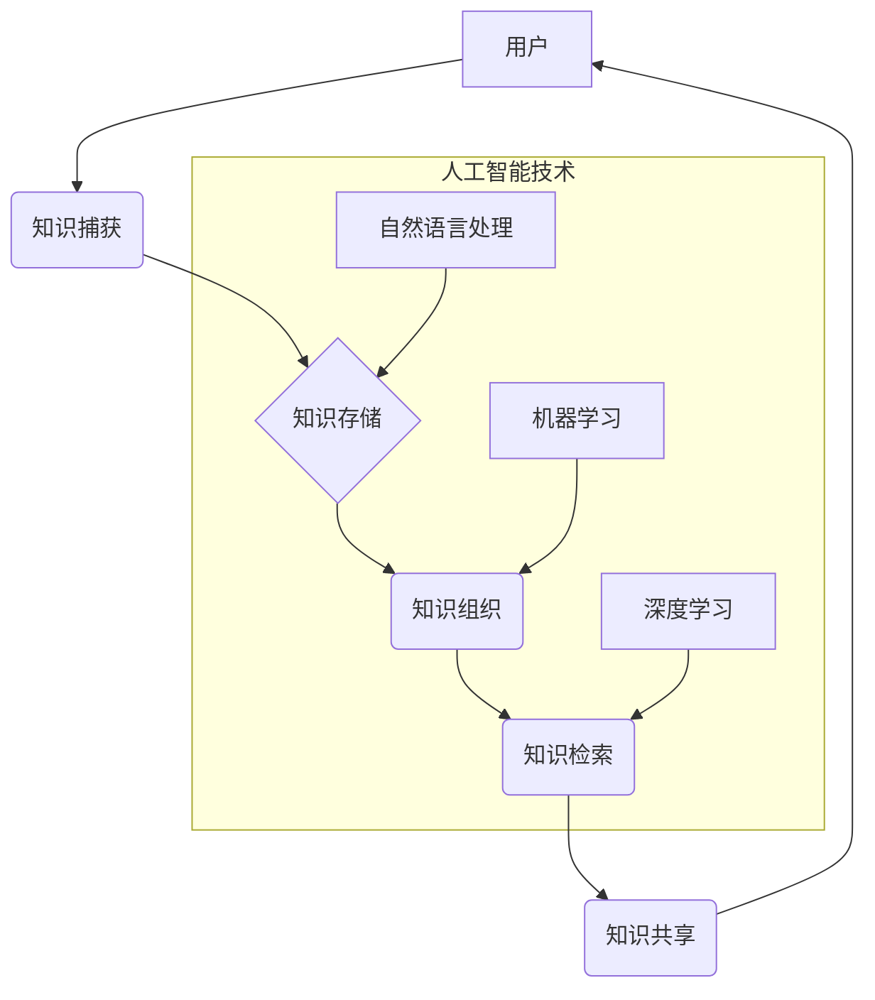

                 

## 信息过载与知识管理系统实施指南：有效组织和检索信息

> 关键词：信息过载、知识管理系统、知识组织、信息检索、人工智能、机器学习、数据挖掘、信息架构、知识图谱

### 1. 背景介绍

在当今信息爆炸的时代，我们每天接触的海量信息呈指数级增长。从新闻资讯到学术论文，从社交媒体到专业文档，信息无处不在，却也带来了“信息过载”的困境。过度的信息涌入不仅难以消化，还会导致注意力分散、效率低下，甚至影响决策的准确性。

知识管理系统 (KMS)应运而生，旨在帮助个人和组织有效地收集、组织、存储、检索和共享知识。KMS 提供了一个平台，让用户可以将分散的信息整合在一起，并通过智能化的工具和算法，快速找到所需的信息，从而提高工作效率和知识利用率。

### 2. 核心概念与联系

**2.1 信息过载的本质**

信息过载是指个体或组织在短时间内接收和处理信息量过大，导致认知能力超负荷，无法有效地理解、记忆和利用信息的状态。

**2.2 知识管理系统的核心功能**

KMS 的核心功能包括：

* **知识捕获:** 收集来自各种来源的信息，包括文档、数据、专家经验等。
* **知识存储:** 将捕获的知识以结构化和可检索的方式存储。
* **知识组织:** 利用分类、标签、关系等方法，对知识进行结构化和分类。
* **知识检索:** 提供高效的搜索和查询功能，帮助用户快速找到所需的信息。
* **知识共享:** 促进知识的传播和交流，让用户可以轻松地与他人分享知识。

**2.3 KMS 与人工智能的结合**

人工智能 (AI) 技术的快速发展为 KMS 的功能提升提供了强大的支持。例如：

* **自然语言处理 (NLP):**  帮助 KMS 理解和处理自然语言文本，实现更精准的搜索和知识提取。
* **机器学习 (ML):**  可以根据用户行为和历史数据，个性化推荐相关知识，并不断优化知识组织和检索算法。
* **深度学习 (DL):**  可以用于构建更复杂的知识图谱，并实现更智能的知识推理和发现。

**2.4 KMS 架构**



### 3. 核心算法原理 & 具体操作步骤

**3.1 算法原理概述**

KMS 中常用的算法包括：

* **文本分类算法:** 用于将文本信息分类到不同的主题或类别。
* **关键词提取算法:** 用于从文本中提取最重要的关键词，用于知识组织和检索。
* **相似度计算算法:** 用于计算两个知识项之间的相似度，用于知识推荐和聚类。
* **知识图谱构建算法:** 用于构建知识图谱，表示知识之间的关系和结构。

**3.2 算法步骤详解**

以文本分类算法为例，其基本步骤如下：

1. **数据预处理:** 对文本数据进行清洗、分词、词干提取等预处理操作，以便于算法训练和应用。
2. **特征提取:** 从预处理后的文本数据中提取特征，例如词频、词向量等。
3. **模型训练:** 使用训练数据训练分类模型，例如支持向量机 (SVM)、朴素贝叶斯 (NB) 等。
4. **模型评估:** 使用测试数据评估模型的性能，例如准确率、召回率等。
5. **模型部署:** 将训练好的模型部署到 KMS 系统中，用于对新文本进行分类。

**3.3 算法优缺点**

不同的算法具有不同的优缺点，需要根据实际应用场景选择合适的算法。例如，SVM 算法具有较高的准确率，但训练时间较长；NB 算法训练速度快，但准确率相对较低。

**3.4 算法应用领域**

KMS 中的算法广泛应用于各个领域，例如：

* **企业知识管理:** 用于组织和管理企业的内部知识，提高员工的工作效率。
* **学术研究:** 用于管理和分析学术文献，促进科研成果的发现和传播。
* **医疗保健:** 用于管理和分析患者数据，辅助医生进行诊断和治疗。

### 4. 数学模型和公式 & 详细讲解 & 举例说明

**4.1 数学模型构建**

KMS 中的知识组织和检索可以抽象为一个图论模型，其中知识项作为节点，知识关系作为边。

**4.2 公式推导过程**

可以使用 PageRank 算法来计算知识项的重要性。PageRank 算法的核心思想是，一个知识项的重要性与其被其他知识项引用的次数成正比。

PageRank 公式如下：

$$PR(A) = (1-d) + d \sum_{Page B links to A} \frac{PR(B)}{C(B)}$$

其中：

* $PR(A)$ 是知识项 A 的 PageRank 值。
* $d$ 是阻尼系数，通常取值为 0.85。
* $C(B)$ 是知识项 B 的出度数，即指向其他知识项的边的数量。

**4.3 案例分析与讲解**

假设我们有一个简单的知识图谱，包含三个知识项 A、B 和 C，其中 A 指向 B，B 指向 C。

根据 PageRank 公式，我们可以计算出每个知识项的重要性：

* $PR(A) = (1-0.85) + 0.85 \times \frac{PR(B)}{1} = 0.15 + 0.85 \times PR(B)$
* $PR(B) = (1-0.85) + 0.85 \times \frac{PR(A)}{1} = 0.15 + 0.85 \times PR(A)$
* $PR(C) = (1-0.85) + 0.85 \times \frac{PR(B)}{1} = 0.15 + 0.85 \times PR(B)$

通过迭代计算，我们可以得到每个知识项的 PageRank 值，从而判断知识项的重要性。

### 5. 项目实践：代码实例和详细解释说明

**5.1 开发环境搭建**

KMS 的开发环境通常包括：

* **操作系统:** Linux、Windows 或 macOS。
* **编程语言:** Python、Java 或 Node.js。
* **数据库:** MySQL、PostgreSQL 或 MongoDB。
* **搜索引擎:** Elasticsearch 或 Solr。

**5.2 源代码详细实现**

以下是一个简单的 Python 代码示例，用于实现文本分类功能：

```python
from sklearn.feature_extraction.text import TfidfVectorizer
from sklearn.naive_bayes import MultinomialNB

# 训练数据
train_data = [
    ("This is a positive review.", "positive"),
    ("This is a negative review.", "negative"),
    # ...
]

# 文本特征提取
vectorizer = TfidfVectorizer()
X_train = vectorizer.fit_transform([text for text, label in train_data])

# 模型训练
classifier = MultinomialNB()
classifier.fit(X_train, [label for text, label in train_data])

# 新文本分类
new_text = "This is a great product!"
X_new = vectorizer.transform([new_text])
predicted_label = classifier.predict(X_new)[0]

print(f"Predicted label: {predicted_label}")
```

**5.3 代码解读与分析**

这段代码首先使用 TfidfVectorizer 将文本数据转换为特征向量，然后使用 MultinomialNB 算法训练分类模型。最后，使用训练好的模型对新文本进行分类。

**5.4 运行结果展示**

运行这段代码后，会输出预测的文本类别，例如 "positive" 或 "negative"。

### 6. 实际应用场景

KMS 在各个领域都有广泛的应用场景：

* **企业知识管理:** 帮助企业收集、组织和共享内部知识，提高员工的工作效率和决策质量。
* **学术研究:** 帮助学者管理和分析学术文献，促进科研成果的发现和传播。
* **医疗保健:** 帮助医生管理和分析患者数据，辅助诊断和治疗。
* **教育培训:** 帮助教师创建和管理在线课程，提高教学效率和学习效果。

**6.4 未来应用展望**

随着人工智能技术的不断发展，KMS 将更加智能化和个性化。未来，KMS 可能具备以下功能：

* **主动学习:** KMS 可以根据用户的行为和需求，主动学习新的知识和技能。
* **个性化推荐:** KMS 可以根据用户的兴趣和偏好，个性化推荐相关知识和资源。
* **知识融合:** KMS 可以融合来自不同来源的知识，提供更全面和深入的知识服务。

### 7. 工具和资源推荐

**7.1 学习资源推荐**

* **书籍:**
    * 《知识管理：理论与实践》
    * 《信息管理：基础与应用》
    * 《人工智能：一种现代方法》
* **在线课程:**
    * Coursera: 知识管理课程
    * edX: 人工智能课程
    * Udemy: 数据挖掘课程

**7.2 开发工具推荐**

* **知识图谱构建工具:** Neo4j、GraphDB
* **搜索引擎:** Elasticsearch、Solr
* **机器学习库:** scikit-learn、TensorFlow、PyTorch

**7.3 相关论文推荐**

* **PageRank 算法:** PageRank: The Anatomy of a Web Page Rank
* **文本分类算法:** A Survey of Text Classification Algorithms
* **知识图谱构建算法:** A Survey of Knowledge Graph Construction Methods

### 8. 总结：未来发展趋势与挑战

**8.1 研究成果总结**

KMS 已经取得了显著的成果，为个人和组织提供了有效的信息组织和检索工具。人工智能技术的应用进一步提升了 KMS 的智能化和个性化水平。

**8.2 未来发展趋势**

未来，KMS 将朝着以下方向发展：

* **更加智能化:** 利用人工智能技术，实现知识自动提取、分类、组织和推荐。
* **更加个性化:** 根据用户的需求和偏好，提供个性化的知识服务。
* **更加融合:** 将来自不同来源的知识融合在一起，提供更全面和深入的知识服务。

**8.3 面临的挑战**

KMS 的发展也面临着一些挑战：

* **数据质量:** KMS 的核心是知识，而知识的质量直接影响 KMS 的效果。如何保证知识数据的准确性和完整性是一个重要的挑战。
* **知识表示:** 如何将知识以一种结构化和可理解的方式表示，是 KMS 发展的一个关键问题。
* **知识共享:** 如何鼓励用户共享知识，并构建一个开放和共享的知识生态系统，也是 KMS 需要解决的难题。

**8.4 研究展望**

未来，KMS 研究将继续探索以下方向：

* **新型知识表示:** 研究更灵活和高效的知识表示方法，例如知识图谱、语义网络等。
* **智能知识发现:** 利用人工智能技术，实现知识的自动发现和推理。
* **跨领域知识融合:** 研究如何将来自不同领域的知识融合在一起，构建一个更加完整的知识体系。


### 9. 附录：常见问题与解答

**9.1 如何选择合适的 KMS 系统？**

选择 KMS 系统需要根据自身的实际需求和预算进行考虑。一些常见的 KMS 系统包括：

* **开源 KMS 系统:** Alfresco, Confluence, MediaWiki
* **商业 KMS 系统:** SharePoint, Documentum, Oracle UCM

**9.2 如何有效地组织和管理知识？**

* **建立知识分类体系:** 根据知识的主题、类型和用途，建立一个清晰的知识分类体系。
* **使用标签和关键词:** 为知识项添加标签和关键词，方便用户搜索和查找。
* **构建知识图谱:** 将知识项之间的关系以图谱的形式表示，方便用户理解知识之间的关联。

**9.3 如何提高 KMS 的使用率？**

* **提供易于使用的界面:** KMS 的界面应该简洁易懂，方便用户操作。
* **提供个性化的知识推荐:** 根据用户的兴趣和需求，推荐相关知识和资源。
* **鼓励用户参与:** 鼓励用户分享知识、参与讨论和贡献内容。


作者：禅与计算机程序设计艺术 / Zen and the Art of Computer Programming 
<end_of_turn>

