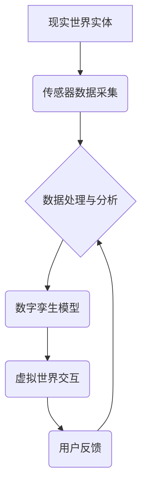

                 

## 元宇宙中的数字孪生:现实世界的完美映射

> 关键词：数字孪生、元宇宙、虚拟现实、增强现实、物联网、数据分析、人工智能、仿真建模

## 1. 背景介绍

元宇宙概念的兴起，标志着人类迈向下一代互联网的征程。它将虚拟世界与现实世界深度融合，构建一个沉浸式、交互式的虚拟空间。在这个虚拟世界中，数字孪生作为核心技术，将扮演着至关重要的角色。数字孪生是指利用物理世界实体的数字化模型，实时反映其状态、行为和演变趋势，并通过数据分析和人工智能算法进行预测和优化。

数字孪生技术在各个领域都展现出巨大的潜力，例如：

* **制造业:** 模拟产品设计和生产流程，优化生产效率和降低成本。
* **城市规划:** 建立城市数字孪生模型，模拟城市发展趋势，优化城市规划和管理。
* **医疗保健:** 建立患者数字孪生模型，模拟疾病发展过程，辅助医生进行诊断和治疗。
* **教育:** 创建沉浸式的虚拟学习环境，提高学习效率和体验。

## 2. 核心概念与联系

数字孪生技术的核心在于将现实世界实体与虚拟世界模型建立起双向映射关系。

**2.1 数字孪生概念**

数字孪生是一个虚拟的、实时更新的实体模型，它与现实世界实体保持同步，并通过数据分析和人工智能算法进行预测和优化。

**2.2 元宇宙概念**

元宇宙是一个沉浸式、交互式的虚拟世界，它将虚拟现实、增强现实、区块链、人工智能等技术融合在一起，构建一个虚拟空间，用户可以在其中进行社交、娱乐、工作等活动。

**2.3 数字孪生与元宇宙的联系**

数字孪生是元宇宙的基础技术之一。在元宇宙中，每个实体都可以拥有一个数字孪生模型，这些模型将相互连接，形成一个复杂的虚拟世界。用户可以通过数字孪生模型与虚拟世界进行交互，体验更加真实和沉浸式的虚拟世界。

**2.4 数字孪生架构**



## 3. 核心算法原理 & 具体操作步骤

### 3.1 算法原理概述

数字孪生技术的核心算法包括数据采集、数据处理、模型构建、仿真模拟和预测分析等。

* **数据采集:** 利用传感器、摄像头、GPS等设备采集现实世界实体的实时数据。
* **数据处理:** 对采集到的数据进行清洗、预处理、特征提取等操作，以便于模型构建和分析。
* **模型构建:** 利用机器学习、深度学习等算法，构建数字孪生模型，模拟现实世界实体的结构、行为和演变趋势。
* **仿真模拟:** 利用数字孪生模型进行仿真模拟，预测实体在不同条件下的行为和性能。
* **预测分析:** 利用仿真模拟的结果，进行预测分析，为现实世界实体的优化和管理提供决策支持。

### 3.2 算法步骤详解

1. **数据采集:** 首先，需要部署传感器网络，实时采集现实世界实体的各种数据，例如温度、压力、流量、位置等。
2. **数据预处理:** 收集到的原始数据通常是噪声和不完整的数据，需要进行清洗、去噪、填充缺失值等预处理操作。
3. **特征提取:** 对预处理后的数据进行特征提取，提取出对模型构建和分析有用的特征，例如平均值、标准差、趋势等。
4. **模型构建:** 选择合适的机器学习算法，例如神经网络、支持向量机等，构建数字孪生模型。模型的训练数据来自于预处理后的特征数据。
5. **模型验证:** 利用测试数据对模型进行验证，评估模型的准确性和泛化能力。
6. **仿真模拟:** 利用训练好的数字孪生模型进行仿真模拟，预测实体在不同条件下的行为和性能。
7. **预测分析:** 对仿真模拟的结果进行分析，提取出有用的信息，例如潜在风险、优化方案等，为现实世界实体的优化和管理提供决策支持。

### 3.3 算法优缺点

**优点:**

* **实时性:** 数字孪生模型可以实时更新，反映实体的最新状态。
* **预测能力:** 数字孪生模型可以进行预测分析，预见实体未来的行为和性能。
* **优化潜力:** 数字孪生模型可以模拟不同方案的效果，帮助优化实体的设计和运营。

**缺点:**

* **数据依赖:** 数字孪生模型的准确性依赖于数据的质量和完整性。
* **模型复杂性:** 构建复杂的数字孪生模型需要大量的计算资源和专业知识。
* **伦理问题:** 数字孪生技术可能引发一些伦理问题，例如隐私保护和责任归属。

### 3.4 算法应用领域

数字孪生技术在各个领域都展现出巨大的潜力，例如：

* **制造业:** 产品设计、生产流程优化、设备维护预测。
* **城市规划:** 城市发展模拟、交通管理优化、资源配置规划。
* **医疗保健:** 患者病情模拟、药物研发、手术方案设计。
* **教育:** 沉浸式虚拟学习环境、个性化学习方案。

## 4. 数学模型和公式 & 详细讲解 & 举例说明

### 4.1 数学模型构建

数字孪生模型的构建可以基于多种数学模型，例如：

* **状态空间模型:** 用于描述实体的状态和行为，其核心是状态转移方程和观测方程。
* **动力学模型:** 用于描述实体的运动和能量变化，例如牛顿第二定律。
* **概率模型:** 用于描述实体的随机性行为，例如马尔可夫链。

### 4.2 公式推导过程

以状态空间模型为例，其核心公式如下：

* **状态转移方程:** $x_k = A_k x_{k-1} + B_k u_{k-1} + w_k$
* **观测方程:** $y_k = C_k x_k + v_k$

其中:

* $x_k$ 是实体在时刻 $k$ 的状态向量。
* $u_k$ 是时刻 $k$ 的控制输入向量。
* $y_k$ 是时刻 $k$ 的观测数据向量。
* $A_k$, $B_k$, $C_k$ 是系统矩阵。
* $w_k$, $v_k$ 是过程噪声和观测噪声向量。

### 4.3 案例分析与讲解

假设我们想要构建一个数字孪生模型来模拟汽车的驾驶行为。

* **状态向量:** 可以包含汽车的速度、位置、方向等信息。
* **控制输入:** 可以包含油门、刹车、方向盘等信息。
* **观测数据:** 可以包含汽车的速度传感器、GPS数据、摄像头图像等信息。

通过收集汽车的驾驶数据，我们可以训练状态空间模型，并利用模型预测汽车在不同驾驶条件下的行为。

## 5. 项目实践：代码实例和详细解释说明

### 5.1 开发环境搭建

* **操作系统:** Ubuntu 20.04 LTS
* **编程语言:** Python 3.8
* **深度学习框架:** TensorFlow 2.0
* **数据可视化工具:** Matplotlib

### 5.2 源代码详细实现

```python
import tensorflow as tf

# 定义状态空间模型
class CarDynamicsModel(tf.keras.Model):
    def __init__(self, state_size, action_size):
        super(CarDynamicsModel, self).__init__()
        self.dense1 = tf.keras.layers.Dense(64, activation='relu')
        self.dense2 = tf.keras.layers.Dense(state_size)

    def call(self, inputs):
        x = self.dense1(inputs)
        x = self.dense2(x)
        return x

# 训练模型
model = CarDynamicsModel(state_size=4, action_size=2)
model.compile(optimizer='adam', loss='mse')
model.fit(X_train, y_train, epochs=100)

# 预测模型
predicted_state = model.predict(X_test)
```

### 5.3 代码解读与分析

* **模型定义:** 定义了一个名为 `CarDynamicsModel` 的状态空间模型，包含两个全连接层。
* **模型训练:** 使用 Adam 优化器和均方误差损失函数训练模型。
* **模型预测:** 使用训练好的模型预测测试数据对应的状态向量。

### 5.4 运行结果展示

训练完成后，可以将模型预测结果与真实数据进行比较，评估模型的准确性。

## 6. 实际应用场景

### 6.1 制造业

* **产品设计优化:** 利用数字孪生模型模拟产品在不同条件下的性能，优化产品设计，降低成本。
* **生产流程仿真:** 模拟生产流程，找出瓶颈和改进点，提高生产效率。
* **设备维护预测:** 利用传感器数据，预测设备的故障风险，提前进行维护，降低停机时间。

### 6.2 城市规划

* **城市发展模拟:** 建立城市数字孪生模型，模拟城市发展趋势，优化城市规划和管理。
* **交通管理优化:** 利用交通流量数据，模拟交通状况，优化交通信号灯控制，缓解交通拥堵。
* **资源配置规划:** 模拟城市资源的消耗和分配，优化资源配置，提高资源利用效率。

### 6.3 医疗保健

* **患者病情模拟:** 建立患者数字孪生模型，模拟疾病发展过程，辅助医生进行诊断和治疗。
* **药物研发:** 利用数字孪生模型模拟药物的疗效，加速药物研发过程。
* **手术方案设计:** 利用数字孪生模型模拟手术过程，帮助医生制定最佳手术方案。

### 6.4 未来应用展望

数字孪生技术在未来将得到更广泛的应用，例如：

* **个性化医疗:** 利用患者数字孪生模型，提供个性化的医疗方案。
* **智能制造:** 利用数字孪生模型，实现智能化生产，提高生产效率和质量。
* **虚拟体验:** 利用数字孪生模型，创造更加逼真的虚拟体验，例如虚拟旅游、虚拟购物等。

## 7. 工具和资源推荐

### 7.1 学习资源推荐

* **书籍:**
    * 《数字孪生: 构建现实世界的完美映射》
    * 《元宇宙: 未来世界的构建》
* **在线课程:**
    * Coursera: 数字孪生与物联网
    * edX: 元宇宙与虚拟现实

### 7.2 开发工具推荐

* **数据采集工具:**
    * ThingSpeak
    * MQTT
* **数据分析工具:**
    * Python (Pandas, NumPy)
    * R
* **模型构建工具:**
    * TensorFlow
    * PyTorch

### 7.3 相关论文推荐

* **数字孪生:**
    * "Digital Twin: Definition, Requirements, and Applications"
    * "A Survey on Digital Twin Technologies"
* **元宇宙:**
    * "The Metaverse: A New Frontier for Human Interaction"
    * "The Metaverse: Opportunities and Challenges"

## 8. 总结：未来发展趋势与挑战

### 8.1 研究成果总结

数字孪生技术在过去几年取得了显著的进展，已经应用于多个领域，并取得了良好的效果。

### 8.2 未来发展趋势

* **更精细的模型:** 未来数字孪生模型将更加精细，能够模拟实体的更复杂的行为和性能。
* **更广泛的应用:** 数字孪生技术将应用于更多领域，例如教育、娱乐、金融等。
* **更智能的交互:** 数字孪生模型将能够更加智能地与用户交互，提供更个性化的服务。

### 8.3 面临的挑战

* **数据质量:** 数字孪生模型的准确性依赖于数据的质量和完整性，如何获取高质量的数据仍然是一个挑战。
* **模型复杂性:** 构建复杂的数字孪生模型需要大量的计算资源和专业知识，降低模型复杂度和开发成本是未来研究方向。
* **伦理问题:** 数字孪生技术可能引发一些伦理问题，例如隐私保护和责任归属，需要制定相应的伦理规范和法律法规。

### 8.4 研究展望

未来，数字孪生技术将继续发展，并与其他新兴技术融合，例如人工智能、区块链、5G等，为人类社会带来更多创新和价值。

## 9. 附录：常见问题与解答

**1. 数字孪生与虚拟现实有什么区别？**

数字孪生是基于现实世界实体的虚拟模型，而虚拟现实是创造一个完全虚拟的体验环境。

**2. 如何构建一个数字孪生模型？**

构建数字孪生模型需要以下步骤：

* 确定实体的属性和行为
* 收集实体的实时数据
* 选择合适的数学模型
* 训练和验证模型
* 部署模型并进行实时更新

**3. 数字孪生技术有哪些应用场景？**

数字孪生技术应用场景广泛，例如：

* 制造业
* 城市规划
* 医疗保健
* 教育
* 娱乐

**作者：禅与计算机程序设计艺术 / Zen and the Art of Computer Programming**<end_of_turn>

