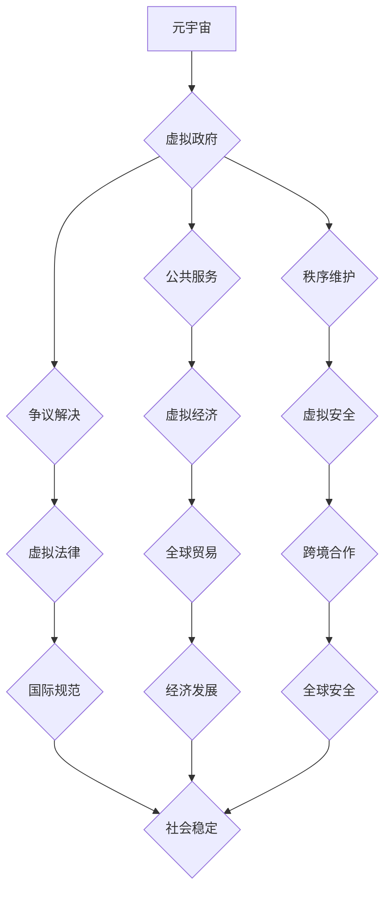

                 

## 元宇宙中的虚拟政府：全球治理的新模式

> 关键词：元宇宙、虚拟政府、全球治理、去中心化、区块链、人工智能、数字身份、虚拟经济

## 1. 背景介绍

元宇宙概念的兴起，标志着人类社会进入了一个全新的数字时代。这个虚拟世界将融合现实世界中的各种元素，包括社交、娱乐、工作、学习等，并以更加沉浸式、交互式的方式呈现。随着元宇宙的不断发展，其规模和影响力将越来越大，对全球治理模式也提出了新的挑战和机遇。

传统的世界治理模式主要基于现实世界的地理边界和政治制度，但在元宇宙中，虚拟空间的边界更加模糊，参与者来自全球各地，传统的治理模式难以有效应对元宇宙带来的复杂性。因此，我们需要探索新的治理模式，以适应元宇宙的发展趋势。

## 2. 核心概念与联系

### 2.1 元宇宙

元宇宙是一个由虚拟现实、增强现实和互联网技术融合而成的沉浸式虚拟世界。它拥有以下核心特征：

* **沉浸式体验:** 用户可以通过虚拟现实设备或增强现实设备，身临其境地体验元宇宙中的虚拟世界。
* **持久性:** 元宇宙是一个持续运行的虚拟世界，即使用户离开，虚拟世界也会继续存在。
* **互操作性:** 不同元宇宙之间可以相互连接，用户可以自由地穿梭于不同的虚拟世界。
* **去中心化:** 元宇宙的控制权分散在多个参与者手中，而不是由单一实体控制。

### 2.2 虚拟政府

虚拟政府是指在元宇宙中运行的自治组织，其目的是为元宇宙中的用户提供公共服务、维护秩序、解决争议等。虚拟政府可以采用多种形式，例如：

* **去中心化自治组织 (DAO):** 基于区块链技术的自治组织，由用户通过投票决定治理方向。
* **虚拟议会:** 由元宇宙中的用户代表组成，负责制定和执行虚拟世界的规则。
* **虚拟法院:** 处理元宇宙中的法律纠纷，并对违反规则的用户进行处罚。

### 2.3 全球治理

全球治理是指国际社会共同应对全球性挑战，维护世界和平与稳定，促进共同发展。元宇宙的出现，为全球治理提供了新的平台和机遇。

**核心概念原理和架构的 Mermaid 流程图**



## 3. 核心算法原理 & 具体操作步骤

### 3.1 算法原理概述

虚拟政府的运行需要依赖于一系列复杂的算法，这些算法负责处理用户数据、维护秩序、解决争议等。其中，一些关键算法包括：

* **身份认证算法:** 用于验证用户的身份，确保用户在元宇宙中拥有唯一的数字身份。
* **决策算法:** 用于根据用户的投票结果或其他数据，做出决策，例如制定规则、分配资源等。
* **冲突解决算法:** 用于处理用户之间的冲突，例如纠纷、欺诈等，并提供公平公正的解决方案。
* **资源分配算法:** 用于根据用户的需求和贡献，分配元宇宙中的资源，例如虚拟土地、虚拟物品等。

### 3.2 算法步骤详解

以身份认证算法为例，其具体操作步骤如下：

1. **用户注册:** 用户在元宇宙平台上注册账号，并提供必要的个人信息。
2. **身份验证:** 用户需要通过多种方式进行身份验证，例如：
    * **生物识别验证:** 使用指纹、面部识别等生物特征进行验证。
    * **密码验证:** 使用预先设置的密码进行验证。
    * **多因素认证:** 结合多种验证方式，例如密码+短信验证码等。
3. **数字身份生成:** 经过身份验证后，系统会为用户生成唯一的数字身份，并将其存储在区块链网络中。
4. **身份识别:** 用户在元宇宙中进行任何操作时，都需要使用数字身份进行识别。

### 3.3 算法优缺点

**优点:**

* **安全性:** 基于区块链技术的算法可以确保用户的身份信息安全可靠。
* **透明度:** 算法的运行过程是公开透明的，任何人都可以查看和验证。
* **不可篡改性:** 存储在区块链网络中的数据是不可篡改的，可以防止身份信息被伪造或修改。

**缺点:**

* **技术复杂性:** 这些算法的开发和维护需要高水平的技术人员。
* **隐私问题:** 用户的个人信息在元宇宙中可能会被收集和使用，需要妥善保护用户隐私。
* **可访问性:** 并非所有用户都具备使用这些技术的条件，需要考虑技术普及问题。

### 3.4 算法应用领域

虚拟政府的算法可以应用于元宇宙中的各个领域，例如：

* **虚拟经济:** 管理虚拟货币、虚拟资产、虚拟交易等。
* **虚拟社会:** 建立虚拟社区、组织虚拟活动、维护虚拟秩序等。
* **虚拟教育:** 提供虚拟课程、虚拟实验、虚拟导师等。
* **虚拟医疗:** 提供虚拟诊断、虚拟治疗、虚拟康复等。

## 4. 数学模型和公式 & 详细讲解 & 举例说明

### 4.1 数学模型构建

虚拟政府的运行可以抽象为一个复杂的系统，可以使用数学模型来描述其行为和演化。例如，我们可以使用图论模型来表示元宇宙中的用户和关系，使用博弈论模型来分析用户之间的互动，使用概率论模型来预测用户的行为。

### 4.2 公式推导过程

以用户投票决策为例，我们可以使用以下公式来推导投票结果：

$$
\text{投票结果} = \frac{\sum_{i=1}^{n} v_i}{n}
$$

其中：

* $v_i$ 表示第 $i$ 个用户的投票值。
* $n$ 表示总共有多少个用户参与投票。

### 4.3 案例分析与讲解

假设元宇宙中有一个关于虚拟土地使用权的投票，共有 100 个用户参与投票，其中 60 个用户支持将虚拟土地用于商业用途，40 个用户支持将虚拟土地用于公共用途。根据上述公式，投票结果为：

$$
\text{投票结果} = \frac{60 \times 1 + 40 \times 0}{100} = 0.6
$$

因此，支持将虚拟土地用于商业用途的方案获得了 60% 的投票支持。

## 5. 项目实践：代码实例和详细解释说明

### 5.1 开发环境搭建

虚拟政府的开发需要搭建一个合适的开发环境，包括：

* **编程语言:** 选择合适的编程语言，例如 Solidity、Python、JavaScript 等。
* **区块链平台:** 选择合适的区块链平台，例如 Ethereum、Hyperledger Fabric 等。
* **虚拟现实平台:** 选择合适的虚拟现实平台，例如 Unity、Unreal Engine 等。

### 5.2 源代码详细实现

以下是一个简单的虚拟投票系统的源代码示例，使用 Solidity 语言编写，部署在 Ethereum 区块链平台上：

```solidity
pragma solidity ^0.8.0;

contract Voting {
    mapping(address => bool) public voters;
    uint public voteCount;

    function vote() public {
        require(!voters[msg.sender], "You have already voted.");
        voters[msg.sender] = true;
        voteCount++;
    }

    function getVoteCount() public view returns (uint) {
        return voteCount;
    }
}
```

### 5.3 代码解读与分析

* `mapping(address => bool) public voters;`：定义一个映射变量 `voters`，用于存储已投票的用户地址和投票状态。
* `uint public voteCount;`：定义一个变量 `voteCount`，用于存储总的投票数。
* `function vote() public`：定义一个名为 `vote` 的函数，用于用户投票。
* `require(!voters[msg.sender], "You have already voted.");`：检查用户是否已经投票，如果已经投票则抛出错误。
* `voters[msg.sender] = true;`：将当前用户的投票状态设置为已投票。
* `voteCount++;`：增加总的投票数。
* `function getVoteCount() public view returns (uint)`：定义一个名为 `getVoteCount` 的函数，用于查询总的投票数。

### 5.4 运行结果展示

部署该合约后，用户可以通过交互式钱包进行投票操作，并查询总的投票数。

## 6. 实际应用场景

### 6.1 元宇宙社区治理

虚拟政府可以帮助元宇宙社区建立更加民主、透明、高效的治理机制。例如，用户可以投票决定社区规则、分配资源、选择社区领导等。

### 6.2 虚拟经济监管

虚拟政府可以帮助监管元宇宙中的虚拟经济活动，防止欺诈、洗钱等违法行为。例如，虚拟政府可以制定虚拟货币的交易规则、监管虚拟资产的转让等。

### 6.3 虚拟身份管理

虚拟政府可以帮助管理元宇宙中的虚拟身份，确保用户的身份信息安全可靠。例如，虚拟政府可以为用户提供数字身份认证服务、管理虚拟身份的权限等。

### 6.4 未来应用展望

随着元宇宙的发展，虚拟政府的应用场景将更加广泛，例如：

* **虚拟法律体系:** 建立虚拟法律体系，处理元宇宙中的法律纠纷。
* **虚拟教育体系:** 提供虚拟教育资源，促进元宇宙中的知识共享和学习。
* **虚拟医疗体系:** 提供虚拟医疗服务，改善元宇宙中的医疗保健水平。

## 7. 工具和资源推荐

### 7.1 学习资源推荐

* **书籍:** 《元宇宙：下一代互联网》
* **网站:** 元宇宙联盟 (https://www.metaversealliance.org/)
* **论坛:** 元宇宙社区 (https://www.metaversecommunity.org/)

### 7.2 开发工具推荐

* **编程语言:** Solidity、Python、JavaScript
* **区块链平台:** Ethereum、Hyperledger Fabric
* **虚拟现实平台:** Unity、Unreal Engine

### 7.3 相关论文推荐

* **《元宇宙：概念、技术和挑战》**
* **《去中心化自治组织 (DAO) 的未来》**

## 8. 总结：未来发展趋势与挑战

### 8.1 研究成果总结

虚拟政府的概念和技术正在快速发展，为元宇宙的治理提供了新的思路和方法。虚拟政府可以帮助解决元宇宙中的许多挑战，例如身份认证、资源分配、秩序维护等。

### 8.2 未来发展趋势

未来，虚拟政府将朝着以下方向发展：

* **更加智能化:** 利用人工智能技术，提高虚拟政府的决策效率和服务质量。
* **更加去中心化:** 进一步降低虚拟政府的中心化程度，赋予用户更多的自治权。
* **更加融合化:** 与其他元宇宙平台和应用系统进行深度融合，构建更加完整的虚拟社会生态。

### 8.3 面临的挑战

虚拟政府的发展也面临着一些挑战：

* **技术挑战:** 虚拟政府的开发和维护需要高水平的技术人才和先进的技术手段。
* **法律挑战:** 虚拟政府的法律地位和监管机制尚不明确，需要制定相应的法律法规。
* **社会挑战:** 虚拟政府的运行需要得到用户的信任和支持，需要解决用户隐私、安全等问题。

### 8.4 研究展望

未来，我们需要继续深入研究虚拟政府的概念、技术和应用，探索虚拟政府在元宇宙中的发展路径，为构建更加公平、公正、可持续的虚拟社会贡献力量。

## 9. 附录：常见问题与解答

**Q1: 虚拟政府和现实世界政府有什么区别？**

**A1:** 虚拟政府和现实世界政府的主要区别在于：

* **治理范围:** 虚拟政府治理的是元宇宙中的虚拟世界，而现实世界政府治理的是现实世界。
* **治理主体:** 虚拟政府的治理主体是元宇宙中的用户，而现实世界政府的治理主体是国家或地区。
* **治理机制:** 虚拟政府通常采用更加去中心化的治理机制，例如 DAO，而现实世界政府通常采用更加集中化的治理机制。

**Q2: 虚拟政府如何解决用户隐私问题？**

**A2:** 虚拟政府可以采用以下措施来解决用户隐私问题：

* **加密技术:** 使用加密技术保护用户的个人信息。
* **匿名化技术:** 使用匿名化技术，隐藏用户的真实身份。
* **数据安全政策:** 制定严格的数据安全政策，保护用户的个人信息不被滥用。


作者：禅与计算机程序设计艺术 / Zen and the Art of Computer Programming 
<end_of_turn>

