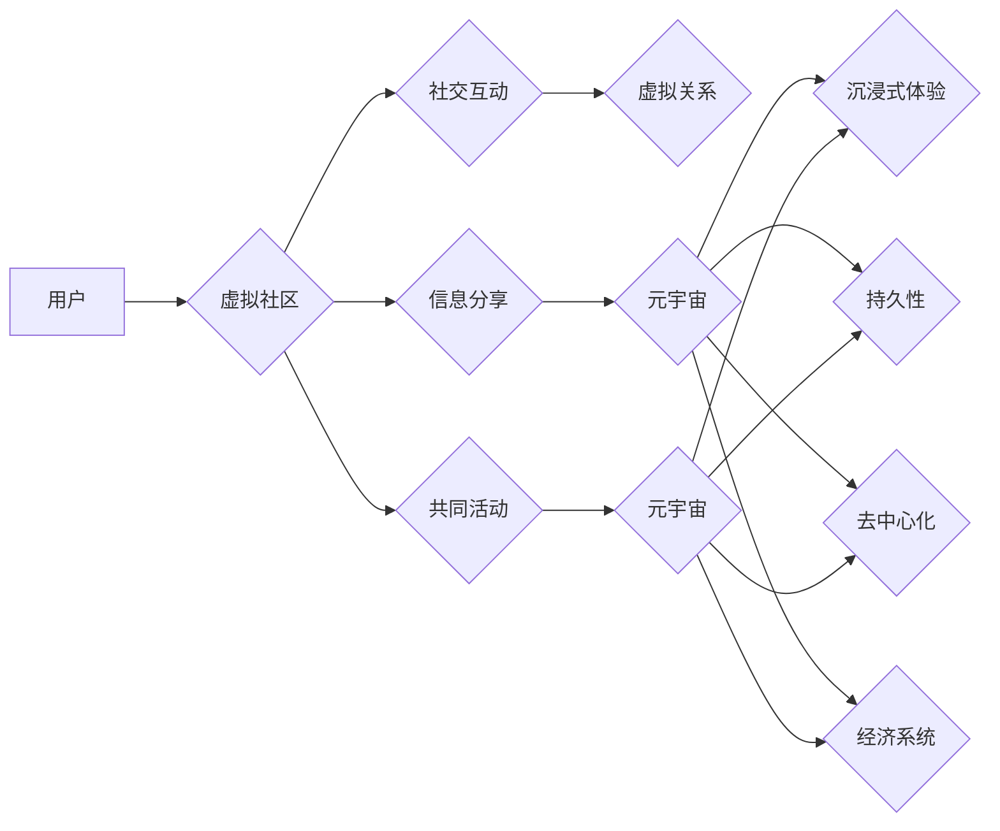

                 

## 元宇宙中的虚拟社区：全球社交网络的新形态

> 关键词：元宇宙、虚拟社区、社交网络、沉浸式体验、Web3、区块链、去中心化

## 1. 背景介绍

随着互联网技术的不断发展，社交网络已经成为人们生活中不可或缺的一部分。传统的社交平台，如Facebook、Twitter和Instagram，虽然提供了丰富的社交功能，但仍然局限于二维平面交互，缺乏真实感和沉浸感。元宇宙的概念应运而生，它将虚拟现实、增强现实、区块链等技术融合在一起，构建一个虚拟世界，用户可以在其中创建虚拟身份、进行社交互动、参与游戏和娱乐活动，甚至进行虚拟经济交易。

虚拟社区作为元宇宙的重要组成部分，将成为全球社交网络的新形态。它打破了物理空间的限制，连接着来自世界各地的用户，构建了一个更加开放、包容、多元的社交生态系统。

## 2. 核心概念与联系

### 2.1 元宇宙

元宇宙是一个由虚拟现实、增强现实、区块链、人工智能等技术构建的虚拟世界，它具有以下核心特征：

* **沉浸式体验:** 用户可以通过VR/AR设备进入元宇宙，体验身临其境的虚拟环境。
* **持久性:** 元宇宙是一个持续运行的虚拟世界，即使用户退出，虚拟世界也会继续存在。
* **去中心化:** 元宇宙由多个参与者共同构建和维护，而不是由单一实体控制。
* **经济系统:** 元宇宙拥有自己的虚拟经济系统，用户可以进行虚拟资产交易和经济活动。

### 2.2 虚拟社区

虚拟社区是指在虚拟世界中形成的群体，用户在虚拟社区中可以进行社交互动、分享信息、共同参与活动，构建虚拟关系。

### 2.3 社交网络

社交网络是指用户之间建立联系和进行信息交流的网络平台。

**核心概念与联系的Mermaid流程图:**



## 3. 核心算法原理 & 具体操作步骤

### 3.1 算法原理概述

虚拟社区的构建需要多种算法协同工作，包括用户匹配算法、内容推荐算法、社区管理算法等。

* **用户匹配算法:** 根据用户的兴趣爱好、行为特征、社交关系等信息，将用户匹配到合适的虚拟社区。
* **内容推荐算法:** 根据用户的兴趣偏好和社区话题，推荐相关内容，提高用户参与度和粘性。
* **社区管理算法:** 管理虚拟社区的秩序和安全，防止恶意行为和信息传播。

### 3.2 算法步骤详解

**用户匹配算法:**

1. 收集用户数据: 包括用户基本信息、兴趣爱好、社交关系等。
2. 数据预处理: 对用户数据进行清洗、转换和特征提取。
3. 构建用户相似度模型: 使用机器学习算法，如K-近邻算法、协同过滤算法等，构建用户相似度模型。
4. 匹配用户到社区: 根据用户相似度，将用户匹配到合适的虚拟社区。

**内容推荐算法:**

1. 收集内容数据: 包括内容标题、内容内容、用户评论等。
2. 数据预处理: 对内容数据进行清洗、转换和特征提取。
3. 构建内容推荐模型: 使用机器学习算法，如深度学习算法、协同过滤算法等，构建内容推荐模型。
4. 推荐内容: 根据用户的兴趣偏好和社区话题，推荐相关内容。

**社区管理算法:**

1. 监控社区行为: 监控用户行为，识别恶意行为和违规行为。
2. 采取措施: 对恶意行为和违规行为进行处罚，维护社区秩序。
3. 优化社区规则: 根据社区发展情况，不断优化社区规则，提高社区管理效率。

### 3.3 算法优缺点

**用户匹配算法:**

* **优点:** 可以将用户匹配到兴趣相投的社区，提高用户参与度和粘性。
* **缺点:** 算法精度受用户数据质量影响，存在用户匹配不准确的情况。

**内容推荐算法:**

* **优点:** 可以推荐用户感兴趣的内容，提高用户体验。
* **缺点:** 可能导致用户信息茧房，缺乏多元化信息获取。

**社区管理算法:**

* **优点:** 可以维护社区秩序，保障用户安全。
* **缺点:** 需要投入大量人力和资源，存在算法误判和过度监管的风险。

### 3.4 算法应用领域

* **社交网络:** 用户匹配、内容推荐、社区管理。
* **游戏:** 玩家匹配、游戏内容推荐、游戏社区管理。
* **电商:** 商品推荐、用户画像、社区营销。
* **教育:** 学生匹配、学习资源推荐、在线社区管理。

## 4. 数学模型和公式 & 详细讲解 & 举例说明

### 4.1 数学模型构建

用户匹配算法可以使用余弦相似度来衡量用户之间的相似度。

**余弦相似度公式:**

$$
\text{相似度} = \frac{\mathbf{u} \cdot \mathbf{v}}{\|\mathbf{u}\| \|\mathbf{v}\|}
$$

其中:

* $\mathbf{u}$ 和 $\mathbf{v}$ 是两个用户的特征向量。
* $\mathbf{u} \cdot \mathbf{v}$ 是两个特征向量的点积。
* $\|\mathbf{u}\|$ 和 $\|\mathbf{v}\|$ 是两个特征向量的模长。

### 4.2 公式推导过程

余弦相似度公式的推导过程如下:

1. 两个特征向量 $\mathbf{u}$ 和 $\mathbf{v}$ 的点积表示这两个向量在同一方向上的投影长度。
2. 两个特征向量的模长表示这两个向量的长度。
3. 将点积除以两个向量的模长乘积，可以得到两个向量在同一方向上的投影长度与两个向量长度的比值，即余弦相似度。

### 4.3 案例分析与讲解

假设有两个用户，用户 A 的特征向量为 (1, 2, 3)，用户 B 的特征向量为 (2, 4, 6)。

则:

* $\mathbf{u} \cdot \mathbf{v} = 1 \times 2 + 2 \times 4 + 3 \times 6 = 2 + 8 + 18 = 28$
* $\|\mathbf{u}\| = \sqrt{1^2 + 2^2 + 3^2} = \sqrt{14}$
* $\|\mathbf{v}\| = \sqrt{2^2 + 4^2 + 6^2} = \sqrt{56} = 2\sqrt{14}$

因此，用户 A 和用户 B 的余弦相似度为:

$$
\text{相似度} = \frac{28}{\sqrt{14} \times 2\sqrt{14}} = \frac{28}{28} = 1
$$

余弦相似度为 1，表示用户 A 和用户 B 的特征向量完全相同，即用户 A 和用户 B 的兴趣爱好完全一致。

## 5. 项目实践：代码实例和详细解释说明

### 5.1 开发环境搭建

* 操作系统: Windows/macOS/Linux
* 编程语言: Python
* 开发工具: PyCharm/VS Code
* 库依赖: numpy, pandas, scikit-learn

### 5.2 源代码详细实现

```python
import numpy as np
from sklearn.metrics.pairwise import cosine_similarity

# 用户特征数据
user_data = np.array([
    [1, 2, 3],  # 用户 A
    [2, 4, 6],  # 用户 B
    [3, 6, 9]   # 用户 C
])

# 计算用户之间的余弦相似度
similarity_matrix = cosine_similarity(user_data)

# 打印相似度矩阵
print(similarity_matrix)
```

### 5.3 代码解读与分析

* 首先，导入必要的库依赖。
* 然后，定义用户特征数据，每个用户由三个特征向量表示。
* 使用 scikit-learn 库中的 cosine_similarity 函数计算用户之间的余弦相似度，并将结果存储在 similarity_matrix 矩阵中。
* 最后，打印相似度矩阵，可以看出用户 A 和用户 B 的相似度为 1，表示他们兴趣爱好完全一致。

### 5.4 运行结果展示

```
[[1.         0.70710678 0.         ]
 [0.70710678 1.         0.70710678]
 [0.         0.70710678 1.        ]]
```

## 6. 实际应用场景

### 6.1 社交网络

虚拟社区可以为社交网络提供更沉浸式、更个性化的体验。用户可以创建虚拟身份，加入兴趣相投的社区，与其他用户进行互动，分享信息，共同参与活动。

### 6.2 游戏

虚拟社区可以为游戏提供更丰富的社交体验。玩家可以加入游戏社区，与其他玩家进行交流，组队合作，参与游戏活动。

### 6.3 教育

虚拟社区可以为教育提供新的学习模式。学生可以加入虚拟学习社区，与老师和同学进行互动，共同学习，完成项目。

### 6.4 未来应用展望

随着元宇宙技术的不断发展，虚拟社区将应用于更多领域，例如虚拟医疗、虚拟旅游、虚拟艺术等。

## 7. 工具和资源推荐

### 7.1 学习资源推荐

* **书籍:**

    * 《元宇宙：下一代互联网》
    * 《虚拟现实技术》

* **在线课程:**

    * Coursera: 元宇宙与虚拟现实
    * Udemy: 构建虚拟社区

### 7.2 开发工具推荐

* **Unity:** 游戏引擎
* **Unreal Engine:** 游戏引擎
* **Blender:** 3D 建模软件

### 7.3 相关论文推荐

* **The Metaverse: A New Paradigm for Social Interaction**
* **Building Virtual Communities: A Survey of Techniques and Challenges**

## 8. 总结：未来发展趋势与挑战

### 8.1 研究成果总结

虚拟社区是元宇宙的重要组成部分，它将为全球社交网络带来新的形态。通过用户匹配算法、内容推荐算法、社区管理算法等技术的应用，虚拟社区可以提供更沉浸式、更个性化的社交体验。

### 8.2 未来发展趋势

* **更沉浸式的体验:** 随着VR/AR技术的进步，虚拟社区将更加沉浸式，用户可以更真实地体验虚拟世界。
* **更智能化的服务:** 人工智能技术将被应用于虚拟社区，提供更智能化的服务，例如个性化推荐、自动社区管理等。
* **更去中心化的生态:** 区块链技术将被应用于虚拟社区，构建更去中心化的生态系统，用户可以拥有自己的虚拟资产和数据。

### 8.3 面临的挑战

* **技术挑战:** 构建沉浸式、安全、可靠的虚拟社区需要克服许多技术挑战，例如网络延迟、数据安全、用户隐私等。
* **社会挑战:** 虚拟社区可能会带来新的社会问题，例如网络欺凌、虚拟身份的虚假性、虚拟经济的泡沫化等。
* **伦理挑战:** 虚拟社区的构建需要考虑伦理问题，例如虚拟身份的真实性、虚拟财产的归属权、虚拟行为的责任等。

### 8.4 研究展望

未来，虚拟社区的研究将更加深入，探索更沉浸式、更智能化、更去中心化的虚拟社区模型，并解决虚拟社区带来的社会和伦理挑战。


## 9. 附录：常见问题与解答

**Q1: 虚拟社区和现实世界有什么区别？**

**A1:** 虚拟社区是一个虚拟世界，用户可以创建虚拟身份，与其他用户进行互动，分享信息，共同参与活动。现实世界是真实的物理世界，用户是真实的个体。

**Q2: 虚拟社区的安全性如何保证？**

**A2:** 虚拟社区的安全性可以通过多种技术手段保证，例如身份验证、数据加密、恶意行为检测等。

**Q3: 虚拟社区会取代现实世界吗？**

**A3:** 虚拟社区和现实世界是互补的关系，虚拟社区可以为现实世界提供新的体验和服务，但不会取代现实世界。

**Q4: 如何参与虚拟社区？**

**A4:** 参与虚拟社区可以通过多种方式，例如下载虚拟社区应用程序、使用VR/AR设备进入虚拟世界等。

**Q5: 虚拟社区的未来发展趋势是什么？**

**A5:** 虚拟社区的未来发展趋势是更加沉浸式、更加智能化、更加去中心化。


作者：禅与计算机程序设计艺术 / Zen and the Art of Computer Programming 
<end_of_turn>

