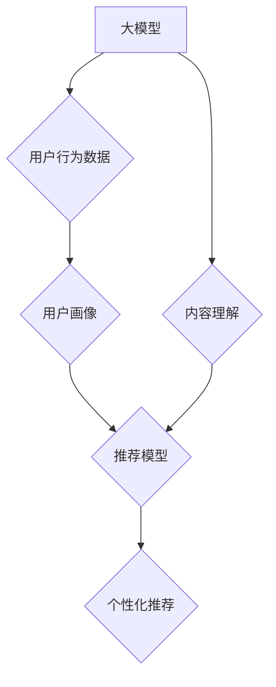

                 

## 利用大模型进行推荐场景的用户行为影响力建模与分析

> 关键词：大模型、推荐系统、用户行为、影响力建模、深度学习、因果推理

## 1. 背景介绍

推荐系统作为互联网时代的重要技术支柱，在电商、社交媒体、内容平台等领域发挥着至关重要的作用。传统的推荐系统主要依赖于协同过滤、内容过滤等方法，但这些方法往往难以捕捉用户行为的复杂性和动态性。近年来，随着大模型技术的快速发展，大模型在推荐场景中的应用逐渐受到关注。大模型具备强大的语义理解和泛化能力，能够从海量用户行为数据中学习到更深层的用户偏好和兴趣，从而提供更精准、个性化的推荐。

然而，仅仅依靠大模型的预测能力并不能完全解决推荐场景中的用户行为影响力建模问题。用户行为受到多种因素的影响，包括用户自身特征、环境因素、社交影响等。如何准确地识别和量化这些影响因素，并将其融入到推荐模型中，是提升推荐系统性能的关键挑战。

## 2. 核心概念与联系

### 2.1 用户行为影响力建模

用户行为影响力建模是指通过构建数学模型，分析和预测用户行为受到哪些因素的影响，以及这些因素的影响程度。

### 2.2 大模型在推荐场景中的应用

大模型在推荐场景中主要通过以下方式发挥作用：

* **用户画像构建:** 大模型能够从用户历史行为、文本描述等数据中学习用户兴趣、偏好、需求等特征，构建更加精准的用户画像。
* **内容理解和匹配:** 大模型能够理解内容的语义和主题，并根据用户画像进行内容匹配，推荐更符合用户兴趣的内容。
* **个性化推荐:** 大模型能够根据用户的历史行为、实时状态等信息，动态调整推荐策略，提供更加个性化的推荐结果。

### 2.3 核心概念关系

大模型、用户行为影响力建模和推荐系统之间存在着密切的联系。大模型可以帮助我们更好地理解用户行为，从而构建更准确的用户行为影响力模型，进而提升推荐系统的性能。

**Mermaid 流程图**



## 3. 核心算法原理 & 具体操作步骤

### 3.1 算法原理概述

用户行为影响力建模常用的算法包括：

* **线性回归:** 线性回归是一种简单易懂的算法，可以用来预测连续型变量。
* **逻辑回归:** 逻辑回归是一种用于分类问题的算法，可以用来预测用户是否会点击、购买、分享等行为。
* **决策树:** 决策树是一种树形结构的算法，可以用来进行分类和回归预测。
* **随机森林:** 随机森林是一种集成学习算法，通过构建多个决策树并进行投票，提高预测精度。
* **神经网络:** 神经网络是一种更复杂的算法，能够学习到更复杂的非线性关系。

### 3.2 算法步骤详解

以线性回归为例，其具体操作步骤如下：

1. **数据收集:** 收集用户行为数据，包括用户特征、环境因素、社交影响等信息。
2. **数据预处理:** 对数据进行清洗、转换、编码等操作，使其适合模型训练。
3. **模型构建:** 使用线性回归模型，将用户行为作为目标变量，其他因素作为预测变量。
4. **模型训练:** 使用训练数据训练模型，学习模型参数。
5. **模型评估:** 使用测试数据评估模型性能，例如准确率、召回率、F1-score等。
6. **模型优化:** 根据评估结果，调整模型参数或选择其他算法，提高模型性能。

### 3.3 算法优缺点

| 算法 | 优点 | 缺点 |
|---|---|---|
| 线性回归 | 简单易懂，易于解释 | 难以捕捉非线性关系 |
| 逻辑回归 | 适合分类问题 | 难以处理高维数据 |
| 决策树 | 可以处理非线性关系，易于解释 | 容易过拟合 |
| 随机森林 | 提高了预测精度，降低了过拟合风险 | 训练时间较长 |
| 神经网络 | 能够学习到更复杂的非线性关系 | 训练时间较长，难以解释 |

### 3.4 算法应用领域

用户行为影响力建模算法广泛应用于以下领域：

* **推荐系统:** 提升推荐系统的精准度和个性化程度。
* **营销分析:** 分析用户行为，制定更有效的营销策略。
* **用户体验优化:** 识别用户行为痛点，优化用户体验。
* **风险控制:** 识别潜在的风险行为，降低风险。

## 4. 数学模型和公式 & 详细讲解 & 举例说明

### 4.1 数学模型构建

假设我们想要预测用户是否会点击广告，我们可以使用逻辑回归模型。逻辑回归模型将用户行为作为目标变量，其他因素作为预测变量，并使用sigmoid函数将预测结果映射到0到1之间，表示用户点击广告的概率。

### 4.2 公式推导过程

逻辑回归模型的公式如下：

$$
p(y=1|x) = \frac{1}{1 + e^{-(w^T x + b)}}
$$

其中：

* $p(y=1|x)$ 表示用户点击广告的概率。
* $x$ 表示用户特征向量。
* $w$ 表示模型参数向量。
* $b$ 表示模型偏置项。
* $e$ 表示自然常数。

### 4.3 案例分析与讲解

假设我们有一个用户特征向量 $x = [age, gender, income]$, 其中 age 表示用户年龄，gender 表示用户性别，income 表示用户收入。我们训练了一个逻辑回归模型，并得到了模型参数 $w = [0.2, 0.1, -0.05]$ 和偏置项 $b = 0.5$.

对于一个年龄为30岁，性别为男性，收入为50000美元的用户，我们可以使用公式计算其点击广告的概率：

$$
p(y=1|x) = \frac{1}{1 + e^{-(0.2 * 30 + 0.1 * 1 - 0.05 * 50000 + 0.5)}}
$$

通过计算，我们可以得到该用户的点击广告概率为0.75。

## 5. 项目实践：代码实例和详细解释说明

### 5.1 开发环境搭建

* Python 3.7+
* TensorFlow 2.0+
* Pandas
* Scikit-learn

### 5.2 源代码详细实现

```python
import pandas as pd
from sklearn.linear_model import LogisticRegression
from sklearn.model_selection import train_test_split

# 加载数据
data = pd.read_csv('user_behavior_data.csv')

# 划分训练集和测试集
X = data[['age', 'gender', 'income']]
y = data['click']
X_train, X_test, y_train, y_test = train_test_split(X, y, test_size=0.2, random_state=42)

# 创建逻辑回归模型
model = LogisticRegression()

# 训练模型
model.fit(X_train, y_train)

# 预测测试集结果
y_pred = model.predict(X_test)

# 评估模型性能
from sklearn.metrics import accuracy_score
accuracy = accuracy_score(y_test, y_pred)
print(f'模型准确率: {accuracy}')
```

### 5.3 代码解读与分析

* 首先，我们加载用户行为数据，并划分训练集和测试集。
* 然后，我们创建逻辑回归模型，并使用训练集训练模型。
* 接着，我们使用测试集预测结果，并评估模型性能。

### 5.4 运行结果展示

运行上述代码后，我们可以得到模型的准确率。

## 6. 实际应用场景

### 6.1 个性化推荐

大模型可以根据用户的历史行为、兴趣偏好等信息，构建更加精准的用户画像，从而提供更加个性化的推荐。例如，电商平台可以利用大模型推荐用户可能感兴趣的商品，社交媒体平台可以推荐用户可能想关注的用户或话题。

### 6.2 内容过滤

大模型可以理解内容的语义和主题，并根据用户的兴趣偏好进行内容过滤。例如，新闻平台可以利用大模型推荐用户感兴趣的新闻，视频平台可以推荐用户可能想观看的视频。

### 6.3 广告精准投放

大模型可以分析用户的特征和行为，识别潜在的广告目标用户，并进行精准投放。例如，广告平台可以利用大模型将广告精准投放到对该广告感兴趣的用户面前。

### 6.4 未来应用展望

随着大模型技术的不断发展，其在推荐场景中的应用将更加广泛和深入。例如，未来可能出现以下应用场景：

* **多模态推荐:** 利用大模型融合文本、图像、音频等多模态数据，提供更加丰富的推荐结果。
* **动态推荐:** 利用大模型实时分析用户的行为和环境变化，动态调整推荐策略，提供更加个性化和及时化的推荐。
* **协同推荐:** 利用大模型分析用户之间的关系和行为相似性，进行协同推荐，推荐更加符合用户群体兴趣的内容。

## 7. 工具和资源推荐

### 7.1 学习资源推荐

* **书籍:**
    * 《深度学习》 - Ian Goodfellow, Yoshua Bengio, Aaron Courville
    * 《自然语言处理》 - Steven Bird, Ewan Klein, Edward Loper
* **在线课程:**
    * Coursera: 深度学习 Specialization
    * Udacity: 自然语言处理 Nanodegree
* **博客和网站:**
    * TensorFlow Blog: https://blog.tensorflow.org/
    * PyTorch Blog: https://pytorch.org/blog/

### 7.2 开发工具推荐

* **TensorFlow:** https://www.tensorflow.org/
* **PyTorch:** https://pytorch.org/
* **Keras:** https://keras.io/

### 7.3 相关论文推荐

* **Attention Is All You Need:** https://arxiv.org/abs/1706.03762
* **BERT: Pre-training of Deep Bidirectional Transformers for Language Understanding:** https://arxiv.org/abs/1810.04805
* **GPT-3: Language Models are Few-Shot Learners:** https://arxiv.org/abs/2005.14165

## 8. 总结：未来发展趋势与挑战

### 8.1 研究成果总结

大模型在推荐场景中的应用取得了显著的成果，能够提升推荐系统的精准度和个性化程度。

### 8.2 未来发展趋势

未来，大模型在推荐场景中的应用将朝着以下方向发展：

* **模型规模和能力的提升:** 大模型的规模和能力将不断提升，能够学习到更加复杂的知识和规律。
* **多模态融合:** 大模型将融合文本、图像、音频等多模态数据，提供更加丰富的推荐结果。
* **动态个性化:** 大模型将实时分析用户的行为和环境变化，动态调整推荐策略，提供更加个性化和及时化的推荐。

### 8.3 面临的挑战

大模型在推荐场景中的应用也面临着一些挑战：

* **数据隐私和安全:** 大模型需要大量的用户数据进行训练，如何保护用户数据隐私和安全是一个重要的挑战。
* **模型解释性和可控性:** 大模型的决策过程往往是复杂的，难以解释和理解，如何提高模型的解释性和可控性是一个重要的研究方向。
* **计算资源和成本:** 训练和部署大模型需要大量的计算资源和成本，如何降低成本是一个重要的挑战。

### 8.4 研究展望

未来，我们需要继续深入研究大模型在推荐场景中的应用，解决上述挑战，并探索新的应用场景。


## 9. 附录：常见问题与解答

**Q1: 大模型的训练需要多少数据？**

A1: 大模型的训练需要大量的训练数据，通常需要百万甚至数十亿条数据。

**Q2: 如何评估大模型的性能？**

A2: 大模型的性能可以评估指标包括准确率、召回率、F1-score、AUC等。

**Q3: 如何解决大模型的过拟合问题？**

A3: 可以使用正则化技术、数据增强、Dropout等方法来解决大模型的过拟合问题。


作者：禅与计算机程序设计艺术 / Zen and the Art of Computer Programming 
<end_of_turn>

