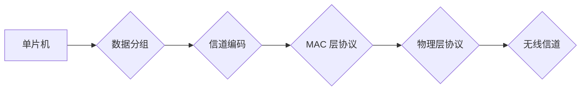

                 

## 单片机无线通信协议优化

> 关键词：单片机、无线通信、协议优化、数据传输、功耗、吞吐量、可靠性

## 1. 背景介绍

随着物联网技术的蓬勃发展，单片机作为嵌入式系统的核心，在无线通信领域扮演着越来越重要的角色。从智能家居、远程监控到工业自动化，单片机无线通信协议的性能直接影响着整个系统的效率、可靠性和用户体验。然而，传统的单片机无线通信协议往往面临着以下挑战：

* **功耗限制:** 单片机通常拥有有限的电源资源，无线通信过程会消耗大量能量，因此降低功耗成为优化协议的关键目标。
* **数据传输速率:** 单片机处理能力有限，需要平衡数据传输速率和功耗之间的关系，以实现高效的数据传输。
* **可靠性问题:**  无线信道容易受到干扰和噪声的影响，需要采用可靠的机制保证数据传输的完整性和准确性。
* **协议复杂度:**  复杂的协议结构会增加单片机的负担，降低其运行效率。

为了解决这些问题，单片机无线通信协议的优化成为一个重要的研究方向。本文将深入探讨单片机无线通信协议的优化方法，包括核心概念、算法原理、数学模型、代码实例以及实际应用场景。

## 2. 核心概念与联系

单片机无线通信协议的优化涉及多个核心概念，包括：

* **信道编码:**  通过添加冗余信息，提高数据传输的可靠性，即使在信道噪声干扰下也能保证数据的完整性。
* **数据分组:** 将数据划分为多个分组，方便传输和处理，并提高了协议的灵活性和可靠性。
* **MAC 层协议:**  负责数据帧的发送、接收、冲突解决和信道访问控制，是无线通信协议的关键组成部分。
* **物理层协议:**  定义了无线信号的调制、解调、传输速率和功率控制等参数，直接影响着通信的性能和范围。

这些核心概念相互关联，共同构成了单片机无线通信协议的框架。

**Mermaid 流程图:**



## 3. 核心算法原理 & 具体操作步骤

### 3.1  算法原理概述

在单片机无线通信协议优化中，常用的算法包括：

* **循环冗余校验 (CRC):**  一种常用的信道编码算法，通过计算数据帧的循环冗余校验码，检测数据传输过程中是否发生错误。
* **差分编码:**  一种高效的信道编码算法，通过对数据帧进行差分编码，提高了数据传输的可靠性。
* **滑动窗口协议:**  一种用于解决数据传输冲突的协议，通过设置一个滑动窗口，控制数据帧的发送和接收，提高了协议的效率。

### 3.2  算法步骤详解

以 CRC 算法为例，其具体操作步骤如下：

1. **选择生成多项式:**  根据需要的数据长度和可靠性要求，选择合适的生成多项式。
2. **计算校验码:**  将数据帧与生成多项式进行除法运算，得到余数作为校验码。
3. **添加校验码:**  将校验码添加到数据帧末尾。
4. **接收端校验:**  接收端将接收到的数据帧与生成多项式进行除法运算，如果余数为零，则表示数据传输无误；否则，则表示数据传输发生错误。

### 3.3  算法优缺点

**CRC 算法:**

* **优点:**  简单易实现，计算量较小，能够有效检测单比特错误和多比特错误。
* **缺点:**  对 burst 错误的检测能力较弱。

**差分编码:**

* **优点:**  对 burst 错误的检测能力强，能够有效提高数据传输的可靠性。
* **缺点:**  计算量较大，需要更多的存储空间。

**滑动窗口协议:**

* **优点:**  能够有效解决数据传输冲突，提高了协议的效率。
* **缺点:**  需要更多的控制信息，增加了协议的复杂度。

### 3.4  算法应用领域

* **CRC 算法:**  广泛应用于各种通信协议中，例如 Ethernet、USB、Wi-Fi 等。
* **差分编码:**  常用于数据存储和传输，例如 CD、DVD、硬盘等。
* **滑动窗口协议:**  应用于 TCP/IP 协议中的传输控制，保证数据传输的可靠性和效率。

## 4. 数学模型和公式 & 详细讲解 & 举例说明

### 4.1  数学模型构建

单片机无线通信协议的优化可以建模为一个优化问题，目标是最大化数据传输速率或最小化功耗，同时满足一定的可靠性要求。

**目标函数:**

* **最大化数据传输速率:**  $R = \frac{B}{T}$，其中 $B$ 为数据量，$T$ 为传输时间。
* **最小化功耗:**  $P = k \cdot T \cdot I$，其中 $k$ 为功耗系数，$I$ 为电流。

**约束条件:**

* **可靠性要求:**  数据传输错误率小于某个阈值。
* **信道带宽限制:**  数据传输速率不能超过信道带宽。
* **单片机处理能力限制:**  数据处理和传输速度不能超过单片机的处理能力。

### 4.2  公式推导过程

通过对目标函数和约束条件进行分析和推导，可以得到优化协议的具体算法和参数设置。例如，为了最大化数据传输速率，可以采用以下策略：

* **选择合适的信道编码算法:**  根据信道噪声特性选择合适的信道编码算法，提高数据传输的可靠性。
* **调整数据分组大小:**  根据信道带宽和单片机处理能力，调整数据分组大小，平衡数据传输速率和功耗。
* **优化 MAC 层协议:**  采用高效的 MAC 层协议，减少数据传输冲突，提高协议的效率。

### 4.3  案例分析与讲解

以 Zigbee 协议为例，其采用差分编码和滑动窗口协议，能够有效提高数据传输的可靠性和效率。Zigbee 协议还支持多种数据传输模式，可以根据应用场景灵活选择合适的模式，例如：

* **点对点模式:**  用于设备之间直接通信。
* **星形模式:**  用于设备与协调器之间通信。
* **网状模式:**  用于设备之间通过多个节点进行通信。

## 5. 项目实践：代码实例和详细解释说明

### 5.1  开发环境搭建

* **单片机平台:**  选择合适的单片机平台，例如 Arduino、STM32 等。
* **开发工具:**  选择合适的开发工具，例如 Arduino IDE、Keil MDK 等。
* **无线通信模块:**  选择合适的无线通信模块，例如 ESP8266、nRF24L01 等。

### 5.2  源代码详细实现

以下是一个简单的单片机无线通信代码示例，使用 nRF24L01 模块进行数据传输：

```c
#include <SPI.h>
#include <RF24.h>

// 定义无线通信模块引脚
#define CE_PIN 9
#define CSN_PIN 10

// 创建无线通信对象
RF24 radio(CE_PIN, CSN_PIN);

void setup() {
  // 初始化串口
  Serial.begin(9600);

  // 初始化无线通信模块
  radio.begin();
  radio.setChannel(0);
  radio.setDataRate(RF24_250KBPS);
}

void loop() {
  // 发送数据
  char message[] = "Hello, world!";
  radio.write(message, sizeof(message));

  // 接收数据
  char receivedMessage[32];
  if (radio.read(receivedMessage, sizeof(receivedMessage))) {
    Serial.println(receivedMessage);
  }
}
```

### 5.3  代码解读与分析

* **头文件:**  包含 SPI 和 RF24 库，用于控制无线通信模块。
* **引脚定义:**  定义了无线通信模块的 CE 和 CSN 引脚。
* **无线通信对象:**  创建了一个 RF24 对象，用于控制无线通信模块。
* **初始化函数:**  初始化串口和无线通信模块，设置信道和数据速率。
* **循环函数:**  发送 "Hello, world!" 数据，并接收来自接收端的回复。

### 5.4  运行结果展示

当代码运行时，发送端会发送 "Hello, world!" 数据，接收端会收到数据并打印到串口。

## 6. 实际应用场景

单片机无线通信协议优化在各种实际应用场景中发挥着重要作用：

* **智能家居:**  控制家电设备、远程监控、场景联动等。
* **远程监控:**  监控车辆、人员、环境等，实时传输数据。
* **工业自动化:**  控制生产设备、数据采集、远程诊断等。
* **医疗保健:**  远程医疗、病人监测、医疗设备控制等。

### 6.4  未来应用展望

随着物联网技术的不断发展，单片机无线通信协议的应用场景将更加广泛，例如：

* **低功耗物联网:**  开发更低功耗的单片机无线通信协议，延长设备的续航时间。
* **高安全物联网:**  采用更安全的加密算法和认证机制，保障数据传输的安全性和隐私性。
* **边缘计算:**  将数据处理和分析能力部署到边缘设备，降低网络延迟和带宽需求。

## 7. 工具和资源推荐

### 7.1  学习资源推荐

* **书籍:**  《嵌入式系统设计与实现》、《单片机应用开发》
* **网站:**  Arduino 官方网站、STM32 官方网站、RF24 库官方文档
* **论坛:**  Arduino 官方论坛、STM32 官方论坛

### 7.2  开发工具推荐

* **Arduino IDE:**  一款开源的集成开发环境，用于开发 Arduino 平台的单片机程序。
* **Keil MDK:**  一款专业的嵌入式开发环境，支持多种单片机平台。
* **PlatformIO:**  一款开源的跨平台嵌入式开发环境，支持多种单片机平台和工具链。

### 7.3  相关论文推荐

* **Low-Power Wireless Communication Protocols for IoT Applications**
* **Optimization of MAC Protocols for Wireless Sensor Networks**
* **Energy-Efficient Routing Protocols for Wireless Sensor Networks**

## 8. 总结：未来发展趋势与挑战

### 8.1  研究成果总结

单片机无线通信协议的优化取得了显著的成果，例如：

* **提高了数据传输速率:**  采用高效的信道编码和 MAC 层协议，提高了数据传输速率。
* **降低了功耗:**  采用低功耗的无线通信模块和协议，延长了设备的续航时间。
* **增强了可靠性:**  采用可靠的信道编码和数据传输机制，提高了数据传输的可靠性。

### 8.2  未来发展趋势

未来单片机无线通信协议的优化将朝着以下方向发展：

* **更低功耗:**  开发更低功耗的无线通信协议和硬件，满足物联网设备的长期运行需求。
* **更高安全:**  采用更安全的加密算法和认证机制，保障数据传输的安全性和隐私性。
* **更智能:**  将人工智能技术应用于无线通信协议优化，实现自适应、自学习和自优化。

### 8.3  面临的挑战

单片机无线通信协议的优化仍然面临着一些挑战：

* **资源限制:**  单片机资源有限，需要开发更轻量级的协议和算法。
* **信道复杂性:**  无线信道复杂多变，需要开发更鲁棒的协议和算法。
* **安全威胁:**  无线通信容易受到攻击，需要开发更安全的协议和算法。

### 8.4  研究展望

未来，我们将继续致力于单片机无线通信协议的优化研究，探索更低功耗、更高安全、更智能的解决方案，为物联网的快速发展提供技术支持。

## 9. 附录：常见问题与解答

* **Q1:  如何选择合适的无线通信模块？**

  **A1:**  选择无线通信模块时需要考虑以下因素：

  * **通信距离:**  根据应用场景选择合适的通信距离。
  * **数据速率:**  根据应用场景选择合适的通信速率。
  * **功耗:**  选择低功耗的模块，延长设备的续航时间。
  * **成本:**  根据预算选择合适的模块。

* **Q2:  如何提高单片机无线通信协议的可靠性？**

  **A2:**  提高单片机无线通信协议的可靠性可以通过以下方法：

  * **采用信道编码算法:**  例如 CRC、差分编码等，提高数据传输的可靠性。
  * **采用可靠的 MAC 层协议:**  例如滑动窗口协议、冲突解决机制等，减少数据传输冲突。
  * **进行数据校验:**  在发送和接收数据时进行校验，检测数据传输过程中是否发生错误。

* **Q3:  如何降低单片机无线通信协议的功耗？**

  **A3:**  降低单片机无线通信协议的功耗可以通过以下方法：

  * **选择低功耗的无线通信模块:**  例如 nRF24L01、CC2540 等。
  * **采用低功耗的协议:**  例如 Zigbee、LoRa 等。
  * **优化数据传输模式:**  例如采用点对点通信、减少数据传输频率等。


作者：禅与计算机程序设计艺术 / Zen and the Art of Computer Programming 
<end_of_turn>

