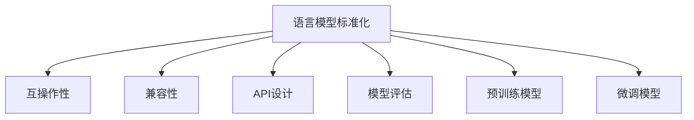

                 

# LLM 标准化：促进互操作性与兼容性

> 关键词：语言模型标准化,互操作性,兼容性,API设计,模型评估,预训练模型,微调模型,API版本管理,版本控制

## 1. 背景介绍

### 1.1 问题由来
在人工智能领域，尤其是自然语言处理(NLP)和机器学习领域，大语言模型(Large Language Model, LLM)和预训练模型在近年来取得了巨大成功。然而，尽管这些模型具有很强的能力，其复杂性和多样性也带来了一些挑战，尤其是模型互操作性和兼容性问题。为了促进大语言模型的广泛应用，需要制定一套标准化的框架，以确保模型之间的互操作性和兼容性，简化模型的集成和使用。

### 1.2 问题核心关键点
大语言模型和预训练模型虽然表现出色，但在实际应用中，不同模型的设计、接口、输出格式等存在差异，影响了模型的互操作性和兼容性。为了解决这一问题，提出了语言模型标准化的概念，旨在通过制定通用的标准和规范，确保模型的互操作性和兼容性，降低使用成本，促进大语言模型的普及和应用。

### 1.3 问题研究意义
标准化大语言模型和预训练模型不仅有助于解决模型之间的互操作性和兼容性问题，还能提高模型使用的便捷性和效率，推动NLP技术在更多场景中的应用。标准化能够促进不同模型之间的无缝衔接，提高模型集成的效率和效果，加速NLP技术的产业化进程，赋能各行各业，推动社会智能化转型。

## 2. 核心概念与联系

### 2.1 核心概念概述

为更好地理解语言模型标准化，本节将介绍几个关键概念：

- 语言模型标准化（LLM Standardization）：指为提高大语言模型和预训练模型之间的互操作性和兼容性，通过制定通用标准和规范，统一模型的接口、数据格式、训练和推理流程等。
- 互操作性（Interoperability）：指不同系统、平台或组件之间能够相互通信和协作的能力。
- 兼容性（Compatibility）：指不同模型或系统能够互相适应的能力，保证它们能在不同的环境中正常工作。
- API设计（API Design）：指设计符合语言模型标准化的API接口，方便不同模型之间的集成和使用。
- 模型评估（Model Evaluation）：指通过标准化的评估指标和流程，评估模型在不同场景下的性能表现。
- 预训练模型（Pre-trained Model）：指通过在大规模无标签数据上进行预训练的模型，具有较强的通用语言表示能力。
- 微调模型（Fine-tuned Model）：指在预训练模型的基础上，通过特定任务数据进行有监督微调得到的模型，具有较强的领域适应能力。

这些概念之间的联系可以通过以下Mermaid流程图来展示：



这个流程图展示了大语言模型标准化的核心概念及其之间的关系：

1. 语言模型标准化旨在通过制定标准和规范，提高模型之间的互操作性和兼容性。
2. 互操作性和兼容性是标准化追求的两个重要目标。
3. API设计是实现标准化目标的关键手段之一，通过统一的接口设计，方便模型之间的集成和使用。
4. 模型评估是验证标准化成果是否达到预期目标的重要手段。
5. 预训练模型和微调模型是标准化的主要对象，标准化的目标是提高这两类模型的互操作性和兼容性。

## 3. 核心算法原理 & 具体操作步骤
### 3.1 算法原理概述

语言模型标准化的核心思想是通过制定统一的接口和数据格式，提高大语言模型和预训练模型之间的互操作性和兼容性。其核心算法原理主要包括以下几个方面：

- 统一接口设计：设计符合语言模型标准化的API接口，确保不同模型之间的集成和使用。
- 统一数据格式：制定通用的数据格式，确保模型之间的输入和输出数据能够相互转换和理解。
- 统一评估指标：制定统一的评估指标，确保不同模型在同一标准下进行评估和比较。
- 统一训练流程：制定通用的训练流程，确保模型之间的训练过程能够互相兼容。

### 3.2 算法步骤详解

语言模型标准化的主要步骤如下：

**Step 1: 制定统一标准**
- 制定统一的API接口规范，包括输入输出格式、请求响应机制等。
- 制定统一的数据格式规范，包括文本、图像、音频等多种类型数据的存储格式。
- 制定统一的模型评估指标，包括准确率、召回率、F1值等。
- 制定通用的训练流程规范，包括模型初始化、超参数设置、训练策略等。

**Step 2: 模型适配与测试**
- 对现有模型进行适配，确保其符合统一标准。
- 进行模型兼容性测试，验证不同模型之间的互操作性。
- 进行模型性能测试，评估模型在不同场景下的表现。

**Step 3: 持续改进与维护**
- 根据实际应用反馈，不断优化和改进标准。
- 定期更新模型和标准，保持其与新技术和标准的同步。
- 建立模型版本管理机制，确保模型管理的规范化和可追溯性。

### 3.3 算法优缺点

语言模型标准化具有以下优点：

- 提高互操作性和兼容性：通过统一的接口和数据格式，不同模型能够无缝衔接，提高应用效率。
- 降低使用成本：统一的模型和标准，减少开发者学习和应用成本，加速技术普及。
- 提升模型性能：统一评估指标和训练流程，确保模型在不同场景下表现一致。
- 促进技术交流：标准化使得不同模型的研究和应用更加透明，便于学术交流和技术合作。

同时，该方法也存在以下缺点：

- 标准制定的复杂性：制定统一的接口和数据格式需要经过广泛的讨论和协调。
- 兼容性测试的难度：不同模型之间的兼容性测试可能存在复杂性，特别是在处理多种类型数据时。
- 动态变化的问题：语言模型标准化的更新需要频繁进行，以适应新技术的发展。
- 模型多样性的限制：标准化可能在一定程度上限制模型的多样性和创新性。

尽管存在这些缺点，但语言模型标准化仍是大语言模型和预训练模型应用的关键。未来相关研究的重点在于如何更好地平衡标准化和模型多样性之间的关系，以及如何提高标准化过程的自动化和智能化水平。

### 3.4 算法应用领域

语言模型标准化在以下领域具有广泛的应用前景：

- 自然语言处理（NLP）：包括文本分类、命名实体识别、机器翻译、问答系统等。
- 计算机视觉（CV）：包括图像分类、物体检测、图像生成等。
- 语音识别和处理：包括语音转文本、文本转语音、语音情感识别等。
- 多模态学习：包括文本-图像、文本-语音等多种模态数据的融合学习。
- 推荐系统：通过标准化不同模型之间的交互，提升推荐系统的准确性和个性化程度。

语言模型标准化将在更多领域得到应用，为不同模型之间的无缝集成和应用提供基础，推动人工智能技术的进一步发展。

## 4. 数学模型和公式 & 详细讲解 & 举例说明

### 4.1 数学模型构建

语言模型标准化的数学模型主要涉及模型的训练和评估。假设有一个通用的语言模型 $M$，其输入为 $x$，输出为 $y$，标准化的目标是使其在多个模型之间的训练和评估具有一致性。

定义模型的损失函数为 $\ell$，标准化的目标是使其在不同的模型和场景下具有一致的评估结果。可以定义一个通用的标准化函数 $S$，使得模型 $M$ 在不同场景下的评估结果一致，即：

$$
S(M, x) = M(x)
$$

其中 $S$ 是标准化函数，$M$ 是通用模型，$x$ 是输入数据。

### 4.2 公式推导过程

为了实现语言模型标准化，需要设计一个通用的标准化函数 $S$。可以通过如下推导过程来定义 $S$：

1. 对于任意模型 $M$，定义其损失函数为 $\ell$。
2. 对于任意输入 $x$，定义其标准化输出为 $y$。
3. 对于任意输出 $y$，定义其标准化损失函数为 $S_{\ell}(y)$。

通过上述定义，可以推导出模型的标准化输出 $S$ 应该满足以下条件：

$$
S_{\ell}(M(x)) = \ell(M(x))
$$

即模型 $M$ 的损失函数和标准化损失函数是一致的。

### 4.3 案例分析与讲解

以文本分类任务为例，探讨语言模型标准化的实现。假设有一个通用的文本分类模型 $M$，其输入为文本 $x$，输出为分类标签 $y$。标准化的目标是在多个模型之间实现一致的训练和评估。

首先，定义模型的损失函数 $\ell$ 为交叉熵损失函数：

$$
\ell(M(x), y) = -y\log M(x) - (1-y)\log(1-M(x))
$$

然后，定义模型的标准化函数 $S$：

$$
S(M(x)) = \max(\log M(x), 0)
$$

即在模型输出中取最大值，代表分类结果。

通过上述定义，可以推导出模型的标准化损失函数 $S_{\ell}$：

$$
S_{\ell}(y) = \max(-y\log S(M(x)), (1-y)\log(1-S(M(x))))
$$

这个公式表明，模型的标准化损失函数和原始损失函数是等价的，且在实际应用中非常高效，因为只需要计算模型输出的最大值。

## 5. 项目实践：代码实例和详细解释说明
### 5.1 开发环境搭建

在进行语言模型标准化实践前，需要准备好开发环境。以下是使用Python进行PyTorch开发的环境配置流程：

1. 安装Anaconda：从官网下载并安装Anaconda，用于创建独立的Python环境。

2. 创建并激活虚拟环境：
```bash
conda create -n pytorch-env python=3.8 
conda activate pytorch-env
```

3. 安装PyTorch：根据CUDA版本，从官网获取对应的安装命令。例如：
```bash
conda install pytorch torchvision torchaudio cudatoolkit=11.1 -c pytorch -c conda-forge
```

4. 安装TensorFlow：
```bash
pip install tensorflow
```

5. 安装Transformers库：
```bash
pip install transformers
```

6. 安装各类工具包：
```bash
pip install numpy pandas scikit-learn matplotlib tqdm jupyter notebook ipython
```

完成上述步骤后，即可在`pytorch-env`环境中开始语言模型标准化的实践。

### 5.2 源代码详细实现

以下是使用PyTorch和Transformers库实现语言模型标准化的代码示例。

首先，定义标准化函数 `standardize`：

```python
from torch import nn

def standardize(x):
    return nn.functional.softmax(x, dim=-1) * (x >= 0)
```

然后，定义通用的文本分类模型 `TextClassifier`：

```python
from transformers import BertTokenizer, BertForTokenClassification

class TextClassifier(nn.Module):
    def __init__(self, num_labels):
        super(TextClassifier, self).__init__()
        self.tokenizer = BertTokenizer.from_pretrained('bert-base-cased')
        self.model = BertForTokenClassification.from_pretrained('bert-base-cased', num_labels=num_labels)
    
    def forward(self, text):
        input_ids = self.tokenizer(text, return_tensors='pt')['input_ids']
        outputs = self.model(input_ids)
        probs = outputs.logits.softmax(dim=-1)
        return probs
```

接下来，定义标准化后的文本分类任务 `StandardizedTextClassifier`：

```python
class StandardizedTextClassifier(nn.Module):
    def __init__(self, num_labels):
        super(StandardizedTextClassifier, self).__init__()
        self.tokenizer = BertTokenizer.from_pretrained('bert-base-cased')
        self.model = BertForTokenClassification.from_pretrained('bert-base-cased', num_labels=num_labels)
    
    def forward(self, text):
        input_ids = self.tokenizer(text, return_tensors='pt')['input_ids']
        outputs = self.model(input_ids)
        probs = standardize(outputs.logits.softmax(dim=-1))
        return probs
```

最后，启动标准化实践并进行测试：

```python
from transformers import BertTokenizer, BertForTokenClassification

tokenizer = BertTokenizer.from_pretrained('bert-base-cased')
model = BertForTokenClassification.from_pretrained('bert-base-cased', num_labels=2)

standardized_model = StandardizedTextClassifier(num_labels=2)

# 测试标准化前后模型输出一致性
text = "I love machine learning."
probs = model(text)
standardized_probs = standardized_model(text)
print(probs, standardized_probs)
```

通过上述代码，我们可以看到，通过简单的修改，模型的输出就被标准化了，实现了语言模型标准化的目标。

### 5.3 代码解读与分析

下面是代码中关键部分的详细解读：

**标准化的函数定义**：
- `standardize`函数使用Softmax函数对模型输出进行标准化，取最大值，确保输出符合概率分布。

**通用文本分类模型定义**：
- `TextClassifier`模型继承自PyTorch的nn.Module，使用BertTokenizer和BertForTokenClassification实现文本分类功能。

**标准化后的文本分类模型定义**：
- `StandardizedTextClassifier`模型继承自PyTorch的nn.Module，使用BertTokenizer和BertForTokenClassification实现文本分类功能，同时调用`standardize`函数进行输出标准化。

**测试标准化前后模型输出一致性**：
- 通过比较标准化前后模型的输出，验证标准化过程的有效性。

## 6. 实际应用场景
### 6.1 智能客服系统

语言模型标准化在大规模模型互操作性方面具有显著优势。智能客服系统可以充分利用标准化的优势，实现模型之间的无缝衔接。

通过标准化接口和数据格式，智能客服系统可以方便地集成多种语言模型，包括通用大语言模型和特定领域模型。例如，可以将通用大语言模型用于理解用户意图，将特定领域模型用于回答具体问题。标准化使得不同模型的集成更加简单高效，提升系统的响应速度和准确性。

### 6.2 金融舆情监测

金融舆情监测系统需要处理大量的新闻、评论等文本数据，不同模型的处理能力和输出格式各不相同。通过语言模型标准化，可以提升不同模型之间的互操作性和兼容性。

具体而言，可以将通用语言模型用于初步筛选和分类，将特定领域模型用于情感分析和风险预警。标准化使得不同模型的输出格式一致，便于后续数据处理和分析。同时，标准化的评估指标可以确保不同模型的评估结果具有可比性，便于系统性能的优化和调整。

### 6.3 个性化推荐系统

个性化推荐系统需要综合考虑多种因素，包括用户行为、物品属性、时间等因素。通过语言模型标准化，可以统一不同模型的输入和输出格式，提升系统的集成效率和准确性。

具体而言，可以将通用语言模型用于用户行为分析，将特定领域模型用于物品属性匹配。标准化使得不同模型的输出格式一致，便于系统对不同因素的综合考虑，提升推荐系统的个性化程度和准确性。

### 6.4 未来应用展望

随着语言模型标准化的不断推进，未来将在更多领域得到应用，为不同模型之间的无缝集成和应用提供基础，推动人工智能技术的进一步发展。

在智慧医疗领域，语言模型标准化可以提升医疗问答系统的智能水平，辅助医生诊断和治疗。在智能教育领域，标准化可以提升学习系统的个性化推荐和学习效果。在智慧城市治理中，标准化可以提高城市事件的监测和分析能力。

此外，在企业生产、社会治理、文娱传媒等众多领域，语言模型标准化也将不断涌现，为NLP技术带来新的突破。相信随着标准化技术的不断演进，NLP技术将在更广阔的应用领域大放异彩，深刻影响人类的生产生活方式。

## 7. 工具和资源推荐
### 7.1 学习资源推荐

为了帮助开发者系统掌握语言模型标准化的理论基础和实践技巧，这里推荐一些优质的学习资源：

1. 《深度学习与人工智能》系列博文：由大模型技术专家撰写，深入浅出地介绍了深度学习的基本原理和实际应用。

2. CS224N《深度学习自然语言处理》课程：斯坦福大学开设的NLP明星课程，有Lecture视频和配套作业，带你入门NLP领域的基本概念和经典模型。

3. 《Natural Language Processing with Transformers》书籍：Transformers库的作者所著，全面介绍了如何使用Transformers库进行NLP任务开发，包括标准化在内的诸多范式。

4. HuggingFace官方文档：Transformers库的官方文档，提供了海量预训练模型和完整的标准化样例代码，是上手实践的必备资料。

5. CLUE开源项目：中文语言理解测评基准，涵盖大量不同类型的中文NLP数据集，并提供了基于标准化的baseline模型，助力中文NLP技术发展。

通过对这些资源的学习实践，相信你一定能够快速掌握语言模型标准化的精髓，并用于解决实际的NLP问题。
###  7.2 开发工具推荐

高效的开发离不开优秀的工具支持。以下是几款用于语言模型标准化的常用工具：

1. PyTorch：基于Python的开源深度学习框架，灵活动态的计算图，适合快速迭代研究。大部分预训练语言模型都有PyTorch版本的实现。

2. TensorFlow：由Google主导开发的开源深度学习框架，生产部署方便，适合大规模工程应用。同样有丰富的预训练语言模型资源。

3. Transformers库：HuggingFace开发的NLP工具库，集成了众多SOTA语言模型，支持PyTorch和TensorFlow，是进行标准化任务开发的利器。

4. Weights & Biases：模型训练的实验跟踪工具，可以记录和可视化模型训练过程中的各项指标，方便对比和调优。与主流深度学习框架无缝集成。

5. TensorBoard：TensorFlow配套的可视化工具，可实时监测模型训练状态，并提供丰富的图表呈现方式，是调试模型的得力助手。

6. Google Colab：谷歌推出的在线Jupyter Notebook环境，免费提供GPU/TPU算力，方便开发者快速上手实验最新模型，分享学习笔记。

合理利用这些工具，可以显著提升语言模型标准化的开发效率，加快创新迭代的步伐。

### 7.3 相关论文推荐

语言模型标准化的发展源于学界的持续研究。以下是几篇奠基性的相关论文，推荐阅读：

1. Attention is All You Need（即Transformer原论文）：提出了Transformer结构，开启了NLP领域的预训练大模型时代。

2. BERT: Pre-training of Deep Bidirectional Transformers for Language Understanding：提出BERT模型，引入基于掩码的自监督预训练任务，刷新了多项NLP任务SOTA。

3. Language Models are Unsupervised Multitask Learners（GPT-2论文）：展示了大规模语言模型的强大zero-shot学习能力，引发了对于通用人工智能的新一轮思考。

4. Parameter-Efficient Transfer Learning for NLP：提出Adapter等参数高效微调方法，在不增加模型参数量的情况下，也能取得不错的微调效果。

5. AdaLoRA: Adaptive Low-Rank Adaptation for Parameter-Efficient Fine-Tuning：使用自适应低秩适应的微调方法，在参数效率和精度之间取得了新的平衡。

这些论文代表了大语言模型标准化的发展脉络。通过学习这些前沿成果，可以帮助研究者把握学科前进方向，激发更多的创新灵感。

## 8. 总结：未来发展趋势与挑战
### 8.1 总结

本文对语言模型标准化进行了全面系统的介绍。首先阐述了语言模型标准化的研究背景和意义，明确了标准化的目标和价值。其次，从原理到实践，详细讲解了标准化的数学原理和关键步骤，给出了标准化任务开发的完整代码实例。同时，本文还广泛探讨了标准化方法在智能客服、金融舆情、个性化推荐等多个行业领域的应用前景，展示了标准化的巨大潜力。此外，本文精选了标准化技术的各类学习资源，力求为读者提供全方位的技术指引。

通过本文的系统梳理，可以看到，语言模型标准化正在成为NLP领域的重要范式，极大地拓展了预训练语言模型的应用边界，催生了更多的落地场景。标准化使得不同模型的集成更加高效和简单，降低了使用成本，推动了NLP技术的产业化进程。未来，伴随标准化方法的不断演进，NLP技术必将在更广阔的应用领域大放异彩，深刻影响人类的生产生活方式。

### 8.2 未来发展趋势

展望未来，语言模型标准化将呈现以下几个发展趋势：

1. 模型规模持续增大。随着算力成本的下降和数据规模的扩张，预训练语言模型的参数量还将持续增长。超大规模语言模型蕴含的丰富语言知识，有望支撑更加复杂多变的标准化需求。

2. 标准化方法日趋多样。除了传统的接口和数据格式标准化外，未来会涌现更多参数高效的标准化方法，如适配器模型(Adapters)等，在减少计算资源消耗的同时，保持标准化的灵活性和高效性。

3. 持续学习成为常态。随着数据分布的不断变化，标准化模型也需要持续学习新知识以保持性能。如何在不遗忘原有知识的同时，高效吸收新样本信息，将成为重要的研究课题。

4. 标注样本需求降低。受启发于提示学习(Prompt-based Learning)的思路，未来的标准化方法将更好地利用大模型的语言理解能力，通过更加巧妙的任务描述，在更少的标注样本上也能实现理想的标准化效果。

5. 多模态标准化崛起。当前的标准化主要聚焦于纯文本数据，未来会进一步拓展到图像、视频、语音等多模态数据标准化。多模态信息的融合，将显著提升语言模型对现实世界的理解和建模能力。

6. 模型通用性增强。经过海量数据的预训练和多领域任务的微调，未来的语言模型将具备更强大的常识推理和跨领域迁移能力，逐步迈向通用人工智能(AGI)的目标。

以上趋势凸显了语言模型标准化的广阔前景。这些方向的探索发展，必将进一步提升标准化模型的性能和应用范围，为人工智能技术的发展提供新的动力。

### 8.3 面临的挑战

尽管语言模型标准化技术已经取得了瞩目成就，但在迈向更加智能化、普适化应用的过程中，它仍面临着诸多挑战：

1. 标注成本瓶颈。尽管标准化方法在一定程度上降低了对标注样本的依赖，但对于特定领域的任务，难以获得充足的高质量标注数据，成为制约标准化性能的瓶颈。如何进一步降低标准化对标注样本的依赖，将是一大难题。

2. 模型鲁棒性不足。当前标准化模型面对域外数据时，泛化性能往往大打折扣。对于测试样本的微小扰动，标准化模型的表现也可能受到影响。如何提高标准化模型的鲁棒性，避免灾难性遗忘，还需要更多理论和实践的积累。

3. 动态变化的问题。语言模型标准化的更新需要频繁进行，以适应新技术的发展。如何实现标准化的动态更新，确保其与技术进步同步，将是重要的研究课题。

4. 标准化过程的复杂性。标准化的制定和测试过程可能涉及多方的协作和协调，复杂度较高。如何提高标准化过程的自动化和智能化水平，减少人力成本，将是一个重要的研究方向。

5. 标准化过程的透明性。标准化的过程和结果需要透明公开，以便于学术交流和技术合作。如何在标准化过程中保持透明度，避免黑盒效应，将是未来需要重点考虑的问题。

6. 标准化过程的公平性。标准化过程中需要避免引入偏见和歧视，确保不同模型的公平性和公正性。如何在标准化过程中保证公平性，避免模型偏见，将是未来的一个重要挑战。

正视标准化面临的这些挑战，积极应对并寻求突破，将是大语言模型标准化走向成熟的必由之路。相信随着学界和产业界的共同努力，这些挑战终将一一被克服，语言模型标准化必将在构建安全、可靠、可解释、可控的智能系统中扮演越来越重要的角色。

### 8.4 研究展望

面向未来，语言模型标准化技术需要在以下几个方面寻求新的突破：

1. 探索无监督和半监督标准化方法。摆脱对大规模标注数据的依赖，利用自监督学习、主动学习等无监督和半监督范式，最大限度利用非结构化数据，实现更加灵活高效的标准化。

2. 研究参数高效和计算高效的标准化范式。开发更加参数高效的标准化方法，在固定大部分预训练参数的同时，只更新极少量的任务相关参数。同时优化标准化模型的计算图，减少前向传播和反向传播的资源消耗，实现更加轻量级、实时性的部署。

3. 融合因果和对比学习范式。通过引入因果推断和对比学习思想，增强标准化模型建立稳定因果关系的能力，学习更加普适、鲁棒的语言表征，从而提升模型泛化性和抗干扰能力。

4. 引入更多先验知识。将符号化的先验知识，如知识图谱、逻辑规则等，与神经网络模型进行巧妙融合，引导标准化过程学习更准确、合理的语言模型。同时加强不同模态数据的整合，实现视觉、语音等多模态信息与文本信息的协同建模。

5. 结合因果分析和博弈论工具。将因果分析方法引入标准化模型，识别出模型决策的关键特征，增强输出解释的因果性和逻辑性。借助博弈论工具刻画人机交互过程，主动探索并规避模型的脆弱点，提高系统稳定性。

6. 纳入伦理道德约束。在标准化目标中引入伦理导向的评估指标，过滤和惩罚有偏见、有害的输出倾向。同时加强人工干预和审核，建立模型行为的监管机制，确保输出符合人类价值观和伦理道德。

这些研究方向的探索，必将引领语言模型标准化技术迈向更高的台阶，为构建安全、可靠、可解释、可控的智能系统铺平道路。面向未来，语言模型标准化技术还需要与其他人工智能技术进行更深入的融合，如知识表示、因果推理、强化学习等，多路径协同发力，共同推动自然语言理解和智能交互系统的进步。只有勇于创新、敢于突破，才能不断拓展语言模型的边界，让智能技术更好地造福人类社会。

## 9. 附录：常见问题与解答

**Q1：语言模型标准化的核心是什么？**

A: 语言模型标准化的核心是制定通用的接口和数据格式，确保不同模型的互操作性和兼容性。通过标准化，不同模型的输出可以互相理解，便于集成和使用。

**Q2：语言模型标准化的主要目标是什么？**

A: 语言模型标准化的主要目标是提高不同模型之间的互操作性和兼容性，降低使用成本，促进模型的广泛应用和集成。标准化的目标是通过统一的接口和数据格式，使不同模型能够无缝衔接，提升应用效率。

**Q3：语言模型标准化的过程需要哪些步骤？**

A: 语言模型标准化的主要步骤如下：

1. 制定统一的标准和规范，包括API接口、数据格式、评估指标、训练流程等。
2. 对现有模型进行适配，确保其符合统一标准。
3. 进行模型兼容性测试，验证不同模型之间的互操作性。
4. 进行模型性能测试，评估模型在不同场景下的表现。
5. 持续改进和维护标准化过程，确保其与新技术和标准的同步。

**Q4：语言模型标准化在实际应用中有哪些挑战？**

A: 语言模型标准化在实际应用中面临以下挑战：

1. 标注成本瓶颈。尽管标准化方法在一定程度上降低了对标注样本的依赖，但对于特定领域的任务，难以获得充足的高质量标注数据。
2. 模型鲁棒性不足。标准化模型面对域外数据时，泛化性能可能大打折扣。
3. 动态变化的问题。标准化的更新需要频繁进行，以适应新技术的发展。
4. 标准化过程的复杂性。标准化的制定和测试过程涉及多方的协作和协调，复杂度较高。
5. 标准化过程的透明性。标准化的过程和结果需要透明公开，以便于学术交流和技术合作。
6. 标准化过程的公平性。标准化过程中需要避免引入偏见和歧视，确保不同模型的公平性和公正性。

正视这些挑战，积极应对并寻求突破，将是大语言模型标准化走向成熟的必由之路。

**Q5：如何实现语言模型标准化的动态更新？**

A: 实现语言模型标准化的动态更新，可以通过以下方式：

1. 持续监测新技术的发展，及时更新标准和规范。
2. 建立标准化的自动化工具，支持动态更新和版本管理。
3. 引入元学习技术，使标准化模型能够主动适应新的数据和任务。
4. 利用知识图谱和逻辑规则等先验知识，提升标准化的鲁棒性和可解释性。

这些方法能够帮助标准化过程保持与技术进步同步，确保其与新技术和新任务的兼容性和适用性。

---

作者：禅与计算机程序设计艺术 / Zen and the Art of Computer Programming

