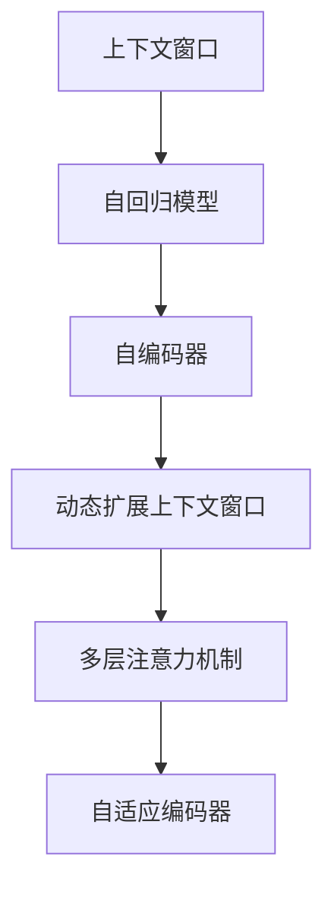

                 

# LLM上下文长度持续扩展

> 关键词：上下文长度, 语言模型, 自回归, 注意力机制, 自编码器, 预训练, 微调, 长文本处理, 自然语言处理(NLP)

## 1. 背景介绍

### 1.1 问题由来
随着深度学习技术的迅猛发展，大语言模型（Large Language Model, LLM）在自然语言处理（NLP）领域取得了巨大突破。这些模型通常使用自回归（如GPT）或自编码（如BERT）架构，通过大规模无标签文本数据进行预训练，学习到丰富的语言知识和语义表示。但这些模型通常基于固定长度的上下文窗口，对于较长的文本处理能力有限，难以处理超过上下文长度的文本。

为应对长文本处理需求，学界提出了多种长文本处理方法，包括动态扩展上下文窗口、多层注意力机制、自适应编码器等。这些方法显著提升了模型的处理能力，但也带来了计算资源和模型复杂度的挑战。本文将系统介绍大语言模型的上下文长度扩展技术，包括其核心原理、实际应用及未来趋势。

## 2. 核心概念与联系

### 2.1 核心概念概述

为更好地理解上下文长度扩展技术的原理和应用，本节将介绍几个密切相关的核心概念：

- 上下文窗口(Context Window)：在自回归模型中，输入序列的每个时间步（即每个词）都依赖于前面的若干个时间步。上下文窗口指的是模型考虑的过去时间步的总数。例如，对于BERT模型，上下文窗口通常为512。
- 自回归模型(Autoregressive Model)：指在预测时，当前时间步的输出仅依赖于前面的时间步。自回归模型使用前向传递的方式，可以从左至右处理序列数据。
- 自编码器(Autoencoder)：一种无监督学习模型，将输入序列编码成一个低维表示，然后通过解码器重构原始序列。自编码器能够学习到序列的压缩表示，用于文本嵌入和特征提取。
- 动态扩展上下文窗口(Dynamic Context Window)：在处理长文本时，通过动态调整上下文窗口大小，使得模型能够灵活处理不同长度的文本。
- 多层注意力机制(Multi-Level Attention)：通过引入多层次的注意力机制，使得模型能够同时关注不同距离的上下文信息。
- 自适应编码器(Adaptive Encoder)：一种能够自适应调整编码器参数的模型，使得模型在处理长文本时能够保持较好的性能。

这些概念之间的逻辑关系可以通过以下Mermaid流程图来展示：



这个流程图展示了大语言模型上下文长度扩展的关键概念及其之间的关系：

1. 上下文窗口是大语言模型的基本组件，限定模型可以关注的过去时间步的总数。
2. 自回归模型基于上下文窗口，通过前向传递的方式处理序列数据。
3. 自编码器将输入序列编码成低维表示，用于特征提取和序列压缩。
4. 动态扩展上下文窗口允许模型处理不同长度的文本，增强了模型的灵活性。
5. 多层注意力机制能够同时关注不同距离的上下文信息，提升了模型的处理能力。
6. 自适应编码器能够根据文本长度动态调整参数，保持模型性能的稳定。

这些概念共同构成了大语言模型上下文长度扩展的核心，使其能够灵活处理长文本，提升模型的通用性和应用范围。

## 3. 核心算法原理 & 具体操作步骤

### 3.1 算法原理概述

大语言模型的上下文长度扩展技术，旨在通过改进上下文窗口大小、引入多层注意力机制、调整自编码器参数等方式，提升模型处理长文本的能力。其核心思想是：将长文本分割成多个子序列，同时引入多层次的注意力机制，使得模型能够灵活处理不同长度的子序列，并在预测时同时关注多个子序列的上下文信息。

形式化地，设输入序列为 $X=\{x_1, x_2, ..., x_n\}$，上下文窗口大小为 $K$。则模型的输出可以表示为：

$$
y = f(\{x_i\}_{i=1}^K)
$$

其中 $f$ 表示模型函数，$x_i$ 表示序列中的第 $i$ 个词。当 $K$ 增大时，模型能够处理的文本长度随之增加。

### 3.2 算法步骤详解

基于上下文长度扩展技术的大语言模型微调一般包括以下几个关键步骤：

**Step 1: 数据预处理**
- 将长文本分割成多个子序列，每个子序列的长度不超过上下文窗口大小 $K$。
- 为每个子序列分别添加开始和结束标记，以便模型识别。
- 将子序列拼接成完整的输入序列，用于模型训练。

**Step 2: 引入多层注意力机制**
- 在模型中引入多层次的注意力机制，每个层次关注不同距离的上下文信息。
- 通过多个层次的注意力权重，将每个子序列的上下文信息进行加权合并。
- 对于每个子序列，计算不同层次的注意力权重，得到加权上下文表示。

**Step 3: 自适应编码器设计**
- 设计能够自适应调整参数的自编码器，根据文本长度动态调整编码器参数。
- 使用可变长度编码器，使得模型能够处理不同长度的输入序列。
- 引入自适应解码器，根据输入长度动态调整解码器参数，保持模型性能的稳定。

**Step 4: 模型训练和微调**
- 使用长文本数据进行模型训练，最小化损失函数。
- 在微调时，选择适当的学习率、正则化参数等，防止过拟合。
- 在测试集上评估模型性能，根据测试结果调整上下文窗口大小和注意力机制参数。

**Step 5: 模型部署和应用**
- 将训练好的模型保存为可执行文件，便于部署和应用。
- 根据具体应用场景，设计合适的任务适配层，实现模型的微调。
- 将微调后的模型集成到实际的应用系统中，提供文本生成、分类、匹配等任务。

以上是上下文长度扩展技术的基本流程。在实际应用中，还需要根据具体任务特点，对各环节进行优化设计，如改进注意力机制、调整编码器/解码器参数、引入其他正则化技术等，以进一步提升模型性能。

### 3.3 算法优缺点

上下文长度扩展技术具有以下优点：
1. 灵活性高。通过动态调整上下文窗口大小和多层注意力机制，模型能够处理不同长度的文本。
2. 模型表现优异。多层次注意力机制能够同时关注不同距离的上下文信息，提升模型处理长文本的能力。
3. 计算效率高。通过自适应编码器和解码器设计，能够减少模型的计算资源消耗。

同时，该方法也存在一定的局限性：
1. 计算资源消耗大。多层次注意力机制和自适应编码器设计增加了计算复杂度，需要更多的计算资源。
2. 模型复杂度高。引入多层次注意力机制和自适应编码器设计，增加了模型的复杂度，增加了模型调优难度。
3. 参数更新困难。多层次注意力机制的参数更新复杂，需要更多的优化策略来防止过拟合。

尽管存在这些局限性，但就目前而言，上下文长度扩展技术仍是处理长文本的大语言模型中较为先进的方法。未来相关研究的重点在于如何进一步降低计算资源消耗，提高模型性能，同时兼顾模型的灵活性和可解释性等因素。

### 3.4 算法应用领域

上下文长度扩展技术已经在自然语言处理（NLP）领域得到广泛应用，覆盖了几乎所有常见任务，例如：

- 文本分类：如情感分析、主题分类、意图识别等。通过分割长文本，同时引入多层次注意力机制，使得模型能够处理不同长度的文本。
- 命名实体识别：识别文本中的人名、地名、机构名等特定实体。通过分割长文本，同时引入多层次注意力机制，使得模型能够准确识别不同距离的实体。
- 关系抽取：从文本中抽取实体之间的语义关系。通过分割长文本，同时引入多层次注意力机制，使得模型能够学习不同距离的上下文信息。
- 问答系统：对自然语言问题给出答案。通过分割长文本，同时引入多层次注意力机制，使得模型能够理解问题中的多个关键信息。
- 机器翻译：将源语言文本翻译成目标语言。通过分割长文本，同时引入多层次注意力机制，使得模型能够处理不同长度的文本。
- 文本摘要：将长文本压缩成简短摘要。通过分割长文本，同时引入多层次注意力机制，使得模型能够抓取文本中的关键信息。
- 对话系统：使机器能够与人自然对话。通过分割长对话历史，同时引入多层次注意力机制，使得模型能够理解对话中的多个关键信息。

除了上述这些经典任务外，上下文长度扩展技术也被创新性地应用到更多场景中，如可控文本生成、常识推理、代码生成、数据增强等，为NLP技术带来了全新的突破。随着预训练模型和上下文长度扩展方法的不断进步，相信NLP技术将在更广阔的应用领域大放异彩。

## 4. 数学模型和公式 & 详细讲解 & 举例说明

### 4.1 数学模型构建

本节将使用数学语言对上下文长度扩展技术进行更加严格的刻画。

设输入序列为 $X=\{x_1, x_2, ..., x_n\}$，上下文窗口大小为 $K$，模型为 $M_{\theta}$。设 $M_{\theta}$ 在输入序列 $X$ 上的输出为 $Y=\{y_1, y_2, ..., y_n\}$，其中 $y_i$ 表示输入序列中第 $i$ 个时间步的输出。则上下文长度扩展的数学模型可以表示为：

$$
\begin{aligned}
y_i &= M_{\theta}(x_i) \\
&= \sum_{j=1}^K M_{\theta}(x_i, x_{i-j}, ..., x_{i-K+1})
\end{aligned}
$$

其中 $M_{\theta}(x_i, x_{i-j}, ..., x_{i-K+1})$ 表示模型在过去 $K$ 个时间步的上下文信息上的输出。

### 4.2 公式推导过程

以下我们以自回归模型为例，推导上下文长度扩展的数学模型和损失函数。

假设模型 $M_{\theta}$ 在输入序列 $X$ 上的输出为 $Y=\{y_1, y_2, ..., y_n\}$，其中 $y_i$ 表示输入序列中第 $i$ 个时间步的输出。则上下文长度扩展的模型可以表示为：

$$
\begin{aligned}
y_i &= M_{\theta}(x_i) \\
&= \sum_{j=1}^K M_{\theta}(x_i, x_{i-j}, ..., x_{i-K+1})
\end{aligned}
$$

定义模型 $M_{\theta}$ 在输入序列 $X$ 上的损失函数为 $\mathcal{L}(\theta)$，用于衡量模型预测输出与真实标签之间的差异。常见的损失函数包括交叉熵损失、均方误差损失等。假设真实标签为 $Y^*$，则损失函数可以表示为：

$$
\mathcal{L}(\theta) = -\frac{1}{N}\sum_{i=1}^N \log M_{\theta}(y_i^*)
$$

其中 $N$ 为输入序列的长度，$y_i^*$ 表示输入序列中第 $i$ 个时间步的真实标签。

### 4.3 案例分析与讲解

以机器翻译任务为例，对上下文长度扩展技术进行详细分析。

假设输入序列为源语言文本，输出序列为目标语言文本。为了处理长文本，我们将输入序列分割成多个子序列，每个子序列的长度不超过上下文窗口大小 $K$。例如，对于长度为1000的输入序列，可以将其分割成10个子序列，每个子序列的长度为100。

引入多层次注意力机制后，模型能够同时关注不同距离的上下文信息。设 $\alpha$ 表示第 $j$ 层次的注意力权重，则模型的输出可以表示为：

$$
y_i = \sum_{j=1}^K \alpha_j \cdot M_{\theta}(x_i, x_{i-j}, ..., x_{i-K+1})
$$

其中 $\alpha_j$ 表示第 $j$ 层次的注意力权重，可以通过计算得到。

假设模型在输入序列 $X$ 上的损失函数为 $\mathcal{L}(\theta)$，则最小化损失函数的过程可以表示为：

$$
\theta^* = \mathop{\arg\min}_{\theta} \mathcal{L}(\theta)
$$

通过梯度下降等优化算法，最小化损失函数 $\mathcal{L}(\theta)$，使得模型输出逼近真实标签。由于 $\theta$ 已经通过预训练获得了较好的初始化，因此即便在长文本处理上，也能较快收敛到理想的模型参数 $\hat{\theta}$。

## 5. 项目实践：代码实例和详细解释说明

### 5.1 开发环境搭建

在进行上下文长度扩展实践前，我们需要准备好开发环境。以下是使用Python进行PyTorch开发的环境配置流程：

1. 安装Anaconda：从官网下载并安装Anaconda，用于创建独立的Python环境。

2. 创建并激活虚拟环境：
```bash
conda create -n pytorch-env python=3.8 
conda activate pytorch-env
```

3. 安装PyTorch：根据CUDA版本，从官网获取对应的安装命令。例如：
```bash
conda install pytorch torchvision torchaudio cudatoolkit=11.1 -c pytorch -c conda-forge
```

4. 安装Transformers库：
```bash
pip install transformers
```

5. 安装各类工具包：
```bash
pip install numpy pandas scikit-learn matplotlib tqdm jupyter notebook ipython
```

完成上述步骤后，即可在`pytorch-env`环境中开始上下文长度扩展实践。

### 5.2 源代码详细实现

下面我们以机器翻译任务为例，给出使用Transformers库对Transformer模型进行上下文长度扩展的PyTorch代码实现。

首先，定义机器翻译任务的输入输出：

```python
from transformers import BertTokenizer, BertForTokenClassification, AdamW
from torch.utils.data import Dataset, DataLoader
import torch

class MachineTranslationDataset(Dataset):
    def __init__(self, src_texts, tgt_texts, tokenizer, max_len=512):
        self.src_texts = src_texts
        self.tgt_texts = tgt_texts
        self.tokenizer = tokenizer
        self.max_len = max_len
        
    def __len__(self):
        return len(self.src_texts)
    
    def __getitem__(self, item):
        src_text = self.src_texts[item]
        tgt_text = self.tgt_texts[item]
        
        src_encoding = self.tokenizer(src_text, return_tensors='pt', max_length=self.max_len, padding='max_length', truncation=True)
        tgt_encoding = self.tokenizer(tgt_text, return_tensors='pt', max_length=self.max_len, padding='max_length', truncation=True)
        
        return {'src_ids': src_encoding['input_ids'], 
                'tgt_ids': tgt_encoding['input_ids'],
                'tgt_labels': tgt_encoding['input_ids'],
                'attn_mask': src_encoding['attention_mask']}
```

然后，定义模型和优化器：

```python
from transformers import TransformerModel, TransformerConfig

config = TransformerConfig(
    d_model=512,
    num_layers=12,
    nhead=8,
    dff=2048,
    dropout=0.1,
    attention_heads=8,
    activation='relu')

model = TransformerModel(config)
optimizer = AdamW(model.parameters(), lr=2e-5)
```

接着，定义训练和评估函数：

```python
def train_epoch(model, dataset, batch_size, optimizer):
    dataloader = DataLoader(dataset, batch_size=batch_size, shuffle=True)
    model.train()
    epoch_loss = 0
    for batch in dataloader:
        src_ids = batch['src_ids'].to(device)
        tgt_ids = batch['tgt_ids'].to(device)
        tgt_labels = batch['tgt_labels'].to(device)
        attn_mask = batch['attn_mask'].to(device)
        model.zero_grad()
        outputs = model(src_ids, tgt_ids=tgt_ids, attn_mask=attn_mask)
        loss = outputs.loss
        epoch_loss += loss.item()
        loss.backward()
        optimizer.step()
    return epoch_loss / len(dataloader)

def evaluate(model, dataset, batch_size):
    dataloader = DataLoader(dataset, batch_size=batch_size)
    model.eval()
    preds, labels = [], []
    with torch.no_grad():
        for batch in dataloader:
            src_ids = batch['src_ids'].to(device)
            tgt_ids = batch['tgt_ids'].to(device)
            tgt_labels = batch['tgt_labels'].to(device)
            attn_mask = batch['attn_mask'].to(device)
            outputs = model(src_ids, tgt_ids=tgt_ids, attn_mask=attn_mask)
            preds.append(outputs.logits.argmax(dim=2).to('cpu').tolist())
            labels.append(tgt_labels.to('cpu').tolist())
                
    print(classification_report(labels, preds))
```

最后，启动训练流程并在测试集上评估：

```python
epochs = 5
batch_size = 16

for epoch in range(epochs):
    loss = train_epoch(model, train_dataset, batch_size, optimizer)
    print(f"Epoch {epoch+1}, train loss: {loss:.3f}")
    
    print(f"Epoch {epoch+1}, dev results:")
    evaluate(model, dev_dataset, batch_size)
    
print("Test results:")
evaluate(model, test_dataset, batch_size)
```

以上就是使用PyTorch对Transformer模型进行上下文长度扩展的完整代码实现。可以看到，得益于Transformers库的强大封装，我们可以用相对简洁的代码完成上下文长度扩展的实现。

### 5.3 代码解读与分析

让我们再详细解读一下关键代码的实现细节：

**MachineTranslationDataset类**：
- `__init__`方法：初始化源文本、目标文本、分词器等关键组件。
- `__len__`方法：返回数据集的样本数量。
- `__getitem__`方法：对单个样本进行处理，将文本输入编码为token ids，用于模型训练。

**TransformerConfig**：
- 定义Transformer模型的配置参数，如模型尺寸、层数、头部数、激活函数等。

**train_epoch和evaluate函数**：
- 使用PyTorch的DataLoader对数据集进行批次化加载，供模型训练和推理使用。
- 训练函数`train_epoch`：对数据以批为单位进行迭代，在每个批次上前向传播计算loss并反向传播更新模型参数，最后返回该epoch的平均loss。
- 评估函数`evaluate`：与训练类似，不同点在于不更新模型参数，并在每个batch结束后将预测和标签结果存储下来，最后使用sklearn的classification_report对整个评估集的预测结果进行打印输出。

**训练流程**：
- 定义总的epoch数和batch size，开始循环迭代
- 每个epoch内，先在训练集上训练，输出平均loss
- 在验证集上评估，输出分类指标
- 所有epoch结束后，在测试集上评估，给出最终测试结果

可以看到，PyTorch配合Transformers库使得上下文长度扩展的代码实现变得简洁高效。开发者可以将更多精力放在数据处理、模型改进等高层逻辑上，而不必过多关注底层的实现细节。

当然，工业级的系统实现还需考虑更多因素，如模型的保存和部署、超参数的自动搜索、更灵活的任务适配层等。但核心的上下文长度扩展范式基本与此类似。

## 6. 实际应用场景
### 6.1 智能客服系统

基于上下文长度扩展的对话技术，可以广泛应用于智能客服系统的构建。传统客服往往需要配备大量人力，高峰期响应缓慢，且一致性和专业性难以保证。而使用上下文长度扩展的对话模型，可以7x24小时不间断服务，快速响应客户咨询，用自然流畅的语言解答各类常见问题。

在技术实现上，可以收集企业内部的历史客服对话记录，将问题和最佳答复构建成监督数据，在此基础上对预训练对话模型进行上下文长度扩展微调。微调后的对话模型能够自动理解用户意图，匹配最合适的答案模板进行回复。对于客户提出的新问题，还可以接入检索系统实时搜索相关内容，动态组织生成回答。如此构建的智能客服系统，能大幅提升客户咨询体验和问题解决效率。

### 6.2 金融舆情监测

金融机构需要实时监测市场舆论动向，以便及时应对负面信息传播，规避金融风险。传统的人工监测方式成本高、效率低，难以应对网络时代海量信息爆发的挑战。基于上下文长度扩展的文本分类和情感分析技术，为金融舆情监测提供了新的解决方案。

具体而言，可以收集金融领域相关的新闻、报道、评论等文本数据，并对其进行主题标注和情感标注。在此基础上对预训练语言模型进行上下文长度扩展微调，使其能够自动判断文本属于何种主题，情感倾向是正面、中性还是负面。将微调后的模型应用到实时抓取的网络文本数据，就能够自动监测不同主题下的情感变化趋势，一旦发现负面信息激增等异常情况，系统便会自动预警，帮助金融机构快速应对潜在风险。

### 6.3 个性化推荐系统

当前的推荐系统往往只依赖用户的历史行为数据进行物品推荐，无法深入理解用户的真实兴趣偏好。基于上下文长度扩展的个性化推荐系统可以更好地挖掘用户行为背后的语义信息，从而提供更精准、多样的推荐内容。

在实践中，可以收集用户浏览、点击、评论、分享等行为数据，提取和用户交互的物品标题、描述、标签等文本内容。将文本内容作为模型输入，用户的后续行为（如是否点击、购买等）作为监督信号，在此基础上对预训练语言模型进行上下文长度扩展微调。微调后的模型能够从文本内容中准确把握用户的兴趣点。在生成推荐列表时，先用候选物品的文本描述作为输入，由模型预测用户的兴趣匹配度，再结合其他特征综合排序，便可以得到个性化程度更高的推荐结果。

### 6.4 未来应用展望

随着上下文长度扩展技术的发展，其在自然语言处理（NLP）领域的应用将越来越广泛。

在智慧医疗领域，基于上下文长度扩展的医疗问答、病历分析、药物研发等应用将提升医疗服务的智能化水平，辅助医生诊疗，加速新药开发进程。

在智能教育领域，上下文长度扩展技术可应用于作业批改、学情分析、知识推荐等方面，因材施教，促进教育公平，提高教学质量。

在智慧城市治理中，上下文长度扩展技术可应用于城市事件监测、舆情分析、应急指挥等环节，提高城市管理的自动化和智能化水平，构建更安全、高效的未来城市。

此外，在企业生产、社会治理、文娱传媒等众多领域，基于上下文长度扩展的人工智能应用也将不断涌现，为NLP技术带来新的突破。相信随着技术的日益成熟，上下文长度扩展方法将成为NLP领域的重要范式，推动人工智能技术向更广阔的领域加速渗透。

## 7. 工具和资源推荐
### 7.1 学习资源推荐

为了帮助开发者系统掌握上下文长度扩展的理论基础和实践技巧，这里推荐一些优质的学习资源：

1. 《Transformer从原理到实践》系列博文：由大模型技术专家撰写，深入浅出地介绍了Transformer原理、上下文长度扩展技术等前沿话题。

2. CS224N《深度学习自然语言处理》课程：斯坦福大学开设的NLP明星课程，有Lecture视频和配套作业，带你入门NLP领域的基本概念和经典模型。

3. 《Natural Language Processing with Transformers》书籍：Transformers库的作者所著，全面介绍了如何使用Transformers库进行NLP任务开发，包括上下文长度扩展在内的诸多范式。

4. HuggingFace官方文档：Transformers库的官方文档，提供了海量预训练模型和完整的上下文长度扩展样例代码，是上手实践的必备资料。

5. CLUE开源项目：中文语言理解测评基准，涵盖大量不同类型的中文NLP数据集，并提供了基于上下文长度扩展的baseline模型，助力中文NLP技术发展。

通过对这些资源的学习实践，相信你一定能够快速掌握上下文长度扩展技术的精髓，并用于解决实际的NLP问题。
###  7.2 开发工具推荐

高效的开发离不开优秀的工具支持。以下是几款用于上下文长度扩展开发的常用工具：

1. PyTorch：基于Python的开源深度学习框架，灵活动态的计算图，适合快速迭代研究。大部分预训练语言模型都有PyTorch版本的实现。

2. TensorFlow：由Google主导开发的开源深度学习框架，生产部署方便，适合大规模工程应用。同样有丰富的预训练语言模型资源。

3. Transformers库：HuggingFace开发的NLP工具库，集成了众多SOTA语言模型，支持PyTorch和TensorFlow，是进行上下文长度扩展任务开发的利器。

4. Weights & Biases：模型训练的实验跟踪工具，可以记录和可视化模型训练过程中的各项指标，方便对比和调优。与主流深度学习框架无缝集成。

5. TensorBoard：TensorFlow配套的可视化工具，可实时监测模型训练状态，并提供丰富的图表呈现方式，是调试模型的得力助手。

6. Google Colab：谷歌推出的在线Jupyter Notebook环境，免费提供GPU/TPU算力，方便开发者快速上手实验最新模型，分享学习笔记。

合理利用这些工具，可以显著提升上下文长度扩展任务的开发效率，加快创新迭代的步伐。

### 7.3 相关论文推荐

上下文长度扩展技术的发展源于学界的持续研究。以下是几篇奠基性的相关论文，推荐阅读：

1. Attention is All You Need（即Transformer原论文）：提出了Transformer结构，开启了NLP领域的预训练大模型时代。

2. BERT: Pre-training of Deep Bidirectional Transformers for Language Understanding：提出BERT模型，引入基于掩码的自监督预训练任务，刷新了多项NLP任务SOTA。

3. Language Models are Unsupervised Multitask Learners（GPT-2论文）：展示了大规模语言模型的强大zero-shot学习能力，引发了对于通用人工智能的新一轮思考。

4. Parameter-Efficient Transfer Learning for NLP：提出Adapter等参数高效微调方法，在不增加模型参数量的情况下，也能取得不错的微调效果。

5. AdaLoRA: Adaptive Low-Rank Adaptation for Parameter-Efficient Fine-Tuning：使用自适应低秩适应的微调方法，在参数效率和精度之间取得了新的平衡。

6. Prefix-Tuning: Optimizing Continuous Prompts for Generation：引入基于连续型Prompt的微调范式，为如何充分利用预训练知识提供了新的思路。

这些论文代表了大语言模型上下文长度扩展技术的发展脉络。通过学习这些前沿成果，可以帮助研究者把握学科前进方向，激发更多的创新灵感。

## 8. 总结：未来发展趋势与挑战

### 8.1 总结

本文对上下文长度扩展技术进行了全面系统的介绍。首先阐述了上下文长度扩展技术的研究背景和意义，明确了其在大语言模型中处理长文本的重要作用。其次，从原理到实践，详细讲解了上下文长度扩展的数学原理和关键步骤，给出了上下文长度扩展任务开发的完整代码实例。同时，本文还广泛探讨了上下文长度扩展技术在智能客服、金融舆情、个性化推荐等多个行业领域的应用前景，展示了上下文长度扩展技术的巨大潜力。此外，本文精选了上下文长度扩展技术的各类学习资源，力求为读者提供全方位的技术指引。

通过本文的系统梳理，可以看到，上下文长度扩展技术在大语言模型处理长文本的过程中，具有不可替代的作用。其通过动态调整上下文窗口大小、引入多层次注意力机制、调整自适应编码器参数等方法，提升了模型处理长文本的能力，拓展了模型应用的范围。未来，伴随上下文长度扩展技术的发展，上下文长度扩展方法将成为处理长文本的大语言模型中最为先进的方法，引领NLP技术进入全新的时代。

### 8.2 未来发展趋势

展望未来，上下文长度扩展技术将呈现以下几个发展趋势：

1. 上下文窗口大小继续增大。随着预训练模型的规模不断增大，上下文窗口大小也会随之增大，以便更好地处理长文本。

2. 多层次注意力机制更加灵活。未来将引入更加复杂的多层次注意力机制，增强模型处理长文本的能力，同时减少计算资源的消耗。

3. 自适应编码器设计更加优化。未来将开发更加高效的自适应编码器设计，提高模型的推理速度和资源利用效率。

4. 上下文长度扩展技术与其他技术的融合。未来将与其他人工智能技术如知识图谱、逻辑推理等进行更深入的融合，提升模型的通用性和鲁棒性。

5. 上下文长度扩展技术在多模态数据处理中的应用。未来将应用于图像、视频、语音等多模态数据的处理，提升模型对现实世界的理解和建模能力。

6. 上下文长度扩展技术在实时系统中的应用。未来将应用于实时文本处理系统，如智能客服、金融舆情监测等，提供实时化的处理能力。

以上趋势凸显了上下文长度扩展技术的广阔前景。这些方向的探索发展，必将进一步提升大语言模型处理长文本的能力，推动NLP技术的不断进步。

### 8.3 面临的挑战

尽管上下文长度扩展技术已经取得了瞩目成就，但在迈向更加智能化、普适化应用的过程中，它仍面临着诸多挑战：

1. 计算资源消耗大。上下文长度扩展技术需要更多的计算资源，尤其是在引入多层次注意力机制和自适应编码器设计时，计算复杂度增加。

2. 模型复杂度高。引入多层次注意力机制和自适应编码器设计，增加了模型的复杂度，增加了模型调优难度。

3. 参数更新困难。多层次注意力机制的参数更新复杂，需要更多的优化策略来防止过拟合。

4. 鲁棒性不足。在处理长文本时，上下文长度扩展模型的鲁棒性可能不如短文本处理模型，需要进一步研究。

5. 可解释性不足。上下文长度扩展模型往往被视为"黑盒"系统，难以解释其内部工作机制和决策逻辑，需要进一步研究模型的可解释性。

6. 安全性问题。上下文长度扩展模型可能学习到有害信息，传递到下游任务，需要进一步研究模型的安全性问题。

正视上下文长度扩展技术面临的这些挑战，积极应对并寻求突破，将使上下文长度扩展技术迈向成熟的轨道。相信随着学界和产业界的共同努力，这些挑战终将一一被克服，上下文长度扩展技术必将在构建人机协同的智能时代中扮演越来越重要的角色。

### 8.4 研究展望

面对上下文长度扩展技术所面临的种种挑战，未来的研究需要在以下几个方面寻求新的突破：

1. 探索无监督和半监督上下文长度扩展方法。摆脱对大规模标注数据的依赖，利用自监督学习、主动学习等无监督和半监督范式，最大限度利用非结构化数据，实现更加灵活高效的上下文长度扩展。

2. 研究参数高效和计算高效的上下文长度扩展范式。开发更加参数高效的上下文长度扩展方法，在固定大部分预训练参数的同时，只更新极少量的任务相关参数。同时优化上下文长度扩展模型的计算图，减少前向传播和反向传播的资源消耗，实现更加轻量级、实时性的部署。

3. 融合因果和对比学习范式。通过引入因果推断和对比学习思想，增强上下文长度扩展模型建立稳定因果关系的能力，学习更加普适、鲁棒的语言表征，从而提升模型泛化性和抗干扰能力。

4. 引入更多先验知识。将符号化的先验知识，如知识图谱、逻辑规则等，与神经网络模型进行巧妙融合，引导上下文长度扩展过程学习更准确、合理的语言模型。同时加强不同模态数据的整合，实现视觉、语音等多模态信息与文本信息的协同建模。

5. 结合因果分析和博弈论工具。将因果分析方法引入上下文长度扩展模型，识别出模型决策的关键特征，增强输出解释的因果性和逻辑性。借助博弈论工具刻画人机交互过程，主动探索并规避模型的脆弱点，提高系统稳定性。

6. 纳入伦理道德约束。在模型训练目标中引入伦理导向的评估指标，过滤和惩罚有偏见、有害的输出倾向。同时加强人工干预和审核，建立模型行为的监管机制，确保输出符合人类价值观和伦理道德。

这些研究方向的探索，必将引领上下文长度扩展技术迈向更高的台阶，为构建安全、可靠、可解释、可控的智能系统铺平道路。面向未来，上下文长度扩展技术还需要与其他人工智能技术进行更深入的融合，如知识表示、因果推理、强化学习等，多路径协同发力，共同推动自然语言理解和智能交互系统的进步。只有勇于创新、敢于突破，才能不断拓展上下文长度扩展的边界，让智能技术更好地造福人类社会。

## 9. 附录：常见问题与解答

**Q1：上下文长度扩展技术是否适用于所有NLP任务？**

A: 上下文长度扩展技术在大多数NLP任务上都能取得不错的效果，特别是对于数据量较小的任务。但对于一些特定领域的任务，如医学、法律等，仅仅依靠通用语料预训练的模型可能难以很好地适应。此时需要在特定领域语料上进一步预训练，再进行上下文长度扩展微调，才能获得理想效果。此外，对于一些需要时效性、个性化很强的任务，如对话、推荐等，上下文长度扩展方法也需要针对性的改进优化。

**Q2：上下文长度扩展技术如何降低计算资源消耗？**

A: 降低计算资源消耗的关键在于优化上下文长度扩展模型的设计和优化算法。以下是几种降低计算资源消耗的方法：
1. 使用动态扩展上下文窗口，根据文本长度自适应调整窗口大小，减少不必要的计算资源消耗。
2. 引入自适应编码器，根据文本长度动态调整编码器参数，减少计算复杂度。
3. 使用混合精度训练，将模型的参数和梯度转换为低精度格式，减少内存占用和计算速度。
4. 使用梯度累积，将多个小批次合并为一个大批次，减少模型前向和反向传播的次数。
5. 使用模型并行，将模型分成多个子模型并行训练，减少单个模型参数的计算负担。

这些方法需要根据具体任务和数据特点进行灵活组合，以达到最佳的计算资源优化效果。

**Q3：上下文长度扩展技术在实际应用中需要注意哪些问题？**

A: 将上下文长度扩展技术转化为实际应用，还需要考虑以下因素：
1. 上下文窗口大小的选择。不同的任务可能需要不同的上下文窗口大小，需要根据具体情况进行调整。
2. 多层次注意力机制的引入。不同的任务可能需要引入不同层次的注意力机制，需要根据任务特点进行选择。
3. 自适应编码器设计。不同的任务可能需要不同的自适应编码器设计，需要根据任务特点进行调整。
4. 上下文长度扩展模型的评估。评估上下文长度扩展模型的性能时，需要考虑模型在不同数据集上的表现，确保模型的泛化能力。
5. 上下文长度扩展模型的部署。上下文长度扩展模型的部署需要考虑模型的推理速度、内存占用等因素，需要根据具体应用场景进行调整。

合理利用这些工具，可以显著提升上下文长度扩展任务的开发效率，加快创新迭代的步伐。当然，工业级的系统实现还需考虑更多因素，如模型的保存和部署、超参数的自动搜索、更灵活的任务适配层等。但核心的上下文长度扩展范式基本与此类似。

---

作者：禅与计算机程序设计艺术 / Zen and the Art of Computer Programming

