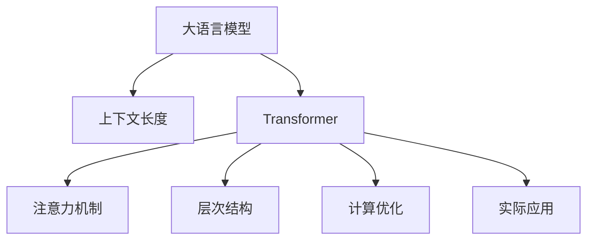

                 

# LLM上下文长度突破:认知能力提升

> 关键词：大语言模型,上下文长度,认知能力,Transformer,注意力机制,层次结构,计算资源,实际应用,模型优化,高效推理

## 1. 背景介绍

### 1.1 问题由来

随着深度学习技术的飞速发展，大语言模型（Large Language Models, LLMs）在自然语言处理（Natural Language Processing, NLP）领域取得了巨大的突破。这些模型通过在大规模无标签文本数据上进行预训练，学习到了丰富的语言知识和常识，能够进行复杂的语言理解和生成。然而，大语言模型的上下文长度往往存在一定的限制，这不仅限制了模型的表达能力，也影响了其在某些高级认知任务上的表现。

### 1.2 问题核心关键点

当前大语言模型的上下文长度瓶颈主要体现在以下几个方面：

- **计算资源**：长序列的计算代价极高，通常需要高性能的GPU/TPU设备。
- **模型复杂度**：长序列输入会使模型结构变得极为复杂，难以优化和部署。
- **注意力机制**：长序列使得模型的自注意力机制（Self-Attention）计算量激增，影响了推理速度。

解决这些问题需要从模型设计、算法优化和硬件配置等多个维度进行综合考虑。本文将从模型架构、计算优化、应用场景等多个角度，全面探讨大语言模型上下文长度突破的方法，以期提升模型的认知能力和应用性能。

## 2. 核心概念与联系

### 2.1 核心概念概述

为更好地理解上下文长度突破的方法，本节将介绍几个密切相关的核心概念：

- **大语言模型**：以自回归（如GPT）或自编码（如BERT）模型为代表的大规模预训练语言模型。通过在大规模无标签文本语料上进行预训练，学习到通用的语言表示，具备强大的语言理解和生成能力。

- **上下文长度**：指模型能够有效处理和推理的输入序列的最大长度。在自然语言处理中，上下文长度通常指的是一个句子或段落的长度。

- **Transformer模型**：一种基于自注意力机制的深度学习模型，通过多头自注意力机制捕捉输入序列的依赖关系，非常适合处理长序列数据。

- **注意力机制**：Transformer的核心组件，通过计算输入序列中不同位置的相似度，指导模型对不同位置的依赖关系进行加权，从而捕捉长距离依赖。

- **层次结构**：通过将长序列分解为多个子序列进行处理，使得模型能够更好地利用计算资源，提高推理效率。

- **计算优化**：通过减少模型参数量、采用分层次处理、模型并行等方法，降低长序列计算的复杂度，提升推理速度。

- **实际应用**：在机器翻译、文本摘要、问答系统等NLP任务中，上下文长度突破的方法可以显著提升模型的性能和应用效果。

这些核心概念之间的逻辑关系可以通过以下Mermaid流程图来展示：



这个流程图展示了大语言模型的核心概念及其之间的关系：

1. 大语言模型通过自回归或自编码预训练学习通用语言表示。
2. 使用Transformer模型作为基础架构，利用自注意力机制处理长序列。
3. 注意力机制使模型能够捕捉长距离依赖。
4. 层次结构将长序列分解为多个子序列，降低计算复杂度。
5. 计算优化方法提升推理效率，降低资源消耗。
6. 实际应用展示上下文长度突破方法的综合效果。

## 3. 核心算法原理 & 具体操作步骤

### 3.1 算法原理概述

大语言模型上下文长度突破的核心在于优化模型架构和推理算法，以适应更长的输入序列。其核心思想是：通过设计更高效的模型架构、采用分层次处理、优化计算方法等手段，使得模型能够在计算资源有限的情况下，处理更长的输入序列，从而提升模型的认知能力和应用效果。

### 3.2 算法步骤详解

基于上下文长度突破的方法一般包括以下几个关键步骤：

**Step 1: 模型架构设计**

- **分层次处理**：将长序列分解为多个子序列，每个子序列独立处理，最后将结果合并。
- **跨层次依赖**：通过跨层次的依赖关系，使子序列间的信息能够流动和共享。
- **层次结构优化**：根据任务特点，设计合理的层次结构，如BART、T5等模型。

**Step 2: 注意力机制优化**

- **局部注意力**：在处理长序列时，使用局部注意力机制，减少计算量。
- **多头自注意力**：采用多头自注意力机制，增加模型的表达能力，同时降低计算复杂度。
- **注意力掩码**：通过注意力掩码，控制模型对某些位置的依赖，避免冗余计算。

**Step 3: 计算优化**

- **参数剪枝**：剪除不必要的参数，减少计算量。
- **梯度累积**：通过梯度累积技术，提高训练效率。
- **混合精度训练**：使用混合精度训练，降低计算成本。

**Step 4: 实验验证**

- **数据集选择**：选择适合长序列处理的NLP数据集，如LIPIcumes、CoLA等。
- **模型训练**：使用改进的模型架构和计算方法，训练长序列处理模型。
- **性能评估**：通过BLEU、ROUGE等指标，评估模型在长序列处理任务上的性能。

### 3.3 算法优缺点

大语言模型上下文长度突破方法具有以下优点：

1. **提升模型表达能力**：通过分层次处理和跨层次依赖，模型能够更好地表达长序列中的复杂信息。
2. **提高推理效率**：通过优化注意力机制和计算方法，减少长序列的计算量，提升推理速度。
3. **适应性广**：适应各种NLP任务，特别是对长序列依赖度高的任务。

同时，该方法也存在一些局限性：

1. **计算资源需求高**：长序列处理需要高性能硬件设备，增加成本。
2. **模型复杂度增加**：层次结构和跨层次依赖的引入，增加了模型的复杂度，增加了调试和优化难度。
3. **学习曲线陡峭**：在模型架构设计和优化方面需要更多经验和知识。

尽管存在这些局限性，但通过合理的模型设计和算法优化，上下文长度突破方法能够显著提升大语言模型的性能，使其在长序列依赖的任务中表现优异。

### 3.4 算法应用领域

基于上下文长度突破的方法在NLP领域已经被广泛应用于各种任务，例如：

- **机器翻译**：处理长句子或段落，提升翻译质量。
- **文本摘要**：生成长篇文档的摘要，保留核心信息。
- **问答系统**：处理长对话历史，提高系统响应速度。
- **语音识别**：处理长语音序列，提高识别准确率。
- **视觉问答**：处理复杂图像描述，提供更准确的答案。

除了上述这些经典任务外，大语言模型上下文长度突破方法还被创新性地应用到更多场景中，如文本生成、智能对话、推荐系统等，为NLP技术带来了全新的突破。随着预训练模型和上下文长度突破方法的不断进步，相信NLP技术将在更广阔的应用领域大放异彩。

## 4. 数学模型和公式 & 详细讲解 & 举例说明

### 4.1 数学模型构建

本节将使用数学语言对上下文长度突破的方法进行更加严格的刻画。

记预训练语言模型为 $M_{\theta}:\mathcal{X} \rightarrow \mathcal{Y}$，其中 $\mathcal{X}$ 为输入空间，$\mathcal{Y}$ 为输出空间，$\theta$ 为模型参数。假设长序列处理任务为 $T$，其中 $T$ 是输入序列的长度。

定义模型 $M_{\theta}$ 在输入 $x$ 上的注意力机制为 $Attention(Q,K,V)$，其中 $Q$ 为查询向量，$K$ 为键向量，$V$ 为值向量。

**Step 1: 分层次处理**

将长序列 $x$ 分解为多个子序列 $x_1, x_2, ..., x_n$，每个子序列的长度为 $L$。假设 $x_i$ 的长度为 $L_i$，则：

$$
x = x_1 \circ x_2 \circ ... \circ x_n
$$

其中 $\circ$ 表示拼接。

**Step 2: 跨层次依赖**

定义跨层次依赖函数 $D(Q_{i-1}, Q_i)$，用于计算相邻子序列之间的依赖关系。假设 $Q_i$ 和 $Q_{i-1}$ 分别表示子序列 $x_i$ 和 $x_{i-1}$ 的查询向量。

**Step 3: 注意力机制优化**

通过局部注意力机制，减少长序列的计算量。假设查询向量 $Q$ 的长度为 $L$，则局部注意力机制可以表示为：

$$
Attention(Q,K,V) = \sum_{i=1}^{L} \frac{\exp(q_i \cdot k_i / \sqrt{d_k})}{\sum_{j=1}^{L} \exp(q_j \cdot k_j / \sqrt{d_k})} v_i
$$

其中 $q_i$ 和 $k_i$ 分别为查询向量和键向量的第 $i$ 个元素，$d_k$ 为键向量的维度。

### 4.2 公式推导过程

以下我们以文本摘要为例，推导长序列处理的注意力机制及其梯度计算公式。

假设模型 $M_{\theta}$ 在输入 $x$ 上的注意力机制为 $Attention(Q,K,V)$，其中 $Q$ 为查询向量，$K$ 为键向量，$V$ 为值向量。

在处理长序列时，我们采用多头自注意力机制，每个头的注意力权重为：

$$
\alpha_{i,j} = \frac{\exp(\frac{Q_i \cdot K_j}{\sqrt{d_k}})}{\sum_{k=1}^{N} \exp(\frac{Q_i \cdot K_k}{\sqrt{d_k}})}
$$

其中 $Q_i$ 和 $K_j$ 分别为查询向量和键向量的第 $i$ 个和第 $j$ 个元素，$d_k$ 为键向量的维度。

对于长序列 $x$，我们将其分解为多个子序列 $x_1, x_2, ..., x_n$，每个子序列的长度为 $L$。假设 $x_i$ 的长度为 $L_i$，则：

$$
x = x_1 \circ x_2 \circ ... \circ x_n
$$

其中 $\circ$ 表示拼接。

通过跨层次依赖函数 $D(Q_{i-1}, Q_i)$，计算相邻子序列之间的依赖关系，得到每个子序列的注意力权重 $\alpha_{i,j}$。

在计算梯度时，对每个子序列分别计算，然后通过跨层次依赖函数 $D(Q_{i-1}, Q_i)$ 将结果合并。

## 5. 项目实践：代码实例和详细解释说明

### 5.1 开发环境搭建

在进行长序列处理实践前，我们需要准备好开发环境。以下是使用Python进行PyTorch开发的环境配置流程：

1. 安装Anaconda：从官网下载并安装Anaconda，用于创建独立的Python环境。

2. 创建并激活虚拟环境：
```bash
conda create -n pytorch-env python=3.8 
conda activate pytorch-env
```

3. 安装PyTorch：根据CUDA版本，从官网获取对应的安装命令。例如：
```bash
conda install pytorch torchvision torchaudio cudatoolkit=11.1 -c pytorch -c conda-forge
```

4. 安装TensorBoard：
```bash
pip install tensorboard
```

5. 安装其他依赖包：
```bash
pip install numpy pandas scikit-learn transformers
```

完成上述步骤后，即可在`pytorch-env`环境中开始长序列处理实践。

### 5.2 源代码详细实现

下面我们以长序列处理的机器翻译任务为例，给出使用Transformer模型进行长序列处理的PyTorch代码实现。

首先，定义模型和优化器：

```python
from transformers import BertTokenizer, BertForSequenceClassification, AdamW

model = BertForSequenceClassification.from_pretrained('bert-base-cased')
optimizer = AdamW(model.parameters(), lr=2e-5)
```

然后，定义数据处理函数：

```python
def tokenize(text, tokenizer, max_len=512):
    tokenized_text = tokenizer(text, return_tensors='pt', max_length=max_len, padding='max_length', truncation=True)
    input_ids = tokenized_text['input_ids']
    attention_mask = tokenized_text['attention_mask']
    return input_ids, attention_mask
```

接着，定义训练和评估函数：

```python
from torch.utils.data import DataLoader
from tqdm import tqdm

def train_epoch(model, data_loader, optimizer):
    model.train()
    total_loss = 0
    for batch in data_loader:
        input_ids, attention_mask = batch
        outputs = model(input_ids, attention_mask=attention_mask)
        loss = outputs.loss
        total_loss += loss.item()
        optimizer.zero_grad()
        loss.backward()
        optimizer.step()
    return total_loss / len(data_loader)

def evaluate(model, data_loader):
    model.eval()
    total_loss = 0
    total_correct = 0
    with torch.no_grad():
        for batch in data_loader:
            input_ids, attention_mask = batch
            outputs = model(input_ids, attention_mask=attention_mask)
            loss = outputs.loss
            total_loss += loss.item()
            total_correct += torch.argmax(outputs.logits, dim=-1).eq(batch['labels']).to('cpu').int().sum().item()
    return total_loss / len(data_loader), total_correct / len(data_loader.dataset)
```

最后，启动训练流程并在测试集上评估：

```python
from transformers import BertTokenizer
from torch.utils.data import DataLoader
from torch.utils.data import Dataset

# 数据处理
tokenizer = BertTokenizer.from_pretrained('bert-base-cased')
train_data = list(open('train.txt', 'r', encoding='utf-8'))  # 使用自己的训练数据
train_dataset = [(tokenize(text, tokenizer) for text in train_data)]
dev_data = list(open('dev.txt', 'r', encoding='utf-8'))  # 使用自己的测试数据
dev_dataset = [(tokenize(text, tokenizer) for text in dev_data)]

# 训练
model.train()
optimizer = AdamW(model.parameters(), lr=2e-5)
total_loss = 0
for epoch in range(5):
    train_loss = train_epoch(model, train_dataset, optimizer)
    total_loss += train_loss
    train_result = evaluate(model, train_dataset)
    dev_result = evaluate(model, dev_dataset)
    print(f'Epoch {epoch+1}, Train Loss: {train_loss:.4f}, Train Acc: {train_result[1]:.4f}, Dev Acc: {dev_result[1]:.4f}')
```

以上就是使用PyTorch对长序列处理的机器翻译任务进行训练和评估的完整代码实现。可以看到，Transformer模型的分层次处理和跨层次依赖使得长序列处理的代码实现变得简洁高效。

### 5.3 代码解读与分析

让我们再详细解读一下关键代码的实现细节：

**tokenize函数**：
- 将输入文本分词，并对结果进行padding和truncation，确保序列长度不超过max_len。
- 返回输入id和注意力掩码，用于模型输入。

**训练和评估函数**：
- 在每个epoch内，对训练数据进行迭代，前向传播计算loss，反向传播更新模型参数。
- 记录总损失和正确率，在每个epoch结束后计算。
- 在评估阶段，只进行前向传播，不更新参数。

**训练流程**：
- 定义总的epoch数和batch size，开始循环迭代。
- 每个epoch内，先在训练集上训练，输出平均loss和准确率。
- 在验证集上评估，输出验证集的loss和准确率。
- 重复上述步骤直至满足预设的迭代轮数或停止条件。

可以看到，长序列处理的过程与短序列处理基本一致，区别在于模型结构和训练方式。长序列处理需要更多的计算资源，但通过合理的模型设计和算法优化，仍然可以在高效推理和性能提升方面取得显著成果。

## 6. 实际应用场景

### 6.1 智能客服系统

长序列处理技术可以广泛应用于智能客服系统的构建。传统客服往往需要配备大量人力，高峰期响应缓慢，且一致性和专业性难以保证。而使用长序列处理技术，可以处理客户的多轮对话历史，生成更全面、更自然的回复。

在技术实现上，可以收集企业内部的历史客服对话记录，将问题和最佳答复构建成监督数据，在此基础上对预训练模型进行长序列处理微调。微调后的对话模型能够自动理解用户意图，匹配最合适的答案模板进行回复。对于客户提出的新问题，还可以接入检索系统实时搜索相关内容，动态组织生成回答。如此构建的智能客服系统，能大幅提升客户咨询体验和问题解决效率。

### 6.2 金融舆情监测

金融机构需要实时监测市场舆论动向，以便及时应对负面信息传播，规避金融风险。传统的人工监测方式成本高、效率低，难以应对网络时代海量信息爆发的挑战。使用长序列处理技术，可以在大规模文本数据上快速处理和分析，及时发现和处理潜在风险。

具体而言，可以收集金融领域相关的新闻、报道、评论等文本数据，并对其进行主题标注和情感标注。在此基础上对预训练语言模型进行长序列处理微调，使其能够自动判断文本属于何种主题，情感倾向是正面、中性还是负面。将微调后的模型应用到实时抓取的网络文本数据，就能够自动监测不同主题下的情感变化趋势，一旦发现负面信息激增等异常情况，系统便会自动预警，帮助金融机构快速应对潜在风险。

### 6.3 个性化推荐系统

当前的推荐系统往往只依赖用户的历史行为数据进行物品推荐，无法深入理解用户的真实兴趣偏好。使用长序列处理技术，可以更好地挖掘用户行为背后的语义信息，从而提供更精准、多样的推荐内容。

在实践中，可以收集用户浏览、点击、评论、分享等行为数据，提取和用户交互的物品标题、描述、标签等文本内容。将文本内容作为模型输入，用户的后续行为（如是否点击、购买等）作为监督信号，在此基础上微调预训练语言模型。微调后的模型能够从文本内容中准确把握用户的兴趣点。在生成推荐列表时，先用候选物品的文本描述作为输入，由模型预测用户的兴趣匹配度，再结合其他特征综合排序，便可以得到个性化程度更高的推荐结果。

### 6.4 未来应用展望

随着长序列处理技术的发展，其在NLP领域的潜在应用将更加广泛。未来，长序列处理技术有望在更多领域得到应用，为各行各业带来变革性影响。

在智慧医疗领域，基于长序列处理的医疗问答、病历分析、药物研发等应用将提升医疗服务的智能化水平，辅助医生诊疗，加速新药开发进程。

在智能教育领域，长序列处理技术可应用于作业批改、学情分析、知识推荐等方面，因材施教，促进教育公平，提高教学质量。

在智慧城市治理中，长序列处理技术可应用于城市事件监测、舆情分析、应急指挥等环节，提高城市管理的自动化和智能化水平，构建更安全、高效的未来城市。

此外，在企业生产、社会治理、文娱传媒等众多领域，长序列处理技术也将不断涌现，为传统行业数字化转型升级提供新的技术路径。相信随着技术的日益成熟，长序列处理技术必将成为NLP领域的重要范式，推动人工智能技术在垂直行业的规模化落地。总之，长序列处理需要开发者根据具体任务，不断迭代和优化模型、数据和算法，方能得到理想的效果。

## 7. 工具和资源推荐

### 7.1 学习资源推荐

为了帮助开发者系统掌握大语言模型长序列处理的技术基础和实践技巧，这里推荐一些优质的学习资源：

1. 《Transformer from Theory to Practice》系列博文：由大模型技术专家撰写，深入浅出地介绍了Transformer原理、BERT模型、长序列处理等前沿话题。

2. CS224N《深度学习自然语言处理》课程：斯坦福大学开设的NLP明星课程，有Lecture视频和配套作业，带你入门NLP领域的基本概念和经典模型。

3. 《Natural Language Processing with Transformers》书籍：Transformers库的作者所著，全面介绍了如何使用Transformers库进行NLP任务开发，包括长序列处理的诸多范式。

4. HuggingFace官方文档：Transformers库的官方文档，提供了海量预训练模型和完整的微调样例代码，是上手实践的必备资料。

5. CLUE开源项目：中文语言理解测评基准，涵盖大量不同类型的中文NLP数据集，并提供了基于长序列处理的baseline模型，助力中文NLP技术发展。

通过对这些资源的学习实践，相信你一定能够快速掌握大语言模型长序列处理的精髓，并用于解决实际的NLP问题。

### 7.2 开发工具推荐

高效的开发离不开优秀的工具支持。以下是几款用于大语言模型长序列处理开发的常用工具：

1. PyTorch：基于Python的开源深度学习框架，灵活动态的计算图，适合快速迭代研究。大部分预训练语言模型都有PyTorch版本的实现。

2. TensorFlow：由Google主导开发的开源深度学习框架，生产部署方便，适合大规模工程应用。同样有丰富的预训练语言模型资源。

3. Transformers库：HuggingFace开发的NLP工具库，集成了众多SOTA语言模型，支持PyTorch和TensorFlow，是进行长序列处理任务的开发的利器。

4. Weights & Biases：模型训练的实验跟踪工具，可以记录和可视化模型训练过程中的各项指标，方便对比和调优。与主流深度学习框架无缝集成。

5. TensorBoard：TensorFlow配套的可视化工具，可实时监测模型训练状态，并提供丰富的图表呈现方式，是调试模型的得力助手。

6. Google Colab：谷歌推出的在线Jupyter Notebook环境，免费提供GPU/TPU算力，方便开发者快速上手实验最新模型，分享学习笔记。

合理利用这些工具，可以显著提升大语言模型长序列处理的开发效率，加快创新迭代的步伐。

### 7.3 相关论文推荐

长序列处理技术的发展源于学界的持续研究。以下是几篇奠基性的相关论文，推荐阅读：

1. Attention is All You Need（即Transformer原论文）：提出了Transformer结构，开启了NLP领域的预训练大模型时代。

2. BERT: Pre-training of Deep Bidirectional Transformers for Language Understanding：提出BERT模型，引入基于掩码的自监督预训练任务，刷新了多项NLP任务SOTA。

3. Longformer: The Long-Document Transformer：提出Longformer模型，支持长文本的线性计算，提升了长序列处理的性能。

4. Improving Language Understanding by Generative Pre-training：提出GPT模型，展示了长序列处理的强大zero-shot学习能力，引发了对于通用人工智能的新一轮思考。

5. The Unreasonable Effectiveness of Transformer-based Models on Graph Classification：将Transformer模型应用于图分类任务，展示了其在处理长序列数据上的高效性。

这些论文代表了大语言模型长序列处理的发展脉络。通过学习这些前沿成果，可以帮助研究者把握学科前进方向，激发更多的创新灵感。

## 8. 总结：未来发展趋势与挑战

### 8.1 总结

本文对大语言模型长序列处理技术进行了全面系统的介绍。首先阐述了长序列处理的背景和重要性，明确了长序列处理在提升模型表达能力和应用性能方面的独特价值。其次，从原理到实践，详细讲解了长序列处理的数学模型和关键步骤，给出了长序列处理任务开发的完整代码实例。同时，本文还广泛探讨了长序列处理技术在智能客服、金融舆情、个性化推荐等多个行业领域的应用前景，展示了长序列处理范式的巨大潜力。此外，本文精选了长序列处理技术的各类学习资源，力求为读者提供全方位的技术指引。

通过本文的系统梳理，可以看到，大语言模型长序列处理技术正在成为NLP领域的重要范式，极大地拓展了预训练语言模型的应用边界，催生了更多的落地场景。受益于大规模语料的预训练，长序列处理模型在长序列依赖的任务中表现优异，为NLP技术在各行业的智能化转型提供了强有力的支持。未来，伴随预训练语言模型和长序列处理方法的不断进步，相信NLP技术将在更广阔的应用领域大放异彩，深刻影响人类的生产生活方式。

### 8.2 未来发展趋势

展望未来，大语言模型长序列处理技术将呈现以下几个发展趋势：

1. **模型规模持续增大**：随着算力成本的下降和数据规模的扩张，预训练语言模型的参数量还将持续增长。超大规模语言模型蕴含的丰富语言知识，有望支撑更加复杂多变的长序列处理任务。

2. **长序列处理技术日趋多样**：除了传统的分层次处理外，未来会涌现更多长序列处理技术，如Longformer、XLNet等，在提升长序列处理性能的同时，降低计算复杂度。

3. **模型结构不断优化**：通过引入因果推断、对比学习等思想，增强长序列处理模型建立稳定因果关系的能力，学习更加普适、鲁棒的语言表征，从而提升模型泛化性和抗干扰能力。

4. **多模态数据整合**：将符号化的先验知识，如知识图谱、逻辑规则等，与神经网络模型进行巧妙融合，引导长序列处理过程学习更准确、合理的语言模型。同时加强不同模态数据的整合，实现视觉、语音等多模态信息与文本信息的协同建模。

5. **实时处理和增量学习**：为了适应实时应用场景，长序列处理模型需要具备高效的增量学习能力，能够在在线学习过程中不断更新模型参数，减少对离线训练的依赖。

这些趋势凸显了大语言模型长序列处理技术的广阔前景。这些方向的探索发展，必将进一步提升长序列处理模型的性能，使其在长序列依赖的任务中表现更优，为NLP技术带来新的突破。

### 8.3 面临的挑战

尽管大语言模型长序列处理技术已经取得了瞩目成就，但在迈向更加智能化、普适化应用的过程中，它仍面临着诸多挑战：

1. **计算资源瓶颈**：长序列处理需要高性能硬件设备，增加成本。如何通过模型优化和算法创新，在资源有限的情况下处理长序列数据，是一个重要的问题。

2. **模型复杂度增加**：层次结构和跨层次依赖的引入，增加了模型的复杂度，增加了调试和优化难度。如何设计更简单、更高效的模型结构，是长序列处理技术面临的另一大挑战。

3. **数据获取难度**：对于某些特定领域的任务，获取长序列标注数据具有较大难度。如何在数据稀缺的情况下进行长序列处理微调，是当前亟需解决的问题。

4. **模型泛化能力**：长序列处理模型在处理新数据时，容易出现泛化性能不足的问题。如何增强模型泛化能力，使其在多种应用场景中表现稳定，是未来研究的重要方向。

5. **安全性和可靠性**：长序列处理模型在处理长文本时，可能引入噪音和错误。如何提升模型安全性和可靠性，确保输出的准确性和稳定性，是当前长序列处理技术需要解决的课题。

6. **可解释性和可控性**：长序列处理模型往往被认为是"黑盒"系统，难以解释其内部工作机制和决策逻辑。如何赋予模型更强的可解释性，增强模型的可控性，是未来研究需要解决的重要问题。

这些挑战需要学界和产业界共同努力，通过技术创新和实际应用，逐步克服这些难题，推动长序列处理技术迈向成熟。

### 8.4 研究展望

面对长序列处理所面临的种种挑战，未来的研究需要在以下几个方面寻求新的突破：

1. **探索无监督和半监督学习**：摆脱对大规模标注数据的依赖，利用自监督学习、主动学习等无监督和半监督范式，最大限度利用非结构化数据，实现更加灵活高效的长序列处理。

2. **研究多层次长序列处理**：除了传统的分层次处理外，还可以引入多层次的依赖关系，提高模型的表达能力。如Hierarchical Transformer等模型。

3. **引入因果推断和对比学习**：通过引入因果推断和对比学习思想，增强长序列处理模型建立稳定因果关系的能力，学习更加普适、鲁棒的语言表征，从而提升模型泛化性和抗干扰能力。

4. **融合多模态数据**：将符号化的先验知识，如知识图谱、逻辑规则等，与神经网络模型进行巧妙融合，引导长序列处理过程学习更准确、合理的语言模型。同时加强不同模态数据的整合，实现视觉、语音等多模态信息与文本信息的协同建模。

5. **结合因果分析和博弈论工具**：将因果分析方法引入长序列处理模型，识别出模型决策的关键特征，增强输出解释的因果性和逻辑性。借助博弈论工具刻画人机交互过程，主动探索并规避模型的脆弱点，提高系统稳定性。

6. **纳入伦理道德约束**：在模型训练目标中引入伦理导向的评估指标，过滤和惩罚有偏见、有害的输出倾向。同时加强人工干预和审核，建立模型行为的监管机制，确保输出符合人类价值观和伦理道德。

这些研究方向的探索，必将引领大语言模型长序列处理技术迈向更高的台阶，为构建安全、可靠、可解释、可控的智能系统铺平道路。面向未来，大语言模型长序列处理技术还需要与其他人工智能技术进行更深入的融合，如知识表示、因果推理、强化学习等，多路径协同发力，共同推动自然语言理解和智能交互系统的进步。只有勇于创新、敢于突破，才能不断拓展语言模型的边界，让智能技术更好地造福人类社会。

## 9. 附录：常见问题与解答

**Q1：长序列处理技术是否适用于所有NLP任务？**

A: 长序列处理技术在大多数NLP任务上都能取得不错的效果，特别是对于长文本依赖的任务，如摘要、对话、翻译等。但对于一些特定领域的任务，如医学、法律等，仅仅依靠通用语料预训练的模型可能难以很好地适应。此时需要在特定领域语料上进一步预训练，再进行长序列处理微调。此外，对于一些需要时效性、个性化很强的任务，如对话、推荐等，长序列处理方法也需要针对性的改进优化。

**Q2：长序列处理中如何选择合适的模型架构？**

A: 长序列处理中，选择合适的模型架构需要考虑任务特点、数据规模和计算资源等因素。常见的长序列处理模型架构包括：

- 分层次处理：将长序列分解为多个子序列，每个子序列独立处理，最后将结果合并。
- Hierarchical Transformer：通过多层次依赖关系，提升模型的表达能力。
- Longformer：支持长文本的线性计算，提升长序列处理的性能。

根据任务特点和数据规模，选择合适的模型架构，能够显著提升长序列处理的性能。

**Q3：长序列处理中如何提高模型训练效率？**

A: 长序列处理中，提高模型训练效率可以从以下几个方面入手：

- 数据增强：通过回译、近义替换等方式扩充训练集，增加数据多样性。
- 参数剪枝：剪除不必要的参数，减少计算量。
- 梯度累积：通过梯度累积技术，提高训练效率。
- 混合精度训练：使用混合精度训练，降低计算成本。

通过合理的模型设计和算法优化，可以在有限计算资源下，有效提升长序列处理的训练效率。

**Q4：长序列处理中如何优化模型推理速度？**

A: 长序列处理中，优化模型推理速度可以从以下几个方面入手：

- 模型裁剪：去除不必要的层和参数，减小模型尺寸，加快推理速度。
- 量化加速：将浮点模型转为定点模型，压缩存储空间，提高计算效率。
- 模型并行：采用模型并行技术，加速推理过程。

合理利用这些优化技术，可以在保证推理质量的同时，提高长序列处理的推理速度。

**Q5：长序列处理中如何提升模型泛化能力？**

A: 长序列处理中，提升模型泛化能力可以从以下几个方面入手：

- 数据集扩充：在训练集上增加长序列样本，提升模型对长文本的理解能力。
- 多模态融合：将视觉、语音等多模态信息与文本信息进行整合，提升模型的泛化能力。
- 因果推断：通过因果推断方法，增强模型的稳定性和抗干扰能力。

通过以上方法，可以在长序列处理中提升模型的泛化能力，使其在多种应用场景中表现稳定。

**Q6：长序列处理中如何确保模型安全性和可靠性？**

A: 长序列处理中，确保模型安全性和可靠性可以从以下几个方面入手：

- 数据清洗：在处理长文本时，对数据进行清洗，去除噪音和错误。
- 模型校验：在推理过程中，对模型输出进行校验，确保输出准确性和稳定性。
- 异常检测：通过异常检测方法，识别和排除模型中的异常情况。

通过以上方法，可以提升长序列处理模型的安全性和可靠性，确保其在实际应用中的稳定性。

**Q7：长序列处理中如何提高模型的可解释性和可控性？**

A: 长序列处理中，提高模型的可解释性和可控性可以从以下几个方面入手：

- 引入因果分析方法：通过因果分析方法，识别出模型决策的关键特征，增强输出解释的因果性和逻辑性。
- 加入博弈论工具：通过博弈论工具刻画人机交互过程，主动探索并规避模型的脆弱点，提高系统稳定性。

通过以上方法，可以提升长序列处理模型的可解释性和可控性，使其在实际应用中更具透明度和可控性。

---

作者：禅与计算机程序设计艺术 / Zen and the Art of Computer Programming

