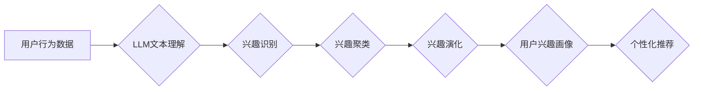

                 

## 基于LLM的用户兴趣动态追踪与更新

> 关键词：LLM, 用户兴趣, 动态追踪, 模型更新, 个性化推荐, 自然语言处理, 知识图谱

## 1. 背景介绍

随着互联网的蓬勃发展和数字技术的日新月异，用户个性化需求日益凸显。精准理解用户兴趣，并根据其动态变化提供个性化服务，已成为各大互联网平台的核心竞争力。传统的用户兴趣追踪方法主要依赖于用户行为数据，如点击记录、浏览历史、购买记录等，但这些数据往往难以捕捉用户潜在兴趣和意图，且存在数据孤岛、隐私泄露等问题。

近年来，大语言模型（LLM）的快速发展为用户兴趣追踪和更新带来了新的机遇。LLM 拥有强大的文本理解和生成能力，能够从用户文本交互中挖掘更深层的兴趣意图，并根据上下文进行动态更新，实现更精准、更个性化的服务。

## 2. 核心概念与联系

### 2.1 用户兴趣动态追踪

用户兴趣动态追踪是指实时监测和分析用户兴趣变化的过程，包括：

* **兴趣识别:** 从用户行为数据和文本交互中识别用户的兴趣点，例如主题、类别、产品、品牌等。
* **兴趣聚类:** 将用户兴趣进行分类和聚合，形成用户兴趣画像。
* **兴趣演化:** 跟踪用户兴趣的变化趋势，识别兴趣的增长、衰减、转移等动态特征。

### 2.2 LLM 在用户兴趣追踪中的应用

LLM 可以通过以下方式辅助用户兴趣动态追踪：

* **文本理解:** LLM 可以理解用户文本输入的语义和意图，识别用户潜在的兴趣点。
* **上下文建模:** LLM 可以根据历史交互记录构建用户上下文模型，更准确地理解用户的当前兴趣。
* **知识图谱融合:** LLM 可以与知识图谱结合，将用户兴趣与相关知识进行关联，挖掘更深层的兴趣关系。

**核心概念与架构流程图:**



## 3. 核心算法原理 & 具体操作步骤

### 3.1 算法原理概述

基于LLM的用户兴趣动态追踪主要依赖于以下核心算法：

* **Transformer模型:** Transformer模型是一种强大的深度学习模型，能够有效地捕捉文本序列中的长距离依赖关系，用于理解用户文本输入的语义和意图。
* **BERT模型:** BERT模型是一种基于Transformer的预训练语言模型，在大量的文本数据上进行预训练，能够对用户文本进行更精准的理解和分析。
* **知识图谱嵌入:** 知识图谱嵌入技术将知识图谱中的实体和关系映射到低维向量空间，方便LLM进行知识推理和兴趣关联。

### 3.2 算法步骤详解

1. **数据预处理:** 收集用户行为数据和文本交互数据，进行清洗、格式化和标注等预处理工作。
2. **LLM模型训练:** 使用预训练的LLM模型，例如BERT，对用户文本数据进行微调，训练出能够识别用户兴趣的模型。
3. **兴趣识别:** 将用户文本输入到训练好的LLM模型中，模型输出用户兴趣相关的关键词、主题、类别等信息。
4. **兴趣聚类:** 使用聚类算法将识别出的兴趣点进行分类和聚合，形成用户兴趣画像。
5. **兴趣演化:** 跟踪用户兴趣的变化趋势，使用时间序列分析等方法识别兴趣的增长、衰减、转移等动态特征。
6. **个性化推荐:** 根据用户兴趣画像和演化趋势，为用户提供个性化的推荐服务。

### 3.3 算法优缺点

**优点:**

* 能够捕捉用户潜在兴趣和意图，超越传统方法的局限性。
* 能够根据上下文进行动态更新，实现更精准的兴趣追踪。
* 能够与知识图谱结合，挖掘更深层的兴趣关系。

**缺点:**

* 需要大量的文本数据进行模型训练，数据获取和标注成本较高。
* 模型训练和推理过程计算量大，需要强大的计算资源支持。
* 存在数据隐私泄露的风险，需要采取相应的安全措施。

### 3.4 算法应用领域

基于LLM的用户兴趣动态追踪算法在以下领域具有广泛的应用前景：

* **电商推荐:** 为用户提供个性化的商品推荐，提高转化率。
* **内容推荐:** 为用户推荐个性化的新闻、视频、文章等内容，提升用户粘性。
* **社交媒体:** 为用户推荐个性化的好友、话题、群组等内容，增强用户互动。
* **教育培训:** 为用户推荐个性化的学习资源和课程，提高学习效率。

## 4. 数学模型和公式 & 详细讲解 & 举例说明

### 4.1 数学模型构建

用户兴趣动态追踪模型可以构建为一个马尔可夫决策过程（MDP），其中：

* 状态空间：用户兴趣状态，例如用户对某个主题的兴趣程度。
* 动作空间：系统可以采取的行动，例如推荐相关内容、更新用户兴趣画像等。
* 奖励函数：衡量系统采取行动带来的效益，例如用户点击率、停留时间等。
* 转移概率：用户兴趣状态在采取不同行动后的变化概率。

### 4.2 公式推导过程

模型的目标是最大化长期奖励，可以使用动态规划算法或强化学习算法进行求解。

例如，可以使用Bellman方程来更新状态价值函数：

$$
V(s) = \max_{\alpha} \sum_{s'} P(s' | s, \alpha) [R(s, \alpha, s') + \gamma V(s')]
$$

其中：

* $V(s)$ 是状态 $s$ 的价值函数。
* $\alpha$ 是系统采取的行动。
* $P(s' | s, \alpha)$ 是从状态 $s$ 到状态 $s'$ 的转移概率。
* $R(s, \alpha, s')$ 是采取行动 $\alpha$ 从状态 $s$ 到状态 $s'$ 的奖励。
* $\gamma$ 是折扣因子，控制未来奖励的权重。

### 4.3 案例分析与讲解

假设用户对某个主题的兴趣程度为 $s$，系统可以采取两种行动：推荐相关内容或更新用户兴趣画像。

* 如果推荐相关内容，用户点击率为 $p$，停留时间为 $t$，奖励函数为 $R = p \cdot t$。
* 如果更新用户兴趣画像，需要花费时间和资源，奖励函数为 $R = 0$。

根据Bellman方程，可以计算出不同状态下采取不同行动的价值函数，并选择价值最高的行动。

## 5. 项目实践：代码实例和详细解释说明

### 5.1 开发环境搭建

* Python 3.7+
* PyTorch 1.7+
* Transformers 4.10+
* SpaCy 3.0+

### 5.2 源代码详细实现

```python
from transformers import AutoModelForSequenceClassification, AutoTokenizer

# 加载预训练模型和词典
model_name = "bert-base-uncased"
tokenizer = AutoTokenizer.from_pretrained(model_name)
model = AutoModelForSequenceClassification.from_pretrained(model_name)

# 用户文本输入
user_text = "我最近对人工智能很感兴趣"

# 文本预处理
inputs = tokenizer(user_text, return_tensors="pt")

# 模型推理
outputs = model(**inputs)

# 获取预测结果
predicted_class = outputs.logits.argmax().item()

# 兴趣识别
interest_keywords = tokenizer.decode(inputs.input_ids[0])

# 兴趣聚类
# ...

# 兴趣演化
# ...

# 个性化推荐
# ...
```

### 5.3 代码解读与分析

* 代码首先加载预训练的BERT模型和词典。
* 用户文本输入后，使用词典进行预处理，转换为模型可识别的格式。
* 模型推理后，输出预测结果，例如用户对人工智能的兴趣程度。
* 兴趣识别、聚类和演化等步骤需要根据具体需求进行实现。
* 个性化推荐可以根据用户兴趣画像和演化趋势，推荐相关内容。

### 5.4 运行结果展示

运行结果将显示用户对人工智能的兴趣程度以及相关的兴趣关键词。

## 6. 实际应用场景

### 6.1 电商推荐

基于LLM的用户兴趣动态追踪可以帮助电商平台更精准地推荐商品，提高用户转化率。例如，当用户浏览某个产品的页面时，LLM可以分析用户的浏览记录、购买历史和文本评论，识别用户的兴趣点，并推荐与之相关的商品。

### 6.2 内容推荐

新闻、视频、文章等内容平台可以利用LLM来为用户提供个性化的内容推荐。例如，当用户阅读某个主题的文章时，LLM可以分析用户的阅读记录、点赞行为和评论内容，识别用户的兴趣点，并推荐与之相关的其他内容。

### 6.3 社交媒体

社交媒体平台可以利用LLM来推荐个性化的好友、话题和群组。例如，当用户注册社交媒体账号时，LLM可以分析用户的兴趣爱好和社交关系，推荐与之匹配的好友和群组。

### 6.4 未来应用展望

随着LLM技术的不断发展，其在用户兴趣动态追踪领域的应用将更加广泛和深入。例如：

* **多模态兴趣追踪:** 将文本、图像、音频等多模态数据融合，实现更全面的用户兴趣理解。
* **跨平台兴趣追踪:** 将用户在不同平台的兴趣数据进行整合，构建更完整的用户兴趣画像。
* **个性化兴趣引导:** 基于用户兴趣动态追踪，为用户提供个性化的兴趣引导和推荐，帮助用户发现新的兴趣爱好。

## 7. 工具和资源推荐

### 7.1 学习资源推荐

* **Hugging Face Transformers:** https://huggingface.co/docs/transformers/index
* **OpenAI GPT-3:** https://openai.com/api/
* **Stanford NLP Group:** https://nlp.stanford.edu/

### 7.2 开发工具推荐

* **PyTorch:** https://pytorch.org/
* **TensorFlow:** https://www.tensorflow.org/
* **SpaCy:** https://spacy.io/

### 7.3 相关论文推荐

* **BERT: Pre-training of Deep Bidirectional Transformers for Language Understanding**
* **GPT-3: Language Models are Few-Shot Learners**
* **Knowledge Graph Embedding: A Survey**

## 8. 总结：未来发展趋势与挑战

### 8.1 研究成果总结

基于LLM的用户兴趣动态追踪技术取得了显著进展，能够更精准地理解用户兴趣，并根据其动态变化提供个性化服务。

### 8.2 未来发展趋势

未来，LLM在用户兴趣动态追踪领域的应用将更加广泛和深入，主要发展趋势包括：

* **多模态兴趣追踪:** 将文本、图像、音频等多模态数据融合，实现更全面的用户兴趣理解。
* **跨平台兴趣追踪:** 将用户在不同平台的兴趣数据进行整合，构建更完整的用户兴趣画像。
* **个性化兴趣引导:** 基于用户兴趣动态追踪，为用户提供个性化的兴趣引导和推荐，帮助用户发现新的兴趣爱好。

### 8.3 面临的挑战

尽管LLM在用户兴趣动态追踪领域展现出巨大潜力，但也面临一些挑战：

* **数据隐私保护:** LLM模型训练和推理需要大量用户数据，如何保护用户隐私安全是一个重要问题。
* **模型解释性:** LLM模型的决策过程往往难以解释，如何提高模型的透明度和可解释性是一个挑战。
* **模型鲁棒性:** LLM模型容易受到恶意攻击和数据噪声的影响，如何提高模型的鲁棒性和安全性是一个关键问题。

### 8.4 研究展望

未来，我们需要继续探索LLM在用户兴趣动态追踪领域的应用，并解决上述挑战，以实现更精准、更个性化、更安全的用户体验。

## 9. 附录：常见问题与解答

**Q1: LLM模型训练需要多少数据？**

A1: LLM模型训练需要大量的文本数据，通常需要数十亿甚至数百亿个单词。

**Q2: 如何保护用户隐私安全？**

A2: 可以采用数据脱敏、联邦学习等技术来保护用户隐私安全。

**Q3: 如何提高模型的解释性？**

A3: 可以使用可解释机器学习方法，例如LIME、SHAP等，来解释模型的决策过程。


作者：禅与计算机程序设计艺术 / Zen and the Art of Computer Programming 
<end_of_turn>

