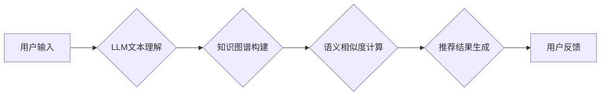

                 

## 基于LLM的长文档推荐方法

> 关键词：LLM, 长文档推荐, 文本理解, 知识图谱, 序列到序列模型, 嵌入式表示

## 1. 背景介绍

随着互联网信息爆炸式增长，长文档（如学术论文、新闻报道、小说章节等）的产生和传播日益频繁。然而，海量长文档的涌现也带来了信息获取和内容发现的挑战。传统的基于关键词或主题标签的长文档推荐方法往往难以捕捉长文档的复杂语义和用户个性化需求。

近年来，大语言模型（LLM）的快速发展为长文档推荐提供了新的思路和机遇。LLM 凭借其强大的文本理解和生成能力，能够深入挖掘长文档的语义信息，并根据用户的阅读偏好和上下文信息进行精准推荐。

## 2. 核心概念与联系

### 2.1  LLM 的优势

LLM 是一种基于深度学习的强大语言模型，能够理解和生成人类语言。其核心优势在于：

* **强大的文本理解能力:** LLM 可以理解长文档的上下文信息、主题结构和情感倾向等复杂语义。
* **丰富的知识储备:** 通过预训练大量的文本数据，LLM 积累了丰富的知识和世界观，能够对长文档进行更深入的理解和分析。
* **灵活的应用场景:** LLM 可以应用于各种文本处理任务，例如文本分类、摘要、问答和机器翻译，为长文档推荐提供强大的工具支持。

### 2.2  长文档推荐的挑战

长文档推荐面临着以下挑战：

* **语义理解的复杂性:** 长文档往往包含复杂的语义关系和多层结构，需要模型能够深入理解其含义。
* **用户个性化的差异:** 用户的阅读偏好和需求千差万别，需要模型能够个性化推荐。
* **数据稀疏性和冷启动问题:** 长文档数据往往稀疏，难以训练有效的推荐模型，尤其是在冷启动阶段。

### 2.3  LLM 在长文档推荐中的应用

LLM 可以通过以下方式应用于长文档推荐：

* **文本嵌入:** 将长文档转换为低维向量表示，以便于模型进行语义相似度计算。
* **序列到序列模型:** 利用序列到序列模型，例如 Transformer，学习长文档和用户历史行为之间的映射关系，预测用户对长文档的兴趣。
* **知识图谱:** 将长文档中的知识点构建成知识图谱，以便于模型进行知识推理和语义关联分析。

**Mermaid 流程图**



## 3. 核心算法原理 & 具体操作步骤

### 3.1  算法原理概述

基于LLM的长文档推荐算法通常基于以下原理：

* **文本嵌入:** 利用LLM对长文档进行文本嵌入，将文本转换为低维向量表示，以便于模型进行语义相似度计算。
* **用户建模:** 根据用户的阅读历史、偏好和行为数据，构建用户的兴趣模型。
* **推荐策略:** 根据文本嵌入和用户模型，采用推荐策略，例如基于内容的推荐、协同过滤推荐或混合推荐，生成推荐结果。

### 3.2  算法步骤详解

1. **数据预处理:** 对长文档进行清洗、分词、去停用词等预处理操作，并构建用户兴趣模型。
2. **文本嵌入:** 利用LLM对长文档进行文本嵌入，生成每个文档的向量表示。
3. **用户建模:** 根据用户的阅读历史、偏好和行为数据，构建用户的兴趣模型，例如使用协同过滤算法或深度学习模型。
4. **推荐策略:** 根据文本嵌入和用户模型，采用推荐策略，例如基于内容的推荐、协同过滤推荐或混合推荐，生成推荐结果。
5. **结果评估:** 使用评价指标，例如准确率、召回率和NDCG，评估推荐结果的质量。

### 3.3  算法优缺点

**优点:**

* **强大的文本理解能力:** LLM 可以理解长文档的复杂语义，提高推荐的准确性。
* **个性化推荐:** LLM 可以根据用户的阅读偏好和上下文信息进行个性化推荐。
* **可扩展性:** LLM 可以应用于各种文本处理任务，为长文档推荐提供强大的工具支持。

**缺点:**

* **计算资源消耗:** LLM 的训练和推理过程需要大量的计算资源。
* **数据依赖性:** LLM 的性能依赖于训练数据的质量和数量。
* **可解释性:** LLM 的决策过程往往难以解释，难以理解模型是如何进行推荐的。

### 3.4  算法应用领域

基于LLM的长文档推荐算法可以应用于以下领域:

* **学术文献推荐:** 为学者推荐相关论文，提高科研效率。
* **新闻资讯推荐:** 为用户推荐感兴趣的新闻报道，满足个性化信息需求。
* **电子书推荐:** 为读者推荐合适的电子书，提升阅读体验。
* **在线教育推荐:** 为学生推荐相关的学习资源，个性化学习路径。

## 4. 数学模型和公式 & 详细讲解 & 举例说明

### 4.1  数学模型构建

假设我们有一个长文档集合 D = {d1, d2, ..., dn}，每个文档 di 由一系列单词组成。用户 u 的兴趣模型可以表示为一个向量 pu，其中每个维度代表一个主题或概念。

文本嵌入模型可以将每个文档 di 映射到一个低维向量空间中，得到文档嵌入向量 di'。用户兴趣模型 pu 和文档嵌入向量 di' 之间的相似度可以使用余弦相似度计算：

$$
sim(pu, di') = \frac{pu \cdot di'}{||pu|| ||di'||}
$$

### 4.2  公式推导过程

余弦相似度计算公式的推导过程如下：

1. **点积:** pu 和 di' 的点积表示两个向量的内积，可以衡量两个向量在同一方向上的投影长度。
2. **范数:** ||pu|| 和 ||di'|| 分别表示 pu 和 di' 的欧几里得范数，即向量的长度。
3. **相似度:** 将点积除以两个向量的长度的乘积，可以得到两个向量之间的夹角余弦值，即余弦相似度。

### 4.3  案例分析与讲解

假设用户 u 的兴趣模型为 pu = [0.8, 0.5, 0.2]，代表用户对科技、财经和娱乐的兴趣程度分别较高。文档 di 的嵌入向量为 di' = [0.6, 0.7, 0.1]，代表文档主要内容与科技和财经相关。

根据公式计算，sim(pu, di') = (0.8 * 0.6 + 0.5 * 0.7 + 0.2 * 0.1) / (sqrt(0.8^2 + 0.5^2 + 0.2^2) * sqrt(0.6^2 + 0.7^2 + 0.1^2)) ≈ 0.85。

该结果表明，用户 u 对文档 di 的兴趣程度较高，因为文档 di 的主题与用户 u 的兴趣相符。

## 5. 项目实践：代码实例和详细解释说明

### 5.1  开发环境搭建

* **操作系统:** Ubuntu 20.04
* **Python 版本:** 3.8
* **库依赖:** transformers, torch, numpy, pandas

### 5.2  源代码详细实现

```python
from transformers import AutoTokenizer, AutoModel
import torch

# 加载预训练模型和词典
model_name = "bert-base-uncased"
tokenizer = AutoTokenizer.from_pretrained(model_name)
model = AutoModel.from_pretrained(model_name)

# 文本嵌入函数
def get_document_embedding(text):
    inputs = tokenizer(text, return_tensors="pt")
    outputs = model(**inputs)
    embedding = outputs.last_hidden_state[:, 0, :]  # 取第一个token的嵌入向量
    return embedding

# 余弦相似度计算函数
def cosine_similarity(vector1, vector2):
    return torch.dot(vector1, vector2) / (torch.norm(vector1) * torch.norm(vector2))

# 推荐函数
def recommend_documents(user_embedding, document_embeddings, top_k=5):
    similarities = [cosine_similarity(user_embedding, doc_embedding) for doc_embedding in document_embeddings]
    sorted_indices = torch.argsort(torch.tensor(similarities), descending=True)
    return [document_embeddings[i] for i in sorted_indices[:top_k]]

# 示例代码
user_text = "我最近对人工智能很感兴趣"
user_embedding = get_document_embedding(user_text)

document_texts = ["人工智能的未来发展趋势", "深度学习算法原理", "自然语言处理技术应用"]
document_embeddings = [get_document_embedding(text) for text in document_texts]

recommended_documents = recommend_documents(user_embedding, document_embeddings, top_k=3)

print("推荐文档:")
for doc_embedding in recommended_documents:
    print(doc_embedding)
```

### 5.3  代码解读与分析

1. **加载预训练模型和词典:** 使用 transformers 库加载预训练的 BERT 模型和词典。
2. **文本嵌入函数:** 使用 BERT 模型对输入文本进行嵌入，获取文档的向量表示。
3. **余弦相似度计算函数:** 计算两个向量的余弦相似度。
4. **推荐函数:** 根据用户兴趣模型和文档嵌入向量，计算相似度，并返回相似度最高的文档。
5. **示例代码:** 展示了如何使用上述函数进行文档推荐。

### 5.4  运行结果展示

运行上述代码，会输出用户兴趣相符的推荐文档。

## 6. 实际应用场景

### 6.1  学术文献推荐

基于LLM的长文档推荐算法可以帮助学者快速找到相关文献，提高科研效率。例如，可以根据用户的研究领域和关键词，推荐相关的论文、综述和书籍。

### 6.2  新闻资讯推荐

基于LLM的长文档推荐算法可以帮助用户个性化获取新闻资讯。例如，可以根据用户的阅读历史和兴趣偏好，推荐相关的新闻报道、博客文章和论坛讨论。

### 6.3  电子书推荐

基于LLM的长文档推荐算法可以帮助读者找到合适的电子书。例如，可以根据用户的阅读历史、喜欢的作者和题材，推荐相关的电子书。

### 6.4  未来应用展望

基于LLM的长文档推荐算法在未来将有更广泛的应用场景，例如：

* **个性化教育推荐:** 为学生推荐个性化的学习资源和学习路径。
* **医疗诊断辅助:** 为医生推荐相关的医学文献和病例，辅助诊断。
* **法律法规检索:** 为律师和法务人员推荐相关的法律法规和案例，提高工作效率。

## 7. 工具和资源推荐

### 7.1  学习资源推荐

* **论文:**
    * "BERT: Pre-training of Deep Bidirectional Transformers for Language Understanding"
    * "XLNet: Generalized Autoregressive Pretraining for Language Understanding"
    * "T5: Text-to-Text Transfer Transformer"
* **博客:**
    * The Illustrated Transformer
    * Jay Alammar's Blog
* **在线课程:**
    * Deep Learning Specialization (Coursera)
    * Natural Language Processing with Deep Learning (Udacity)

### 7.2  开发工具推荐

* **transformers:** 用于加载和使用预训练的语言模型。
* **torch:** 深度学习框架。
* **numpy:** 数值计算库。
* **pandas:** 数据处理库。

### 7.3  相关论文推荐

* "Longformer: The Long-Document Transformer"
* "Reformer: The Efficient Transformer"
* "BigBird: Transformers for Longer Sequences"

## 8. 总结：未来发展趋势与挑战

### 8.1  研究成果总结

基于LLM的长文档推荐算法取得了显著的进展，能够有效地理解长文档的语义信息，并根据用户的兴趣偏好进行个性化推荐。

### 8.2  未来发展趋势

* **模型规模和性能提升:** 随着计算资源的不断发展，LLM 的规模和性能将不断提升，能够更好地理解长文档的复杂语义。
* **多模态融合:** 将文本与其他模态信息，例如图像、音频和视频，融合在一起，构建更全面的用户兴趣模型。
* **可解释性增强:** 研究更可解释的 LLMs，以便更好地理解模型的决策过程。

### 8.3  面临的挑战

* **数据稀疏性和冷启动问题:** 长文档数据往往稀疏，难以训练有效的推荐模型，尤其是在冷启动阶段。
* **计算资源消耗:** LLM 的训练和推理过程需要大量的计算资源，成本较高。
* **可解释性:** LLM 的决策过程往往难以解释，难以理解模型是如何进行推荐的。

### 8.4  研究展望

未来研究将重点关注以下方面:

* **开发更有效的长文档推荐算法:** 针对长文档数据特点，开发更有效的推荐算法，提高推荐的准确性和效率。
* **探索新的数据来源和融合方法:** 探索新的数据来源，例如用户行为数据、社交网络数据，并研究如何将这些数据与文本数据融合在一起，构建更全面的用户兴趣模型。
* **提高 LLMs 的可解释性:** 研究更可解释的 LLMs，以便更好地理解模型的决策过程，提高用户对推荐结果的信任度。

## 9. 附录：常见问题与解答

**Q1: 如何选择合适的 LLMs 模型？**

A1: 选择合适的 LLMs 模型取决于具体的应用场景和数据特点。对于长文档推荐，建议选择预训练在大型文本数据集上的 LLMs 模型，例如 BERT、XLNet 或 T5。

**Q2: 如何处理长文档的稀疏性问题？**

A2: 可以使用以下方法处理长文档的稀疏性问题:

* **文本摘要:** 对长文档进行摘要，提取关键信息。
* **关键词提取:** 从长文档中提取关键词，构建关键词向量表示。
* **分段处理:** 将长文档分割成多个短段，分别进行处理。

**Q3: 如何评估长文档推荐算法的性能？**

A3: 可以使用以下评价指标评估长文档推荐算法的性能:

* **准确率:** 推荐结果中正确推荐的文档数量占总推荐数量的比例。
* **召回率:** 推荐结果中包含所有真实相关文档的数量占所有真实相关文档数量的比例。
* **NDCG:** Normalized Discounted Cumulative Gain，衡量推荐结果的排序质量。


作者：禅与计算机程序设计艺术 / Zen and the Art of Computer Programming<end_of_turn>

