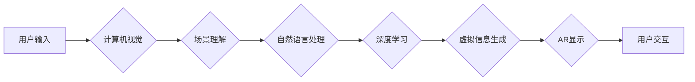

                 

## 增强现实搜索：AI的虚实结合

> 关键词：增强现实、搜索引擎、人工智能、计算机视觉、自然语言处理、深度学习、交互体验

### 1. 背景介绍

随着移动互联网和人工智能技术的飞速发展，增强现实（AR）技术逐渐从科幻小说走向现实生活。AR技术能够将虚拟信息叠加到现实世界中，为用户提供更加沉浸式和交互式的体验。在搜索领域，AR技术也展现出巨大的潜力，能够改变我们获取信息的方式，带来全新的搜索体验。

传统的搜索引擎主要依赖于文本匹配和关键词搜索，用户需要输入特定的关键词才能获取相关信息。然而，这种方式往往局限于文字描述，无法满足用户对更直观、更具沉浸感的搜索需求。AR搜索则通过将虚拟信息与现实世界融合，能够提供更加丰富的搜索结果，例如：

* **3D物体展示：** 用户可以通过AR技术查看产品的3D模型，更直观地了解产品的尺寸、形状和功能。
* **实地导航：** AR技术可以将导航路线叠加到用户的实时视野中，提供更加精准和直观的导航体验。
* **场景理解：** AR搜索引擎可以理解用户的周围环境，并提供相关的信息和服务，例如，用户在餐厅附近时，AR搜索引擎可以显示附近的餐厅信息和评价。

### 2. 核心概念与联系

AR搜索的核心概念是将虚拟信息与现实世界融合，通过计算机视觉、自然语言处理和深度学习等技术，实现对用户环境的理解和信息交互。

**架构图：**



**核心概念解释：**

* **计算机视觉：** 用于识别和理解用户的周围环境，例如识别物体、场景和人物。
* **场景理解：** 基于计算机视觉的识别结果，对用户的周围环境进行理解，例如识别用户的当前位置、周围环境的类型和感兴趣的物体。
* **自然语言处理：** 用于理解用户的搜索意图，例如识别用户的关键词、短语和句子结构。
* **深度学习：** 用于训练模型，实现对场景理解、信息检索和虚拟信息生成的预测和生成。
* **虚拟信息生成：** 根据场景理解和用户搜索意图，生成虚拟信息，例如3D模型、导航路线、文字信息等。
* **AR显示：** 将虚拟信息叠加到用户的现实视野中，提供更加沉浸式的搜索体验。
* **用户交互：** 用户可以通过语音、手势或触控等方式与AR搜索引擎进行交互，获取所需信息。

### 3. 核心算法原理 & 具体操作步骤

#### 3.1 算法原理概述

AR搜索的核心算法原理是将计算机视觉、自然语言处理和深度学习技术有机结合，实现对用户环境的理解和信息交互。

* **计算机视觉算法：** 用于识别和理解用户的周围环境，例如使用卷积神经网络（CNN）进行物体识别、场景分类和姿态估计。
* **自然语言处理算法：** 用于理解用户的搜索意图，例如使用词嵌入技术和深度学习模型进行关键词提取、语义分析和意图识别。
* **深度学习算法：** 用于训练模型，实现对场景理解、信息检索和虚拟信息生成的预测和生成，例如使用循环神经网络（RNN）和生成对抗网络（GAN）。

#### 3.2 算法步骤详解

AR搜索算法的具体操作步骤如下：

1. **环境感知：** 使用计算机视觉算法对用户的周围环境进行识别和理解，例如识别物体、场景和人物。
2. **用户意图识别：** 使用自然语言处理算法对用户的语音或文本输入进行分析，识别用户的搜索意图，例如关键词、短语和句子结构。
3. **信息检索：** 根据用户的搜索意图和环境信息，从数据库或知识图谱中检索相关信息，例如产品信息、导航路线、新闻报道等。
4. **虚拟信息生成：** 根据检索到的信息和用户的搜索意图，生成虚拟信息，例如3D模型、导航路线、文字信息等。
5. **AR显示：** 将虚拟信息叠加到用户的现实视野中，提供更加沉浸式的搜索体验。
6. **用户交互：** 用户可以通过语音、手势或触控等方式与AR搜索引擎进行交互，获取所需信息。

#### 3.3 算法优缺点

**优点：**

* **更加直观、沉浸式的搜索体验：** AR技术能够将虚拟信息与现实世界融合，提供更加直观、更加沉浸式的搜索体验。
* **更丰富的搜索结果：** AR搜索引擎可以提供更加丰富的搜索结果，例如3D模型、导航路线、场景理解等。
* **更精准的搜索结果：** AR搜索引擎可以根据用户的周围环境和搜索意图，提供更加精准的搜索结果。

**缺点：**

* **技术复杂度高：** AR搜索技术需要结合多种技术，例如计算机视觉、自然语言处理和深度学习，技术复杂度较高。
* **硬件要求高：** AR搜索需要使用AR设备，例如AR眼镜或手机，硬件要求较高。
* **隐私安全问题：** AR搜索引擎需要收集用户的环境信息和搜索行为数据，可能会引发隐私安全问题。

#### 3.4 算法应用领域

AR搜索算法在多个领域都有广泛的应用前景，例如：

* **电子商务：** 用户可以通过AR技术查看产品的3D模型，更直观地了解产品的尺寸、形状和功能。
* **旅游业：** AR搜索引擎可以提供更加沉浸式的旅游体验，例如在地图上叠加景点信息、提供虚拟导游等。
* **教育领域：** AR技术可以为学生提供更加直观的学习体验，例如虚拟解剖、3D模型展示等。
* **医疗保健：** AR技术可以帮助医生进行手术指导、患者康复训练等。

### 4. 数学模型和公式 & 详细讲解 & 举例说明

#### 4.1 数学模型构建

AR搜索算法的数学模型主要包括以下几个方面：

* **物体识别模型：** 使用CNN模型识别物体，其输出为物体类别概率分布。

* **场景理解模型：** 使用RNN模型对场景信息进行理解，其输出为场景类别和物体关系。

* **信息检索模型：** 使用深度学习模型对用户搜索意图和环境信息进行匹配，其输出为相关信息的得分。

* **虚拟信息生成模型：** 使用GAN模型生成虚拟信息，其输出为符合用户需求的虚拟内容。

#### 4.2 公式推导过程

由于篇幅限制，这里只列举部分关键公式，并进行简要讲解。

* **物体识别模型：** 使用softmax函数计算物体类别概率分布：

$$
P(C_i|I) = \frac{exp(s_i)}{\sum_{j=1}^{N} exp(s_j)}
$$

其中：

* $P(C_i|I)$ 是物体类别 $C_i$ 在输入图像 $I$ 中出现的概率。
* $s_i$ 是物体类别 $C_i$ 的得分。
* $N$ 是物体类别总数。

* **场景理解模型：** 使用LSTM模型对场景信息进行编码，其输出为场景表示向量：

$$
h_t = LSTM(h_{t-1}, x_t)
$$

其中：

* $h_t$ 是时间步 $t$ 的隐藏状态向量。
* $h_{t-1}$ 是时间步 $t-1$ 的隐藏状态向量。
* $x_t$ 是时间步 $t$ 的输入信息。

#### 4.3 案例分析与讲解

例如，用户在商场使用AR搜索引擎寻找“红色T恤”，AR搜索引擎会：

1. 使用计算机视觉算法识别用户的周围环境，例如识别商场内的商品架和服装。
2. 使用自然语言处理算法识别用户的搜索意图，例如识别关键词“红色T恤”。
3. 根据用户的搜索意图和环境信息，从数据库中检索相关信息，例如红色T恤的商品信息和位置。
4. 使用虚拟信息生成模型生成虚拟信息，例如在用户的现实视野中叠加红色T恤的3D模型和位置指示。
5. 用户可以通过AR眼镜查看红色T恤的3D模型，并根据位置指示找到对应的商品架。

### 5. 项目实践：代码实例和详细解释说明

#### 5.1 开发环境搭建

AR搜索引擎的开发环境需要包含以下软件：

* **操作系统：** Windows、macOS或Linux
* **编程语言：** Python
* **深度学习框架：** TensorFlow或PyTorch
* **计算机视觉库：** OpenCV
* **AR开发平台：** ARKit（iOS）或ARCore（Android）

#### 5.2 源代码详细实现

由于篇幅限制，这里只提供部分代码示例，例如使用OpenCV识别物体：

```python
import cv2

# 加载预训练的物体识别模型
net = cv2.dnn.readNet("yolov3.weights", "yolov3.cfg")

# 读取图像
image = cv2.imread("image.jpg")

# 获取图像尺寸
height, width, _ = image.shape

# 创建blob
blob = cv2.dnn.blobFromImage(image, 1/255, (416, 416), (0, 0, 0), True, crop=False)

# 设置输入
net.setInput(blob)

# 获取输出
output_layers_names = net.getUnconnectedOutLayersNames()
outputs = net.forward(output_layers_names)

# 识别物体
for output in outputs:
    for detection in output:
        scores = detection[5:]
        class_id = scores.argmax()
        confidence = scores[class_id]
        if confidence > 0.5:
            # 获取物体边界框坐标
            center_x = int(detection[0] * width)
            center_y = int(detection[1] * height)
            w = int(detection[2] * width)
            h = int(detection[3] * height)

            # 绘制边界框
            x = int(center_x - w / 2)
            y = int(center_y - h / 2)
            cv2.rectangle(image, (x, y), (x + w, y + h), (0, 255, 0), 2)

            # 显示物体类别
            label = f"{classes[class_id]}: {confidence:.2f}"
            cv2.putText(image, label, (x, y - 10), cv2.FONT_HERSHEY_SIMPLEX, 0.5, (0, 255, 0), 2)

# 显示图像
cv2.imshow("Object Detection", image)
cv2.waitKey(0)
```

#### 5.3 代码解读与分析

这段代码使用OpenCV库对图像进行物体识别。首先，加载预训练的物体识别模型，然后读取图像并将其转换为blob格式。接着，将blob作为输入传递给模型，获取输出结果。最后，根据输出结果识别物体，并绘制边界框和类别标签。

#### 5.4 运行结果展示

运行这段代码后，将会在图像上显示识别出的物体边界框和类别标签。

### 6. 实际应用场景

AR搜索技术已经开始在多个领域得到应用，例如：

* **购物体验：** 用户可以通过AR技术在家里试穿衣服、查看家具的3D模型，更直观地了解产品信息。
* **旅游导航：** AR搜索引擎可以在地图上叠加景点信息、提供虚拟导游，为用户提供更加沉浸式的旅游体验。
* **教育培训：** AR技术可以为学生提供更加直观的学习体验，例如虚拟解剖、3D模型展示等。
* **医疗诊断：** AR技术可以帮助医生进行手术指导、患者康复训练等。

### 6.4 未来应用展望

AR搜索技术未来将更加成熟和普及，应用场景也将更加广泛，例如：

* **个性化搜索：** AR搜索引擎将能够根据用户的个人喜好、搜索历史和环境信息，提供更加个性化的搜索结果。
* **增强现实购物：** 用户可以在虚拟环境中试用商品，并与朋友分享购物体验。
* **沉浸式教育：** AR技术将为教育带来革命性的改变，例如虚拟博物馆、沉浸式课堂等。
* **远程医疗：** AR技术将帮助医生远程诊断和治疗患者，提高医疗服务效率。

### 7. 工具和资源推荐

#### 7.1 学习资源推荐

* **书籍：**
    * 《增强现实技术》
    * 《深度学习》
    * 《计算机视觉》
* **在线课程：**
    * Coursera：增强现实开发
    * Udacity：深度学习
    * edX：计算机视觉

#### 7.2 开发工具推荐

* **AR开发平台：** ARKit（iOS）、ARCore（Android）
* **深度学习框架：** TensorFlow、PyTorch
* **计算机视觉库：** OpenCV

#### 7.3 相关论文推荐

* **增强现实搜索：**
    * "Augmented Reality Search: A Survey"
    * "A Survey on Augmented Reality Search Engines"
* **深度学习：**
    * "Deep Learning"
    * "Generative Adversarial Networks"
* **计算机视觉：**
    * "Computer Vision: Algorithms and Applications"
    * "Object Detection with Deep Learning"

### 8. 总结：未来发展趋势与挑战

#### 8.1 研究成果总结

AR搜索技术已经取得了显著的进展，例如：

* **物体识别精度提高：** 深度学习模型的不断发展，使得物体识别精度大幅提升。
* **场景理解能力增强：** RNN和Transformer等模型的应用，使得AR搜索引擎能够更好地理解用户的周围环境。
* **虚拟信息生成更加逼真：** GAN等模型的应用，使得虚拟信息生成更加逼真和多样化。

#### 8.2 未来发展趋势

AR搜索技术未来将朝着以下方向发展：

* **更加智能化：** AR搜索引擎将能够更加智能地理解用户的意图，提供更加精准和个性化的搜索结果。
* **更加融合：** AR搜索将与其他技术更加融合，例如语音助手、虚拟现实等，提供更加丰富的交互体验。
* **更加普及化：** AR设备价格将更加亲民，AR搜索技术将更加普及化。

#### 8.3 面临的挑战

AR搜索技术还面临着一些挑战：

* **隐私安全问题：** AR搜索引擎需要收集用户的环境信息和搜索行为数据，需要更加重视隐私安全问题。
* **计算资源需求高：** AR搜索算法需要大量的计算资源，需要开发更加高效的算法和硬件。
* **用户体验问题：** AR搜索体验还需要进一步优化，例如降低延迟、提高交互流畅度等。

#### 8.4 研究展望

未来，AR搜索技术将继续朝着更加智能化、融合化和普及化的方向发展，为用户提供更加便捷、高效和沉浸式的搜索体验。


### 9. 附录：常见问题与解答

**Q1：AR搜索和传统搜索有什么区别？**

**A1：** AR搜索和传统搜索的主要区别在于交互方式和搜索结果。传统搜索依赖于文本匹配和关键词搜索，而AR搜索则通过将虚拟信息叠加到现实世界中，提供更加直观、更加沉浸式的搜索体验。

**Q2：AR搜索技术需要哪些硬件支持？**

**A2：** AR搜索技术需要使用AR设备，例如AR眼镜或手机。

**Q3：AR搜索技术有哪些应用场景？**

**A3：** AR搜索技术在多个领域都有广泛的应用前景，例如购物体验、旅游导航、教育培训、医疗诊断等。

**Q4：AR搜索技术面临哪些挑战？**

**A4：** AR搜索技术面临的挑战包括隐私安全问题、计算资源需求高和用户体验问题。


作者：禅与计算机程序设计艺术 / Zen and the Art of Computer Programming<end_of_turn>

