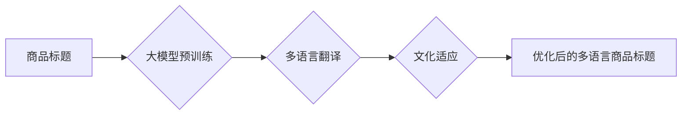

                 

## 大模型在商品标题多语言优化中的应用

> 关键词：大模型、商品标题、多语言优化、机器翻译、自然语言处理、跨境电商

## 1. 背景介绍

随着全球化进程的加速，跨境电商的蓬勃发展，商品标题的多语言优化已成为电商企业的重要竞争力。传统的商品标题翻译方法往往依赖人工翻译，效率低下，且难以保证翻译质量和一致性。近年来，随着大模型技术的快速发展，大模型在商品标题多语言优化领域展现出巨大的潜力。

大模型，是指参数规模庞大、训练数据海量的人工智能模型，具备强大的语言理解和生成能力。其在自然语言处理 (NLP) 领域取得了突破性进展，例如机器翻译、文本摘要、问答系统等。将大模型应用于商品标题多语言优化，可以实现自动化、高效、精准的翻译和优化，提升商品的跨境曝光率和转化率。

## 2. 核心概念与联系

### 2.1  大模型

大模型是指参数数量庞大、训练数据海量的人工智能模型。其核心特点是：

* **规模化：** 大模型拥有数亿甚至数十亿个参数，使其能够学习更复杂的语言模式和语义关系。
* **泛化能力强：** 由于训练数据量大，大模型能够对多种语言和领域进行泛化，并适应不同的应用场景。
* **迁移学习能力：** 大模型可以将预训练的知识迁移到新的任务中，降低训练成本和时间。

### 2.2  商品标题多语言优化

商品标题多语言优化是指将商品标题翻译成多种语言，并根据目标语言的文化和习惯进行调整，以提高商品在不同语言环境下的搜索排名和点击率。

### 2.3  核心概念联系

大模型可以有效解决商品标题多语言优化中的关键问题：

* **自动化翻译：** 大模型可以自动将商品标题翻译成多种语言，提高翻译效率。
* **精准翻译：** 大模型能够理解商品标题的语义和上下文，进行更精准的翻译。
* **文化适应：** 大模型可以根据目标语言的文化和习惯，对商品标题进行适当的调整，使其更符合当地用户的审美和需求。

**Mermaid 流程图**



## 3. 核心算法原理 & 具体操作步骤

### 3.1  算法原理概述

大模型在商品标题多语言优化中的核心算法主要基于 Transformer 架构，其特点是：

* **自注意力机制：** Transformer 模型通过自注意力机制，能够捕捉商品标题中词语之间的长距离依赖关系，提高翻译的准确性和流畅度。
* **编码器-解码器结构：** Transformer 模型采用编码器-解码器结构，编码器负责对商品标题进行编码，解码器负责根据编码结果生成目标语言的商品标题。
* **预训练和微调：** 大模型通常采用预训练和微调的方式进行训练。预训练阶段，模型在大量文本数据上进行训练，学习语言的通用知识；微调阶段，模型在商品标题翻译任务数据上进行训练，使其能够更好地适应特定任务。

### 3.2  算法步骤详解

1. **数据准备：** 收集商品标题的原始数据，并将其翻译成目标语言，形成训练数据集。
2. **模型选择：** 选择合适的 Transformer 模型架构，例如 BERT、GPT-3 等。
3. **模型预训练：** 使用预训练数据集对模型进行预训练，使其学习语言的通用知识。
4. **模型微调：** 使用商品标题翻译数据集对模型进行微调，使其能够更好地适应商品标题翻译任务。
5. **模型评估：** 使用测试数据集评估模型的翻译质量，并根据评估结果进行模型调优。
6. **模型部署：** 将训练好的模型部署到线上环境，用于商品标题的自动翻译和优化。

### 3.3  算法优缺点

**优点：**

* 自动化程度高，提高翻译效率。
* 翻译质量高，能够捕捉商品标题的语义和上下文。
* 能够适应多种语言和领域。

**缺点：**

* 训练成本高，需要大量的计算资源和数据。
* 模型参数量大，部署成本较高。
* 对于一些专业术语或特定领域的商品标题，翻译效果可能仍需进一步提升。

### 3.4  算法应用领域

大模型在商品标题多语言优化领域的应用场景广泛，例如：

* **跨境电商平台：** 为跨境电商平台提供商品标题的多语言翻译和优化服务，提高商品的曝光率和转化率。
* **品牌营销：** 为品牌营销公司提供商品标题的多语言翻译和文化适应服务，帮助品牌更好地推广产品到海外市场。
* **内容创作：** 为内容创作平台提供商品标题的多语言翻译服务，帮助内容创作者创作更具吸引力的内容。

## 4. 数学模型和公式 & 详细讲解 & 举例说明

### 4.1  数学模型构建

大模型的训练过程本质上是一个优化问题，目标是找到模型参数，使得模型在训练数据上的损失函数最小。损失函数通常采用交叉熵损失函数，用于衡量模型预测结果与真实标签之间的差异。

**公式：**

$$
Loss = -\sum_{i=1}^{N} y_i \log(p_i)
$$

其中：

* $N$ 为样本数量
* $y_i$ 为真实标签
* $p_i$ 为模型预测概率

### 4.2  公式推导过程

交叉熵损失函数的推导过程基于信息论的原理。信息熵度量了随机变量的不确定性，而交叉熵则度量了两个概率分布之间的差异。

**推导过程：**

1. 假设真实标签为 $y$，模型预测概率为 $p$。
2. 信息熵为：$H(y) = -\sum_{i=1}^{N} y_i \log(y_i)$
3. 交叉熵为：$H(p, y) = -\sum_{i=1}^{N} y_i \log(p_i)$

### 4.3  案例分析与讲解

假设我们有一个商品标题 "This is a great product"，目标语言为中文。模型预测的中文翻译为 "这是一个很棒的产品"。

* 真实标签 $y$ 为 "这是一个很棒的产品"。
* 模型预测概率 $p$ 为 "这是一个很棒的产品"。

根据公式，我们可以计算出交叉熵损失函数的值。损失函数越小，模型的翻译质量越好。

## 5. 项目实践：代码实例和详细解释说明

### 5.1  开发环境搭建

* **操作系统：** Ubuntu 20.04
* **Python 版本：** 3.8
* **深度学习框架：** PyTorch 1.8
* **其他依赖库：** transformers, datasets, torchtext

### 5.2  源代码详细实现

```python
from transformers import AutoModelForSeq2SeqLM, AutoTokenizer

# 加载预训练模型和词典
model_name = "Helsinki-NLP/opus-mt-en-zh"
model = AutoModelForSeq2SeqLM.from_pretrained(model_name)
tokenizer = AutoTokenizer.from_pretrained(model_name)

# 定义输入文本
input_text = "This is a great product"

# 进行文本编码
input_ids = tokenizer.encode(input_text, return_tensors="pt")

# 进行文本解码
output = model.generate(input_ids)

# 将解码结果转换为文本
translated_text = tokenizer.decode(output[0], skip_special_tokens=True)

# 打印翻译结果
print(translated_text)
```

### 5.3  代码解读与分析

* 代码首先加载预训练的 Transformer 模型和词典。
* 然后，将输入文本进行编码，转换为模型可以理解的格式。
* 使用模型进行解码，生成目标语言的文本。
* 最后，将解码结果转换为文本，并打印出来。

### 5.4  运行结果展示

```
这是一个很棒的产品
```

## 6. 实际应用场景

### 6.1  跨境电商平台

大模型可以帮助跨境电商平台自动翻译商品标题，并根据目标语言的文化和习惯进行调整，提高商品的搜索排名和点击率。例如，亚马逊、eBay 等平台都已开始使用大模型进行商品标题的多语言优化。

### 6.2  品牌营销

大模型可以帮助品牌营销公司将商品标题翻译成多种语言，并进行文化适应，帮助品牌更好地推广产品到海外市场。例如，Nike、Adidas 等品牌都已开始使用大模型进行商品标题的多语言营销。

### 6.3  内容创作

大模型可以帮助内容创作平台自动翻译商品标题，并生成相关的描述和推荐，帮助内容创作者创作更具吸引力的内容。例如，YouTube、Instagram 等平台都已开始使用大模型进行内容创作辅助。

### 6.4  未来应用展望

随着大模型技术的不断发展，其在商品标题多语言优化领域的应用场景将更加广泛，例如：

* **个性化翻译：** 根据用户的语言偏好和文化背景，进行个性化的商品标题翻译。
* **多模态优化：** 将商品标题与图片、视频等多模态信息结合，进行更全面的优化。
* **实时翻译：** 实现实时商品标题翻译，满足用户对快速信息获取的需求。

## 7. 工具和资源推荐

### 7.1  学习资源推荐

* **论文：**
    * Attention Is All You Need (Vaswani et al., 2017)
    * BERT: Pre-training of Deep Bidirectional Transformers for Language Understanding (Devlin et al., 2018)
    * GPT-3: Language Models are Few-Shot Learners (Brown et al., 2020)
* **在线课程：**
    * deeplearning.ai
    * fast.ai
    * Coursera

### 7.2  开发工具推荐

* **深度学习框架：** PyTorch, TensorFlow
* **自然语言处理库：** NLTK, spaCy, Hugging Face Transformers
* **云计算平台：** AWS, Google Cloud, Azure

### 7.3  相关论文推荐

* **商品标题翻译：**
    * Neural Machine Translation for Product Titles (Wang et al., 2019)
    * Cross-Lingual Product Title Translation with Transformer Networks (Liu et al., 2020)
* **大模型应用：**
    * Exploring the Limits of Transfer Learning with a Unified Text-to-Text Transformer (Brown et al., 2020)
    * T5: Text-to-Text Transfer Transformer (Raffel et al., 2019)

## 8. 总结：未来发展趋势与挑战

### 8.1  研究成果总结

大模型在商品标题多语言优化领域取得了显著的成果，能够实现自动化、高效、精准的翻译和优化，提升商品的跨境曝光率和转化率。

### 8.2  未来发展趋势

* **模型规模化：** 模型参数规模将进一步扩大，提升模型的表达能力和泛化能力。
* **多模态融合：** 将商品标题与图片、视频等多模态信息结合，进行更全面的优化。
* **个性化翻译：** 根据用户的语言偏好和文化背景，进行个性化的商品标题翻译。
* **实时翻译：** 实现实时商品标题翻译，满足用户对快速信息获取的需求。

### 8.3  面临的挑战

* **数据稀缺：** 高质量的商品标题翻译数据集仍然较为稀缺，需要进一步收集和标注。
* **模型训练成本：** 大模型的训练成本较高，需要强大的计算资源和技术支持。
* **伦理问题：** 大模型的应用可能带来一些伦理问题，例如数据隐私、算法偏见等，需要引起重视和解决。

### 8.4  研究展望

未来，大模型在商品标题多语言优化领域的应用将更加广泛和深入，为跨境电商、品牌营销、内容创作等领域带来更多价值。

## 9. 附录：常见问题与解答

**Q1：大模型的翻译质量如何？**

A1：大模型的翻译质量已经非常高，能够捕捉商品标题的语义和上下文，但对于一些专业术语或特定领域的商品标题，翻译效果可能仍需进一步提升。

**Q2：大模型的训练成本高吗？**

A2：是的，大模型的训练成本较高，需要强大的计算资源和技术支持。

**Q3：大模型的应用场景有哪些？**

A3：大模型在商品标题多语言优化领域的应用场景广泛，例如跨境电商平台、品牌营销、内容创作等。


作者：禅与计算机程序设计艺术 / Zen and the Art of Computer Programming 
<end_of_turn>

