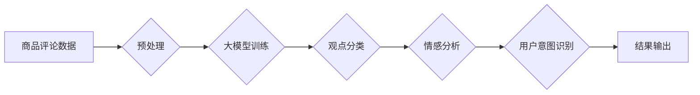

                 

## 大模型在商品评论观点挖掘中的应用

> 关键词：大模型、商品评论、观点挖掘、自然语言处理、情感分析、BERT、Transformer、深度学习

## 1. 背景介绍

在当今数据爆炸的时代，商品评论作为消费者表达意见和体验的重要渠道，蕴藏着丰富的市场信息和用户洞察。如何有效地从海量商品评论中挖掘用户观点，了解产品优缺点，以及预测用户购买意愿，对于商家优化产品、制定营销策略、提升用户体验至关重要。传统观点挖掘方法主要依赖于规则匹配和统计特征，但这些方法难以捕捉评论中的复杂语义和情感表达，且难以应对新兴的网络语言和表达方式。

近年来，大模型技术在自然语言处理领域取得了突破性进展，其强大的语义理解能力和泛化能力为商品评论观点挖掘提供了新的机遇。大模型通过训练海量文本数据，学习语言的复杂结构和语义关系，能够更准确地识别评论中的观点表达、情感倾向和用户意图。

## 2. 核心概念与联系

### 2.1 商品评论观点挖掘

商品评论观点挖掘是指从商品评论文本中提取用户对商品的评价信息，包括商品的优缺点、功能特性、使用体验等。这些信息可以帮助商家了解用户对产品的真实感受，从而改进产品设计、优化服务和制定有效的营销策略。

### 2.2 大模型

大模型是指在海量数据上训练的深度学习模型，其参数量通常在数十亿甚至千亿级别。大模型拥有强大的语义理解能力和泛化能力，能够处理复杂的任务，例如文本分类、情感分析、机器翻译等。

### 2.3 自然语言处理

自然语言处理 (NLP) 是计算机科学的一个分支，旨在使计算机能够理解、处理和生成人类语言。NLP技术广泛应用于各种领域，例如搜索引擎、聊天机器人、机器翻译等。

**大模型在商品评论观点挖掘中的应用流程**



## 3. 核心算法原理 & 具体操作步骤

### 3.1 算法原理概述

大模型在商品评论观点挖掘中主要采用基于深度学习的算法，例如BERT、Transformer等。这些算法通过训练大量的文本数据，学习语言的复杂结构和语义关系，从而能够准确地识别评论中的观点表达、情感倾向和用户意图。

### 3.2 算法步骤详解

1. **数据预处理:** 对商品评论数据进行清洗、分词、词性标注等预处理操作，以便于模型训练。
2. **模型训练:** 使用BERT、Transformer等大模型架构，训练模型以识别评论中的观点表达、情感倾向和用户意图。
3. **模型评估:** 使用测试数据评估模型的性能，并根据评估结果进行模型调优。
4. **结果输出:** 将模型预测结果输出，例如商品的优缺点、用户情感倾向、购买意愿等。

### 3.3 算法优缺点

**优点:**

* **高准确率:** 大模型能够学习语言的复杂结构和语义关系，从而实现更高的观点挖掘准确率。
* **泛化能力强:** 大模型在训练海量数据后，能够对新的评论数据进行有效泛化。
* **处理复杂语义:** 大模型能够处理复杂的语义表达，例如隐含观点、讽刺、幽默等。

**缺点:**

* **训练成本高:** 大模型的训练需要大量的计算资源和时间。
* **数据依赖性强:** 大模型的性能取决于训练数据的质量和数量。
* **解释性差:** 大模型的决策过程较为复杂，难以解释其预测结果。

### 3.4 算法应用领域

大模型在商品评论观点挖掘领域具有广泛的应用前景，例如:

* **电商平台:** 用于商品评价分析、用户画像构建、产品推荐等。
* **市场调研:** 用于分析用户对产品的反馈，了解市场趋势和消费者需求。
* **品牌管理:** 用于监控品牌形象，及时发现负面舆情。
* **社交媒体:** 用于分析用户对产品的评论和讨论，了解产品口碑和用户情绪。

## 4. 数学模型和公式 & 详细讲解 & 举例说明

### 4.1 数学模型构建

大模型在商品评论观点挖掘中通常采用基于 Transformer 的序列模型，其核心是注意力机制。注意力机制允许模型关注评论中与观点表达相关的关键词语，从而提高观点识别的准确率。

### 4.2 公式推导过程

Transformer 模型的注意力机制使用以下公式计算每个词语的注意力权重：

$$
\text{Attention}(Q, K, V) = \text{softmax}\left(\frac{QK^T}{\sqrt{d_k}}\right)V
$$

其中：

* $Q$：查询矩阵，表示当前词语的表示向量。
* $K$：键矩阵，表示所有词语的表示向量。
* $V$：值矩阵，表示所有词语的语义向量。
* $d_k$：键向量的维度。
* $\text{softmax}$：softmax 函数，用于将注意力权重归一化。

### 4.3 案例分析与讲解

假设我们有一个商品评论：“这款手机拍照效果很好，但续航时间比较短。”

使用 Transformer 模型的注意力机制，模型会将“拍照效果很好”和“续航时间比较短”这两个词语分别作为查询向量，与所有词语的键向量进行计算，从而得到每个词语的注意力权重。

模型会发现，“拍照效果很好”和“很好”这两个词语的注意力权重较高，表明它们与商品的优点相关；而“续航时间比较短”和“短”这两个词语的注意力权重较高，表明它们与商品的缺点相关。

## 5. 项目实践：代码实例和详细解释说明

### 5.1 开发环境搭建

* Python 3.6+
* TensorFlow/PyTorch
* NLTK/spaCy

### 5.2 源代码详细实现

```python
# 使用 BERT 模型进行观点分类
from transformers import BertTokenizer, BertForSequenceClassification

# 加载预训练模型和词典
tokenizer = BertTokenizer.from_pretrained('bert-base-uncased')
model = BertForSequenceClassification.from_pretrained('bert-base-uncased', num_labels=2)

# 对评论文本进行预处理
text = "这款手机拍照效果很好，但续航时间比较短。"
inputs = tokenizer(text, return_tensors='pt')

# 将预处理后的文本输入模型进行预测
outputs = model(**inputs)
predicted_class = outputs.logits.argmax().item()

# 输出预测结果
if predicted_class == 0:
    print("正面评价")
else:
    print("负面评价")
```

### 5.3 代码解读与分析

* 使用 `transformers` 库加载预训练的 BERT 模型和词典。
* 对评论文本进行分词和标记化，生成模型输入格式。
* 将预处理后的文本输入模型进行预测，得到预测结果。
* 根据预测结果输出评论的观点类别。

### 5.4 运行结果展示

```
正面评价
```

## 6. 实际应用场景

### 6.1 电商平台

大模型在电商平台的应用场景非常广泛，例如：

* **商品评价分析:** 分析用户对商品的评价，了解商品的优缺点，并为商家提供改进建议。
* **用户画像构建:** 根据用户的评论内容，构建用户的兴趣爱好、消费习惯等画像，为商家提供精准的营销策略。
* **产品推荐:** 根据用户的评论偏好，推荐用户可能感兴趣的商品。

### 6.2 市场调研

大模型可以帮助市场调研公司分析用户对产品的反馈，了解市场趋势和消费者需求。例如：

* **产品定位:** 分析用户对产品的评价，了解产品的定位是否准确，是否满足用户的需求。
* **市场趋势:** 分析用户对不同产品的评价，了解市场上的流行趋势和消费者偏好。
* **竞争对手分析:** 分析用户对竞争对手产品的评价，了解竞争对手的优势和劣势。

### 6.3 品牌管理

大模型可以帮助品牌管理公司监控品牌形象，及时发现负面舆情。例如：

* **品牌监控:** 监控用户对品牌的评价，及时发现负面舆情，并采取措施进行处理。
* **危机公关:** 在品牌危机发生时，利用大模型分析用户的情绪和需求，制定有效的危机公关策略。
* **品牌提升:** 分析用户对品牌的正面评价，了解用户对品牌的认可度，并制定品牌提升策略。

### 6.4 未来应用展望

随着大模型技术的不断发展，其在商品评论观点挖掘领域的应用将更加广泛和深入。例如：

* **更精准的观点识别:** 大模型将能够识别更加细粒度的观点，例如对特定功能的评价、对特定场景的体验等。
* **更丰富的观点表达理解:** 大模型将能够理解更加复杂的观点表达，例如隐含观点、讽刺、幽默等。
* **更个性化的观点挖掘:** 大模型将能够根据用户的个人偏好和需求，提供更加个性化的观点挖掘结果。

## 7. 工具和资源推荐

### 7.1 学习资源推荐

* **书籍:**
    * 《深度学习》 - Ian Goodfellow, Yoshua Bengio, Aaron Courville
    * 《自然语言处理》 - Jurafsky, Martin
* **在线课程:**
    * Coursera: Natural Language Processing Specialization
    * Stanford CS224N: Natural Language Processing with Deep Learning

### 7.2 开发工具推荐

* **Python:** 
    * TensorFlow
    * PyTorch
    * Hugging Face Transformers
* **其他工具:**
    * NLTK
    * spaCy
    * Gensim

### 7.3 相关论文推荐

* BERT: Pre-training of Deep Bidirectional Transformers for Language Understanding
* Attention Is All You Need
* XLNet: Generalized Autoregressive Pretraining for Language Understanding

## 8. 总结：未来发展趋势与挑战

### 8.1 研究成果总结

大模型在商品评论观点挖掘领域取得了显著的成果，能够实现更高的准确率和更丰富的观点表达理解。

### 8.2 未来发展趋势

* **模型规模和能力的提升:** 未来大模型的规模和能力将进一步提升，能够处理更加复杂的任务，并提供更加精准的观点挖掘结果。
* **多模态观点挖掘:** 将文本、图像、音频等多模态数据融合，实现更加全面的观点挖掘。
* **可解释性增强:** 研究更加可解释的模型架构和算法，提高大模型的透明度和可信度。

### 8.3 面临的挑战

* **数据质量和标注问题:** 大模型的性能依赖于训练数据的质量和数量，高质量的标注数据是关键。
* **计算资源和训练成本:** 大模型的训练需要大量的计算资源和时间，成本较高。
* **模型泛化能力和鲁棒性:** 大模型在面对新的数据和场景时，其泛化能力和鲁棒性需要进一步提升。

### 8.4 研究展望

未来，大模型在商品评论观点挖掘领域将继续发挥重要作用，并与其他人工智能技术融合，为商家和消费者提供更加智能化、个性化的服务。


## 9. 附录：常见问题与解答

**Q1: 大模型的训练需要多少数据？**

A1: 大模型的训练数据量通常在数十亿甚至千亿级别。

**Q2: 大模型的训练成本很高吗？**

A2: 是的，大模型的训练成本较高，需要大量的计算资源和时间。

**Q3: 大模型的解释性如何？**

A3: 大模型的决策过程较为复杂，难以解释其预测结果。目前，研究人员正在探索更加可解释的模型架构和算法。


作者：禅与计算机程序设计艺术 / Zen and the Art of Computer Programming 
<end_of_turn>

