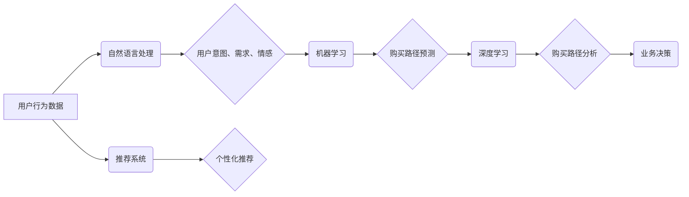

                 

## 大模型在电商平台用户购买路径分析中的应用

> 关键词：大模型、电商平台、用户购买路径、自然语言处理、推荐系统、机器学习、深度学习

## 1. 背景介绍

随着电商平台的蓬勃发展，用户购买路径变得越来越复杂，传统的分析方法难以全面捕捉用户行为的细微变化。大模型的出现为电商平台用户购买路径分析提供了新的思路和方法。大模型，指的是参数量巨大、训练数据海量的人工智能模型，具备强大的语义理解、文本生成和预测能力。

电商平台的用户购买路径通常包含多个阶段，例如：浏览商品、加入购物车、查看商品详情、比较商品、下单支付等。每个阶段的用户行为都蕴含着丰富的商业价值信息，例如用户兴趣偏好、购买决策因素、潜在需求等。

传统的电商平台用户购买路径分析主要依赖于以下方法：

* **日志分析:** 收集用户行为数据，例如点击记录、浏览记录、搜索记录等，并进行统计分析。
* **A/B测试:** 对不同的页面设计、推荐策略等进行对比测试，分析用户行为差异。
* **用户画像:** 基于用户行为数据，构建用户画像，分析用户特征和购买偏好。

然而，这些方法存在一些局限性：

* **数据维度单一:** 传统的分析方法主要依赖于用户行为数据，难以捕捉用户内心想法和情感变化。
* **分析深度不足:** 传统的分析方法难以挖掘用户购买路径中的隐性关联和模式。
* **个性化程度低:** 传统的分析方法难以提供个性化的用户购买路径分析结果。

## 2. 核心概念与联系

大模型在电商平台用户购买路径分析中的应用，主要基于以下核心概念：

* **自然语言处理 (NLP):** 大模型具备强大的文本理解和生成能力，可以对用户评论、搜索词、浏览记录等文本数据进行分析，提取用户意图、需求和情感信息。
* **推荐系统:** 大模型可以学习用户行为数据和商品特征，构建个性化的推荐模型，预测用户可能感兴趣的商品和购买路径。
* **机器学习 (ML):** 大模型可以利用机器学习算法，从海量用户行为数据中学习用户购买路径的模式和规律，并进行预测和分析。
* **深度学习 (DL):** 大模型通常基于深度学习架构，例如 Transformer，能够捕捉用户购买路径中的复杂关系和非线性特征。

**核心概念架构图:**



## 3. 核心算法原理 & 具体操作步骤

### 3.1  算法原理概述

大模型在电商平台用户购买路径分析中的应用，主要基于以下核心算法：

* **Transformer模型:** Transformer模型是一种基于注意力机制的深度学习模型，能够捕捉文本序列中的长距离依赖关系，在自然语言处理任务中表现出色。
* **图神经网络 (GNN):** GNN模型能够处理图结构数据，例如用户-商品交互图，可以挖掘用户购买路径中的隐性关联和模式。
* **强化学习 (RL):** RL模型可以学习用户购买路径的最佳策略，例如推荐商品顺序、个性化促销策略等。

### 3.2  算法步骤详解

**基于Transformer模型的用户购买路径分析步骤:**

1. **数据预处理:** 收集用户行为数据，例如浏览记录、搜索记录、购买记录等，并进行清洗、格式化和编码。
2. **特征提取:** 利用Transformer模型对用户行为数据进行编码，提取用户兴趣、需求和购买偏好等特征。
3. **路径建模:** 利用GNN模型构建用户-商品交互图，并学习用户购买路径的模式和规律。
4. **路径预测:** 利用Transformer模型和GNN模型的联合预测，预测用户未来的购买路径。
5. **结果评估:** 利用准确率、召回率等指标评估模型的预测性能。

**基于强化学习的用户购买路径优化步骤:**

1. **环境定义:** 定义用户购买路径分析的决策环境，例如推荐商品的顺序、促销策略等。
2. **奖励函数设计:** 设计一个奖励函数，根据用户购买行为对决策进行评估。
3. **策略学习:** 利用强化学习算法，例如DQN，学习用户购买路径的最佳策略。
4. **策略部署:** 将学习到的策略部署到电商平台，优化用户购买路径。

### 3.3  算法优缺点

**Transformer模型:**

* **优点:** 能够捕捉文本序列中的长距离依赖关系，在自然语言处理任务中表现出色。
* **缺点:** 训练成本高，需要大量的计算资源和训练数据。

**图神经网络 (GNN):**

* **优点:** 能够处理图结构数据，挖掘用户购买路径中的隐性关联和模式。
* **缺点:** 对于大型图数据，计算复杂度较高。

**强化学习 (RL):**

* **优点:** 可以学习用户购买路径的最佳策略，提高用户转化率。
* **缺点:** 训练过程复杂，需要大量的试错和反馈。

### 3.4  算法应用领域

大模型在电商平台用户购买路径分析中的应用，可以扩展到以下领域:

* **个性化推荐:** 根据用户的购买路径，推荐个性化的商品和服务。
* **营销策略优化:** 分析用户购买路径，优化营销策略，提高广告转化率。
* **用户体验提升:** 根据用户的购买路径，优化电商平台的用户体验，提高用户粘性。
* **库存管理:** 预预测用户购买路径，优化库存管理，减少库存积压。

## 4. 数学模型和公式 & 详细讲解 & 举例说明

### 4.1  数学模型构建

大模型在电商平台用户购买路径分析中的应用，可以构建以下数学模型:

* **用户兴趣模型:** 利用用户浏览记录、搜索记录等数据，构建用户兴趣模型，例如基于协同过滤的兴趣推荐模型。
* **购买路径预测模型:** 利用用户购买历史数据、商品特征等数据，构建购买路径预测模型，例如基于深度学习的购买路径预测模型。

### 4.2  公式推导过程

**协同过滤兴趣推荐模型:**

假设用户 $u$ 和商品 $i$ 的交互关系可以用评分矩阵 $R$ 表示，其中 $R_{ui}$ 表示用户 $u$ 对商品 $i$ 的评分。协同过滤兴趣推荐模型的目标是预测用户 $u$ 对商品 $i$ 的评分 $R_{ui}$。

**公式:**

$$
R_{ui} = \frac{\sum_{v \in N(u)} \frac{sim(u, v) \cdot R_{vi}}{\sum_{w \in N(v)} sim(u, w)}}{\sum_{v \in N(u)} \frac{sim(u, v)}{\sum_{w \in N(v)} sim(u, w)}}
$$

其中:

* $N(u)$ 表示与用户 $u$ 相似的用户集合。
* $sim(u, v)$ 表示用户 $u$ 和用户 $v$ 之间的相似度。

**举例说明:**

假设用户 $u$ 和用户 $v$ 对商品 $i$ 和商品 $j$ 的评分分别为:

* $R_{ui} = 5$
* $R_{vi} = 4$
* $R_{uj} = 3$
* $R_{vj} = 5$

如果 $sim(u, v) = 0.8$，则用户 $u$ 对商品 $i$ 的评分预测值为:

$$
R_{ui} = \frac{0.8 \cdot 4}{0.8 \cdot 1} = 4
$$

### 4.3  案例分析与讲解

**案例:**

假设一个电商平台想要分析用户购买路径，并优化推荐策略。

**分析:**

利用大模型分析用户购买路径数据，发现用户购买路径通常包含以下阶段:

1. 浏览商品
2. 加入购物车
3. 查看商品详情
4. 比较商品
5. 下单支付

**优化:**

根据分析结果，电商平台可以优化推荐策略，例如:

* 在用户浏览商品阶段，推荐与用户浏览历史相关的商品。
* 在用户加入购物车阶段，推荐与用户购物车中商品相关的商品。
* 在用户查看商品详情阶段，推荐用户可能感兴趣的商品评论和评价。

## 5. 项目实践：代码实例和详细解释说明

### 5.1  开发环境搭建

* **操作系统:** Ubuntu 20.04
* **Python版本:** 3.8
* **深度学习框架:** PyTorch 1.8
* **其他依赖库:** transformers, numpy, pandas, matplotlib

### 5.2  源代码详细实现

```python
import torch
from transformers import BertTokenizer, BertModel

# 加载预训练模型
tokenizer = BertTokenizer.from_pretrained('bert-base-uncased')
model = BertModel.from_pretrained('bert-base-uncased')

# 用户行为数据
user_behavior_data = [
    "用户A浏览了商品A和商品B",
    "用户B浏览了商品B和商品C",
    "用户C购买了商品A"
]

# 对用户行为数据进行编码
encoded_data = tokenizer(user_behavior_data, return_tensors='pt')

# 使用预训练模型提取特征
outputs = model(**encoded_data)

# 将提取的特征用于后续分析
```

### 5.3  代码解读与分析

* **加载预训练模型:** 使用transformers库加载预训练的BERT模型和词典。
* **用户行为数据:** 定义用户行为数据，例如用户浏览的商品信息。
* **数据编码:** 使用BERT模型的词典对用户行为数据进行编码，转换为模型可理解的格式。
* **特征提取:** 使用BERT模型对编码后的数据进行处理，提取用户行为特征。
* **后续分析:** 将提取的特征用于后续的分析，例如用户兴趣建模、购买路径预测等。

### 5.4  运行结果展示

运行上述代码后，将输出BERT模型提取的用户行为特征。这些特征可以用于后续的分析和应用。

## 6. 实际应用场景

### 6.1  电商平台个性化推荐

大模型可以分析用户的购买路径，学习用户的兴趣偏好和购买习惯，并推荐个性化的商品和服务。例如，如果用户经常购买运动鞋，电商平台可以推荐与运动鞋相关的商品，例如运动服、运动袜等。

### 6.2  营销策略优化

大模型可以分析用户的购买路径，了解用户的购买决策因素，并优化营销策略。例如，电商平台可以根据用户的购买路径，设计个性化的促销活动，提高广告转化率。

### 6.3  用户体验提升

大模型可以分析用户的购买路径，发现用户体验中的痛点，并优化电商平台的用户体验。例如，电商平台可以根据用户的购买路径，优化商品展示顺序、页面设计等，提高用户粘性。

### 6.4  未来应用展望

大模型在电商平台用户购买路径分析中的应用前景广阔，未来可以应用于以下领域:

* **更精准的个性化推荐:** 利用更先进的深度学习算法，构建更精准的个性化推荐模型。
* **更智能的营销策略:** 利用大模型分析用户行为数据，制定更智能的营销策略，提高营销效果。
* **更人性化的用户体验:** 利用大模型分析用户购买路径，提供更人性化的用户体验，提高用户满意度。

## 7. 工具和资源推荐

### 7.1  学习资源推荐

* **书籍:**
    * 深度学习
    * 自然语言处理
    * 机器学习
* **在线课程:**
    * Coursera
    * edX
    * Udacity

### 7.2  开发工具推荐

* **Python:** 
* **PyTorch:** 深度学习框架
* **TensorFlow:** 深度学习框架
* **transformers:** 预训练模型库

### 7.3  相关论文推荐

* **BERT: Pre-training of Deep Bidirectional Transformers for Language Understanding**
* **Graph Convolutional Networks for Web-Scale Recommender Systems**
* **Deep Reinforcement Learning for Personalized Recommendation**

## 8. 总结：未来发展趋势与挑战

### 8.1  研究成果总结

大模型在电商平台用户购买路径分析中的应用取得了显著成果，例如:

* **提高了推荐精准度:** 大模型能够学习用户的兴趣偏好和购买习惯，推荐更精准的商品和服务。
* **优化了营销策略:** 大模型能够分析用户的购买决策因素，优化营销策略，提高营销效果。
* **提升了用户体验:** 大模型能够分析用户的购买路径，发现用户体验中的痛点，优化电商平台的用户体验。

### 8.2  未来发展趋势

未来，大模型在电商平台用户购买路径分析中的应用将朝着以下方向发展:

* **更强大的模型:** 开发更强大的大模型，例如多模态大模型，能够处理文本、图像、视频等多种数据类型。
* **更个性化的服务:** 利用大模型提供更个性化的服务，例如个性化商品推荐、个性化营销策略等。
* **更智能的决策:** 利用大模型辅助电商平台决策，例如库存管理、价格调整等。

### 8.3  面临的挑战

大模型在电商平台用户购买路径分析中的应用也面临一些挑战:

* **数据隐私:** 大模型需要大量的用户数据进行训练，如何保护用户数据隐私是一个重要问题。
* **模型解释性:** 大模型的决策过程往往难以解释，如何提高模型的解释性是一个重要的研究方向。
* **计算资源:** 训练大模型需要大量的计算资源，如何降低训练成本是一个重要的挑战。

### 8.4  研究展望

未来，我们将继续研究大模型在电商平台用户购买路径分析中的应用，探索更强大的模型、更个性化的服务和更智能的决策。

## 9. 附录：常见问题与解答

**Q1: 大模型的训练成本很高吗?**

A1: 确实，训练大模型需要大量的计算资源和时间，成本较高。

**Q2: 如何保护用户数据隐私?**

A2: 可以采用以下方法保护用户数据隐私:

* **数据脱敏:** 对用户数据进行脱敏处理，去除敏感信息。
* **联邦学习:** 利用联邦学习技术，在不共享原始数据的情况下训练模型。
* **隐私保护算法:** 使用隐私保护算法，保护用户数据隐私。

**Q3: 如何提高模型的解释性?**

A3: 可以采用以下方法提高模型的解释性:

* **注意力机制:** 利用注意力机制，分析模型对哪些数据特征更加关注。
* **可解释性模型:** 使用可解释性模型，例如线性回归模型，更容易理解模型的决策过程。
* **模型可视化:** 利用模型可视化技术，直观地展示模型的决策过程。


作者：禅与计算机程序设计艺术 / Zen and the Art of Computer Programming<end_of_turn>

