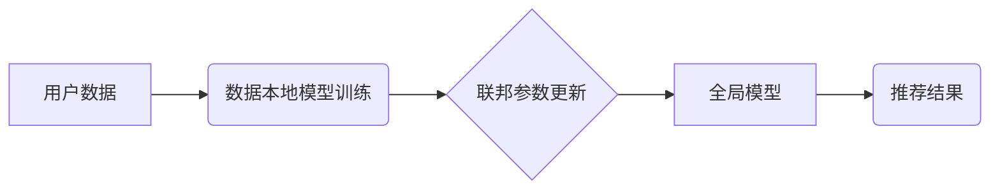

                 

## 大模型推荐中的隐私保护学习方法

> 关键词：大模型、推荐系统、隐私保护、联邦学习、差分隐私

## 1. 背景介绍

推荐系统作为互联网时代的重要组成部分，在电商、社交媒体、内容平台等领域发挥着越来越重要的作用。大模型的出现为推荐系统带来了新的机遇，其强大的学习能力和泛化能力能够提升推荐效果。然而，大模型训练和部署过程中往往需要处理海量用户数据，这引发了用户隐私泄露的风险。因此，如何在保证推荐效果的同时保护用户隐私成为一个亟待解决的问题。

近年来，隐私保护学习方法在机器学习领域取得了显著进展，为大模型推荐系统提供了新的思路。本文将深入探讨大模型推荐中的隐私保护学习方法，包括核心概念、算法原理、实践案例以及未来发展趋势。

## 2. 核心概念与联系

### 2.1  推荐系统与大模型

推荐系统旨在根据用户的历史行为、偏好等信息，预测用户对特定物品的兴趣，并推荐相关物品。传统推荐系统通常采用基于内容、基于协同过滤等方法，但其效果受限于数据稀疏性和冷启动问题。

大模型，例如Transformer、BERT等，凭借其强大的语义理解和表示学习能力，能够从海量文本数据中学习到更丰富的用户特征和物品语义，从而提升推荐效果。

### 2.2  隐私保护与联邦学习

隐私保护是指在数据处理过程中保护用户个人信息的敏感信息不被泄露或滥用。联邦学习是一种分布式机器学习方法，它允许模型在多个数据拥有者之间进行训练，而无需将原始数据传输到中央服务器。

### 2.3  差分隐私

差分隐私是一种强大的隐私保护机制，它通过添加噪声来保护训练数据中的敏感信息。差分隐私保证了即使攻击者获得了模型训练后的参数，也无法从这些参数中恢复出任何单个用户的隐私信息。

### 2.4  核心架构

大模型推荐中的隐私保护学习方法通常采用联邦学习和差分隐私相结合的架构。



## 3. 核心算法原理 & 具体操作步骤

### 3.1  算法原理概述

大模型推荐中的隐私保护学习方法主要基于以下核心算法：

* **联邦学习:** 将模型训练分散到多个数据拥有者，每个数据拥有者在本地训练模型，并只共享模型参数，而不是原始数据。
* **差分隐私:** 在模型训练过程中添加噪声，保证即使攻击者获得了模型训练后的参数，也无法从这些参数中恢复出任何单个用户的隐私信息。

### 3.2  算法步骤详解

1. **数据本地化:** 用户数据存储在各个数据拥有者的本地服务器上，不进行集中存储。
2. **模型初始化:** 每个数据拥有者从全局模型中获取初始模型参数。
3. **本地模型训练:** 每个数据拥有者使用本地数据对模型进行训练，并计算出模型参数的梯度。
4. **联邦参数更新:** 每个数据拥有者将模型参数的梯度发送到联邦服务器，联邦服务器聚合所有梯度，并更新全局模型参数。
5. **模型更新传播:** 全局模型参数更新被发送回每个数据拥有者。
6. **重复步骤3-5:** 重复上述步骤，直到模型收敛。

### 3.3  算法优缺点

**优点:**

* **保护用户隐私:** 数据不离开本地服务器，有效防止数据泄露。
* **提升模型鲁棒性:** 利用多个数据源训练模型，提升模型泛化能力和鲁棒性。

**缺点:**

* **通信开销:** 模型参数的频繁传输会带来通信开销。
* **训练效率:** 联邦学习的训练速度通常比集中式训练慢。

### 3.4  算法应用领域

大模型推荐中的隐私保护学习方法在以下领域具有广泛应用前景:

* **电商推荐:** 保护用户购买历史和浏览记录等隐私信息。
* **医疗推荐:** 保护患者病历和医疗记录等敏感信息。
* **金融推荐:** 保护用户财务信息和交易记录等隐私信息。

## 4. 数学模型和公式 & 详细讲解 & 举例说明

### 4.1  数学模型构建

差分隐私的数学模型基于随机机制，它通过添加噪声来保护训练数据中的敏感信息。

假设我们有一个数据集 $D$，包含 $n$ 个样本。我们想要训练一个模型 $f(D)$，该模型可以预测用户的兴趣。差分隐私要求模型训练过程满足以下条件:

$$
\Pr[f(D_1) \neq f(D_2)] \leq \epsilon
$$

其中，$D_1$ 和 $D_2$ 是数据集 $D$ 中相邻的两个数据集，即它们只相差一个样本。$\epsilon$ 是一个隐私预算参数，它控制着模型训练过程中的隐私泄露程度。

### 4.2  公式推导过程

差分隐私的具体实现方式有很多，其中一种常用的方法是**拉普拉斯机制**。拉普拉斯机制通过添加服从拉普拉斯分布的噪声来保护模型训练过程中的隐私信息。

假设我们想要对数据集 $D$ 中某个敏感属性进行查询，例如用户的年龄。拉普拉斯机制的输出为:

$$
\hat{s} = s + \epsilon_L
$$

其中，$s$ 是数据集 $D$ 中敏感属性的真实值，$\epsilon_L$ 是服从拉普拉斯分布的噪声，其参数为 $\frac{1}{\epsilon \cdot \Delta s}$，其中 $\Delta s$ 是敏感属性的范围。

### 4.3  案例分析与讲解

假设我们有一个电商平台，想要推荐用户感兴趣的商品。用户的购买历史和浏览记录等信息是推荐系统的重要数据源，但这些信息也包含用户的隐私信息。

我们可以使用差分隐私来保护用户的隐私信息。例如，我们可以使用拉普拉斯机制对用户的购买历史进行加噪处理，从而防止攻击者从模型训练后的参数中恢复出用户的具体购买记录。

## 5. 项目实践：代码实例和详细解释说明

### 5.1  开发环境搭建

* Python 3.7+
* TensorFlow 2.0+
* PyTorch 1.0+
* scikit-learn 0.20+

### 5.2  源代码详细实现

```python
# 导入必要的库
import tensorflow as tf
from tensorflow.keras.layers import Dense, Embedding
from tensorflow.keras.models import Sequential

# 定义推荐模型
model = Sequential()
model.add(Embedding(input_dim=vocab_size, output_dim=embedding_dim))
model.add(Dense(units=num_classes, activation='softmax'))

# 训练模型
model.compile(optimizer='adam', loss='categorical_crossentropy', metrics=['accuracy'])
model.fit(X_train, y_train, epochs=10, batch_size=32)

# 预测结果
predictions = model.predict(X_test)
```

### 5.3  代码解读与分析

* **模型定义:** 代码定义了一个简单的推荐模型，包含一个嵌入层和一个全连接层。
* **模型训练:** 使用Adam优化器和交叉熵损失函数训练模型。
* **模型预测:** 使用训练好的模型对测试数据进行预测。

### 5.4  运行结果展示

运行代码后，可以得到模型的训练精度和测试精度。

## 6. 实际应用场景

### 6.1  电商推荐

大模型推荐系统可以根据用户的购买历史、浏览记录、评分等信息，推荐用户感兴趣的商品。

### 6.2  内容推荐

大模型推荐系统可以根据用户的阅读历史、点赞记录、评论等信息，推荐用户感兴趣的内容。

### 6.3  社交推荐

大模型推荐系统可以根据用户的社交关系、兴趣爱好等信息，推荐用户可能感兴趣的人或群组。

### 6.4  未来应用展望

随着大模型技术的不断发展，大模型推荐系统将在更多领域得到应用，例如个性化教育、医疗诊断、金融理财等。

## 7. 工具和资源推荐

### 7.1  学习资源推荐

* **书籍:**
    * 深度学习
    * 机器学习
* **在线课程:**
    * Coursera: 深度学习
    * edX: 机器学习
* **博客:**
    * TensorFlow Blog
    * PyTorch Blog

### 7.2  开发工具推荐

* **TensorFlow:** 开源深度学习框架
* **PyTorch:** 开源深度学习框架
* **JAX:** 高性能自动微分库

### 7.3  相关论文推荐

* **Federated Learning: Strategies for Improving Communication Efficiency**
* **Differential Privacy**
* **Privacy-Preserving Machine Learning: A Survey**

## 8. 总结：未来发展趋势与挑战

### 8.1  研究成果总结

大模型推荐中的隐私保护学习方法取得了显著进展，为保护用户隐私和提升推荐效果提供了新的思路。

### 8.2  未来发展趋势

* **模型效率提升:** 探索更有效的联邦学习算法，降低模型训练的通信开销和时间成本。
* **隐私预算优化:** 研究更灵活的隐私预算分配策略，平衡隐私保护和推荐效果。
* **多模态数据融合:** 将文本、图像、音频等多模态数据融合到推荐系统中，提升推荐的准确性和个性化程度。

### 8.3  面临的挑战

* **数据异构性:** 不同数据拥有者的数据格式和质量可能存在差异，需要开发更 robust 的联邦学习算法。
* **模型可解释性:** 大模型的决策过程往往难以解释，需要提高模型的可解释性，增强用户对推荐结果的信任。
* **隐私预算的确定:** 如何确定合适的隐私预算参数是一个复杂的问题，需要根据实际应用场景进行权衡。

### 8.4  研究展望

未来，大模型推荐中的隐私保护学习方法将继续朝着更安全、更有效、更智能的方向发展，为用户提供更个性化、更安全的推荐体验。

## 9. 附录：常见问题与解答

**Q1: 差分隐私和联邦学习有什么区别？**

**A1:** 差分隐私是一种隐私保护机制，它通过添加噪声来保护训练数据中的敏感信息。联邦学习是一种分布式机器学习方法，它允许模型在多个数据拥有者之间进行训练，而无需将原始数据传输到中央服务器。

**Q2: 联邦学习的训练速度比集中式训练慢吗？**

**A2:** 是的，联邦学习的训练速度通常比集中式训练慢，因为模型参数需要频繁地传输和更新。

**Q3: 如何确定合适的隐私预算参数？**

**A3:** 隐私预算参数的确定是一个复杂的问题，需要根据实际应用场景进行权衡。一般来说，隐私预算越小，模型训练过程中的隐私泄露越少，但推荐效果也可能下降。


作者：禅与计算机程序设计艺术 / Zen and the Art of Computer Programming 
<end_of_turn>

