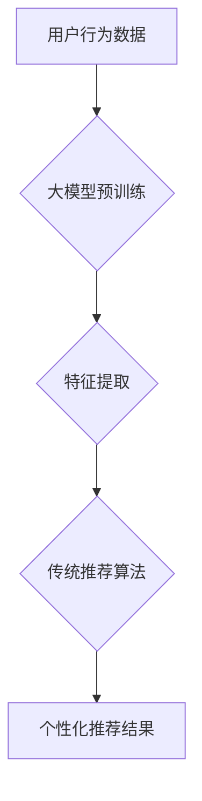

                 

## 大模型给传统推荐系统带来的机遇、挑战与变革思考

> 关键词：大模型、推荐系统、深度学习、Transformer、个性化推荐、冷启动问题、数据隐私

### 1. 背景介绍

推荐系统作为互联网时代的重要技术支柱，在电商、社交媒体、视频平台等领域发挥着至关重要的作用。传统推荐系统主要依赖于协同过滤、内容过滤和基于知识的推荐算法，这些算法通常基于用户历史行为、商品特征等静态数据进行建模。然而，随着数据量的爆炸式增长和用户行为的多样化，传统推荐系统面临着越来越多的挑战，例如数据稀疏性、冷启动问题、推荐结果的个性化程度不足等。

近年来，大模型技术蓬勃发展，其强大的学习能力和泛化能力为推荐系统带来了新的机遇。大模型，通常指参数规模在数十亿甚至千亿级别的神经网络模型，能够从海量数据中学习到更深层的用户偏好和商品关系，从而提升推荐系统的准确性和个性化程度。

### 2. 核心概念与联系

#### 2.1 大模型

大模型是指参数规模在数十亿甚至千亿级别的神经网络模型，通常基于Transformer架构，例如GPT-3、BERT、T5等。大模型通过大量的文本数据进行预训练，学习到丰富的语言表示和知识，能够在各种自然语言处理任务中表现出色。

#### 2.2 传统推荐系统

传统推荐系统主要依赖于以下三种算法：

* **协同过滤:** 基于用户对商品的评分或购买历史，推荐与用户相似兴趣的用户或商品。
* **内容过滤:** 基于商品的特征和描述，推荐与用户兴趣相符的商品。
* **基于知识的推荐:** 基于商品之间的关系和用户对商品的知识，推荐相关商品。

#### 2.3 大模型与推荐系统的融合

大模型可以与传统推荐系统相结合，提升推荐系统的性能。例如，大模型可以用于：

* **特征提取:** 从用户行为、商品描述等文本数据中提取更丰富的特征，为传统推荐算法提供更精准的输入。
* **个性化建模:** 学习用户个性化的偏好和兴趣，为用户提供更精准的推荐。
* **冷启动问题解决:** 利用大模型的知识迁移能力，对新用户和新商品进行推荐。

**Mermaid 流程图**



### 3. 核心算法原理 & 具体操作步骤

#### 3.1 算法原理概述

大模型在推荐系统中的应用主要基于深度学习技术，其中Transformer架构的模型表现尤为突出。Transformer模型通过自注意力机制学习用户和商品之间的关系，能够捕捉到更深层的语义信息，从而提升推荐系统的准确性和个性化程度。

#### 3.2 算法步骤详解

1. **数据预处理:** 收集用户行为数据、商品信息等数据，进行清洗、格式化和编码。
2. **大模型预训练:** 利用海量文本数据对Transformer模型进行预训练，学习到丰富的语言表示和知识。
3. **特征提取:** 将用户行为数据、商品信息等数据输入预训练好的大模型，提取用户和商品的特征表示。
4. **推荐模型训练:** 利用提取的特征表示，训练推荐模型，例如基于排序的模型、基于概率的模型等。
5. **推荐结果生成:** 将新用户的特征输入训练好的推荐模型，预测用户可能感兴趣的商品，并生成推荐结果。

#### 3.3 算法优缺点

**优点:**

* **提升推荐准确性:** 大模型能够学习到更深层的用户偏好和商品关系，从而提升推荐系统的准确性。
* **增强个性化推荐:** 大模型可以学习到每个用户的个性化偏好，为用户提供更精准的推荐。
* **解决冷启动问题:** 大模型的知识迁移能力可以帮助解决新用户和新商品的冷启动问题。

**缺点:**

* **数据需求高:** 大模型需要海量数据进行预训练，数据获取和处理成本较高。
* **计算资源消耗大:** 大模型训练和推理需要大量的计算资源，成本较高。
* **模型解释性差:** 大模型的决策过程较为复杂，难以解释模型的推荐结果。

#### 3.4 算法应用领域

大模型在推荐系统领域的应用非常广泛，例如：

* **电商推荐:** 为用户推荐商品，提高转化率。
* **社交媒体推荐:** 为用户推荐好友、内容和活动，提升用户粘性。
* **视频平台推荐:** 为用户推荐视频，提高用户观看时长。
* **音乐平台推荐:** 为用户推荐歌曲，提高用户活跃度。

### 4. 数学模型和公式 & 详细讲解 & 举例说明

#### 4.1 数学模型构建

大模型在推荐系统中的应用通常基于深度学习模型，例如Transformer模型。Transformer模型的数学模型主要包括以下几个部分：

* **自注意力机制:** 用于学习用户和商品之间的关系，捕捉到更深层的语义信息。
* **多头注意力:** 通过多个注意力头，学习到不同层次的用户和商品关系。
* **前馈神经网络:** 用于对注意力机制输出进行进一步的处理。
* **位置编码:** 用于将序列数据中的位置信息编码到模型中。

#### 4.2 公式推导过程

自注意力机制的核心公式如下：

$$
Attention(Q, K, V) = \frac{exp(Q \cdot K^T / \sqrt{d_k})}{exp(Q \cdot K^T / \sqrt{d_k})} \cdot V
$$

其中：

* $Q$：查询矩阵
* $K$：键矩阵
* $V$：值矩阵
* $d_k$：键向量的维度

#### 4.3 案例分析与讲解

假设我们有一个电商平台，需要推荐商品给用户。我们可以使用Transformer模型构建一个推荐系统。

1. **数据预处理:** 收集用户购买历史、商品信息等数据，进行清洗、格式化和编码。
2. **大模型预训练:** 利用海量文本数据对Transformer模型进行预训练，学习到丰富的语言表示和知识。
3. **特征提取:** 将用户的购买历史和商品信息作为输入，提取用户和商品的特征表示。
4. **推荐模型训练:** 利用提取的特征表示，训练一个基于排序的推荐模型，例如BERT-Rank模型。
5. **推荐结果生成:** 将新用户的特征输入训练好的推荐模型，预测用户可能感兴趣的商品，并生成推荐结果。

### 5. 项目实践：代码实例和详细解释说明

#### 5.1 开发环境搭建

推荐系统开发环境通常包括以下软件：

* Python 3.x
* TensorFlow 或 PyTorch 深度学习框架
* Jupyter Notebook 或 VS Code 代码编辑器
* Git 版本控制系统

#### 5.2 源代码详细实现

以下是一个使用PyTorch框架构建简单推荐系统的代码示例：

```python
import torch
import torch.nn as nn

class Recommender(nn.Module):
    def __init__(self, embedding_dim, num_users, num_items):
        super(Recommender, self).__init__()
        self.user_embedding = nn.Embedding(num_users, embedding_dim)
        self.item_embedding = nn.Embedding(num_items, embedding_dim)
        self.fc = nn.Linear(embedding_dim * 2, 1)

    def forward(self, user_id, item_id):
        user_embedding = self.user_embedding(user_id)
        item_embedding = self.item_embedding(item_id)
        concat_embedding = torch.cat((user_embedding, item_embedding), dim=1)
        output = self.fc(concat_embedding)
        return output

# 实例化模型
model = Recommender(embedding_dim=64, num_users=1000, num_items=10000)

# 定义损失函数和优化器
criterion = nn.MSELoss()
optimizer = torch.optim.Adam(model.parameters(), lr=0.001)

# 训练模型
for epoch in range(10):
    # 训练数据
    user_ids = torch.randint(0, 1000, (1000,))
    item_ids = torch.randint(0, 10000, (1000,))
    # 计算损失
    outputs = model(user_ids, item_ids)
    loss = criterion(outputs, target)
    # 反向传播
    optimizer.zero_grad()
    loss.backward()
    # 更新参数
    optimizer.step()

# 保存模型
torch.save(model.state_dict(), 'recommender_model.pth')
```

#### 5.3 代码解读与分析

这段代码实现了一个简单的基于PyTorch框架的推荐系统。

* **模型定义:** `Recommender`类定义了一个推荐模型，包含用户嵌入层、商品嵌入层和全连接层。
* **前向传播:** `forward`方法定义了模型的前向传播过程，将用户ID和商品ID作为输入，输出预测评分。
* **损失函数和优化器:** 使用均方误差损失函数和Adam优化器训练模型。
* **训练过程:** 训练模型的过程包括数据加载、前向传播、损失计算、反向传播和参数更新。
* **模型保存:** 训练完成后，将模型参数保存到文件。

#### 5.4 运行结果展示

训练完成后，可以使用保存的模型对新用户和新商品进行推荐。

### 6. 实际应用场景

#### 6.1 电商推荐

大模型在电商推荐领域应用广泛，例如：

* **商品推荐:** 为用户推荐相关的商品，提高转化率。
* **个性化推荐:** 根据用户的购买历史、浏览记录等数据，为用户提供个性化的商品推荐。
* **新品推荐:** 为用户推荐新上市的商品，提高用户体验。

#### 6.2 社交媒体推荐

大模型在社交媒体推荐领域应用也越来越广泛，例如：

* **好友推荐:** 为用户推荐潜在的好友，扩大用户社交圈。
* **内容推荐:** 根据用户的兴趣爱好，为用户推荐相关的文章、视频、图片等内容。
* **活动推荐:** 为用户推荐相关的活动，提高用户参与度。

#### 6.3 视频平台推荐

大模型在视频平台推荐领域也发挥着重要作用，例如：

* **视频推荐:** 根据用户的观看历史、点赞记录等数据，为用户推荐相关的视频。
* **内容分类:** 利用大模型对视频内容进行分类，提高用户搜索效率。
* **个性化播放列表:** 为用户生成个性化的播放列表，提升用户观看体验。

#### 6.4 未来应用展望

随着大模型技术的不断发展，其在推荐系统领域的应用将更加广泛和深入，例如：

* **多模态推荐:** 将文本、图像、音频等多模态数据融合到推荐系统中，提升推荐的准确性和个性化程度。
* **跨平台推荐:** 将用户数据和商品数据跨平台融合，为用户提供更全面的推荐服务。
* **实时推荐:** 利用大模型的实时推理能力，为用户提供更及时和精准的推荐服务。

### 7. 工具和资源推荐

#### 7.1 学习资源推荐

* **书籍:**
    * 《深度学习》 - Ian Goodfellow, Yoshua Bengio, Aaron Courville
    * 《自然语言处理》 - Dan Jurafsky, James H. Martin
* **在线课程:**
    * Coursera: Deep Learning Specialization
    * Udacity: Deep Learning Nanodegree
* **博客和网站:**
    * TensorFlow Blog: https://blog.tensorflow.org/
    * PyTorch Blog: https://pytorch.org/blog/

#### 7.2 开发工具推荐

* **深度学习框架:** TensorFlow, PyTorch
* **数据处理工具:** Pandas, NumPy
* **版本控制系统:** Git

#### 7.3 相关论文推荐

* **BERT:** Devlin, J., Chang, M. W., Lee, K., & Toutanova, K. (2018). BERT: Pre-training of deep bidirectional transformers for language understanding. arXiv preprint arXiv:1810.04805.
* **GPT-3:** Brown, T. B., Mann, B., Ryder, N., Subbiah, M., Kaplan, J., Dhariwal, P., ... & Amodei, D. (2020). Language models are few-shot learners. arXiv preprint arXiv:2005.14165.
* **Transformer:** Vaswani, A., Shazeer, N., Parmar, N., Uszkoreit, J., Jones, L., Gomez, A. N., ... & Polosukhin, I. (2017). Attention is all you need. In Advances in neural information processing systems (pp. 5998-6008).

### 8. 总结：未来发展趋势与挑战

#### 8.1 研究成果总结

大模型技术在推荐系统领域取得了显著的成果，例如：

* **提升推荐准确性:** 大模型能够学习到更深层的用户偏好和商品关系，从而提升推荐系统的准确性。
* **增强个性化推荐:** 大模型可以学习到每个用户的个性化偏好，为用户提供更精准的推荐。
* **解决冷启动问题:** 大模型的知识迁移能力可以帮助解决新用户和新商品的冷启动问题。

#### 8.2 未来发展趋势

未来，大模型在推荐系统领域的应用将朝着以下方向发展：

* **多模态推荐:** 将文本、图像、音频等多模态数据融合到推荐系统中，提升推荐的准确性和个性化程度。
* **跨平台推荐:** 将用户数据和商品数据跨平台融合，为用户提供更全面的推荐服务。
* **实时推荐:** 利用大模型的实时推理能力，为用户提供更及时和精准的推荐服务。
* **可解释性提升:** 研究大模型的决策过程，提高推荐结果的可解释性。

#### 8.3 面临的挑战

大模型在推荐系统领域的应用也面临着一些挑战：

* **数据需求高:** 大模型需要海量数据进行预训练，数据获取和处理成本较高。
* **计算资源消耗大:** 大模型训练和推理需要大量的计算资源，成本较高。
* **模型解释性差:** 大模型的决策过程较为复杂，难以解释模型的推荐结果。
* **数据隐私问题:** 大模型的训练和应用需要处理大量用户数据，如何保护用户隐私是一个重要的挑战。

#### 8.4 研究展望

未来，需要进一步研究大模型在推荐系统领域的应用，解决上述挑战，并探索大模型在推荐系统领域的更多应用场景。

### 9. 附录：常见问题与解答

#### 9.1 如何选择合适的推荐算法？

选择合适的推荐算法需要根据具体业务场景和数据特点进行选择。例如，对于用户行为数据丰富的情况，可以使用基于协同过滤的算法；对于商品信息丰富的场景，可以使用基于内容过滤的算法；对于新用户和新商品的推荐，可以使用基于知识的算法或结合大模型的冷启动解决方案。

#### 9.2 如何评估推荐系统的性能？

推荐系统的性能通常使用以下指标进行评估：

* **准确率:** 推荐结果与用户真实偏好的一致性。
* **召回率:** 推荐结果包含用户真实偏好的商品比例。
* **点击率:** 用户点击推荐结果的比例。
* **转化率:** 用户点击推荐结果后进行购买或其他目标行为的比例。

#### 9.3 如何解决大模型训练和部署的成本问题？

大模型训练和部署成本较高，可以通过以下方式进行降低：

* **模型压缩:** 使用模型剪枝、量化等技术压缩模型规模，降低训练和推理成本。
* **分布式训练:** 将模型训练任务分发到多个机器上进行并行训练，缩短训练时间。
* **云计算:** 利用云计算平台的资源，按需使用计算资源，降低硬件成本。


作者：禅与计算机程序设计艺术 / Zen and the Art of Computer Programming<end_of_turn>

