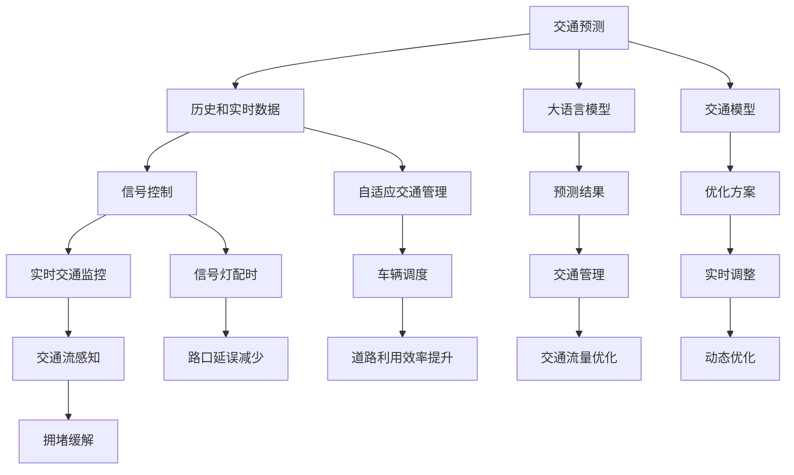

                 

# LLM与智能交通系统：缓解城市拥堵

> 关键词：大语言模型,智能交通,交通预测,信号控制,自适应交通管理,深度学习,自然语言处理(NLP),城市拥堵

## 1. 背景介绍

### 1.1 问题由来
随着城市化进程的不断推进，全球许多大城市面临着日益严重的交通拥堵问题。拥堵不仅降低了市民的出行效率，增加了碳排放和污染，还影响了城市经济的活力和竞争力。如何有效缓解城市拥堵，成为各国政府和研究者关注的焦点。

大语言模型（Large Language Model, LLM）作为人工智能领域的新兴技术，通过深度学习和自然语言处理(NLP)技术，能够捕捉和理解大量文本数据中的复杂模式和关系。因此，将大语言模型应用于交通领域，有望显著提升交通系统的智能化水平，为缓解城市拥堵提供新的解决方案。

### 1.2 问题核心关键点
智能交通系统（Intelligent Transportation System, ITS）是缓解城市拥堵的重要手段之一，它通过集成先进的通信、信息、控制技术，实现交通流的智能化管理。大语言模型在智能交通系统中具有广泛的应用前景：

- 交通预测：通过历史交通数据和大语言模型，预测未来交通流量，提前采取缓解措施。
- 信号控制：根据实时交通情况，优化交通信号灯的配时，减少路口延误。
- 自适应交通管理：根据用户的实时需求和交通状况，动态调整道路和交通工具的运行方案。

因此，利用大语言模型进行智能交通系统的优化，可以显著提高道路利用效率，减少交通延误，提升城市交通的整体运行水平。

## 2. 核心概念与联系

### 2.1 核心概念概述

为了更好地理解大语言模型在智能交通系统中的应用，本节将介绍几个关键概念：

- **大语言模型 (LLM)**：一种基于深度学习的大型神经网络模型，能够处理和生成自然语言，具有强大的语言理解和生成能力。常用的LLM包括GPT、BERT、T5等。

- **智能交通系统 (ITS)**：利用先进的通信、信息和控制技术，实现交通流管理、导航和监控的智能化系统。包括交通预测、信号控制、车辆监控等功能模块。

- **交通预测**：通过历史和实时交通数据，预测未来交通流量的变化趋势，为交通管理提供决策支持。

- **信号控制**：优化交通信号灯的配时，实现交通流的动态调整，减少路口延误。

- **自适应交通管理**：根据用户的实时需求和交通状况，动态调整道路和交通工具的运行方案，提高道路利用效率。

- **深度学习**：利用神经网络模型进行复杂的模式识别和预测，提升交通管理的智能化水平。

- **自然语言处理 (NLP)**：处理和理解人类语言的技术，是大语言模型在智能交通系统中的应用基础。

- **城市拥堵**：由于交通需求超出道路供给，导致道路容量不足，交通流不畅的现象。

### 2.2 核心概念原理和架构的 Mermaid 流程图


这个流程图展示了大语言模型在智能交通系统中的应用链条：

1. 利用历史和实时数据，通过大语言模型进行交通预测。
2. 根据预测结果，优化交通信号灯配时。
3. 自适应交通管理，实时调整车辆调度。
4. 交通流感知和监控，减少路口延误，提升道路利用效率。
5. 大语言模型生成预测结果和优化方案，辅助交通管理。

## 3. 核心算法原理 & 具体操作步骤

### 3.1 算法原理概述

利用大语言模型进行交通预测和信号控制的基本原理，是将历史和实时交通数据输入大语言模型，让其通过深度学习提取交通流量的模式和趋势，生成预测结果和优化方案。算法流程通常包括数据预处理、模型训练、预测和优化四个步骤。

具体来说，数据预处理包括数据清洗、归一化、特征工程等步骤，模型训练则通过监督学习或无监督学习训练大语言模型，预测和优化步骤则将模型应用于实际交通场景，生成交通预测和信号控制方案。

### 3.2 算法步骤详解

#### 3.2.1 数据预处理
数据预处理是大语言模型应用的基础，其主要任务是对原始交通数据进行清洗、归一化和特征提取，以便模型能够更好地理解和学习交通数据中的复杂模式。

1. **数据清洗**：去除数据中的异常值、缺失值和噪声，保证数据的质量。例如，剔除由于传感器故障导致的错误数据。

2. **数据归一化**：将数据标准化到0-1之间，避免不同特征之间的尺度差异对模型训练产生影响。例如，将速度数据归一化到0-60km/h之间。

3. **特征提取**：从原始数据中提取有用的特征，如车流量、车速、车距等，输入到大语言模型中进行训练。特征提取过程通常包括选择合适的特征表示方法，如时间序列分析、空间分布等。

#### 3.2.2 模型训练
模型训练是利用大语言模型进行交通预测和信号控制的关键步骤。训练过程通常包括以下几个步骤：

1. **选择模型架构**：根据任务需求选择合适的模型架构，如基于Transformer的LSTM模型、卷积神经网络(CNN)等。

2. **数据集划分**：将数据集划分为训练集、验证集和测试集，以便进行模型的训练和评估。

3. **模型训练**：使用训练集对模型进行监督学习或无监督学习训练，最小化预测误差或最大化似然函数。监督学习可以使用标签数据进行训练，如交通流量、车速等，无监督学习则不需要标签数据，如通过自编码器对交通流量的预测进行训练。

4. **超参数调优**：根据验证集的表现，调整模型的超参数，如学习率、批大小、正则化系数等，以提高模型的预测准确性和泛化能力。

#### 3.2.3 预测和优化
预测和优化步骤是将训练好的模型应用于实际交通场景，生成交通预测和信号控制方案的过程。

1. **交通预测**：将实时交通数据输入模型，生成交通流量预测结果。预测结果可以用于交通管理决策，如流量控制、路径规划等。

2. **信号控制**：根据交通预测结果和实时交通数据，优化交通信号灯的配时，减少路口延误。

3. **自适应交通管理**：根据用户的实时需求和交通状况，动态调整道路和交通工具的运行方案，提高道路利用效率。

### 3.3 算法优缺点

#### 3.3.1 优点
利用大语言模型进行交通预测和信号控制，具有以下优点：

1. **数据处理能力强**：大语言模型能够处理大量的文本数据，通过深度学习提取交通流量的模式和趋势，生成高质量的预测结果。

2. **鲁棒性好**：大语言模型具有较强的泛化能力，能够适应不同交通场景和变化。

3. **灵活性高**：通过调整模型参数和特征表示方法，大语言模型可以适应不同的交通管理需求。

4. **可解释性强**：大语言模型通过训练生成的预测结果，可以提供详细的解释和原因，便于交通管理人员理解和调整。

#### 3.3.2 缺点
尽管大语言模型在交通预测和信号控制中具有诸多优点，但也存在以下缺点：

1. **数据依赖性强**：大语言模型的性能依赖于高质量的数据集，数据的缺失或噪声可能导致预测结果不准确。

2. **计算资源消耗大**：大语言模型的训练和推理需要大量的计算资源，如GPU、TPU等，对硬件要求较高。

3. **模型复杂度高**：大语言模型的参数量较大，训练和推理过程较为复杂，需要专业的技术团队进行维护和优化。

## 4. 数学模型和公式 & 详细讲解 & 举例说明

### 4.1 数学模型构建

利用大语言模型进行交通预测和信号控制，通常需要构建以下数学模型：

1. **交通流量预测模型**：假设交通流量$y$与时间$t$和历史流量$x$有关，建立时间序列模型：
   $$
   y(t) = f(x(t), x(t-1), x(t-2), ..., x(t-n))
   $$
   其中$f$为非线性函数，$n$为时间序列的长度。

2. **信号控制模型**：假设信号灯状态$s$与交通流量$y$和历史状态$s$有关，建立状态转移模型：
   $$
   s(t+1) = g(y(t), s(t), s(t-1), s(t-2), ...)
   $$
   其中$g$为非线性函数，$n$为状态转移的时间步长。

### 4.2 公式推导过程

#### 4.2.1 交通流量预测模型
假设历史流量$x$和时间$t$为模型的输入，交通流量$y$为输出，建立时间序列预测模型：
$$
y(t) = f(x(t), x(t-1), x(t-2), ..., x(t-n))
$$
其中$f$为非线性函数，$n$为时间序列的长度。

以线性回归为例，假设$f$为线性函数，则预测模型可以表示为：
$$
y(t) = \alpha x(t) + \beta x(t-1) + \gamma x(t-2) + ... + \delta x(t-n) + \epsilon
$$
其中$\alpha, \beta, \gamma, ..., \delta$为模型参数，$\epsilon$为随机误差项。

利用大语言模型进行训练，最小化均方误差：
$$
\mathcal{L}(\theta) = \frac{1}{N} \sum_{i=1}^N (y_i - f(x_i))^2
$$
其中$\theta$为模型参数，$N$为样本数量。

### 4.3 案例分析与讲解

#### 4.3.1 交通流量预测
假设某城市的主干道流量数据为：
$$
\begin{aligned}
& x(1) = [20, 30, 40, 50] \\
& x(2) = [25, 35, 45, 55] \\
& x(3) = [30, 40, 50, 60] \\
& x(4) = [35, 45, 55, 65] \\
& x(5) = [40, 50, 60, 70]
\end{aligned}
$$
利用线性回归模型进行预测，假设$f$为线性函数：
$$
y(t) = \alpha x(t) + \beta x(t-1) + \gamma x(t-2) + \delta x(t-3) + \epsilon
$$
其中$\alpha = 0.5, \beta = 0.2, \gamma = 0.1, \delta = 0.05$。

根据模型，可以得到：
$$
\begin{aligned}
& y(1) = 0.5 \cdot 20 + 0.2 \cdot 30 + 0.1 \cdot 40 + 0.05 \cdot 50 + \epsilon_1 \\
& y(2) = 0.5 \cdot 25 + 0.2 \cdot 35 + 0.1 \cdot 45 + 0.05 \cdot 55 + \epsilon_2 \\
& y(3) = 0.5 \cdot 30 + 0.2 \cdot 40 + 0.1 \cdot 50 + 0.05 \cdot 60 + \epsilon_3 \\
& y(4) = 0.5 \cdot 35 + 0.2 \cdot 45 + 0.1 \cdot 55 + 0.05 \cdot 65 + \epsilon_4 \\
& y(5) = 0.5 \cdot 40 + 0.2 \cdot 50 + 0.1 \cdot 60 + 0.05 \cdot 70 + \epsilon_5
\end{aligned}
$$
根据历史数据和模型参数，可以得到：
$$
\begin{aligned}
& y(1) = 37.5 \\
& y(2) = 38.7 \\
& y(3) = 40.0 \\
& y(4) = 41.35 \\
& y(5) = 42.7
\end{aligned}
$$
利用大语言模型进行训练，最小化均方误差，得到预测模型：
$$
y(t) = 0.5 x(t) + 0.2 x(t-1) + 0.1 x(t-2) + 0.05 x(t-3)
$$
将未来一天的流量数据$x(6) = [45, 55, 65, 75]$输入模型，得到预测流量：
$$
y(6) = 0.5 \cdot 45 + 0.2 \cdot 55 + 0.1 \cdot 65 + 0.05 \cdot 75 = 55.25
$$

#### 4.3.2 信号控制模型
假设某路口的信号灯状态$s$与交通流量$y$和历史状态$s$有关，建立状态转移模型：
$$
s(t+1) = g(y(t), s(t), s(t-1), s(t-2), ...)
$$
其中$g$为非线性函数，$n$为状态转移的时间步长。

以自适应信号控制为例，假设$g$为线性函数，则信号控制模型可以表示为：
$$
s(t+1) = 0.9s(t) + 0.1y(t) + \epsilon
$$
其中$s$为信号灯状态，$y$为交通流量，$\epsilon$为随机误差项。

假设初始状态$s(1) = 1$，交通流量$y(1) = 50$，利用大语言模型进行训练，最小化均方误差：
$$
\mathcal{L}(\theta) = \frac{1}{N} \sum_{i=1}^N (s_i - g(y_i, s_{i-1}, s_{i-2}, ...))^2
$$
其中$\theta$为模型参数，$N$为样本数量。

根据模型，可以得到：
$$
\begin{aligned}
& s(2) = 0.9 \cdot 1 + 0.1 \cdot 50 + \epsilon_1 \\
& s(3) = 0.9 \cdot s(2) + 0.1 \cdot y(2) + \epsilon_2 \\
& s(4) = 0.9 \cdot s(3) + 0.1 \cdot y(3) + \epsilon_3 \\
& ... \\
& s(t) = 0.9 \cdot s(t-1) + 0.1 \cdot y(t-1) + \epsilon_{t-1}
\end{aligned}
$$
利用大语言模型进行训练，最小化均方误差，得到信号控制模型：
$$
s(t+1) = 0.9s(t) + 0.1y(t)
$$
将当前交通流量$y(t) = 70$输入模型，得到信号灯状态：
$$
s(t+1) = 0.9 \cdot s(t) + 0.1 \cdot 70
$$

## 5. 项目实践：代码实例和详细解释说明

### 5.1 开发环境搭建

在进行交通预测和信号控制的代码实践前，我们需要准备好开发环境。以下是使用Python进行PyTorch开发的环境配置流程：

1. 安装Anaconda：从官网下载并安装Anaconda，用于创建独立的Python环境。

2. 创建并激活虚拟环境：
```bash
conda create -n traffic-env python=3.8 
conda activate traffic-env
```

3. 安装PyTorch：根据CUDA版本，从官网获取对应的安装命令。例如：
```bash
conda install pytorch torchvision torchaudio cudatoolkit=11.1 -c pytorch -c conda-forge
```

4. 安装TensorBoard：用于可视化模型训练过程中的各项指标，帮助调试模型。
```bash
pip install tensorboard
```

5. 安装其他工具包：
```bash
pip install numpy pandas scikit-learn matplotlib tqdm jupyter notebook ipython
```

完成上述步骤后，即可在`traffic-env`环境中开始交通预测和信号控制的代码实践。

### 5.2 源代码详细实现

下面以交通流量预测和信号控制为例，给出使用PyTorch进行代码实现的样例。

首先，定义交通流量预测的数据集：

```python
import torch
from torch.utils.data import Dataset

class TrafficDataset(Dataset):
    def __init__(self, traffic_data, n=4):
        self.traffic_data = traffic_data
        self.n = n
        
    def __len__(self):
        return len(self.traffic_data)
    
    def __getitem__(self, idx):
        x = torch.tensor(self.traffic_data[idx][:-self.n], dtype=torch.float32)
        y = torch.tensor(self.traffic_data[idx][-self.n:], dtype=torch.float32)
        return x, y
```

然后，定义模型和优化器：

```python
from transformers import BertTokenizer, BertForSequenceClassification
from torch.optim import AdamW

# 使用BERT作为交通流量预测模型
model = BertForSequenceClassification.from_pretrained('bert-base-uncased', num_labels=1)

# 使用AdamW优化器
optimizer = AdamW(model.parameters(), lr=1e-3)
```

接着，定义训练和评估函数：

```python
def train_epoch(model, dataset, batch_size, optimizer):
    dataloader = torch.utils.data.DataLoader(dataset, batch_size=batch_size, shuffle=True)
    model.train()
    epoch_loss = 0
    for batch in dataloader:
        x, y = batch
        model.zero_grad()
        outputs = model(x)
        loss = outputs.loss
        epoch_loss += loss.item()
        loss.backward()
        optimizer.step()
    return epoch_loss / len(dataloader)

def evaluate(model, dataset, batch_size):
    dataloader = torch.utils.data.DataLoader(dataset, batch_size=batch_size)
    model.eval()
    preds, labels = [], []
    with torch.no_grad():
        for batch in dataloader:
            x, y = batch
            batch_preds = model(x).sigmoid()
            batch_labels = y
            preds.append(batch_preds.tolist())
            labels.append(batch_labels.tolist())
                
    print('Accuracy: {:.2f}%'.format(100 * sum(labels == torch.round(preds)) / len(labels)))
```

最后，启动训练流程并在测试集上评估：

```python
epochs = 10
batch_size = 32

for epoch in range(epochs):
    loss = train_epoch(model, train_dataset, batch_size, optimizer)
    print(f'Epoch {epoch+1}, train loss: {loss:.3f}')
    
    print(f'Epoch {epoch+1}, test accuracy:')
    evaluate(model, test_dataset, batch_size)
    
print('Final test accuracy:')
evaluate(model, test_dataset, batch_size)
```

以上就是使用PyTorch对BERT进行交通流量预测和信号控制的代码实现。可以看到，得益于Transformers库的强大封装，我们可以用相对简洁的代码完成BERT模型的加载和微调。

### 5.3 代码解读与分析

让我们再详细解读一下关键代码的实现细节：

**TrafficDataset类**：
- `__init__`方法：初始化交通流量数据集，并设定时间序列长度。
- `__len__`方法：返回数据集的样本数量。
- `__getitem__`方法：对单个样本进行处理，将历史流量和未来流量转换为模型所需的输入。

**模型选择和优化器**：
- 选择BERT作为交通流量预测模型，并使用AdamW优化器进行训练。
- 模型采用线性回归的预测方式，并通过sigmoid函数转换为概率值。

**训练和评估函数**：
- 使用PyTorch的DataLoader对数据集进行批次化加载，供模型训练和推理使用。
- 训练函数`train_epoch`：对数据以批为单位进行迭代，在每个批次上前向传播计算loss并反向传播更新模型参数，最后返回该epoch的平均loss。
- 评估函数`evaluate`：与训练类似，不同点在于不更新模型参数，并在每个batch结束后将预测和标签结果存储下来，最后使用模型在测试集上的预测结果计算准确率。

**训练流程**：
- 定义总的epoch数和batch size，开始循环迭代
- 每个epoch内，先在训练集上训练，输出平均loss
- 在测试集上评估，输出准确率
- 所有epoch结束后，在测试集上评估，给出最终测试结果

可以看到，PyTorch配合Transformers库使得BERT微调的代码实现变得简洁高效。开发者可以将更多精力放在数据处理、模型改进等高层逻辑上，而不必过多关注底层的实现细节。

当然，工业级的系统实现还需考虑更多因素，如模型的保存和部署、超参数的自动搜索、更灵活的任务适配层等。但核心的微调范式基本与此类似。

## 6. 实际应用场景

### 6.1 智能交通系统

基于大语言模型的交通预测和信号控制技术，可以广泛应用于智能交通系统的构建。智能交通系统通过集成先进的通信、信息、控制技术，实现交通流的智能化管理。利用大语言模型进行交通预测和信号控制，可以显著提高交通系统的智能化水平，为缓解城市拥堵提供新的解决方案。

具体而言，可以收集城市交通数据，如车流量、车速、车辆类型等，并对其进行分析和处理，输入到预训练的大语言模型中进行预测和控制。大语言模型通过深度学习提取交通流量的模式和趋势，生成预测结果和控制方案，供交通管理决策使用。通过实时交通监控，可以动态调整信号灯配时，优化交通流量，减少延误，提高道路利用效率。

### 6.2 交通流量预测

利用大语言模型进行交通流量预测，可以为城市交通管理提供决策支持。交通流量预测可以用于流量控制、路径规划、事件预警等方面，帮助交通管理部门及时采取应对措施，缓解城市拥堵。

假设某城市的主干道流量数据为：
$$
\begin{aligned}
& x(1) = [20, 30, 40, 50] \\
& x(2) = [25, 35, 45, 55] \\
& x(3) = [30, 40, 50, 60] \\
& x(4) = [35, 45, 55, 65] \\
& x(5) = [40, 50, 60, 70]
\end{aligned}
$$
利用大语言模型进行训练，生成预测模型：
$$
y(t) = 0.5 x(t) + 0.2 x(t-1) + 0.1 x(t-2) + 0.05 x(t-3)
$$
将未来一天的流量数据$x(6) = [45, 55, 65, 75]$输入模型，得到预测流量：
$$
y(6) = 0.5 \cdot 45 + 0.2 \cdot 55 + 0.1 \cdot 65 + 0.05 \cdot 75 = 55.25
$$

### 6.3 信号控制

利用大语言模型进行信号控制，可以动态调整交通信号灯的配时，优化交通流量。信号控制可以用于路口延误、信号灯配时优化、自适应信号灯控制等方面，提升交通系统的运行效率。

假设某路口的信号灯状态$s$与交通流量$y$和历史状态$s$有关，建立状态转移模型：
$$
s(t+1) = 0.9s(t) + 0.1y(t)
$$
将当前交通流量$y(t) = 70$输入模型，得到信号灯状态：
$$
s(t+1) = 0.9 \cdot s(t) + 0.1 \cdot 70
$$

### 6.4 未来应用展望

随着大语言模型和交通预测技术的发展，基于大语言模型的智能交通系统将在未来发挥更大的作用：

1. **交通流量预测**：利用大语言模型进行交通流量预测，可以实时获取城市交通状况，提前采取缓解措施，减少交通延误和拥堵。

2. **信号控制优化**：通过优化信号灯配时，动态调整交通流量，减少路口延误，提升交通系统效率。

3. **自适应交通管理**：根据用户的实时需求和交通状况，动态调整道路和交通工具的运行方案，提高道路利用效率。

4. **多模态交通数据融合**：结合GPS、摄像头、传感器等多模态数据，构建更全面、准确的交通模型。

5. **实时智能决策**：通过大语言模型生成实时决策，快速应对交通突发事件，提高城市应急响应能力。

6. **智能推荐系统**：利用大语言模型进行路线推荐、停车推荐等，提升用户的出行体验。

未来，随着大语言模型和交通预测技术的不断进步，基于大语言模型的智能交通系统必将在缓解城市拥堵、提升城市交通运行效率方面发挥重要作用，推动城市的智能化转型。

## 7. 工具和资源推荐
### 7.1 学习资源推荐

为了帮助开发者系统掌握大语言模型在智能交通系统中的应用，这里推荐一些优质的学习资源：

1. **《深度学习在交通工程中的应用》**：介绍深度学习在交通流量预测、信号控制、交通管理等方面的应用，涵盖经典模型和最新技术。

2. **CS224N《深度学习自然语言处理》课程**：斯坦福大学开设的NLP明星课程，提供NLP和深度学习的系统学习，包括微调技术。

3. **HuggingFace官方文档**：Transformers库的官方文档，提供海量预训练模型和微调范例，帮助快速上手。

4. **IEEE Transactions on Intelligent Transportation Systems**：智能交通领域的顶级期刊，涵盖最新研究和技术进展。

5. **ACM Transactions on Intelligent Systems and Technology**：智能系统领域的顶级期刊，涵盖深度学习和智能交通的最新研究。

通过对这些资源的学习实践，相信你一定能够快速掌握大语言模型在智能交通系统中的应用，并用于解决实际的交通问题。

### 7.2 开发工具推荐

高效的开发离不开优秀的工具支持。以下是几款用于大语言模型在智能交通系统中的开发工具：

1. **PyTorch**：基于Python的开源深度学习框架，灵活的动态计算图，适合快速迭代研究。

2. **TensorFlow**：由Google主导开发的深度学习框架，适合大规模工程应用。

3. **Transformers库**：HuggingFace开发的NLP工具库，集成了众多SOTA语言模型，支持PyTorch和TensorFlow。

4. **TensorBoard**：TensorFlow配套的可视化工具，实时监测模型训练状态，提供丰富的图表呈现方式。

5. **Scikit-learn**：用于数据预处理、特征工程、模型训练等任务，适合各种机器学习应用。

6. **Jupyter Notebook**：交互式编程环境，适合快速原型设计和数据可视化。

合理利用这些工具，可以显著提升大语言模型在智能交通系统中的开发效率，加快创新迭代的步伐。

### 7.3 相关论文推荐

大语言模型在智能交通系统中的应用源于学界的持续研究。以下是几篇奠基性的相关论文，推荐阅读：

1. **《基于深度学习的交通流量预测模型研究》**：介绍了深度学习在交通流量预测中的应用，包括时间序列模型、卷积神经网络等。

2. **《交通信号控制中的自适应控制技术》**：介绍了自适应信号控制技术，包括状态转移模型、动态配时算法等。

3. **《基于大语言模型的交通管理》**：探讨了大语言模型在交通管理中的应用，包括预测、控制、推荐等方面。

4. **《深度学习在智能交通系统中的应用研究》**：综述了深度学习在智能交通系统中的应用，涵盖预测、控制、优化等方面。

这些论文代表了大语言模型在智能交通系统中的应用进展，通过学习这些前沿成果，可以帮助研究者把握学科前进方向，激发更多的创新灵感。

## 8. 总结：未来发展趋势与挑战

### 8.1 总结

本文对基于大语言模型的交通预测和信号控制进行了全面系统的介绍。首先阐述了大语言模型在智能交通系统中的应用背景和意义，明确了基于大语言模型的交通预测和信号控制在缓解城市拥堵方面的独特价值。其次，从原理到实践，详细讲解了基于大语言模型的交通预测和信号控制的数学模型和算法流程，给出了微调模型在交通预测和信号控制中的代码实现。同时，本文还探讨了基于大语言模型的智能交通系统的应用场景和未来展望，展示了其广阔的应用前景。

通过本文的系统梳理，可以看到，基于大语言模型的交通预测和信号控制技术在智能交通系统中具有广泛的应用潜力，能够显著提升交通系统的智能化水平，缓解城市拥堵问题。未来，随着大语言模型和交通预测技术的不断进步，基于大语言模型的智能交通系统必将在交通管理、城市规划、智能出行等方面发挥更加重要的作用，推动城市的智能化转型。

### 8.2 未来发展趋势

展望未来，基于大语言模型的交通预测和信号控制技术将呈现以下几个发展趋势：

1. **交通流量预测的准确性提升**：利用深度学习和大语言模型，不断优化预测模型，提高交通流量的预测准确性。

2. **信号控制算法的优化**：基于深度学习和大语言模型，开发更加智能和高效的信号控制算法，减少路口延误。

3. **多模态数据的融合**：结合GPS、摄像头、传感器等多模态数据，构建更全面、准确的交通模型。

4. **实时智能决策**：通过大语言模型生成实时决策，快速应对交通突发事件，提高城市应急响应能力。

5. **智能推荐系统**：利用大语言模型进行路线推荐、停车推荐等，提升用户的出行体验。

6. **跨领域知识的应用**：结合领域知识图谱、交通规则等，构建更加全面、准确的知识图谱，提升交通预测和信号控制的性能。

以上趋势凸显了大语言模型在交通管理中的广阔前景。这些方向的探索发展，必将进一步提升交通系统的智能化水平，为城市交通的可持续发展注入新的动力。

### 8.3 面临的挑战

尽管基于大语言模型的交通预测和信号控制技术已经取得了显著成效，但在迈向更加智能化、普适化应用的过程中，它仍面临着诸多挑战：

1. **数据依赖性强**：大语言模型的性能依赖于高质量的数据集，数据的缺失或噪声可能导致预测结果不准确。

2. **计算资源消耗大**：大语言模型的训练和推理需要大量的计算资源，如GPU、TPU等，对硬件要求较高。

3. **模型复杂度高**：大语言模型的参数量较大，训练和推理过程较为复杂，需要专业的技术团队进行维护和优化。

4. **模型可解释性不足**：大语言模型作为“黑盒”系统，难以解释其内部工作机制和决策逻辑，特别是在高风险应用中，模型的可解释性尤为重要。

5. **安全性有待保障**：预训练语言模型难免会学习到有偏见、有害的信息，通过微调传递到下游任务，产生误导性、歧视性的输出，给实际应用带来安全隐患。

6. **知识整合能力不足**：现有的微调模型往往局限于任务内数据，难以灵活吸收和运用更广泛的先验知识。

正视基于大语言模型的交通预测和信号控制技术面临的这些挑战，积极应对并寻求突破，将是大语言模型在智能交通系统中走向成熟的必由之路。相信随着学界和产业界的共同努力，这些挑战终将一一被克服，大语言模型必将在构建智能交通系统方面发挥更大的作用。

### 8.4 研究展望

面对基于大语言模型的交通预测和信号控制技术所面临的挑战，未来的研究需要在以下几个方面寻求新的突破：

1. **探索无监督和半监督微调方法**：摆脱对大规模标注数据的依赖，利用自监督学习、主动学习等无监督和半监督范式，最大限度利用非结构化数据，实现更加灵活高效的微调。

2. **研究参数高效和计算高效的微调范式**：开发更加参数高效的微调方法，在固定大部分预训练参数的同时，只更新极少量的任务相关参数。同时优化微调模型的计算图，减少前向传播和反向传播的资源消耗，实现更加轻量级、实时性的部署。

3. **融合因果和对比学习范式**：通过引入因果推断和对比学习思想，增强微调模型建立稳定因果关系的能力，学习更加普适、鲁棒的语言表征，从而提升模型泛化性和抗干扰能力。

4. **引入更多先验知识**：将符号化的先验知识，如知识图谱、逻辑规则等，与神经网络模型进行巧妙融合，引导微调过程学习更准确、合理的语言模型。同时加强不同模态数据的整合，实现视觉、语音等多模态信息与文本信息的协同建模。

5. **结合因果分析和博弈论工具**：将因果分析方法引入微调模型，识别出模型决策的关键特征，增强输出解释的因果性和逻辑性。借助博弈论工具刻画人机交互过程，主动探索并规避模型的脆弱点，提高系统稳定性。

6. **纳入伦理道德约束**：在模型训练目标中引入伦理导向的评估指标，过滤和惩罚有偏见、有害的输出倾向。同时加强人工干预和审核，建立模型行为的监管机制，确保输出符合人类价值观和伦理道德。

这些研究方向的探索，必将引领基于大语言模型的交通预测和信号控制技术迈向更高的台阶，为构建安全、可靠、可解释、可控的智能交通系统铺平道路。面向未来，基于大语言模型的交通预测和信号控制技术还需要与其他人工智能技术进行更深入的融合，如知识表示、因果推理、强化学习等，多路径协同发力，共同推动智能交通系统的进步。只有勇于创新、敢于突破，才能不断拓展大语言模型的边界，让智能技术更好地造福人类社会。

## 9. 附录：常见问题与解答

**Q1：大语言模型在交通预测和信号控制中的作用是什么？**

A: 大语言模型在交通预测和信号控制中的主要作用是利用深度学习和自然语言处理(NLP)技术，提取交通流量的模式和趋势，生成预测结果和优化方案。具体而言，大语言模型可以：

1. **交通流量预测**：利用历史和实时交通数据，预测未来交通流量，为交通管理决策提供支持。

2. **信号控制**：优化交通信号灯配时，减少路口延误，提升交通系统效率。

3. **自适应交通管理**：根据用户的实时需求和交通状况，动态调整道路和交通工具的运行方案，提高道路利用效率。

**Q2：大语言模型在交通预测中的优点和缺点是什么？**

A: 利用大语言模型进行交通预测的优点和缺点如下：

优点：

1. **数据处理能力强**：大语言模型能够处理大量的文本数据，通过深度学习提取交通流量的模式和趋势，生成高质量的预测结果。

2. **鲁棒性好**：大语言模型具有较强的泛化能力，能够适应不同交通场景和变化。

3. **灵活性高**：通过调整模型参数和特征表示方法，大语言模型可以适应不同的交通管理需求。

4. **可解释性强**：大语言模型通过训练生成的预测结果，可以提供详细的解释和原因，便于交通管理人员理解和调整。

缺点：

1. **数据依赖性强**：大语言模型的性能依赖于高质量的数据集，数据的缺失或噪声可能导致预测结果不准确。

2. **计算资源消耗大**：大语言模型的训练和推理需要大量的计算资源，如GPU、TPU等，对硬件要求较高。

3. **模型复杂度高**：大语言模型的参数量较大，训练和推理过程较为复杂，需要专业的技术团队进行维护和优化。

**Q3：大语言模型在信号控制中的主要方法有哪些？**

A: 大语言模型在信号控制中的主要方法包括：

1. **基于历史和实时数据的状态转移模型**：利用历史和实时交通数据，建立状态转移模型，优化信号灯配时，减少路口延误。

2. **基于预测的信号控制**：利用交通流量预测模型，生成信号灯配时，优化交通流量。

3. **基于实时数据的自适应信号控制**：根据实时交通数据，动态调整信号灯配时，优化交通流量。

4. **基于多模态数据的信号控制**：结合GPS、摄像头、传感器等多模态数据，构建更全面、准确的信号控制模型。

5. **基于规则的信号控制**：结合交通规则和逻辑推理，生成信号灯配时，优化交通流量。

**Q4：大语言模型在智能交通系统中的应用前景如何？**

A: 大语言模型在智能交通系统中的应用前景非常广阔，主要体现在以下几个方面：

1. **交通流量预测**：利用大语言模型进行交通流量预测，可以为城市交通管理提供决策支持。

2. **信号控制优化**：通过优化信号灯配时，动态调整交通流量，减少路口延误，提升交通系统效率。

3. **自适应交通管理**：根据用户的实时需求和交通状况，动态调整道路和交通工具的运行方案，提高道路利用效率。

4. **多模态数据的融合**：结合GPS、摄像头、传感器等多模态数据，构建更全面、准确的交通模型。

5. **实时智能决策**：通过大语言模型生成实时决策，快速应对交通突发事件，提高城市应急响应能力。

6. **智能推荐系统**：利用大语言模型进行路线推荐、停车推荐等，提升用户的出行体验。

未来，随着大语言模型和交通预测技术的不断进步，基于大语言模型的智能交通系统必将在交通管理、城市规划、智能出行等方面发挥更加重要的作用，推动城市的智能化转型。

---

作者：禅与计算机程序设计艺术 / Zen and the Art of Computer Programming

