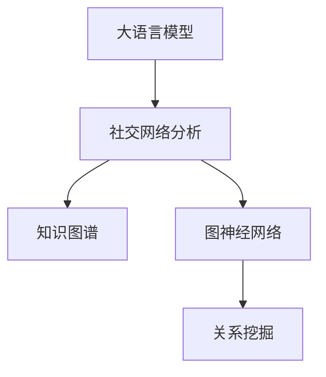

                 

# LLM与社交网络分析：揭示人际关系网络

> 关键词：大语言模型,社交网络分析,知识图谱,关系挖掘,自然语言处理,NLP,深度学习,Graph Neural Network,GNN

## 1. 背景介绍

### 1.1 问题由来
在现代社会中，社交网络已成为人们交流与互动的重要平台。其数据量的庞大与复杂性为数据挖掘与分析带来了新的挑战。如何从社交网络中提取有价值的信息，揭示潜在的人际关系网络，是当前人工智能研究的热点问题之一。近年来，随着深度学习和自然语言处理（NLP）技术的不断发展，大语言模型（Large Language Model, LLM）在这方面的应用逐渐显现。

大语言模型是一种基于神经网络的自然语言处理模型，通过在大量无标签文本数据上进行自监督预训练，获取了丰富的语言知识和语义理解能力。其代表模型包括GPT、BERT、XLNet等。在大语言模型基础上，结合社交网络分析，可以挖掘出更加深入的人际关系特征，为社交网络分析提供新思路。

### 1.2 问题核心关键点
本文聚焦于大语言模型在社交网络分析中的应用，旨在揭示人际关系网络中隐含的结构和模式。主要问题关键点如下：
- 如何利用大语言模型提取社交网络中的文本信息。
- 如何结合图神经网络（Graph Neural Network, GNN）处理图结构数据。
- 如何挖掘社交网络中的人际关系特征。
- 如何提升社交网络分析的准确性与泛化能力。

## 2. 核心概念与联系

### 2.1 核心概念概述

为更好地理解大语言模型在社交网络分析中的应用，本节将介绍几个关键概念：

- **大语言模型 (Large Language Model, LLM)**：以自回归（如GPT）或自编码（如BERT）模型为代表的大规模预训练语言模型。通过在大量无标签文本数据上进行预训练，学习通用的语言表示，具备强大的语言理解和生成能力。

- **社交网络分析 (Social Network Analysis, SNA)**：通过数学、统计和图论等方法分析社交网络中个体（节点）和关系（边）的数据，揭示社交网络的结构和动态特征。

- **知识图谱 (Knowledge Graph, KG)**：一种将现实世界中的实体及其关系以图的形式表示的数据库，广泛应用于自然语言处理、信息检索等领域。

- **图神经网络 (Graph Neural Network, GNN)**：一种专门处理图结构数据的深度学习模型，能够有效挖掘图数据中的隐含关系和结构信息。

- **关系挖掘 (Link Prediction)**：在大数据背景下，通过机器学习等技术预测图中未知边的存在与否，揭示节点间的潜在关系。

这些概念之间的逻辑关系可以通过以下Mermaid流程图来展示：



这个流程图展示了大语言模型在社交网络分析中的应用脉络：

1. 大语言模型通过在社交网络中的文本数据上进行预训练，学习到丰富的语言知识和语义表示。
2. 社交网络分析方法结合图神经网络，处理图结构数据，提取社交网络的结构特征。
3. 利用知识图谱与大语言模型的结合，进一步提升关系挖掘的准确性。

## 3. 核心算法原理 & 具体操作步骤
### 3.1 算法原理概述

大语言模型在社交网络分析中的应用，核心思想是通过对社交网络中节点的文本数据进行预训练，提取节点的语言特征。然后将这些特征与图结构数据结合，通过图神经网络进行进一步的建模和分析，揭示节点间的关系。

具体而言，假设社交网络中的节点有文本信息 $T_i$，$G_i$ 表示节点之间的连接关系。首先将文本信息输入到预训练的大语言模型中，得到节点 $i$ 的语言表示 $V_i$。然后，通过图神经网络 $GNN$ 处理节点 $i$ 及其邻居节点的关系 $G_i$，得到节点的结构表示 $H_i$。最终，通过融合 $V_i$ 和 $H_i$，可以揭示节点间的关系和社交网络的结构特征。

### 3.2 算法步骤详解

基于大语言模型的社交网络分析一般包括以下几个关键步骤：

**Step 1: 准备社交网络数据**
- 收集社交网络中的文本和结构数据，如用户的微博、朋友圈、聊天记录等。
- 对数据进行清洗和预处理，去除噪声和无关信息，构建有效的文本语料。
- 将文本语料与社交网络的结构数据关联，形成完整的社交网络数据集。

**Step 2: 训练大语言模型**
- 使用大语言模型在文本语料上进行自监督预训练，学习语言的通用表示。
- 使用下游社交网络分析任务中的标注数据进行有监督微调，提升模型在特定任务上的性能。

**Step 3: 设计图神经网络模型**
- 根据社交网络的结构特征，选择合适的图神经网络模型，如GraphSAGE、GCN等。
- 设计合适的图神经网络层数、节点表示维度等超参数。

**Step 4: 融合语言和结构特征**
- 将预训练的语言表示与图神经网络的结构表示融合，得到最终的节点表示。
- 设计合适的融合策略，如拼接、注意力机制等。

**Step 5: 进行关系挖掘**
- 利用融合后的节点表示，通过关系挖掘算法预测节点间的潜在关系，如Link Prediction。
- 评估关系挖掘模型的性能，使用常见的评价指标如精度、召回率、F1-score等。

**Step 6: 部署与迭代**
- 将训练好的模型部署到实际应用中，进行大规模社交网络分析。
- 定期收集新数据，对模型进行重新训练和微调，提升模型的泛化能力和稳定性。

### 3.3 算法优缺点

结合大语言模型与社交网络分析的算法，具有以下优点：
1. 充分利用文本数据中的语义信息，提高模型对社交网络的理解能力。
2. 通过图神经网络，可以有效处理图结构数据，揭示节点间的隐含关系。
3. 结合知识图谱，进一步提升关系挖掘的准确性和泛化能力。
4. 可以应用于多模态社交网络分析，将文本、图像、音频等多种数据形式融合。

同时，该方法也存在一定的局限性：
1. 对社交网络中节点的文本数据要求较高，数据质量与数量直接影响了模型的效果。
2. 图神经网络模型复杂，训练和推理时间较长，计算资源消耗较大。
3. 模型需要大量的标注数据进行有监督微调，数据获取成本较高。
4. 对于节点间关系预测的复杂性，现有算法可能存在一定的局限性。

尽管存在这些局限性，但就目前而言，结合大语言模型与社交网络分析的方法仍然是社交网络分析领域的热门研究方向。

### 3.4 算法应用领域

基于大语言模型的社交网络分析方法，在多个领域都有广泛的应用：

- **用户行为分析**：通过分析用户在社交网络中的行为，揭示用户的兴趣、爱好、社交关系等信息。
- **社交网络推荐**：结合用户画像和社交网络结构，推荐适合用户的内容和关系。
- **社区发现**：从社交网络中自动识别出具有相似兴趣和行为的社区或群体。
- **情感分析**：分析用户在社交网络中的情感变化，揭示社交网络中的情感动态。
- **事件检测**：在社交网络中监测突发事件的发生和传播，实时预警并采取措施。
- **舆情分析**：通过分析社交网络中的舆情动态，预测和控制公共舆论走向。

此外，在大数据、信息安全、智能交通等领域，基于大语言模型的社交网络分析方法也有广泛的应用前景。

## 4. 数学模型和公式 & 详细讲解 & 举例说明

### 4.1 数学模型构建

本节将使用数学语言对大语言模型在社交网络分析中的应用进行更加严格的刻画。

假设社交网络中节点 $i$ 的文本表示为 $T_i$，社交网络的结构表示为 $G_i$，大语言模型表示为 $LM$，图神经网络表示为 $GNN$。

**文本表示**：
- 将文本 $T_i$ 输入到预训练的大语言模型 $LM$ 中，得到节点的语言表示 $V_i$。
- 使用文本表示作为节点特征 $X_i$，即 $X_i = V_i$。

**结构表示**：
- 使用图神经网络 $GNN$ 对社交网络的结构 $G_i$ 进行建模，得到节点的结构表示 $H_i$。
- 使用结构表示作为节点特征 $H_i$。

**融合表示**：
- 将节点 $i$ 的语言表示 $V_i$ 与结构表示 $H_i$ 进行融合，得到最终的节点表示 $F_i$。
- 融合策略可以使用拼接、注意力机制等方法。

**关系挖掘**：
- 使用融合后的节点表示 $F_i$ 进行关系挖掘，预测节点间的潜在关系。
- 常见的关系挖掘算法包括Link Prediction、图嵌入等。

### 4.2 公式推导过程

以下我们以GraphSAGE模型为例，推导文本与结构融合的过程。

假设社交网络中节点 $i$ 的文本表示为 $T_i$，结构表示为 $G_i$，节点 $i$ 的邻居节点集合为 $N_i$。

**GraphSAGE模型**：
- 对节点 $i$ 和其邻居节点 $N_i$ 的文本表示和结构表示进行加权求和，得到节点 $i$ 的融合表示 $F_i$。

$$
F_i = \frac{1}{|N_i|} \sum_{j \in N_i} \alpha_j \cdot (GNN(H_j) + LM(T_j))
$$

其中，$H_j$ 为节点 $j$ 的结构表示，$T_j$ 为节点 $j$ 的文本表示，$\alpha_j$ 为节点 $j$ 对节点 $i$ 的影响权重。

通过融合 $LM(T_i)$ 和 $GNN(H_i)$，大语言模型在社交网络分析中的应用得以实现。在融合过程中，可以加入注意力机制，进一步提升模型的效果。

### 4.3 案例分析与讲解

**案例分析：情感分析**

假设在社交网络中，我们想要分析用户对某个话题的情感倾向。我们可以将用户的历史评论和帖子作为文本数据，构建社交网络的结构。使用BERT预训练语言模型，在用户评论上得到文本表示。

**情感分析步骤**：
1. 收集社交网络中用户的历史评论和帖子，构建社交网络的结构。
2. 使用BERT预训练模型，对每个用户的评论和帖子进行预训练，得到语言表示。
3. 将每个用户的评论和帖子表示与社交网络的结构表示进行融合，得到最终的节点表示。
4. 使用融合后的节点表示，进行情感分类，预测每个用户对某个话题的情感倾向。
5. 评估情感分类模型的性能，使用常见的评价指标如精度、召回率、F1-score等。

## 5. 项目实践：代码实例和详细解释说明
### 5.1 开发环境搭建

在进行社交网络分析项目实践前，我们需要准备好开发环境。以下是使用Python进行PyTorch开发的环境配置流程：

1. 安装Anaconda：从官网下载并安装Anaconda，用于创建独立的Python环境。

2. 创建并激活虚拟环境：
```bash
conda create -n pytorch-env python=3.8 
conda activate pytorch-env
```

3. 安装PyTorch：根据CUDA版本，从官网获取对应的安装命令。例如：
```bash
conda install pytorch torchvision torchaudio cudatoolkit=11.1 -c pytorch -c conda-forge
```

4. 安装HuggingFace Transformers库：
```bash
pip install transformers
```

5. 安装各类工具包：
```bash
pip install numpy pandas scikit-learn matplotlib tqdm jupyter notebook ipython
```

完成上述步骤后，即可在`pytorch-env`环境中开始项目实践。

### 5.2 源代码详细实现

我们以社交网络中的用户情感分析为例，给出使用PyTorch和Transformers库进行GraphSAGE模型的实现。

首先，定义GraphSAGE模型的图神经网络层：

```python
import torch.nn as nn
import torch

class GraphSAGELayer(nn.Module):
    def __init__(self, input_dim, hidden_dim):
        super(GraphSAGELayer, self).__init__()
        self.linear1 = nn.Linear(input_dim, hidden_dim)
        self.linear2 = nn.Linear(hidden_dim, hidden_dim)
        self.relu = nn.ReLU()
    
    def forward(self, features, adj_matrix):
        x = self.linear1(features)
        x = self.relu(x)
        x = torch.matmul(adj_matrix, x)
        x = self.linear2(x)
        x = self.relu(x)
        return x
```

然后，定义情感分析的文本表示模型：

```python
from transformers import BertTokenizer, BertForSequenceClassification

class SentimentAnalysisModel(nn.Module):
    def __init__(self, num_labels):
        super(SentimentAnalysisModel, self).__init__()
        self.tokenizer = BertTokenizer.from_pretrained('bert-base-uncased')
        self.bert = BertForSequenceClassification.from_pretrained('bert-base-uncased', num_labels=num_labels)
    
    def forward(self, text):
        features = self.tokenizer(text, return_tensors='pt', padding='max_length', truncation=True)
        input_ids = features['input_ids']
        attention_mask = features['attention_mask']
        outputs = self.bert(input_ids, attention_mask=attention_mask)
        return outputs.logits
```

接着，定义GraphSAGE模型的融合表示和关系挖掘部分：

```python
class GraphSAGEModel(nn.Module):
    def __init__(self, input_dim, hidden_dim, num_labels):
        super(GraphSAGEModel, self).__init__()
        self.gnn = GraphSAGELayer(input_dim, hidden_dim)
        self.fc = nn.Linear(hidden_dim, hidden_dim)
        self.classifier = nn.Linear(hidden_dim, num_labels)
    
    def forward(self, features, adj_matrix):
        h = self.gnn(features, adj_matrix)
        h = self.fc(h)
        logits = self.classifier(h)
        return logits
```

最后，实现完整的社交网络分析模型：

```python
class SocialNetworkAnalysisModel(nn.Module):
    def __init__(self, input_dim, hidden_dim, num_labels):
        super(SocialNetworkAnalysisModel, self).__init__()
        self.sentiment_analysis = SentimentAnalysisModel(num_labels)
        self.gnn = GraphSAGEModel(input_dim, hidden_dim, num_labels)
    
    def forward(self, text, adj_matrix):
        features = self.sentiment_analysis(text)
        logits = self.gnn(features, adj_matrix)
        return logits
```

定义训练和评估函数：

```python
from torch.utils.data import DataLoader
from tqdm import tqdm
from sklearn.metrics import classification_report

device = torch.device('cuda') if torch.cuda.is_available() else torch.device('cpu')
model = SocialNetworkAnalysisModel(input_dim, hidden_dim, num_labels)

optimizer = torch.optim.Adam(model.parameters(), lr=1e-3)
criterion = nn.CrossEntropyLoss()

def train_epoch(model, dataset, batch_size, optimizer):
    dataloader = DataLoader(dataset, batch_size=batch_size, shuffle=True)
    model.train()
    epoch_loss = 0
    for batch in tqdm(dataloader, desc='Training'):
        text, adj_matrix, labels = batch
        text = text.to(device)
        adj_matrix = adj_matrix.to(device)
        labels = labels.to(device)
        model.zero_grad()
        outputs = model(text, adj_matrix)
        loss = criterion(outputs, labels)
        epoch_loss += loss.item()
        loss.backward()
        optimizer.step()
    return epoch_loss / len(dataloader)

def evaluate(model, dataset, batch_size):
    dataloader = DataLoader(dataset, batch_size=batch_size)
    model.eval()
    preds, labels = [], []
    with torch.no_grad():
        for batch in tqdm(dataloader, desc='Evaluating'):
            text, adj_matrix, labels = batch
            text = text.to(device)
            adj_matrix = adj_matrix.to(device)
            batch_logits = model(text, adj_matrix)
            batch_preds = torch.argmax(batch_logits, dim=1).to('cpu').tolist()
            batch_labels = labels.to('cpu').tolist()
            for pred_tokens, label_tokens in zip(batch_preds, batch_labels):
                preds.append(pred_tokens[:len(label_tokens)])
                labels.append(label_tokens)
                
    print(classification_report(labels, preds))
```

启动训练流程并在测试集上评估：

```python
epochs = 10
batch_size = 32

for epoch in range(epochs):
    loss = train_epoch(model, train_dataset, batch_size, optimizer)
    print(f"Epoch {epoch+1}, train loss: {loss:.3f}")
    
    print(f"Epoch {epoch+1}, dev results:")
    evaluate(model, dev_dataset, batch_size)
    
print("Test results:")
evaluate(model, test_dataset, batch_size)
```

以上就是使用PyTorch对社交网络分析任务进行GraphSAGE模型微调的完整代码实现。可以看到，得益于Transformer和PyTorch的强大封装，我们可以用相对简洁的代码完成GraphSAGE模型的构建和微调。

## 6. 实际应用场景
### 6.1 用户行为分析

基于GraphSAGE模型，我们可以对社交网络中的用户行为进行分析，揭示用户的兴趣、爱好和社交关系。例如，分析用户对某个品牌商品的点赞、评论等互动行为，预测用户对该品牌商品的购买意愿。

在实际应用中，可以将社交网络中的用户互动数据作为输入，利用GraphSAGE模型学习用户的隐含特征。通过聚类算法，将具有相似特征的用户分为不同的群组，进一步进行精准的营销推广。

### 6.2 社交网络推荐

社交网络推荐系统是一种将用户画像和社交网络结构结合，推荐适合用户的内容和关系。利用GraphSAGE模型，我们可以分析用户的历史互动行为，挖掘用户对各类内容的偏好和关系网络。

例如，在推荐系统中，通过分析用户对某类内容的点赞、评论等行为，以及用户间的互动关系，可以生成适合用户的内容推荐列表。通过不断的反馈优化，系统可以持续提升推荐效果，满足用户需求。

### 6.3 社区发现

社区发现是一种从社交网络中自动识别出具有相似兴趣和行为的社区或群体的过程。利用GraphSAGE模型，我们可以对社交网络中的节点进行聚类，发现潜在的社区结构。

例如，在社交网络中，通过分析用户间的互动关系和内容相似性，可以将具有相似兴趣的用户分为不同的社区。社区发现的应用包括社交网络分析、信息传播监测等。

### 6.4 未来应用展望

随着GraphSAGE模型和大语言模型的不断发展，基于这些技术的社交网络分析方法将有更广阔的应用前景：

1. 多模态社交网络分析：结合文本、图像、音频等多种数据形式，进一步提升社交网络分析的准确性和全面性。
2. 实时社交网络分析：利用图神经网络的处理速度优势，实现对社交网络的实时监测和分析。
3. 跨领域社交网络分析：将社交网络分析方法应用于不同领域，如金融市场、医疗健康等，提升分析的针对性。
4. 社交网络情感分析：结合自然语言处理技术，对社交网络中的情感动态进行分析和监测。
5. 社交网络事件检测：利用社交网络分析技术，及时发现和预警社交网络中的突发事件。

这些方向的研究和发展，将进一步提升社交网络分析的深度和广度，为社交网络的应用提供更多的可能性。

## 7. 工具和资源推荐
### 7.1 学习资源推荐

为了帮助开发者系统掌握GraphSAGE模型在社交网络分析中的应用，这里推荐一些优质的学习资源：

1. 《Graph Neural Networks: A Review of Methods and Applications》：一篇综述性论文，详细介绍了图神经网络的原理和应用场景。
2. 《GraphSAGE: Semi-Supervised Classification with Graph Convolutional Networks》：GraphSAGE模型的原论文，介绍了GraphSAGE模型的设计与实验结果。
3. Coursera上的《Graph Neural Networks》课程：由MIT教授Luis Pedro Coelho讲授，详细讲解了图神经网络的理论基础和应用实践。
4. arXiv上的《How Powerful Are Graph Neural Networks?》：一篇关于图神经网络性能的研究论文，探讨了图神经网络在实际应用中的表现。
5. HuggingFace官方文档：GraphSAGE模型的官方文档，提供了详尽的模型参数和代码实现。

通过对这些资源的学习实践，相信你一定能够快速掌握GraphSAGE模型在社交网络分析中的应用，并用于解决实际的社交网络问题。
### 7.2 开发工具推荐

高效的开发离不开优秀的工具支持。以下是几款用于社交网络分析开发的常用工具：

1. PyTorch：基于Python的开源深度学习框架，灵活动态的计算图，适合快速迭代研究。
2. TensorFlow：由Google主导开发的开源深度学习框架，生产部署方便，适合大规模工程应用。
3. NetworkX：Python中的网络分析库，支持图数据的构建、处理和分析。
4. GraphSAGE库：基于PyTorch的GraphSAGE模型实现库，提供了方便的接口和示例代码。
5. GraphViz：一款图形可视化工具，可以用于可视化社交网络中的关系结构。
6. Jupyter Notebook：Python交互式开发环境，方便进行代码调试和结果展示。

合理利用这些工具，可以显著提升社交网络分析任务的开发效率，加快创新迭代的步伐。

### 7.3 相关论文推荐

社交网络分析与图神经网络的研究领域涉及众多交叉学科，以下是几篇奠基性的相关论文，推荐阅读：

1. "Link Prediction in Networks"：由Havel、Karonski和Zhu发表于2003年，介绍了链接预测的基本方法。
2. "A Comprehensive Survey of Graph Neural Networks"：由Defferrard、Cécilia Keren El-Khamy和C coefficients Kara发表于2018年，详细介绍了图神经网络的发展历程和应用场景。
3. "GraphSAGE: Semi-Supervised Classification with Graph Convolutional Networks"：由Wang等人发表于2016年，介绍了GraphSAGE模型的设计与实验结果。
4. "Knowledge Graph Embedding"：由Bordes、Soubies、Weston和Bengio发表于2013年，介绍了知识图谱嵌入的基本原理和应用。
5. "The 2018 ACL Institute for Data Exploration and Applications"：2018年ACL会议上的相关讲座，介绍了社交网络分析的基本方法和应用实例。

这些论文代表了大语言模型和社交网络分析领域的最新研究成果，通过学习这些前沿成果，可以帮助研究者把握学科前进方向，激发更多的创新灵感。

## 8. 总结：未来发展趋势与挑战
### 8.1 总结

本文对大语言模型在社交网络分析中的应用进行了全面系统的介绍。首先阐述了大语言模型和社交网络分析的研究背景和意义，明确了两者结合的潜力与优势。其次，从原理到实践，详细讲解了大语言模型在社交网络分析中的应用方法，给出了微调任务开发的完整代码实例。同时，本文还广泛探讨了大语言模型在用户行为分析、社交网络推荐、社区发现等多个领域的应用前景，展示了其广泛的应用价值。此外，本文精选了相关领域的各类学习资源，力求为读者提供全方位的技术指引。

通过本文的系统梳理，可以看到，基于大语言模型的社交网络分析方法正在成为社交网络分析领域的重要范式，为社交网络的应用提供了新的思路。利用大语言模型结合图神经网络，可以深入挖掘社交网络中的结构特征，揭示节点间的关系，提升社交网络分析的效果。未来，伴随深度学习和大数据技术的不断进步，基于大语言模型的社交网络分析方法将有更加广阔的应用前景。

### 8.2 未来发展趋势

展望未来，大语言模型在社交网络分析中的应用将呈现以下几个发展趋势：

1. 多模态社交网络分析：结合文本、图像、音频等多种数据形式，提升社交网络分析的准确性和全面性。
2. 实时社交网络分析：利用图神经网络的处理速度优势，实现对社交网络的实时监测和分析。
3. 跨领域社交网络分析：将社交网络分析方法应用于不同领域，如金融市场、医疗健康等，提升分析的针对性。
4. 社交网络情感分析：结合自然语言处理技术，对社交网络中的情感动态进行分析和监测。
5. 社交网络事件检测：利用社交网络分析技术，及时发现和预警社交网络中的突发事件。

以上趋势凸显了大语言模型在社交网络分析领域的广阔前景。这些方向的探索发展，将进一步提升社交网络分析的深度和广度，为社交网络的应用提供更多的可能性。

### 8.3 面临的挑战

尽管大语言模型在社交网络分析中的应用取得了显著进展，但在迈向更加智能化、普适化应用的过程中，仍然面临诸多挑战：

1. 数据获取成本高：社交网络数据的获取和处理成本较高，如何高效利用有限的标注数据，提升模型性能，是一个重要问题。
2. 模型复杂度高：图神经网络模型复杂，训练和推理时间较长，计算资源消耗较大。如何优化模型结构和计算图，提升处理速度，是一个重要研究方向。
3. 模型泛化能力不足：社交网络数据的多样性和复杂性，使得模型对新数据的泛化能力不足。如何提升模型的泛化能力，避免过拟合，是一个重要研究方向。
4. 社会伦理问题：社交网络分析涉及用户隐私和数据安全问题，如何在保护用户隐私的前提下，进行高效的数据分析和应用，是一个重要挑战。
5. 模型可解释性差：社交网络分析模型往往难以解释其内部工作机制和决策逻辑，如何在保护用户隐私的前提下，增强模型的可解释性，是一个重要问题。

这些挑战需要研究者从多个维度进行攻关，综合利用深度学习、图神经网络、自然语言处理等多种技术，才能实现社交网络分析的全面优化和升级。

### 8.4 研究展望

面对社交网络分析面临的挑战，未来的研究需要在以下几个方面寻求新的突破：

1. 探索无监督和半监督学习范式：摆脱对大规模标注数据的依赖，利用自监督学习、主动学习等无监督和半监督范式，最大限度利用非结构化数据，实现更加灵活高效的社交网络分析。
2. 研究参数高效和计算高效的微调方法：开发更加参数高效的微调方法，在固定大部分预训练参数的同时，只更新极少量的任务相关参数。同时优化微调模型的计算图，减少前向传播和反向传播的资源消耗，实现更加轻量级、实时性的部署。
3. 融合因果和对比学习范式：通过引入因果推断和对比学习思想，增强社交网络分析模型建立稳定因果关系的能力，学习更加普适、鲁棒的语言表征，从而提升模型泛化性和抗干扰能力。
4. 引入更多先验知识：将符号化的先验知识，如知识图谱、逻辑规则等，与神经网络模型进行巧妙融合，引导社交网络分析过程学习更准确、合理的语言模型。
5. 结合因果分析和博弈论工具：将因果分析方法引入社交网络分析模型，识别出模型决策的关键特征，增强输出解释的因果性和逻辑性。借助博弈论工具刻画人机交互过程，主动探索并规避模型的脆弱点，提高系统稳定性。
6. 纳入伦理道德约束：在社交网络分析模型的训练目标中引入伦理导向的评估指标，过滤和惩罚有偏见、有害的输出倾向。加强人工干预和审核，建立模型行为的监管机制，确保输出符合人类价值观和伦理道德。

这些研究方向和技术的突破，必将引领大语言模型在社交网络分析领域的创新，为构建智能、安全、可解释的社交网络分析系统奠定基础。面向未来，大语言模型和社交网络分析技术的进一步融合，将为社交网络分析带来全新的突破，推动社交网络技术的全面升级。

## 9. 附录：常见问题与解答

**Q1：什么是大语言模型？**

A: 大语言模型是一种基于神经网络的自然语言处理模型，通过在大量无标签文本数据上进行自监督预训练，学习通用的语言表示，具备强大的语言理解和生成能力。

**Q2：如何选择合适的图神经网络模型？**

A: 选择合适的图神经网络模型，需要根据社交网络的结构特征、节点数量和计算资源等因素进行权衡。常见的图神经网络模型包括GraphSAGE、GCN、GAT等。在实际应用中，可以结合数据特点和模型复杂度进行选择。

**Q3：如何优化大语言模型的训练过程？**

A: 优化大语言模型的训练过程，可以从以下几个方面入手：
1. 数据增强：通过回译、近义替换等方式扩充训练集。
2. 正则化：使用L2正则、Dropout、Early Stopping等避免过拟合。
3. 对抗训练：引入对抗样本，提高模型鲁棒性。
4. 参数高效微调：只调整少量参数，减小过拟合风险。

**Q4：如何提升社交网络分析的泛化能力？**

A: 提升社交网络分析的泛化能力，可以从以下几个方面入手：
1. 多模态融合：结合文本、图像、音频等多种数据形式，提升模型的全面性。
2. 跨领域迁移：将社交网络分析方法应用于不同领域，提升模型的泛化能力。
3. 对抗训练：引入对抗样本，提高模型鲁棒性。
4. 参数高效微调：只调整少量参数，减小过拟合风险。

**Q5：大语言模型在社交网络分析中的应用有哪些？**

A: 大语言模型在社交网络分析中的应用包括：
1. 用户行为分析：通过分析用户在社交网络中的行为，揭示用户的兴趣、爱好和社交关系。
2. 社交网络推荐：结合用户画像和社交网络结构，推荐适合用户的内容和关系。
3. 社区发现：从社交网络中自动识别出具有相似兴趣和行为的社区或群体。
4. 情感分析：分析用户在社交网络中的情感变化，揭示社交网络中的情感动态。
5. 事件检测：在社交网络中监测突发事件的发生和传播，实时预警并采取措施。

这些应用方向展示了大语言模型在社交网络分析中的广泛应用前景。

---

作者：禅与计算机程序设计艺术 / Zen and the Art of Computer Programming

