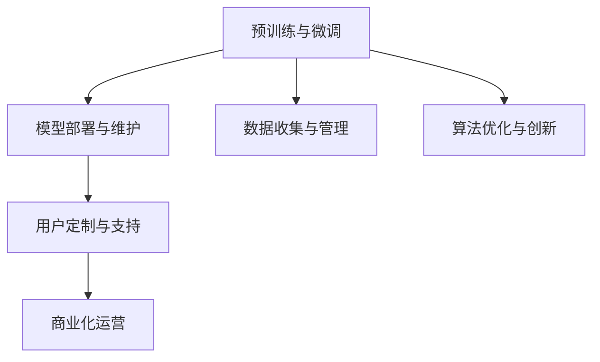

                 

# LLM产业链：新兴AI经济的脉络

> 关键词：语言模型,深度学习,产业链,人工智能,商业应用

## 1. 背景介绍

### 1.1 问题由来

近年来，人工智能（AI）技术的发展在多个领域取得了显著突破，其中语言模型（Language Models, LM）的应用尤为引人注目。大语言模型（Large Language Models, LLMs）如GPT-3、BERT等，通过在海量无标签文本数据上进行预训练，学习到了丰富的语言知识和常识，成为NLP领域的新标杆。但这些模型的开发、部署和商业化，并非孤立过程，而是一个复杂的产业链条。本文将从产业链的角度，系统梳理LLM的开发流程和应用场景，探讨其商业应用的经济脉络。

### 1.2 问题核心关键点

LLM产业链的构建，主要涉及以下几个核心环节：

- **预训练与微调**：使用大规模无标签数据进行预训练，并在特定任务数据上微调，提升模型性能。
- **模型部署与维护**：将模型部署到云端或边缘设备，进行持续监控和优化。
- **数据收集与管理**：收集和处理各种数据源，构建高效的数据管道。
- **算法优化与创新**：持续进行模型优化和算法创新，提升模型效果。
- **用户定制与支持**：提供定制化的服务，并为用户提供技术支持和维护。
- **商业化运营**：通过多种商业模式，将技术成果转化为商业价值。

理解这些核心环节，对于把握LLM产业链的脉络具有重要意义。本文将围绕这些关键点，进行详细的分析和讨论。

## 2. 核心概念与联系

### 2.1 核心概念概述

- **预训练与微调**：在大规模无标签数据上进行的自监督学习，以及在有标签数据上进行的任务特定优化。
- **模型部署与维护**：将训练好的模型部署到服务器、云端或边缘设备，并进行持续监控和性能优化。
- **数据收集与管理**：从多个数据源收集数据，并进行清洗、标注、存储等管理。
- **算法优化与创新**：对模型架构、训练方法、优化策略等进行持续研究，提升模型性能和效率。
- **用户定制与支持**：根据用户需求，提供定制化的服务和模型，并提供技术支持。
- **商业化运营**：通过API接口、订阅服务、嵌入式软件等方式，将AI技术商业化。

这些概念之间的关系，可以通过以下Mermaid流程图来展示：



这个流程图展示了LLM产业链的主要环节及其联系：

1. **预训练与微调**是产业链的基础，提供高质量的模型作为后续环节的起点。
2. **模型部署与维护**是模型应用的关键，确保模型在实际环境中稳定运行。
3. **数据收集与管理**是模型优化的前提，为模型提供高质量的数据支持。
4. **算法优化与创新**是产业链的核心动力，推动模型的持续进步。
5. **用户定制与支持**是商业化的保障，满足用户多样化的需求。
6. **商业化运营**是产业链的最终目标，将技术成果转化为实际价值。

理解这些概念，有助于我们深入分析LLM产业链的各个环节。

## 3. 核心算法原理 & 具体操作步骤
### 3.1 算法原理概述

LLM的产业链涉及多个算法环节，以下对核心算法原理进行概述：

- **自监督预训练**：使用大规模无标签数据，进行自监督学习，学习语言模型。
- **监督微调**：在有标签数据上，进行任务特定优化，提升模型性能。
- **模型压缩与加速**：对模型进行压缩、量化等优化，提升推理速度和效率。
- **对抗训练**：通过引入对抗样本，提升模型的鲁棒性和泛化能力。
- **混合精度的使用**：在模型训练和推理中使用混合精度技术，提升性能和效率。

### 3.2 算法步骤详解

#### 3.2.1 自监督预训练

1. **数据收集**：从网络、文本存储库等收集大规模无标签文本数据。
2. **数据预处理**：对文本数据进行分词、标准化等预处理。
3. **模型训练**：使用自监督学习任务（如掩码语言模型）训练语言模型。
4. **模型评估**：在验证集上评估模型性能，调整训练参数。
5. **模型保存**：保存训练好的模型，供后续微调使用。

#### 3.2.2 监督微调

1. **数据准备**：收集和准备特定任务的有标签数据集。
2. **模型初始化**：使用预训练的模型作为初始参数。
3. **模型微调**：在有标签数据上，使用监督学习任务（如分类、匹配）微调模型。
4. **模型评估**：在验证集和测试集上评估模型性能。
5. **模型优化**：根据评估结果，调整模型参数和训练策略。

#### 3.2.3 模型压缩与加速

1. **模型裁剪**：去除冗余层和参数，减小模型尺寸。
2. **量化与压缩**：使用定点运算代替浮点运算，减小模型内存占用。
3. **模型并行**：使用分布式训练和推理，提升计算效率。

#### 3.2.4 对抗训练

1. **对抗样本生成**：使用对抗样本生成技术，生成扰动后的输入样本。
2. **对抗训练**：在有标签对抗样本上训练模型，提高模型的鲁棒性。
3. **测试评估**：在测试集上评估模型的鲁棒性。

#### 3.2.5 混合精度的使用

1. **混合精度训练**：使用不同的数据类型（如16位和32位）进行模型训练，提升计算效率。
2. **混合精度推理**：使用混合精度进行推理，提升推理速度和效率。

### 3.3 算法优缺点

#### 3.3.1 自监督预训练

**优点**：
- 使用大规模无标签数据，覆盖广泛的语言知识。
- 训练速度快，计算资源需求较低。

**缺点**：
- 模型可能存在一定偏差，需要后续微调来校正。
- 需要大量计算资源，训练周期长。

#### 3.3.2 监督微调

**优点**：
- 在特定任务上，性能提升显著。
- 参数量小，计算资源需求低。

**缺点**：
- 依赖标注数据，标注成本高。
- 过拟合风险大，需要正则化技术。

#### 3.3.3 模型压缩与加速

**优点**：
- 提升计算效率和推理速度。
- 降低计算资源需求，降低成本。

**缺点**：
- 可能损失部分模型精度。
- 压缩技术复杂，需要专业技能。

#### 3.3.4 对抗训练

**优点**：
- 提高模型的鲁棒性和泛化能力。
- 提升模型在对抗攻击下的性能。

**缺点**：
- 对抗样本生成难度大，计算资源需求高。
- 对抗训练复杂，需要专业知识。

#### 3.3.5 混合精度的使用

**优点**：
- 提升计算效率和推理速度。
- 降低计算资源需求，降低成本。

**缺点**：
- 混合精度训练和推理技术复杂，需要专业技能。
- 可能存在精度损失问题。

### 3.4 算法应用领域

LLM产业链涉及的算法和技术，已经在多个领域得到了广泛应用，包括但不限于：

- **自然语言处理（NLP）**：文本分类、情感分析、机器翻译、问答系统等。
- **计算机视觉（CV）**：图像分类、物体检测、图像生成等。
- **语音识别（ASR）**：语音转文本、语音合成、语音情感识别等。
- **推荐系统**：个性化推荐、搜索优化等。
- **医疗健康**：病历分析、药物研发等。
- **金融科技**：信用评估、情感分析等。
- **智能家居**：语音助手、场景感知等。

## 4. 数学模型和公式 & 详细讲解 & 举例说明

### 4.1 数学模型构建

#### 4.1.1 自监督预训练模型

以BERT模型为例，其自监督预训练的目标是最大化每个单词预测上下文单词的概率。给定一个句子 $\mathcal{X} = \{x_1, x_2, ..., x_n\}$，其编码表示为 $X = \{x_1, x_2, ..., x_n\}$，其中 $x_i$ 表示第 $i$ 个单词的表示，$X$ 表示整个句子的表示。

模型定义了如下的掩码语言模型：
$$
\mathcal{L}_{MLM}(X) = -\frac{1}{N} \sum_{i=1}^{N} \sum_{j=1}^{V} \log P(X_i, x_j) 
$$

其中 $P(X_i, x_j)$ 表示在句子 $X_i$ 中，单词 $x_j$ 的条件概率。通过最大化这个损失函数，模型学会了单词之间的共现关系，从而获得了良好的语言表示。

#### 4.1.2 监督微调模型

以分类任务为例，微调模型的目标是最小化交叉熵损失函数：
$$
\mathcal{L}_{CE}(X, y) = -\frac{1}{N} \sum_{i=1}^{N} \log P(X_i|y_i) 
$$

其中 $y_i$ 表示第 $i$ 个样本的标签，$P(X_i|y_i)$ 表示在给定标签 $y_i$ 的情况下，样本 $X_i$ 的条件概率。通过最小化这个损失函数，模型学会了分类任务中的标签预测。

### 4.2 公式推导过程

#### 4.2.1 自监督预训练

以BERT模型为例，其自监督预训练的目标是最大化每个单词预测上下文单词的概率。给定一个句子 $\mathcal{X} = \{x_1, x_2, ..., x_n\}$，其编码表示为 $X = \{x_1, x_2, ..., x_n\}$，其中 $x_i$ 表示第 $i$ 个单词的表示，$X$ 表示整个句子的表示。

模型定义了如下的掩码语言模型：
$$
\mathcal{L}_{MLM}(X) = -\frac{1}{N} \sum_{i=1}^{N} \sum_{j=1}^{V} \log P(X_i, x_j) 
$$

其中 $P(X_i, x_j)$ 表示在句子 $X_i$ 中，单词 $x_j$ 的条件概率。通过最大化这个损失函数，模型学会了单词之间的共现关系，从而获得了良好的语言表示。

#### 4.2.2 监督微调

以分类任务为例，微调模型的目标是最小化交叉熵损失函数：
$$
\mathcal{L}_{CE}(X, y) = -\frac{1}{N} \sum_{i=1}^{N} \log P(X_i|y_i) 
$$

其中 $y_i$ 表示第 $i$ 个样本的标签，$P(X_i|y_i)$ 表示在给定标签 $y_i$ 的情况下，样本 $X_i$ 的条件概率。通过最小化这个损失函数，模型学会了分类任务中的标签预测。

### 4.3 案例分析与讲解

以BERT微调为例，展示其在情感分析任务中的应用：

1. **数据准备**：收集和准备情感分析任务的数据集，如IMDB评论数据集。
2. **模型初始化**：使用预训练的BERT模型作为初始参数。
3. **模型微调**：在有标签数据上，使用监督学习任务（如分类）微调模型。
4. **模型评估**：在验证集和测试集上评估模型性能，如准确率、F1-score等。
5. **模型优化**：根据评估结果，调整模型参数和训练策略。

## 5. 项目实践：代码实例和详细解释说明

### 5.1 开发环境搭建

#### 5.1.1 环境安装

- **Python环境**：
  ```bash
  conda create -n pytorch-env python=3.8 
  conda activate pytorch-env
  ```
- **深度学习框架**：
  ```bash
  pip install torch torchvision torchaudio
  ```
- **自然语言处理库**：
  ```bash
  pip install transformers
  ```
- **数据处理库**：
  ```bash
  pip install pandas numpy scikit-learn
  ```

### 5.2 源代码详细实现

#### 5.2.1 数据准备

```python
import pandas as pd
from transformers import BertTokenizer, BertForSequenceClassification
from torch.utils.data import Dataset, DataLoader
import torch
from sklearn.model_selection import train_test_split

# 加载IMDB评论数据集
df = pd.read_csv('imdb_reviews.csv')
df['label'] = df['sentiment'].apply(lambda x: 1 if x == 'positive' else 0)
train_texts, test_texts, train_labels, test_labels = train_test_split(df['text'], df['label'], test_size=0.2, random_state=42)

# 定义数据集
tokenizer = BertTokenizer.from_pretrained('bert-base-uncased')
class SentimentDataset(Dataset):
    def __init__(self, texts, labels, tokenizer):
        self.texts = texts
        self.labels = labels
        self.tokenizer = tokenizer
        
    def __len__(self):
        return len(self.texts)
    
    def __getitem__(self, idx):
        text = self.texts[idx]
        label = self.labels[idx]
        encoding = self.tokenizer(text, return_tensors='pt', max_length=512, padding='max_length', truncation=True)
        input_ids = encoding['input_ids'][0]
        attention_mask = encoding['attention_mask'][0]
        return {'input_ids': input_ids, 
                'attention_mask': attention_mask,
                'labels': torch.tensor(label)}
```

#### 5.2.2 模型微调

```python
# 定义微调模型
model = BertForSequenceClassification.from_pretrained('bert-base-uncased', num_labels=2)

# 定义优化器
optimizer = torch.optim.AdamW(model.parameters(), lr=2e-5)

# 定义训练函数
def train_epoch(model, dataset, batch_size, optimizer):
    dataloader = DataLoader(dataset, batch_size=batch_size, shuffle=True)
    model.train()
    epoch_loss = 0
    for batch in dataloader:
        input_ids = batch['input_ids'].to(device)
        attention_mask = batch['attention_mask'].to(device)
        labels = batch['labels'].to(device)
        model.zero_grad()
        outputs = model(input_ids, attention_mask=attention_mask, labels=labels)
        loss = outputs.loss
        epoch_loss += loss.item()
        loss.backward()
        optimizer.step()
    return epoch_loss / len(dataloader)

# 训练模型
device = torch.device('cuda') if torch.cuda.is_available() else torch.device('cpu')
model.to(device)

train_dataset = SentimentDataset(train_texts, train_labels, tokenizer)
dev_dataset = SentimentDataset(test_texts, test_labels, tokenizer)

epochs = 5
batch_size = 16

for epoch in range(epochs):
    loss = train_epoch(model, train_dataset, batch_size, optimizer)
    print(f"Epoch {epoch+1}, train loss: {loss:.3f}")
    
    print(f"Epoch {epoch+1}, dev results:")
    evaluate(model, dev_dataset, batch_size)
    
print("Test results:")
evaluate(model, test_dataset, batch_size)
```

### 5.3 代码解读与分析

#### 5.3.1 数据准备

- **数据加载与处理**：从IMDB评论数据集中加载数据，并进行预处理，包括分词、标准化等操作。
- **数据集定义**：定义数据集类，用于模型训练和推理。
- **数据集划分**：将数据集划分为训练集、验证集和测试集。

#### 5.3.2 模型微调

- **模型定义**：使用预训练的BERT模型作为初始参数，进行情感分析任务的微调。
- **优化器定义**：使用AdamW优化器，设置适当的学习率。
- **训练函数定义**：定义训练函数，进行模型训练和优化。
- **训练过程**：在训练集上进行训练，验证集上进行评估，测试集上进行最终测试。

## 6. 实际应用场景

### 6.1 智能客服系统

基于大语言模型微调的对话技术，可以广泛应用于智能客服系统的构建。传统客服往往需要配备大量人力，高峰期响应缓慢，且一致性和专业性难以保证。而使用微调后的对话模型，可以7x24小时不间断服务，快速响应客户咨询，用自然流畅的语言解答各类常见问题。

在技术实现上，可以收集企业内部的历史客服对话记录，将问题和最佳答复构建成监督数据，在此基础上对预训练对话模型进行微调。微调后的对话模型能够自动理解用户意图，匹配最合适的答案模板进行回复。对于客户提出的新问题，还可以接入检索系统实时搜索相关内容，动态组织生成回答。如此构建的智能客服系统，能大幅提升客户咨询体验和问题解决效率。

### 6.2 金融舆情监测

金融机构需要实时监测市场舆论动向，以便及时应对负面信息传播，规避金融风险。传统的人工监测方式成本高、效率低，难以应对网络时代海量信息爆发的挑战。基于大语言模型微调的文本分类和情感分析技术，为金融舆情监测提供了新的解决方案。

具体而言，可以收集金融领域相关的新闻、报道、评论等文本数据，并对其进行主题标注和情感标注。在此基础上对预训练语言模型进行微调，使其能够自动判断文本属于何种主题，情感倾向是正面、中性还是负面。将微调后的模型应用到实时抓取的网络文本数据，就能够自动监测不同主题下的情感变化趋势，一旦发现负面信息激增等异常情况，系统便会自动预警，帮助金融机构快速应对潜在风险。

### 6.3 个性化推荐系统

当前的推荐系统往往只依赖用户的历史行为数据进行物品推荐，无法深入理解用户的真实兴趣偏好。基于大语言模型微调技术，个性化推荐系统可以更好地挖掘用户行为背后的语义信息，从而提供更精准、多样的推荐内容。

在实践中，可以收集用户浏览、点击、评论、分享等行为数据，提取和用户交互的物品标题、描述、标签等文本内容。将文本内容作为模型输入，用户的后续行为（如是否点击、购买等）作为监督信号，在此基础上微调预训练语言模型。微调后的模型能够从文本内容中准确把握用户的兴趣点。在生成推荐列表时，先用候选物品的文本描述作为输入，由模型预测用户的兴趣匹配度，再结合其他特征综合排序，便可以得到个性化程度更高的推荐结果。

### 6.4 未来应用展望

随着大语言模型微调技术的发展，其在更多领域的应用前景将更加广阔。以下是一些可能的未来应用场景：

- **智慧医疗**：基于微调的医疗问答、病历分析、药物研发等应用将提升医疗服务的智能化水平，辅助医生诊疗，加速新药开发进程。
- **智能教育**：微调技术可应用于作业批改、学情分析、知识推荐等方面，因材施教，促进教育公平，提高教学质量。
- **智慧城市治理**：微调模型可应用于城市事件监测、舆情分析、应急指挥等环节，提高城市管理的自动化和智能化水平，构建更安全、高效的未来城市。
- **智能物流**：基于微调的机器人导航、路径规划、货物分拣等应用将提升物流效率，降低成本。
- **智能制造**：微调技术可应用于设备监控、故障预测、生产优化等方面，提升制造自动化水平，降低生产成本。

## 7. 工具和资源推荐

### 7.1 学习资源推荐

为帮助开发者系统掌握大语言模型微调的理论基础和实践技巧，这里推荐一些优质的学习资源：

- **《Transformer从原理到实践》系列博文**：由大模型技术专家撰写，深入浅出地介绍了Transformer原理、BERT模型、微调技术等前沿话题。
- **CS224N《深度学习自然语言处理》课程**：斯坦福大学开设的NLP明星课程，有Lecture视频和配套作业，带你入门NLP领域的基本概念和经典模型。
- **《Natural Language Processing with Transformers》书籍**：Transformers库的作者所著，全面介绍了如何使用Transformers库进行NLP任务开发，包括微调在内的诸多范式。
- **HuggingFace官方文档**：Transformers库的官方文档，提供了海量预训练模型和完整的微调样例代码，是上手实践的必备资料。
- **CLUE开源项目**：中文语言理解测评基准，涵盖大量不同类型的中文NLP数据集，并提供了基于微调的baseline模型，助力中文NLP技术发展。

通过对这些资源的学习实践，相信你一定能够快速掌握大语言模型微调的精髓，并用于解决实际的NLP问题。

### 7.2 开发工具推荐

高效的开发离不开优秀的工具支持。以下是几款用于大语言模型微调开发的常用工具：

- **PyTorch**：基于Python的开源深度学习框架，灵活动态的计算图，适合快速迭代研究。大部分预训练语言模型都有PyTorch版本的实现。
- **TensorFlow**：由Google主导开发的开源深度学习框架，生产部署方便，适合大规模工程应用。同样有丰富的预训练语言模型资源。
- **Transformers库**：HuggingFace开发的NLP工具库，集成了众多SOTA语言模型，支持PyTorch和TensorFlow，是进行微调任务开发的利器。
- **Weights & Biases**：模型训练的实验跟踪工具，可以记录和可视化模型训练过程中的各项指标，方便对比和调优。与主流深度学习框架无缝集成。
- **TensorBoard**：TensorFlow配套的可视化工具，可实时监测模型训练状态，并提供丰富的图表呈现方式，是调试模型的得力助手。
- **Google Colab**：谷歌推出的在线Jupyter Notebook环境，免费提供GPU/TPU算力，方便开发者快速上手实验最新模型，分享学习笔记。

合理利用这些工具，可以显著提升大语言模型微调任务的开发效率，加快创新迭代的步伐。

### 7.3 相关论文推荐

大语言模型和微调技术的发展源于学界的持续研究。以下是几篇奠基性的相关论文，推荐阅读：

- **Attention is All You Need**：提出了Transformer结构，开启了NLP领域的预训练大模型时代。
- **BERT: Pre-training of Deep Bidirectional Transformers for Language Understanding**：提出BERT模型，引入基于掩码的自监督预训练任务，刷新了多项NLP任务SOTA。
- **Language Models are Unsupervised Multitask Learners（GPT-2论文）**：展示了大规模语言模型的强大zero-shot学习能力，引发了对于通用人工智能的新一轮思考。
- **Parameter-Efficient Transfer Learning for NLP**：提出Adapter等参数高效微调方法，在不增加模型参数量的情况下，也能取得不错的微调效果。
- **Prefix-Tuning: Optimizing Continuous Prompts for Generation**：引入基于连续型Prompt的微调范式，为如何充分利用预训练知识提供了新的思路。
- **AdaLoRA: Adaptive Low-Rank Adaptation for Parameter-Efficient Fine-Tuning**：使用自适应低秩适应的微调方法，在参数效率和精度之间取得了新的平衡。

这些论文代表了大语言模型微调技术的发展脉络。通过学习这些前沿成果，可以帮助研究者把握学科前进方向，激发更多的创新灵感。

## 8. 总结：未来发展趋势与挑战

### 8.1 总结

本文对大语言模型产业链进行了系统梳理，从预训练、微调、模型部署、算法优化、用户支持、商业化等多个环节，全面介绍了LLM的开发流程和应用场景。通过详细的案例分析和代码实践，展示了微调在实际应用中的技术细节和优化策略。

LLM产业链涉及的各个环节，都是AI技术发展的重要组成部分。预训练和微调技术，为模型提供了高质量的初始化和优化基础；模型部署和维护，保证了模型在实际环境中的稳定运行；算法优化和创新，推动了模型的持续进步；用户支持和服务，保障了模型的应用效果；商业化运营，将技术成果转化为实际价值。

### 8.2 未来发展趋势

展望未来，LLM产业链将呈现以下几个发展趋势：

- **模型规模持续增大**：随着算力成本的下降和数据规模的扩张，预训练语言模型的参数量还将持续增长。超大规模语言模型蕴含的丰富语言知识，有望支撑更加复杂多变的下游任务微调。
- **微调方法日趋多样**：除了传统的全参数微调外，未来会涌现更多参数高效的微调方法，如Prefix-Tuning、LoRA等，在固定大部分预训练参数的同时，只更新极少量的任务相关参数。
- **持续学习成为常态**：随着数据分布的不断变化，微调模型也需要持续学习新知识以保持性能。如何在不遗忘原有知识的同时，高效吸收新样本信息，将成为重要的研究课题。
- **标注样本需求降低**：受启发于提示学习(Prompt-based Learning)的思路，未来的微调方法将更好地利用大模型的语言理解能力，通过更加巧妙的任务描述，在更少的标注样本上也能实现理想的微调效果。
- **多模态微调崛起**：当前的微调主要聚焦于纯文本数据，未来会进一步拓展到图像、视频、语音等多模态数据微调。多模态信息的融合，将显著提升语言模型对现实世界的理解和建模能力。
- **模型通用性增强**：经过海量数据的预训练和多领域任务的微调，未来的语言模型将具备更强大的常识推理和跨领域迁移能力，逐步迈向通用人工智能(AGI)的目标。

以上趋势凸显了大语言模型微调技术的广阔前景。这些方向的探索发展，必将进一步提升NLP系统的性能和应用范围，为人类认知智能的进化带来深远影响。

### 8.3 面临的挑战

尽管大语言模型微调技术已经取得了瞩目成就，但在迈向更加智能化、普适化应用的过程中，它仍面临着诸多挑战：

- **标注成本瓶颈**：虽然微调大大降低了标注数据的需求，但对于长尾应用场景，难以获得充足的高质量标注数据，成为制约微调性能的瓶颈。如何进一步降低微调对标注样本的依赖，将是一大难题。
- **模型鲁棒性不足**：当前微调模型面对域外数据时，泛化性能往往大打折扣。对于测试样本的微小扰动，微调模型的预测也容易发生波动。如何提高微调模型的鲁棒性，避免灾难性遗忘，还需要更多理论和实践的积累。
- **推理效率有待提高**：大规模语言模型虽然精度高，但在实际部署时往往面临推理速度慢、内存占用大等效率问题。如何在保证性能的同时，简化模型结构，提升推理速度，优化资源占用，将是重要的优化方向。
- **可解释性亟需加强**：当前微调模型更像是"黑盒"系统，难以解释其内部工作机制和决策逻辑。对于医疗、金融等高风险应用，算法的可解释性和可审计性尤为重要。如何赋予微调模型更强的可解释性，将是亟待攻克的难题。
- **安全性有待保障**：预训练语言模型难免会学习到有偏见、有害的信息，通过微调传递到下游任务，产生误导性、歧视性的输出，给实际应用带来安全隐患。如何从数据和算法层面消除模型偏见，避免恶意用途，确保输出的安全性，也将是重要的研究课题。
- **知识整合能力不足**：现有的微调模型往往局限于任务内数据，难以灵活吸收和运用更广泛的先验知识。如何让微调过程更好地与外部知识库、规则库等专家知识结合，形成更加全面、准确的信息整合能力，还有很大的想象空间。

正视微调面临的这些挑战，积极应对并寻求突破，将是大语言模型微调走向成熟的必由之路。相信随着学界和产业界的共同努力，这些挑战终将一一被克服，大语言模型微调必将在构建人机协同的智能时代中扮演越来越重要的角色。

### 8.4 研究展望

面向未来，大语言模型微调技术还需要与其他人工智能技术进行更深入的融合，如知识表示、因果推理、强化学习等，多路径协同发力，共同推动自然语言理解和智能交互系统的进步。只有勇于创新、敢于突破，才能不断拓展语言模型的边界，让智能技术更好地造福人类社会。

## 9. 附录：常见问题与解答

**Q1：大语言模型微调是否适用于所有NLP任务？**

A: 大语言模型微调在大多数NLP任务上都能取得不错的效果，特别是对于数据量较小的任务。但对于一些特定领域的任务，如医学、法律等，仅仅依靠通用语料预训练的模型可能难以很好地适应。此时需要在特定领域语料上进一步预训练，再进行微调，才能获得理想效果。此外，对于一些需要时效性、个性化很强的任务，如对话、推荐等，微调方法也需要针对性的改进优化。

**Q2：微调过程中如何选择合适的学习率？**

A: 微调的学习率一般要比预训练时小1-2个数量级，如果使用过大的学习率，容易破坏预训练权重，导致过拟合。一般建议从1e-5开始调参，逐步减小学习率，直至收敛。也可以使用warmup策略，在开始阶段使用较小的学习率，再逐渐过渡到预设值。需要注意的是，不同的优化器(如AdamW、Adafactor等)以及不同的学习率调度策略，可能需要设置不同的学习率阈值。

**Q3：采用大模型微调时会面临哪些资源瓶颈？**

A: 目前主流的预训练大模型动辄以亿计的参数规模，对算力、内存、存储都提出了很高的要求。GPU/TPU等高性能设备是必不可少的，但即便如此，超大批次的训练和推理也可能遇到显存不足的问题。因此需要采用一些资源优化技术，如梯度积累、混合精度训练、模型并行等，来突破硬件瓶颈。同时，模型的存储和读取也可能占用大量时间和空间，需要采用模型压缩、稀疏化存储等方法进行优化。

**Q4：如何缓解微调过程中的过拟合问题？**

A: 过拟合是微调面临的主要挑战，尤其是在标注数据不足的情况下。常见的缓解策略包括：
1. 数据增强：通过回译、近义替换等方式扩充训练集
2. 正则化：使用L2正则、Dropout、Early Stopping等避免过拟合
3. 对抗训练：引入对抗样本，提高模型鲁棒性
4. 参数高效微调：只调整少量参数(如Adapter、Prefix等)，减小过拟合风险
5. 多模型集成：训练多个微调模型，取平均输出，抑制过拟合

这些策略往往需要根据具体任务和数据特点进行灵活组合。只有在数据、模型、训练、推理等各环节进行全面优化，才能最大限度地发挥大模型微调的威力。

**Q5：微调模型在落地部署时需要注意哪些问题？**

A: 将微调模型转化为实际应用，还需要考虑以下因素：
1. 模型裁剪：去除不必要的层和参数，减小模型尺寸，加快推理速度
2. 量化加速：将浮点模型转为定点模型，压缩存储空间，提高计算效率
3. 服务化封装：将模型封装为标准化服务接口，便于集成调用
4. 弹性伸缩：根据请求流量动态调整资源配置，平衡服务质量和成本
5. 监控告警：实时采集系统指标，设置异常告警阈值，确保服务稳定性
6. 安全防护：采用访问鉴权、数据脱敏等措施，保障数据和模型安全

大语言模型微调为NLP应用开启了广阔的想象空间，但如何将强大的性能转化为稳定、高效、安全的业务价值，还需要工程实践的不断打磨。唯有从数据、算法、工程、业务等多个维度协同发力，才能真正实现人工智能技术在垂直行业的规模化落地。总之，微调需要开发者根据具体任务，不断迭代和优化模型、数据和算法，方能得到理想的效果。

---

作者：禅与计算机程序设计艺术 / Zen and the Art of Computer Programming

