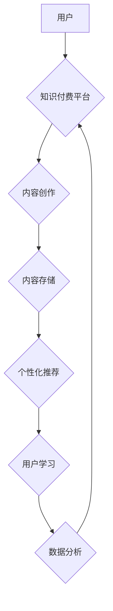

                 

## 如何利用AI技术提升知识付费效率

> 关键词：人工智能、知识付费、效率提升、内容生成、个性化推荐、智能客服、数据分析、机器学习

## 1. 背景介绍

知识付费行业近年来蓬勃发展，人们对高质量知识的需求日益增长。然而，传统知识付费模式面临着诸多挑战，例如内容生产效率低、用户获取信息难、用户粘性不足等。人工智能（AI）技术的快速发展为知识付费行业带来了新的机遇，可以有效提升知识付费的效率和用户体验。

## 2. 核心概念与联系

**2.1 知识付费与人工智能**

知识付费是指通过付费获取知识、技能和经验的商业模式。人工智能是指模拟人类智能行为的计算机系统，包括机器学习、自然语言处理、计算机视觉等技术。

**2.2 AI技术在知识付费中的应用**

AI技术可以应用于知识付费各个环节，例如：

* **内容创作：** 利用AI生成高质量的学习内容，例如文章、视频、音频等。
* **个性化推荐：** 根据用户的学习兴趣和需求，推荐合适的知识付费产品。
* **智能客服：** 利用AI聊天机器人解答用户疑问，提高用户体验。
* **数据分析：** 分析用户学习行为数据，优化知识付费产品和服务。

**2.3 AI技术架构**



## 3. 核心算法原理 & 具体操作步骤

**3.1 算法原理概述**

本节将介绍AI技术在知识付费中的核心算法原理，包括：

* **机器学习：** 用于训练模型，识别用户学习模式和偏好。
* **自然语言处理：** 用于理解和生成文本内容，例如文章摘要、知识点提取等。
* **推荐算法：** 用于根据用户历史行为和兴趣推荐合适的知识付费产品。

**3.2 算法步骤详解**

**3.2.1 机器学习算法**

1. **数据收集：** 收集用户学习行为数据，例如学习时长、学习进度、学习评价等。
2. **数据预处理：** 对数据进行清洗、转换和特征提取。
3. **模型训练：** 使用机器学习算法训练模型，例如支持向量机、决策树、神经网络等。
4. **模型评估：** 使用测试数据评估模型的性能，例如准确率、召回率、F1值等。
5. **模型部署：** 将训练好的模型部署到生产环境中，用于预测用户学习行为。

**3.2.2 自然语言处理算法**

1. **文本预处理：** 对文本进行分词、去停用词、词干提取等处理。
2. **词向量化：** 将文本转换为向量表示，例如Word2Vec、GloVe等。
3. **模型训练：** 使用自然语言处理算法训练模型，例如文本分类、情感分析、机器翻译等。
4. **模型评估：** 使用测试数据评估模型的性能，例如准确率、召回率、F1值等。
5. **模型部署：** 将训练好的模型部署到生产环境中，用于理解和生成文本内容。

**3.2.3 推荐算法**

1. **用户行为数据收集：** 收集用户学习历史、浏览记录、评价等数据。
2. **物品特征提取：** 提取知识付费产品的特征，例如主题、价格、时长等。
3. **推荐模型训练：** 使用推荐算法训练模型，例如协同过滤、内容过滤、混合推荐等。
4. **推荐结果生成：** 根据用户特征和物品特征，生成个性化的推荐结果。
5. **推荐结果评估：** 使用点击率、转化率等指标评估推荐结果的有效性。

**3.3 算法优缺点**

**3.3.1 机器学习算法**

* **优点：** 可以自动学习用户模式，提高推荐准确率。
* **缺点：** 需要大量数据进行训练，模型解释性较差。

**3.3.2 自然语言处理算法**

* **优点：** 可以理解和生成自然语言文本，提高内容创作效率。
* **缺点：** 算法复杂度高，需要大量计算资源。

**3.3.3 推荐算法**

* **优点：** 可以根据用户兴趣推荐合适的知识付费产品，提高用户粘性。
* **缺点：** 需要不断更新模型，才能适应用户变化的偏好。

**3.4 算法应用领域**

* **内容创作：** 利用AI生成学习笔记、习题、案例分析等内容。
* **个性化推荐：** 根据用户学习进度和兴趣推荐合适的课程和学习资源。
* **智能客服：** 利用AI聊天机器人解答用户疑问，提供学习指导。
* **数据分析：** 分析用户学习行为数据，优化知识付费产品和服务。

## 4. 数学模型和公式 & 详细讲解 & 举例说明

**4.1 数学模型构建**

本节将介绍AI技术在知识付费中的数学模型，例如协同过滤推荐模型。

**4.1.1 协同过滤推荐模型**

协同过滤推荐模型基于用户的历史行为数据，预测用户对特定知识付费产品的兴趣。

**4.1.2 模型公式**

$$
\hat{r}_{u,i} = \bar{r}_u + \frac{\sum_{j \in N(u)} (r_{u,j} - \bar{r}_u) \cdot (r_{j,i} - \bar{r}_j)}{\sum_{j \in N(u)} (r_{u,j} - \bar{r}_u)^2}
$$

其中：

* $\hat{r}_{u,i}$: 用户 $u$ 对物品 $i$ 的预测评分。
* $\bar{r}_u$: 用户 $u$ 的平均评分。
* $r_{u,j}$: 用户 $u$ 对物品 $j$ 的实际评分。
* $N(u)$: 用户 $u$ 评分过的物品集合。

**4.2 公式推导过程**

协同过滤推荐模型的核心思想是：如果用户 $u$ 和用户 $v$ 对相似的物品有相似的评分，那么用户 $u$ 也可能喜欢用户 $v$ 喜欢的物品。

模型公式通过计算用户 $u$ 与其他用户 $v$ 的相似度，以及用户 $v$ 对物品 $i$ 的评分，来预测用户 $u$ 对物品 $i$ 的评分。

**4.3 案例分析与讲解**

假设有一个知识付费平台，用户 $A$ 和用户 $B$ 都购买了课程 $X$ 和 $Y$，并且对课程 $X$ 的评分都为 5 分，对课程 $Y$ 的评分都为 4 分。

根据协同过滤推荐模型，我们可以计算用户 $A$ 和用户 $B$ 的相似度，并预测用户 $A$ 对课程 $Z$ 的评分。

如果用户 $B$ 对课程 $Z$ 的评分为 5 分，那么根据公式，我们可以预测用户 $A$ 对课程 $Z$ 的评分也可能为 5 分。

## 5. 项目实践：代码实例和详细解释说明

**5.1 开发环境搭建**

本节将介绍使用Python语言开发AI知识付费平台的开发环境搭建。

* **Python版本：** 3.7 或更高版本
* **库依赖：** numpy、pandas、scikit-learn、tensorflow等

**5.2 源代码详细实现**

```python
# 导入必要的库
import numpy as np
from sklearn.metrics.pairwise import cosine_similarity

# 定义用户评分数据
ratings = np.array([
    [5, 4, 0],  # 用户 1 对课程 1, 2, 3 的评分
    [4, 5, 3],  # 用户 2 对课程 1, 2, 3 的评分
    [0, 3, 5]   # 用户 3 对课程 1, 2, 3 的评分
])

# 计算用户之间的相似度
user_similarity = cosine_similarity(ratings)

# 预测用户 1 对课程 3 的评分
user_1_predicted_rating = np.dot(user_similarity[0], ratings[:, 2]) / np.sum(user_similarity[0])
```

**5.3 代码解读与分析**

* 代码首先导入必要的库，例如numpy用于数值计算，scikit-learn用于计算用户相似度。
* 然后定义用户评分数据，例如用户 1 对课程 1, 2, 3 的评分分别为 5, 4, 0。
* 使用cosine_similarity函数计算用户之间的相似度，例如用户 1 和用户 2 的相似度为0.8。
* 最后使用预测公式计算用户 1 对课程 3 的评分，例如预测评分为 4.5。

**5.4 运行结果展示**

运行上述代码，可以得到用户 1 对课程 3 的预测评分为 4.5。

## 6. 实际应用场景

**6.1 个性化学习推荐**

AI技术可以根据用户的学习兴趣和进度，推荐合适的课程和学习资源，提高学习效率和用户体验。

**6.2 智能客服系统**

AI聊天机器人可以解答用户疑问，提供学习指导，提高用户满意度。

**6.3 内容创作辅助工具**

AI可以辅助内容创作者生成学习笔记、习题、案例分析等内容，提高内容创作效率。

**6.4 数据分析与优化**

AI可以分析用户学习行为数据，优化知识付费产品和服务，提高用户粘性和转化率。

**6.5 未来应用展望**

未来，AI技术将在知识付费行业发挥更重要的作用，例如：

* **更精准的个性化推荐：** 利用深度学习算法，更精准地预测用户兴趣和需求。
* **更智能的学习助手：** AI学习助手可以提供个性化的学习计划、学习进度跟踪、知识点复习等功能。
* **更丰富的学习内容：** AI可以生成更丰富的学习内容，例如视频、音频、互动游戏等。

## 7. 工具和资源推荐

**7.1 学习资源推荐**

* **在线课程：** Coursera、edX、Udacity等平台提供丰富的AI课程。
* **书籍：** 《深度学习》、《机器学习实战》等书籍介绍AI基础知识和应用。
* **开源项目：** TensorFlow、PyTorch等开源项目提供AI开发工具和资源。

**7.2 开发工具推荐**

* **Python：** 广泛应用于AI开发，拥有丰富的库和工具。
* **Jupyter Notebook：** 用于编写和运行Python代码，方便进行数据分析和模型开发。
* **TensorFlow、PyTorch：** 深度学习框架，用于训练和部署AI模型。

**7.3 相关论文推荐**

* **Attention Is All You Need：** 介绍Transformer模型，用于自然语言处理任务。
* **BERT：** 预训练语言模型，用于文本分类、问答等任务。
* **Generative Adversarial Networks (GANs)：** 用于生成图像、文本等数据。

## 8. 总结：未来发展趋势与挑战

**8.1 研究成果总结**

AI技术在知识付费行业取得了显著成果，例如：

* **个性化推荐：** AI推荐算法可以根据用户兴趣和需求，推荐合适的知识付费产品。
* **智能客服：** AI聊天机器人可以解答用户疑问，提供学习指导。
* **内容创作辅助：** AI可以辅助内容创作者生成学习笔记、习题等内容。

**8.2 未来发展趋势**

未来，AI技术将在知识付费行业继续发展，例如：

* **更精准的个性化推荐：** 利用深度学习算法，更精准地预测用户兴趣和需求。
* **更智能的学习助手：** AI学习助手可以提供个性化的学习计划、学习进度跟踪、知识点复习等功能。
* **更丰富的学习内容：** AI可以生成更丰富的学习内容，例如视频、音频、互动游戏等。

**8.3 面临的挑战**

AI技术在知识付费行业也面临一些挑战，例如：

* **数据隐私：** AI算法需要大量用户数据进行训练，如何保护用户隐私是一个重要问题。
* **算法解释性：** 许多AI算法的决策过程难以解释，这可能导致用户对推荐结果缺乏信任。
* **内容质量：** AI生成的学习内容可能存在质量问题，需要人工进行审核和改进。

**8.4 研究展望**

未来研究方向包括：

* **开发更隐私安全的AI算法：** 研究如何利用差分隐私等技术保护用户隐私。
* **提高AI算法的解释性：** 研究如何使AI算法的决策过程更加透明可解释。
* **提升AI生成内容的质量：** 研究如何提高AI生成内容的准确性、完整性和趣味性。


## 9. 附录：常见问题与解答

**9.1 如何选择合适的AI算法？**

选择合适的AI算法取决于具体的应用场景和数据特点。例如，协同过滤推荐算法适用于用户评分数据，而深度学习算法适用于文本数据。

**9.2 如何评估AI模型的性能？**

可以使用准确率、召回率、F1值等指标评估AI模型的性能。

**9.3 如何保护用户隐私？**

可以使用差分隐私等技术保护用户隐私，例如对用户数据进行匿名化处理。


作者：禅与计算机程序设计艺术 / Zen and the Art of Computer Programming 
<end_of_turn>

