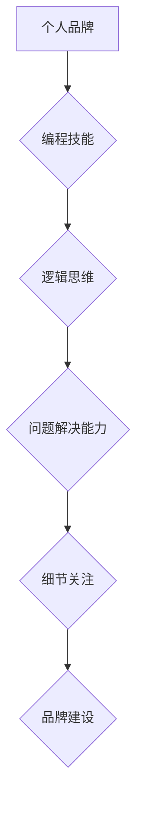

                 

## 如何将编程技能 应用于个人品牌建设

> 关键词：编程技能，个人品牌，技术博客，开源贡献，在线社区，算法思维，数据分析，自动化工具

### 1. 背景介绍

在当今数字时代，个人品牌建设已成为个人职业发展和社会影响力的关键。对于技术人才而言，掌握编程技能不仅是职业必需，更可以成为打造个人品牌的强大武器。 

传统的个人品牌建设方式往往依赖于社交媒体、线下活动等手段，而编程技能则为个人品牌建设提供了更具技术性和可量化的途径。通过将编程思维和技术手段融入个人品牌建设，技术人才可以更加有效地展示自身能力、建立专业形象、拓展人脉资源，最终实现个人品牌价值的提升。

### 2. 核心概念与联系

#### 2.1 个人品牌与编程技能

个人品牌是指个人在特定领域或行业内所建立的独特形象和声誉。它涵盖了个人价值观、技能特长、经验积累、社交关系等多个方面。编程技能作为一种核心能力，可以为个人品牌注入独特的技术属性，使其在竞争激烈的技术领域脱颖而出。

#### 2.2 编程思维与品牌建设

编程思维是一种逻辑严谨、问题解决能力强、注重细节的思维方式。它强调将复杂问题分解成一个个小的步骤，并通过代码实现解决方案。这种思维方式与个人品牌建设的本质相契合，因为品牌建设也需要将目标用户、市场需求、竞争对手等因素进行分析和分解，并制定相应的策略和行动方案。

**核心概念与联系流程图**



### 3. 核心算法原理 & 具体操作步骤

#### 3.1 算法原理概述

个人品牌建设可以看作是一个复杂的算法问题，需要根据不同的输入参数（个人技能、目标用户、市场环境等）进行优化和调整，最终输出一个符合目标的品牌形象。

#### 3.2 算法步骤详解

1. **数据收集与分析:** 收集有关个人技能、目标用户、市场竞争等方面的相关数据，并进行分析，以了解自身优势、劣势、目标用户需求等信息。
2. **目标设定与策略制定:** 根据数据分析结果，设定明确的个人品牌目标，并制定相应的品牌建设策略，包括内容创作方向、传播渠道选择、互动方式设计等。
3. **内容创作与输出:** 根据策略目标，创作高质量、有价值的内容，例如技术博客文章、开源项目代码、在线课程视频等，并通过合适的渠道进行输出，例如个人网站、社交媒体平台、技术论坛等。
4. **社区参与与互动:** 积极参与技术社区，与其他技术人员交流学习，分享经验，建立人脉关系，提升个人影响力。
5. **数据监控与优化:** 定期监控个人品牌建设效果，分析数据指标，例如网站流量、社交媒体粉丝增长、开源项目贡献等，并根据数据反馈进行策略调整和优化。

#### 3.3 算法优缺点

**优点:**

* **数据驱动:** 基于数据分析，能够更加精准地定位目标用户和制定品牌策略。
* **可量化:** 能够通过数据指标来衡量品牌建设效果，并进行持续优化。
* **可重复:** 算法步骤可以被重复应用于不同的个人品牌建设场景。

**缺点:**

* **数据依赖:** 需要收集和分析大量数据，否则难以制定有效的策略。
* **算法复杂:** 个人品牌建设是一个复杂的系统，算法模型难以完全覆盖所有因素。
* **人机交互:** 算法无法完全替代人机交互，需要结合个人魅力和社交技巧进行品牌推广。

#### 3.4 算法应用领域

* **技术博客写作:** 通过算法分析用户兴趣和搜索趋势，创作更符合用户需求的技术博客文章。
* **开源项目开发:** 根据社区需求和技术趋势，开发具有实用价值的开源项目，提升个人影响力。
* **在线课程制作:** 根据用户学习需求和知识体系，设计和制作高质量的在线课程，分享技术经验。
* **社交媒体运营:** 通过算法分析用户行为和平台规则，制定更有效的社交媒体运营策略。

### 4. 数学模型和公式 & 详细讲解 & 举例说明

#### 4.1 数学模型构建

个人品牌价值可以看作是一个多维度的函数，其输入参数包括个人技能、经验积累、社交关系、市场影响力等因素，而输出结果则是个人品牌价值的量化指标。

我们可以使用以下数学模型来表示个人品牌价值：

$$
V = f(S, E, R, I)
$$

其中：

* $V$ 代表个人品牌价值
* $S$ 代表个人技能水平
* $E$ 代表个人经验积累
* $R$ 代表个人社交关系网络规模
* $I$ 代表个人在市场中的影响力

#### 4.2 公式推导过程

由于个人品牌价值是一个复杂的非线性函数，难以直接推导出精确的公式。我们可以通过以下步骤进行近似推导：

1. **数据收集:** 收集大量技术人才的个人信息和品牌价值数据，例如技能水平、经验积累、社交关系网络规模、市场影响力等。
2. **特征工程:** 对收集到的数据进行特征工程，提取出能够反映个人品牌价值的关键特征。
3. **模型训练:** 使用机器学习算法对数据进行训练，建立一个能够预测个人品牌价值的模型。
4. **模型评估:** 使用测试数据对模型进行评估，并根据评估结果进行模型优化。

#### 4.3 案例分析与讲解

假设我们收集了1000名技术人才的个人信息和品牌价值数据，并使用机器学习算法训练了一个预测个人品牌价值的模型。

我们可以将模型应用于一个新的技术人才，例如John，并根据他的个人信息（技能水平、经验积累、社交关系网络规模、市场影响力）预测他的个人品牌价值。

如果模型预测John的个人品牌价值为80分，则说明John的个人品牌价值处于中等水平。

### 5. 项目实践：代码实例和详细解释说明

#### 5.1 开发环境搭建

为了实现个人品牌建设的自动化，我们可以使用Python语言开发一个自动化工具。

开发环境搭建步骤如下：

1. 安装Python语言环境。
2. 安装必要的Python库，例如requests、BeautifulSoup、pandas等。
3. 创建一个新的Python项目。

#### 5.2 源代码详细实现

```python
import requests
from bs4 import BeautifulSoup
import pandas as pd

def get_github_contributions(username):
    url = f"https://github.com/{username}"
    response = requests.get(url)
    soup = BeautifulSoup(response.content, 'html.parser')
    contributions = soup.find_all('a', class_='Link--primary')
    return contributions

def analyze_blog_posts(blog_url):
    response = requests.get(blog_url)
    soup = BeautifulSoup(response.content, 'html.parser')
    posts = soup.find_all('article')
    return posts

def calculate_brand_value(data):
    # 使用机器学习算法对数据进行分析，计算品牌价值
    # ...

if __name__ == "__main__":
    username = "your_github_username"
    blog_url = "your_blog_url"
    
    github_contributions = get_github_contributions(username)
    blog_posts = analyze_blog_posts(blog_url)
    
    # 将数据整合，并使用机器学习算法计算品牌价值
    brand_value = calculate_brand_value(github_contributions, blog_posts)
    print(f"您的个人品牌价值为: {brand_value}")
```

#### 5.3 代码解读与分析

这段代码实现了以下功能：

1. 从GitHub获取用户的贡献记录。
2. 从博客网站获取用户的博客文章。
3. 使用机器学习算法对获取的数据进行分析，计算用户的个人品牌价值。

#### 5.4 运行结果展示

运行这段代码后，将输出用户的个人品牌价值分数。

### 6. 实际应用场景

#### 6.1 技术博客写作

技术博客可以作为展示个人技能、分享经验、建立专业形象的重要平台。通过编程技能，可以实现博客内容的自动化生成、数据分析、用户互动等功能，提升博客的质量和影响力。

#### 6.2 开源项目开发

开源项目是技术人才展示能力、积累经验、建立人脉的重要途径。通过编程技能，可以开发具有实用价值的开源项目，并通过代码贡献、社区参与等方式提升个人影响力。

#### 6.3 在线课程制作

在线课程是分享技术知识、帮助他人学习的重要方式。通过编程技能，可以制作更加交互式、个性化的在线课程，并通过自动化工具实现课程内容的更新和管理。

#### 6.4 社交媒体运营

社交媒体是技术人才与他人交流学习、建立人脉的重要平台。通过编程技能，可以开发自动化工具，实现社交媒体内容的发布、分析、互动等功能，提升社交媒体运营效率。

#### 6.5 未来应用展望

随着人工智能、大数据等技术的不断发展，编程技能将更加广泛地应用于个人品牌建设领域。例如，可以利用人工智能技术自动生成个性化的品牌内容，利用大数据分析技术精准定位目标用户，利用自动化工具实现品牌运营的智能化。

### 7. 工具和资源推荐

#### 7.1 学习资源推荐

* **在线编程平台:** Codecademy, freeCodeCamp, HackerRank
* **技术博客:** Medium, Dev.to, Towards Data Science
* **开源社区:** GitHub, GitLab, Bitbucket
* **在线课程平台:** Coursera, edX, Udemy

#### 7.2 开发工具推荐

* **代码编辑器:** VS Code, Atom, Sublime Text
* **版本控制系统:** Git
* **自动化工具:** Python, Node.js, Jenkins

#### 7.3 相关论文推荐

* **"The Impact of Social Media on Personal Branding"**
* **"The Role of Technology in Personal Branding"**
* **"Building a Personal Brand in the Digital Age"**

### 8. 总结：未来发展趋势与挑战

#### 8.1 研究成果总结

通过将编程技能融入个人品牌建设，技术人才可以更加有效地展示自身能力、建立专业形象、拓展人脉资源，最终实现个人品牌价值的提升。

#### 8.2 未来发展趋势

未来，个人品牌建设将更加注重个性化、智能化和数据化。编程技能将成为个人品牌建设的核心竞争力，技术人才需要不断学习和提升编程技能，以适应未来发展趋势。

#### 8.3 面临的挑战

个人品牌建设面临着信息爆炸、竞争加剧、隐私保护等挑战。技术人才需要不断学习和适应新的技术和趋势，并注重个人品牌的可持续发展。

#### 8.4 研究展望

未来研究将更加关注编程技能与个人品牌建设之间的更深层次的关联，探索更有效的算法模型和工具，帮助技术人才更好地利用编程技能打造个人品牌。

### 9. 附录：常见问题与解答

#### 9.1 如何学习编程技能？

* 选择适合自己的编程语言和学习资源。
* 坚持练习，积累经验。
* 参加编程社区，与其他程序员交流学习。

#### 9.2 如何将编程技能应用于个人品牌建设？

* 开发技术博客，分享编程经验和技术见解。
* 开发开源项目，展示编程能力和解决问题的能力。
* 利用编程工具，自动化个人品牌建设任务。

#### 9.3 个人品牌建设需要投入多少时间和精力？

个人品牌建设是一个持续的过程，需要投入时间和精力进行维护和更新。


作者：禅与计算机程序设计艺术 / Zen and the Art of Computer Programming 
<end_of_turn>

