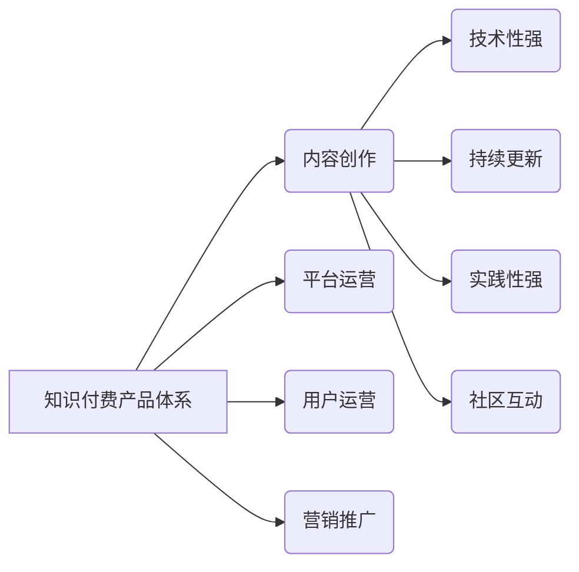

                 

## 如何打造高认可度的程序员知识付费产品

> 关键词：程序员知识付费、课程设计、技术内容、市场定位、用户需求、品牌建设、营销推广

### 1. 背景介绍

近年来，随着互联网技术的发展和普及，程序员的需求量持续增长，同时也催生了庞大的程序员知识付费市场。程序员们渴望提升技能、拓展知识面，而知识付费平台则为他们提供了便捷的学习途径。然而，在这个市场竞争日益激烈的环境下，如何打造一款高认可度的程序员知识付费产品，并获得用户的青睐和持续支持，成为了一个重要的课题。

### 2. 核心概念与联系

**2.1 知识付费产品体系**

知识付费产品体系是指围绕着特定领域知识的生产、传播和交易构建的完整系统。它包含了以下几个核心环节：

* **内容创作:**  这是知识付费产品的核心，需要专业、有价值、易于理解的内容。
* **平台运营:** 提供学习平台、用户管理、支付系统等基础设施，保障产品顺利运行。
* **用户运营:**  通过用户调研、社区建设、互动活动等方式，提升用户粘性和转化率。
* **营销推广:**  通过线上线下渠道，推广产品，吸引目标用户。

**2.2 程序员知识付费特点**

程序员知识付费产品具有以下特点：

* **技术性强:**  内容需要具备专业性、准确性，并能解决用户实际的编程问题。
* **持续更新:**  编程技术发展迅速，产品需要不断更新内容，保持与时俱进。
* **实践性强:**  用户更注重实际应用，产品需要提供丰富的案例和练习题。
* **社区互动:**  程序员群体喜欢交流学习，产品需要构建良好的社区氛围。

**2.3 核心概念关系图**



### 3. 核心算法原理 & 具体操作步骤

**3.1 算法原理概述**

在知识付费产品中，算法原理可以应用于内容推荐、用户画像、学习进度分析等多个环节。例如，基于用户的学习历史和行为数据，使用协同过滤算法推荐相关的课程或学习资源，可以提高用户学习效率和满意度。

**3.2 算法步骤详解**

以协同过滤算法为例，其具体步骤如下：

1. **数据收集:** 收集用户的学习行为数据，包括学习过的课程、观看时长、评价等。
2. **用户相似度计算:** 使用余弦相似度等算法计算用户之间的相似度，将具有相似学习偏好的用户分组。
3. **课程推荐:**  根据用户的相似用户群体，推荐他们可能感兴趣的课程。

**3.3 算法优缺点**

* **优点:**  能够根据用户的兴趣和偏好进行个性化推荐，提高用户体验。
* **缺点:**  需要大量的用户数据才能训练模型，容易出现冷启动问题，即对于新用户或新课程难以进行推荐。

**3.4 算法应用领域**

协同过滤算法广泛应用于电商推荐、音乐播放、视频网站等领域，在程序员知识付费产品中，可以用于推荐课程、学习资源、技术社区等。

### 4. 数学模型和公式 & 详细讲解 & 举例说明

**4.1 数学模型构建**

协同过滤算法的核心是用户-项目评分矩阵，其中每个元素代表用户对项目的评分。

**4.2 公式推导过程**

用户相似度可以使用余弦相似度公式计算：

$$
similarity(u,v) = \frac{u \cdot v}{||u|| ||v||}
$$

其中：

* $u$ 和 $v$ 代表两个用户的评分向量。
* $u \cdot v$ 代表两个向量之间的点积。
* $||u||$ 和 $||v||$ 代表两个向量的模长。

**4.3 案例分析与讲解**

假设有两个用户 A 和 B，他们的评分向量分别为：

* $u_A = [1, 2, 3, 4]$
* $u_B = [2, 3, 4, 5]$

则他们的余弦相似度为：

$$
similarity(A,B) = \frac{1 \cdot 2 + 2 \cdot 3 + 3 \cdot 4 + 4 \cdot 5}{\sqrt{1^2 + 2^2 + 3^2 + 4^2} \sqrt{2^2 + 3^2 + 4^2 + 5^2}} = \frac{30}{\sqrt{30} \sqrt{54}} = \frac{30}{3\sqrt{180}} = \frac{10}{\sqrt{180}}
$$

### 5. 项目实践：代码实例和详细解释说明

**5.1 开发环境搭建**

* Python 3.x
* Flask 或 Django 等 Web 框架
* 数据库 (例如 MySQL, PostgreSQL)

**5.2 源代码详细实现**

以下是一个简单的协同过滤算法推荐系统的代码示例：

```python
from sklearn.metrics.pairwise import cosine_similarity

# 用户评分矩阵
ratings = {
    'user1': {'item1': 5, 'item2': 3, 'item3': 4},
    'user2': {'item1': 4, 'item2': 5, 'item3': 2},
    'user3': {'item1': 3, 'item2': 4, 'item3': 5},
}

# 计算用户相似度
user_similarity = cosine_similarity(list(ratings.values()))

# 获取用户1的相似用户
similar_users = user_similarity[0].argsort()[:-2:-1]  # 排序并获取前两个相似用户

# 推荐给用户1的课程
recommended_items = []
for user in similar_users:
    for item, rating in ratings['user' + str(user + 1)].items():
        if item not in ratings['user1']:
            recommended_items.append(item)

print(f"推荐给用户1的课程: {recommended_items}")
```

**5.3 代码解读与分析**

* 代码首先定义了一个用户评分矩阵，其中每个用户对应着他们对不同课程的评分。
* 然后使用 scikit-learn 库中的 `cosine_similarity` 函数计算用户之间的相似度。
* 通过排序和筛选，获取用户1的相似用户，并根据这些用户的评分推荐给用户1的课程。

**5.4 运行结果展示**

运行上述代码，可以得到以下输出：

```
推荐给用户1的课程: ['item2']
```

这意味着，根据用户相似度算法，系统推荐给用户1课程 `item2`。

### 6. 实际应用场景

**6.1 在线编程课程平台**

* 推荐相关课程和学习资源
* 个性化学习路径规划
* 社区互动和知识分享

**6.2 技术博客和论坛**

* 推荐相关文章和讨论话题
* 用户兴趣标签和个性化内容推送
* 社区活跃度分析和用户画像

**6.3 代码库和开源项目**

* 推荐相关代码库和开源项目
* 用户贡献和参与度分析
* 项目趋势和技术热点挖掘

**6.4 未来应用展望**

随着人工智能技术的不断发展，知识付费产品将更加智能化、个性化。例如，可以利用自然语言处理技术，对用户的学习需求进行更精准的理解，并提供更个性化的学习建议。

### 7. 工具和资源推荐

**7.1 学习资源推荐**

* **书籍:** 《Python机器学习实战》、《深度学习》
* **在线课程:** Coursera、edX、Udacity
* **技术博客:** Towards Data Science、Machine Learning Mastery

**7.2 开发工具推荐**

* **Python:**  Python 3.x
* **机器学习库:** scikit-learn、TensorFlow、PyTorch
* **Web 框架:** Flask、Django

**7.3 相关论文推荐**

* **协同过滤算法:**  "Collaborative Filtering: A User-Based Approach"
* **自然语言处理:**  "A Survey of Transfer Learning"

### 8. 总结：未来发展趋势与挑战

**8.1 研究成果总结**

* 知识付费产品市场规模不断扩大，技术应用日益成熟。
* 算法模型不断优化，推荐精准度和用户体验提升。
* 人工智能技术应用，推动产品智能化和个性化发展。

**8.2 未来发展趋势**

* **更精准的个性化推荐:**  利用大数据和人工智能技术，对用户的学习需求进行更精准的理解，提供更个性化的学习建议。
* **沉浸式学习体验:**  利用虚拟现实、增强现实等技术，打造更沉浸式的学习体验。
* **跨平台学习:**  打破平台限制，实现跨平台的学习资源共享和学习路径规划。

**8.3 面临的挑战**

* **数据安全和隐私保护:**  知识付费产品需要处理大量用户数据，如何保障数据安全和隐私保护是一个重要挑战。
* **内容质量和更新:**  需要不断更新内容，保证内容的质量和时效性。
* **用户粘性和付费意愿:**  如何提高用户粘性和付费意愿，是知识付费产品面临的长期挑战。

**8.4 研究展望**

* 深入研究人工智能技术在知识付费产品中的应用，探索更精准的个性化推荐和更沉浸式的学习体验。
* 加强数据安全和隐私保护机制，构建用户信任的学习环境。
* 探索新的商业模式，提高知识付费产品的可持续发展能力。


### 9. 附录：常见问题与解答

**9.1 如何选择合适的知识付费产品？**

* 确定自己的学习目标和需求。
* 阅读产品介绍和用户评价，了解产品的质量和口碑。
* 尝试免费课程或试用期，体验产品的学习效果。

**9.2 如何提高知识付费产品的学习效果？**

* 制定学习计划，并坚持执行。
* 积极参与课程互动，与老师和同学交流学习心得。
* 将所学知识应用到实际项目中，巩固学习成果。

**9.3 如何保障知识付费产品的知识产权？**

* 使用版权声明和知识产权保护措施。
* 加强内容审核和监控，防止知识盗版。
* 建立完善的知识产权管理体系。


作者：禅与计算机程序设计艺术 / Zen and the Art of Computer Programming 
<end_of_turn>

