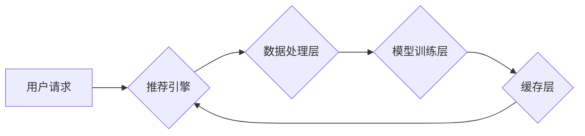

                 

## 实时推荐系统的架构设计与性能优化

> 关键词：实时推荐系统、架构设计、性能优化、机器学习、数据处理、缓存机制、分布式系统、算法原理、实践案例

## 1. 背景介绍

在当今数据爆炸的时代，个性化推荐已成为各大互联网平台的核心竞争力。实时推荐系统能够根据用户的实时行为和偏好，快速精准地推荐相关内容，提升用户体验，促进商业转化。然而，实时推荐系统的构建并非易事，需要兼顾高性能、低延迟、数据处理效率和算法准确性等多个方面。

传统的推荐系统通常采用离线训练的方式，将用户行为数据进行预处理和建模，然后生成静态的推荐列表。这种方式无法满足实时场景的需求，因为用户行为和内容更新速度很快，静态推荐列表容易过时。

实时推荐系统则采用在线学习和推理的方式，实时更新模型参数，并根据用户的最新行为进行动态推荐。这使得实时推荐系统能够更准确地反映用户的实时兴趣，提供更个性化的推荐体验。

## 2. 核心概念与联系

### 2.1  核心概念

* **实时性:**  实时推荐系统需要能够在用户发出请求的瞬间或极短时间内返回推荐结果。
* **个性化:**  推荐结果需要根据用户的历史行为、偏好、上下文等信息进行个性化定制。
* **准确性:**  推荐结果需要尽可能准确地反映用户的兴趣，避免推荐无关或不感兴趣的内容。
* **效率:**  实时推荐系统需要能够处理海量数据，并快速完成推荐计算，以保证低延迟和高吞吐量。

### 2.2  架构关系



**架构关系说明:**

1. **用户请求:** 用户发出推荐请求，例如浏览商品、搜索内容等。
2. **推荐引擎:** 接收用户请求，并根据用户特征和上下文信息，选择合适的推荐算法和模型进行推荐。
3. **数据处理层:** 处理用户请求和推荐结果相关的数据，包括数据清洗、特征提取、数据格式转换等。
4. **模型训练层:** 负责训练和更新推荐模型，可以使用机器学习算法，例如协同过滤、内容过滤、深度学习等。
5. **缓存层:** 缓存推荐结果和模型参数，以提高推荐速度和降低模型训练的延迟。

## 3. 核心算法原理 & 具体操作步骤

### 3.1  算法原理概述

实时推荐系统常用的算法包括：

* **协同过滤:** 基于用户的历史行为相似性进行推荐，例如推荐与用户兴趣相似的用户购买过的商品。
* **内容过滤:** 基于商品的特征和描述进行推荐，例如推荐与用户之前浏览过的商品风格相似的商品。
* **深度学习:** 使用深度神经网络学习用户行为和商品特征之间的复杂关系，进行更精准的推荐。

### 3.2  算法步骤详解

以协同过滤算法为例，其具体操作步骤如下：

1. **数据收集:** 收集用户行为数据，例如用户对商品的评分、购买记录、浏览历史等。
2. **数据预处理:** 对数据进行清洗、去噪、特征提取等处理，例如将用户评分转换为用户对商品的喜好度。
3. **相似度计算:** 计算用户之间的相似度，可以使用余弦相似度、皮尔逊相关系数等方法。
4. **推荐生成:** 根据用户与其他用户的相似度，推荐与相似用户喜欢的商品。

### 3.3  算法优缺点

| 算法 | 优点 | 缺点 |
|---|---|---|
| 协同过滤 | 能够发现隐含的用户兴趣，推荐个性化内容 | 需要大量用户行为数据，容易出现冷启动问题 |
| 内容过滤 | 基于商品特征进行推荐，不受用户行为数据限制 | 容易陷入内容孤岛，推荐结果缺乏多样性 |
| 深度学习 | 能够学习复杂的用户行为模式，推荐精准度高 | 需要大量数据和计算资源，模型训练复杂 |

### 3.4  算法应用领域

实时推荐算法广泛应用于以下领域：

* **电商平台:** 商品推荐、个性化促销
* **视频平台:** 视频推荐、内容发现
* **社交媒体:** 朋友推荐、内容分享
* **音乐平台:** 音乐推荐、个性化播放列表

## 4. 数学模型和公式 & 详细讲解 & 举例说明

### 4.1  数学模型构建

协同过滤算法的核心是用户-商品交互矩阵，该矩阵表示用户对商品的评分或行为。

假设有N个用户和M个商品，则用户-商品交互矩阵可以表示为一个N x M的矩阵，其中每个元素代表用户对商品的评分或行为。

### 4.2  公式推导过程

协同过滤算法常用的相似度计算方法是余弦相似度，其公式如下：

$$
\text{相似度}(u,v) = \frac{\mathbf{u} \cdot \mathbf{v}}{\|\mathbf{u}\| \|\mathbf{v}\| }
$$

其中：

* $\mathbf{u}$ 和 $\mathbf{v}$ 分别表示用户u和用户v的特征向量。
* $\mathbf{u} \cdot \mathbf{v}$ 表示用户u和用户v的内积。
* $\|\mathbf{u}\|$ 和 $\|\mathbf{v}\|$ 分别表示用户u和用户v的特征向量的模长。

### 4.3  案例分析与讲解

假设有两个用户A和B，他们的交互矩阵如下：

| 商品 | A | B |
|---|---|---|
| 1 | 5 | 4 |
| 2 | 3 | 2 |
| 3 | 4 | 5 |
| 4 | 2 | 3 |

我们可以计算用户A和用户B的余弦相似度：

1. 计算用户A和用户B的特征向量：

   * $\mathbf{u} = [5, 3, 4, 2]$
   * $\mathbf{v} = [4, 2, 5, 3]$

2. 计算用户A和用户B的内积：

   * $\mathbf{u} \cdot \mathbf{v} = (5 * 4) + (3 * 2) + (4 * 5) + (2 * 3) = 20 + 6 + 20 + 6 = 52$

3. 计算用户A和用户B的特征向量的模长：

   * $\|\mathbf{u}\| = \sqrt{5^2 + 3^2 + 4^2 + 2^2} = \sqrt{54}$
   * $\|\mathbf{v}\| = \sqrt{4^2 + 2^2 + 5^2 + 3^2} = \sqrt{54}$

4. 计算用户A和用户B的余弦相似度：

   * $\text{相似度}(A,B) = \frac{52}{\sqrt{54} * \sqrt{54}} = \frac{52}{54} = 0.963$

因此，用户A和用户B的余弦相似度为0.963，说明他们之间的兴趣非常相似。

## 5. 项目实践：代码实例和详细解释说明

### 5.1  开发环境搭建

* **操作系统:** Linux/macOS
* **编程语言:** Python
* **框架:** Flask/Django
* **数据库:** MySQL/MongoDB
* **机器学习库:** scikit-learn/TensorFlow/PyTorch

### 5.2  源代码详细实现

```python
# 协同过滤推荐算法示例代码

import numpy as np
from sklearn.metrics.pairwise import cosine_similarity

# 用户-商品交互矩阵
ratings_matrix = np.array([
    [5, 3, 4, 2],
    [4, 2, 5, 3],
    [3, 4, 2, 5],
    [2, 5, 3, 4]
])

# 计算用户之间的余弦相似度
similarity_matrix = cosine_similarity(ratings_matrix)

# 获取用户1的相似用户
user_id = 0
similar_users = np.argsort(similarity_matrix[user_id])[::-1][1:]  # 排序并去除自身

# 推荐给用户1的商品
recommended_items = []
for similar_user in similar_users:
    # 获取相似用户喜欢的商品
    liked_items = np.where(ratings_matrix[similar_user] > 3)[0]
    # 推荐用户1没有喜欢的商品
    for item in liked_items:
        if ratings_matrix[user_id, item] == 0:
            recommended_items.append(item)

# 打印推荐结果
print(f"推荐给用户 {user_id} 的商品：{recommended_items}")
```

### 5.3  代码解读与分析

* 该代码首先定义了用户-商品交互矩阵，并使用scikit-learn库中的cosine_similarity函数计算用户之间的余弦相似度。
* 然后，根据用户ID获取其相似用户，并遍历相似用户的评分矩阵，推荐用户没有评分的商品。
* 该代码只是一个简单的协同过滤推荐算法示例，实际应用中需要考虑更多因素，例如冷启动问题、数据稀疏性、推荐多样性等。

### 5.4  运行结果展示

运行该代码后，会输出推荐给用户0的商品列表。

## 6. 实际应用场景

实时推荐系统广泛应用于以下场景：

* **电商平台:** 个性化商品推荐、新品推荐、限时抢购推荐
* **视频平台:** 视频推荐、内容发现、用户画像分析
* **社交媒体:** 朋友推荐、内容分享、兴趣小组推荐
* **音乐平台:** 音乐推荐、个性化播放列表、音乐发现

### 6.4  未来应用展望

随着人工智能技术的不断发展，实时推荐系统将更加智能化、个性化和精准化。未来，实时推荐系统可能应用于以下领域：

* **医疗保健:** 个性化医疗建议、疾病诊断辅助
* **教育:** 个性化学习推荐、知识发现
* **金融:** 个性化理财建议、风险评估

## 7. 工具和资源推荐

### 7.1  学习资源推荐

* **书籍:**
    * 《推荐系统实践》
    * 《机器学习》
    * 《深度学习》
* **在线课程:**
    * Coursera: Recommender Systems
    * Udacity: Machine Learning Engineer Nanodegree
* **博客和网站:**
    * Recommender Systems Blog
    * Towards Data Science

### 7.2  开发工具推荐

* **框架:** Flask, Django, FastAPI
* **数据库:** MySQL, MongoDB, Redis
* **机器学习库:** scikit-learn, TensorFlow, PyTorch
* **缓存机制:** Memcached, Redis

### 7.3  相关论文推荐

* **协同过滤:**
    * "Collaborative Filtering: A User-Based Approach"
    * "Memory-Based Collaborative Filtering"
* **内容过滤:**
    * "Content-Based Recommendation Systems"
    * "A Survey of Content-Based Recommendation Systems"
* **深度学习:**
    * "Neural Collaborative Filtering"
    * "Deep Learning for Recommender Systems"

## 8. 总结：未来发展趋势与挑战

### 8.1  研究成果总结

实时推荐系统的发展取得了显著成果，算法模型不断完善，推荐效果不断提升。

### 8.2  未来发展趋势

* **更精准的推荐:** 利用深度学习等先进算法，挖掘更深层次的用户行为和商品特征，实现更精准的推荐。
* **更个性化的推荐:** 结合用户多维特征，例如年龄、性别、兴趣爱好、地理位置等，提供更个性化的推荐。
* **更智能的推荐:** 利用自然语言处理、知识图谱等技术，实现更智能的推荐，例如理解用户的意图，提供更符合用户需求的推荐。

### 8.3  面临的挑战

* **数据稀疏性:** 用户行为数据往往是稀疏的，如何有效处理数据稀疏性是实时推荐系统面临的挑战。
* **冷启动问题:** 新用户和新商品缺乏历史数据，如何快速推荐给新用户和新商品是冷启动问题的关键。
* **模型训练效率:** 深度学习模型训练需要大量的计算资源，如何提高模型训练效率是实时推荐系统面临的挑战。

### 8.4  研究展望

未来，实时推荐系统将朝着更智能、更精准、更个性化的方向发展，并应用于更多领域。


## 9. 附录：常见问题与解答

* **什么是实时推荐系统？**

实时推荐系统是指能够根据用户的实时行为和偏好，快速精准地推荐相关内容的推荐系统。

* **实时推荐系统的优势是什么？**

实时推荐系统的优势在于能够提供更个性化、更精准、更及时的内容推荐，提升用户体验和商业转化。

* **如何构建一个实时推荐系统？**

构建一个实时推荐系统需要考虑以下几个方面：数据收集、数据预处理、算法选择、模型训练、部署和维护。

* **实时推荐系统有哪些常见的算法？**

常见的实时推荐系统算法包括协同过滤、内容过滤和深度学习。

* **如何解决实时推荐系统中的数据稀疏性问题？**

数据稀疏性是实时推荐系统面临的常见问题，可以通过以下方法解决：

    * 使用矩阵分解技术
    * 利用协同过滤算法中的相似度计算
    * 使用内容过滤算法
    * 结合用户多维特征进行推荐

作者：禅与计算机程序设计艺术 / Zen and the Art of Computer Programming


<end_of_turn>

