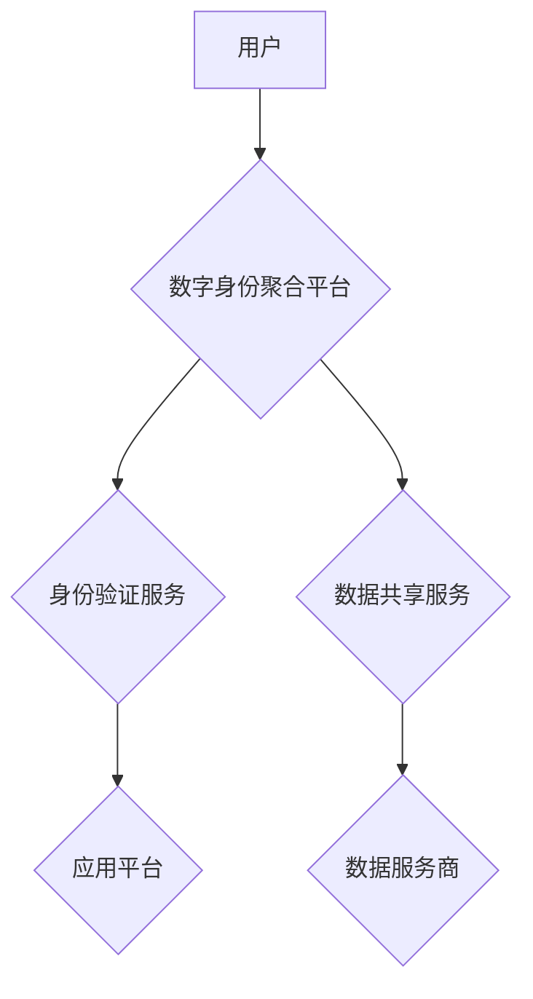

                 

## 2050年的数字身份：从数字身份聚合到数字身份自主的身份主权实现

> 关键词：数字身份、身份聚合、身份主权、去中心化身份、区块链、隐私保护、人工智能、数字孪生

### 1. 背景介绍

21世纪，数字技术飞速发展，互联网已深刻改变了人们的生活方式。随着物联网、大数据、人工智能等技术的蓬勃发展，数字身份将成为未来社会不可或缺的重要组成部分。

传统的数字身份体系通常由中心化机构管理，例如政府机构、金融机构等。用户需要向这些机构提供个人信息，并接受其身份验证和授权。然而，这种中心化体系存在着诸多问题，例如：

* **隐私泄露风险:** 用户个人信息集中存储在中心化机构，容易受到黑客攻击和数据泄露。
* **身份被盗风险:** 中心化机构一旦被攻破，用户身份信息将面临被盗风险。
* **身份验证效率低:** 用户需要在不同平台和服务之间重复验证身份，造成不便。
* **缺乏用户自主权:** 用户对自身身份信息缺乏控制权，无法自主选择使用和共享。

为了解决这些问题，数字身份聚合和数字身份自主的身份主权成为未来数字身份发展的重要趋势。

### 2. 核心概念与联系

**2.1 数字身份聚合**

数字身份聚合是指将用户在不同平台和服务上的分散身份信息整合到一个统一的数字身份标识中。用户可以通过这个标识在不同平台和服务之间进行身份验证和授权，无需重复提供个人信息。

**2.2 数字身份自主的身份主权**

数字身份自主的身份主权是指用户对自身身份信息拥有完全的控制权。用户可以自主选择哪些信息共享给哪些平台和服务，并随时撤销授权。

**2.3 架构图**



### 3. 核心算法原理 & 具体操作步骤

**3.1 算法原理概述**

数字身份聚合和身份主权实现的核心算法主要包括：

* **身份认证算法:** 用于验证用户的身份，确保用户是真实存在的个体。常见的身份认证算法包括生物识别、密码验证、多因素认证等。
* **身份聚合算法:** 用于将用户在不同平台和服务上的分散身份信息整合到一个统一的数字身份标识中。常见的身份聚合算法包括哈希算法、加密算法、区块链技术等。
* **数据共享协议:** 用于规范用户身份信息在不同平台和服务之间的共享方式，确保用户隐私和数据安全。

**3.2 算法步骤详解**

1. **用户注册:** 用户向数字身份聚合平台注册，并提供必要的个人信息和身份验证资料。
2. **身份认证:** 平台使用身份认证算法验证用户的身份，并生成唯一的数字身份标识。
3. **身份聚合:** 用户可以选择将不同平台和服务上的身份信息整合到数字身份标识中。平台使用身份聚合算法将这些信息安全地存储和管理。
4. **数据共享:** 用户可以选择将数字身份标识和部分身份信息共享给特定的应用平台或数据服务商。
5. **授权管理:** 用户可以随时查看、修改和撤销对不同平台和服务的数据共享授权。

**3.3 算法优缺点**

* **优点:**

    * 提高身份验证效率，减少用户重复验证身份的麻烦。
    * 增强用户隐私保护，防止身份信息泄露。
    * 赋予用户对自身身份信息的控制权，实现身份主权。

* **缺点:**

    * 需要建立完善的数字身份基础设施和安全机制。
    * 需要用户积极参与身份聚合和数据共享过程。
    * 需要解决跨平台和跨组织的数据共享和互操作性问题。

**3.4 算法应用领域**

数字身份聚合和身份主权技术在以下领域具有广泛的应用前景：

* **金融服务:** 身份验证、风险控制、反欺诈
* **医疗保健:** 电子病历管理、医疗保险、远程医疗
* **教育:** 学生身份认证、成绩管理、在线学习
* **政府服务:** 公民身份认证、电子政务、社会福利

### 4. 数学模型和公式 & 详细讲解 & 举例说明

**4.1 数学模型构建**

数字身份聚合和身份主权的数学模型可以基于图论和密码学理论构建。

* **图论模型:** 将用户、平台、服务等实体视为图论中的节点，身份信息、授权关系等视为边。
* **密码学模型:** 使用加密算法和数字签名技术确保身份信息的安全性和完整性。

**4.2 公式推导过程**

* **身份聚合公式:**

$$
H(ID_1 || ID_2 || ... || ID_n) = ID_{聚合}
$$

其中，$ID_1$, $ID_2$, ..., $ID_n$ 为用户在不同平台和服务上的身份信息，$H$ 为哈希函数，$ID_{聚合}$ 为用户的数字身份标识。

* **数据共享协议:**

使用公钥密码学技术实现数据加密和解密，确保数据安全性和隐私保护。

**4.3 案例分析与讲解**

假设用户 Alice 在社交平台、电商平台和银行平台都有账号。

* **身份聚合:** Alice 可以将这三个平台上的身份信息聚合到一个数字身份标识中。
* **数据共享:** Alice 可以选择将部分身份信息，例如姓名、邮箱地址等，共享给电商平台，以便进行购物。

### 5. 项目实践：代码实例和详细解释说明

**5.1 开发环境搭建**

* 操作系统: Ubuntu 20.04
* 编程语言: Python 3.8
* 开发工具: PyCharm

**5.2 源代码详细实现**

```python
# 身份聚合示例代码
import hashlib

def aggregate_identity(id_list):
    """
    聚合用户在不同平台上的身份信息
    """
    combined_id = "".join(id_list)
    hashed_id = hashlib.sha256(combined_id.encode()).hexdigest()
    return hashed_id

# 数据共享示例代码
from cryptography.fernet import Fernet

def generate_key():
    """
    生成加密密钥
    """
    key = Fernet.generate_key()
    return key

def encrypt_data(data, key):
    """
    加密数据
    """
    f = Fernet(key)
    encrypted_data = f.encrypt(data.encode())
    return encrypted_data

def decrypt_data(encrypted_data, key):
    """
    解密数据
    """
    f = Fernet(key)
    decrypted_data = f.decrypt(encrypted_data).decode()
    return decrypted_data
```

**5.3 代码解读与分析**

* 身份聚合示例代码使用哈希函数将用户在不同平台上的身份信息组合成一个唯一的数字身份标识。
* 数据共享示例代码使用Fernet加密库实现数据加密和解密，确保数据安全性和隐私保护。

**5.4 运行结果展示**

运行上述代码可以实现用户身份聚合和数据共享的功能。

### 6. 实际应用场景

**6.1 医疗保健**

数字身份聚合可以帮助患者将电子病历、医疗保险信息等整合到一个统一的数字身份标识中，方便在不同医疗机构之间进行信息共享，提高医疗服务效率和质量。

**6.2 金融服务**

数字身份聚合可以帮助用户在不同金融机构之间进行身份验证和授权，简化金融服务流程，提高用户体验。

**6.3 教育**

数字身份聚合可以帮助学生将学籍信息、成绩单等整合到一个统一的数字身份标识中，方便在不同教育机构之间进行身份验证和信息共享，提高教育资源的利用效率。

**6.4 未来应用展望**

随着数字技术的不断发展，数字身份聚合和身份主权技术将在更多领域得到应用，例如：

* **元宇宙:** 数字身份将成为元宇宙中用户身份的基石，赋予用户在虚拟世界中拥有自主权和控制权。
* **物联网:** 数字身份将帮助物联网设备进行身份认证和数据共享，提高物联网系统的安全性、可靠性和效率。
* **人工智能:** 数字身份将与人工智能技术结合，为用户提供更加个性化和智能化的服务。

### 7. 工具和资源推荐

**7.1 学习资源推荐**

* **书籍:**

    * 《数字身份：未来身份的构建》
    * 《区块链技术与数字身份》

* **在线课程:**

    * Coursera: 数字身份与隐私保护
    * edX: 区块链与数字身份

**7.2 开发工具推荐**

* **身份验证平台:**

    * Auth0
    * Okta

* **区块链平台:**

    * Ethereum
    * Hyperledger Fabric

**7.3 相关论文推荐**

* **Self-Sovereign Identity: A Primer**
* **Blockchain for Digital Identity Management**

### 8. 总结：未来发展趋势与挑战

**8.1 研究成果总结**

数字身份聚合和身份主权技术取得了显著的进展，为构建更加安全、便捷、隐私保护的数字身份体系提供了新的思路和方法。

**8.2 未来发展趋势**

* **去中心化身份:** 用户将拥有对自身身份信息的完全控制权，无需依赖中心化机构。
* **数字孪生:** 数字身份将与数字孪生技术结合，为用户提供更加沉浸式和个性化的数字体验。
* **人工智能驱动:** 人工智能将被用于身份验证、风险控制、数据分析等方面，提高数字身份系统的智能化水平。

**8.3 面临的挑战**

* **技术标准化:** 需要建立统一的数字身份标准和规范，确保不同平台和服务之间的数据互操作性。
* **隐私保护:** 需要加强数字身份系统的隐私保护机制，防止用户身份信息被滥用。
* **监管政策:** 需要制定完善的监管政策，引导数字身份技术健康发展。

**8.4 研究展望**

未来，数字身份技术将继续朝着更加安全、便捷、隐私保护的方向发展。研究者将继续探索新的技术方案，解决数字身份技术面临的挑战，为构建更加美好的数字未来贡献力量。

### 9. 附录：常见问题与解答

**9.1 如何注册数字身份？**

用户可以通过数字身份聚合平台的官网或APP进行注册，并提供必要的个人信息和身份验证资料。

**9.2 如何共享我的身份信息？**

用户可以通过数字身份聚合平台的界面选择共享哪些身份信息给哪些平台和服务。

**9.3 我的身份信息是否安全？**

数字身份聚合平台采用先进的加密技术和安全机制，确保用户身份信息的安全性。

**9.4 我可以撤销对身份信息的共享授权吗？**

用户可以随时通过数字身份聚合平台的界面撤销对身份信息的共享授权。


作者：禅与计算机程序设计艺术 / Zen and the Art of Computer Programming 
<end_of_turn>

