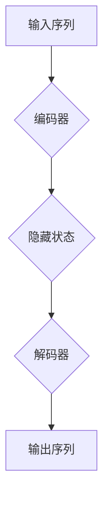

                 

## 序列到序列学习：机器翻译与文本摘要技术

> 关键词：序列到序列学习，机器翻译，文本摘要，循环神经网络，长短期记忆网络，注意力机制，Transformer

## 1. 背景介绍

在深度学习领域，序列到序列学习（Sequence-to-Sequence Learning）是一种强大的机器学习范式，它能够处理输入序列和输出序列之间的映射关系。这种范式在自然语言处理（NLP）领域取得了显著的成功，特别是在机器翻译和文本摘要等任务中。

传统的机器翻译方法通常依赖于统计模型和规则引擎，需要大量的标注数据和人工特征工程。而序列到序列学习则利用深度神经网络自动学习输入序列和输出序列之间的映射关系，无需人工特征工程，并且能够处理更复杂的语言结构和语义关系。

文本摘要则是从长文本中提取关键信息生成短文本的过程。序列到序列学习可以有效地学习文本的语义结构和重要信息，生成高质量的文本摘要。

## 2. 核心概念与联系

序列到序列学习的核心概念是使用一个编码器-解码器结构来处理输入序列和输出序列。

* **编码器:** 负责将输入序列编码成一个固定长度的向量表示，该向量包含了输入序列的语义信息。
* **解码器:** 负责根据编码器的输出向量生成输出序列。

**Mermaid 流程图:**



## 3. 核心算法原理 & 具体操作步骤

### 3.1  算法原理概述

序列到序列学习的核心算法是循环神经网络（RNN），特别是长短期记忆网络（LSTM）和门控循环单元（GRU）。这些网络能够处理序列数据，并学习序列中的长期依赖关系。

**LSTM 和 GRU 的工作原理:**

* LSTM 和 GRU 都是 RNN 的变体，它们引入了门控机制来控制信息的流动，从而能够更好地学习长期依赖关系。
* LSTM 包含了输入门、遗忘门和输出门，而 GRU 则简化了门控机制。
* 这些门控机制根据输入序列和隐藏状态的当前信息决定哪些信息应该被保留、遗忘或输出。

### 3.2  算法步骤详解

1. **输入序列编码:** 将输入序列逐个元素地输入到编码器中，编码器会将每个元素映射到一个隐藏状态向量。
2. **隐藏状态聚合:** 编码器会将所有隐藏状态向量聚合起来，形成一个上下文向量，该向量包含了输入序列的语义信息。
3. **解码器初始化:** 解码器会根据上下文向量初始化其隐藏状态。
4. **输出序列生成:** 解码器会根据其隐藏状态生成输出序列的每个元素。
5. **反向传播:** 使用损失函数计算编码器和解码器的输出与真实值的差异，并通过反向传播算法更新网络参数。

### 3.3  算法优缺点

**优点:**

* 能够处理任意长度的输入和输出序列。
* 可以学习复杂的语言结构和语义关系。
* 不需要人工特征工程。

**缺点:**

* 训练时间长，需要大量的计算资源。
* 容易出现梯度消失或梯度爆炸问题。

### 3.4  算法应用领域

* **机器翻译:** 将一种语言的文本翻译成另一种语言。
* **文本摘要:** 从长文本中提取关键信息生成短文本。
* **对话系统:** 建立人机对话系统。
* **语音识别:** 将语音信号转换为文本。
* **图像字幕:** 为图像生成文本描述。

## 4. 数学模型和公式 & 详细讲解 & 举例说明

### 4.1  数学模型构建

序列到序列学习模型通常使用以下数学模型：

* **编码器:** 使用 RNN 或 Transformer 网络，将输入序列编码成一个上下文向量。
* **解码器:** 使用 RNN 或 Transformer 网络，根据上下文向量生成输出序列。

### 4.2  公式推导过程

* **RNN 的隐藏状态更新公式:**

$$h_t = f(W_{hh}h_{t-1} + W_{xh}x_t + b_h)$$

其中:

* $h_t$ 是时间步 t 的隐藏状态向量。
* $h_{t-1}$ 是时间步 t-1 的隐藏状态向量。
* $x_t$ 是时间步 t 的输入元素。
* $W_{hh}$ 和 $W_{xh}$ 是权重矩阵。
* $b_h$ 是偏置项。
* $f$ 是激活函数。

* **LSTM 的门控更新公式:**

$$i_t = \sigma(W_{xi}x_t + W_{hi}h_{t-1} + b_i)$$

$$f_t = \sigma(W_{xf}x_t + W_{hf}h_{t-1} + b_f)$$

$$o_t = \sigma(W_{xo}x_t + W_{ho}h_{t-1} + b_o)$$

$$c_t = f_t * c_{t-1} + i_t * \tanh(W_{xc}x_t + W_{hc}h_{t-1} + b_c)$$

$$h_t = o_t * \tanh(c_t)$$

其中:

* $i_t$, $f_t$, $o_t$ 分别是输入门、遗忘门和输出门。
* $c_t$ 是细胞状态。

### 4.3  案例分析与讲解

假设我们想要使用序列到序列学习模型进行机器翻译，将英文句子 "The cat sat on the mat" 翻译成法文。

1. **编码器:** 将英文句子 "The cat sat on the mat" 逐个单词输入到编码器中，编码器会将每个单词映射到一个隐藏状态向量。
2. **上下文向量:** 编码器会将所有隐藏状态向量聚合起来，形成一个上下文向量，该向量包含了英文句子的语义信息。
3. **解码器:** 解码器会根据上下文向量生成法文句子的每个单词。
4. **输出序列:** 解码器最终会生成法文句子 "Le chat s'est assis sur le tapis"。

## 5. 项目实践：代码实例和详细解释说明

### 5.1  开发环境搭建

* Python 3.6+
* TensorFlow 或 PyTorch
* CUDA 和 cuDNN (可选，用于 GPU 加速)

### 5.2  源代码详细实现

```python
import tensorflow as tf

# 定义编码器模型
encoder_model = tf.keras.Sequential([
    tf.keras.layers.Embedding(input_dim=vocab_size, output_dim=embedding_dim),
    tf.keras.layers.LSTM(units=hidden_units),
])

# 定义解码器模型
decoder_model = tf.keras.Sequential([
    tf.keras.layers.Embedding(input_dim=vocab_size, output_dim=embedding_dim),
    tf.keras.layers.LSTM(units=hidden_units),
    tf.keras.layers.Dense(units=vocab_size, activation='softmax')
])

# 定义序列到序列模型
model = tf.keras.Model(inputs=encoder_model.input, outputs=decoder_model.output)

# 编译模型
model.compile(optimizer='adam', loss='sparse_categorical_crossentropy', metrics=['accuracy'])

# 训练模型
model.fit(train_data, train_labels, epochs=10)

# 预测
predictions = model.predict(test_data)
```

### 5.3  代码解读与分析

* **编码器模型:** 使用 Embedding 层将单词映射到向量表示，然后使用 LSTM 层学习单词之间的语义关系。
* **解码器模型:** 使用 Embedding 层将单词映射到向量表示，然后使用 LSTM 层生成输出序列。
* **序列到序列模型:** 将编码器和解码器连接起来，形成一个完整的模型。
* **模型编译:** 使用 Adam 优化器、稀疏类别交叉熵损失函数和准确率作为评估指标。
* **模型训练:** 使用训练数据训练模型。
* **模型预测:** 使用测试数据预测输出序列。

### 5.4  运行结果展示

训练完成后，可以使用测试数据评估模型的性能，并可视化预测结果与真实结果的差异。

## 6. 实际应用场景

### 6.1  机器翻译

序列到序列学习模型在机器翻译领域取得了显著的成功，例如 Google Translate 和 DeepL 等翻译工具都使用了序列到序列学习模型。

### 6.2  文本摘要

序列到序列学习模型可以用于生成文本摘要，例如从新闻文章中提取关键信息生成摘要，或者从长篇论文中生成简短的摘要。

### 6.3  对话系统

序列到序列学习模型可以用于构建对话系统，例如聊天机器人和虚拟助手。

### 6.4  未来应用展望

随着深度学习技术的不断发展，序列到序列学习模型将在更多领域得到应用，例如：

* **代码生成:** 根据自然语言描述生成代码。
* **音乐创作:** 根据音乐风格生成新的音乐作品。
* **药物研发:** 根据分子结构预测药物的活性。

## 7. 工具和资源推荐

### 7.1  学习资源推荐

* **书籍:**
    * "Deep Learning" by Ian Goodfellow, Yoshua Bengio, and Aaron Courville
    * "Speech and Language Processing" by Daniel Jurafsky and James H. Martin
* **在线课程:**
    * Coursera: "Natural Language Processing Specialization"
    * Udacity: "Deep Learning Nanodegree"

### 7.2  开发工具推荐

* **TensorFlow:** https://www.tensorflow.org/
* **PyTorch:** https://pytorch.org/

### 7.3  相关论文推荐

* "Sequence to Sequence Learning with Neural Networks" by Sutskever et al. (2014)
* "Attention Is All You Need" by Vaswani et al. (2017)

## 8. 总结：未来发展趋势与挑战

### 8.1  研究成果总结

序列到序列学习模型在机器翻译和文本摘要等任务中取得了显著的成功，并推动了深度学习在自然语言处理领域的应用。

### 8.2  未来发展趋势

* **更强大的模型架构:** 研究更强大的模型架构，例如 Transformer 的变体，以提高模型的性能和效率。
* **更好的训练方法:** 研究更有效的训练方法，例如自监督学习和迁移学习，以减少模型训练所需的数据量和计算资源。
* **更广泛的应用场景:** 将序列到序列学习模型应用到更多领域，例如代码生成、音乐创作和药物研发。

### 8.3  面临的挑战

* **数据稀缺性:** 许多领域的数据稀缺，这限制了模型的训练和性能。
* **计算资源限制:** 训练大型序列到序列学习模型需要大量的计算资源。
* **可解释性问题:** 深度学习模型的决策过程难以解释，这限制了模型在一些领域应用的推广。

### 8.4  研究展望

未来，序列到序列学习模型的研究将继续朝着更强大、更高效、更可解释的方向发展，并将在更多领域发挥重要作用。

## 9. 附录：常见问题与解答

* **什么是序列到序列学习？**

序列到序列学习是一种机器学习范式，它能够处理输入序列和输出序列之间的映射关系。

* **序列到序列学习模型有哪些？**

常见的序列到序列学习模型包括循环神经网络（RNN）、长短期记忆网络（LSTM）和门控循环单元（GRU）。

* **序列到序列学习模型有哪些应用场景？**

序列到序列学习模型的应用场景包括机器翻译、文本摘要、对话系统、语音识别和图像字幕等。


作者：禅与计算机程序设计艺术 / Zen and the Art of Computer Programming 
<end_of_turn>

