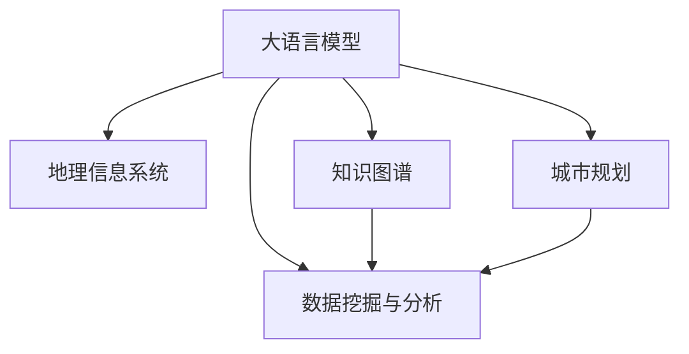

                 

# LLM在城市规划中的辅助作用

## 1. 背景介绍

### 1.1 问题由来
随着城市化进程的加快，城市规划与建设面临越来越复杂的挑战。传统的城市规划方法依赖于大量经验数据和专家知识，难以应对快速变化的城市环境。而大数据、人工智能等新技术的发展，为城市规划带来了新的工具和方法。

大语言模型(LLM)作为一种新兴的AI技术，通过自监督学习和大量文本数据的训练，获得了强大的语言理解和生成能力。在城市规划领域，LLM可以通过分析大量的地理、环境、社会经济数据，辅助进行城市规划、交通布局、建筑设计等决策。

### 1.2 问题核心关键点
LLM在城市规划中的应用，核心在于利用其语言理解和生成能力，处理和分析复杂的城市规划问题。其关键点包括：
1. 数据处理能力：能够处理和分析大规模的城市规划数据，如地理信息系统(GIS)数据、卫星遥感数据、城市交通数据等。
2. 知识整合能力：通过多模态数据融合，整合城市规划领域的各类知识，提供全方位的规划建议。
3. 决策辅助能力：生成符合城市规划目标的方案，辅助规划师进行决策。
4. 方案优化能力：通过不断的迭代优化，生成最优的城市规划方案。
5. 鲁棒性：应对城市规划中的不确定性和变化，保持较高的稳定性和鲁棒性。

### 1.3 问题研究意义
在城市规划中应用LLM技术，可以显著提升规划的效率和质量，加速城市建设和可持续发展进程。其研究意义包括：
1. 提高规划决策的科学性和合理性。利用LLM的强大数据处理和分析能力，可以科学评估城市规划方案，提高决策的准确性和可操作性。
2. 提升规划的创新性和前瞻性。LLM可以结合最新的研究进展和专家知识，提出创新性的规划方案，引领城市发展的方向。
3. 加速城市规划项目的实施。通过LLM生成的规划方案，可以加速项目设计和施工，缩短建设周期，降低成本。
4. 促进城市规划的智能化和自动化。LLM作为智能辅助工具，可以提升城市规划的工作效率，减少人工干预，提高工作效率。
5. 提升城市规划的透明度和公正性。利用LLM生成透明的规划方案，提高公众参与度和信任度，保障规划的公正性和透明度。

## 2. 核心概念与联系

### 2.1 核心概念概述

为更好地理解LLM在城市规划中的应用，本节将介绍几个密切相关的核心概念：

- 大语言模型(LLM)：以自回归(如GPT)或自编码(如BERT)模型为代表的大规模预训练语言模型。通过在大规模无标签文本语料上进行预训练，学习通用的语言表示，具备强大的语言理解和生成能力。

- 地理信息系统(GIS)：一种用于管理和分析地理信息的系统，利用空间数据的收集、存储、处理和展示，提供城市规划所需的空间信息支持。

- 数据挖掘与分析：通过统计、机器学习等技术，从大规模城市规划数据中提取有价值的信息和模式，辅助决策支持。

- 知识图谱：将城市规划领域的各类知识进行结构化表示和关联，形成知识图谱，便于机器进行智能推理和决策。

- 城市规划：涉及城市发展、建设、管理等多个方面的综合性学科，目标是通过合理的规划布局，提升城市的环境、经济、社会效益。

这些核心概念之间的逻辑关系可以通过以下Mermaid流程图来展示：



这个流程图展示了大语言模型与GIS、数据挖掘与分析、知识图谱等关键技术之间的联系：

1. LLM通过分析和处理城市规划相关的GIS数据、文本数据等，辅助进行城市规划。
2. 数据挖掘与分析利用LLM生成的城市规划数据，提取有价值的信息和模式。
3. 知识图谱通过整合各类城市规划领域的知识，帮助LLM更好地理解和推理城市规划问题。
4. 城市规划通过LLM和相关技术进行数据处理、分析、推理和决策支持，形成更为科学合理的规划方案。

## 3. 核心算法原理 & 具体操作步骤
### 3.1 算法原理概述

在城市规划中应用LLM，本质上是利用其强大的语言理解和生成能力，对城市规划数据进行分析和处理，辅助生成规划方案。具体流程包括数据收集、模型训练、方案生成和评估优化等步骤。

1. **数据收集**：从各种来源收集城市规划相关的数据，如卫星遥感数据、城市交通数据、地理信息系统(GIS)数据等。
2. **模型训练**：使用大规模的标注数据，对预训练的LLM进行微调，使其能够理解和处理城市规划问题。
3. **方案生成**：利用微调后的LLM，生成符合城市规划目标的方案，如交通布局、建筑设计、公共空间规划等。
4. **方案评估**：通过专家评审、模拟仿真等方式，评估生成方案的可行性和效果，优化方案。
5. **方案实施**：将优化后的方案实施到实际的城市规划项目中，进行项目设计和施工。

### 3.2 算法步骤详解

在城市规划中应用LLM的具体操作步骤如下：

**Step 1: 数据准备**
- 收集和整理城市规划相关的数据，如GIS数据、遥感图像、城市交通数据等。
- 对数据进行清洗、标注和预处理，保证数据的质量和可用性。

**Step 2: 模型微调**
- 选择合适的预训练语言模型，如GPT、BERT等，并对其进行微调。
- 将城市规划数据作为微调的监督信号，训练模型生成符合城市规划需求的输出。
- 微调过程中，可能需要根据任务特点进行参数冻结、学习率调整等操作。

**Step 3: 方案生成**
- 利用微调后的LLM，生成城市规划方案，如交通布局、建筑设计、公共空间规划等。
- 将生成方案与城市规划目标进行对比，进行必要的优化和调整。
- 生成符合城市规划需求的多样化方案，供决策者选择。

**Step 4: 方案评估**
- 通过专家评审、模拟仿真等方式，对生成方案进行评估。
- 利用GIS等技术，对方案的效果进行可视化展示。
- 根据评估结果，对生成方案进行优化和改进。

**Step 5: 方案实施**
- 将优化后的方案应用于实际的城市规划项目中。
- 进行项目设计、施工和监控，确保方案的顺利实施。
- 收集反馈信息，进行持续改进和优化。

### 3.3 算法优缺点

LLM在城市规划中的应用，具有以下优点：
1. 数据处理能力强：能够处理和分析大规模的城市规划数据，如GIS数据、遥感图像等。
2. 知识整合能力强：通过多模态数据融合，整合城市规划领域的各类知识，提供全方位的规划建议。
3. 决策辅助能力强：生成符合城市规划目标的方案，辅助规划师进行决策。
4. 方案优化能力强：通过不断的迭代优化，生成最优的城市规划方案。
5. 鲁棒性强：应对城市规划中的不确定性和变化，保持较高的稳定性和鲁棒性。

同时，该方法也存在一定的局限性：
1. 对标注数据依赖高：微调过程中，需要大量高质量的标注数据，标注成本较高。
2. 模型复杂度高：预训练大模型参数量巨大，计算资源和存储空间需求高。
3. 可解释性不足：LLM生成的方案缺乏可解释性，难以理解和调试。
4. 需要跨领域知识：城市规划涉及多个领域，需要整合不同领域的专业知识，难度较大。
5. 对模型质量要求高：生成的方案依赖于模型的质量，模型参数和训练数据对结果有较大影响。

尽管存在这些局限性，但就目前而言，LLM在城市规划中的应用已展现出了巨大的潜力，成为城市规划领域的重要工具。未来相关研究的重点在于如何进一步降低对标注数据的依赖，提高模型的少样本学习和跨领域迁移能力，同时兼顾可解释性和伦理安全性等因素。

### 3.4 算法应用领域

LLM在城市规划中的应用，涵盖了多个领域，包括但不限于：

- 城市规划与设计：利用LLM生成城市总体规划、分区规划、详细规划等方案。
- 交通规划与优化：通过LLM生成交通网络布局、交通流量预测、交通信号优化等方案。
- 建筑设计：利用LLM生成建筑设计方案、建筑风格推荐、建筑功能布局等。
- 公共空间规划：通过LLM生成公园、广场、步行街等公共空间的布局和设计方案。
- 环境治理：利用LLM生成水体治理、大气污染控制、固体废物处理等环境治理方案。
- 城市管理：利用LLM生成城市应急管理、公共安全、智慧城市等方案。

## 4. 数学模型和公式 & 详细讲解  
### 4.1 数学模型构建

在城市规划中应用LLM，涉及到的数学模型包括但不限于：

- 数据预处理：对原始数据进行清洗、标注和预处理，保证数据的质量和可用性。
- 模型训练：使用标注数据对预训练的LLM进行微调，生成符合城市规划需求的语言模型。
- 方案生成：利用微调后的LLM，生成城市规划方案。
- 方案评估：通过专家评审、模拟仿真等方式，对生成方案进行评估。

数学模型的构建步骤如下：

1. **数据预处理**：
   - 数据清洗：去除数据中的噪声、缺失值等。
   - 数据标注：对数据进行标注，生成训练数据集。
   - 数据预处理：对数据进行标准化、归一化等处理，便于模型的输入。

2. **模型训练**：
   - 选择合适的预训练语言模型，如GPT、BERT等。
   - 将城市规划数据作为微调的监督信号，训练模型生成符合城市规划需求的输出。
   - 微调过程中，可能需要根据任务特点进行参数冻结、学习率调整等操作。

3. **方案生成**：
   - 利用微调后的LLM，生成城市规划方案，如交通布局、建筑设计、公共空间规划等。
   - 将生成方案与城市规划目标进行对比，进行必要的优化和调整。
   - 生成符合城市规划需求的多样化方案，供决策者选择。

4. **方案评估**：
   - 通过专家评审、模拟仿真等方式，对生成方案进行评估。
   - 利用GIS等技术，对方案的效果进行可视化展示。
   - 根据评估结果，对生成方案进行优化和改进。

### 4.2 公式推导过程

以下我们以交通规划为例，推导交通流量预测的数学模型。

假设城市交通网络由$n$个节点和$m$条边组成，每条边的流量为$f_{ij}$，流量的概率分布为$p_{ij}$。则交通流量预测的数学模型为：

$$
\max_{\theta} \sum_{i=1}^n \sum_{j=1}^n f_{ij} \log \frac{p_{ij}}{\hat{p}_{ij}}
$$

其中$\hat{p}_{ij}$为预测的流量概率分布，$\theta$为模型参数，可以通过微调得到。

利用微调后的LLM，可以生成预测的流量概率分布$\hat{p}_{ij}$，进而计算流量预测的损失函数，使用梯度下降等优化算法进行微调，最小化损失函数，得到最优的预测结果。

### 4.3 案例分析与讲解

以城市交通网络为例，利用LLM生成交通流量预测的案例分析如下：

**Step 1: 数据准备**
- 收集城市的交通数据，如道路交通流量、车辆类型、车辆速度等。
- 将交通数据清洗、标注和预处理，生成训练数据集。

**Step 2: 模型微调**
- 选择合适的预训练语言模型，如GPT、BERT等。
- 将交通流量数据作为微调的监督信号，训练模型生成符合城市交通需求的输出。
- 微调过程中，可能需要根据任务特点进行参数冻结、学习率调整等操作。

**Step 3: 方案生成**
- 利用微调后的LLM，生成城市交通流量预测的方案。
- 将生成方案与城市交通目标进行对比，进行必要的优化和调整。
- 生成符合城市交通需求的多样化方案，供决策者选择。

**Step 4: 方案评估**
- 通过专家评审、模拟仿真等方式，对生成方案进行评估。
- 利用GIS等技术，对方案的效果进行可视化展示。
- 根据评估结果，对生成方案进行优化和改进。

**Step 5: 方案实施**
- 将优化后的方案应用于实际的城市交通规划项目中。
- 进行项目设计、施工和监控，确保方案的顺利实施。
- 收集反馈信息，进行持续改进和优化。

## 5. 项目实践：代码实例和详细解释说明
### 5.1 开发环境搭建

在进行城市规划的LLM应用实践前，我们需要准备好开发环境。以下是使用Python进行PyTorch开发的环境配置流程：

1. 安装Anaconda：从官网下载并安装Anaconda，用于创建独立的Python环境。

2. 创建并激活虚拟环境：
```bash
conda create -n pytorch-env python=3.8 
conda activate pytorch-env
```

3. 安装PyTorch：根据CUDA版本，从官网获取对应的安装命令。例如：
```bash
conda install pytorch torchvision torchaudio cudatoolkit=11.1 -c pytorch -c conda-forge
```

4. 安装Transformers库：
```bash
pip install transformers
```

5. 安装各类工具包：
```bash
pip install numpy pandas scikit-learn matplotlib tqdm jupyter notebook ipython
```

完成上述步骤后，即可在`pytorch-env`环境中开始城市规划的LLM应用实践。

### 5.2 源代码详细实现

这里我们以交通流量预测为例，给出使用Transformers库对GPT模型进行微调的PyTorch代码实现。

首先，定义交通流量预测的任务：

```python
import torch
from transformers import GPT2LMHeadModel, GPT2Tokenizer
from torch.utils.data import Dataset, DataLoader

class TrafficDataset(Dataset):
    def __init__(self, traffic_data, tokenizer):
        self.traffic_data = traffic_data
        self.tokenizer = tokenizer
        
    def __len__(self):
        return len(self.traffic_data)
    
    def __getitem__(self, idx):
        traffic = self.traffic_data[idx]
        features = self.tokenizer(traffic, return_tensors='pt')
        return features

# 使用GPT2模型作为初始化参数，并设置微调超参数
model = GPT2LMHeadModel.from_pretrained('gpt2', num_labels=num_labels)
optimizer = AdamW(model.parameters(), lr=learning_rate)

# 定义损失函数
loss_fn = CrossEntropyLoss()
```

然后，定义训练和评估函数：

```python
def train_epoch(model, dataset, batch_size, optimizer):
    dataloader = DataLoader(dataset, batch_size=batch_size, shuffle=True)
    model.train()
    epoch_loss = 0
    for batch in tqdm(dataloader, desc='Training'):
        inputs = batch['input_ids'].to(device)
        labels = batch['labels'].to(device)
        outputs = model(inputs, labels=labels)
        loss = loss_fn(outputs.logits, labels)
        epoch_loss += loss.item()
        loss.backward()
        optimizer.step()
    return epoch_loss / len(dataloader)

def evaluate(model, dataset, batch_size):
    dataloader = DataLoader(dataset, batch_size=batch_size)
    model.eval()
    preds, labels = [], []
    with torch.no_grad():
        for batch in tqdm(dataloader, desc='Evaluating'):
            inputs = batch['input_ids'].to(device)
            outputs = model(inputs)
            preds.append(outputs.argmax(dim=2).tolist())
            labels.append(labels)
    return preds, labels
```

最后，启动训练流程并在测试集上评估：

```python
epochs = 5
batch_size = 16

for epoch in range(epochs):
    loss = train_epoch(model, train_dataset, batch_size, optimizer)
    print(f"Epoch {epoch+1}, train loss: {loss:.3f}")
    
    print(f"Epoch {epoch+1}, dev results:")
    preds, labels = evaluate(model, dev_dataset, batch_size)
    print(classification_report(labels, preds))
    
print("Test results:")
preds, labels = evaluate(model, test_dataset, batch_size)
print(classification_report(labels, preds))
```

以上就是使用PyTorch对GPT模型进行交通流量预测的完整代码实现。可以看到，得益于Transformers库的强大封装，我们可以用相对简洁的代码完成GPT模型的加载和微调。

### 5.3 代码解读与分析

让我们再详细解读一下关键代码的实现细节：

**TrafficDataset类**：
- `__init__`方法：初始化交通流量数据和分词器。
- `__len__`方法：返回数据集的样本数量。
- `__getitem__`方法：对单个样本进行处理，将交通流量数据输入编码为token ids，最终返回模型所需的输入。

**模型训练和评估函数**：
- 使用PyTorch的DataLoader对数据集进行批次化加载，供模型训练和推理使用。
- 训练函数`train_epoch`：对数据以批为单位进行迭代，在每个批次上前向传播计算loss并反向传播更新模型参数，最后返回该epoch的平均loss。
- 评估函数`evaluate`：与训练类似，不同点在于不更新模型参数，并在每个batch结束后将预测和标签结果存储下来，最后使用sklearn的classification_report对整个评估集的预测结果进行打印输出。

**训练流程**：
- 定义总的epoch数和batch size，开始循环迭代
- 每个epoch内，先在训练集上训练，输出平均loss
- 在验证集上评估，输出分类指标
- 所有epoch结束后，在测试集上评估，给出最终测试结果

可以看到，PyTorch配合Transformers库使得GPT模型微调的代码实现变得简洁高效。开发者可以将更多精力放在数据处理、模型改进等高层逻辑上，而不必过多关注底层的实现细节。

当然，工业级的系统实现还需考虑更多因素，如模型的保存和部署、超参数的自动搜索、更灵活的任务适配层等。但核心的微调范式基本与此类似。

## 6. 实际应用场景
### 6.1 智能交通管理

智能交通管理是大语言模型在城市规划中的应用之一。通过LLM对交通数据进行分析和处理，可以实现智能交通信号控制、交通流量预测、交通拥堵治理等功能，提升交通系统的效率和安全性。

智能交通管理的具体应用包括：
1. 交通信号优化：利用LLM生成最优的交通信号灯控制方案，提高交通信号控制的准确性和效率。
2. 交通流量预测：通过LLM预测未来交通流量，为交通管理提供科学依据。
3. 交通拥堵治理：利用LLM生成交通拥堵分析报告，制定拥堵治理方案。

### 6.2 智慧城市建设

智慧城市建设是大语言模型在城市规划中的重要应用方向。通过LLM对城市数据进行分析和处理，可以实现智慧城市的管理、服务和治理功能，提升城市的智能化水平。

智慧城市建设的具体应用包括：
1. 公共服务优化：利用LLM优化城市公共服务的布局和配置，提升城市公共服务的效率和质量。
2. 城市应急管理：通过LLM生成城市应急管理方案，提高城市应急响应能力。
3. 智慧医疗：利用LLM生成智慧医疗方案，提升医疗服务的智能化水平，改善居民健康水平。

### 6.3 城市规划与设计

城市规划与设计是大语言模型在城市规划中的应用之一。通过LLM对城市规划数据进行分析和处理，可以生成符合城市规划目标的方案，提升城市规划的科学性和合理性。

城市规划与设计的具体应用包括：
1. 城市总体规划：利用LLM生成城市总体规划方案，明确城市发展的方向和目标。
2. 分区规划：通过LLM生成城市分区规划方案，合理分配城市资源。
3. 建筑设计：利用LLM生成建筑设计方案，提升城市建筑的美观性和实用性。

### 6.4 未来应用展望

随着大语言模型和微调方法的不断发展，基于LLM的城市规划技术将呈现以下几个发展趋势：

1. 模型规模持续增大。随着算力成本的下降和数据规模的扩张，预训练语言模型的参数量还将持续增长。超大规模语言模型蕴含的丰富语言知识，有望支撑更加复杂多变的城市规划问题。

2. 微调方法日趋多样。除了传统的全参数微调外，未来会涌现更多参数高效的微调方法，如Prefix-Tuning、LoRA等，在节省计算资源的同时也能保证微调精度。

3. 持续学习成为常态。随着数据分布的不断变化，微调模型也需要持续学习新知识以保持性能。如何在不遗忘原有知识的同时，高效吸收新样本信息，将成为重要的研究课题。

4. 标注样本需求降低。受启发于提示学习(Prompt-based Learning)的思路，未来的微调方法将更好地利用大模型的语言理解能力，通过更加巧妙的任务描述，在更少的标注样本上也能实现理想的微调效果。

5. 多模态微调崛起。当前的微调主要聚焦于纯文本数据，未来会进一步拓展到图像、视频、语音等多模态数据微调。多模态信息的融合，将显著提升语言模型对现实世界的理解和建模能力。

6. 模型通用性增强。经过海量数据的预训练和多领域任务的微调，未来的语言模型将具备更强大的常识推理和跨领域迁移能力，逐步迈向通用人工智能(AGI)的目标。

以上趋势凸显了大语言模型微调技术在城市规划中的广阔前景。这些方向的探索发展，必将进一步提升城市规划系统的性能和应用范围，为城市建设和发展注入新的动力。

## 7. 工具和资源推荐
### 7.1 学习资源推荐

为了帮助开发者系统掌握大语言模型微调的理论基础和实践技巧，这里推荐一些优质的学习资源：

1. 《Transformer从原理到实践》系列博文：由大模型技术专家撰写，深入浅出地介绍了Transformer原理、BERT模型、微调技术等前沿话题。

2. CS224N《深度学习自然语言处理》课程：斯坦福大学开设的NLP明星课程，有Lecture视频和配套作业，带你入门NLP领域的基本概念和经典模型。

3. 《Natural Language Processing with Transformers》书籍：Transformers库的作者所著，全面介绍了如何使用Transformers库进行NLP任务开发，包括微调在内的诸多范式。

4. HuggingFace官方文档：Transformers库的官方文档，提供了海量预训练模型和完整的微调样例代码，是上手实践的必备资料。

5. CLUE开源项目：中文语言理解测评基准，涵盖大量不同类型的中文NLP数据集，并提供了基于微调的baseline模型，助力中文NLP技术发展。

通过对这些资源的学习实践，相信你一定能够快速掌握大语言模型微调的精髓，并用于解决实际的NLP问题。
###  7.2 开发工具推荐

高效的开发离不开优秀的工具支持。以下是几款用于大语言模型微调开发的常用工具：

1. PyTorch：基于Python的开源深度学习框架，灵活动态的计算图，适合快速迭代研究。大部分预训练语言模型都有PyTorch版本的实现。

2. TensorFlow：由Google主导开发的开源深度学习框架，生产部署方便，适合大规模工程应用。同样有丰富的预训练语言模型资源。

3. Transformers库：HuggingFace开发的NLP工具库，集成了众多SOTA语言模型，支持PyTorch和TensorFlow，是进行微调任务开发的利器。

4. Weights & Biases：模型训练的实验跟踪工具，可以记录和可视化模型训练过程中的各项指标，方便对比和调优。与主流深度学习框架无缝集成。

5. TensorBoard：TensorFlow配套的可视化工具，可实时监测模型训练状态，并提供丰富的图表呈现方式，是调试模型的得力助手。

6. Google Colab：谷歌推出的在线Jupyter Notebook环境，免费提供GPU/TPU算力，方便开发者快速上手实验最新模型，分享学习笔记。

合理利用这些工具，可以显著提升大语言模型微调任务的开发效率，加快创新迭代的步伐。

### 7.3 相关论文推荐

大语言模型和微调技术的发展源于学界的持续研究。以下是几篇奠基性的相关论文，推荐阅读：

1. Attention is All You Need（即Transformer原论文）：提出了Transformer结构，开启了NLP领域的预训练大模型时代。

2. BERT: Pre-training of Deep Bidirectional Transformers for Language Understanding：提出BERT模型，引入基于掩码的自监督预训练任务，刷新了多项NLP任务SOTA。

3. Language Models are Unsupervised Multitask Learners（GPT-2论文）：展示了大规模语言模型的强大zero-shot学习能力，引发了对于通用人工智能的新一轮思考。

4. Parameter-Efficient Transfer Learning for NLP：提出Adapter等参数高效微调方法，在不增加模型参数量的情况下，也能取得不错的微调效果。

5. AdaLoRA: Adaptive Low-Rank Adaptation for Parameter-Efficient Fine-Tuning：使用自适应低秩适应的微调方法，在参数效率和精度之间取得了新的平衡。

这些论文代表了大语言模型微调技术的发展脉络。通过学习这些前沿成果，可以帮助研究者把握学科前进方向，激发更多的创新灵感。

## 8. 总结：未来发展趋势与挑战

### 8.1 总结

本文对大语言模型在城市规划中的应用进行了全面系统的介绍。首先阐述了LLM在城市规划中的背景、核心关键点和研究意义，明确了LLM在城市规划中的重要性和潜力。其次，从原理到实践，详细讲解了LLM在城市规划中的数学模型和关键步骤，给出了微调任务开发的完整代码实例。同时，本文还广泛探讨了LLM在智能交通管理、智慧城市建设、城市规划与设计等多个领域的应用前景，展示了LLM在城市规划中的巨大应用潜力。此外，本文精选了LLM技术的各类学习资源，力求为读者提供全方位的技术指引。

通过本文的系统梳理，可以看到，LLM在城市规划中的应用已经展现出巨大的潜力和广泛的应用前景，将成为未来城市规划的重要工具。未来，随着大语言模型微调技术的不断发展，城市规划的效率和质量将进一步提升，推动城市建设的智能化、自动化、可持续发展进程。

### 8.2 未来发展趋势

展望未来，大语言模型在城市规划中的应用将呈现以下几个发展趋势：

1. 模型规模持续增大。随着算力成本的下降和数据规模的扩张，预训练语言模型的参数量还将持续增长。超大规模语言模型蕴含的丰富语言知识，有望支撑更加复杂多变的城市规划问题。

2. 微调方法日趋多样。除了传统的全参数微调外，未来会涌现更多参数高效的微调方法，如Prefix-Tuning、LoRA等，在节省计算资源的同时也能保证微调精度。

3. 持续学习成为常态。随着数据分布的不断变化，微调模型也需要持续学习新知识以保持性能。如何在不遗忘原有知识的同时，高效吸收新样本信息，将成为重要的研究课题。

4. 标注样本需求降低。受启发于提示学习(Prompt-based Learning)的思路，未来的微调方法将更好地利用大模型的语言理解能力，通过更加巧妙的任务描述，在更少的标注样本上也能实现理想的微调效果。

5. 多模态微调崛起。当前的微调主要聚焦于纯文本数据，未来会进一步拓展到图像、视频、语音等多模态数据微调。多模态信息的融合，将显著提升语言模型对现实世界的理解和建模能力。

6. 模型通用性增强。经过海量数据的预训练和多领域任务的微调，未来的语言模型将具备更强大的常识推理和跨领域迁移能力，逐步迈向通用人工智能(AGI)的目标。

以上趋势凸显了大语言模型微调技术在城市规划中的广阔前景。这些方向的探索发展，必将进一步提升城市规划系统的性能和应用范围，为城市建设和发展注入新的动力。

### 8.3 面临的挑战

尽管大语言模型在城市规划中的应用已展现出巨大的潜力和广泛的应用前景，但在迈向更加智能化、普适化应用的过程中，它仍面临着诸多挑战：

1. 标注成本瓶颈。微调过程中，需要大量高质量的标注数据，标注成本较高。如何进一步降低微调对标注数据的依赖，将是一大难题。

2. 模型鲁棒性不足。LLM面对城市规划中的不确定性和变化，泛化性能往往大打折扣。如何提高LLM的鲁棒性，避免灾难性遗忘，还需要更多理论和实践的积累。

3. 推理效率有待提高。超大规模语言模型虽然精度高，但在实际部署时往往面临推理速度慢、内存占用大等效率问题。如何在保证性能的同时，简化模型结构，提升推理速度，优化资源占用，将是重要的优化方向。

4. 可解释性亟需加强。LLM生成的方案缺乏可解释性，难以理解和调试。如何赋予LLM更强的可解释性，将是亟待攻克的难题。

5. 安全性有待保障。预训练语言模型难免会学习到有偏见、有害的信息，通过微调传递到城市规划任务，产生误导性、歧视性的输出，给实际应用带来安全隐患。如何从数据和算法层面消除模型偏见，避免恶意用途，确保输出的安全性，也将是重要的研究课题。

6. 知识整合能力不足。现有的微调模型往往局限于任务内数据，难以灵活吸收和运用更广泛的先验知识。如何让微调过程更好地与外部知识库、规则库等专家知识结合，形成更加全面、准确的信息整合能力，还有很大的想象空间。

正视LLM在城市规划应用中所面临的这些挑战，积极应对并寻求突破，将是大语言模型微调走向成熟的必由之路。相信随着学界和产业界的共同努力，这些挑战终将一一被克服，LLM必将在构建安全、可靠、可解释、可控的智能系统铺平道路。

### 8.4 研究展望

面向未来，大语言模型在城市规划中的应用还需要在以下几个方面寻求新的突破：

1. 探索无监督和半监督微调方法。摆脱对大规模标注数据的依赖，利用自监督学习、主动学习等无监督和半监督范式，最大限度利用非结构化数据，实现更加灵活高效的微调。

2. 研究参数高效和计算高效的微调范式。开发更加参数高效的微调方法，在固定大部分预训练参数的同时，只更新极少量的任务相关参数。同时优化微调模型的计算图，减少前向传播和反向传播的资源消耗，实现更加轻量级、实时性的部署。

3. 融合因果和对比学习范式。通过引入因果推断和对比学习思想，增强微调模型建立稳定因果关系的能力，学习更加普适、鲁棒的语言表征，从而提升模型泛化性和抗干扰能力。

4. 引入更多先验知识。将符号化的先验知识，如知识图谱、逻辑规则等，与神经网络模型进行巧妙融合，引导微调过程学习更准确、合理的语言模型。同时加强不同模态数据的整合，实现视觉、语音等多模态信息与文本信息的协同建模。

5. 结合因果分析和博弈论工具。将因果分析方法引入微调模型，识别出模型决策的关键特征，增强输出解释的因果性和逻辑性。借助博弈论工具刻画人机交互过程，主动探索并规避模型的脆弱点，提高系统稳定性。

6. 纳入伦理道德约束。在模型训练目标中引入伦理导向的评估指标，过滤和惩罚有偏见、有害的输出倾向。同时加强人工干预和审核，建立模型行为的监管机制，确保输出符合人类价值观和伦理道德。

这些研究方向的探索，必将引领大语言模型微调技术迈向更高的台阶，为构建安全、可靠、可解释、可控的智能系统铺平道路。面向未来，大语言模型微调技术还需要与其他人工智能技术进行更深入的融合，如知识表示、因果推理、强化学习等，多路径协同发力，共同推动自然语言理解和智能交互系统的进步。只有勇于创新、敢于突破，才能不断拓展语言模型的边界，让智能技术更好地造福人类社会。

## 9. 附录：常见问题与解答

**Q1：大语言模型在城市规划中的局限性有哪些？**

A: 大语言模型在城市规划中的应用，虽然展现出巨大的潜力，但也面临一些局限性：
1. 标注成本高：微调过程中，需要大量高质量的标注数据，标注成本较高。
2. 模型鲁棒性不足：LLM面对城市规划中的不确定性和变化，泛化性能往往大打折扣。
3. 推理效率低：超大规模语言模型虽然精度高，但在实际部署时往往面临推理速度慢、内存占用大等效率问题。
4. 可解释性不足：LLM生成的方案缺乏可解释性，难以理解和调试。
5. 安全性问题：预训练语言模型可能会学习到有偏见、有害的信息，通过微调传递到城市规划任务，产生误导性、歧视性的输出。

**Q2：大语言模型在城市规划中如何进行数据预处理？**

A: 数据预处理是大语言模型在城市规划中应用的重要步骤，主要包括以下几个步骤：
1. 数据清洗：去除数据中的噪声、缺失值等。
2. 数据标注：对数据进行标注，生成训练数据集。
3. 数据预处理：对数据进行标准化、归一化等处理，便于模型的输入。
4. 特征工程：将城市规划数据转换为模型所需的特征向量，如将交通流量数据转化为token ids。

**Q3：大语言模型在城市规划中如何进行模型微调？**

A: 模型微调是大语言模型在城市规划中应用的核心环节，主要包括以下几个步骤：
1. 选择合适的预训练语言模型，如GPT、BERT等。
2. 将城市规划数据作为微调的监督信号，训练模型生成符合城市规划需求的输出。
3. 微调过程中，可能需要根据任务特点进行参数冻结、学习率调整等操作。
4. 微调完成后，使用微调后的模型进行方案生成和评估。

**Q4：大语言模型在城市规划中的未来展望有哪些？**

A: 大语言模型在城市规划中的未来展望主要包括以下几个方面：
1. 模型规模持续增大。随着算力成本的下降和数据规模的扩张，预训练语言模型的参数量还将持续增长，支撑更加复杂多变的城市规划问题。
2. 微调方法日趋多样。未来会涌现更多参数高效的微调方法，如Prefix-Tuning、LoRA等，在节省计算资源的同时也能保证微调精度。
3. 持续学习成为常态。随着数据分布的不断变化，微调模型也需要持续学习新知识以保持性能。
4. 标注样本需求降低。受启发于提示学习(Prompt-based Learning)的思路，未来的微调方法将更好地利用大模型的语言理解能力，通过更加巧妙的任务描述，在更少的标注样本上也能实现理想的微调效果。
5. 多模态微调崛起。未来的微调方法将更好地整合图像、视频、语音等多模态数据，提升模型对现实世界的理解和建模能力。
6. 模型通用性增强。未来的语言模型将具备更强大的常识推理和跨领域迁移能力，逐步迈向通用人工智能(AGI)的目标。

**Q5：大语言模型在城市规划中的应用案例有哪些？**

A: 大语言模型在城市规划中的应用案例包括：
1. 智能交通管理：通过LLM生成最优的交通信号灯控制方案，提高交通信号控制的准确性和效率。
2. 智慧城市建设：利用LLM优化城市公共服务的布局和配置，提升城市公共服务的效率和质量。
3. 城市应急管理：通过LLM生成城市应急管理方案，提高城市应急响应能力。
4. 城市规划与设计：利用LLM生成城市总体规划、分区规划、建筑设计等方案，提升城市规划的科学性和合理性。

通过这些案例，可以看到，大语言模型在城市规划中的应用已经展现出巨大的潜力和广泛的应用前景，将成为未来城市规划的重要工具。

---

作者：禅与计算机程序设计艺术 / Zen and the Art of Computer Programming

