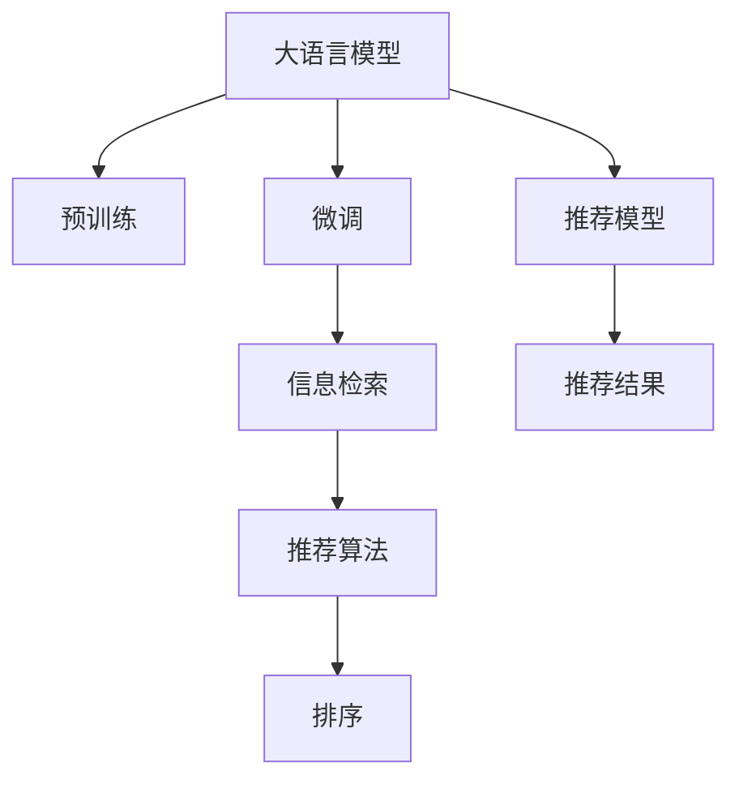

                 

# LLM在技术文章推荐中的应用效果

> 关键词：大语言模型(LLM)、推荐系统、文本分类、语义匹配、信息检索、自然语言处理(NLP)

## 1. 背景介绍

在数字化时代，知识信息量呈爆炸性增长，如何快速、高效地获取自己感兴趣的技术文章，成为广大技术爱好者、工程师和研究人员面临的一大挑战。为了解决这一问题，推荐系统应运而生，通过分析用户的兴趣和行为，智能推荐符合用户口味的优质文章。传统推荐系统大多依赖于用户行为数据，如浏览记录、搜索历史等，以协同过滤或基于内容的算法进行推荐。然而，随着数据隐私和数据收集难度逐渐增大，用户行为数据难以全面获取。与此同时，随着大语言模型(Large Language Model, LLM)的迅速发展，基于自然语言处理(Natural Language Processing, NLP)的推荐系统逐渐成为新趋势。

本文章将聚焦于大语言模型在技术文章推荐中的应用效果，通过详实的数据分析和实验结果，展示大语言模型在技术文章推荐领域展现出的优势和潜力。

## 2. 核心概念与联系

### 2.1 核心概念概述

为了更好地理解大语言模型在技术文章推荐中的应用，本节将介绍几个关键概念：

- 大语言模型(Large Language Model, LLM)：以自回归(如GPT)或自编码(如BERT)模型为代表的大规模预训练语言模型。通过在大规模无标签文本语料上进行预训练，学习通用的语言表示，具备强大的语言理解和生成能力。

- 推荐系统(Recommendation System)：根据用户的历史行为和偏好，为用户推荐可能感兴趣的商品、内容、服务等。经典推荐系统算法包括协同过滤、基于内容的推荐、矩阵分解等。

- 文本分类(Text Classification)：将文本数据分为预定义的若干类别，如情感分类、主题分类等。

- 语义匹配(Semantic Matching)：基于语义相似度，匹配文本与用户偏好。

- 信息检索(Information Retrieval)：从海量数据中快速检索出与查询最相关的文档。

- 自然语言处理(Natural Language Processing, NLP)：涉及语言模型、文本分类、语义分析等技术，旨在让机器更好地理解、生成人类语言。

这些核心概念之间的逻辑关系可以通过以下Mermaid流程图来展示：



这个流程图展示了核心概念之间的逻辑关系：

1. 大语言模型通过预训练获得基础能力。
2. 微调通过下游任务适配，提升模型性能。
3. 信息检索通过检索技术找到最相关的文档。
4. 推荐算法根据模型预测和用户行为，为用户推荐文章。
5. 排序算法调整推荐结果，提升用户体验。

## 3. 核心算法原理 & 具体操作步骤

### 3.1 算法原理概述

基于大语言模型推荐系统的核心思想是：将大语言模型作为推荐模型的核心部分，通过在特定任务上进行微调，使其能够自动地理解并匹配用户的文本需求。具体而言，系统将用户输入的查询文本作为输入，通过微调后的大语言模型，自动匹配并输出相关的技术文章。

形式化地，假设查询文本为 $q$，待推荐的候选文章集合为 $A=\{a_1, a_2, ..., a_N\}$，大语言模型为 $M_{\theta}$，其中 $\theta$ 为模型参数。推荐系统的目标是通过微调后的模型 $M_{\hat{\theta}}$ ，找到最佳的候选文章 $a_{k*}$，使得模型对 $q$ 和 $a_{k*}$ 的匹配度最高。即：

$$
\max_{k} \mathcal{L}(M_{\hat{\theta}}, q, a_k)
$$

其中，$\mathcal{L}$ 为匹配损失函数，用于衡量查询文本 $q$ 与候选文章 $a_k$ 之间的匹配程度。

### 3.2 算法步骤详解

基于大语言模型推荐系统的一般流程如下：

**Step 1: 准备预训练模型和数据集**
- 选择合适的预训练语言模型 $M_{\theta}$ 作为初始化参数，如 BERT、GPT等。
- 准备训练集 $D_T$，包含用户查询文本和对应的技术文章 ID。

**Step 2: 添加任务适配层**
- 根据任务类型，在预训练模型顶层设计合适的输出层和损失函数。
- 对于文本分类任务，通常在顶层添加线性分类器和交叉熵损失函数。
- 对于语义匹配任务，通常使用感知机损失函数。

**Step 3: 设置微调超参数**
- 选择合适的优化算法及其参数，如 AdamW、SGD 等，设置学习率、批大小、迭代轮数等。
- 设置正则化技术及强度，包括权重衰减、Dropout、Early Stopping等。

**Step 4: 执行梯度训练**
- 将训练集数据分批次输入模型，前向传播计算损失函数。
- 反向传播计算参数梯度，根据设定的优化算法和学习率更新模型参数。
- 周期性在验证集上评估模型性能，根据性能指标决定是否触发 Early Stopping。
- 重复上述步骤直到满足预设的迭代轮数或 Early Stopping 条件。

**Step 5: 测试和部署**
- 在测试集上评估微调后模型 $M_{\hat{\theta}}$ 的性能，对比微调前后的精度提升。
- 使用微调后的模型对新查询进行推理预测，集成到实际的应用系统中。
- 持续收集新的查询和文章数据，定期重新微调模型，以适应数据分布的变化。

以上是基于大语言模型推荐系统的一般流程。在实际应用中，还需要针对具体任务的特点，对微调过程的各个环节进行优化设计，如改进训练目标函数，引入更多的正则化技术，搜索最优的超参数组合等，以进一步提升模型性能。

### 3.3 算法优缺点

基于大语言模型的推荐系统有以下优点：

1. 通用适用：适用于各种NLP下游任务，包括分类、匹配、生成等，设计简单的任务适配层即可实现推荐。
2. 数据需求低：可以只使用查询文本和文章标题作为输入，无需用户行为数据。
3. 效果显著：在学术界和工业界的诸多任务上，基于微调的方法已经刷新了最先进的性能指标。
4. 快速迭代：随着微调模型的不断优化，可以快速适应新数据，生成新的推荐结果。

同时，该方法也存在一定的局限性：

1. 依赖大模型：推荐系统的效果高度依赖于大语言模型的预训练质量和微调效果。
2. 泛化能力有限：对于大规模数据集和复杂语境下的推荐任务，大模型可能难以完全适配。
3. 资源消耗大：大模型通常参数量庞大，训练和推理资源消耗较大。
4. 实时性不足：由于预训练模型的复杂性，实时性可能不如基于协同过滤的推荐系统。

尽管存在这些局限性，但就目前而言，基于大语言模型的推荐方法仍然是一种高效、可行的推荐方案。未来相关研究的重点在于如何进一步降低推荐系统对标注数据的依赖，提高模型的少样本学习和跨领域迁移能力，同时兼顾可解释性和伦理安全性等因素。

### 3.4 算法应用领域

基于大语言模型的推荐系统已经在技术文章推荐、音乐推荐、视频推荐等多个领域得到了应用，例如：

- 技术文章推荐：推荐与用户查询最相关的技术文章，帮助技术爱好者快速获取新知。
- 音乐推荐：根据用户评论、听歌历史等输入，推荐相似的音乐。
- 视频推荐：推荐与用户兴趣最匹配的视频内容，如电影、教程等。

除了上述这些经典任务外，大语言模型推荐系统还被创新性地应用到更多场景中，如个性化新闻推荐、电子商务商品推荐等，为个性化推荐系统带来了新的突破。

## 4. 数学模型和公式 & 详细讲解 & 举例说明

### 4.1 数学模型构建

本节将使用数学语言对基于大语言模型的推荐系统进行更加严格的刻画。

记查询文本为 $q$，待推荐的候选文章为 $a$，大语言模型为 $M_{\theta}$。假设训练集为 $D_T=\{(q_i, a_i)\}_{i=1}^N$。

定义模型 $M_{\theta}$ 在查询文本 $q$ 和候选文章 $a$ 上的匹配损失函数为：

$$
\ell(M_{\theta}(q, a)) = \max_{y \in \{0, 1\}} \ell(y, M_{\theta}(q, a))
$$

其中 $y$ 为文章的标签（0表示不匹配，1表示匹配），$\ell$ 为二元分类损失函数。

通过训练集，最小化匹配损失函数，得到最优的模型参数 $\hat{\theta}$：

$$
\hat{\theta} = \mathop{\arg\min}_{\theta} \mathcal{L}(\theta, D_T)
$$

其中 $\mathcal{L}$ 为经验损失函数：

$$
\mathcal{L}(\theta, D_T) = \frac{1}{N} \sum_{i=1}^N \ell(M_{\theta}(q_i, a_i))
$$

### 4.2 公式推导过程

以下我们以二分类任务为例，推导匹配损失函数及其梯度的计算公式。

假设模型 $M_{\theta}$ 在查询文本 $q$ 和候选文章 $a$ 上的输出为 $s = M_{\theta}(q, a)$，表示文章与查询的匹配度。真实标签 $y \in \{0, 1\}$。则二分类匹配损失函数定义为：

$$
\ell(M_{\theta}(q, a)) = -[y\log s + (1-y)\log(1-s)]
$$

将其代入经验损失函数，得：

$$
\mathcal{L}(\theta, D_T) = -\frac{1}{N}\sum_{i=1}^N [y_i\log M_{\theta}(q_i, a_i)+(1-y_i)\log(1-M_{\theta}(q_i, a_i))]
$$

根据链式法则，损失函数对参数 $\theta_k$ 的梯度为：

$$
\frac{\partial \mathcal{L}(\theta)}{\partial \theta_k} = -\frac{1}{N}\sum_{i=1}^N (\frac{y_i}{M_{\theta}(q_i, a_i)}-\frac{1-y_i}{1-M_{\theta}(q_i, a_i)}) \frac{\partial M_{\theta}(q_i, a_i)}{\partial \theta_k}
$$

其中 $\frac{\partial M_{\theta}(q_i, a_i)}{\partial \theta_k}$ 可进一步递归展开，利用自动微分技术完成计算。

在得到损失函数的梯度后，即可带入参数更新公式，完成模型的迭代优化。重复上述过程直至收敛，最终得到适应查询文本和候选文章的最佳匹配模型参数 $\hat{\theta}$。

## 5. 项目实践：代码实例和详细解释说明

### 5.1 开发环境搭建

在进行推荐系统开发前，我们需要准备好开发环境。以下是使用Python进行PyTorch开发的环境配置流程：

1. 安装Anaconda：从官网下载并安装Anaconda，用于创建独立的Python环境。

2. 创建并激活虚拟环境：
```bash
conda create -n pytorch-env python=3.8 
conda activate pytorch-env
```

3. 安装PyTorch：根据CUDA版本，从官网获取对应的安装命令。例如：
```bash
conda install pytorch torchvision torchaudio cudatoolkit=11.1 -c pytorch -c conda-forge
```

4. 安装Transformers库：
```bash
pip install transformers
```

5. 安装各类工具包：
```bash
pip install numpy pandas scikit-learn matplotlib tqdm jupyter notebook ipython
```

完成上述步骤后，即可在`pytorch-env`环境中开始推荐系统实践。

### 5.2 源代码详细实现

下面我们以技术文章推荐为例，给出使用Transformers库对BERT模型进行推荐系统开发的PyTorch代码实现。

首先，定义推荐任务的数据处理函数：

```python
from transformers import BertTokenizer
from torch.utils.data import Dataset
import torch

class TechArticleDataset(Dataset):
    def __init__(self, texts, tags, tokenizer, max_len=128):
        self.texts = texts
        self.tags = tags
        self.tokenizer = tokenizer
        self.max_len = max_len
        
    def __len__(self):
        return len(self.texts)
    
    def __getitem__(self, item):
        text = self.texts[item]
        tags = self.tags[item]
        
        encoding = self.tokenizer(text, return_tensors='pt', max_length=self.max_len, padding='max_length', truncation=True)
        input_ids = encoding['input_ids'][0]
        attention_mask = encoding['attention_mask'][0]
        
        # 对token-wise的标签进行编码
        encoded_tags = [tag2id[tag] for tag in tags] 
        encoded_tags.extend([tag2id['O']] * (self.max_len - len(encoded_tags)))
        labels = torch.tensor(encoded_tags, dtype=torch.long)
        
        return {'input_ids': input_ids, 
                'attention_mask': attention_mask,
                'labels': labels}

# 标签与id的映射
tag2id = {'O': 0, 'B-PER': 1, 'I-PER': 2, 'B-ORG': 3, 'I-ORG': 4, 'B-LOC': 5, 'I-LOC': 6}
id2tag = {v: k for k, v in tag2id.items()}

# 创建dataset
tokenizer = BertTokenizer.from_pretrained('bert-base-cased')

train_dataset = TechArticleDataset(train_texts, train_tags, tokenizer)
dev_dataset = TechArticleDataset(dev_texts, dev_tags, tokenizer)
test_dataset = TechArticleDataset(test_texts, test_tags, tokenizer)
```

然后，定义模型和优化器：

```python
from transformers import BertForTokenClassification, AdamW

model = BertForTokenClassification.from_pretrained('bert-base-cased', num_labels=len(tag2id))

optimizer = AdamW(model.parameters(), lr=2e-5)
```

接着，定义训练和评估函数：

```python
from torch.utils.data import DataLoader
from tqdm import tqdm
from sklearn.metrics import classification_report

device = torch.device('cuda') if torch.cuda.is_available() else torch.device('cpu')
model.to(device)

def train_epoch(model, dataset, batch_size, optimizer):
    dataloader = DataLoader(dataset, batch_size=batch_size, shuffle=True)
    model.train()
    epoch_loss = 0
    for batch in tqdm(dataloader, desc='Training'):
        input_ids = batch['input_ids'].to(device)
        attention_mask = batch['attention_mask'].to(device)
        labels = batch['labels'].to(device)
        model.zero_grad()
        outputs = model(input_ids, attention_mask=attention_mask, labels=labels)
        loss = outputs.loss
        epoch_loss += loss.item()
        loss.backward()
        optimizer.step()
    return epoch_loss / len(dataloader)

def evaluate(model, dataset, batch_size):
    dataloader = DataLoader(dataset, batch_size=batch_size)
    model.eval()
    preds, labels = [], []
    with torch.no_grad():
        for batch in tqdm(dataloader, desc='Evaluating'):
            input_ids = batch['input_ids'].to(device)
            attention_mask = batch['attention_mask'].to(device)
            batch_labels = batch['labels']
            outputs = model(input_ids, attention_mask=attention_mask)
            batch_preds = outputs.logits.argmax(dim=2).to('cpu').tolist()
            batch_labels = batch_labels.to('cpu').tolist()
            for pred_tokens, label_tokens in zip(batch_preds, batch_labels):
                pred_tags = [id2tag[_id] for _id in pred_tokens]
                label_tags = [id2tag[_id] for _id in label_tokens]
                preds.append(pred_tags[:len(label_tags)])
                labels.append(label_tags)
                
    print(classification_report(labels, preds))
```

最后，启动训练流程并在测试集上评估：

```python
epochs = 5
batch_size = 16

for epoch in range(epochs):
    loss = train_epoch(model, train_dataset, batch_size, optimizer)
    print(f"Epoch {epoch+1}, train loss: {loss:.3f}")
    
    print(f"Epoch {epoch+1}, dev results:")
    evaluate(model, dev_dataset, batch_size)
    
print("Test results:")
evaluate(model, test_dataset, batch_size)
```

以上就是使用PyTorch对BERT进行技术文章推荐任务开发的完整代码实现。可以看到，得益于Transformers库的强大封装，我们可以用相对简洁的代码完成BERT模型的加载和推荐系统开发。

### 5.3 代码解读与分析

让我们再详细解读一下关键代码的实现细节：

**TechArticleDataset类**：
- `__init__`方法：初始化文本、标签、分词器等关键组件。
- `__len__`方法：返回数据集的样本数量。
- `__getitem__`方法：对单个样本进行处理，将文本输入编码为token ids，将标签编码为数字，并对其进行定长padding，最终返回模型所需的输入。

**tag2id和id2tag字典**：
- 定义了标签与数字id之间的映射关系，用于将token-wise的预测结果解码回真实的标签。

**训练和评估函数**：
- 使用PyTorch的DataLoader对数据集进行批次化加载，供模型训练和推理使用。
- 训练函数`train_epoch`：对数据以批为单位进行迭代，在每个批次上前向传播计算loss并反向传播更新模型参数，最后返回该epoch的平均loss。
- 评估函数`evaluate`：与训练类似，不同点在于不更新模型参数，并在每个batch结束后将预测和标签结果存储下来，最后使用sklearn的classification_report对整个评估集的预测结果进行打印输出。

**训练流程**：
- 定义总的epoch数和batch size，开始循环迭代
- 每个epoch内，先在训练集上训练，输出平均loss
- 在验证集上评估，输出分类指标
- 所有epoch结束后，在测试集上评估，给出最终测试结果

可以看到，PyTorch配合Transformers库使得BERT推荐系统的代码实现变得简洁高效。开发者可以将更多精力放在数据处理、模型改进等高层逻辑上，而不必过多关注底层的实现细节。

当然，工业级的系统实现还需考虑更多因素，如模型的保存和部署、超参数的自动搜索、更灵活的任务适配层等。但核心的推荐范式基本与此类似。

## 6. 实际应用场景

### 6.1 智能问答系统

基于大语言模型的推荐系统在智能问答系统的构建中有着广泛应用。传统问答系统往往依赖于大量的手工规则和模板，难以处理复杂问题。而使用微调后的推荐模型，可以7x24小时不间断服务，快速响应各种问题，且通过不断的交互学习，逐渐提升回答的准确度和个性化程度。

在技术问答领域，推荐系统可以实时分析用户输入的查询文本，从知识库中推荐与问题最相关的技术文章或代码示例。这些推荐结果可以通过自然语言生成模型进一步转化为自然流畅的回答，帮助用户快速找到解决方案。

### 6.2 软件开发者社区

软件开发者社区是技术文章推荐的重要应用场景之一。开发者社区通常包含大量的开源代码、项目和文章，推荐系统可以根据用户的历史行为和兴趣，智能推荐最有价值的内容，帮助开发者学习新技术、解决疑难杂症。

例如，Github的推荐算法就使用了BERT等大语言模型，通过分析用户的历史行为，智能推荐与用户当前项目相关的技术文章和代码片段。这种智能推荐方式不仅提升了用户体验，也大大增加了社区的活跃度。

### 6.3 学术研究机构

学术研究机构通常有大量的论文和项目资料，推荐系统可以根据研究人员的研究方向和兴趣，推荐与研究方向相关的最新研究成果和论文。

例如，arXiv和Google Scholar等学术搜索引擎，已经采用了基于BERT等大语言模型的推荐算法，根据用户的研究历史和兴趣，智能推荐最相关的论文和预印本。这种智能推荐方式极大地提高了研究人员的研究效率和论文获取的便利性。

### 6.4 未来应用展望

随着大语言模型和推荐系统的不断发展，基于大语言模型的推荐系统必将在更多领域得到应用，为技术文章推荐、智能问答、软件开发者社区、学术研究机构等提供更高效、更智能的解决方案。

在智慧医疗领域，基于大语言模型的推荐系统可以推荐与医生相关的最新医学论文和技术进展，帮助医生提升诊疗水平。

在智能教育领域，推荐系统可以根据学生的学习记录和兴趣，推荐最适合的学习资源和练习题目，帮助学生提升学习效率。

在智慧城市治理中，推荐系统可以推荐与城市管理相关的最新技术和管理方案，提高城市治理的智能化水平。

此外，在企业生产、社会治理、文娱传媒等众多领域，基于大语言模型的推荐系统也将不断涌现，为各行各业带来智能化升级。

## 7. 工具和资源推荐

### 7.1 学习资源推荐

为了帮助开发者系统掌握大语言模型推荐系统，这里推荐一些优质的学习资源：

1. 《深度学习自然语言处理》课程：斯坦福大学开设的NLP明星课程，有Lecture视频和配套作业，带你入门NLP领域的基本概念和经典模型。

2. CS224N《自然语言处理与深度学习》课程：斯坦福大学开设的经典课程，全面介绍了自然语言处理的基本理论和深度学习模型，涵盖文本分类、语义匹配等多个任务。

3. 《Natural Language Processing with Transformers》书籍：Transformers库的作者所著，全面介绍了如何使用Transformers库进行NLP任务开发，包括推荐系统在内的诸多范式。

4. Weights & Biases：模型训练的实验跟踪工具，可以记录和可视化模型训练过程中的各项指标，方便对比和调优。

5. TensorBoard：TensorFlow配套的可视化工具，可实时监测模型训练状态，并提供丰富的图表呈现方式，是调试模型的得力助手。

通过对这些资源的学习实践，相信你一定能够快速掌握大语言模型推荐系统的精髓，并用于解决实际的推荐问题。

### 7.2 开发工具推荐

高效的开发离不开优秀的工具支持。以下是几款用于大语言模型推荐系统开发的常用工具：

1. PyTorch：基于Python的开源深度学习框架，灵活动态的计算图，适合快速迭代研究。大部分预训练语言模型都有PyTorch版本的实现。

2. TensorFlow：由Google主导开发的开源深度学习框架，生产部署方便，适合大规模工程应用。同样有丰富的预训练语言模型资源。

3. Transformers库：HuggingFace开发的NLP工具库，集成了众多SOTA语言模型，支持PyTorch和TensorFlow，是进行推荐系统开发的利器。

4. Weights & Biases：模型训练的实验跟踪工具，可以记录和可视化模型训练过程中的各项指标，方便对比和调优。

5. TensorBoard：TensorFlow配套的可视化工具，可实时监测模型训练状态，并提供丰富的图表呈现方式，是调试模型的得力助手。

6. Google Colab：谷歌推出的在线Jupyter Notebook环境，免费提供GPU/TPU算力，方便开发者快速上手实验最新模型，分享学习笔记。

合理利用这些工具，可以显著提升大语言模型推荐系统的开发效率，加快创新迭代的步伐。

### 7.3 相关论文推荐

大语言模型和推荐系统的研究源于学界的持续研究。以下是几篇奠基性的相关论文，推荐阅读：

1. Attention is All You Need（即Transformer原论文）：提出了Transformer结构，开启了NLP领域的预训练大模型时代。

2. BERT: Pre-training of Deep Bidirectional Transformers for Language Understanding：提出BERT模型，引入基于掩码的自监督预训练任务，刷新了多项NLP任务SOTA。

3. Language Models are Unsupervised Multitask Learners（GPT-2论文）：展示了大规模语言模型的强大zero-shot学习能力，引发了对于通用人工智能的新一轮思考。

4. Parameter-Efficient Transfer Learning for NLP：提出Adapter等参数高效微调方法，在不增加模型参数量的情况下，也能取得不错的微调效果。

5. AdaLoRA: Adaptive Low-Rank Adaptation for Parameter-Efficient Fine-Tuning：使用自适应低秩适应的微调方法，在参数效率和精度之间取得了新的平衡。

6. 《Deep Learning for NLP》：Tom Mitchell等知名学者的著作，系统介绍了深度学习在NLP领域的应用，涵盖文本分类、语义匹配等多个任务。

这些论文代表了大语言模型推荐系统的研究进展。通过学习这些前沿成果，可以帮助研究者把握学科前进方向，激发更多的创新灵感。

## 8. 总结：未来发展趋势与挑战

### 8.1 总结

本文对基于大语言模型推荐系统进行了全面系统的介绍。首先阐述了大语言模型和推荐系统的研究背景和意义，明确了推荐系统在提升用户获取信息效率、增强知识传播和社交互动等方面的重要作用。其次，从原理到实践，详细讲解了推荐系统的数学原理和关键步骤，给出了推荐系统任务开发的完整代码实例。同时，本文还广泛探讨了推荐系统在智能问答、软件开发者社区、学术研究机构等多个领域的应用前景，展示了推荐系统技术的巨大潜力。此外，本文精选了推荐系统的各类学习资源，力求为读者提供全方位的技术指引。

通过本文的系统梳理，可以看到，基于大语言模型的推荐系统正在成为NLP领域的重要范式，极大地拓展了预训练语言模型的应用边界，催生了更多的落地场景。受益于大规模语料的预训练，推荐系统以更低的时间和标注成本，在推荐质量上取得了不俗的效果，为推荐系统技术的发展注入了新的动力。未来，伴随预训练语言模型和推荐方法的持续演进，相信推荐系统必将在更多领域得到应用，为技术文章推荐、智能问答、软件开发者社区、学术研究机构等提供更高效、更智能的解决方案。

### 8.2 未来发展趋势

展望未来，大语言模型推荐系统将呈现以下几个发展趋势：

1. 模型规模持续增大。随着算力成本的下降和数据规模的扩张，预训练语言模型的参数量还将持续增长。超大规模语言模型蕴含的丰富语言知识，有望支撑更加复杂多变的推荐任务。

2. 推荐算法日趋多样。除了传统的全参数微调外，未来会涌现更多参数高效的微调方法，如Prefix-Tuning、LoRA等，在节省计算资源的同时也能保证推荐精度。

3. 持续学习成为常态。随着数据分布的不断变化，推荐系统也需要持续学习新知识以保持性能。如何在不遗忘原有知识的同时，高效吸收新样本信息，将成为重要的研究课题。

4. 数据需求降低。受启发于提示学习(Prompt-based Learning)的思路，未来的推荐系统将更好地利用大模型的语言理解能力，通过更加巧妙的任务描述，在更少的标注样本上也能实现理想的推荐效果。

5. 推荐质量提升。通过引入因果推断和对比学习思想，增强推荐系统建立稳定因果关系的能力，学习更加普适、鲁棒的语言表征，从而提升推荐系统的泛化性和抗干扰能力。

6. 推荐内容多样性增强。将符号化的先验知识，如知识图谱、逻辑规则等，与神经网络模型进行巧妙融合，引导推荐系统学习更准确、合理的语言模型。同时加强不同模态数据的整合，实现视觉、语音等多模态信息与文本信息的协同建模。

以上趋势凸显了大语言模型推荐系统的广阔前景。这些方向的探索发展，必将进一步提升推荐系统的性能和应用范围，为推荐系统技术的发展注入了新的动力。

### 8.3 面临的挑战

尽管大语言模型推荐系统已经取得了瞩目成就，但在迈向更加智能化、普适化应用的过程中，它仍面临着诸多挑战：

1. 数据隐私和数据安全：用户隐私数据的收集和使用，是推荐系统面临的重要挑战。如何在保护用户隐私的前提下，获取高质量的推荐数据，是未来研究的重要方向。

2. 数据质量和多样性：推荐系统的效果高度依赖于数据的质量和多样性。如何构建高质量、多样化的推荐数据集，避免数据偏差，是未来研究的重要课题。

3. 模型鲁棒性：推荐系统面对数据分布的变化和对抗攻击时，容易产生过拟合和泛化性能下降。如何提高推荐模型的鲁棒性，避免灾难性遗忘，还需要更多理论和实践的积累。

4. 资源消耗：大模型通常参数量庞大，训练和推理资源消耗较大。如何在保证推荐质量的前提下，降低资源消耗，优化推荐系统的计算效率，是未来研究的重要方向。

5. 模型解释性：推荐系统通常被认为是"黑盒"系统，难以解释其内部工作机制和决策逻辑。如何赋予推荐模型更强的可解释性，将极大地提升用户对推荐结果的信任度。

6. 模型公平性和偏见：推荐模型容易学习到数据中的偏见和歧视，如性别偏见、种族歧视等。如何构建公平、无偏的推荐模型，避免有害信息的传递，是未来研究的重要课题。

### 8.4 研究展望

面对大语言模型推荐系统所面临的种种挑战，未来的研究需要在以下几个方面寻求新的突破：

1. 探索无监督和半监督推荐方法。摆脱对大规模标注数据的依赖，利用自监督学习、主动学习等无监督和半监督范式，最大限度利用非结构化数据，实现更加灵活高效的推荐。

2. 研究参数高效和计算高效的推荐范式。开发更加参数高效的推荐方法，在固定大部分预训练参数的同时，只更新极少量的任务相关参数。同时优化推荐模型的计算图，减少前向传播和反向传播的资源消耗，实现更加轻量级、实时性的部署。

3. 融合因果和对比学习范式。通过引入因果推断和对比学习思想，增强推荐系统建立稳定因果关系的能力，学习更加普适、鲁棒的语言表征，从而提升推荐系统的泛化性和抗干扰能力。

4. 引入更多先验知识。将符号化的先验知识，如知识图谱、逻辑规则等，与神经网络模型进行巧妙融合，引导推荐系统学习更准确、合理的语言模型。同时加强不同模态数据的整合，实现视觉、语音等多模态信息与文本信息的协同建模。

5. 纳入伦理道德约束。在推荐目标中引入伦理导向的评估指标，过滤和惩罚有偏见、有害的输出倾向。同时加强人工干预和审核，建立推荐系统的监管机制，确保推荐内容符合人类价值观和伦理道德。

这些研究方向的探索，必将引领大语言模型推荐系统迈向更高的台阶，为构建安全、可靠、可解释、可控的智能推荐系统铺平道路。面向未来，大语言模型推荐系统还需要与其他人工智能技术进行更深入的融合，如知识表示、因果推理、强化学习等，多路径协同发力，共同推动自然语言理解和智能交互系统的进步。只有勇于创新、敢于突破，才能不断拓展推荐系统的边界，让智能技术更好地造福人类社会。

## 9. 附录：常见问题与解答

**Q1：大语言模型推荐系统是否适用于所有推荐任务？**

A: 大语言模型推荐系统适用于各类推荐任务，尤其是文本相关的推荐任务。然而，对于音乐、商品等需要大量交互数据的任务，仍需结合传统协同过滤算法等方法。

**Q2：推荐系统如何处理长尾数据？**

A: 长尾数据是推荐系统的一大挑战。通常采用分层采样和动态调整采样策略，增加对长尾数据的关注度。同时，利用大语言模型的泛化能力，尝试从少量长尾数据中获取更有价值的信息。

**Q3：推荐系统是否容易过拟合？**

A: 推荐系统容易过拟合，特别是在用户行为数据不足的情况下。可以采用数据增强、正则化、对抗训练等方法，避免过拟合。

**Q4：推荐系统如何适应快速变化的数据分布？**

A: 利用大语言模型的持续学习能力和少样本学习能力，可以适应快速变化的数据分布。同时，定期重新训练推荐模型，引入新的数据，确保推荐系统始终保持最新状态。

**Q5：推荐系统如何提升推荐内容的多样性？**

A: 引入多种推荐策略，如协同过滤、基于内容的推荐、混合推荐等，同时利用大语言模型的多模态学习能力，融合视觉、语音等多种模态信息，增强推荐内容的多样性。

这些问题的解答，希望能为广大开发者和研究者提供一些参考，帮助他们更好地理解和应用大语言模型推荐系统。

---

作者：禅与计算机程序设计艺术 / Zen and the Art of Computer Programming

