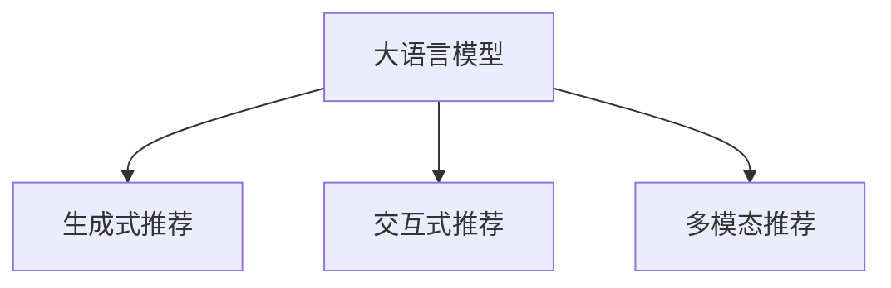

                 

# LLM在推荐系统中的优化策略

> 关键词：大语言模型,推荐系统,优化策略,推荐算法,个性化推荐

## 1. 背景介绍

### 1.1 问题由来
在互联网信息爆炸的时代，用户每天接触的内容如洪水般涌入，如何高效精准地为用户推荐感兴趣的信息，成为了各大平台亟待解决的难题。推荐系统（Recommendation System）应运而生，旨在通过算法挖掘用户偏好，自动为用户推荐感兴趣的内容。

传统的推荐系统主要依赖于协同过滤、矩阵分解等方法，通过分析用户行为数据（如点击、评分、浏览等）构建用户和物品之间的相似度矩阵。然而，这些方法需要大量标注数据，且在处理冷启动用户、高维稀疏矩阵等方面存在局限。

近年来，基于深度学习的推荐系统逐渐兴起，以其高准确性和自适应能力逐渐成为主流。大语言模型（Large Language Models, LLMs）通过大规模语料预训练，具备强大的语言理解和生成能力，与推荐系统结合，可大幅提升推荐效果。

本文将聚焦于基于大语言模型的推荐系统优化策略，探讨如何在大语言模型基础上构建更加精准、智能的推荐系统，以期为推荐系统的开发者和研究者提供参考。

### 1.2 问题核心关键点
当前，大语言模型在推荐系统中的应用主要集中在三个方向：

1. 生成式推荐：利用大语言模型进行自然语言生成，生成与用户偏好相关的推荐文本或直接生成推荐内容。
2. 交互式推荐：在推荐界面通过大语言模型生成提示信息，引导用户提供反馈，优化推荐效果。
3. 多模态推荐：融合视觉、音频等多模态数据，通过大语言模型生成跨模态的推荐内容。

本文将详细探讨生成式推荐和交互式推荐两种应用方向，介绍相应的优化策略，并通过实例展示其实际效果。

## 2. 核心概念与联系

### 2.1 核心概念概述

为更好地理解大语言模型在推荐系统中的应用，本节将介绍几个关键概念：

- 大语言模型(Large Language Model, LLM)：以Transformer为代表的大规模预训练语言模型。通过在大规模无标签文本语料上进行预训练，学习通用的语言表示，具备强大的语言理解和生成能力。

- 推荐系统(Recommendation System)：通过用户行为数据或个人属性预测用户可能感兴趣的内容，以提高用户满意度和平台粘性的系统。

- 生成式推荐(Generative Recommendation)：利用大语言模型进行自然语言生成，生成推荐文本或直接生成推荐内容。通过自然语言理解和生成能力，生成式推荐可以更好地处理长尾数据，提升推荐的多样性。

- 交互式推荐(Interactive Recommendation)：通过大语言模型生成提示信息，引导用户提供反馈，如点击、评分等，进一步优化推荐模型。

- 多模态推荐(Multimodal Recommendation)：融合视觉、音频等多模态数据，通过大语言模型生成跨模态的推荐内容。

这些核心概念之间的逻辑关系可以通过以下Mermaid流程图来展示：



这个流程图展示了大语言模型的核心概念及其与推荐系统各应用方向之间的联系：

1. 大语言模型通过预训练获得基础能力。
2. 生成式推荐和交互式推荐通过自然语言生成和用户交互，提升推荐效果。
3. 多模态推荐通过融合多模态数据，拓展推荐内容范围。

这些概念共同构成了大语言模型在推荐系统中的应用框架，使得推荐系统能够更好地利用语言模型强大的语言理解和生成能力，提升推荐效果和用户体验。

## 3. 核心算法原理 & 具体操作步骤
### 3.1 算法原理概述

基于大语言模型的推荐系统，其核心思想是利用语言模型的生成能力和理解能力，提升推荐内容的相关性和多样性。主要分为生成式推荐和交互式推荐两种应用方向，分别介绍其算法原理。

### 3.2 算法步骤详解

#### 3.2.1 生成式推荐

**步骤1: 数据准备**
- 收集用户行为数据，如点击、评分、收藏等。
- 对数据进行清洗和预处理，去除噪声和异常值。

**步骤2: 数据特征提取**
- 将用户行为数据转换为模型可接受的格式。
- 使用词嵌入、词频统计等技术提取特征，如用户兴趣向量、物品特征向量等。

**步骤3: 语言模型训练**
- 在大量文本数据上预训练大语言模型，使其学习通用的语言表示。
- 使用生成对抗网络（GAN）等技术，生成与用户行为相关的文本数据，用于训练推荐模型。

**步骤4: 推荐文本生成**
- 利用训练好的大语言模型，生成推荐文本。
- 将生成的推荐文本作为推荐内容，通过用户反馈进行优化。

#### 3.2.2 交互式推荐

**步骤1: 数据准备**
- 收集用户行为数据，如点击、评分、收藏等。
- 对数据进行清洗和预处理，去除噪声和异常值。

**步骤2: 模型构建**
- 构建交互式推荐模型，通常使用大语言模型作为核心模块。
- 设计用户反馈提示信息，如"是否喜欢该商品？"。

**步骤3: 用户交互**
- 在推荐界面中，使用大语言模型生成提示信息。
- 用户根据提示信息进行反馈，如点击、评分等。

**步骤4: 模型优化**
- 利用用户反馈信息，优化推荐模型。
- 不断迭代，提升推荐效果。

### 3.3 算法优缺点

大语言模型在推荐系统中的应用具有以下优点：

1. 语言理解能力强：大语言模型具备强大的自然语言理解能力，可以更准确地理解用户需求和行为。
2. 生成能力优秀：通过生成式推荐，可以生成多样化的推荐文本，提升推荐内容的丰富性。
3. 自适应性强：大语言模型可以自适应新数据，通过交互式推荐不断优化推荐效果。

同时，也存在以下缺点：

1. 计算资源需求高：大语言模型参数量庞大，计算和存储成本高。
2. 数据依赖性强：依赖高质量的数据进行预训练和微调，数据获取难度大。
3. 结果可解释性差：推荐结果往往是模型黑盒输出，难以解释推荐逻辑。

### 3.4 算法应用领域

大语言模型在推荐系统中的应用领域广泛，包括但不限于：

- 商品推荐：如电商平台对用户进行个性化商品推荐。
- 内容推荐：如新闻平台对用户进行个性化文章推荐。
- 视频推荐：如视频平台对用户进行个性化视频推荐。
- 音频推荐：如音乐平台对用户进行个性化歌曲推荐。
- 社交推荐：如社交网络对用户进行个性化好友推荐。

随着大语言模型在推荐系统中的不断发展，未来在更多领域的应用将逐步落地，为推荐系统的创新和优化提供新的思路。

## 4. 数学模型和公式 & 详细讲解  
### 4.1 数学模型构建

本节将使用数学语言对基于大语言模型的推荐系统进行更加严格的刻画。

记大语言模型为 $M_{\theta}$，其中 $\theta$ 为模型参数。假设用户行为数据为 $\{(x_i, y_i)\}_{i=1}^N$，其中 $x_i$ 为行为特征向量，$y_i$ 为行为结果（如点击、评分等）。推荐模型的目标为最大化预测准确率，即：

$$
\max_{\theta} \frac{1}{N} \sum_{i=1}^N \log\sigma(\hat{y}_i = 1) - \log(1-\sigma(\hat{y}_i = 0))
$$

其中 $\sigma(\cdot)$ 为sigmoid函数，$\hat{y}_i$ 为模型预测结果。

### 4.2 公式推导过程

#### 生成式推荐

假设生成推荐文本的模型为 $G$，用户行为数据经过特征提取和编码后，输入生成模型 $G$ 生成推荐文本 $z_i$，再输入推荐模型 $R$ 输出预测结果 $\hat{y}_i$。生成式推荐的目标函数为：

$$
\max_{\theta} \frac{1}{N} \sum_{i=1}^N \log\sigma(\hat{y}_i = 1) - \log(1-\sigma(\hat{y}_i = 0))
$$

其中 $G$ 和 $R$ 的模型参数分别为 $\theta_G$ 和 $\theta_R$。通过反向传播算法，可求得损失函数对参数的梯度，进而更新模型参数，优化推荐效果。

#### 交互式推荐

假设交互式推荐模型为 $M_{\theta}$，用户反馈信息为 $y_i$。在每次推荐中，使用大语言模型生成提示信息 $p_i$，输入用户反馈 $y_i$ 后，通过模型 $M_{\theta}$ 输出预测结果 $\hat{y}_i$。交互式推荐的目标函数为：

$$
\max_{\theta} \frac{1}{N} \sum_{i=1}^N \log\sigma(\hat{y}_i = 1) - \log(1-\sigma(\hat{y}_i = 0))
$$

其中 $p_i$ 为提示信息，$\hat{y}_i$ 为模型预测结果。通过反向传播算法，可求得损失函数对参数的梯度，进而更新模型参数，优化推荐效果。

## 5. 项目实践：代码实例和详细解释说明
### 5.1 开发环境搭建

在进行推荐系统开发前，我们需要准备好开发环境。以下是使用Python进行PyTorch开发的环境配置流程：

1. 安装Anaconda：从官网下载并安装Anaconda，用于创建独立的Python环境。

2. 创建并激活虚拟环境：
```bash
conda create -n recsys-env python=3.8 
conda activate recsys-env
```

3. 安装PyTorch：根据CUDA版本，从官网获取对应的安装命令。例如：
```bash
conda install pytorch torchvision torchaudio cudatoolkit=11.1 -c pytorch -c conda-forge
```

4. 安装各类工具包：
```bash
pip install numpy pandas scikit-learn matplotlib tqdm jupyter notebook ipython
```

完成上述步骤后，即可在`recsys-env`环境中开始推荐系统开发。

### 5.2 源代码详细实现

下面我们以生成式推荐为例，给出使用Transformers库对BERT模型进行推荐系统开发的PyTorch代码实现。

首先，定义生成推荐文本的数据处理函数：

```python
from transformers import BertTokenizer
from torch.utils.data import Dataset
import torch

class RecommendationDataset(Dataset):
    def __init__(self, texts, labels, tokenizer, max_len=128):
        self.texts = texts
        self.labels = labels
        self.tokenizer = tokenizer
        self.max_len = max_len
        
    def __len__(self):
        return len(self.texts)
    
    def __getitem__(self, item):
        text = self.texts[item]
        label = self.labels[item]
        
        encoding = self.tokenizer(text, return_tensors='pt', max_length=self.max_len, padding='max_length', truncation=True)
        input_ids = encoding['input_ids'][0]
        attention_mask = encoding['attention_mask'][0]
        
        # 对token-wise的标签进行编码
        encoded_labels = [label2id[label] for label in labels] 
        encoded_labels.extend([label2id['O']] * (self.max_len - len(encoded_labels)))
        labels = torch.tensor(encoded_labels, dtype=torch.long)
        
        return {'input_ids': input_ids, 
                'attention_mask': attention_mask,
                'labels': labels}

# 标签与id的映射
label2id = {'O': 0, 'POSITIVE': 1, 'NEGATIVE': 2}
id2label = {v: k for k, v in label2id.items()}

# 创建dataset
tokenizer = BertTokenizer.from_pretrained('bert-base-cased')

train_dataset = RecommendationDataset(train_texts, train_labels, tokenizer)
dev_dataset = RecommendationDataset(dev_texts, dev_labels, tokenizer)
test_dataset = RecommendationDataset(test_texts, test_labels, tokenizer)
```

然后，定义模型和优化器：

```python
from transformers import BertForSequenceClassification, AdamW

model = BertForSequenceClassification.from_pretrained('bert-base-cased', num_labels=len(label2id))

optimizer = AdamW(model.parameters(), lr=2e-5)
```

接着，定义训练和评估函数：

```python
from torch.utils.data import DataLoader
from tqdm import tqdm
from sklearn.metrics import accuracy_score

device = torch.device('cuda') if torch.cuda.is_available() else torch.device('cpu')
model.to(device)

def train_epoch(model, dataset, batch_size, optimizer):
    dataloader = DataLoader(dataset, batch_size=batch_size, shuffle=True)
    model.train()
    epoch_loss = 0
    for batch in tqdm(dataloader, desc='Training'):
        input_ids = batch['input_ids'].to(device)
        attention_mask = batch['attention_mask'].to(device)
        labels = batch['labels'].to(device)
        model.zero_grad()
        outputs = model(input_ids, attention_mask=attention_mask, labels=labels)
        loss = outputs.loss
        epoch_loss += loss.item()
        loss.backward()
        optimizer.step()
    return epoch_loss / len(dataloader)

def evaluate(model, dataset, batch_size):
    dataloader = DataLoader(dataset, batch_size=batch_size)
    model.eval()
    preds, labels = [], []
    with torch.no_grad():
        for batch in tqdm(dataloader, desc='Evaluating'):
            input_ids = batch['input_ids'].to(device)
            attention_mask = batch['attention_mask'].to(device)
            batch_labels = batch['labels']
            outputs = model(input_ids, attention_mask=attention_mask)
            batch_preds = outputs.logits.argmax(dim=2).to('cpu').tolist()
            batch_labels = batch_labels.to('cpu').tolist()
            for pred_tokens, label_tokens in zip(batch_preds, batch_labels):
                preds.append(pred_tokens[:len(label_tokens)])
                labels.append(label_tokens)
                
    print("Accuracy:", accuracy_score(labels, preds))
```

最后，启动训练流程并在测试集上评估：

```python
epochs = 5
batch_size = 16

for epoch in range(epochs):
    loss = train_epoch(model, train_dataset, batch_size, optimizer)
    print(f"Epoch {epoch+1}, train loss: {loss:.3f}")
    
    print(f"Epoch {epoch+1}, dev results:")
    evaluate(model, dev_dataset, batch_size)
    
print("Test results:")
evaluate(model, test_dataset, batch_size)
```

以上就是使用PyTorch对BERT进行推荐系统微调的完整代码实现。可以看到，得益于Transformers库的强大封装，我们可以用相对简洁的代码完成BERT模型的加载和微调。

### 5.3 代码解读与分析

让我们再详细解读一下关键代码的实现细节：

**RecommendationDataset类**：
- `__init__`方法：初始化文本、标签、分词器等关键组件。
- `__len__`方法：返回数据集的样本数量。
- `__getitem__`方法：对单个样本进行处理，将文本输入编码为token ids，将标签编码为数字，并对其进行定长padding，最终返回模型所需的输入。

**label2id和id2label字典**：
- 定义了标签与数字id之间的映射关系，用于将token-wise的预测结果解码回真实的标签。

**训练和评估函数**：
- 使用PyTorch的DataLoader对数据集进行批次化加载，供模型训练和推理使用。
- 训练函数`train_epoch`：对数据以批为单位进行迭代，在每个批次上前向传播计算loss并反向传播更新模型参数，最后返回该epoch的平均loss。
- 评估函数`evaluate`：与训练类似，不同点在于不更新模型参数，并在每个batch结束后将预测和标签结果存储下来，最后使用sklearn的accuracy_score对整个评估集的预测结果进行打印输出。

**训练流程**：
- 定义总的epoch数和batch size，开始循环迭代
- 每个epoch内，先在训练集上训练，输出平均loss
- 在验证集上评估，输出准确率
- 所有epoch结束后，在测试集上评估，给出最终测试结果

可以看到，PyTorch配合Transformers库使得BERT微调的代码实现变得简洁高效。开发者可以将更多精力放在数据处理、模型改进等高层逻辑上，而不必过多关注底层的实现细节。

当然，工业级的系统实现还需考虑更多因素，如模型的保存和部署、超参数的自动搜索、更灵活的任务适配层等。但核心的微调范式基本与此类似。

## 6. 实际应用场景
### 6.1 智能电商推荐

智能电商推荐系统利用大语言模型生成个性化推荐内容，帮助用户快速找到感兴趣的商品，提高购物体验和平台转化率。

在技术实现上，可以收集用户浏览、点击、购买等行为数据，将其输入生成式推荐模型中。模型通过大语言模型生成推荐文本，并进行A/B测试，评估推荐效果。对于高点击率的商品，进一步优化模型参数，提升推荐精度。

### 6.2 新闻个性化推荐

新闻个性化推荐系统通过大语言模型生成推荐文章，帮助用户发现感兴趣的新闻内容，提高新闻阅读量和平台活跃度。

在实现上，可以收集用户阅读、点赞、评论等行为数据，将其输入生成式推荐模型中。模型通过大语言模型生成推荐文章摘要，并进行A/B测试，评估推荐效果。对于高阅读量的文章，进一步优化模型参数，提升推荐精度。

### 6.3 视频推荐

视频推荐系统利用大语言模型生成推荐视频标题、描述和标签，帮助用户快速找到感兴趣的视频内容，提高平台留存率。

在技术实现上，可以收集用户观看、点赞、分享等行为数据，将其输入生成式推荐模型中。模型通过大语言模型生成推荐视频信息，并进行A/B测试，评估推荐效果。对于高观看率的视频，进一步优化模型参数，提升推荐精度。

### 6.4 未来应用展望

随着大语言模型和推荐系统的不断发展，基于大语言模型的推荐系统将在更多领域得到应用，为推荐系统的创新和优化提供新的思路。

在智慧医疗领域，基于大语言模型的推荐系统可以帮助医生推荐最新医学文献，促进医学知识的传播和应用。

在智能教育领域，利用大语言模型的生成能力，推荐系统可以生成个性化练习题，帮助学生巩固知识，提升学习效果。

在智慧城市治理中，推荐系统可以根据市民的兴趣和行为，推荐相关的城市服务信息，提高市民满意度和生活质量。

此外，在企业生产、社会治理、文娱传媒等众多领域，基于大语言模型的推荐系统也将不断涌现，为推荐系统的优化和创新提供新的方向。

## 7. 工具和资源推荐
### 7.1 学习资源推荐

为了帮助开发者系统掌握大语言模型在推荐系统中的应用，这里推荐一些优质的学习资源：

1. 《深度学习推荐系统》书籍：详细介绍了推荐系统的基本原理和推荐算法，包括协同过滤、矩阵分解等传统方法，以及深度学习推荐系统的发展历程。

2. 《自然语言处理与深度学习》课程：斯坦福大学开设的NLP明星课程，涵盖自然语言处理的基本概念和深度学习应用，包括推荐系统等方向。

3. 《Recommender Systems》书籍：由知名专家编写，详细介绍了推荐系统的设计原则、算法优化和实际应用。

4. 《推荐系统实战》课程：面向实际应用场景，介绍推荐系统的设计和优化方法，涵盖数据预处理、模型训练、系统部署等环节。

5. Kaggle推荐系统竞赛：Kaggle平台上的推荐系统竞赛，通过实战练习提升推荐系统设计和优化能力。

通过对这些资源的学习实践，相信你一定能够快速掌握大语言模型在推荐系统中的应用，并用于解决实际的推荐问题。

### 7.2 开发工具推荐

高效的开发离不开优秀的工具支持。以下是几款用于大语言模型推荐系统开发的常用工具：

1. PyTorch：基于Python的开源深度学习框架，灵活动态的计算图，适合快速迭代研究。大部分预训练语言模型都有PyTorch版本的实现。

2. TensorFlow：由Google主导开发的开源深度学习框架，生产部署方便，适合大规模工程应用。同样有丰富的预训练语言模型资源。

3. Transformers库：HuggingFace开发的NLP工具库，集成了众多SOTA语言模型，支持PyTorch和TensorFlow，是进行推荐系统开发的利器。

4. Weights & Biases：模型训练的实验跟踪工具，可以记录和可视化模型训练过程中的各项指标，方便对比和调优。与主流深度学习框架无缝集成。

5. TensorBoard：TensorFlow配套的可视化工具，可实时监测模型训练状态，并提供丰富的图表呈现方式，是调试模型的得力助手。

6. Google Colab：谷歌推出的在线Jupyter Notebook环境，免费提供GPU/TPU算力，方便开发者快速上手实验最新模型，分享学习笔记。

合理利用这些工具，可以显著提升大语言模型推荐系统的开发效率，加快创新迭代的步伐。

### 7.3 相关论文推荐

大语言模型和推荐系统的发展源于学界的持续研究。以下是几篇奠基性的相关论文，推荐阅读：

1. "Adversarial Machine Learning: An Overview"：这篇论文全面介绍了对抗学习的原理和应用，包括对抗训练、对抗样本等技术，为推荐系统的鲁棒性提供了理论支持。

2. "Generative Adversarial Nets"：这篇论文提出了生成对抗网络（GAN）的框架，为生成式推荐提供了重要参考。

3. "Sequence to Sequence Learning with Neural Networks"：这篇论文提出了序列到序列学习的方法，为自然语言生成和推荐系统提供了基础算法。

4. "Attention Is All You Need"：这篇论文提出了Transformer结构，开创了预训练大模型时代，为推荐系统提供了强大的语言理解和生成能力。

5. "BERT: Pre-training of Deep Bidirectional Transformers for Language Understanding"：这篇论文提出了BERT模型，利用自监督学习任务训练通用语言模型，为推荐系统提供了高精度的语言表示。

这些论文代表了大语言模型在推荐系统中的发展和应用，通过学习这些前沿成果，可以帮助研究者把握学科前进方向，激发更多的创新灵感。

## 8. 总结：未来发展趋势与挑战

### 8.1 总结

本文对基于大语言模型的推荐系统进行了全面系统的介绍。首先阐述了推荐系统和大语言模型在推荐系统中的应用背景，明确了其结合的独特价值。其次，从原理到实践，详细讲解了大语言模型在生成式推荐和交互式推荐中的算法原理和具体操作步骤，并通过实例展示其实际效果。同时，本文还广泛探讨了大语言模型在推荐系统中的应用领域和未来展望，展示了其广阔的应用前景。

通过本文的系统梳理，可以看到，基于大语言模型的推荐系统正在成为推荐系统的核心范式，极大地拓展了推荐内容的多样性和准确性，为推荐系统的开发者和研究者提供了新的思路。未来，伴随大语言模型和推荐系统技术的不断进步，基于大语言模型的推荐系统必将在更多领域得到应用，为推荐系统的创新和优化提供新的方向。

### 8.2 未来发展趋势

展望未来，大语言模型在推荐系统中的应用将呈现以下几个发展趋势：

1. 生成能力更强大：随着大语言模型的进一步发展，生成式推荐的效果将更加优秀，推荐内容的多样性和个性化将进一步提升。

2. 跨模态推荐技术更成熟：融合视觉、音频等多模态数据，通过大语言模型生成跨模态的推荐内容，推荐系统将更具竞争力。

3. 推荐结果更可解释：推荐系统的可解释性是当前的一个痛点，未来将通过引入因果分析和博弈论等工具，提升推荐结果的透明性和可解释性。

4. 推荐算法更智能：推荐系统将利用大语言模型强大的推理和理解能力，引入更多先验知识，提升推荐算法的智能性和自适应性。

5. 推荐系统更普适：未来的大语言模型推荐系统将能够适应更多领域的推荐需求，如医疗、教育、金融等，为各行各业提供智能化的解决方案。

以上趋势凸显了大语言模型在推荐系统中的广阔前景。这些方向的探索发展，必将进一步提升推荐系统的性能和用户体验，为推荐系统的智能化和普适化提供新的突破。

### 8.3 面临的挑战

尽管大语言模型在推荐系统中的应用已经取得了一定成效，但在迈向更加智能化、普适化应用的过程中，它仍面临着诸多挑战：

1. 数据获取成本高：大语言模型需要大量高质量的数据进行预训练和微调，数据获取难度大，成本高。

2. 模型复杂度高：大语言模型参数量庞大，计算和存储成本高。模型复杂度高，部署和优化难度大。

3. 推荐结果可解释性差：推荐结果往往是模型黑盒输出，难以解释推荐逻辑。

4. 对抗攻击风险：推荐系统面临对抗攻击的风险，如虚假推荐、误导性推荐等，需要通过对抗训练等手段提升系统的鲁棒性。

5. 隐私和安全问题：推荐系统需要处理大量用户行为数据，隐私和安全问题不容忽视。需要加强数据保护和隐私计算技术的应用。

6. 跨领域适应性差：不同领域的推荐需求差异大，通用的大语言模型难以适配所有领域的推荐场景。

正视推荐系统面临的这些挑战，积极应对并寻求突破，将是大语言模型推荐系统走向成熟的必由之路。相信随着学界和产业界的共同努力，这些挑战终将一一被克服，大语言模型推荐系统必将在构建人机协同的智能推荐系统过程中发挥重要作用。

### 8.4 研究展望

面对大语言模型推荐系统所面临的挑战，未来的研究需要在以下几个方面寻求新的突破：

1. 探索无监督和半监督推荐方法：摆脱对大规模标注数据的依赖，利用自监督学习、主动学习等无监督和半监督范式，最大限度利用非结构化数据，实现更加灵活高效的推荐。

2. 研究参数高效和计算高效的推荐算法：开发更加参数高效的推荐算法，在固定大部分预训练参数的同时，只更新极少量的任务相关参数。同时优化推荐模型的计算图，减少前向传播和反向传播的资源消耗，实现更加轻量级、实时性的部署。

3. 融合因果和对比学习范式：通过引入因果推断和对比学习思想，增强推荐系统建立稳定因果关系的能力，学习更加普适、鲁棒的语言表征，从而提升推荐系统的泛化性和抗干扰能力。

4. 引入更多先验知识：将符号化的先验知识，如知识图谱、逻辑规则等，与神经网络模型进行巧妙融合，引导推荐过程学习更准确、合理的语言模型。同时加强不同模态数据的整合，实现视觉、语音等多模态信息与文本信息的协同建模。

5. 结合因果分析和博弈论工具：将因果分析方法引入推荐系统，识别出推荐决策的关键特征，增强推荐结果的因果性和逻辑性。借助博弈论工具刻画人机交互过程，主动探索并规避推荐的脆弱点，提高系统稳定性。

6. 纳入伦理道德约束：在推荐目标中引入伦理导向的评估指标，过滤和惩罚有偏见、有害的输出倾向。同时加强人工干预和审核，建立推荐行为的监管机制，确保输出符合人类价值观和伦理道德。

这些研究方向的探索，必将引领大语言模型推荐系统迈向更高的台阶，为推荐系统的智能化和普适化提供新的思路。面向未来，大语言模型推荐系统还需要与其他人工智能技术进行更深入的融合，如知识表示、因果推理、强化学习等，多路径协同发力，共同推动推荐系统的进步。只有勇于创新、敢于突破，才能不断拓展推荐系统的边界，让智能技术更好地造福人类社会。

## 9. 附录：常见问题与解答

**Q1：大语言模型在推荐系统中是否适用于所有推荐任务？**

A: 大语言模型在大多数推荐任务上都能取得不错的效果，特别是对于数据量较小的任务。但对于一些特定领域的任务，如医学、法律等，仅仅依靠通用语料预训练的模型可能难以很好地适应。此时需要在特定领域语料上进一步预训练，再进行微调，才能获得理想效果。此外，对于一些需要时效性、个性化很强的任务，如对话、推荐等，微调方法也需要针对性的改进优化。

**Q2：大语言模型在推荐系统中如何进行参数高效微调？**

A: 大语言模型在推荐系统中，往往采用参数高效微调技术，以减少计算资源消耗。常见的方法包括使用Adapter、LoRA等技术，只调整少量参数(如顶层分类器)，而固定大部分预训练参数不变。通过这种方式，可以在不显著增加计算成本的情况下，提升推荐效果。

**Q3：大语言模型在推荐系统中如何进行数据增强？**

A: 数据增强是提升推荐系统效果的重要手段。常见的方法包括：

1. 近义词替换：将用户行为数据中的部分词语替换为同义词，丰富数据样本。

2. 文本回译：将用户行为数据中的部分文本进行回译，生成新的数据样本。

3. 数据扩充：收集更多相似用户的行为数据，并进行扩充，增加数据多样性。

4. 噪声注入：在用户行为数据中加入噪声，模拟真实用户行为，增加数据复杂度。

**Q4：大语言模型在推荐系统中如何进行推荐结果解释？**

A: 推荐结果的可解释性是大语言模型推荐系统的一大挑战。为增强推荐结果的透明性和可解释性，常见的方法包括：

1. 引入因果分析方法：通过因果推断方法，分析推荐结果的关键因素，增强结果的因果性和逻辑性。

2. 使用博弈论工具：通过博弈论方法，刻画人机交互过程，探索推荐系统的脆弱点，增强系统的鲁棒性和稳定性。

3. 引入专家知识：将符号化的先验知识，如知识图谱、逻辑规则等，与神经网络模型进行巧妙融合，提升推荐结果的可解释性。

4. 可视化推荐过程：通过可视化技术，展示推荐过程和结果，增加用户对推荐系统的理解。

这些方法可以显著提升大语言模型推荐系统的可解释性和透明性，为用户提供更好的推荐体验。

**Q5：大语言模型在推荐系统中如何进行对抗攻击防御？**

A: 推荐系统面临对抗攻击的风险，如虚假推荐、误导性推荐等，需要通过对抗训练等手段提升系统的鲁棒性。常见的方法包括：

1. 对抗样本生成：生成对抗样本，增强推荐模型的鲁棒性，防止对抗攻击。

2. 对抗训练：在推荐模型训练过程中，加入对抗样本，提升模型的鲁棒性。

3. 数据增强：通过数据增强技术，增加对抗样本的数量和多样性，提升模型的鲁棒性。

4. 模型监控：实时监控推荐系统的运行状态，及时发现和处理对抗攻击。

这些方法可以显著提升大语言模型推荐系统的鲁棒性和安全性，为用户提供一个更加稳定和可信的推荐体验。

---

作者：禅与计算机程序设计艺术 / Zen and the Art of Computer Programming

