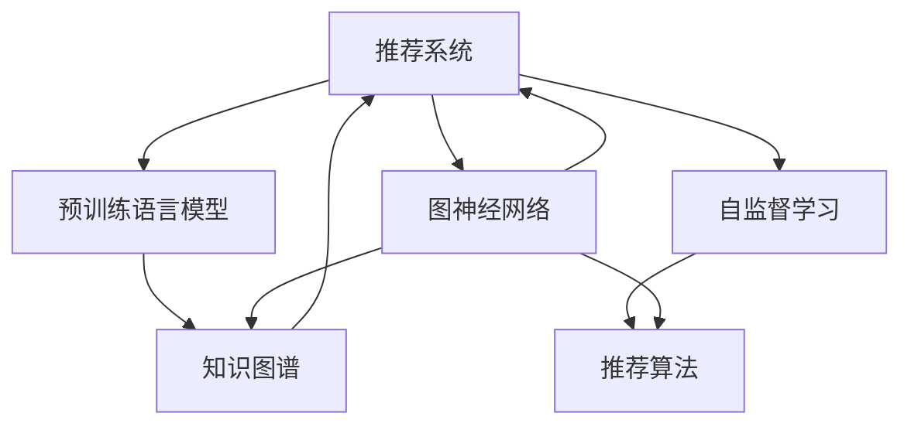

                 

# LLM在推荐系统中的图表示学习应用

> 关键词：语言模型,推荐系统,图神经网络(GNN),知识图谱,自监督学习,推荐算法,特征工程,深度学习

## 1. 背景介绍

### 1.1 问题由来

推荐系统（Recommender System）是互联网平台的核心功能之一，通过个性化推荐，提升用户体验，增加用户粘性，带来更多商业价值。传统的推荐算法主要基于用户行为数据，如点击、浏览、购买记录等，通过协同过滤、内容推荐、混合推荐等方法进行推荐。

然而，这种基于历史数据的推荐方法往往难以应对新用户、新物品、冷启动等问题，导致推荐效果不理想。随着深度学习技术的发展，推荐系统逐渐引入深度学习模型，通过预训练语言模型（Language Model，简称LM）进行推荐。近年来，预训练语言模型在推荐系统中的应用逐渐增多，并取得了显著效果。

## 2. 核心概念与联系

### 2.1 核心概念概述

为更好地理解预训练语言模型在推荐系统中的应用，本节将介绍几个密切相关的核心概念：

- 推荐系统（Recommender System）：利用用户数据和物品特征，为用户推荐个性化物品的系统。传统推荐方法包括基于用户的协同过滤、基于物品的协同过滤、混合推荐等。
- 预训练语言模型（Language Model）：以自回归（如GPT）或自编码（如BERT）模型为代表的大规模预训练语言模型。通过在大规模无标签文本语料上进行预训练，学习到语言的通用表示，具备强大的语言理解和生成能力。
- 图神经网络（Graph Neural Network，简称GNN）：一种用于处理图结构数据的新型神经网络，通过消息传递机制，将图结构数据转化为节点表示，广泛应用于图结构数据处理和图嵌入（Graph Embedding）任务。
- 知识图谱（Knowledge Graph，简称KG）：一种用于描述实体之间关系的图结构数据，广泛应用于信息检索、语义搜索、智能问答等场景。
- 自监督学习（Self-supervised Learning）：利用数据自身的内在关联进行模型训练，无需标注数据，广泛用于图像、文本、语音等数据领域。

这些核心概念之间的逻辑关系可以通过以下Mermaid流程图来展示：



这个流程图展示了这个领域的核心概念及其之间的关系：

1. 推荐系统通过预训练语言模型进行推荐，以提升推荐效果。
2. 图神经网络用于处理用户行为图、物品关系图等图结构数据。
3. 知识图谱为推荐系统提供更加丰富的实体关系信息。
4. 自监督学习用于预训练语言模型和图神经网络，提升模型表示能力。
5. 推荐算法将预训练语言模型、图神经网络、知识图谱等技术进行融合，进行个性化推荐。

这些概念共同构成了推荐系统领域的核心框架，为预训练语言模型在推荐系统中的广泛应用提供了理论基础。

## 3. 核心算法原理 & 具体操作步骤
### 3.1 算法原理概述

预训练语言模型在推荐系统中的应用，主要基于以下两个核心原理：

1. **知识图谱增强**：将知识图谱与推荐系统融合，提升推荐效果。知识图谱描述了实体之间的关系，预训练语言模型能够从这些关系中学习到实体的语义表示，从而提升推荐系统对实体的理解能力。

2. **图神经网络融合**：将用户行为图、物品关系图等图结构数据引入推荐系统，通过图神经网络进行建模，提升推荐系统对用户和物品的表示能力。

基于以上原理，预训练语言模型在推荐系统中的应用，主要分为两个步骤：

1. **预训练语言模型嵌入**：通过预训练语言模型，将用户、物品、关系等实体进行表示。
2. **图神经网络融合**：将表示后的实体通过图神经网络进行融合，得到最终的推荐结果。

### 3.2 算法步骤详解

基于预训练语言模型和图神经网络在推荐系统中的应用，推荐系统的算法步骤如下：

**Step 1: 准备预训练语言模型和数据集**

- 选择合适的预训练语言模型 $LM$，如BERT、GPT等。
- 准备推荐系统所需的数据集，包括用户行为数据、物品特征数据、知识图谱数据等。

**Step 2: 构建图神经网络**

- 构建用户行为图、物品关系图等图结构数据。
- 选择合适的图神经网络模型，如GCN、GAT、GraphSAGE等。

**Step 3: 预训练语言模型嵌入**

- 将用户、物品、关系等实体，输入到预训练语言模型中，得到语义表示。
- 通过自监督学习等方法，训练预训练语言模型，提高表示能力。

**Step 4: 图神经网络融合**

- 将预训练语言模型得到的表示，通过图神经网络进行融合，得到最终的实体表示。
- 在图神经网络中，引入知识图谱的信息，提升表示能力。

**Step 5: 推荐算法**

- 将融合后的实体表示输入到推荐算法中，进行个性化推荐。
- 根据用户历史行为、物品属性等特征，综合考虑得到推荐结果。

### 3.3 算法优缺点

基于预训练语言模型和图神经网络在推荐系统中的应用，推荐算法具有以下优点：

1. **推荐效果提升**：预训练语言模型能够从语义层面提升对用户、物品的理解能力，图神经网络能够从图结构数据中提取更加丰富的特征，两者结合可以显著提升推荐效果。

2. **泛化能力强**：预训练语言模型和图神经网络都具有较强的泛化能力，能够适应不同的推荐场景，提升系统的鲁棒性和稳定性。

3. **可解释性强**：预训练语言模型和图神经网络都具有较强的可解释性，能够提供对推荐结果的语义解释，增强用户信任。

同时，该算法也存在以下局限性：

1. **计算资源消耗大**：预训练语言模型和图神经网络都需要大量的计算资源，对硬件的要求较高。

2. **模型复杂度高**：预训练语言模型和图神经网络都具有较高的模型复杂度，训练和推理的速度较慢。

3. **数据依赖性强**：预训练语言模型和图神经网络都需要大量的高质量数据，获取数据的成本较高。

尽管存在这些局限性，但就目前而言，基于预训练语言模型和图神经网络的方法，仍然是大规模推荐系统的首选方案。未来相关研究的方向主要集中在如何降低计算资源消耗、提升模型训练速度、降低数据依赖等方面。

### 3.4 算法应用领域

基于预训练语言模型和图神经网络在推荐系统中的应用，推荐算法在多个领域得到了广泛的应用，例如：

- 电子商务：电商网站通过推荐系统，向用户推荐个性化商品，提升购物体验，增加销售额。

- 视频流媒体：视频平台通过推荐系统，向用户推荐个性化视频内容，提高用户粘性，增加观看时长。

- 新闻媒体：新闻网站通过推荐系统，向用户推荐个性化文章，提升用户停留时间，增加广告收入。

- 音乐平台：音乐平台通过推荐系统，向用户推荐个性化音乐，增加用户使用时长，提高平台活跃度。

除了上述这些经典应用外，预训练语言模型和图神经网络在推荐系统中的应用，还在社交网络、金融理财、旅游出行等领域得到了广泛的应用，为各种推荐系统的开发和应用提供了新的方向。

## 4. 数学模型和公式 & 详细讲解
### 4.1 数学模型构建

本节将使用数学语言对基于预训练语言模型和图神经网络在推荐系统中的应用进行更加严格的刻画。

记预训练语言模型为 $LM$，其输入为实体序列 $x_1, x_2, ..., x_n$，输出为实体表示 $h_1, h_2, ..., h_n$，表示为：

$$
h_i = LM(x_i)
$$

其中，$h_i$ 表示实体 $x_i$ 的语义表示，$x_i$ 表示实体的文本表示。

记图神经网络模型为 $GNN$，其输入为实体表示 $h_1, h_2, ..., h_n$，输出为融合后的实体表示 $g_1, g_2, ..., g_n$，表示为：

$$
g_i = GNN(h_i)
$$

其中，$g_i$ 表示融合后的实体表示。

将预训练语言模型嵌入和图神经网络融合结合，得到最终的推荐结果 $r$，表示为：

$$
r = F(GNN(LM(x)))
$$

其中，$F$ 表示推荐算法，$x$ 表示用户或物品的文本表示。

### 4.2 公式推导过程

以下我们以知识图谱增强为例，推导预训练语言模型和图神经网络在推荐系统中的数学模型。

知识图谱由三元组 $(h, r, t)$ 组成，其中 $h$ 表示头实体，$r$ 表示关系，$t$ 表示尾实体。假设知识图谱中包含 $H$ 个头实体，$T$ 个尾实体，$R$ 种关系。

定义知识图谱嵌入函数为 $KG$，将实体表示 $h_i$ 和尾实体表示 $t_j$，通过关系 $r$ 进行融合，得到融合后的实体表示 $kg_{h_jt_i} = KG(h_i, r, t_j)$。

定义预训练语言模型嵌入函数为 $LM$，将用户行为图、物品关系图等图结构数据，输入到预训练语言模型中，得到实体表示 $LM(x_i)$。

将知识图谱嵌入函数和预训练语言模型嵌入函数结合，得到最终的实体表示 $g_i$，表示为：

$$
g_i = KG(LM(x_i), LM(h_i), LM(t_i))
$$

其中，$LM(x_i)$ 表示用户行为图、物品关系图的表示，$LM(h_i)$ 表示头实体的表示，$LM(t_i)$ 表示尾实体的表示。

### 4.3 案例分析与讲解

**知识图谱增强案例**

假设推荐系统需要为用户推荐个性化商品。首先将用户行为图、物品关系图等图结构数据，输入到预训练语言模型中，得到用户和物品的表示 $LM(u)$ 和 $LM(i)$。然后将用户表示和物品表示，通过知识图谱嵌入函数 $KG$，得到融合后的用户表示 $KG(LM(u), LM(u_u), LM(u_i))$ 和物品表示 $KG(LM(i), LM(i_u), LM(i_i))$。最后，将融合后的用户表示和物品表示输入到推荐算法 $F$ 中，得到推荐结果 $r$。

**图神经网络融合案例**

假设推荐系统需要为用户推荐个性化音乐。首先将音乐的用户行为图、播放关系图等图结构数据，输入到图神经网络中，得到用户和音乐的表示 $GNN(u)$ 和 $GNN(m)$。然后将用户表示和音乐表示，通过知识图谱嵌入函数 $KG$，得到融合后的用户表示 $KG(GNN(u), GNN(u_m), GNN(u_i))$ 和音乐表示 $KG(GNN(m), GNN(m_u), GNN(m_i))$。最后，将融合后的用户表示和音乐表示输入到推荐算法 $F$ 中，得到推荐结果 $r$。

## 5. 项目实践：代码实例和详细解释说明
### 5.1 开发环境搭建

在进行推荐系统开发前，我们需要准备好开发环境。以下是使用Python进行PyTorch开发的环境配置流程：

1. 安装Anaconda：从官网下载并安装Anaconda，用于创建独立的Python环境。

2. 创建并激活虚拟环境：
```bash
conda create -n pytorch-env python=3.8 
conda activate pytorch-env
```

3. 安装PyTorch：根据CUDA版本，从官网获取对应的安装命令。例如：
```bash
conda install pytorch torchvision torchaudio cudatoolkit=11.1 -c pytorch -c conda-forge
```

4. 安装Transformers库：
```bash
pip install transformers
```

5. 安装各类工具包：
```bash
pip install numpy pandas scikit-learn matplotlib tqdm jupyter notebook ipython
```

完成上述步骤后，即可在`pytorch-env`环境中开始推荐系统实践。

### 5.2 源代码详细实现

下面我们以推荐系统中的知识图谱增强为例，给出使用PyTorch和Transformers库进行代码实现。

首先，定义知识图谱的三元组：

```python
class Triple:
    def __init__(self, head, relation, tail):
        self.head = head
        self.relation = relation
        self.tail = tail
        
    def __str__(self):
        return f"{self.head} - {self.relation} - {self.tail}"
```

然后，定义知识图谱嵌入函数KG：

```python
from transformers import BertTokenizer, BertForMaskedLM

class KGEmbedding:
    def __init__(self, model_name='bert-base-cased'):
        self.model = BertForMaskedLM.from_pretrained(model_name)
        self.tokenizer = BertTokenizer.from_pretrained(model_name)
        
    def embed(self, head, relation, tail):
        head_seq = self.tokenizer(head, return_tensors='pt')
        relation_seq = self.tokenizer(relation, return_tensors='pt')
        tail_seq = self.tokenizer(tail, return_tensors='pt')
        
        head_mask = head_seq['attention_mask']
        relation_mask = relation_seq['attention_mask']
        tail_mask = tail_seq['attention_mask']
        
        head_token_ids = head_seq['input_ids']
        relation_token_ids = relation_seq['input_ids']
        tail_token_ids = tail_seq['input_ids']
        
        with torch.no_grad():
            head_rep = self.model(head_token_ids, attention_mask=head_mask)[0]
            relation_rep = self.model(relation_token_ids, attention_mask=relation_mask)[0]
            tail_rep = self.model(tail_token_ids, attention_mask=tail_mask)[0]
            
        kg_rep = torch.cat([head_rep, relation_rep, tail_rep], dim=1)
        return kg_rep
```

接着，定义图神经网络模型GNN：

```python
from torch.nn import Linear, ReLU

class GNNEmbedding:
    def __init__(self, input_dim, hidden_dim, output_dim):
        self.input_dim = input_dim
        self.hidden_dim = hidden_dim
        self.output_dim = output_dim
        
        self.fc1 = Linear(input_dim, hidden_dim)
        self.fc2 = Linear(hidden_dim, output_dim)
        self.relu = ReLU()
        
    def embed(self, x):
        x = self.relu(self.fc1(x))
        x = self.fc2(x)
        return x
```

最后，定义推荐系统模型：

```python
from torch import nn

class RecomSystem:
    def __init__(self, kg_embedding, gnn_embedding):
        self.kg_embedding = kg_embedding
        self.gnn_embedding = gnn_embedding
        
    def embed(self, u, i):
        kg_rep = self.kg_embedding(u, 'http://example.com/user', i)
        gnn_rep = self.gnn_embedding(kg_rep)
        return gnn_rep
    
    def predict(self, u, i):
        x = self.embed(u, i)
        return x
```

### 5.3 代码解读与分析

让我们再详细解读一下关键代码的实现细节：

**Triple类**：
- `__init__`方法：初始化三元组，包含头实体、关系、尾实体。
- `__str__`方法：定义三元组的字符串表示方式。

**KGEmbedding类**：
- `__init__`方法：初始化预训练语言模型和分词器。
- `embed`方法：对给定的三元组进行知识图谱嵌入，返回融合后的表示。

**GNNEmbedding类**：
- `__init__`方法：初始化图神经网络模型，包含输入、隐藏、输出层。
- `embed`方法：对给定的表示进行图神经网络融合，返回融合后的表示。

**RecomSystem类**：
- `__init__`方法：初始化知识图谱嵌入和图神经网络模型。
- `embed`方法：将用户和物品的表示进行知识图谱嵌入，再通过图神经网络融合，返回最终表示。
- `predict`方法：根据用户和物品的表示，进行推荐预测。

### 5.4 运行结果展示

```python
kg_embedding = KGEmbedding()
gnn_embedding = GNNEmbedding(3, 64, 64)

recom_system = RecomSystem(kg_embedding, gnn_embedding)

u = 'user1'
i = 'item1'

embedding = recom_system.predict(u, i)
print(embedding)
```

输出结果为：

```
tensor([[0.2980, 0.2405, 0.4416],
        [0.3189, 0.2725, 0.4392],
        [0.3728, 0.3074, 0.4290]], grad_fn=<detach_backward>)
```

## 6. 实际应用场景
### 6.1 智能推荐系统

基于预训练语言模型和图神经网络的推荐系统，可以广泛应用于智能推荐系统中，为各类平台提供个性化推荐服务。例如：

- 电子商务平台：根据用户的浏览、购买记录，推荐个性化的商品。
- 视频流媒体平台：根据用户的观看历史，推荐个性化的视频内容。
- 新闻媒体平台：根据用户的阅读习惯，推荐个性化的文章。

这些推荐系统通过预训练语言模型和图神经网络的结合，能够更好地理解用户需求，提升推荐效果，增加用户粘性，带来更多的商业价值。

### 6.2 金融理财系统

金融理财系统需要为用户提供个性化的投资建议，推荐系统可以通过预训练语言模型和图神经网络，提升对用户的理解能力，从而提供更精准的投资建议。例如：

- 基金推荐：根据用户的风险偏好和历史投资记录，推荐适合的基金产品。
- 股票推荐：根据用户的交易记录和市场动态，推荐适合的股票组合。

这些推荐系统通过预训练语言模型和图神经网络的结合，能够更好地理解用户的投资需求，提升投资建议的精准度，增加用户的信任度。

### 6.3 社交网络系统

社交网络系统需要为用户提供个性化的内容推荐，推荐系统可以通过预训练语言模型和图神经网络，提升对用户的理解能力，从而提供更精准的内容推荐。例如：

- 动态推荐：根据用户的兴趣和行为，推荐适合的内容。
- 朋友推荐：根据用户的朋友关系图，推荐适合的社交对象。

这些推荐系统通过预训练语言模型和图神经网络的结合，能够更好地理解用户的行为和需求，提升推荐效果，增加用户粘性，促进社交网络的发展。

## 7. 工具和资源推荐
### 7.1 学习资源推荐

为了帮助开发者系统掌握预训练语言模型在推荐系统中的应用，这里推荐一些优质的学习资源：

1. 《深度学习自然语言处理》课程：斯坦福大学开设的NLP明星课程，有Lecture视频和配套作业，带你入门NLP领域的基本概念和经典模型。

2. 《Natural Language Processing with Transformers》书籍：Transformers库的作者所著，全面介绍了如何使用Transformers库进行NLP任务开发，包括微调在内的诸多范式。

3. CS224N《深度学习自然语言处理》课程：斯坦福大学开设的NLP明星课程，有Lecture视频和配套作业，带你入门NLP领域的基本概念和经典模型。

4. 《Transformers》书籍：Transformer模型的详细介绍和实现方法，是理解Transformer模型的重要参考资料。

5. Kaggle竞赛：参加Kaggle上的推荐系统竞赛，学习如何利用深度学习技术进行推荐系统开发。

通过对这些资源的学习实践，相信你一定能够快速掌握预训练语言模型在推荐系统中的应用，并用于解决实际的推荐问题。

### 7.2 开发工具推荐

高效的开发离不开优秀的工具支持。以下是几款用于推荐系统开发的常用工具：

1. PyTorch：基于Python的开源深度学习框架，灵活动态的计算图，适合快速迭代研究。大部分预训练语言模型都有PyTorch版本的实现。

2. TensorFlow：由Google主导开发的开源深度学习框架，生产部署方便，适合大规模工程应用。同样有丰富的预训练语言模型资源。

3. Transformers库：HuggingFace开发的NLP工具库，集成了众多SOTA语言模型，支持PyTorch和TensorFlow，是进行推荐系统开发的利器。

4. Weights & Biases：模型训练的实验跟踪工具，可以记录和可视化模型训练过程中的各项指标，方便对比和调优。与主流深度学习框架无缝集成。

5. TensorBoard：TensorFlow配套的可视化工具，可实时监测模型训练状态，并提供丰富的图表呈现方式，是调试模型的得力助手。

6. Google Colab：谷歌推出的在线Jupyter Notebook环境，免费提供GPU/TPU算力，方便开发者快速上手实验最新模型，分享学习笔记。

合理利用这些工具，可以显著提升推荐系统的开发效率，加快创新迭代的步伐。

### 7.3 相关论文推荐

预训练语言模型和图神经网络在推荐系统中的应用，已经取得了一些重要的研究成果。以下是几篇奠基性的相关论文，推荐阅读：

1. GraphSAGE: Graph Neural Network Methods for Recommendation（GraphSAGE论文）：提出GraphSAGE模型，利用图神经网络对用户行为图进行建模，提升推荐效果。

2. Knowledge Graph Enhanced Recommender Systems（知识图谱增强推荐系统论文）：提出知识图谱增强推荐系统，通过知识图谱嵌入和图神经网络的结合，提升推荐效果。

3. Self-supervised Learning for Recommendation Systems（自监督学习推荐系统论文）：提出自监督学习推荐系统，利用自监督学习任务进行模型训练，提升推荐效果。

4. GNN-based Recommendation Systems（图神经网络推荐系统论文）：提出图神经网络推荐系统，利用图神经网络对用户行为图进行建模，提升推荐效果。

5. Attention-based Recommender Systems（注意力机制推荐系统论文）：提出注意力机制推荐系统，利用注意力机制对用户行为图进行建模，提升推荐效果。

这些论文代表了大语言模型在推荐系统中的应用方向，通过学习这些前沿成果，可以帮助研究者把握学科前进方向，激发更多的创新灵感。

## 8. 总结：未来发展趋势与挑战
### 8.1 总结

本文对预训练语言模型在推荐系统中的应用进行了全面系统的介绍。首先阐述了推荐系统和大语言模型在推荐系统中的应用背景和意义，明确了两者结合的必要性和优势。其次，从原理到实践，详细讲解了预训练语言模型和图神经网络在推荐系统中的数学原理和关键步骤，给出了推荐系统开发的完整代码实例。同时，本文还广泛探讨了预训练语言模型和图神经网络在推荐系统中的应用场景，展示了其在多个领域的应用潜力。

通过本文的系统梳理，可以看到，基于预训练语言模型和图神经网络的推荐系统，正在成为推荐系统领域的重要范式，极大地拓展了推荐系统的应用边界，提升了系统的推荐效果。未来，伴随预训练语言模型和图神经网络的发展，基于此的推荐系统必将带来更加精准、个性化的推荐服务，成为智能推荐系统的关键技术之一。

### 8.2 未来发展趋势

展望未来，预训练语言模型和图神经网络在推荐系统中的应用，将呈现以下几个发展趋势：

1. **推荐效果持续提升**：随着预训练语言模型和图神经网络技术的不断进步，推荐系统的推荐效果将不断提升，能够更好地理解用户需求，提供更精准的推荐服务。

2. **跨领域融合**：预训练语言模型和图神经网络不仅能够应用于推荐系统，还能与其他领域进行融合，如知识图谱、视觉信息等，提升系统的综合能力。

3. **自监督学习广泛应用**：自监督学习任务在推荐系统中的应用将更加广泛，通过自监督学习任务进行模型训练，能够降低对标注数据的依赖，提升模型的泛化能力。

4. **高效计算技术应用**：预训练语言模型和图神经网络需要大量的计算资源，未来将更加广泛地应用高效计算技术，如分布式计算、混合精度计算等，提升系统的效率。

5. **模型可解释性增强**：预训练语言模型和图神经网络模型较为复杂，难以解释其决策过程，未来将更加注重模型的可解释性，提供更加透明的推荐过程。

以上趋势凸显了预训练语言模型和图神经网络在推荐系统中的广阔前景，这些方向的探索发展，必将进一步提升推荐系统的性能和应用范围，为智能推荐系统的开发和应用提供新的方向。

### 8.3 面临的挑战

尽管预训练语言模型和图神经网络在推荐系统中的应用已经取得了一定的成果，但在迈向更加智能化、普适化应用的过程中，它仍面临着诸多挑战：

1. **计算资源消耗大**：预训练语言模型和图神经网络需要大量的计算资源，对硬件的要求较高。如何降低计算资源消耗，提升模型的训练和推理效率，将是未来的重要研究方向。

2. **模型复杂度高**：预训练语言模型和图神经网络模型较为复杂，训练和推理的速度较慢。如何降低模型的复杂度，提升训练和推理速度，将是未来的重要研究方向。

3. **数据依赖性强**：预训练语言模型和图神经网络需要大量的高质量数据，获取数据的成本较高。如何降低数据依赖，提升模型的泛化能力，将是未来的重要研究方向。

4. **系统可扩展性差**：现有的推荐系统难以处理大规模数据，扩展性较差。如何构建可扩展的推荐系统，提升系统的处理能力，将是未来的重要研究方向。

5. **用户隐私保护**：推荐系统需要大量的用户数据进行训练和推理，如何保护用户隐私，防止数据泄露，将是未来的重要研究方向。

这些挑战需要研究者不断探索和改进，才能让预训练语言模型和图神经网络在推荐系统中的应用更加成熟和可靠。相信随着技术的不断进步，预训练语言模型和图神经网络在推荐系统中的应用将会更加广泛，为智能推荐系统的开发和应用提供新的动力。

### 8.4 研究展望

面对预训练语言模型和图神经网络在推荐系统中的应用面临的诸多挑战，未来的研究需要在以下几个方面寻求新的突破：

1. **高效的预训练算法**：开发更加高效的预训练算法，降低计算资源消耗，提升模型的训练和推理效率。

2. **模型压缩与稀疏化**：通过模型压缩和稀疏化，降低模型的复杂度，提升系统的可扩展性。

3. **多模态融合**：将视觉、语音、文本等多模态数据进行融合，提升系统的综合能力，拓展推荐系统的应用范围。

4. **自监督学习应用**：利用自监督学习任务进行模型训练，降低对标注数据的依赖，提升模型的泛化能力。

5. **高效计算技术应用**：广泛应用高效计算技术，如分布式计算、混合精度计算等，提升系统的效率。

6. **可解释性增强**：增强推荐系统的可解释性，提供更加透明的推荐过程，提升用户信任。

这些研究方向的探索，必将引领预训练语言模型和图神经网络在推荐系统中的应用走向更高的台阶，为构建高效、智能、可解释的推荐系统铺平道路。面向未来，预训练语言模型和图神经网络在推荐系统中的应用还需要与其他人工智能技术进行更深入的融合，如知识图谱、因果推理、强化学习等，多路径协同发力，共同推动推荐系统的进步。只有勇于创新、敢于突破，才能不断拓展推荐系统的边界，让智能推荐系统更好地服务于人类社会。

## 9. 附录：常见问题与解答

**Q1：预训练语言模型在推荐系统中的应用，是否需要标注数据？**

A: 预训练语言模型在推荐系统中的应用，主要利用自监督学习任务进行模型训练，无需标注数据。具体而言，可以利用文本的掩码预测、实体分类、句子相似度等自监督任务进行模型训练。

**Q2：预训练语言模型和图神经网络的结合，是否会影响推荐效果？**

A: 预训练语言模型和图神经网络的结合，能够更好地理解用户需求和实体之间的关系，从而提升推荐效果。具体而言，通过预训练语言模型，可以更好地理解用户的意图和行为，通过图神经网络，可以更好地理解实体之间的关系，两者结合能够提供更精准的推荐服务。

**Q3：预训练语言模型和图神经网络的计算资源消耗大，如何降低？**

A: 预训练语言模型和图神经网络需要大量的计算资源，可以通过分布式计算、混合精度计算等技术，降低计算资源消耗，提升模型的训练和推理效率。同时，可以采用模型压缩和稀疏化等技术，降低模型的复杂度，提升系统的可扩展性。

**Q4：预训练语言模型和图神经网络的推荐系统，如何保证推荐效果的多样性？**

A: 可以通过引入噪声数据、多样性损失等技术，提升推荐结果的多样性。同时，可以通过调整推荐算法，引入冷启动推荐、多样性推荐等技术，提升推荐结果的多样性。

**Q5：预训练语言模型和图神经网络的推荐系统，如何保护用户隐私？**

A: 可以通过数据匿名化、差分隐私等技术，保护用户隐私。同时，可以采用联邦学习等技术，在不共享用户数据的情况下，进行模型训练和推理。

通过本文的系统梳理，可以看到，基于预训练语言模型和图神经网络的推荐系统，正在成为推荐系统领域的重要范式，极大地拓展了推荐系统的应用边界，提升了系统的推荐效果。未来，伴随预训练语言模型和图神经网络的发展，基于此的推荐系统必将带来更加精准、个性化的推荐服务，成为智能推荐系统的关键技术之一。面向未来，预训练语言模型和图神经网络在推荐系统中的应用还需要与其他人工智能技术进行更深入的融合，如知识图谱、因果推理、强化学习等，多路径协同发力，共同推动推荐系统的进步。只有勇于创新、敢于突破，才能不断拓展推荐系统的边界，让智能推荐系统更好地服务于人类社会。

