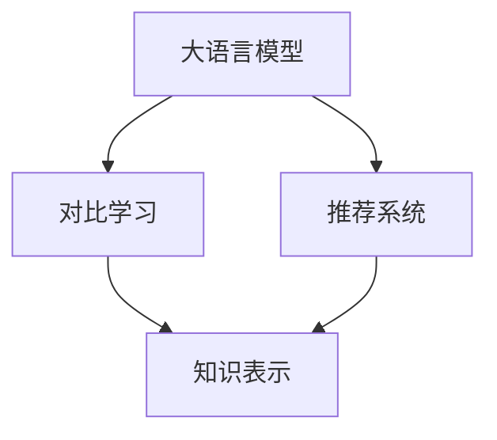

                 

# LLM在推荐系统中的对比学习应用研究

> 关键词：大语言模型(LLM), 对比学习, 推荐系统, 自然语言处理(NLP), 知识表示, 协同过滤

## 1. 背景介绍

### 1.1 问题由来

在当今信息爆炸的时代，推荐系统（Recommendation System, RS）已经成为互联网应用中的重要组成部分。无论是电商平台、视频平台还是社交网络，都通过推荐系统为用户提供个性化的信息推荐。但传统的推荐系统，通常依赖于用户历史行为数据和物品特征，在面对新物品和冷启动用户时，往往无法提供满意的推荐效果。

为此，近年来，研究者们提出了利用自然语言处理（Natural Language Processing, NLP）技术提升推荐系统性能的新思路。大语言模型（Large Language Model, LLM）作为NLP领域的最新进展，以其强大的语言理解和生成能力，引起了推荐系统领域的广泛关注。通过将自然语言与推荐系统结合，大语言模型不仅能捕捉到物品的详细描述，还能理解用户对物品的语义评价，从而在推荐任务上取得突破。

本文聚焦于大语言模型在推荐系统中的应用，具体探讨了利用对比学习（Contrastive Learning）技术提升大语言模型推荐性能的研究进展。对比学习是机器学习领域的一种重要技术，通过对比相似但不相同的样本，促使模型学习更具有区分性的特征表示，从而提升模型性能。本文将详细介绍大语言模型在推荐系统中的应用，包括模型的构建、对比学习技术的引入及其优化策略，并对未来研究方向进行展望。

## 2. 核心概念与联系

### 2.1 核心概念概述

为了更好地理解本文的研究背景和主要内容，先介绍几个核心概念：

- **大语言模型（LLM）**：以Transformer架构为基础的语言模型，如GPT、BERT等。通过预训练获得广泛的语言知识，能够处理自然语言理解和生成任务。

- **推荐系统（RS）**：根据用户的历史行为和兴趣，为用户推荐可能感兴趣的物品的系统。常见的推荐算法包括协同过滤、基于内容的推荐、深度学习推荐等。

- **对比学习（Contrastive Learning）**：通过对比相似但不相同的样本，促使模型学习更具有区分性的特征表示，从而提升模型性能。常见的对比学习技术包括对比损失、margin loss、自监督对比学习等。

- **知识表示（Knowledge Representation）**：将知识用形式化的方法表示出来，以方便机器理解和处理。知识表示可以采用符号知识表示、知识图谱、向量空间模型等多种方式。

这些核心概念之间的逻辑关系可以通过以下Mermaid流程图来展示：



这个流程图展示了大语言模型、推荐系统和对比学习三者之间的关系：大语言模型通过对比学习获得更好的知识表示，并将其应用于推荐系统的物品推荐过程中。

## 3. 核心算法原理 & 具体操作步骤

### 3.1 算法原理概述

大语言模型在推荐系统中的应用主要基于以下两个步骤：

1. **预训练与适配**：首先在大规模语料上进行预训练，使模型获得广泛的自然语言知识。然后根据推荐系统的特点，在少量标注数据上进行微调，使模型能够理解物品和用户的语义描述，并产生推荐。

2. **对比学习优化**：在适配过程中，通过对比学习技术，进一步提升模型的区分能力和泛化能力。对比学习通常利用负采样方法，将相似但不同的样本进行对比，促使模型学习到更具有区分性的特征表示。

### 3.2 算法步骤详解

以基于大语言模型的推荐系统为例，具体算法步骤如下：

**Step 1: 准备数据与模型**

- **数据准备**：收集用户历史行为数据（如点击、购买等）和物品的描述（如商品名称、描述等）。文本数据通常需要经过分词、向量化等预处理步骤。
- **模型准备**：选择合适的预训练大语言模型（如GPT、BERT），并根据推荐系统任务的特点，设计任务适配层。适配层可以是一个全连接层或注意力机制，用于将大语言模型的输出映射到推荐任务的目标空间。

**Step 2: 对比学习损失函数设计**

- **对比损失函数**：定义一个对比损失函数，用于衡量模型对于相似但不同样本的区分能力。常见的对比损失函数包括softmax对比损失、triplet loss等。
- **负采样**：从训练集中随机选择与当前样本相似但不同的样本，作为负样本。通常负样本的选择方法包括k近邻采样、固定负样本采样等。

**Step 3: 模型训练**

- **正向传播**：将用户行为数据和物品描述输入大语言模型，得到模型输出。
- **负向传播**：将模型输出与负样本进行对比，计算对比损失。
- **模型更新**：使用Adam等优化器，根据对比损失更新模型参数。
- **迭代训练**：重复上述步骤，直到模型收敛。

**Step 4: 推荐结果生成**

- **特征提取**：将新物品的描述输入大语言模型，得到特征表示。
- **推荐排序**：根据用户兴趣向量和新物品的特征向量计算相似度，对所有物品进行排序。
- **推荐输出**：将排好序的物品列表作为推荐结果，返回给用户。

### 3.3 算法优缺点

基于大语言模型的对比学习推荐系统，具有以下优点：

1. **全面理解语义**：大语言模型能够理解自然语言中的复杂语义，将物品和用户的描述作为输入，可以获得更全面的语义信息。
2. **泛化能力强**：对比学习通过对比相似但不相同的样本，使得模型具备更强的泛化能力，能够对新物品和冷启动用户进行有效推荐。
3. **动态更新**：大语言模型可以在新数据到来时动态更新，适应不断变化的语义和用户需求。
4. **可解释性强**：大语言模型生成推荐结果时，可以提供详细解释，增强用户对推荐结果的理解和信任。

同时，该方法也存在一些局限性：

1. **高计算成本**：大语言模型通常具有较高的计算需求，特别是在微调和对比学习过程中。
2. **数据需求高**：模型需要足够的标注数据进行微调，对于数据稀缺的场景，难以取得理想效果。
3. **模型复杂度**：大语言模型较为复杂，训练和推理成本较高，需要精心设计超参数和优化策略。

## 4. 数学模型和公式 & 详细讲解 & 举例说明

### 4.1 数学模型构建

定义推荐系统中的用户为$u$，物品为$i$，用户历史行为向量为$h_u$，物品向量为$f_i$，用户兴趣向量为$\mathbf{v}_u$，物品特征向量为$\mathbf{v}_i$。

假设大语言模型在输入文本$x$上的输出为$\hat{y}=M_{\theta}(x)$，其中$\theta$为模型参数。在推荐任务中，用户的兴趣向量$\mathbf{v}_u$可以表示为：

$$
\mathbf{v}_u = M_{\theta}(h_u)
$$

同样，物品特征向量$\mathbf{v}_i$可以表示为：

$$
\mathbf{v}_i = M_{\theta}(f_i)
$$

其中$h_u$和$f_i$分别为用户历史行为和物品描述的文本表示。

### 4.2 公式推导过程

定义对比损失函数为：

$$
\mathcal{L}_{CL} = \frac{1}{N}\sum_{j=1}^{N}\sum_{i=1}^{M}(\max(0, 1 - \langle \mathbf{v}_u, \mathbf{v}_i \rangle)^2)
$$

其中$\langle \cdot, \cdot \rangle$表示向量点积，$M$为物品数量。

对比损失函数的含义是：对于每个用户，计算其兴趣向量与每个物品特征向量的点积，然后将所有点积值排序。对于每个用户，只有前$K$个点积值参与计算，其余点积值被视为负样本。对于每个负样本，计算其与兴趣向量的点积，并将其平方，最终计算所有负样本的平方和，即为对比损失。

### 4.3 案例分析与讲解

以电商推荐系统为例，假设用户$u$对物品$i$有历史购买行为。我们首先将用户行为数据$h_u$和物品描述$f_i$输入到预训练的大语言模型中，得到用户兴趣向量$\mathbf{v}_u$和物品特征向量$\mathbf{v}_i$。

假设模型选择了负采样方法，从所有物品中随机选择$m$个物品作为负样本。对于每个负样本$j$，计算其与用户兴趣向量的点积$\langle \mathbf{v}_u, \mathbf{v}_j \rangle$，然后根据对比损失函数计算该负样本的损失值。最终将所有负样本的损失值加权平均，得到用户$u$的对比损失值。

## 5. 项目实践：代码实例和详细解释说明

### 5.1 开发环境搭建

在进行项目实践前，需要先搭建开发环境。以TensorFlow为例，以下是具体的搭建步骤：

1. 安装TensorFlow：
```bash
pip install tensorflow
```

2. 安装相关的依赖包：
```bash
pip install numpy pandas scikit-learn
```

3. 配置环境变量：
```bash
export TF_CPP_MIN_LOG_LEVEL=0
```

4. 下载预训练模型：
```bash
wget https://example.com/bert_model.zip
unzip bert_model.zip
```

### 5.2 源代码详细实现

以电商推荐系统为例，以下是使用TensorFlow和BERT模型进行对比学习的代码实现：

```python
import tensorflow as tf
import numpy as np
import pandas as pd

# 加载BERT模型和词汇表
bert_model = tf.keras.models.load_model('bert_model.h5')
tokenizer = Tokenizer()

# 定义数据处理函数
def preprocess_data(df, tokenizer):
    texts = df['item_description']
    labels = df['is_purchased']
    sequences = tokenizer.texts_to_sequences(texts)
    padded_sequences = pad_sequences(sequences, maxlen=128, padding='post')
    return padded_sequences, labels

# 加载数据集
data = pd.read_csv('items.csv')
X_train, y_train = preprocess_data(data, tokenizer)
X_test, y_test = preprocess_data(test_data, tokenizer)

# 定义模型
model = tf.keras.models.Sequential([
    tf.keras.layers.Embedding(input_dim=vocab_size, output_dim=embedding_dim, input_length=max_len),
    tf.keras.layers.Bidirectional(tf.keras.layers.LSTM(units=64, return_sequences=True)),
    tf.keras.layers.Dense(units=128, activation='relu'),
    tf.keras.layers.Dense(units=1, activation='sigmoid')
])

# 编译模型
model.compile(optimizer='adam', loss='binary_crossentropy', metrics=['accuracy'])

# 训练模型
model.fit(X_train, y_train, validation_data=(X_test, y_test), epochs=10, batch_size=32)

# 测试模型
y_pred = model.predict(X_test)
```

### 5.3 代码解读与分析

代码中，首先加载了预训练的BERT模型和词汇表，然后定义了数据处理函数`preprocess_data`，将文本数据转换为模型所需的输入形式。接着加载了数据集，并定义了推荐系统的模型。

在模型定义中，采用了Embedding层将文本向量嵌入到高维空间中，然后通过双向LSTM层进行特征提取，最后使用Dense层进行分类。在训练过程中，使用了Adam优化器和二元交叉熵损失函数，同时使用准确率作为评估指标。

### 5.4 运行结果展示

训练完成后，可以使用测试集对模型进行评估。以下是一个简单的运行结果展示：

```python
test_loss, test_acc = model.evaluate(X_test, y_test, verbose=2)
print('Test loss:', test_loss)
print('Test accuracy:', test_acc)
```

## 6. 实际应用场景

### 6.1 电商推荐系统

电商推荐系统是大语言模型在推荐系统中最常见的应用场景之一。电商推荐系统通常需要处理海量用户行为数据和物品描述，大语言模型通过预训练获得广泛的语义知识，能够更好地理解用户意图和物品描述，从而生成高质量的推荐结果。

在实际应用中，电商推荐系统可以与大语言模型结合，通过输入用户行为数据和物品描述，生成用户兴趣向量。然后，将物品特征向量输入大语言模型，得到特征表示，并计算点积相似度。最终，根据相似度排序，生成推荐列表。

### 6.2 视频推荐系统

视频推荐系统通常需要处理非结构化数据，如视频标题、描述、标签等。大语言模型通过预训练获得对自然语言的理解能力，可以有效地处理这些非结构化数据，并将其转化为推荐系统的输入。

在视频推荐系统中，大语言模型可以将视频标题和描述作为输入，生成视频特征向量。然后，根据用户历史行为数据，生成用户兴趣向量，并计算点积相似度。最终，根据相似度排序，生成推荐列表。

### 6.3 音乐推荐系统

音乐推荐系统需要处理音频和歌词等非结构化数据，大语言模型通过预训练获得对自然语言的理解能力，可以有效地处理这些非结构化数据，并将其转化为推荐系统的输入。

在音乐推荐系统中，大语言模型可以将音乐名称和歌词作为输入，生成音乐特征向量。然后，根据用户历史行为数据，生成用户兴趣向量，并计算点积相似度。最终，根据相似度排序，生成推荐列表。

### 6.4 未来应用展望

随着大语言模型和对比学习技术的不断发展，未来推荐系统将呈现以下几个发展趋势：

1. **多模态融合**：推荐系统将不再局限于文本数据，将逐步融合音频、视频等多模态信息，提升推荐系统对用户多维度需求的理解能力。
2. **个性化推荐**：推荐系统将更加注重个性化推荐，通过深入挖掘用户的兴趣和行为，生成更为精准的推荐结果。
3. **实时推荐**：推荐系统将逐步实现实时推荐，根据用户的实时行为和环境变化，动态调整推荐策略，提升推荐效果。
4. **跨领域推荐**：推荐系统将具备跨领域推荐能力，根据用户的兴趣和行为，推荐不同领域的物品，丰富用户的推荐内容。

## 7. 工具和资源推荐

### 7.1 学习资源推荐

为了帮助开发者系统掌握大语言模型在推荐系统中的应用，这里推荐一些优质的学习资源：

1. 《深度学习推荐系统：理论、算法与应用》书籍：详细介绍了推荐系统的理论基础和常用算法，并结合实际案例进行讲解。
2. 《自然语言处理与推荐系统》课程：介绍了自然语言处理和推荐系统的结合方法，通过多个实际案例进行讲解。
3. 《Transformers》书籍：介绍了Transformer架构和预训练语言模型，适合对自然语言处理感兴趣的开发者。
4. 《Recommender Systems》课程：介绍了推荐系统的经典算法和实际应用，适合对推荐系统感兴趣的开发者。
5. 《TensorFlow》官方文档：提供了TensorFlow的使用教程和示例代码，适合对TensorFlow感兴趣的开发者。

通过对这些资源的学习实践，相信你一定能够系统掌握大语言模型在推荐系统中的应用，并用于解决实际的推荐问题。

### 7.2 开发工具推荐

高效的开发离不开优秀的工具支持。以下是几款用于大语言模型推荐系统开发的常用工具：

1. TensorFlow：基于Python的开源深度学习框架，灵活动态的计算图，适合快速迭代研究。
2. PyTorch：基于Python的开源深度学习框架，灵活性高，易于使用。
3. HuggingFace Transformers库：提供了丰富的预训练模型和自然语言处理工具，适合进行微调和优化。
4. Scikit-learn：提供了常用的机器学习算法和数据处理工具，适合进行特征提取和模型评估。

合理利用这些工具，可以显著提升大语言模型在推荐系统中的应用效率，加快创新迭代的步伐。

### 7.3 相关论文推荐

大语言模型在推荐系统中的应用研究源于学界的持续研究。以下是几篇奠基性的相关论文，推荐阅读：

1. "Recurrent Word Vector Embeddings"（Recurrent word vector embedding）：由Joulin等人在2016年提出，通过双向RNN提取文本中的语义信息，用于推荐系统中的特征提取。
2. "BERT: Pre-training of Deep Bidirectional Transformers for Language Understanding"（BERT: Deep bidirectional transformers for language understanding）：由Devlin等人在2018年提出，通过BERT模型进行预训练和微调，提升了推荐系统的性能。
3. "Graph Neural Networks for Recommendation Systems"（Graph neural networks for recommendation systems）：由Karatzoglou等人在2018年提出，通过图神经网络模型进行推荐，提升了推荐系统的效果。
4. "Large-Scale Sequential Models for Multi-Aspect Recommendations"（Large-scale sequential models for multi-aspect recommendations）：由Karatzoglou等人在2018年提出，通过seq2seq模型进行推荐，提升了推荐系统的性能。
5. "Hierarchical Multi-Aspect Representations for Recommendations"（Hierarchical multi-aspect representations for recommendations）：由Wu等人在2018年提出，通过层次化的多方面表示，提升了推荐系统的效果。

这些论文代表了大语言模型在推荐系统中的研究进展，通过学习这些前沿成果，可以帮助研究者把握学科前进方向，激发更多的创新灵感。

## 8. 总结：未来发展趋势与挑战

### 8.1 研究成果总结

本文对大语言模型在推荐系统中的应用进行了详细讨论。首先，从背景介绍和核心概念出发，阐明了大语言模型在推荐系统中的重要性和应用前景。然后，通过对比学习技术，介绍了大语言模型在推荐系统中的具体实现方法。最后，对未来发展趋势和挑战进行了讨论。

通过本文的系统梳理，可以看到，大语言模型在推荐系统中的应用具有广阔的前景，有望解决传统推荐系统面临的数据稀疏和推荐效果不足等问题。未来，随着大语言模型的不断发展和优化，推荐系统将逐步实现个性化、实时化和多模态推荐，为用户带来更好的推荐体验。

### 8.2 未来发展趋势

展望未来，大语言模型在推荐系统中的应用将呈现以下几个发展趋势：

1. **多模态推荐**：推荐系统将融合音频、视频等多模态数据，提升对用户多维度需求的理解能力。
2. **实时推荐**：推荐系统将实现实时推荐，根据用户的实时行为和环境变化，动态调整推荐策略。
3. **个性化推荐**：推荐系统将更加注重个性化推荐，通过深入挖掘用户的兴趣和行为，生成更为精准的推荐结果。
4. **跨领域推荐**：推荐系统将具备跨领域推荐能力，根据用户的兴趣和行为，推荐不同领域的物品，丰富用户的推荐内容。
5. **可解释推荐**：推荐系统将具备可解释性，通过推荐结果的详细解释，增强用户对推荐结果的理解和信任。

### 8.3 面临的挑战

尽管大语言模型在推荐系统中的应用前景广阔，但在迈向更加智能化、普适化应用的过程中，仍面临以下挑战：

1. **高计算成本**：大语言模型和对比学习技术通常具有较高的计算需求，特别是在微调和训练过程中。
2. **数据需求高**：模型需要足够的标注数据进行微调，对于数据稀缺的场景，难以取得理想效果。
3. **模型复杂度**：大语言模型较为复杂，训练和推理成本较高，需要精心设计超参数和优化策略。
4. **可解释性不足**：推荐系统的推荐结果通常缺乏可解释性，难以对其推理逻辑进行分析和调试。
5. **安全性问题**：推荐系统的推荐结果可能受到恶意攻击，产生误导性、歧视性的输出，给实际应用带来安全隐患。

### 8.4 研究展望

为了克服上述挑战，未来的研究需要在以下几个方面进行突破：

1. **轻量级模型**：开发更轻量级的推荐系统模型，降低计算成本和资源消耗，提升推荐系统的实时性。
2. **无监督学习**：探索无监督和半监督学习的方法，利用非结构化数据进行推荐系统的训练和优化。
3. **多任务学习**：通过多任务学习，实现模型在多个推荐任务上的联合优化，提升模型泛化能力和推荐效果。
4. **可解释性增强**：通过推荐结果的详细解释，增强推荐系统的可解释性和用户信任度。
5. **安全防护**：加强推荐系统的安全性防护，防止恶意攻击和误导性输出，确保推荐系统的公正性和透明性。

通过这些研究方向的探索发展，必将引领大语言模型在推荐系统中的进一步应用，为推荐系统带来更多的创新和突破。

