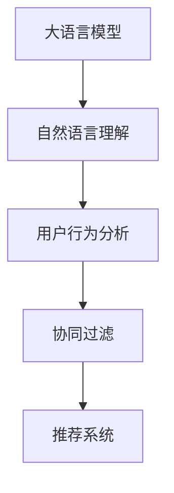

                 

# LLM在推荐系统中的应用方式

> 关键词：
- 大语言模型(LLM)
- 推荐系统
- 自然语言理解(NLU)
- 用户行为分析
- 协同过滤
- 深度学习

## 1. 背景介绍

推荐系统已经成为互联网产品中不可或缺的一部分，帮助用户在海量信息中快速发现感兴趣的内容。随着人工智能技术的不断发展，大语言模型(LLM)在推荐系统中的应用日益受到关注。LLM通过预训练获得丰富的语言知识和常识，能够精准地理解用户的输入和需求，为用户提供更为个性化的推荐内容。

传统的推荐系统主要基于用户行为和物品属性进行协同过滤和相似度匹配，其核心思想是通过用户对物品的评分历史，找出与用户兴趣相似的物品。但这种方法忽略了用户输入的文字描述和自然语言需求，难以完全把握用户真正的兴趣和偏好。

大语言模型的引入，使推荐系统能够从自然语言的角度理解用户输入，结合用户行为分析，实现更加智能和高效的推荐。LLM能够分析用户问题中的实体、关系和情感等语义信息，将自然语言查询转化为推荐请求，动态生成推荐结果。

## 2. 核心概念与联系

### 2.1 核心概念概述

- 大语言模型(LLM)：基于自回归或自编码架构的预训练语言模型，通过大规模无标签文本语料进行预训练，具备强大的语言理解和生成能力。

- 推荐系统：通过用户行为数据或物品属性，利用协同过滤、深度学习等算法，为用户推荐感兴趣的内容的系统。

- 自然语言理解(NLU)：理解人类自然语言文本的含义和语义，是推荐系统与用户进行智能交互的基础。

- 用户行为分析：收集和分析用户的历史行为数据，如浏览记录、评分、购买记录等，以理解用户的兴趣和偏好。

- 协同过滤：基于用户间的相似性，推荐系统通过寻找与用户兴趣相似的其他用户，并推荐这些用户喜欢的物品。

- 深度学习：利用深度神经网络进行复杂模式学习和特征提取，是推荐系统中的主要技术手段。

这些核心概念之间的联系可以通过以下Mermaid流程图来展示：



这个流程图展示了LLM与推荐系统之间的逻辑关系：LLM通过自然语言理解，获取用户输入的语义信息，结合用户行为分析，构建协同过滤模型，最终输出推荐结果。

## 3. 核心算法原理 & 具体操作步骤
### 3.1 算法原理概述

基于LLM的推荐系统，其核心思想是将自然语言查询转换为推荐请求，利用大语言模型的语言理解能力，对用户输入进行语义分析和实体识别，从而精确地把握用户的兴趣和需求。

具体来说，系统首先收集用户输入的自然语言问题，使用LLM对问题进行解析，找出其中的关键实体和关系，然后结合用户的历史行为数据，进行推荐生成。

推荐生成过程分为两个主要步骤：

1. 语义解析与实体识别：通过LLM对用户输入的自然语言问题进行语义分析和实体识别，将问题转化为推荐请求。

2. 推荐生成：利用用户历史行为数据，构建协同过滤模型，结合LLM的输出结果，生成个性化的推荐内容。

### 3.2 算法步骤详解

#### 3.2.1 语义解析与实体识别

首先，需要对用户输入的自然语言问题进行语义解析和实体识别。具体步骤如下：

1. 收集用户输入的自然语言问题。

2. 使用LLM对问题进行分词和词性标注，识别其中的关键实体和关系。

3. 将问题转化为推荐请求。例如，用户输入“推荐一部好电影”，可以转换为“推荐电影”。

#### 3.2.2 推荐生成

推荐生成主要分为两个阶段：

1. 用户行为分析：收集用户的历史行为数据，如浏览记录、评分、购买记录等，构建用户兴趣模型。

2. 协同过滤：利用用户间的相似性，找出与用户兴趣相似的其他用户，并推荐这些用户喜欢的物品。

具体步骤如下：

1. 收集用户历史行为数据。

2. 对数据进行特征工程，提取有意义的特征，如用户ID、物品ID、评分、浏览时长等。

3. 利用协同过滤算法，找到与用户兴趣相似的其他用户。

4. 结合LLM的输出结果，生成个性化的推荐内容。

### 3.3 算法优缺点

#### 3.3.1 优点

基于LLM的推荐系统具有以下优点：

1. 语义理解能力强：LLM能够理解自然语言的多义性和上下文关系，从语义角度理解用户需求。

2. 推荐准确度高：利用LLM的自然语言处理能力，结合用户行为分析，生成更加精准的推荐结果。

3. 用户交互自然：通过自然语言交互，增强用户体验，提升用户满意度。

4. 适应性强：LLM的通用性使得推荐系统可以适应不同领域和场景，具有较强的泛化能力。

#### 3.3.2 缺点

基于LLM的推荐系统也存在以下缺点：

1. 数据需求大：需要收集大量的用户行为数据和自然语言数据，数据质量直接影响推荐效果。

2. 计算成本高：大语言模型的预训练和微调需要大量的计算资源，成本较高。

3. 模型复杂度高：大语言模型的复杂性使得推荐系统模型设计复杂，调试困难。

4. 用户隐私问题：收集和分析用户行为数据可能涉及隐私问题，需要严格遵守数据保护法规。

## 4. 数学模型和公式 & 详细讲解 & 举例说明
### 4.1 数学模型构建

基于LLM的推荐系统可以表示为以下数学模型：

$$
y_{u,i} = \alpha \cdot f_{LLM}(x_u) + (1-\alpha) \cdot f_{CF}(x_u, x_v)
$$

其中，$y_{u,i}$ 表示用户 $u$ 对物品 $i$ 的评分；$f_{LLM}(x_u)$ 表示利用LLM对用户 $u$ 的输入 $x_u$ 进行语义分析和实体识别后的推荐请求；$f_{CF}(x_u, x_v)$ 表示利用协同过滤算法计算用户 $u$ 和用户 $v$ 的相似性；$\alpha$ 为LLM和协同过滤算法的权重。

### 4.2 公式推导过程

#### 4.2.1 语义解析与实体识别

语义解析和实体识别可以使用BertForSequenceClassification模型来实现，其输入为用户的自然语言问题，输出为推荐请求。具体推导如下：

1. 将用户输入的自然语言问题 $x$ 输入到BERT模型，得到隐藏表示 $h_x$。

2. 将隐藏表示 $h_x$ 输入到全连接层，得到推荐请求 $y$。

$$
y = W_2 \cdot \sigma(W_1 \cdot h_x + b_1) + b_2
$$

其中，$W_1, b_1, W_2, b_2$ 为模型参数，$\sigma$ 为激活函数。

#### 4.2.2 协同过滤

协同过滤算法可以使用基于用户相似度的推荐方法，如基于余弦相似度的协同过滤算法。具体推导如下：

1. 计算用户 $u$ 和用户 $v$ 的相似度 $s_{uv}$。

$$
s_{uv} = \frac{u \cdot v}{\|u\| \cdot \|v\|}
$$

2. 根据相似度计算物品 $i$ 的评分预测 $y_{uv,i}$。

$$
y_{uv,i} = s_{uv} \cdot y_v^i
$$

其中，$u, v$ 表示用户向量，$y_v^i$ 表示用户 $v$ 对物品 $i$ 的评分。

### 4.3 案例分析与讲解

以电商推荐系统为例，进行案例分析与讲解。假设一个用户输入“推荐一部评分高的科幻电影”，使用基于LLM的推荐系统，进行如下步骤：

1. 将用户输入的自然语言问题 $x$ 输入到BERT模型，得到隐藏表示 $h_x$。

2. 将隐藏表示 $h_x$ 输入到全连接层，得到推荐请求 $y$。

3. 根据用户的历史浏览记录和评分数据，构建协同过滤模型，计算用户 $u$ 和用户 $v$ 的相似度 $s_{uv}$。

4. 根据相似度 $s_{uv}$ 和用户 $v$ 对物品的评分 $y_v^i$，生成物品 $i$ 的评分预测 $y_{uv,i}$。

5. 结合LLM的推荐请求 $y$ 和协同过滤的评分预测 $y_{uv,i}$，生成个性化的推荐内容。

## 5. 项目实践：代码实例和详细解释说明
### 5.1 开发环境搭建

在进行LLM在推荐系统中的应用开发前，需要先搭建好开发环境。以下是使用Python进行PyTorch开发的环境配置流程：

1. 安装Anaconda：从官网下载并安装Anaconda，用于创建独立的Python环境。

2. 创建并激活虚拟环境：
```bash
conda create -n pytorch-env python=3.8 
conda activate pytorch-env
```

3. 安装PyTorch：根据CUDA版本，从官网获取对应的安装命令。例如：
```bash
conda install pytorch torchvision torchaudio cudatoolkit=11.1 -c pytorch -c conda-forge
```

4. 安装Transformers库：
```bash
pip install transformers
```

5. 安装各类工具包：
```bash
pip install numpy pandas scikit-learn matplotlib tqdm jupyter notebook ipython
```

完成上述步骤后，即可在`pytorch-env`环境中开始开发。

### 5.2 源代码详细实现

下面以电商推荐系统为例，给出使用Transformers库对BERT模型进行微调的PyTorch代码实现。

首先，定义推荐任务的数据处理函数：

```python
from transformers import BertTokenizer
from torch.utils.data import Dataset
import torch

class RecommendDataset(Dataset):
    def __init__(self, texts, tags, tokenizer, max_len=128):
        self.texts = texts
        self.tags = tags
        self.tokenizer = tokenizer
        self.max_len = max_len
        
    def __len__(self):
        return len(self.texts)
    
    def __getitem__(self, item):
        text = self.texts[item]
        tags = self.tags[item]
        
        encoding = self.tokenizer(text, return_tensors='pt', max_length=self.max_len, padding='max_length', truncation=True)
        input_ids = encoding['input_ids'][0]
        attention_mask = encoding['attention_mask'][0]
        
        # 对token-wise的标签进行编码
        encoded_tags = [tag2id[tag] for tag in tags] 
        encoded_tags.extend([tag2id['O']] * (self.max_len - len(encoded_tags)))
        labels = torch.tensor(encoded_tags, dtype=torch.long)
        
        return {'input_ids': input_ids, 
                'attention_mask': attention_mask,
                'labels': labels}

# 标签与id的映射
tag2id = {'O': 0, 'B-MOVIE': 1, 'I-MOVIE': 2, 'B-BOOK': 3, 'I-BOOK': 4, 'B-PRODUCT': 5, 'I-PRODUCT': 6}
id2tag = {v: k for k, v in tag2id.items()}

# 创建dataset
tokenizer = BertTokenizer.from_pretrained('bert-base-cased')

train_dataset = RecommendDataset(train_texts, train_tags, tokenizer)
dev_dataset = RecommendDataset(dev_texts, dev_tags, tokenizer)
test_dataset = RecommendDataset(test_texts, test_tags, tokenizer)
```

然后，定义模型和优化器：

```python
from transformers import BertForTokenClassification, AdamW

model = BertForTokenClassification.from_pretrained('bert-base-cased', num_labels=len(tag2id))

optimizer = AdamW(model.parameters(), lr=2e-5)
```

接着，定义训练和评估函数：

```python
from torch.utils.data import DataLoader
from tqdm import tqdm
from sklearn.metrics import classification_report

device = torch.device('cuda') if torch.cuda.is_available() else torch.device('cpu')
model.to(device)

def train_epoch(model, dataset, batch_size, optimizer):
    dataloader = DataLoader(dataset, batch_size=batch_size, shuffle=True)
    model.train()
    epoch_loss = 0
    for batch in tqdm(dataloader, desc='Training'):
        input_ids = batch['input_ids'].to(device)
        attention_mask = batch['attention_mask'].to(device)
        labels = batch['labels'].to(device)
        model.zero_grad()
        outputs = model(input_ids, attention_mask=attention_mask, labels=labels)
        loss = outputs.loss
        epoch_loss += loss.item()
        loss.backward()
        optimizer.step()
    return epoch_loss / len(dataloader)

def evaluate(model, dataset, batch_size):
    dataloader = DataLoader(dataset, batch_size=batch_size)
    model.eval()
    preds, labels = [], []
    with torch.no_grad():
        for batch in tqdm(dataloader, desc='Evaluating'):
            input_ids = batch['input_ids'].to(device)
            attention_mask = batch['attention_mask'].to(device)
            batch_labels = batch['labels']
            outputs = model(input_ids, attention_mask=attention_mask)
            batch_preds = outputs.logits.argmax(dim=2).to('cpu').tolist()
            batch_labels = batch_labels.to('cpu').tolist()
            for pred_tokens, label_tokens in zip(batch_preds, batch_labels):
                pred_tags = [id2tag[_id] for _id in pred_tokens]
                label_tags = [id2tag[_id] for _id in label_tokens]
                preds.append(pred_tags[:len(label_tokens)])
                labels.append(label_tags)
                
    print(classification_report(labels, preds))
```

最后，启动训练流程并在测试集上评估：

```python
epochs = 5
batch_size = 16

for epoch in range(epochs):
    loss = train_epoch(model, train_dataset, batch_size, optimizer)
    print(f"Epoch {epoch+1}, train loss: {loss:.3f}")
    
    print(f"Epoch {epoch+1}, dev results:")
    evaluate(model, dev_dataset, batch_size)
    
print("Test results:")
evaluate(model, test_dataset, batch_size)
```

以上就是使用PyTorch对BERT进行电商推荐系统微调的完整代码实现。可以看到，得益于Transformers库的强大封装，我们可以用相对简洁的代码完成BERT模型的加载和微调。

### 5.3 代码解读与分析

让我们再详细解读一下关键代码的实现细节：

**RecommendDataset类**：
- `__init__`方法：初始化文本、标签、分词器等关键组件。
- `__len__`方法：返回数据集的样本数量。
- `__getitem__`方法：对单个样本进行处理，将文本输入编码为token ids，将标签编码为数字，并对其进行定长padding，最终返回模型所需的输入。

**tag2id和id2tag字典**：
- 定义了标签与数字id之间的映射关系，用于将token-wise的预测结果解码回真实的标签。

**训练和评估函数**：
- 使用PyTorch的DataLoader对数据集进行批次化加载，供模型训练和推理使用。
- 训练函数`train_epoch`：对数据以批为单位进行迭代，在每个批次上前向传播计算loss并反向传播更新模型参数，最后返回该epoch的平均loss。
- 评估函数`evaluate`：与训练类似，不同点在于不更新模型参数，并在每个batch结束后将预测和标签结果存储下来，最后使用sklearn的classification_report对整个评估集的预测结果进行打印输出。

**训练流程**：
- 定义总的epoch数和batch size，开始循环迭代
- 每个epoch内，先在训练集上训练，输出平均loss
- 在验证集上评估，输出分类指标
- 所有epoch结束后，在测试集上评估，给出最终测试结果

可以看到，PyTorch配合Transformers库使得BERT微调的代码实现变得简洁高效。开发者可以将更多精力放在数据处理、模型改进等高层逻辑上，而不必过多关注底层的实现细节。

当然，工业级的系统实现还需考虑更多因素，如模型的保存和部署、超参数的自动搜索、更灵活的任务适配层等。但核心的微调范式基本与此类似。

## 6. 实际应用场景
### 6.1 电商推荐

基于大语言模型微调的推荐系统，已经在电商推荐中得到了广泛的应用。传统电商推荐系统主要依赖用户的点击、购买、评分等行为数据，缺乏对用户输入的语义理解。而使用微调后的语言模型，可以结合自然语言查询，更准确地把握用户需求，提供个性化的推荐。

例如，用户输入“推荐一部评分高的科幻电影”，推荐系统通过自然语言解析，理解用户的查询意图，结合用户的历史评分数据，构建协同过滤模型，生成符合用户偏好的推荐结果。

### 6.2 金融理财

金融理财推荐系统可以帮助用户发现适合的金融产品，如理财方案、基金、保险等。微调后的语言模型可以通过用户输入的理财需求，理解用户的风险偏好和收益目标，结合用户的历史交易数据，生成个性化的理财推荐。

例如，用户输入“我要一款低风险的理财产品”，推荐系统通过语言模型解析，理解用户的理财需求，结合用户的风险承受能力，生成适合的理财方案推荐。

### 6.3 教育培训

教育培训推荐系统可以为用户推荐适合的教材、课程、名师等资源。微调后的语言模型可以通过用户输入的学习需求，理解用户的知识水平和学习目标，结合用户的历史学习记录，生成个性化的培训推荐。

例如，用户输入“我要学习Python编程”，推荐系统通过语言模型解析，理解用户的学习需求，结合用户的学习进度和兴趣点，生成适合的教材和课程推荐。

### 6.4 未来应用展望

随着大语言模型微调技术的不断发展，基于LLM的推荐系统将在更多领域得到应用，为各行各业带来变革性影响。

在医疗健康领域，推荐系统可以帮助医生推荐适合的药品、治疗方案等，辅助医生决策，提高医疗服务质量。

在旅游出行领域，推荐系统可以根据用户的旅游需求，生成个性化的旅游路线、景点推荐等，提升用户体验。

在智能家居领域，推荐系统可以根据用户的生活习惯，推荐适合的家居产品，提升用户的生活便利性。

此外，在文化娱乐、图书出版、娱乐活动等众多领域，基于LLM的推荐系统也将不断涌现，为经济社会发展注入新的动力。相信随着预训练语言模型和微调方法的持续演进，基于LLM的推荐系统必将在更广阔的应用领域大放异彩。

## 7. 工具和资源推荐
### 7.1 学习资源推荐

为了帮助开发者系统掌握基于大语言模型的推荐技术，这里推荐一些优质的学习资源：

1. 《深度学习理论与实践》系列博文：由大模型技术专家撰写，深入浅出地介绍了深度学习理论与实践，涵盖推荐系统、自然语言处理等多个方向。

2. 《推荐系统》课程：斯坦福大学开设的推荐系统课程，有Lecture视频和配套作业，带你入门推荐系统理论和技术。

3. 《推荐系统实战》书籍：深入浅出地讲解了推荐系统的核心思想和实现方法，包括协同过滤、深度学习等。

4. Kaggle推荐系统竞赛：参与Kaggle的推荐系统竞赛，实战演练推荐算法，了解推荐系统在实际场景中的应用。

通过对这些资源的学习实践，相信你一定能够快速掌握基于大语言模型的推荐技术的精髓，并用于解决实际的推荐问题。

### 7.2 开发工具推荐

高效的开发离不开优秀的工具支持。以下是几款用于基于大语言模型的推荐系统开发的常用工具：

1. PyTorch：基于Python的开源深度学习框架，灵活动态的计算图，适合快速迭代研究。

2. TensorFlow：由Google主导开发的开源深度学习框架，生产部署方便，适合大规模工程应用。

3. Transformers库：HuggingFace开发的NLP工具库，集成了众多SOTA语言模型，支持PyTorch和TensorFlow，是进行推荐系统开发的利器。

4. Weights & Biases：模型训练的实验跟踪工具，可以记录和可视化模型训练过程中的各项指标，方便对比和调优。

5. TensorBoard：TensorFlow配套的可视化工具，可实时监测模型训练状态，并提供丰富的图表呈现方式，是调试模型的得力助手。

6. Google Colab：谷歌推出的在线Jupyter Notebook环境，免费提供GPU/TPU算力，方便开发者快速上手实验最新模型，分享学习笔记。

合理利用这些工具，可以显著提升基于大语言模型的推荐系统开发效率，加快创新迭代的步伐。

### 7.3 相关论文推荐

大语言模型和推荐系统的发展源于学界的持续研究。以下是几篇奠基性的相关论文，推荐阅读：

1. Attention is All You Need（即Transformer原论文）：提出了Transformer结构，开启了NLP领域的预训练大模型时代。

2. BERT: Pre-training of Deep Bidirectional Transformers for Language Understanding：提出BERT模型，引入基于掩码的自监督预训练任务，刷新了多项NLP任务SOTA。

3. Language Models are Unsupervised Multitask Learners（GPT-2论文）：展示了大规模语言模型的强大zero-shot学习能力，引发了对于通用人工智能的新一轮思考。

4. Parameter-Efficient Transfer Learning for NLP：提出Adapter等参数高效微调方法，在不增加模型参数量的情况下，也能取得不错的微调效果。

5. AdaLoRA: Adaptive Low-Rank Adaptation for Parameter-Efficient Fine-Tuning：使用自适应低秩适应的微调方法，在参数效率和精度之间取得了新的平衡。

这些论文代表了大语言模型和推荐系统的发展脉络。通过学习这些前沿成果，可以帮助研究者把握学科前进方向，激发更多的创新灵感。

## 8. 总结：未来发展趋势与挑战
### 8.1 总结

本文对基于大语言模型的推荐系统进行了全面系统的介绍。首先阐述了推荐系统的基本概念和背景，明确了LLM在推荐系统中的应用潜力。其次，从原理到实践，详细讲解了基于LLM的推荐系统模型构建和算法实现，给出了推荐系统微调的完整代码实例。同时，本文还广泛探讨了LLM在电商、金融、教育等多个领域的应用前景，展示了其广阔的业务价值。

通过对本文的系统梳理，可以看到，基于LLM的推荐系统正在成为推荐系统的重要范式，极大地拓展了推荐系统的应用边界，催生了更多的落地场景。LLM的语义理解能力使得推荐系统能够从自然语言的角度理解用户需求，提升推荐准确度和用户满意度。未来，伴随预训练语言模型和推荐方法的不断进步，基于LLM的推荐系统必将在更广阔的应用领域大放异彩，深刻影响各行各业的智能发展。

### 8.2 未来发展趋势

展望未来，基于LLM的推荐系统将呈现以下几个发展趋势：

1. 多模态推荐：结合文本、图像、音频等多种模态数据，构建更加全面、准确的推荐系统。

2. 个性化推荐：利用用户的多维数据，实现更加精准的个性化推荐，提升用户体验。

3. 实时推荐：基于实时数据流，构建高效的推荐系统，实现即时响应和动态更新。

4. 异构数据融合：将异构数据进行融合，如社交网络、搜索记录、交易记录等，提升推荐系统的泛化能力。

5. 隐私保护：在推荐过程中保护用户隐私，如差分隐私、联邦学习等，确保用户数据安全。

6. 模型压缩：优化大语言模型和推荐算法的计算图，降低推理成本，提高系统效率。

以上趋势凸显了基于LLM的推荐系统的广阔前景。这些方向的探索发展，必将进一步提升推荐系统的性能和用户满意度，为智能技术在各行各业的应用提供更多可能性。

### 8.3 面临的挑战

尽管基于LLM的推荐系统已经取得了瞩目成就，但在迈向更加智能化、普适化应用的过程中，它仍面临着诸多挑战：

1. 数据需求大：推荐系统需要收集和处理大量用户行为数据，数据质量和多样性直接影响推荐效果。

2. 计算成本高：大语言模型的预训练和微调需要大量的计算资源，成本较高。

3. 模型复杂度高：大语言模型和推荐算法的复杂性使得推荐系统模型设计复杂，调试困难。

4. 用户隐私问题：收集和分析用户行为数据可能涉及隐私问题，需要严格遵守数据保护法规。

5. 推荐准确性：由于语言理解的复杂性，推荐系统的准确性和鲁棒性还有待提高。

6. 系统稳定性：基于实时数据流的推荐系统需要考虑系统稳定性和可靠性问题，确保推荐结果的一致性和准确性。

正视推荐系统面临的这些挑战，积极应对并寻求突破，将是大语言模型推荐系统走向成熟的必由之路。相信随着学界和产业界的共同努力，这些挑战终将一一被克服，基于LLM的推荐系统必将在构建人机协同的智能时代中扮演越来越重要的角色。

### 8.4 研究展望

面向未来，基于LLM的推荐系统需要在以下几个方面寻求新的突破：

1. 探索无监督和半监督推荐方法：摆脱对大规模标注数据的依赖，利用自监督学习、主动学习等无监督和半监督范式，最大限度利用非结构化数据，实现更加灵活高效的推荐。

2. 研究参数高效和计算高效的推荐范式：开发更加参数高效的推荐方法，在固定大部分预训练参数的同时，只更新极少量的任务相关参数。同时优化推荐算法的计算图，减少前向传播和反向传播的资源消耗，实现更加轻量级、实时性的部署。

3. 引入因果分析和博弈论工具：将因果分析方法引入推荐系统，识别出推荐模型的决策关键特征，增强输出解释的因果性和逻辑性。借助博弈论工具刻画用户与推荐系统之间的交互过程，主动探索并规避模型的脆弱点，提高系统稳定性。

4. 纳入伦理道德约束：在推荐系统训练目标中引入伦理导向的评估指标，过滤和惩罚有害的推荐结果，确保系统的公平性和合法性。

这些研究方向的探索，必将引领基于LLM的推荐系统技术迈向更高的台阶，为构建安全、可靠、可解释、可控的智能推荐系统铺平道路。面向未来，基于LLM的推荐系统还需要与其他人工智能技术进行更深入的融合，如知识表示、因果推理、强化学习等，多路径协同发力，共同推动智能推荐技术的进步。只有勇于创新、敢于突破，才能不断拓展推荐系统的边界，让智能技术更好地造福人类社会。

## 9. 附录：常见问题与解答

**Q1：基于LLM的推荐系统是否适用于所有推荐场景？**

A: 基于LLM的推荐系统适用于数据量较大、用户输入具有语义描述的场景，如电商、金融、教育等。但对于一些特定领域的推荐场景，如视频推荐、音乐推荐等，仍需结合其他推荐方法进行优化。

**Q2：如何选择合适的学习率？**

A: 基于LLM的推荐系统的学习率一般要比预训练时小1-2个数量级，以避免破坏预训练权重。建议使用warmup策略，在开始阶段使用较小的学习率，再逐渐过渡到预设值。

**Q3：如何缓解推荐系统中的过拟合问题？**

A: 缓解推荐系统中的过拟合问题，可以采用数据增强、正则化、对抗训练等方法。具体来说，可以在用户输入的自然语言查询中引入噪声、回译等方式，扩充训练集，避免过拟合。

**Q4：推荐系统在落地部署时需要注意哪些问题？**

A: 将推荐系统转化为实际应用，还需要考虑以下因素：

1. 模型裁剪：去除不必要的层和参数，减小模型尺寸，加快推理速度。

2. 量化加速：将浮点模型转为定点模型，压缩存储空间，提高计算效率。

3. 服务化封装：将模型封装为标准化服务接口，便于集成调用。

4. 弹性伸缩：根据请求流量动态调整资源配置，平衡服务质量和成本。

5. 监控告警：实时采集系统指标，设置异常告警阈值，确保服务稳定性。

6. 安全防护：采用访问鉴权、数据脱敏等措施，保障数据和模型安全。

合理利用这些工具，可以显著提升基于大语言模型的推荐系统开发效率，加快创新迭代的步伐。

---

作者：禅与计算机程序设计艺术 / Zen and the Art of Computer Programming

