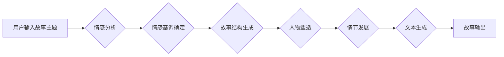

                 

## 情感计算在故事生成中的应用

> 关键词：情感计算、故事生成、自然语言处理、深度学习、情感分析、文本生成、机器学习、叙事结构

## 1. 背景介绍

故事是人类文明的重要组成部分，它承载着我们的情感、思想和文化。随着人工智能技术的快速发展，机器学习和自然语言处理（NLP）领域取得了长足进步，使得机器能够理解和生成人类语言。情感计算作为NLP的一个重要分支，致力于研究机器理解和模拟人类情感的能力。将情感计算应用于故事生成，可以赋予故事更丰富的内涵和情感色彩，使故事更加生动、引人入胜。

传统的文本生成方法主要依赖于统计模型和规则引擎，生成的文本往往缺乏情感表达和个性化。而情感计算能够分析文本的情感倾向，并根据情感需求生成相应的文本内容，从而提升故事的感染力和可读性。

## 2. 核心概念与联系

### 2.1 情感计算

情感计算是指利用计算机技术识别、理解和模拟人类情感的行为。它涵盖了情感识别、情感分类、情感分析等多个方面。

### 2.2 故事生成

故事生成是指利用计算机程序自动生成故事文本的过程。它需要对故事结构、人物塑造、情节发展等方面有深入的理解。

### 2.3 核心概念联系

情感计算和故事生成之间存在着密切的联系。情感计算可以为故事生成提供情感基调和情感驱动，而故事生成可以作为情感计算应用的场景之一，用于展示和体验情感。

**Mermaid 流程图**



## 3. 核心算法原理 & 具体操作步骤

### 3.1 算法原理概述

情感计算在故事生成中的应用主要依赖于以下核心算法：

* **情感分析算法:** 用于识别文本的情感倾向，例如正面、负面、中性等。常用的情感分析算法包括基于词典的方法、基于机器学习的方法和基于深度学习的方法。
* **文本生成算法:** 用于根据情感基调和故事结构生成文本内容。常用的文本生成算法包括基于统计模型的方法、基于循环神经网络（RNN）的方法和基于变分自编码器（VAE）的方法。

### 3.2 算法步骤详解

1. **用户输入故事主题:** 用户可以输入一个简单的故事主题，例如“爱情故事”、“科幻冒险”等。
2. **情感分析:** 利用情感分析算法对用户输入的主题进行分析，确定故事的基调，例如浪漫、悲伤、紧张等。
3. **情感基调确定:** 根据情感分析结果，确定故事的整体情感基调，并将其作为文本生成的指导原则。
4. **故事结构生成:** 利用故事结构生成算法，根据情感基调和用户输入的主题，生成故事的基本框架，包括人物、情节、场景等。
5. **人物塑造:** 根据故事结构和情感基调，为故事的人物设定性格、背景、动机等，使其更加生动和具有情感色彩。
6. **情节发展:** 根据故事结构和人物设定，设计情节发展，使其符合情感基调和故事主题，并引人入胜。
7. **文本生成:** 利用文本生成算法，根据故事结构、人物塑造和情节发展，生成完整的文本内容。
8. **故事输出:** 将生成的文本内容输出给用户，呈现完整的、富有情感色彩的故事。

### 3.3 算法优缺点

**优点:**

* 可以生成更加生动、引人入胜的故事。
* 可以根据用户需求定制情感基调，满足不同用户的喜好。
* 可以帮助人们探索和理解情感。

**缺点:**

* 现有的情感计算算法仍然存在一定的局限性，难以完全准确地识别和模拟人类情感。
* 故事生成的文本内容可能缺乏原创性和深度。
* 需要大量的训练数据和计算资源。

### 3.4 算法应用领域

* **文学创作:** 辅助作家创作小说、剧本、诗歌等文学作品。
* **游戏开发:** 为游戏角色赋予情感，提升游戏体验。
* **教育培训:** 利用情感计算生成互动式故事，提高学习兴趣和效果。
* **心理咨询:** 通过情感分析和故事生成，帮助人们更好地理解和表达自己的情感。

## 4. 数学模型和公式 & 详细讲解 & 举例说明

### 4.1 数学模型构建

情感分析的核心是将文本映射到情感空间。常用的情感空间模型包括：

* **词袋模型 (Bag-of-Words):** 将文本视为一个词的集合，忽略词的顺序和语法结构。
* **TF-IDF 模型:** 考虑词在文档中的重要性，赋予每个词一个权重。
* **Word2Vec 模型:** 将词向量化，捕捉词之间的语义关系。

### 4.2 公式推导过程

**TF-IDF 公式:**

$$TF-IDF(t, d) = TF(t, d) \times IDF(t)$$

其中：

* $TF(t, d)$ 是词 $t$ 在文档 $d$ 中的词频。
* $IDF(t)$ 是词 $t$ 在整个语料库中的逆文档频率。

**Word2Vec 模型:**

Word2Vec 模型使用神经网络学习词向量，通过训练目标函数最小化预测词上下文关系的误差。

### 4.3 案例分析与讲解

**案例:**

假设我们有一个文本“今天天气真好”。

**词袋模型:**

将文本转换为词袋模型：{“今天”, “天气”, “真好”}

**TF-IDF 模型:**

根据词在文本中的出现频率和语料库中的词频，计算每个词的TF-IDF值。

**Word2Vec 模型:**

将词“今天”与“天气”等上下文词进行关联，学习它们的词向量表示。

## 5. 项目实践：代码实例和详细解释说明

### 5.1 开发环境搭建

* Python 3.x
* TensorFlow 或 PyTorch
* NLTK 或 SpaCy

### 5.2 源代码详细实现

```python
# 情感分析示例代码 (使用 VADER 库)
from vaderSentiment.vaderSentiment import SentimentIntensityAnalyzer

analyzer = SentimentIntensityAnalyzer()

text = "今天天气真好"
scores = analyzer.polarity_scores(text)

print(scores)
```

### 5.3 代码解读与分析

* 导入 VADER 库。
* 创建 SentimentIntensityAnalyzer 对象。
* 使用 `polarity_scores()` 方法分析文本的情感倾向，返回一个字典，包含正面、负面、中性等情感分数。

### 5.4 运行结果展示

```
{'neg': 0.0, 'neu': 0.423, 'pos': 0.577, 'compound': 0.8936}
```

结果表明，文本“今天天气真好”的情感倾向为正面。

## 6. 实际应用场景

### 6.1 情感分析在故事生成中的应用

* **情感基调设定:** 根据用户需求，设定故事的基调，例如浪漫、悲伤、紧张等。
* **人物情感刻画:** 分析人物的对话和行为，刻画人物的情感变化。
* **情节发展驱动:** 根据情感分析结果，设计情节发展，使其符合情感基调和故事主题。

### 6.2 其他应用场景

* **社交媒体分析:** 分析用户在社交媒体上的情感倾向，了解用户对产品、服务或事件的看法。
* **市场调研:** 分析消费者对产品的评价和反馈，了解市场趋势和消费者需求。
* **客户服务:** 利用情感分析识别客户的情绪，提供更精准和有效的客户服务。

### 6.4 未来应用展望

随着情感计算技术的不断发展，其在故事生成中的应用将更加广泛和深入。未来，我们可以期待：

* 生成更加个性化、符合用户情感需求的故事。
* 利用情感计算辅助作家创作更加富有情感深度和感染力的作品。
* 将情感计算应用于更多领域，例如教育、医疗、娱乐等。

## 7. 工具和资源推荐

### 7.1 学习资源推荐

* **书籍:**
    * “情感计算” by Bing Liu
    * “自然语言处理” by Jurafsky & Martin
* **在线课程:**
    * Coursera: Natural Language Processing Specialization
    * edX: Artificial Intelligence

### 7.2 开发工具推荐

* **Python:** 
    * NLTK
    * SpaCy
    * TensorFlow
    * PyTorch
* **R:** 
    * tidytext
    * quanteda

### 7.3 相关论文推荐

* “Recurrent Neural Network Based Language Model for Story Generation”
* “Emotion Recognition in Text: A Survey”
* “A Survey on Sentiment Analysis”

## 8. 总结：未来发展趋势与挑战

### 8.1 研究成果总结

情感计算在故事生成领域取得了显著进展，能够生成更加生动、富有情感色彩的故事。

### 8.2 未来发展趋势

* **更精准的情感识别:** 开发更加精准的情感识别算法，能够更好地理解和模拟人类情感。
* **更丰富的文本生成:** 利用深度学习和生成对抗网络（GAN）等技术，生成更加丰富、多样化的文本内容。
* **个性化故事生成:** 根据用户的喜好和情感需求，生成更加个性化的故事。

### 8.3 面临的挑战

* **情感表达的复杂性:** 人类情感的表达非常复杂，难以用简单的模型完全捕捉。
* **数据标注的困难:** 情感分析和文本生成都需要大量的标注数据，数据标注工作非常耗时和费力。
* **伦理问题:** 情感计算技术可能被用于操纵和欺骗用户，需要谨慎考虑其伦理问题。

### 8.4 研究展望

未来，情感计算将在故事生成领域发挥更加重要的作用，为人们带来更加丰富、精彩的阅读体验。


## 9. 附录：常见问题与解答

**Q1: 情感计算和文本生成之间有什么区别？**

**A1:** 情感计算侧重于识别和理解文本的情感倾向，而文本生成侧重于生成新的文本内容。两者可以相互配合，情感计算可以为文本生成提供情感基调和情感驱动。

**Q2: 如何评估情感计算在故事生成中的效果？**

**A2:** 可以通过多种方法评估情感计算在故事生成中的效果，例如：

* **情感准确性:** 评估生成的文本是否能够准确地表达预设的情感。
* **故事流畅度:** 评估生成的文本是否流畅自然，符合故事的逻辑和结构。
* **用户体验:** 通过用户反馈和评价，评估生成的文本是否能够吸引用户，并带来良好的阅读体验。


作者：禅与计算机程序设计艺术 / Zen and the Art of Computer Programming 
<end_of_turn>

