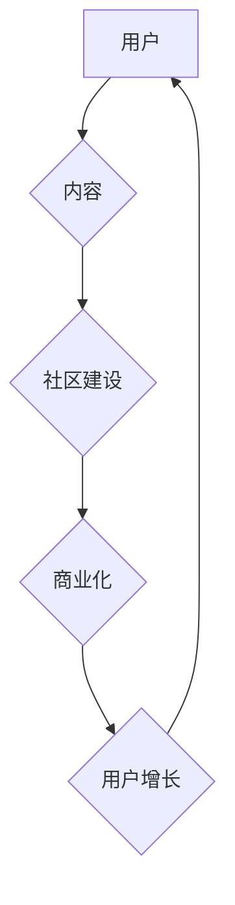

                 

## 技术社区运营：从管理到盈利模式

> 关键词：技术社区、社区运营、社区管理、盈利模式、用户增长、内容运营、商业化

### 1. 背景介绍

在当今数字时代，技术社区已成为科技创新和知识共享的重要平台。从开源软件开发到人工智能研究，从编程语言学习到数据科学应用，技术社区为开发者、研究者和爱好者提供了一个交流、协作和学习的场所。然而，仅仅建立一个技术社区远远不够，如何有效运营和管理社区，使其成为一个活跃、充满活力的生态系统，并最终实现盈利，是许多技术公司和个人面临的挑战。

### 2. 核心概念与联系

技术社区运营是一个复杂的系统工程，涉及到用户管理、内容运营、社区建设、商业化等多个方面。其核心概念可以概括为以下几个方面：

* **用户：** 技术社区的核心是用户，包括开发者、研究者、爱好者、企业等。用户参与度、活跃度和忠诚度是社区成功的关键因素。
* **内容：** 高质量、有价值的内容是吸引和留住用户的关键。内容可以包括技术文章、代码示例、教程、讨论论坛、在线问答等。
* **社区建设：** 营造一个友好的、包容的、积极的社区氛围，鼓励用户参与、交流和协作，是社区运营的关键。
* **商业化：** 技术社区可以采用多种商业化模式，例如会员订阅、广告收入、赞助合作、产品销售等。

**Mermaid 流程图：**

### 3. 核心算法原理 & 具体操作步骤

技术社区运营中，一些算法可以帮助提高社区效率和用户体验。

#### 3.1  算法原理概述

* **推荐算法：** 基于用户行为、兴趣和内容相似度，推荐相关内容和用户，提高用户参与度和留存率。
* **内容分类算法：** 自动分类和组织社区内容，方便用户查找和浏览。
* **社区活跃度算法：** 监测用户参与度、活跃度和贡献度，识别社区活跃用户和潜在问题。

#### 3.2  算法步骤详解

* **推荐算法：**
    1. 收集用户行为数据，例如浏览记录、点赞、评论、收藏等。
    2. 利用机器学习算法，例如协同过滤、内容过滤、深度学习等，构建用户兴趣模型和内容相似度模型。
    3. 根据用户兴趣和内容相似度，推荐相关内容和用户。
* **内容分类算法：**
    1. 使用自然语言处理技术，提取内容关键词和主题。
    2. 利用机器学习算法，训练内容分类模型。
    3. 将新内容分类到相应的类别。
* **社区活跃度算法：**
    1. 监测用户注册、登录、发帖、评论、点赞等行为。
    2. 计算用户参与度、活跃度和贡献度指标。
    3. 识别活跃用户和潜在问题，例如用户沉睡、内容质量下降等。

#### 3.3  算法优缺点

* **推荐算法：**
    * 优点：提高用户参与度和留存率，个性化推荐内容。
    * 缺点：可能导致信息茧房效应，算法偏差问题。
* **内容分类算法：**
    * 优点：方便用户查找和浏览内容，提高社区组织效率。
    * 缺点：分类精度可能不高，需要不断更新和调整模型。
* **社区活跃度算法：**
    * 优点：及时识别社区问题，帮助运营团队进行干预。
    * 缺点：需要收集和分析大量用户数据，可能存在隐私问题。

#### 3.4  算法应用领域

* **推荐算法：** 应用于社交媒体、电商平台、视频网站等，推荐相关内容和用户。
* **内容分类算法：** 应用于搜索引擎、新闻网站、博客平台等，分类和组织内容。
* **社区活跃度算法：** 应用于技术社区、论坛、社交平台等，监测用户参与度和活跃度，识别社区问题。

### 4. 数学模型和公式 & 详细讲解 & 举例说明

#### 4.1  数学模型构建

技术社区运营中，可以使用数学模型来量化社区发展和用户行为。例如，可以构建用户增长模型、活跃度模型、内容传播模型等。

#### 4.2  公式推导过程

* **用户增长模型：** 可以使用指数增长模型或Logistic增长模型来预测用户增长趋势。

$$
N(t) = N_0 * e^{rt}
$$

其中：

* $N(t)$ 是时间 $t$ 时刻的用户数量
* $N_0$ 是初始用户数量
* $r$ 是增长率
* $t$ 是时间

* **活跃度模型：** 可以使用泊松分布或指数分布来描述用户活跃度。

$$
P(k) = \frac{e^{-\lambda} * \lambda^k}{k!}
$$

其中：

* $P(k)$ 是在特定时间间隔内发生 $k$ 次活跃事件的概率
* $\lambda$ 是活跃事件的平均发生率

#### 4.3  案例分析与讲解

* **用户增长模型：** 假设一个技术社区的初始用户数量为 1000 人，增长率为 10% per month，则一个月后用户数量为 1100 人，两个月后用户数量为 1210 人，以此类推。
* **活跃度模型：** 假设一个技术社区的平均活跃事件发生率为 5 次 per day，则在一天内发生 0 次活跃事件的概率为 $e^{-5} * 5^0 / 0! \approx 0.0067$，发生 1 次活跃事件的概率为 $e^{-5} * 5^1 / 1! \approx 0.0337$，以此类推。

### 5. 项目实践：代码实例和详细解释说明

#### 5.1  开发环境搭建

* 选择合适的编程语言和框架，例如 Python 和 Django 或 Node.js 和 Express.js。
* 安装必要的软件包和依赖库，例如数据库、缓存、消息队列等。
* 设置开发环境，例如虚拟环境、容器化部署等。

#### 5.2  源代码详细实现

* **用户管理模块：** 实现用户注册、登录、密码重置、个人信息管理等功能。
* **内容运营模块：** 实现内容发布、分类、评论、点赞、收藏等功能。
* **社区建设模块：** 实现论坛、讨论组、在线问答等功能，鼓励用户参与和交流。
* **商业化模块：** 实现会员订阅、广告收入、赞助合作等功能。

#### 5.3  代码解读与分析

* **用户管理模块：** 使用数据库存储用户数据，实现用户身份验证和权限管理。
* **内容运营模块：** 使用内容管理系统（CMS）或博客平台，方便用户发布和管理内容。
* **社区建设模块：** 使用论坛软件或讨论组平台，提供用户交流和协作的场所。
* **商业化模块：** 使用支付平台和广告平台，实现社区的盈利模式。

#### 5.4  运行结果展示

* 部署技术社区平台，并进行测试和优化。
* 收集用户数据和反馈，不断改进社区功能和体验。

### 6. 实际应用场景

技术社区已广泛应用于各个领域，例如：

* **开源软件开发：** GitHub、GitLab、Bitbucket 等平台为开源软件开发提供了一个协作和共享的平台。
* **人工智能研究：** TensorFlow、PyTorch、HuggingFace 等社区为人工智能研究者提供了一个交流和合作的平台。
* **编程语言学习：** Stack Overflow、Reddit、Hacker News 等社区为程序员提供了一个学习和解决问题的平台。

### 6.4  未来应用展望

随着互联网和移动互联网的发展，技术社区将更加普及和多元化。未来，技术社区将更加注重用户体验、个性化推荐、人工智能应用、虚拟现实和增强现实等方面。

### 7. 工具和资源推荐

#### 7.1  学习资源推荐

* **书籍：** 《社区运营实战》、《用户增长黑客》、《内容营销 bible》
* **网站：**  
    *  社区运营相关的博客和论坛
    *  技术社区运营相关的在线课程和培训

#### 7.2  开发工具推荐

* **编程语言：** Python、JavaScript、Java、PHP 等
* **框架：** Django、Flask、Express.js、Laravel 等
* **数据库：** MySQL、PostgreSQL、MongoDB 等
* **缓存：** Redis、Memcached 等
* **消息队列：** RabbitMQ、Kafka 等

#### 7.3  相关论文推荐

* **社区运营相关的论文：**  
    *  “The Anatomy of a Successful Online Community”
    *  “Community Building: A Framework for Success”
* **技术社区运营相关的论文：**  
    *  “Building and Managing Online Communities for Software Development”
    *  “The Role of Online Communities in Open Source Software Development”

### 8. 总结：未来发展趋势与挑战

#### 8.1  研究成果总结

技术社区运营是一个不断发展和演进的领域。近年来，随着人工智能、大数据、云计算等技术的进步，技术社区运营取得了显著的成果，例如：

* **用户增长：** 利用数据分析和推荐算法，有效提高了用户增长率。
* **活跃度提升：** 利用社区建设和内容运营，提高了用户活跃度和参与度。
* **商业化模式：** 探索了多种商业化模式，实现了社区的盈利。

#### 8.2  未来发展趋势

* **人工智能应用：** 利用人工智能技术，实现更智能化的社区运营，例如自动内容分类、个性化推荐、用户行为分析等。
* **虚拟现实和增强现实：** 利用虚拟现实和增强现实技术，打造更沉浸式的社区体验，例如虚拟会议、在线培训等。
* **区块链技术：** 利用区块链技术，实现社区治理的去中心化和透明化，例如社区投票、奖励机制等。

#### 8.3  面临的挑战

* **用户隐私保护：** 收集和使用用户数据需要谨慎，确保用户隐私安全。
* **内容质量控制：** 维护社区内容的质量和健康发展是一个持续的挑战。
* **社区治理：** 如何建立一个公平、公正、高效的社区治理机制是一个重要问题。

#### 8.4  研究展望

未来，技术社区运营将继续朝着更智能化、更个性化、更去中心化的方向发展。研究者需要不断探索新的技术和方法，解决社区运营面临的挑战，为用户提供更好的体验和服务。

### 9. 附录：常见问题与解答

* **如何吸引用户加入社区？**
    * 提供有价值的内容和服务
    * 营造友好的社区氛围
    * 积极推广社区
* **如何提高用户活跃度？**
    * 定期举办活动和比赛
    * 鼓励用户参与讨论和交流
    * 提供个性化推荐和服务
* **如何实现社区盈利？**
    * 会员订阅
    * 广告收入
    * 赞助合作
    * 产品销售

作者：禅与计算机程序设计艺术 / Zen and the Art of Computer Programming 
<end_of_turn>

