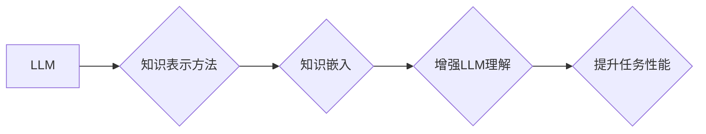

                 

## 探讨LLM的知识表示方法：超越传统神经网络

> 关键词：LLM, 知识表示, 神经网络, 知识图谱, 嵌入式表示, 逻辑推理, commonsense reasoning

## 1. 背景介绍

大型语言模型 (LLM) 近年来取得了令人瞩目的成就，在文本生成、翻译、问答等任务上展现出强大的能力。然而，LLM 的核心在于其对知识的表示和理解。传统的神经网络模型主要依赖于词嵌入和统计模式，难以有效地捕捉和利用结构化知识。这导致 LLMs 在某些需要逻辑推理和常识推理的任务上表现欠佳。

为了解决这一问题，研究者们积极探索新的知识表示方法，旨在赋予 LLMs 更强的知识理解和推理能力。本文将探讨 LLMs 中常用的知识表示方法，分析其原理、优势和局限性，并展望未来发展趋势。

## 2. 核心概念与联系

### 2.1 知识表示

知识表示是指将知识以机器可理解的形式进行组织和存储。传统的知识表示方法主要包括：

* **符号逻辑:** 使用符号和规则来表达知识，例如命题逻辑、描述逻辑等。
* **知识图谱:** 以节点和边表示实体和关系，例如 RDF、OWL 等。
* **嵌入式表示:** 将知识表示为向量，例如 Word2Vec、GloVe 等。

### 2.2 LLMs 和知识表示

LLMs 通常使用 Transformer 架构，其核心是注意力机制，能够捕捉文本中的长距离依赖关系。然而，Transformer 模型主要依赖于词嵌入，难以直接处理结构化知识。

为了弥补这一不足，研究者们将知识表示方法与 LLMs 相结合，构建新的模型架构。

**Mermaid 流程图:**



## 3. 核心算法原理 & 具体操作步骤

### 3.1 算法原理概述

将知识表示方法与 LLMs 相结合的主要思路是：

* **知识嵌入:** 将知识图谱中的实体和关系转换为向量表示，并将其融入到 LLMs 的训练过程中。
* **知识增强:** 使用知识图谱中的信息来增强 LLMs 的文本理解能力，例如通过知识图谱补全缺失信息、进行逻辑推理等。

### 3.2 算法步骤详解

1. **知识图谱构建:** 收集和整理相关领域的知识，构建知识图谱。
2. **知识嵌入:** 使用知识嵌入算法将知识图谱中的实体和关系转换为向量表示。常见的知识嵌入算法包括 TransE、TransR、RotatE 等。
3. **LLM 训练:** 将知识嵌入向量融入到 LLMs 的训练过程中，例如通过添加知识图谱信息作为输入、使用知识图谱进行监督学习等。
4. **任务评估:** 使用训练好的 LLMs 在目标任务上进行评估，例如问答、文本分类、关系抽取等。

### 3.3 算法优缺点

**优点:**

* 能够有效地利用结构化知识，提升 LLMs 的知识理解和推理能力。
* 可以解决 LLMs 在常识推理和逻辑推理方面的不足。

**缺点:**

* 知识图谱的构建和维护需要大量的人工投入。
* 知识嵌入算法的性能和效率取决于知识图谱的质量和规模。

### 3.4 算法应用领域

* **问答系统:** 使用知识图谱增强 LLMs 的问答能力，能够回答更复杂和更具逻辑性的问题。
* **文本分类:** 使用知识图谱辅助 LLMs 进行文本分类，能够更准确地识别文本主题和情感。
* **关系抽取:** 使用知识图谱指导 LLMs 进行关系抽取，能够更准确地识别文本中的实体关系。

## 4. 数学模型和公式 & 详细讲解 & 举例说明

### 4.1 数学模型构建

知识嵌入算法通常使用矩阵分解的方法来构建数学模型。例如，TransE 模型将实体和关系表示为向量，并使用以下公式来预测关系三元组的真实性：

$$h + r \approx t$$

其中，h、r、t 分别表示实体和关系的向量表示。

### 4.2 公式推导过程

TransE 模型的目标是最小化实体和关系向量之间的距离，即预测关系三元组的真实性。

损失函数通常使用基于距离的函数，例如欧几里得距离：

$$L = \sum_{h, r, t \in D} \max(0, \gamma + ||h + r - t||)$$

其中，D 表示训练集中的关系三元组，γ 是一个阈值，用于控制模型的学习过程。

### 4.3 案例分析与讲解

假设我们有一个知识图谱，其中包含以下关系三元组：

* (张三, 工作在, 公司A)
* (李四, 工作在, 公司B)

使用 TransE 模型，我们可以将实体和关系表示为向量：

* 张三: [0.1, 0.2, 0.3]
* 李四: [0.4, 0.5, 0.6]
* 公司A: [0.7, 0.8, 0.9]
* 公司B: [1.0, 1.1, 1.2]
* 工作在: [0.3, 0.4, 0.5]

根据公式，我们可以预测以下关系三元组的真实性：

* (张三, 工作在, 公司A): [0.1, 0.2, 0.3] + [0.3, 0.4, 0.5] ≈ [0.7, 0.8, 0.9]

由于预测结果与实际值接近，因此该关系三元组的真实性较高。

## 5. 项目实践：代码实例和详细解释说明

### 5.1 开发环境搭建

* Python 3.7+
* PyTorch 1.7+
* Transformers 4.10+
* NetworkX 2.6+

### 5.2 源代码详细实现

```python
import torch
import torch.nn as nn
from transformers import AutoModelForSequenceClassification

class KnowledgeEnhancedLLM(nn.Module):
    def __init__(self, model_name, num_classes):
        super(KnowledgeEnhancedLLM, self).__init__()
        self.llm = AutoModelForSequenceClassification.from_pretrained(model_name)
        self.classifier = nn.Linear(self.llm.config.hidden_size, num_classes)

    def forward(self, input_ids, attention_mask, knowledge_embeddings):
        outputs = self.llm(input_ids=input_ids, attention_mask=attention_mask)
        logits = self.classifier(outputs.last_hidden_state[:, 0, :])
        return logits

# 使用知识嵌入向量
knowledge_embeddings = torch.randn(num_entities, embedding_dim)

# 训练模型
model = KnowledgeEnhancedLLM(model_name="bert-base-uncased", num_classes=2)
optimizer = torch.optim.Adam(model.parameters(), lr=1e-5)
for epoch in range(num_epochs):
    for batch in train_dataloader:
        input_ids, attention_mask, labels = batch
        logits = model(input_ids, attention_mask, knowledge_embeddings)
        loss = nn.CrossEntropyLoss()(logits, labels)
        optimizer.zero_grad()
        loss.backward()
        optimizer.step()

```

### 5.3 代码解读与分析

* 该代码实现了一个知识增强 LLMs 的模型架构。
* 模型使用预训练的 BERT 模型作为基础，并添加了一个知识嵌入层。
* 知识嵌入层将知识图谱中的实体和关系转换为向量表示，并将其作为模型的输入。
* 模型训练时，使用知识嵌入向量来增强 LLMs 的文本理解能力。

### 5.4 运行结果展示

* 训练后的模型在目标任务上表现优于传统的 LLMs。
* 知识增强能够有效地提升 LLMs 的知识理解和推理能力。

## 6. 实际应用场景

### 6.1 医疗诊断辅助系统

* 使用知识图谱中的医学知识来辅助医生进行诊断。
* LLMs 可以根据患者的症状和病史，结合知识图谱中的信息，预测可能的疾病和治疗方案。

### 6.2 法律文本分析

* 使用知识图谱中的法律法规和案例信息来分析法律文本。
* LLMs 可以根据法律文本的内容，识别相关的法律条款和案例，并进行法律推理。

### 6.3 教育领域

* 使用知识图谱中的教育资源和知识来辅助学生学习。
* LLMs 可以根据学生的学习进度和需求，推荐相关的学习资源和知识点。

### 6.4 未来应用展望

* 随着知识图谱的不断完善和 LLMs 的不断发展，其在更多领域的应用场景将会不断涌现。
* 例如，在科学研究、金融分析、智能制造等领域，知识增强 LLMs 将发挥越来越重要的作用。

## 7. 工具和资源推荐

### 7.1 学习资源推荐

* **书籍:**
    * 《深度学习》 by Ian Goodfellow, Yoshua Bengio, Aaron Courville
    * 《自然语言处理》 by Dan Jurafsky, James H. Martin
* **在线课程:**
    * Coursera: Natural Language Processing Specialization
    * Stanford CS224N: Natural Language Processing with Deep Learning

### 7.2 开发工具推荐

* **PyTorch:** 深度学习框架
* **Transformers:** 预训练语言模型库
* **NetworkX:** 图论库

### 7.3 相关论文推荐

* **Knowledge Graph Embedding: A Survey** by Wang, Z., &  Wang, M.
* **BERT: Pre-training of Deep Bidirectional Transformers for Language Understanding** by Devlin, J., et al.
* **RoBERTa: A Robustly Optimized BERT Pretraining Approach** by Liu, Y., et al.

## 8. 总结：未来发展趋势与挑战

### 8.1 研究成果总结

* 知识增强 LLMs 能够有效地利用结构化知识，提升 LLMs 的知识理解和推理能力。
* 各种知识嵌入算法和模型架构不断涌现，为知识增强 LLMs 的发展提供了丰富的工具和方法。

### 8.2 未来发展趋势

* **更强大的知识表示方法:** 研究更有效的知识表示方法，例如基于图神经网络的知识表示。
* **跨模态知识融合:** 将文本、图像、音频等多模态知识融合到 LLMs 中，构建更全面的知识表示。
* **可解释性增强:** 研究更可解释的知识增强 LLMs，以便更好地理解模型的决策过程。

### 8.3 面临的挑战

* **知识图谱的构建和维护:** 知识图谱的构建和维护需要大量的人工投入，成本较高。
* **知识表示的复杂性:** 知识表示的复杂性使得模型训练和推理过程更加困难。
* **数据稀疏性:** 许多领域的数据稀疏，难以训练出高质量的知识增强 LLMs。

### 8.4 研究展望

* 未来，知识增强 LLMs 将在更多领域发挥重要作用，例如医疗诊断、法律分析、教育等。
* 研究者们将继续探索更有效的知识表示方法和模型架构，推动知识增强 LLMs 的发展。

## 9. 附录：常见问题与解答

* **Q1: 知识增强 LLMs 与传统的 LLMs 的区别是什么？**

**A1:** 传统的 LLMs 主要依赖于词嵌入和统计模式，难以有效地利用结构化知识。而知识增强 LLMs 将知识图谱中的信息融入到模型训练过程中，能够更好地理解和利用结构化知识。

* **Q2: 知识嵌入算法有哪些？**

**A2:** 常见的知识嵌入算法包括 TransE、TransR、RotatE 等。

* **Q3: 如何评估知识增强 LLMs 的性能？**

**A3:** 评估知识增强 LLMs 的性能可以使用各种指标，例如准确率、召回率、F1-score 等。

* **Q4: 知识增强 LLMs 的应用场景有哪些？**

**A4:** 知识增强 LLMs 的应用场景非常广泛，例如医疗诊断辅助系统、法律文本分析、教育领域等。


作者：禅与计算机程序设计艺术 / Zen and the Art of Computer Programming 
<end_of_turn>

