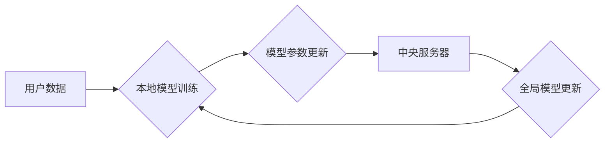

                 

## 推荐系统中的大模型联邦学习与隐私保护

> 关键词：推荐系统、联邦学习、大模型、隐私保护、数据安全、模型训练

## 1. 背景介绍

推荐系统作为互联网时代的重要组成部分，在电商、社交媒体、内容平台等领域发挥着越来越重要的作用。其核心目标是根据用户的历史行为、偏好等信息，预测用户对特定商品、内容或服务感兴趣，并提供个性化的推荐。传统的推荐系统通常依赖于集中式的数据存储和模型训练，这带来了数据隐私泄露和数据安全风险。

近年来，随着大模型的兴起，推荐系统也开始朝着大模型方向发展。大模型拥有强大的学习能力和泛化能力，能够更好地理解用户需求和提供更精准的推荐。然而，大模型的训练需要海量数据，而这些数据往往是敏感的个人信息，直接集中训练存在严重的隐私泄露风险。

联邦学习作为一种分布式机器学习方法，能够有效解决数据隐私保护问题。它允许模型在各个数据拥有者本地进行训练，无需将原始数据传输到中央服务器，从而保障数据安全和隐私。

## 2. 核心概念与联系

### 2.1 联邦学习

联邦学习是一种分布式机器学习方法，它允许模型在各个数据拥有者本地进行训练，无需将原始数据传输到中央服务器。

**联邦学习的流程如下：**

1. **模型初始化:** 中央服务器将一个初始模型分发给各个数据拥有者。
2. **本地训练:** 各个数据拥有者在本地数据上训练模型，并计算模型参数的梯度。
3. **参数聚合:** 各个数据拥有者将模型参数的梯度发送回中央服务器。中央服务器将这些梯度聚合起来，更新全局模型参数。
4. **模型更新:** 中央服务器将更新后的全局模型参数分发给各个数据拥有者。
5. **重复步骤2-4:** 直到模型达到预设的性能指标。

**联邦学习的优势:**

* **数据隐私保护:** 数据从未离开本地设备，有效保障数据安全和隐私。
* **数据安全:** 即使中央服务器被攻击，也无法获取原始数据。
* **数据多样性:** 可以利用来自不同数据源的模型，提高模型的泛化能力。

### 2.2 大模型

大模型是指参数量巨大、训练数据量庞大的深度学习模型。大模型通常具有强大的学习能力和泛化能力，能够在各种自然语言处理、计算机视觉等任务中取得优异的性能。

**大模型的优势:**

* **强大的学习能力:** 大模型拥有更多的参数，能够学习更复杂的模式。
* **更好的泛化能力:** 大模型在训练数据上表现良好，也能在未见过的数据上取得较好的性能。
* **多任务学习:** 大模型可以同时学习多个任务，提高资源利用率。

### 2.3 推荐系统

推荐系统旨在根据用户的历史行为、偏好等信息，预测用户对特定商品、内容或服务感兴趣，并提供个性化的推荐。

**推荐系统的核心技术:**

* **协同过滤:** 基于用户的相似性或物品的相似性进行推荐。
* **内容过滤:** 基于物品的特征进行推荐。
* **深度学习:** 利用深度神经网络学习用户和物品之间的复杂关系进行推荐。

**推荐系统与联邦学习和大模型的结合:**

将联邦学习和大模型结合到推荐系统中，可以有效解决数据隐私保护和模型性能提升的问题。

**联邦学习和大模型在推荐系统中的应用场景:**

* **个性化推荐:** 利用联邦学习训练个性化的推荐模型，保护用户的隐私。
* **跨平台推荐:** 利用联邦学习将来自不同平台的数据进行联合训练，提高推荐的准确性。
* **新用户推荐:** 利用联邦学习训练新用户推荐模型，降低新用户推荐的难度。

**Mermaid 流程图:**



## 3. 核心算法原理 & 具体操作步骤

### 3.1 算法原理概述

联邦学习的核心算法原理是通过迭代更新模型参数，在各个数据拥有者本地进行模型训练，最终达到全局模型的优化目标。

**具体步骤如下:**

1. **模型初始化:** 中央服务器将一个初始模型分发给各个数据拥有者。
2. **本地训练:** 各个数据拥有者在本地数据上训练模型，并计算模型参数的梯度。
3. **参数聚合:** 各个数据拥有者将模型参数的梯度发送回中央服务器。中央服务器将这些梯度聚合起来，更新全局模型参数。
4. **模型更新:** 中央服务器将更新后的全局模型参数分发给各个数据拥有者。
5. **重复步骤2-4:** 直到模型达到预设的性能指标。

### 3.2 算法步骤详解

**1. 模型初始化:**

* 中央服务器根据任务需求选择合适的模型架构，并初始化模型参数。
* 将初始化后的模型参数分发给各个数据拥有者。

**2. 本地训练:**

* 各个数据拥有者在本地数据上训练模型，并计算模型参数的梯度。
* 本地训练过程可以使用梯度下降算法或其他优化算法。

**3. 参数聚合:**

* 各个数据拥有者将模型参数的梯度发送回中央服务器。
* 中央服务器使用聚合算法将所有梯度聚合起来，更新全局模型参数。
* 聚合算法可以是平均聚合、加权平均聚合等。

**4. 模型更新:**

* 中央服务器将更新后的全局模型参数分发给各个数据拥有者。
* 各个数据拥有者将更新后的模型参数加载到本地模型中。

**5. 重复步骤2-4:**

* 重复上述步骤，直到模型达到预设的性能指标。

### 3.3 算法优缺点

**优点:**

* **数据隐私保护:** 数据从未离开本地设备，有效保障数据安全和隐私。
* **数据安全:** 即使中央服务器被攻击，也无法获取原始数据。
* **数据多样性:** 可以利用来自不同数据源的模型，提高模型的泛化能力。

**缺点:**

* **通信成本:** 模型参数的传输需要消耗网络带宽和计算资源。
* **模型性能:** 由于各个数据拥有者的数据分布可能不同，模型训练的效率和性能可能受到影响。
* **系统复杂性:** 联邦学习系统需要协调多个数据拥有者，系统复杂度较高。

### 3.4 算法应用领域

* **医疗保健:** 利用联邦学习训练医疗诊断模型，保护患者隐私。
* **金融服务:** 利用联邦学习训练欺诈检测模型，提高金融安全。
* **物联网:** 利用联邦学习训练设备管理模型，提高设备效率。
* **推荐系统:** 利用联邦学习训练个性化推荐模型，保护用户隐私。

## 4. 数学模型和公式 & 详细讲解 & 举例说明

### 4.1 数学模型构建

联邦学习的数学模型可以描述为一个迭代更新的过程，其中每个迭代步骤包含以下几个部分:

* **本地模型训练:** 每个数据拥有者在本地数据上训练模型，并计算模型参数的梯度。
* **参数聚合:** 中央服务器将所有数据拥有者的梯度聚合起来，更新全局模型参数。
* **模型更新:** 中央服务器将更新后的全局模型参数分发给每个数据拥有者。

### 4.2 公式推导过程

假设模型参数为$\theta$, 损失函数为$L(\theta, D)$, 其中$D$表示数据。

**本地模型训练:**

每个数据拥有者$i$在本地数据$D_i$上训练模型，并计算模型参数的梯度:

$\theta_i^{t+1} = \theta_i^t - \eta \nabla_{ \theta} L(\theta_i^t, D_i)$

其中，$\eta$为学习率，$t$为迭代次数。

**参数聚合:**

中央服务器将所有数据拥有者的梯度聚合起来，更新全局模型参数:

$\theta^{t+1} = \frac{1}{N} \sum_{i=1}^{N} \theta_i^{t+1}$

其中，$N$为数据拥有者的数量。

**模型更新:**

中央服务器将更新后的全局模型参数分发给每个数据拥有者。

### 4.3 案例分析与讲解

**举例说明:**

假设我们有一个推荐系统，需要训练一个模型来预测用户对商品的兴趣。

* 数据拥有者: 各个电商平台。
* 数据: 用户的购买历史、浏览记录等。
* 模型: 协同过滤模型。

利用联邦学习，我们可以训练一个个性化的推荐模型，保护用户的隐私。

每个电商平台在本地数据上训练模型，并计算模型参数的梯度。然后，将梯度发送回中央服务器。中央服务器将所有梯度聚合起来，更新全局模型参数。最后，将更新后的模型参数分发给每个电商平台。

这样，每个电商平台都可以使用全局模型来提供个性化的推荐，而用户的数据不会离开本地设备。

## 5. 项目实践：代码实例和详细解释说明

### 5.1 开发环境搭建

* **操作系统:** Linux/macOS
* **编程语言:** Python
* **深度学习框架:** TensorFlow/PyTorch
* **联邦学习库:** TensorFlow Federated/PySyft

### 5.2 源代码详细实现

```python
# 使用 TensorFlow Federated 实现联邦学习

import tensorflow as tf
from tensorflow_federated import computation_types as tff

# 定义模型
model = tf.keras.Sequential([
    tf.keras.layers.Dense(64, activation='relu'),
    tf.keras.layers.Dense(10, activation='softmax')
])

# 定义联邦学习客户端
class Client:
    def __init__(self, data):
        self.data = data

    def train(self, model, epochs):
        # 在本地数据上训练模型
        # ...

        return model

# 定义联邦学习服务器
class Server:
    def __init__(self, clients):
        self.clients = clients

    def aggregate(self, models):
        # 聚合所有客户端的模型参数
        # ...

        return model

# 训练联邦学习模型
server = Server(clients)
model = server.aggregate(clients.train(model, epochs))
```

### 5.3 代码解读与分析

* 代码首先定义了模型和联邦学习客户端和服务器的类。
* 然后，在每个客户端上训练模型，并计算模型参数的梯度。
* 最后，服务器聚合所有客户端的梯度，更新全局模型参数。

### 5.4 运行结果展示

运行结果展示可以包括模型的准确率、损失函数的变化趋势等。

## 6. 实际应用场景

### 6.1 个性化推荐

联邦学习可以用于训练个性化的推荐模型，保护用户的隐私。例如，多个电商平台可以联合训练一个推荐模型，每个平台的用户数据不会离开本地设备，而模型可以学习到用户的整体偏好，提供更精准的推荐。

### 6.2 跨平台推荐

联邦学习可以用于训练跨平台的推荐模型，利用来自不同平台的数据进行联合训练，提高推荐的准确性。例如，社交媒体平台和电商平台可以联合训练一个推荐模型，推荐用户感兴趣的商品和内容。

### 6.3 新用户推荐

联邦学习可以用于训练新用户推荐模型，降低新用户推荐的难度。例如，一个新用户加入一个平台，没有历史行为数据，可以使用联邦学习训练一个模型，利用其他用户的行为数据进行推荐。

### 6.4 未来应用展望

* **更广泛的应用场景:** 随着联邦学习技术的成熟，它将在更多领域得到应用，例如医疗保健、金融服务、物联网等。
* **更复杂的模型:** 联邦学习可以用于训练更复杂的模型，例如Transformer模型、生成对抗网络等。
* **更有效的算法:** 研究人员正在不断开发更有效的联邦学习算法，提高模型的训练效率和性能。

## 7. 工具和资源推荐

### 7.1 学习资源推荐

* **TensorFlow Federated:** https://www.tensorflow.org/federated
* **PySyft:** https://www.openmined.org/
* **联邦学习论文:** https://arxiv.org/search/?query=federated+learning&searchtype=all&source=header

### 7.2 开发工具推荐

* **TensorFlow:** https://www.tensorflow.org/
* **PyTorch:** https://pytorch.org/
* **Jupyter Notebook:** https://jupyter.org/

### 7.3 相关论文推荐

* **Federated Learning: Strategies for Improving Communication Efficiency**
* **Communication-Efficient Learning of Deep Networks from Decentralized Data**
* **On the Robustness of Federated Learning**

## 8. 总结：未来发展趋势与挑战

### 8.1 研究成果总结

联邦学习在数据隐私保护和模型性能提升方面取得了显著的成果，并逐渐成为推荐系统等领域的重要技术。

### 8.2 未来发展趋势

* **更有效的算法:** 研究人员将继续开发更有效的联邦学习算法，提高模型的训练效率和性能。
* **更广泛的应用场景:** 联邦学习将在更多领域得到应用，例如医疗保健、金融服务、物联网等。
* **更复杂的模型:** 联邦学习可以用于训练更复杂的模型，例如Transformer模型、生成对抗网络等。

### 8.3 面临的挑战

* **通信成本:** 模型参数的传输需要消耗网络带宽和计算资源。
* **模型性能:** 由于各个数据拥有者的数据分布可能不同，模型训练的效率和性能可能受到影响。
* **系统复杂性:** 联邦学习系统需要协调多个数据拥有者，系统复杂度较高。

### 8.4 研究展望

未来研究方向包括:

* 开发更有效的通信策略，降低通信成本。
* 研究如何解决数据分布不均匀的问题，提高模型性能。
* 设计更灵活和可扩展的联邦学习系统。


## 9. 附录：常见问题与解答

**1. 联邦学习和分布式训练有什么区别？**

联邦学习和分布式训练都是分布式机器学习的范式，但它们在数据处理方式上有所不同。

* **分布式训练:** 数据被分散存储在不同的机器上，模型参数也需要在这些机器之间进行同步。
* **联邦学习:** 数据从未离开本地设备，模型参数在各个数据拥有者之间进行聚合，而不是直接共享数据。

**2. 联邦学习的安全性如何保证？**

联邦学习的安全性主要通过以下方式保证:

* **数据加密:** 数据在传输过程中进行加密，防止数据泄露。
* **模型隐私保护:** 模型参数在聚合过程中进行处理，防止攻击者从模型参数中获取敏感信息。
* **授权机制:** 只有授权的用户才能访问数据和模型参数。

**3. 联邦学习的性能如何？**

联邦学习的性能取决于多种因素，例如数据分布、模型架构、算法选择等。

一般来说，联邦学习的性能与集中式训练相比可能略逊一筹，但它可以有效保护数据隐私，在某些情况下，性能损失可以被接受。

**4. 联邦学习的应用场景有哪些？**

联邦学习的应用场景非常广泛，例如:

* **推荐系统:** 个性化推荐、跨平台推荐、新用户推荐
* **医疗保健:** 医疗诊断、疾病预测
* **金融服务:** 欺诈检测、风险评估
* **物联网:** 设备管理、数据分析

**5. 联邦学习的未来发展趋势是什么？**

联邦学习的未来发展趋势包括:

* **更有效的算法:** 开发更有效的联邦学习算法，提高模型的训练效率和性能。
* **更广泛的应用场景:** 联邦学习将在更多领域得到应用。
* **更复杂的模型:** 联邦学习可以用于训练更复杂的模型。


作者：禅与计算机程序设计艺术 / Zen and the Art of Computer Programming<end_of_turn>

