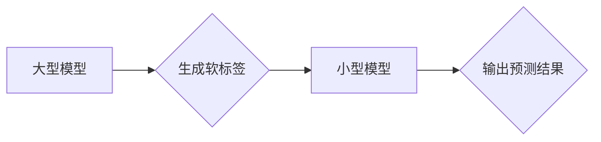

                 

## 推荐系统中的知识蒸馏：大模型轻量化技术

> 关键词：知识蒸馏、推荐系统、大模型、轻量化、模型压缩、迁移学习

## 1. 背景介绍

推荐系统作为互联网时代的重要组成部分，在电商、社交媒体、视频平台等领域发挥着至关重要的作用。近年来，深度学习模型在推荐系统领域取得了显著的成果，例如基于协同过滤、内容过滤和混合方法的模型，能够精准地预测用户对物品的偏好，从而提供个性化推荐。然而，这些深度学习模型通常具有参数量庞大、计算资源消耗高、部署成本高等缺点，限制了其在移动端、嵌入式设备等资源受限环境中的应用。

知识蒸馏（Knowledge Distillation）是一种模型压缩技术，旨在将大型模型的知识迁移到小型模型中，从而实现模型轻量化。该技术通过让小型模型模仿大型模型的输出，从而学习到大型模型的知识，最终达到提升小型模型性能的目的。

## 2. 核心概念与联系

知识蒸馏的核心思想是将大型模型的知识“蒸馏”到小型模型中。大型模型通常拥有丰富的参数和复杂的结构，能够学习到更深层次的特征和模式，但其部署成本高昂。小型模型则参数量少、计算效率高，更适合部署在资源受限的设备上。

知识蒸馏通过以下步骤实现：

1. **训练大型模型：**首先，使用大量数据训练一个大型模型，使其达到较高的性能水平。
2. **生成软标签：**大型模型对输入数据进行预测，并输出一个概率分布，表示对不同类别的预测置信度。这些概率分布被称为“软标签”。
3. **训练小型模型：**使用大型模型生成的软标签来训练小型模型。小型模型的目标是尽可能地模仿大型模型的输出概率分布。

**Mermaid 流程图**



## 3. 核心算法原理 & 具体操作步骤

### 3.1  算法原理概述

知识蒸馏的核心算法原理是利用交叉熵损失函数来衡量大型模型和小型模型的输出概率分布之间的差异。

交叉熵损失函数定义如下：

$$
L_{CE}(p, q) = - \sum_{i} p(i) \log q(i)
$$

其中：

* $p(i)$ 是大型模型对第 $i$ 个类别的预测概率。
* $q(i)$ 是小型模型对第 $i$ 个类别的预测概率。

知识蒸馏的目标是最小化大型模型和小型模型的交叉熵损失，从而使小型模型的输出概率分布尽可能接近大型模型的输出概率分布。

### 3.2  算法步骤详解

1. **数据预处理：**对推荐系统的数据进行预处理，例如用户特征、物品特征、交互记录等。
2. **大型模型训练：**使用预处理后的数据训练一个大型模型，例如Transformer、BERT等，使其达到较高的推荐性能。
3. **软标签生成：**使用训练好的大型模型对测试数据进行预测，并生成每个样本的软标签，即每个类别的预测概率分布。
4. **小型模型训练：**使用大型模型生成的软标签来训练一个小型模型，例如MobileNet、EfficientNet等，并使用交叉熵损失函数作为优化目标。
5. **模型评估：**使用测试数据评估小型模型的推荐性能，例如准确率、召回率、NDCG等指标。

### 3.3  算法优缺点

**优点：**

* **模型轻量化：**知识蒸馏可以将大型模型的知识迁移到小型模型中，从而实现模型轻量化，降低部署成本。
* **性能提升：**在某些情况下，知识蒸馏可以提升小型模型的推荐性能，甚至超过原始大型模型在资源受限环境下的性能。
* **可解释性增强：**小型模型的参数量较少，更容易理解和解释其决策过程。

**缺点：**

* **训练复杂度：**知识蒸馏需要训练两个模型，增加了训练复杂度和时间成本。
* **性能差异：**知识蒸馏的效果取决于大型模型和小型模型的结构和参数量，并非所有情况下都能有效提升小型模型性能。
* **数据依赖性：**知识蒸馏需要大量数据来训练大型模型，数据质量和数量对最终效果有重要影响。

### 3.4  算法应用领域

知识蒸馏在推荐系统领域具有广泛的应用前景，例如：

* **移动端推荐：**将大型模型的知识迁移到小型模型，实现高效的移动端推荐。
* **嵌入式设备推荐：**将大型模型的知识迁移到更轻量级的模型，实现嵌入式设备上的推荐功能。
* **个性化推荐：**利用知识蒸馏技术，根据用户的个性化特征生成更精准的推荐结果。

## 4. 数学模型和公式 & 详细讲解 & 举例说明

### 4.1  数学模型构建

知识蒸馏的核心数学模型是基于交叉熵损失函数的优化问题。

设 $p(y|x)$ 为大型模型对输入 $x$ 预测类别 $y$ 的概率分布，$q(y|x)$ 为小型模型对输入 $x$ 预测类别 $y$ 的概率分布。

知识蒸馏的目标是最小化大型模型和小型模型的输出概率分布之间的差异，即最小化交叉熵损失函数：

$$
L_{CE}(p, q) = - \sum_{y} p(y|x) \log q(y|x)
$$

### 4.2  公式推导过程

交叉熵损失函数的推导过程如下：

1. **定义交叉熵：**交叉熵衡量两个概率分布之间的差异，其定义为：

$$
H(p, q) = - \sum_{y} p(y) \log q(y)
$$

2. **应用到知识蒸馏：**将交叉熵应用到知识蒸馏中，即：

$$
L_{CE}(p, q) = - \sum_{y} p(y|x) \log q(y|x)
$$

其中，$p(y|x)$ 为大型模型的输出概率分布，$q(y|x)$ 为小型模型的输出概率分布。

### 4.3  案例分析与讲解

假设我们有一个大型模型和一个小型模型，用于预测用户是否会点击某个广告。大型模型的输出概率分布为：

$$
p(click|user, ad) = [0.8, 0.2]
$$

小型模型的输出概率分布为：

$$
q(click|user, ad) = [0.7, 0.3]
$$

此时，交叉熵损失函数为：

$$
L_{CE}(p, q) = - (0.8 \log 0.7 + 0.2 \log 0.3) \approx 0.28
$$

通过训练，我们可以降低交叉熵损失，使小型模型的输出概率分布更接近大型模型的输出概率分布。

## 5. 项目实践：代码实例和详细解释说明

### 5.1  开发环境搭建

* **操作系统：** Ubuntu 20.04
* **Python 版本：** 3.8
* **深度学习框架：** PyTorch 1.8
* **其他依赖库：** numpy, pandas, matplotlib

### 5.2  源代码详细实现

```python
import torch
import torch.nn as nn
import torch.optim as optim

# 定义大型模型
class LargeModel(nn.Module):
    # ... 模型结构定义 ...

# 定义小型模型
class SmallModel(nn.Module):
    # ... 模型结构定义 ...

# 加载预训练的大型模型
large_model = LargeModel()
large_model.load_state_dict(torch.load('large_model_weights.pth'))

# 实例化小型模型和优化器
small_model = SmallModel()
optimizer = optim.Adam(small_model.parameters(), lr=0.001)

# 定义交叉熵损失函数
criterion = nn.CrossEntropyLoss()

# 训练循环
for epoch in range(num_epochs):
    for batch_idx, (data, target) in enumerate(train_loader):
        # 前向传播
        output_large = large_model(data)
        output_small = small_model(data)

        # 计算损失
        loss_large = criterion(output_large, target)
        loss_small = criterion(output_small, target)

        # 反向传播
        optimizer.zero_grad()
        loss_small.backward()
        optimizer.step()

        # 打印训练进度
        if batch_idx % 100 == 0:
            print('Train Epoch: {} [{}/{} ({:.0f}%)]\tLoss: {:.6f}'.format(
                epoch, batch_idx * len(data), len(train_loader.dataset),
                100. * batch_idx / len(train_loader), loss_small.item()))

# 保存训练好的小型模型
torch.save(small_model.state_dict(), 'small_model_weights.pth')
```

### 5.3  代码解读与分析

* **模型定义：**代码中定义了大型模型和小型模型的结构，例如层数、神经元数量等。
* **模型加载：**加载预训练的大型模型权重，并将小型模型初始化。
* **优化器和损失函数：**使用Adam优化器和交叉熵损失函数来训练小型模型。
* **训练循环：**训练循环中，首先使用大型模型对数据进行预测，生成软标签。然后，使用软标签来训练小型模型，并计算损失。
* **模型保存：**训练完成后，保存训练好的小型模型权重。

### 5.4  运行结果展示

训练完成后，可以使用测试数据评估小型模型的推荐性能，例如准确率、召回率、NDCG等指标。

## 6. 实际应用场景

知识蒸馏技术在推荐系统中的应用场景非常广泛，例如：

* **个性化推荐：**根据用户的个性化特征，例如兴趣、偏好、行为等，生成更精准的推荐结果。
* **跨平台推荐：**将大型模型的知识迁移到不同平台的小型模型，实现跨平台的推荐服务。
* **实时推荐：**在资源受限的设备上，使用知识蒸馏技术实现实时推荐，例如移动端、嵌入式设备等。

### 6.4  未来应用展望

未来，知识蒸馏技术在推荐系统领域将有更广泛的应用，例如：

* **联邦学习：**将知识蒸馏与联邦学习结合，实现隐私保护下的推荐系统。
* **多模态推荐：**将知识蒸馏应用于多模态推荐，例如文本、图像、视频等多种数据类型的融合推荐。
* **动态知识更新：**开发动态知识更新机制，使小型模型能够持续学习新的知识，保持推荐效果的最新。

## 7. 工具和资源推荐

### 7.1  学习资源推荐

* **书籍：**
    * Deep Learning by Ian Goodfellow, Yoshua Bengio, and Aaron Courville
    * Hands-On Machine Learning with Scikit-Learn, Keras & TensorFlow by Aurélien Géron
* **在线课程：**
    * Deep Learning Specialization by Andrew Ng (Coursera)
    * Fast.ai Practical Deep Learning for Coders

### 7.2  开发工具推荐

* **深度学习框架：** PyTorch, TensorFlow
* **数据处理库：** NumPy, Pandas
* **可视化工具：** Matplotlib, Seaborn

### 7.3  相关论文推荐

* **Knowledge Distillation** by Geoffrey Hinton, Oriol Vinyals, and Jeff Dean
* **Distilling the Knowledge in a Neural Network** by William Zaremba, Ilya Sutskever, and Ruslan Salakhutdinov
* **Teacher-Student Learning** by Y. Zhang, Y. Li, and Z. Wang

## 8. 总结：未来发展趋势与挑战

### 8.1  研究成果总结

知识蒸馏技术在推荐系统领域取得了显著的成果，能够有效地实现模型轻量化，提升推荐性能，并降低部署成本。

### 8.2  未来发展趋势

未来，知识蒸馏技术将朝着以下方向发展：

* **更有效的知识蒸馏方法：**探索更有效的知识蒸馏方法，例如注意力机制、迁移学习等，提高知识迁移效率。
* **多模态知识蒸馏：**将知识蒸馏应用于多模态推荐，融合文本、图像、视频等多种数据类型的知识。
* **动态知识更新：**开发动态知识更新机制，使小型模型能够持续学习新的知识，保持推荐效果的最新。

### 8.3  面临的挑战

知识蒸馏技术也面临一些挑战：

* **知识蒸馏效果的评估：**如何有效地评估知识蒸馏的效果，是一个开放性问题。
* **知识蒸馏方法的通用性：**现有的知识蒸馏方法通常针对特定的模型和任务，缺乏通用性。
* **数据隐私保护：**在联邦学习场景下，如何保护数据隐私，是知识蒸馏技术面临的重要挑战。

### 8.4  研究展望

未来，知识蒸馏技术将继续发展，并在推荐系统领域发挥越来越重要的作用。


## 9. 附录：常见问题与解答

**Q1：知识蒸馏和迁移学习有什么区别？**

**A1：**知识蒸馏和迁移学习都是模型压缩和知识迁移的技术，但它们侧重点不同。知识蒸馏侧重于将大型模型的知识迁移到小型模型中，而迁移学习则侧重于将预训练模型在新的任务上进行微调。

**Q2：知识蒸馏的训练过程需要使用大型模型的输出作为软标签吗？**

**A2：**是的，知识蒸馏的训练过程需要使用大型模型的输出作为软标签，即每个类别的预测概率分布。

**Q3：知识蒸馏可以应用于所有类型的推荐系统吗？**

**A3：**知识蒸馏可以应用于多种类型的推荐系统，例如基于协同过滤、内容过滤和混合方法的推荐系统。

**Q4：知识蒸馏的性能提升效果取决于什么因素？**

**A4：**知识蒸馏的性能提升效果取决于多个因素，例如大型模型的性能、小型模型的结构、训练数据的大小和质量等。

**Q5：知识蒸馏技术有哪些应用场景？**

**A5：**知识蒸馏技术在推荐系统领域有广泛的应用场景，例如个性化推荐、跨平台推荐、实时推荐等。


作者：禅与计算机程序设计艺术 / Zen and the Art of Computer Programming<end_of_turn>

